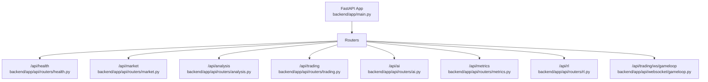
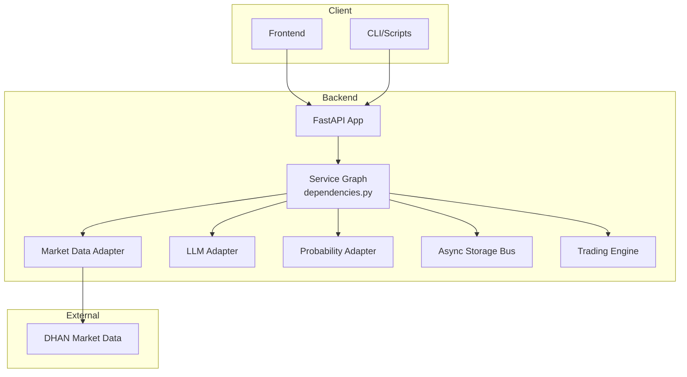
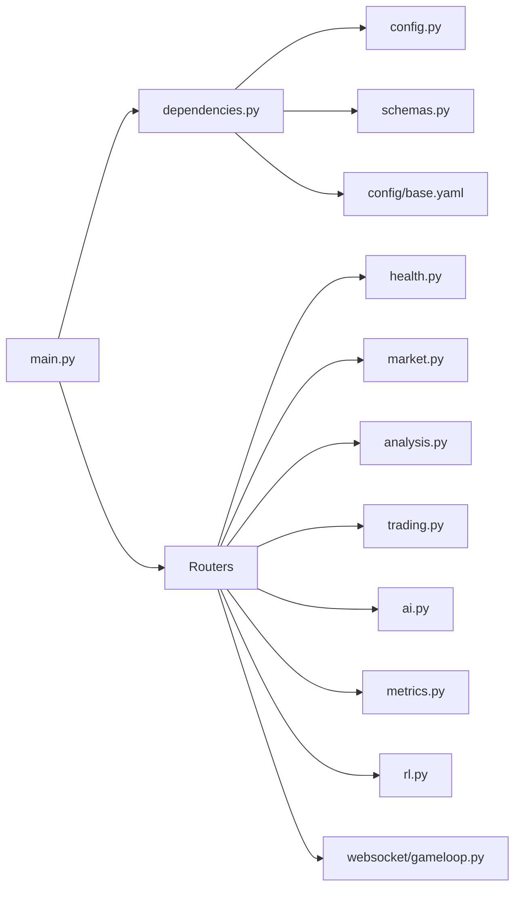
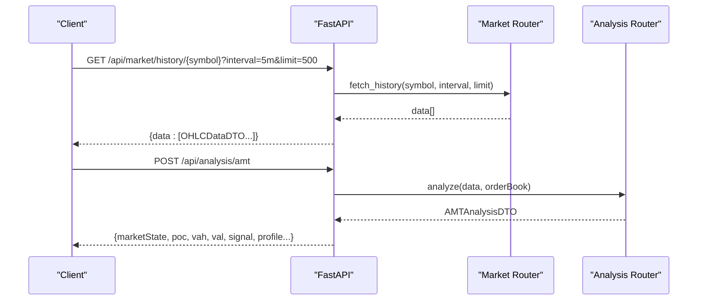
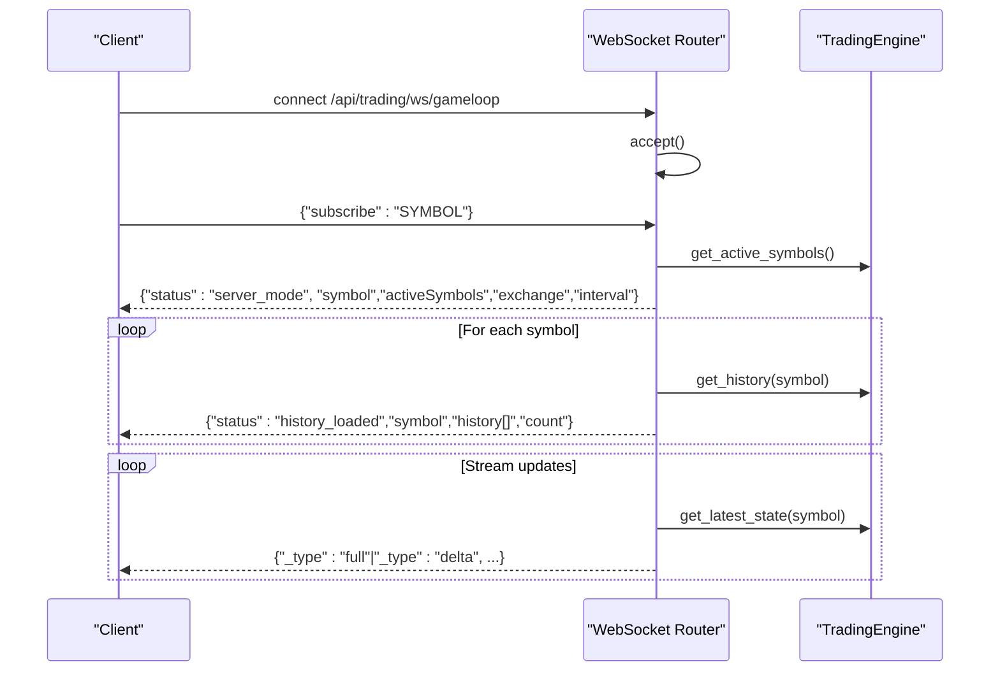

# API Reference

<cite>
**Referenced Files in This Document**
- [backend/app/main.py](file://backend/app/main.py)
- [backend/app/api/routers/health.py](file://backend/app/api/routers/health.py)
- [backend/app/api/routers/market.py](file://backend/app/api/routers/market.py)
- [backend/app/api/routers/analysis.py](file://backend/app/api/routers/analysis.py)
- [backend/app/api/routers/trading.py](file://backend/app/api/routers/trading.py)
- [backend/app/api/routers/ai.py](file://backend/app/api/routers/ai.py)
- [backend/app/api/routers/metrics.py](file://backend/app/api/routers/metrics.py)
- [backend/app/api/routers/rl.py](file://backend/app/api/routers/rl.py)
- [backend/app/api/websocket/gameloop.py](file://backend/app/api/websocket/gameloop.py)
- [backend/app/api/dependencies.py](file://backend/app/api/dependencies.py)
- [backend/app/config.py](file://backend/app/config.py)
- [backend/app/infrastructure/serialization/schemas.py](file://backend/app/infrastructure/serialization/schemas.py)
- [backend/config/base.yaml](file://backend/config/base.yaml)
- [backend/config/environments/development.yaml](file://backend/config/environments/development.yaml)
</cite>

## Table of Contents
1. [Introduction](#introduction)
2. [Project Structure](#project-structure)
3. [Core Components](#core-components)
4. [Architecture Overview](#architecture-overview)
5. [Detailed Component Analysis](#detailed-component-analysis)
6. [Dependency Analysis](#dependency-analysis)
7. [Performance Considerations](#performance-considerations)
8. [Troubleshooting Guide](#troubleshooting-guide)
9. [Conclusion](#conclusion)
10. [Appendices](#appendices)

## Introduction
This document provides a comprehensive API reference for GlassyTrade AI v5, covering:
- REST endpoints for health checks, market data, analysis, trading controls, AI interfaces, reinforcement learning, and metrics.
- WebSocket endpoints for live state streaming and viewer synchronization.
- Protocol-specific examples, error handling, rate limiting, versioning, and operational guidance.
- Client implementation guidelines, performance optimization tips, and debugging/monitoring approaches.

The backend is a FastAPI application with a modular router architecture and a service graph initialized at startup. It integrates market data, AI inference, probability engines, and trading session orchestration.

## Project Structure
The API surface is organized under a single FastAPI app that mounts multiple routers grouped by domain:
- Health and system info
- Market data
- Analysis (AMT, prediction, footprint)
- Trading lifecycle and portfolio
- AI chat and decision history
- Metrics and observability
- Reinforcement Learning
- WebSocket live state viewer

**Diagram sources**
- [backend/app/main.py:212-221](file://backend/app/main.py#L212-L221)
- [backend/app/api/routers/health.py:23-78](file://backend/app/api/routers/health.py#L23-L78)
- [backend/app/api/routers/market.py:9-46](file://backend/app/api/routers/market.py#L9-L46)
- [backend/app/api/routers/analysis.py:14-64](file://backend/app/api/routers/analysis.py#L14-L64)
- [backend/app/api/routers/trading.py:13-100](file://backend/app/api/routers/trading.py#L13-L100)
- [backend/app/api/routers/ai.py:15-281](file://backend/app/api/routers/ai.py#L15-L281)
- [backend/app/api/routers/metrics.py:13-57](file://backend/app/api/routers/metrics.py#L13-L57)
- [backend/app/api/routers/rl.py:20-203](file://backend/app/api/routers/rl.py#L20-L203)
- [backend/app/api/websocket/gameloop.py:28-356](file://backend/app/api/websocket/gameloop.py#L28-L356)

**Section sources**
- [backend/app/main.py:72-221](file://backend/app/main.py#L72-L221)

## Core Components
- FastAPI Application: Central entrypoint with CORS, rate limiting, and router mounting.
- Service Graph: Singleton dependency container created at startup, wiring adapters, services, and trackers.
- DTO Layer: Pydantic models for request/response serialization and OpenAPI documentation.
- Configuration: Environment-driven settings and YAML-based base configuration.

Key capabilities:
- Real-time market data streaming and historical retrieval.
- AI-driven market analysis and decision history.
- Trading lifecycle and portfolio state management.
- Observability via metrics and health endpoints.
- RL training/inference endpoints (lazy-loaded).
- WebSocket live viewer with delta compression and keyframe refresh.

**Section sources**
- [backend/app/main.py:171-227](file://backend/app/main.py#L171-L227)
- [backend/app/api/dependencies.py:43-327](file://backend/app/api/dependencies.py#L43-L327)
- [backend/app/infrastructure/serialization/schemas.py:1-667](file://backend/app/infrastructure/serialization/schemas.py#L1-L667)
- [backend/app/config.py:26-157](file://backend/app/config.py#L26-L157)

## Architecture Overview

**Diagram sources**
- [backend/app/main.py:83-176](file://backend/app/main.py#L83-L176)
- [backend/app/api/dependencies.py:90-124](file://backend/app/api/dependencies.py#L90-L124)
- [backend/app/config.py:96-125](file://backend/app/config.py#L96-L125)

## Detailed Component Analysis

### REST Endpoints

#### Health and System Info
- GET /api/health
  - Purpose: Health status including database, LLM, and probability engine readiness.
  - Response: Overall status and per-check details.
- GET /api/v1/metrics
  - Purpose: Pipeline metrics snapshot.
- POST /api/system/halt
  - Purpose: Emergency kill switch to halt trading.
- POST /api/system/resume
  - Purpose: Resume trading after halt.
- POST /api/system/playbook-guard/reset
  - Purpose: Reset playbook guard rejections for a symbol or active sessions.
- GET /api/system/risk-state
  - Purpose: Current risk manager state (halted, drawdown, drift alerts).
- GET /api/system/config
  - Purpose: Backend configuration for frontend auto-detection (symbols, intervals, feature flags, LLM readiness).
- POST /api/scanner/rescan
  - Purpose: Trigger option scan and update active symbols.
- GET /api/debug/memory
  - Purpose: Memory and GC stats for leak debugging.

**Section sources**
- [backend/app/api/routers/health.py:26-246](file://backend/app/api/routers/health.py#L26-L246)

#### Market Data
- GET /api/market/scan
  - Query: limit (range constrained).
  - Response: candidates list.
- GET /api/market/history/{symbol}
  - Query: interval, limit (range constrained).
  - Response: list of OHLC DTOs.
- GET /api/market/orderbook/{symbol}
  - Response: bids/asks levels or null if unavailable.

Notes:
- Order book serialization uses DTOs with camelCase aliases.
- Validation ensures non-null and positive OHLC fields.

**Section sources**
- [backend/app/api/routers/market.py:12-46](file://backend/app/api/routers/market.py#L12-L46)
- [backend/app/infrastructure/serialization/schemas.py:31-53](file://backend/app/infrastructure/serialization/schemas.py#L31-L53)

#### Analysis (AMT, Prediction, Footprint)
- POST /api/analysis/amt
  - Request: AMTRequestDTO (data: OHLC[], orderBook: optional).
  - Response: AMTAnalysisDTO with market state, POC/VWAP levels, signals, and profile.
- POST /api/analysis/predict
  - Request: PredictionRequestDTO (data, weights, count, orderBook).
  - Response: predictions (OHLC[]) and optional analysis breakdown.
- POST /api/analysis/footprint
  - Request: FootprintRequestDTO (data).
  - Response: footprint DTOs keyed by candle attributes.

Validation and conversion:
- DTOs mapped to domain value objects and back for serialization.

**Section sources**
- [backend/app/api/routers/analysis.py:22-64](file://backend/app/api/routers/analysis.py#L22-L64)
- [backend/app/infrastructure/serialization/schemas.py:332-357](file://backend/app/infrastructure/serialization/schemas.py#L332-L357)
- [backend/app/infrastructure/serialization/schemas.py:512-667](file://backend/app/infrastructure/serialization/schemas.py#L512-L667)

#### Trading Lifecycle and Portfolio
- POST /api/trading/portfolio/create
  - Response: Portfolio DTO.
- POST /api/trading/stats
  - Request: StatsRequestDTO (legacy stats computation from closed trades).
  - Response: StrategyStats DTO.
- GET /api/trading/positions/events
  - Query: positionId, symbol.
  - Response: events list with DTO conversion.
- GET /api/trading/positions/{position_id}/lifecycle
  - Response: lifecycle summary including status, prices, PnL, and event types.

Lifecycle summary logic:
- Builds a summary from append-only position events.

**Section sources**
- [backend/app/api/routers/trading.py:42-100](file://backend/app/api/routers/trading.py#L42-L100)
- [backend/app/infrastructure/serialization/schemas.py:233-281](file://backend/app/infrastructure/serialization/schemas.py#L233-L281)

#### AI Interfaces
- POST /api/ai/analyze
  - Request: MarketAnalysisRequest (ltp, delta, volume, context, key_level, aggression).
  - Response: direction, rationale, raw_output.
- POST /api/ai/command
  - Request: CommandRequest (prompt, currentConfig).
  - Response: message, configUpdates, action (UPDATE_CONFIG).
- GET /api/ai/history
  - Query: start, end, limit.
  - Response: decisions and signal_decisions.
- GET /api/ai/journal
  - Query: date, runId.
  - Response: entries.
- GET /api/ai/journal/trades
  - Query: date, runId.
  - Response: completed trades.
- GET /api/ai/journal/summary
  - Query: date, runId.
  - Response: summary.
- GET /api/ai/journal/report
  - Query: date, runId.
  - Response: attribution and symbol-level report.
- GET /api/ai/journal/compare
  - Query: start, end, runIds.
  - Response: comparison across runs.
- GET /api/ai/journal/promotion
  - Query: start, end, runIds, thresholds.
  - Response: promotion assessment.

Command parsing:
- Keyword-based symbol, interval, color, and feature toggles.

**Section sources**
- [backend/app/api/routers/ai.py:27-281](file://backend/app/api/routers/ai.py#L27-L281)

#### Metrics and Observability
- GET /api/v1/metrics/gates
  - Response: gate rejection rates per symbol and gate.
- GET /api/v1/metrics/latency
  - Response: latency percentiles per symbol.
- GET /api/v1/metrics/session-health
  - Response: combined gates and latency summary.

Trackers:
- GateRejectionTracker and LatencyTracker injected at startup.

**Section sources**
- [backend/app/api/routers/metrics.py:30-57](file://backend/app/api/routers/metrics.py#L30-L57)
- [backend/app/api/dependencies.py:164-176](file://backend/app/api/dependencies.py#L164-L176)

#### Reinforcement Learning
- POST /api/rl/train
  - Request: TrainRequest (timesteps, learning_rate, initial_equity, max_risk_pct, tick_size, data_source, verbose).
  - Response: StatusResponse (training state).
- GET /api/rl/status
  - Response: StatusResponse (state, timesteps, episodes, rewards, trades, elapsed).
- POST /api/rl/predict
  - Request: PredictRequest (observation, action_mask).
  - Response: PredictResponse (action, action_name).
- GET /api/rl/models
  - Response: list of ModelInfo (name, path, size_mb, modified).
- POST /api/rl/load/{model_name}
  - Response: success message or 404/500 on failure.

Notes:
- RL dependencies are lazily imported; missing packages return 503.

**Section sources**
- [backend/app/api/routers/rl.py:92-203](file://backend/app/api/routers/rl.py#L92-L203)

### WebSocket API

#### Live Viewer (Server-Driven Mode)
- Endpoint: /api/trading/ws/gameloop
- Mode: Server-driven streaming from TradingEngine.
- Handshake: Accept WebSocket; client sends subscribe with symbol.
- Messages:
  - Config: status=server_mode, symbol, activeSymbols, exchange, interval.
  - History: status=history_loaded, symbol, _symbol, history[], count.
  - Full snapshot: state with _type=full.
  - Delta: state with _type=delta, containing only changed fields.
- Keepalive: Periodic pong sent by server; client listens for unsubscribe.

Client-driven backward compatibility:
- Legacy mode supports sending history and tick/orderBook for local simulation.

Error handling:
- JSON decode errors, OS/network errors, runtime errors, and WebSocket disconnects are logged and handled gracefully.

Delta compression:
- Previous state cached per symbol; only changed fields included in delta messages.

Keyframe refresh:
- Full snapshots sent periodically to maintain synchronization.

**Section sources**
- [backend/app/api/websocket/gameloop.py:112-356](file://backend/app/api/websocket/gameloop.py#L112-L356)
- [backend/app/infrastructure/serialization/schemas.py:371-383](file://backend/app/infrastructure/serialization/schemas.py#L371-L383)

## Dependency Analysis

**Diagram sources**
- [backend/app/main.py:72-221](file://backend/app/main.py#L72-L221)
- [backend/app/api/dependencies.py:43-327](file://backend/app/api/dependencies.py#L43-L327)
- [backend/app/config.py:26-157](file://backend/app/config.py#L26-L157)
- [backend/config/base.yaml:1-493](file://backend/config/base.yaml#L1-L493)

**Section sources**
- [backend/app/api/dependencies.py:43-327](file://backend/app/api/dependencies.py#L43-L327)

## Performance Considerations
- Rate Limiting: In-memory middleware enforces 100 requests per minute per client IP; excessive requests return 429.
- Streaming Efficiency: WebSocket uses delta compression and periodic keyframes to minimize bandwidth.
- Asynchronous Persistence: Storage bus runs in a background thread to avoid blocking request handling.
- Model Loading: LLM model readiness is awaited at startup with validation; trading continues even if model fails to load.
- Concurrency: RL endpoints run in a dedicated ThreadPoolExecutor; training runs in background tasks.

Recommendations:
- Batch WebSocket clients per symbol to reduce state churn.
- Tune STREAM_INTERVAL and tick poll seconds for desired latency vs. throughput.
- Monitor memory and GC via debug endpoints to detect leaks early.

**Section sources**
- [backend/app/main.py:188-210](file://backend/app/main.py#L188-L210)
- [backend/app/api/websocket/gameloop.py:284-310](file://backend/app/api/websocket/gameloop.py#L284-L310)
- [backend/app/api/dependencies.py:108-112](file://backend/app/api/dependencies.py#L108-L112)

## Troubleshooting Guide
Common issues and resolutions:
- Health check failures:
  - Database readiness errors indicate storage connectivity or permissions problems.
  - LLM not ready suggests model path or GPU lock issues; verify MLX model path and environment.
- WebSocket disconnects:
  - Runtime errors and OS errors are logged; ensure client handles pong and reconnects.
  - JSON decode errors imply malformed client messages; validate payload format.
- RL endpoint 503:
  - Missing gymnasium/numpy; install RL dependencies or disable RL features.
- Rate limit 429:
  - Implement client-side throttling or increase window size if appropriate.

Monitoring:
- Use /api/debug/memory to inspect RSS, GC stats, and tracemalloc.
- Check /api/v1/metrics for gate rejection rates and latency percentiles.
- Inspect structured JSON logs emitted by the application.

**Section sources**
- [backend/app/api/routers/health.py:26-78](file://backend/app/api/routers/health.py#L26-L78)
- [backend/app/api/websocket/gameloop.py:174-196](file://backend/app/api/websocket/gameloop.py#L174-L196)
- [backend/app/api/routers/rl.py:36-41](file://backend/app/api/routers/rl.py#L36-L41)
- [backend/app/api/routers/health.py:220-246](file://backend/app/api/routers/health.py#L220-L246)

## Conclusion
GlassyTrade AI v5 offers a robust, modular REST and WebSocket API for market data, AI analysis, trading lifecycle management, and observability. The server-driven WebSocket viewer efficiently streams state deltas, while REST endpoints provide comprehensive access to analysis, metrics, and controls. Adhering to rate limits, using DTOs consistently, and leveraging the provided monitoring endpoints will help ensure reliable operation and smooth integration.

## Appendices

### Versioning and Configuration
- Application version: 2.0.0.
- Configuration sources:
  - Environment variables and YAML-based base configuration.
  - Development environment restricts symbols and relaxes risk for testing.

**Section sources**
- [backend/app/main.py:171-176](file://backend/app/main.py#L171-L176)
- [backend/app/config.py:26-157](file://backend/app/config.py#L26-L157)
- [backend/config/base.yaml:1-493](file://backend/config/base.yaml#L1-L493)
- [backend/config/environments/development.yaml:1-33](file://backend/config/environments/development.yaml#L1-L33)

### Request/Response Schemas Overview
- Market Data: OHLCDataDTO, OrderBookDTO, OrderBookLevelDTO.
- AMT/Prediction/Footprint: AMTAnalysisDTO, AIAnalysisDTO, FootprintCandleDTO, ModelWeightsDTO.
- Trading: PortfolioDTO, TradePositionDTO, StrategyStatsDTO, PositionEventDTO.
- AI Commands: ChatMessageDTO, AICommandResponseDTO.
- Requests: AMTRequestDTO, PredictionRequestDTO, FootprintRequestDTO, StatsRequestDTO, CommandRequestDTO.

**Section sources**
- [backend/app/infrastructure/serialization/schemas.py:31-667](file://backend/app/infrastructure/serialization/schemas.py#L31-L667)

### Example Workflows

#### REST Workflow: Fetch Market History and Perform AMT Analysis

**Diagram sources**
- [backend/app/api/routers/market.py:21-29](file://backend/app/api/routers/market.py#L21-L29)
- [backend/app/api/routers/analysis.py:22-27](file://backend/app/api/routers/analysis.py#L22-L27)
- [backend/app/infrastructure/serialization/schemas.py:31-53](file://backend/app/infrastructure/serialization/schemas.py#L31-L53)
- [backend/app/infrastructure/serialization/schemas.py:512-633](file://backend/app/infrastructure/serialization/schemas.py#L512-L633)

#### WebSocket Workflow: Connect Viewer and Receive Deltas

**Diagram sources**
- [backend/app/api/websocket/gameloop.py:112-356](file://backend/app/api/websocket/gameloop.py#L112-L356)

### Client Implementation Guidelines
- REST:
  - Use camelCase fields as defined by DTOs.
  - Validate request parameters (limits, intervals) before sending.
  - Handle 429 responses with exponential backoff.
- WebSocket:
  - Implement ping/pong handling; expect periodic pong.
  - Apply delta merge logic per symbol; fallback to full state on keyframe.
  - Gracefully handle disconnects and reconnect with subscribe.

### Protocol-Specific Debugging and Monitoring
- Health: Verify database and LLM readiness via /api/health.
- Metrics: Use /api/v1/metrics/gates and /api/v1/metrics/latency for gating and latency diagnostics.
- Memory: Call /api/debug/memory to detect leaks and monitor GC.
- Logs: Enable DEBUG level for enhanced audit trails.

**Section sources**
- [backend/app/api/routers/health.py:26-78](file://backend/app/api/routers/health.py#L26-L78)
- [backend/app/api/routers/metrics.py:30-57](file://backend/app/api/routers/metrics.py#L30-L57)
- [backend/app/api/routers/health.py:220-246](file://backend/app/api/routers/health.py#L220-L246)
- [backend/app/main.py:58-68](file://backend/app/main.py#L58-L68)