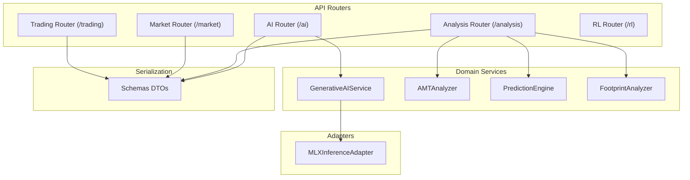
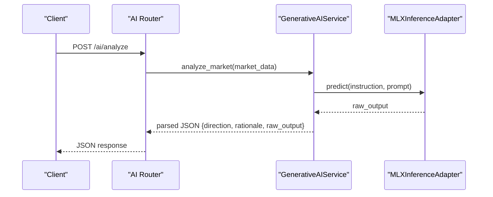
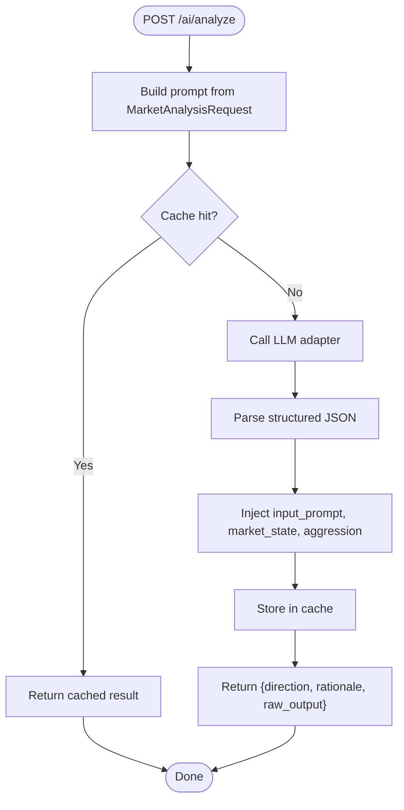
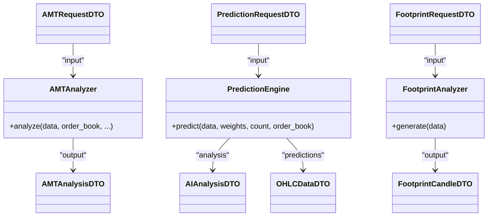
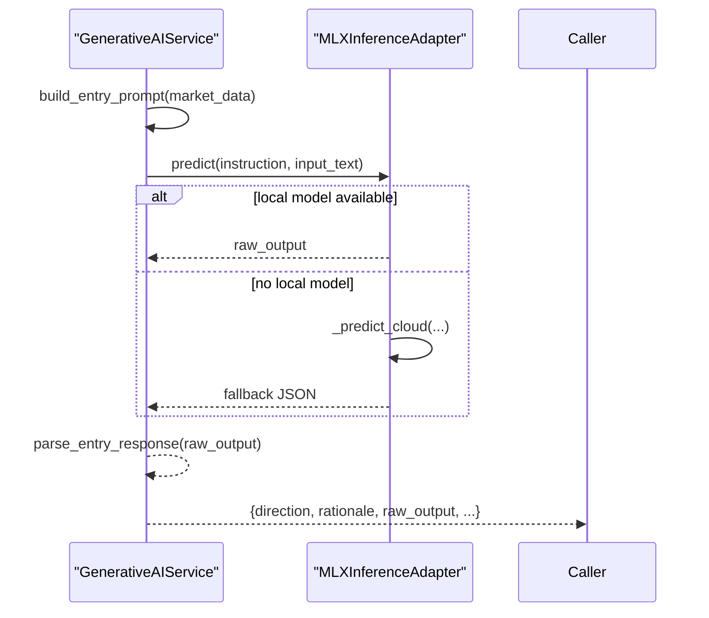
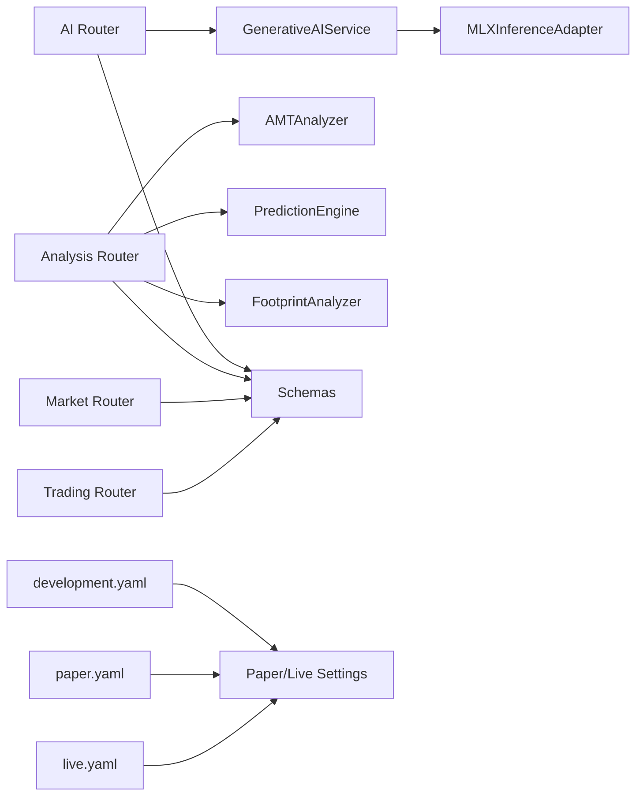

# Analysis and AI Endpoints

<cite>
**Referenced Files in This Document**
- [ai.py](file://backend/app/api/routers/ai.py)
- [analysis.py](file://backend/app/api/routers/analysis.py)
- [schemas.py](file://backend/app/infrastructure/serialization/schemas.py)
- [generative_ai_service.py](file://backend/app/domain/fabio_ai/services/generative_ai_service.py)
- [amt_analyzer.py](file://backend/app/domain/fabio_ai/services/amt_analyzer.py)
- [prediction_engine.py](file://backend/app/domain/fabio_ai/services/prediction_engine.py)
- [footprint_analyzer.py](file://backend/app/domain/fabio_ai/services/footprint_analyzer.py)
- [mlx_inference_adapter.py](file://backend/app/infrastructure/adapters/mlx_inference_adapter.py)
- [development.yaml](file://backend/config/environments/development.yaml)
- [paper.yaml](file://backend/config/environments/paper.yaml)
- [live.yaml](file://backend/config/environments/live.yaml)
</cite>

## Table of Contents
1. [Introduction](#introduction)
2. [Project Structure](#project-structure)
3. [Core Components](#core-components)
4. [Architecture Overview](#architecture-overview)
5. [Detailed Component Analysis](#detailed-component-analysis)
6. [Dependency Analysis](#dependency-analysis)
7. [Performance Considerations](#performance-considerations)
8. [Troubleshooting Guide](#troubleshooting-guide)
9. [Conclusion](#conclusion)
10. [Appendices](#appendices)

## Introduction
This document describes the GlassyTrade AI v5 API surface for analysis and AI inference endpoints. It covers:
- Retrieving Auction Market Theory (AMT) analysis results
- Market structure classifications
- AI-generated trade recommendations and probability assessments
- Request/response schemas for analysis queries, AI model inputs and outputs, and confidence scores
- Examples of requesting AI-powered insights, interpreting results, and integrating recommendations into trading workflows
- Model versioning, feature schemas, and explainability features
- Performance considerations for batch analysis and real-time inference

## Project Structure
The API endpoints are organized under dedicated routers:
- AI router: market analysis via fine-tuned LLM, command parsing, and decision history
- Analysis router: AMT, prediction, and footprint endpoints
- Market router: market data scanning and history retrieval
- Trading router: portfolio and lifecycle endpoints
- RL router: reinforcement learning training/inference endpoints

**Diagram sources**
- [ai.py:1-281](file://backend/app/api/routers/ai.py#L1-L281)
- [analysis.py:1-64](file://backend/app/api/routers/analysis.py#L1-L64)
- [schemas.py:1-667](file://backend/app/infrastructure/serialization/schemas.py#L1-L667)
- [generative_ai_service.py:1-99](file://backend/app/domain/fabio_ai/services/generative_ai_service.py#L1-L99)
- [mlx_inference_adapter.py:1-396](file://backend/app/infrastructure/adapters/mlx_inference_adapter.py#L1-L396)

**Section sources**
- [ai.py:1-281](file://backend/app/api/routers/ai.py#L1-L281)
- [analysis.py:1-64](file://backend/app/api/routers/analysis.py#L1-L64)
- [schemas.py:1-667](file://backend/app/infrastructure/serialization/schemas.py#L1-L667)

## Core Components
- AI Router
  - Endpoint: POST /ai/analyze
  - Input: MarketAnalysisRequest (LTP, delta, volume, context, key_level, aggression)
  - Output: direction, rationale, raw_output
  - Also supports command parsing and decision history retrieval
- Analysis Router
  - Endpoint: POST /analysis/amt
  - Input: AMTRequestDTO (OHLC data, optional order book)
  - Output: AMTAnalysisDTO (market state, POC, value area, LVNs/HVNs, aggression, signal, profile, etc.)
  - Endpoint: POST /analysis/predict
  - Input: PredictionRequestDTO (OHLC data, weights, count, optional order book)
  - Output: predictions (ghost candles) and AIAnalysisDTO (sentiment, confidence, quant score, factor breakdown)
  - Endpoint: POST /analysis/footprint
  - Input: FootprintRequestDTO (OHLC data)
  - Output: FootprintCandleDTO map keyed by time
- Market Router
  - GET /market/scan: candidate symbols
  - GET /market/history/{symbol}: OHLC history
  - GET /market/orderbook/{symbol}: order book
- Trading Router
  - POST /trading/portfolio/create: create portfolio
  - POST /trading/stats: compute stats from closed trades
  - GET /trading/positions/events: lifecycle events
  - GET /trading/positions/{position_id}/lifecycle: lifecycle summary
- RL Router
  - POST /rl/train: start training
  - GET /rl/status: training status
  - POST /rl/predict: inference
  - GET /rl/models: list checkpoints
  - POST /rl/load/{model_name}: load checkpoint

**Section sources**
- [ai.py:27-144](file://backend/app/api/routers/ai.py#L27-L144)
- [analysis.py:22-63](file://backend/app/api/routers/analysis.py#L22-L63)
- [schemas.py:332-356](file://backend/app/infrastructure/serialization/schemas.py#L332-L356)

## Architecture Overview
The AI endpoints integrate:
- API routers that accept DTOs and delegate to domain services
- Generative AI service orchestrating LLM inference via an adapter
- Domain services implementing AMT, prediction, and footprint logic
- Serialization layer converting domain objects to DTOs for responses

**Diagram sources**
- [ai.py:27-40](file://backend/app/api/routers/ai.py#L27-L40)
- [generative_ai_service.py:53-95](file://backend/app/domain/fabio_ai/services/generative_ai_service.py#L53-L95)
- [mlx_inference_adapter.py:184-265](file://backend/app/infrastructure/adapters/mlx_inference_adapter.py#L184-L265)

## Detailed Component Analysis

### AI Router: Market Analysis and Commands
- POST /ai/analyze
  - Request: MarketAnalysisRequest
    - ltp: float
    - delta: float, optional
    - volume: float, optional
    - context: string, optional
    - key_level: string, optional
    - aggression: string, optional
  - Response: dict with
    - direction: "LONG" | "SHORT" | "FLAT"
    - rationale: string
    - raw_output: string (optional)
- POST /ai/command
  - Parses natural-language chart/config commands into config updates and messages
  - Supports symbol switching, interval changes, color toggles, feature toggles (volume profile, predictions), and footprint mode hints
- GET /ai/history
  - Returns persisted decision history (LLM + signal decisions) with configurable limits
- GET /ai/journal*
  - Journal endpoints for entries, trades, summaries, reports, comparisons, and promotion assessments

**Diagram sources**
- [ai.py:27-40](file://backend/app/api/routers/ai.py#L27-L40)
- [generative_ai_service.py:53-95](file://backend/app/domain/fabio_ai/services/generative_ai_service.py#L53-L95)

**Section sources**
- [ai.py:18-144](file://backend/app/api/routers/ai.py#L18-L144)
- [generative_ai_service.py:26-99](file://backend/app/domain/fabio_ai/services/generative_ai_service.py#L26-L99)

### Analysis Router: AMT, Prediction, Footprint
- POST /analysis/amt
  - Input: AMTRequestDTO
    - data: list of OHLCDataDTO
    - order_book: optional OrderBookDTO
  - Output: AMTAnalysisDTO (rich AMT result including market state, POC/value area, LVNs/HVNs, aggression, signal, profile, CVD, structure, IB, breaks, MTF alignment, etc.)
- POST /analysis/predict
  - Input: PredictionRequestDTO
    - data: list of OHLCDataDTO
    - weights: ModelWeightsDTO (trend, momentum, delta, orderBook, volatility)
    - count: int (default 10)
    - order_book: optional OrderBookDTO
  - Output: dict with
    - predictions: list of OHLCDataDTO (ghost candles)
    - analysis: AIAnalysisDTO (sentiment, confidence, long_term_trend, volatility_score, quant_score, projected_price, reasoning, factor_breakdown)
- POST /analysis/footprint
  - Input: FootprintRequestDTO
    - data: list of OHLCDataDTO
  - Output: dict mapping time to FootprintCandleDTO (levels, poc_price, total_delta, step_price)

**Diagram sources**
- [analysis.py:22-63](file://backend/app/api/routers/analysis.py#L22-L63)
- [schemas.py:332-356](file://backend/app/infrastructure/serialization/schemas.py#L332-L356)
- [schemas.py:512-632](file://backend/app/infrastructure/serialization/schemas.py#L512-L632)
- [schemas.py:191-203](file://backend/app/infrastructure/serialization/schemas.py#L191-L203)
- [schemas.py:295-301](file://backend/app/infrastructure/serialization/schemas.py#L295-L301)

**Section sources**
- [analysis.py:22-63](file://backend/app/api/routers/analysis.py#L22-L63)
- [schemas.py:332-356](file://backend/app/infrastructure/serialization/schemas.py#L332-L356)
- [schemas.py:512-632](file://backend/app/infrastructure/serialization/schemas.py#L512-L632)
- [schemas.py:191-203](file://backend/app/infrastructure/serialization/schemas.py#L191-L203)
- [schemas.py:295-301](file://backend/app/infrastructure/serialization/schemas.py#L295-L301)

### Generative AI Service and Inference Adapter
- GenerativeAIService
  - Builds prompts from market data
  - Caches results keyed by MD5 of prompt input
  - Calls LLM adapter and parses structured JSON
  - Injects metadata (input prompt, market state, aggression)
- MLXInferenceAdapter
  - Loads MLX model in background
  - Supports cloud fallback via OpenRouter when no local model
  - Serializes GPU calls to avoid Metal crashes
  - Validates readiness and provides wait-until-ready

**Diagram sources**
- [generative_ai_service.py:53-95](file://backend/app/domain/fabio_ai/services/generative_ai_service.py#L53-L95)
- [mlx_inference_adapter.py:184-265](file://backend/app/infrastructure/adapters/mlx_inference_adapter.py#L184-L265)

**Section sources**
- [generative_ai_service.py:26-99](file://backend/app/domain/fabio_ai/services/generative_ai_service.py#L26-L99)
- [mlx_inference_adapter.py:12-396](file://backend/app/infrastructure/adapters/mlx_inference_adapter.py#L12-L396)

### RL Router: Training and Inference
- POST /rl/train: start training with TrainingConfig
- GET /rl/status: training status
- POST /rl/predict: inference with observation/action mask
- GET /rl/models: list saved checkpoints
- POST /rl/load/{model_name}: load a checkpoint

**Section sources**
- [rl.py:29-203](file://backend/app/api/routers/rl.py#L29-L203)

## Dependency Analysis
- API routers depend on DTOs from serialization layer
- GenerativeAIService depends on LLMInferencePort and MLXInferenceAdapter
- Analysis router depends on AMTAnalyzer, PredictionEngine, FootprintAnalyzer
- Environment configs define broker modes, risk parameters, and LLM temperature overrides

**Diagram sources**
- [ai.py:1-281](file://backend/app/api/routers/ai.py#L1-L281)
- [analysis.py:1-64](file://backend/app/api/routers/analysis.py#L1-L64)
- [schemas.py:1-667](file://backend/app/infrastructure/serialization/schemas.py#L1-L667)
- [generative_ai_service.py:1-99](file://backend/app/domain/fabio_ai/services/generative_ai_service.py#L1-L99)
- [mlx_inference_adapter.py:1-396](file://backend/app/infrastructure/adapters/mlx_inference_adapter.py#L1-L396)
- [development.yaml:1-33](file://backend/config/environments/development.yaml#L1-L33)
- [paper.yaml:1-25](file://backend/config/environments/paper.yaml#L1-L25)
- [live.yaml:1-26](file://backend/config/environments/live.yaml#L1-L26)

**Section sources**
- [development.yaml:1-33](file://backend/config/environments/development.yaml#L1-L33)
- [paper.yaml:1-25](file://backend/config/environments/paper.yaml#L1-L25)
- [live.yaml:1-26](file://backend/config/environments/live.yaml#L1-L26)

## Performance Considerations
- Batch analysis requests
  - Prefer incremental footprint generation: FootprintAnalyzer caches and recomputes only the newest candle when data length increases by one
  - PredictionEngine generates a fixed number of ghost candles (default 10); adjust count judiciously to balance insight and latency
- Real-time inference
  - GenerativeAIService caches results keyed by MD5 of prompt input to avoid redundant LLM calls
  - MLXInferenceAdapter serializes GPU calls and supports background model loading to minimize cold-start latency
  - Cloud fallback reduces downtime when local model is unavailable
- Environment tuning
  - Lower risk parameters and stricter broker modes in live mode reduce operational overhead
  - LLM temperature controls reasoning determinism in overseer and entry contexts

[No sources needed since this section provides general guidance]

## Troubleshooting Guide
- LLM not ready
  - MLXInferenceAdapter raises readiness errors when model is loading or failed to load; use wait_until_ready() or rely on cloud fallback
- Empty or malformed responses
  - GenerativeAIService falls back to FLAT with rationale when adapter returns None or parsing fails
- RL dependencies missing
  - RL endpoints return 503 if required libraries are not installed; ensure environment prerequisites are satisfied
- History and journal queries
  - Limits are enforced to prevent oversized responses; adjust query parameters accordingly

**Section sources**
- [mlx_inference_adapter.py:351-396](file://backend/app/infrastructure/adapters/mlx_inference_adapter.py#L351-L396)
- [generative_ai_service.py:71-95](file://backend/app/domain/fabio_ai/services/generative_ai_service.py#L71-L95)
- [rl.py:36-41](file://backend/app/api/routers/rl.py#L36-L41)

## Conclusion
GlassyTrade AI v5 exposes robust analysis and AI inference endpoints:
- AI router delivers structured entry decisions with explainability and caching
- Analysis router provides deep AMT insights, probabilistic projections, and footprint visualization
- Serialization DTOs standardize request/response schemas across the stack
- Environment configurations tailor behavior for development, paper, and live trading
- Performance and reliability are addressed through caching, incremental computation, and fallback mechanisms

[No sources needed since this section summarizes without analyzing specific files]

## Appendices

### API Reference: Endpoints and Schemas

- POST /ai/analyze
  - Request: MarketAnalysisRequest
    - ltp: number
    - delta: number, optional
    - volume: number, optional
    - context: string, optional
    - key_level: string, optional
    - aggression: string, optional
  - Response: { direction, rationale, raw_output }
- POST /ai/command
  - Request: CommandRequestDTO
    - prompt: string
    - currentConfig: object, optional
  - Response: { message, configUpdates?, action? }
- GET /ai/history
  - Query: start?, end?, limit
  - Response: { decisions, signal_decisions }
- GET /ai/journal, /ai/journal/trades, /ai/journal/summary, /ai/journal/report, /ai/journal/compare, /ai/journal/promotion
  - Response varies by endpoint; consult router for parameters and structure

- POST /analysis/amt
  - Request: AMTRequestDTO
    - data: array of OHLCDataDTO
    - orderBook?: OrderBookDTO
  - Response: AMTAnalysisDTO
- POST /analysis/predict
  - Request: PredictionRequestDTO
    - data: array of OHLCDataDTO
    - weights?: ModelWeightsDTO
    - count?: integer
    - orderBook?: OrderBookDTO
  - Response: { predictions: array of OHLCDataDTO, analysis?: AIAnalysisDTO }
- POST /analysis/footprint
  - Request: FootprintRequestDTO
    - data: array of OHLCDataDTO
  - Response: Record<string, FootprintCandleDTO>

- GET /market/scan
  - Query: limit
  - Response: { candidates: array }
- GET /market/history/{symbol}
  - Query: interval, limit
  - Response: { data: array of OHLCDataDTO }
- GET /market/orderbook/{symbol}
  - Response: { orderBook: { bids[], asks[] } | null }

- POST /trading/portfolio/create
  - Response: PortfolioDTO
- POST /trading/stats
  - Request: StatsRequestDTO
  - Response: StrategyStatsDTO
- GET /trading/positions/events
  - Query: positionId?, symbol?
  - Response: { count, events: array of PositionEventDTO }
- GET /trading/positions/{position_id}/lifecycle
  - Response: lifecycle summary with events

- POST /rl/train
  - Request: TrainRequest
  - Response: StatusResponse
- GET /rl/status
  - Response: StatusResponse
- POST /rl/predict
  - Request: PredictRequest
  - Response: PredictResponse
- GET /rl/models
  - Response: array of ModelInfo
- POST /rl/load/{model_name}
  - Response: { message }

**Section sources**
- [ai.py:27-281](file://backend/app/api/routers/ai.py#L27-L281)
- [analysis.py:22-63](file://backend/app/api/routers/analysis.py#L22-L63)
- [schemas.py:332-356](file://backend/app/infrastructure/serialization/schemas.py#L332-L356)
- [schemas.py:191-203](file://backend/app/infrastructure/serialization/schemas.py#L191-L203)
- [schemas.py:295-301](file://backend/app/infrastructure/serialization/schemas.py#L295-L301)
- [schemas.py:352-356](file://backend/app/infrastructure/serialization/schemas.py#L352-L356)

### Model Versioning and Feature Schemas
- Generative AI
  - Runtime contract: structured JSON with direction/rationale; legacy parsing retained
  - Cloud fallback supported via OpenRouter API when local model path is unset
- Prediction Engine
  - Dynamic weights: trend, momentum, delta, orderBook, volatility
  - Quantitative scoring and ghost candle generation with seeded randomness
- Footprint Analyzer
  - Gaussian-weighted distribution centered on VWAP; incremental mode for single-candle updates
- AMT Analyzer
  - Comprehensive market state, profile shape, LVN/HVN detection, CVD, structure classification, and multi-timeframe alignment

**Section sources**
- [generative_ai_service.py:14-36](file://backend/app/domain/fabio_ai/services/generative_ai_service.py#L14-L36)
- [mlx_inference_adapter.py:82-182](file://backend/app/infrastructure/adapters/mlx_inference_adapter.py#L82-L182)
- [prediction_engine.py:62-210](file://backend/app/domain/fabio_ai/services/prediction_engine.py#L62-L210)
- [footprint_analyzer.py:17-123](file://backend/app/domain/fabio_ai/services/footprint_analyzer.py#L17-L123)
- [amt_analyzer.py:215-281](file://backend/app/domain/fabio_ai/services/amt_analyzer.py#L215-L281)

### Explainability Features
- AI Router
  - raw_output field returns the model’s raw reasoning text
  - Market state and aggression metadata included in analysis
- Prediction Engine
  - AIAnalysisDTO includes reasoning breakdown and factor contributions
- AMT Analysis
  - Extensive fields for CVD, structure confidence, IB, breaks, MTF alignment, and session context

**Section sources**
- [ai.py:32-40](file://backend/app/api/routers/ai.py#L32-L40)
- [generative_ai_service.py:82-95](file://backend/app/domain/fabio_ai/services/generative_ai_service.py#L82-L95)
- [prediction_engine.py:190-209](file://backend/app/domain/fabio_ai/services/prediction_engine.py#L190-L209)
- [schemas.py:512-632](file://backend/app/infrastructure/serialization/schemas.py#L512-L632)

### Integrating Recommendations into Trading Workflows
- Use POST /ai/analyze for entry gating and reasoning alignment
- Combine AMT insights from POST /analysis/amt with prediction sentiment/confidence from POST /analysis/predict
- Visualize footprint overlays via POST /analysis/footprint for imbalance and stacked detection
- Retrieve lifecycle events and summaries via trading endpoints for position management

[No sources needed since this section provides general guidance]