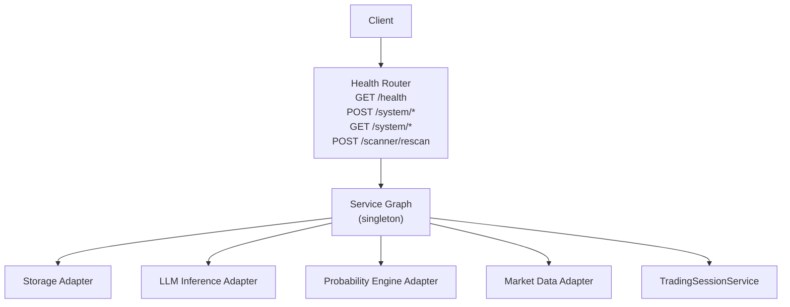
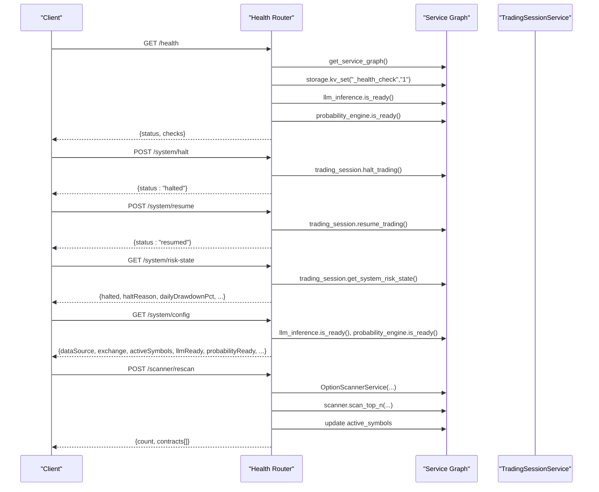
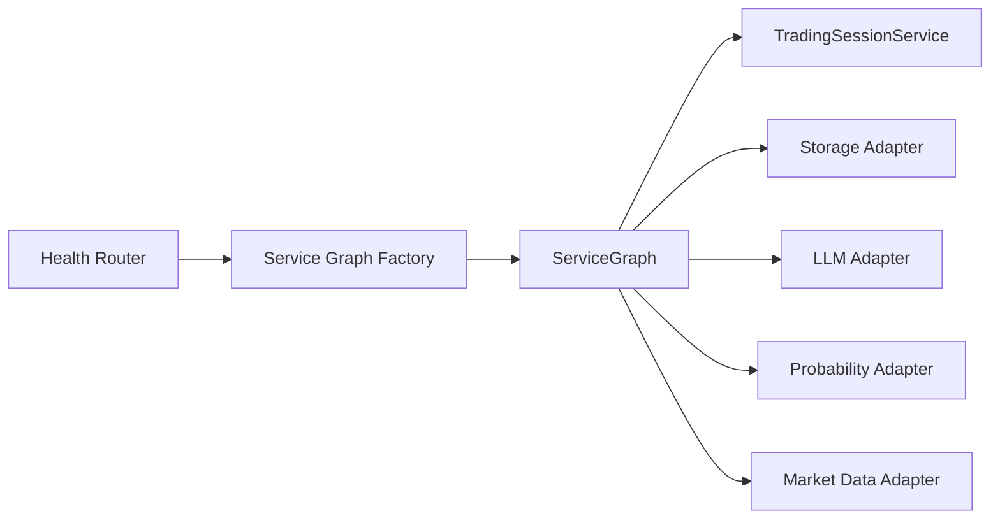

# Health Check Endpoints

<cite>
**Referenced Files in This Document**
- [health.py](file://backend/app/api/routers/health.py)
- [dependencies.py](file://backend/app/api/dependencies.py)
- [trading_session.py](file://backend/app/application/services/trading_session.py)
- [config.py](file://backend/app/config.py)
- [option_scanner.py](file://backend/app/domain/fabio_ai/services/option_scanner.py)
</cite>

## Table of Contents
1. [Introduction](#introduction)
2. [Project Structure](#project-structure)
3. [Core Components](#core-components)
4. [Architecture Overview](#architecture-overview)
5. [Detailed Component Analysis](#detailed-component-analysis)
6. [Dependency Analysis](#dependency-analysis)
7. [Performance Considerations](#performance-considerations)
8. [Troubleshooting Guide](#troubleshooting-guide)
9. [Conclusion](#conclusion)

## Introduction
This document provides API documentation for GlassyTrade AI v5 health monitoring and system status endpoints. It covers:
- GET /health: System health with database connectivity, LLM inference readiness, and probability engine status
- POST /system/halt and POST /system/resume: Emergency trading control
- GET /system/risk-state: Real-time risk manager state
- GET /system/config: Backend configuration exposure
- POST /scanner/rescan: Trigger option scanning and update active symbols

It also documents request/response schemas, error handling, authentication requirements, and practical examples for monitoring and managing the trading system programmatically.

## Project Structure
The health and system endpoints are implemented in the health router and orchestrated via a service graph dependency injection mechanism. The trading session service exposes system controls and risk state, while configuration is centralized in the settings module.

**Diagram sources**
- [health.py:26-246](file://backend/app/api/routers/health.py#L26-L246)
- [dependencies.py:43-328](file://backend/app/api/dependencies.py#L43-L328)
- [trading_session.py:85-1351](file://backend/app/application/services/trading_session.py#L85-L1351)

**Section sources**
- [health.py:26-246](file://backend/app/api/routers/health.py#L26-L246)
- [dependencies.py:43-328](file://backend/app/api/dependencies.py#L43-L328)

## Core Components
- Health Router: Implements health checks, system controls, risk state, configuration exposure, and scanner rescan.
- Service Graph: Singleton container wiring adapters, engines, and services.
- TradingSessionService: Central coordinator exposing halt/resume, risk state, and playbook guard reset.
- Configuration: Centralized settings for scanners, LLM, and runtime behavior.

**Section sources**
- [health.py:26-246](file://backend/app/api/routers/health.py#L26-L246)
- [dependencies.py:43-328](file://backend/app/api/dependencies.py#L43-L328)
- [trading_session.py:85-1351](file://backend/app/application/services/trading_session.py#L85-L1351)
- [config.py:26-157](file://backend/app/config.py#L26-L157)

## Architecture Overview
The health endpoints rely on the service graph to access adapters and services. The trading session coordinates system-wide controls and risk state. Configuration drives scanner behavior and feature flags.

**Diagram sources**
- [health.py:26-246](file://backend/app/api/routers/health.py#L26-L246)
- [dependencies.py:324-328](file://backend/app/api/dependencies.py#L324-L328)
- [trading_session.py:85-1351](file://backend/app/application/services/trading_session.py#L85-L1351)

## Detailed Component Analysis

### GET /health
Purpose: Aggregate system health status across database, LLM inference, and probability engine.

Behavior:
- Database: Writes a key to confirm storage connectivity.
- LLM: Checks readiness and load error state.
- Probability: Checks readiness (non-critical).
- Overall status:
  - Unhealthy if database error
  - Unhealthy if any critical error
  - Ok if all checks are ok/not_ready
  - Degraded otherwise

Response schema:
- status: "ok" | "unhealthy" | "degraded"
- checks: object with keys
  - database: "ok" | "error:<message>"
  - llm: "ok" | "error:<message>" | "not_ready"
  - probability: "ok" | "not_ready" | "error:<message>"

Error handling:
- On service graph retrieval failure, returns unhealthy with critical error message.

Authentication:
- No explicit authentication enforced in the router.

Example request:
- curl -s http://localhost:9090/health

Example response:
- {"status":"ok","checks":{"database":"ok","llm":"ok","probability":"ok"}}

**Section sources**
- [health.py:26-78](file://backend/app/api/routers/health.py#L26-L78)

### POST /system/halt
Purpose: Emergency kill switch to halt all trading.

Behavior:
- Calls trading_session.halt_trading() via service graph.

Response schema:
- status: "halted"

Error handling:
- Propagates exceptions from halt_trading if any.

Authentication:
- No explicit authentication enforced in the router.

Example request:
- curl -s -X POST http://localhost:9090/system/halt

Example response:
- {"status":"halted"}

**Section sources**
- [health.py:87-93](file://backend/app/api/routers/health.py#L87-L93)
- [trading_session.py:85-1351](file://backend/app/application/services/trading_session.py#L85-L1351)

### POST /system/resume
Purpose: Resume trading after emergency halt.

Behavior:
- Calls trading_session.resume_trading() via service graph.

Response schema:
- status: "resumed"

Error handling:
- Propagates exceptions from resume_trading if any.

Authentication:
- No explicit authentication enforced in the router.

Example request:
- curl -s -X POST http://localhost:9090/system/resume

Example response:
- {"status":"resumed"}

**Section sources**
- [health.py:96-102](file://backend/app/api/routers/health.py#L96-L102)
- [trading_session.py:85-1351](file://backend/app/application/services/trading_session.py#L85-L1351)

### GET /system/risk-state
Purpose: Expose current risk manager state for monitoring.

Behavior:
- Returns halted flag, halt reason, drawdown, consecutive losses, equity metrics, and drift alert info.

Response schema:
- halted: boolean
- haltReason: string | null
- dailyDrawdownPct: number (rounded)
- consecutiveLosses: integer
- peakEquity: number
- currentEquity: number
- driftAlert: boolean
- driftMessage: string | null

Error handling:
- Uses trading_session.get_system_risk_state(); exceptions propagate.

Authentication:
- No explicit authentication enforced in the router.

Example request:
- curl -s http://localhost:9090/system/risk-state

Example response:
- {"halted":false,"haltReason":null,"dailyDrawdownPct":0.001234,"consecutiveLosses":2,"peakEquity":100000.0,"currentEquity":99876.54,"driftAlert":true,"driftMessage":"Potential drift detected"}

**Section sources**
- [health.py:114-129](file://backend/app/api/routers/health.py#L114-L129)
- [trading_session.py:85-1351](file://backend/app/application/services/trading_session.py#L85-L1351)

### GET /system/config
Purpose: Expose backend configuration for frontend auto-detection and operational awareness.

Behavior:
- Collects runtime configuration and readiness flags from adapters and settings.

Response schema:
- dataSource: "DHAN"
- exchange: string
- defaultSymbol: string
- activeSymbols: string[]
- symbols: string[]
- interval: string
- tradingMode: string
- llmExecutionEnabled: boolean
- playbookGuardMaxRejections: integer
- explainabilityAlertMinTrades: integer
- explainabilityMinCoverageRate: number
- explainabilityMinAggressionRate: number
- llmReady: boolean
- probabilityReady: boolean
- probabilityFeatureSchemaVersion: integer
- probabilityFeatureCount: integer
- llmModelFamily: string
- llmEntryContractVersion: string
- llmEntryOutputFormat: "json"
- llmModelPath: string
- runId: string
- configFingerprint: string
- serverDriven: boolean
- backendPort: integer

Error handling:
- Uses settings and adapters; exceptions propagate.

Authentication:
- No explicit authentication enforced in the router.

Example request:
- curl -s http://localhost:9090/system/config

Example response:
- {"dataSource":"DHAN","exchange":"MCX","defaultSymbol":"CRUDEOIL 20 MAR 6500 CALL","activeSymbols":["CRUDEOIL 20 MAR 6500 CALL"],"symbols":["CRUDEOIL","NATURALGAS"],"interval":"5m","tradingMode":"paper","llmExecutionEnabled":false,"playbookGuardMaxRejections":3,"explainabilityAlertMinTrades":3,"explainabilityMinCoverageRate":90.0,"explainabilityMinAggressionRate":75.0,"llmReady":true,"probabilityReady":true,"probabilityFeatureSchemaVersion":1,"probabilityFeatureCount":42,"llmModelFamily":"Qwen","llmEntryContractVersion":"v1","llmEntryOutputFormat":"json","llmModelPath":"/backend/models/glassytrade-qwen-mlx-fused","runId":"","configFingerprint":"","serverDriven":false,"backendPort":9090}

**Section sources**
- [health.py:132-165](file://backend/app/api/routers/health.py#L132-L165)
- [config.py:26-157](file://backend/app/config.py#L26-L157)

### POST /scanner/rescan
Purpose: Trigger a fresh option scan and update active symbols.

Behavior:
- Builds OptionScannerService with market data adapter.
- Executes scan_top_n with configured parameters.
- Filters out contracts with zero LTP; sets active_symbols to scanned results.
- Returns count and contracts array.

Response schema:
- count: integer
- contracts: array of objects with:
  - symbol: string
  - underlying: string
  - strike: number
  - type: string
  - expiry: string
  - ltp: number
  - oi: number
  - volume: number
  - spread: number
  - score: number
  - bias: string
  - biasReason: string
  - delta: number
  - iv: number

Error handling:
- Uses ThreadPoolExecutor with timeout; cleans up threads.
- Returns empty array if no results.

Authentication:
- No explicit authentication enforced in the router.

Example request:
- curl -s -X POST http://localhost:9090/scanner/rescan

Example response:
- {"count":2,"contracts":[{"symbol":"CRUDEOIL 20 MAR 6500 CALL","underlying":"CRUDEOIL","strike":6500,"type":"CALL","expiry":"2025-03-20","ltp":120,"oi":4500,"volume":12000,"spread":4,"score":85.5,"bias":"Bullish","biasReason":"High OI and IV","delta":0.62,"iv":0.24},...]}

**Section sources**
- [health.py:168-217](file://backend/app/api/routers/health.py#L168-L217)
- [option_scanner.py](file://backend/app/domain/fabio_ai/services/option_scanner.py)

## Dependency Analysis
The health endpoints depend on the service graph for access to adapters and services. The trading session service centralizes system controls and risk state.

**Diagram sources**
- [health.py:26-246](file://backend/app/api/routers/health.py#L26-L246)
- [dependencies.py:43-328](file://backend/app/api/dependencies.py#L43-L328)

**Section sources**
- [health.py:26-246](file://backend/app/api/routers/health.py#L26-L246)
- [dependencies.py:43-328](file://backend/app/api/dependencies.py#L43-L328)

## Performance Considerations
- Health checks are lightweight; database write and adapter readiness checks are O(1).
- Scanner rescan uses a thread pool with a 60-second timeout; ensure adequate resources for concurrent scans.
- Risk state and configuration queries are read-only and fast.
- Consider rate-limiting frequent health polling to avoid unnecessary load.

## Troubleshooting Guide
Common issues and resolutions:
- Database connectivity failures:
  - Symptom: database check shows error in /health.
  - Action: Verify storage adapter configuration and network access.
- LLM readiness failures:
  - Symptom: llm shows error or not_ready.
  - Action: Confirm model path and adapter initialization; check logs for load errors.
- Probability engine readiness failures:
  - Symptom: probability shows error or not_ready.
  - Action: Verify model directory and adapter readiness.
- Emergency halt not clearing:
  - Symptom: /system/risk-state indicates halted=true.
  - Action: Call /system/resume to clear halt state.
- Scanner timeout:
  - Symptom: /scanner/rescan returns empty or slow response.
  - Action: Increase timeout or reduce scan parameters; verify market data adapter readiness.

**Section sources**
- [health.py:26-78](file://backend/app/api/routers/health.py#L26-L78)
- [health.py:168-217](file://backend/app/api/routers/health.py#L168-L217)
- [trading_session.py:85-1351](file://backend/app/application/services/trading_session.py#L85-L1351)

## Conclusion
The health and system endpoints provide a comprehensive toolkit for monitoring GlassyTrade AI v5’s operational status, controlling trading during emergencies, inspecting risk state, exposing configuration, and refreshing option scans. Use these endpoints to maintain situational awareness and respond quickly to system anomalies.