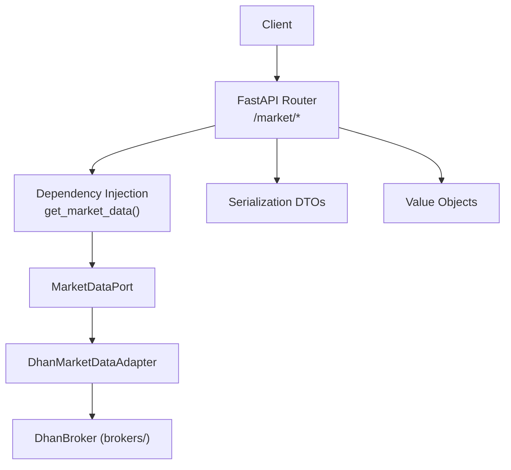
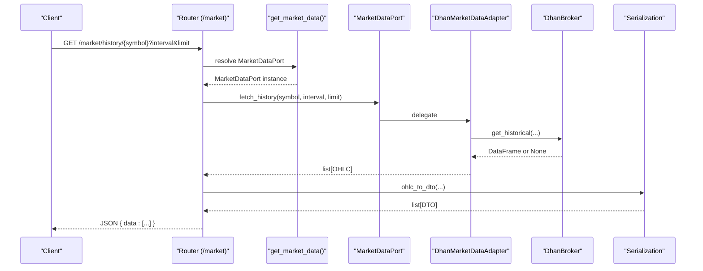
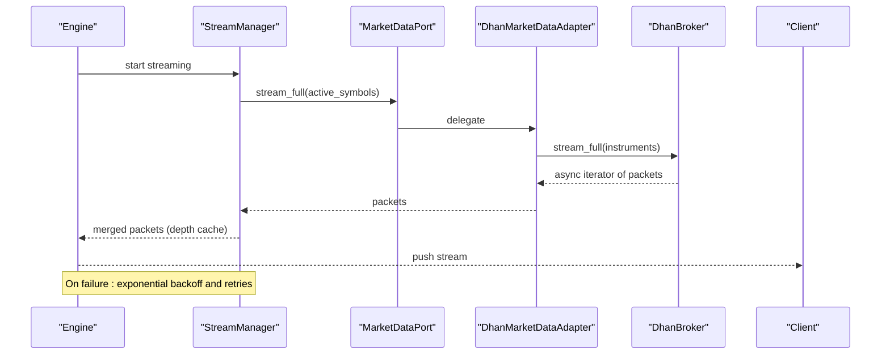
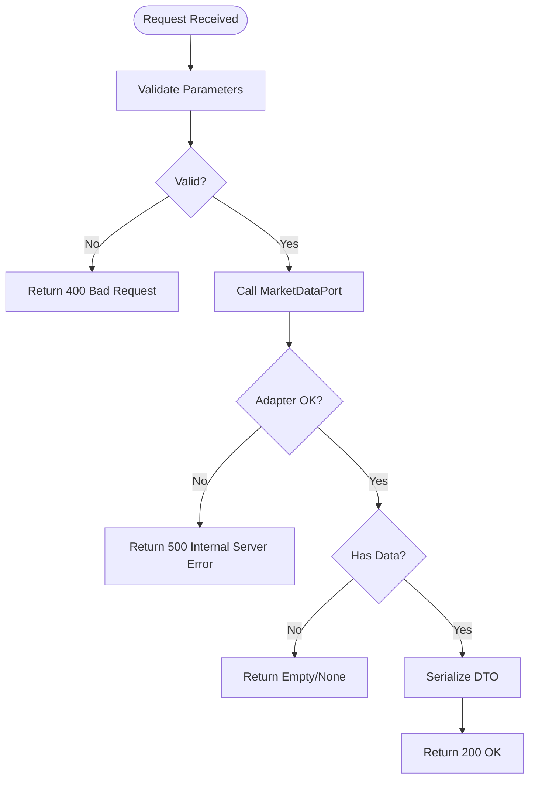

# Market Data Endpoints

<cite>
**Referenced Files in This Document**
- [market.py](file://backend/app/api/routers/market.py)
- [market_data.py](file://backend/app/domain/ports/market_data.py)
- [value_objects.py](file://backend/app/domain/trading/models/value_objects.py)
- [schemas.py](file://backend/app/infrastructure/serialization/schemas.py)
- [depth_dto.py](file://backend/app/shared/depth_dto.py)
- [dhan_adapter.py](file://backend/app/infrastructure/adapters/dhan_adapter.py)
- [dependencies.py](file://backend/app/api/dependencies.py)
- [development.yaml](file://backend/config/environments/development.yaml)
- [base.yaml](file://backend/config/base.yaml)
- [stream_manager.py](file://backend/app/application/stream_manager.py)
- [engine.py](file://backups/backend_backup_20260319_124426/app/application/engine.py)
- [test_integration.py](file://brokers/broker/dhan/tests/test_integration.py)
- [market_data_service.py](file://brokers/broker/dhan/application/services/market_data_service.py)
</cite>

## Table of Contents
1. [Introduction](#introduction)
2. [Project Structure](#project-structure)
3. [Core Components](#core-components)
4. [Architecture Overview](#architecture-overview)
5. [Detailed Component Analysis](#detailed-component-analysis)
6. [Dependency Analysis](#dependency-analysis)
7. [Performance Considerations](#performance-considerations)
8. [Troubleshooting Guide](#troubleshooting-guide)
9. [Conclusion](#conclusion)
10. [Appendices](#appendices)

## Introduction
This document describes the REST API endpoints for GlassyTrade AI v5 market data. It covers:
- Real-time market data retrieval
- Historical price series
- Order book depth snapshots
- Market state indicators (via AMT analysis)
- Authentication, rate limiting, and caching strategies
- Request parameters, response schemas, and error handling
- Practical examples for charting, analytics, and trading decisions

## Project Structure
GlassyTrade’s market data API is implemented as FastAPI routes under the /market prefix. The router delegates to a MarketDataPort abstraction, implemented by a Dhan adapter that integrates with the brokers/ library. Responses are serialized using dedicated DTOs and value objects.



**Diagram sources**
- [market.py:12-45](file://backend/app/api/routers/market.py#L12-L45)
- [dependencies.py:333-334](file://backend/app/api/dependencies.py#L333-L334)
- [market_data.py:19-112](file://backend/app/domain/ports/market_data.py#L19-L112)
- [dhan_adapter.py:66-457](file://backend/app/infrastructure/adapters/dhan_adapter.py#L66-L457)

**Section sources**
- [market.py:1-46](file://backend/app/api/routers/market.py#L1-L46)
- [dependencies.py:324-334](file://backend/app/api/dependencies.py#L324-L334)

## Core Components
- Market router: Defines GET endpoints for scanning candidates, fetching historical data, and retrieving order book snapshots.
- MarketDataPort: Abstract interface for market data providers (Dhan adapter implements this).
- Value objects: Immutable domain models (OHLC, OrderBook, OrderBookLevel) used internally and converted to DTOs for responses.
- Serialization: DTOs and converters transform domain models into JSON-compatible structures for clients.

Key responsibilities:
- Endpoint routing and parameter validation
- Domain-to-transport conversion
- Adapter delegation to DhanBroker
- Error propagation and graceful fallbacks

**Section sources**
- [market.py:12-45](file://backend/app/api/routers/market.py#L12-L45)
- [market_data.py:19-112](file://backend/app/domain/ports/market_data.py#L19-L112)
- [value_objects.py:18-77](file://backend/app/domain/trading/models/value_objects.py#L18-L77)
- [schemas.py:31-53](file://backend/app/infrastructure/serialization/schemas.py#L31-L53)

## Architecture Overview
The market data API follows a layered architecture:
- Presentation: FastAPI router exposes endpoints
- Application: Dependency injection supplies a MarketDataPort implementation
- Infrastructure: Dhan adapter translates domain calls into broker operations
- Serialization: DTOs and converters ensure stable JSON contracts



**Diagram sources**
- [market.py:21-29](file://backend/app/api/routers/market.py#L21-L29)
- [dependencies.py:333-334](file://backend/app/api/dependencies.py#L333-L334)
- [dhan_adapter.py:214-318](file://backend/app/infrastructure/adapters/dhan_adapter.py#L214-L318)
- [schemas.py:371-383](file://backend/app/infrastructure/serialization/schemas.py#L371-L383)

## Detailed Component Analysis

### Endpoints

#### GET /market/scan
- Purpose: Retrieve candidate symbols for scanning based on configured symbols.
- Path parameters: None
- Query parameters:
  - limit: integer, default 6, min 1, max 20
- Response: JSON object containing a list of candidate symbols.
- Example usage: Build watchlists or auto-scan high-volume instruments.

**Section sources**
- [market.py:12-18](file://backend/app/api/routers/market.py#L12-L18)
- [dhan_adapter.py:211-212](file://backend/app/infrastructure/adapters/dhan_adapter.py#L211-L212)

#### GET /market/history/{symbol}
- Purpose: Fetch historical OHLCV data for a symbol.
- Path parameters:
  - symbol: string (instrument identifier)
- Query parameters:
  - interval: string, default "5m"; supports common intraday intervals and daily
  - limit: integer, default 500, min 1, max 1000
- Response: JSON object containing an array of candlesticks with fields:
  - time, open, high, low, close, volume, vwap, takerBuyVolume, delta
- Notes:
  - The adapter maps interval aliases to provider-specific values.
  - Returns an empty array when no data is available; exceptions propagate otherwise.

**Section sources**
- [market.py:21-29](file://backend/app/api/routers/market.py#L21-L29)
- [dhan_adapter.py:214-318](file://backend/app/infrastructure/adapters/dhan_adapter.py#L214-L318)
- [schemas.py:31-42](file://backend/app/infrastructure/serialization/schemas.py#L31-L42)

#### GET /market/orderbook/{symbol}
- Purpose: Retrieve the current Level-2 order book snapshot.
- Path parameters:
  - symbol: string
- Query parameters: None
- Response: JSON object containing:
  - orderBook: object with bids and asks arrays; each item has price and quantity
  - Returns orderBook: null when depth is unavailable
- Notes:
  - The adapter constructs OrderBook from broker quotes.
  - The shared DTO utility caps levels to reduce payload size.

**Section sources**
- [market.py:32-45](file://backend/app/api/routers/market.py#L32-L45)
- [dhan_adapter.py:320-351](file://backend/app/infrastructure/adapters/dhan_adapter.py#L320-L351)
- [depth_dto.py:16-32](file://backend/app/shared/depth_dto.py#L16-L32)

### Request Parameters
- symbol: Instrument identifier (NSE/NFO/MCX supported). Options are auto-detected by symbol suffix or keywords.
- interval: Timeframe for candles (e.g., "1m", "5m", "15m", "1h", "1d").
- limit: Number of data points to return.
- limit (scan): Maximum number of candidates to return.

Validation:
- Range constraints enforced via FastAPI Query parameters (min/max).
- Interval mapping handled by the adapter.

**Section sources**
- [market.py:14-25](file://backend/app/api/routers/market.py#L14-L25)
- [dhan_adapter.py:242-251](file://backend/app/infrastructure/adapters/dhan_adapter.py#L242-L251)

### Response Schemas
- Candlestick (OHLCDataDTO):
  - Fields: time, open, high, low, close, volume, vwap, takerBuyVolume, delta
- Order Book (OrderBookDTO):
  - Fields: bids[], asks[] where each item has price and quantity
- Candidates (array of strings)

Conversion:
- Domain OHLC → DTO via converter that preserves Decimal precision as floats.
- OrderBook → DTO via converter that caps levels and ensures numeric types.

**Section sources**
- [schemas.py:31-53](file://backend/app/infrastructure/serialization/schemas.py#L31-L53)
- [schemas.py:371-383](file://backend/app/infrastructure/serialization/schemas.py#L371-L383)
- [depth_dto.py:16-32](file://backend/app/shared/depth_dto.py#L16-L32)

### Data Freshness and Streaming
- REST endpoints return static snapshots:
  - /market/history/{symbol} returns historical bars as of the last available data
  - /market/orderbook/{symbol} returns a snapshot at the time of the request
- Live streaming is available via the engine and stream manager:
  - WebSocket stream_full() emits full packets including LTP, depth, OHLC, and OI
  - Fallback polling mode for symbols with no WS data
  - Retry and backoff logic on disconnection



**Diagram sources**
- [stream_manager.py:212-266](file://backend/app/application/stream_manager.py#L212-L266)
- [engine.py:850-875](file://backups/backend_backup_20260319_124426/app/application/engine.py#L850-L875)
- [dhan_adapter.py:364-382](file://backend/app/infrastructure/adapters/dhan_adapter.py#L364-L382)

**Section sources**
- [stream_manager.py:212-266](file://backend/app/application/stream_manager.py#L212-L266)
- [engine.py:850-875](file://backups/backend_backup_20260319_124426/app/application/engine.py#L850-L875)

### Market State Indicators
- The market router does not expose AMT results directly.
- AMT analysis DTOs and converters exist for internal use and can be consumed by higher-level services.
- To obtain market state indicators, integrate with the AMT pipeline or use the engine’s streaming path that includes derived metrics.

**Section sources**
- [schemas.py:91-163](file://backend/app/infrastructure/serialization/schemas.py#L91-L163)

## Dependency Analysis
- Router depends on MarketDataPort via dependency injection.
- MarketDataPort is implemented by DhanMarketDataAdapter.
- DhanMarketDataAdapter depends on DhanBroker from the brokers/ package.
- Serialization layer converts domain value objects to DTOs for transport.

```mermaid
classDiagram
class MarketRouter {
+GET /market/scan
+GET /market/history/{symbol}
+GET /market/orderbook/{symbol}
}
class MarketDataPort {
<<interface>>
+scan_candidates(limit)
+fetch_history(symbol,interval,limit)
+fetch_order_book(symbol)
+get_ltp(symbol)
+stream_full(symbols)
+stream_depth_20(symbols)
}
class DhanMarketDataAdapter {
+ensure_initialized_sync()
+scan_candidates()
+fetch_history()
+fetch_order_book()
+get_ltp()
+stream_full()
+stream_poll()
+stream_depth_20()
}
class DhanBroker {
+initialize()
+get_historical()
+get_quote()
+get_ltp()
+stream_full()
+stream_depth()
}
class OHLC
class OrderBook
class OrderBookLevel
MarketRouter --> MarketDataPort : "Depends on"
MarketDataPort <|.. DhanMarketDataAdapter : "implements"
DhanMarketDataAdapter --> DhanBroker : "delegates to"
MarketRouter --> OHLC : "returns DTO"
MarketRouter --> OrderBook : "returns DTO"
OrderBook --> OrderBookLevel : "contains"
```

**Diagram sources**
- [market.py:12-45](file://backend/app/api/routers/market.py#L12-L45)
- [market_data.py:19-112](file://backend/app/domain/ports/market_data.py#L19-L112)
- [dhan_adapter.py:66-457](file://backend/app/infrastructure/adapters/dhan_adapter.py#L66-L457)
- [value_objects.py:18-77](file://backend/app/domain/trading/models/value_objects.py#L18-L77)

**Section sources**
- [dependencies.py:333-334](file://backend/app/api/dependencies.py#L333-L334)
- [dhan_adapter.py:90-100](file://backend/app/infrastructure/adapters/dhan_adapter.py#L90-L100)

## Performance Considerations
- Payload sizing:
  - Order book responses are capped at a fixed number of levels to bound payload size.
- Data limits:
  - Historical requests are limited by the adapter and validated by the router.
- Streaming:
  - WebSocket stream_full() yields packets incrementally; polling fallback reduces bandwidth for symbols without WS.
- Rate limiting:
  - HTTP client-side rate limiting exists in the broker layer with independent categories for different operations.

**Section sources**
- [depth_dto.py:16-32](file://backend/app/shared/depth_dto.py#L16-L32)
- [market.py:14-25](file://backend/app/api/routers/market.py#L14-L25)
- [test_integration.py:232-266](file://brokers/broker/dhan/tests/test_integration.py#L232-L266)

## Troubleshooting Guide
Common issues and resolutions:
- Unavailable symbol or market data feed:
  - Historical and order book endpoints return empty/no-data responses when the broker cannot supply data; exceptions are logged but not surfaced to clients.
- No WebSocket data for certain symbols:
  - Stream manager automatically switches to REST polling for unresolved symbols.
- Network failures:
  - Engine applies exponential backoff and eventually signals stream death to clients.
- Rate limiting:
  - HTTP requests are throttled by category; adjust client pacing accordingly.



**Diagram sources**
- [market.py:12-45](file://backend/app/api/routers/market.py#L12-L45)
- [dhan_adapter.py:316-351](file://backend/app/infrastructure/adapters/dhan_adapter.py#L316-L351)

**Section sources**
- [stream_manager.py:185-266](file://backend/app/application/stream_manager.py#L185-L266)
- [engine.py:850-875](file://backups/backend_backup_20260319_124426/app/application/engine.py#L850-L875)

## Conclusion
GlassyTrade AI v5 provides a focused set of REST endpoints for retrieving market data snapshots and order book depth. For real-time insights, integrate with the streaming pipeline. The system emphasizes robust error handling, payload control, and adapter-based extensibility. Configure environments appropriately for development and production, and apply rate limiting and retry strategies at the client level.

## Appendices

### Authentication and Authorization
- No explicit authentication or authorization checks are present in the market router.
- Access control should be implemented at the reverse proxy or API gateway level.

**Section sources**
- [market.py:12-45](file://backend/app/api/routers/market.py#L12-L45)

### Rate Limiting Policies
- HTTP client-side rate limiting exists with independent categories for market data, orders, and historical requests.
- Token bucket implementation enforces burst capacity and refill rates.

**Section sources**
- [test_integration.py:232-266](file://brokers/broker/dhan/tests/test_integration.py#L232-L266)
- [market_data_service.py:153-172](file://brokers/broker/dhan/application/services/market_data_service.py#L153-L172)

### Caching Strategies
- Order book responses are capped at a fixed number of levels to reduce payload size.
- No explicit HTTP caching headers are set in the router; caching should be managed by upstream proxies or clients.

**Section sources**
- [depth_dto.py:16-32](file://backend/app/shared/depth_dto.py#L16-L32)

### Environment Configuration
- Development environment restricts enabled symbols and enables paper broker mode.
- Base configuration defines global constants, exchange settings, and risk parameters.

**Section sources**
- [development.yaml:8-27](file://backend/config/environments/development.yaml#L8-L27)
- [base.yaml:109-462](file://backend/config/base.yaml#L109-L462)

### Examples

- Charting:
  - Use GET /market/history/{symbol}?interval=5m&limit=500 to populate OHLC charts.
  - Combine with GET /market/orderbook/{symbol} for depth overlays.

- Analysis pipelines:
  - Poll GET /market/history/{symbol} periodically to build rolling indicators.
  - Use order book snapshots to compute effective spreads and liquidity metrics.

- Trading decisions:
  - Monitor GET /market/orderbook/{symbol} for imbalances and pending liquidity.
  - Integrate with the streaming pipeline for live decision-making.

[No sources needed since this section provides usage examples without analyzing specific files]