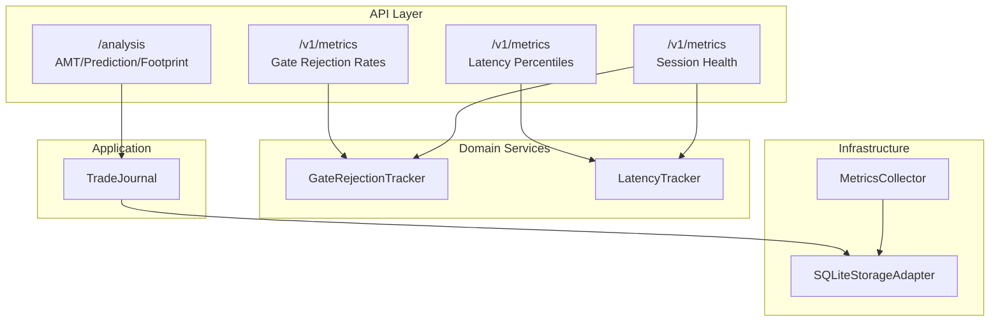
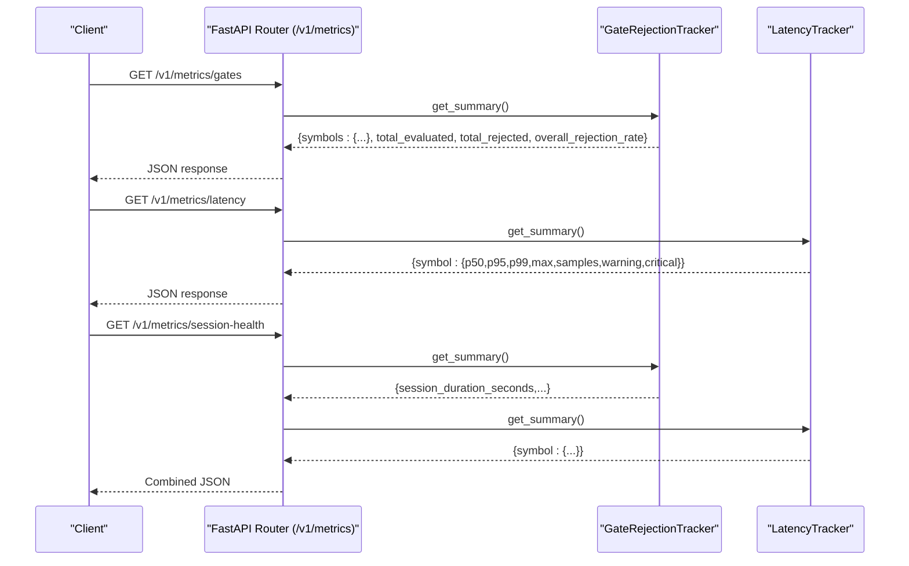
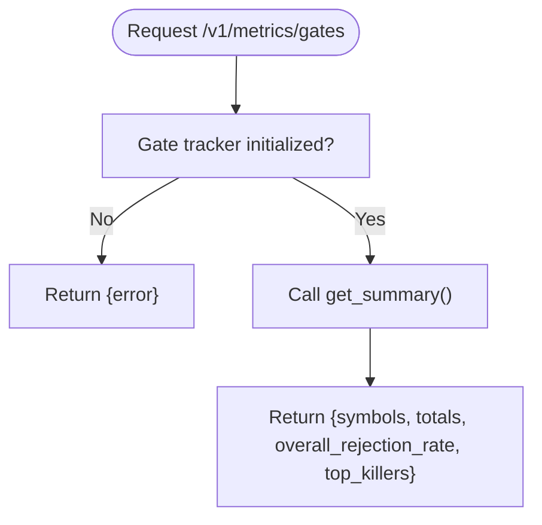
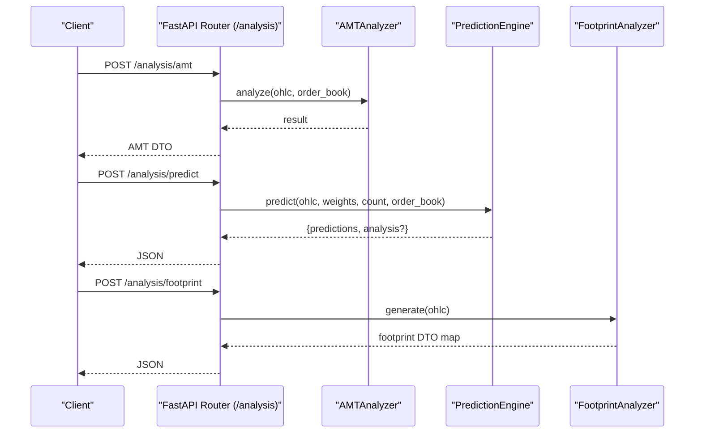
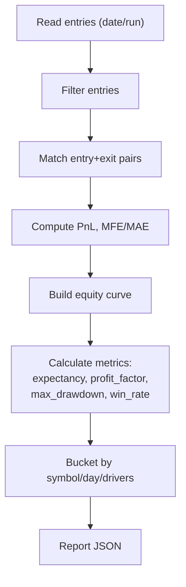
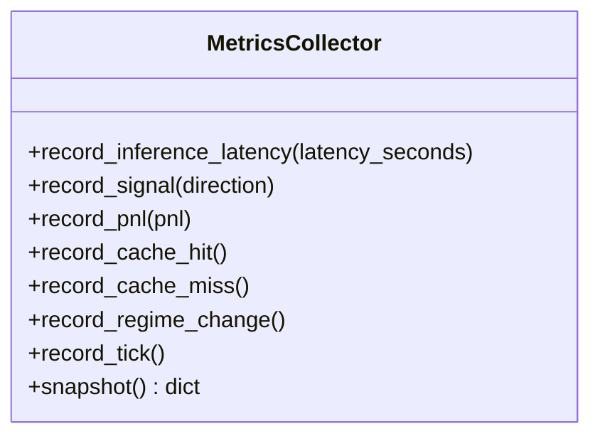
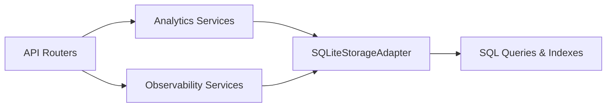

# Metrics and Analytics Endpoints

<cite>
**Referenced Files in This Document**
- [metrics.py](file://backend/app/api/routers/metrics.py)
- [gate_rejection_tracker.py](file://backend/app/domain/services/gate_rejection_tracker.py)
- [latency_tracker.py](file://backend/app/domain/services/latency_tracker.py)
- [metrics.py](file://backend/app/infrastructure/metrics.py)
- [trade_journal.py](file://backend/app/application/services/trade_journal.py)
- [database.py](file://backend/app/infrastructure/storage/database.py)
- [analysis.py](file://backend/app/api/routers/analysis.py)
</cite>

## Table of Contents
1. [Introduction](#introduction)
2. [Project Structure](#project-structure)
3. [Core Components](#core-components)
4. [Architecture Overview](#architecture-overview)
5. [Detailed Component Analysis](#detailed-component-analysis)
6. [Dependency Analysis](#dependency-analysis)
7. [Performance Considerations](#performance-considerations)
8. [Troubleshooting Guide](#troubleshooting-guide)
9. [Conclusion](#conclusion)
10. [Appendices](#appendices)

## Introduction
This document describes the metrics and analytics endpoints exposed by GlassyTrade AI v5. It focuses on:
- Real-time observability metrics for gate rejection rates and latency
- Historical trade analytics and performance summaries
- Risk and performance benchmarking capabilities
- Data access patterns for building dashboards and monitoring systems
- Guidance on time-range filtering, symbol aggregation, and metric types
- Response schemas for equity curves, win rates, profit factors, and risk-adjusted returns
- Recommendations for data retention and query optimization for large historical datasets

## Project Structure
GlassyTrade v5 organizes metrics and analytics across:
- API routers for observability and analysis
- Domain services for gate rejection tracking and latency profiling
- Infrastructure metrics for inference and runtime telemetry
- Trade journal for performance analytics and reporting
- Persistent storage for ticks, trades, and snapshots

**Diagram sources**
- [metrics.py:13-56](file://backend/app/api/routers/metrics.py#L13-L56)
- [gate_rejection_tracker.py:39-120](file://backend/app/domain/services/gate_rejection_tracker.py#L39-L120)
- [latency_tracker.py:27-96](file://backend/app/domain/services/latency_tracker.py#L27-L96)
- [metrics.py:14-98](file://backend/app/infrastructure/metrics.py#L14-L98)
- [trade_journal.py:84-908](file://backend/app/application/services/trade_journal.py#L84-L908)
- [database.py:183-861](file://backend/app/infrastructure/storage/database.py#L183-L861)

**Section sources**
- [metrics.py:1-56](file://backend/app/api/routers/metrics.py#L1-L56)
- [gate_rejection_tracker.py:1-120](file://backend/app/domain/services/gate_rejection_tracker.py#L1-L120)
- [latency_tracker.py:1-96](file://backend/app/domain/services/latency_tracker.py#L1-L96)
- [metrics.py:1-98](file://backend/app/infrastructure/metrics.py#L1-L98)
- [trade_journal.py:1-908](file://backend/app/application/services/trade_journal.py#L1-L908)
- [database.py:1-861](file://backend/app/infrastructure/storage/database.py#L1-L861)

## Core Components
- Observability endpoints
  - Gate rejection metrics: per-symbol, per-gate rejection counts and rates
  - Latency metrics: tick-to-signal latency percentiles (p50, p95, p99) and warnings
  - Session health: combined snapshot of gate and latency metrics
- Analytics endpoints
  - AMT analysis, prediction engine, and footprint generation
- Performance analytics
  - Trade journal with daily JSONL logs and computed performance metrics
  - Historical queries for ticks, trades, and performance snapshots
- Infrastructure telemetry
  - Metrics collector for inference latency, signal counts, P&L, cache hit rate, regime changes, and tick counts

**Section sources**
- [metrics.py:30-56](file://backend/app/api/routers/metrics.py#L30-L56)
- [analysis.py:22-64](file://backend/app/api/routers/analysis.py#L22-L64)
- [trade_journal.py:108-132](file://backend/app/application/services/trade_journal.py#L108-L132)
- [metrics.py:69-97](file://backend/app/infrastructure/metrics.py#L69-L97)

## Architecture Overview
The metrics and analytics pipeline integrates API routers, domain services, and persistent storage to deliver real-time and historical insights.

**Diagram sources**
- [metrics.py:30-56](file://backend/app/api/routers/metrics.py#L30-L56)
- [gate_rejection_tracker.py:84-114](file://backend/app/domain/services/gate_rejection_tracker.py#L84-L114)
- [latency_tracker.py:78-92](file://backend/app/domain/services/latency_tracker.py#L78-L92)

## Detailed Component Analysis

### Observability Endpoints
- Endpoint: GET /v1/metrics/gates
  - Purpose: Per-symbol, per-gate rejection counts and rates
  - Request: none
  - Response: summary with total evaluated/rejected, overall rejection rate, and per-symbol top killers
  - Notes: Returns error if tracker not initialized
- Endpoint: GET /v1/metrics/latency
  - Purpose: Per-symbol latency percentiles and alert flags
  - Request: none
  - Response: per-symbol {p50, p95, p99, max, samples, warning, critical}
  - Notes: Warning at p99 > 50ms; critical at p99 > 200ms
- Endpoint: GET /v1/metrics/session-health
  - Purpose: Combined observability snapshot
  - Request: none
  - Response: {gates: ..., latency: ...}

**Diagram sources**
- [metrics.py:30-36](file://backend/app/api/routers/metrics.py#L30-L36)
- [gate_rejection_tracker.py:84-114](file://backend/app/domain/services/gate_rejection_tracker.py#L84-L114)

**Section sources**
- [metrics.py:30-56](file://backend/app/api/routers/metrics.py#L30-L56)
- [gate_rejection_tracker.py:39-120](file://backend/app/domain/services/gate_rejection_tracker.py#L39-L120)
- [latency_tracker.py:27-96](file://backend/app/domain/services/latency_tracker.py#L27-L96)

### Analytics Endpoints
- Endpoint: POST /analysis/amt
  - Purpose: AMT analysis using OHLC and order book data
  - Request: AMTRequestDTO with data and order_book
  - Response: AMT result DTO
- Endpoint: POST /analysis/predict
  - Purpose: Prediction with sentiment, confidence, and factor breakdown
  - Request: PredictionRequestDTO with data, weights, count, order book
  - Response: {predictions, analysis (optional)}
- Endpoint: POST /analysis/footprint
  - Purpose: Footprint analysis
  - Request: FootprintRequestDTO with data
  - Response: footprint DTO map

**Diagram sources**
- [analysis.py:22-64](file://backend/app/api/routers/analysis.py#L22-L64)

**Section sources**
- [analysis.py:1-64](file://backend/app/api/routers/analysis.py#L1-L64)

### Performance Analytics and Reporting
- Trade journal
  - Logs daily JSONL entries for signals, entries, rejections, exits, partial exits, and overseer actions
  - Computes performance metrics: expectancy, profit factor, gross profit/loss, average win/loss, max drawdown
  - Provides bucketed breakdowns by symbol, day, and feature drivers
  - Supports run comparisons and assessment against promotion thresholds
- Historical data access
  - Query ticks, trades, LLM decisions, and position events with time-range filters and limits
  - Save performance snapshots and session profiles for downstream analytics

**Diagram sources**
- [trade_journal.py:581-908](file://backend/app/application/services/trade_journal.py#L581-L908)
- [database.py:485-764](file://backend/app/infrastructure/storage/database.py#L485-L764)

**Section sources**
- [trade_journal.py:84-908](file://backend/app/application/services/trade_journal.py#L84-L908)
- [database.py:183-861](file://backend/app/infrastructure/storage/database.py#L183-L861)

### Infrastructure Telemetry
- Metrics collector
  - Tracks inference latency (count, avg, p50, p95), signal counts, total P&L, cache hit/miss, regime changes, ticks processed
  - Exposes snapshot for uptime and throughput metrics

**Diagram sources**
- [metrics.py:14-98](file://backend/app/infrastructure/metrics.py#L14-L98)

**Section sources**
- [metrics.py:1-98](file://backend/app/infrastructure/metrics.py#L1-L98)

## Dependency Analysis
- API routers depend on domain services for observability and on application services for analytics
- Application services persist data via storage adapter
- Storage adapter provides SQL queries for time-range filtering and indexing support

**Diagram sources**
- [metrics.py:9-13](file://backend/app/api/routers/metrics.py#L9-L13)
- [analysis.py:3-14](file://backend/app/api/routers/analysis.py#L3-L14)
- [database.py:485-764](file://backend/app/infrastructure/storage/database.py#L485-L764)

**Section sources**
- [metrics.py:1-56](file://backend/app/api/routers/metrics.py#L1-L56)
- [analysis.py:1-64](file://backend/app/api/routers/analysis.py#L1-L64)
- [database.py:1-861](file://backend/app/infrastructure/storage/database.py#L1-L861)

## Performance Considerations
- Real-time metrics
  - Gate rejection and latency trackers maintain rolling windows and per-symbol snapshots for low-latency retrieval
  - Metrics collector caps history sizes and computes quantiles efficiently
- Historical queries
  - SQLite indices on time-series and event tables enable efficient filtering by date/time ranges
  - Batched writes for ticks reduce I/O overhead
- Recommendations
  - Use time-range filters (start/end) and limits to constrain historical queries
  - Prefer symbol-scoped queries where possible to leverage existing indexes
  - Aggregate at appropriate intervals (daily/weekly) for dashboard-level analytics

[No sources needed since this section provides general guidance]

## Troubleshooting Guide
- Observability endpoints return initialization errors when trackers are not configured
  - Verify tracker injection via the provided setter before calling metrics endpoints
- Latency alerts
  - p99 thresholds trigger warning and critical flags; investigate upstream bottlenecks when alerts fire
- Trade journal reports
  - Ensure daily JSONL files exist for the requested date; confirm run_id filters match logged entries
- Storage queries
  - Confirm time formats and symbol filters; note that tick queries flush pending batches before reading

**Section sources**
- [metrics.py:34-36](file://backend/app/api/routers/metrics.py#L34-L36)
- [latency_tracker.py:64-72](file://backend/app/domain/services/latency_tracker.py#L64-L72)
- [trade_journal.py:542-573](file://backend/app/application/services/trade_journal.py#L542-L573)
- [database.py:491-506](file://backend/app/infrastructure/storage/database.py#L491-L506)

## Conclusion
GlassyTrade AI v5 provides a robust foundation for metrics and analytics:
- Real-time observability via gate rejection and latency endpoints
- Comprehensive trade analytics through the journal and storage layer
- Predictive and footprint analysis for deeper market insights
- Practical guidance for building dashboards and optimizing historical queries

[No sources needed since this section summarizes without analyzing specific files]

## Appendices

### API Reference: Metrics Endpoints
- GET /v1/metrics/gates
  - Description: Per-symbol, per-gate rejection counts and rates
  - Response fields: symbols (object keyed by symbol), total_evaluated, total_rejected, overall_rejection_rate, top_killers (array of gate stats)
- GET /v1/metrics/latency
  - Description: Per-symbol latency percentiles and alert flags
  - Response fields: symbol-keyed objects with p50, p95, p99, max, samples, warning, critical
- GET /v1/metrics/session-health
  - Description: Combined snapshot of gate and latency metrics
  - Response fields: gates (summary), latency (summary)

**Section sources**
- [metrics.py:30-56](file://backend/app/api/routers/metrics.py#L30-L56)
- [gate_rejection_tracker.py:84-114](file://backend/app/domain/services/gate_rejection_tracker.py#L84-L114)
- [latency_tracker.py:78-92](file://backend/app/domain/services/latency_tracker.py#L78-L92)

### API Reference: Analytics Endpoints
- POST /analysis/amt
  - Request: AMTRequestDTO (data: array of OHLC DTOs, order_book: order book DTO)
  - Response: AMT result DTO
- POST /analysis/predict
  - Request: PredictionRequestDTO (data, weights, count, order_book)
  - Response: {predictions: array of OHLC DTOs, analysis: optional object with sentiment, confidence, longTermTrend, volatilityScore, quantScore, projectedPrice, reasoning[], factorBreakdown{trend,momentum,delta,orderBook}}}
- POST /analysis/footprint
  - Request: FootprintRequestDTO (data)
  - Response: footprint DTO map

**Section sources**
- [analysis.py:22-64](file://backend/app/api/routers/analysis.py#L22-L64)

### API Reference: Historical Data Access
- Query ticks
  - GET /ticks?symbol={symbol}&start={ISO}&end={ISO}&limit={int}
  - Response: array of tick records ordered by time
- Query trades
  - GET /trades?start={ISO}&end={ISO}
  - Response: array of trade records ordered by closed_at
- Query LLM decisions
  - GET /llm-decisions?start={ISO}&end={ISO}&symbols={comma-separated}&limit={int}
  - Response: array of decision records ordered by created_at desc
- Query position events
  - GET /position-events?position_id={id}&symbol={symbol}
  - Response: array of event records ordered by created_at asc

**Section sources**
- [database.py:485-764](file://backend/app/infrastructure/storage/database.py#L485-L764)

### Response Schemas: Performance Analytics
- Equity curve
  - Computed from daily PnL series; supports daily aggregation for dashboard charts
- Win rate
  - Percentage of profitable trades per bucket (symbol/day/feature driver)
- Profit factor
  - Gross profit divided by gross loss
- Risk-adjusted returns
  - Max drawdown derived from cumulative PnL; combine with expectancy and volatility for Sharpe-style metrics

**Section sources**
- [trade_journal.py:108-132](file://backend/app/application/services/trade_journal.py#L108-L132)

### Building Dashboards and Monitoring
- Real-time
  - Poll /v1/metrics/session-health for combined observability
  - Track latency percentiles and rejection rates per symbol
- Historical
  - Use /ticks and /trades with time-range filters to render charts
  - Aggregate daily PnL for equity curves and compute KPIs via /trades or journal reports
- Alerts
  - Monitor latency warning/critical flags and gate rejection spikes

[No sources needed since this section provides general guidance]

### Data Retention and Query Optimization
- Retention
  - Daily JSONL trade journal files; manage disk usage by archiving old dates
  - SQLite tables for ticks, trades, and snapshots; consider periodic pruning of older records
- Optimization
  - Use start/end parameters and limits on queries
  - Leverage existing indexes on time and symbol fields
  - Batch writes for ticks to reduce I/O

**Section sources**
- [trade_journal.py:520-573](file://backend/app/application/services/trade_journal.py#L520-L573)
- [database.py:183-250](file://backend/app/infrastructure/storage/database.py#L183-L250)
- [database.py:122-129](file://backend/app/infrastructure/storage/database.py#L122-L129)