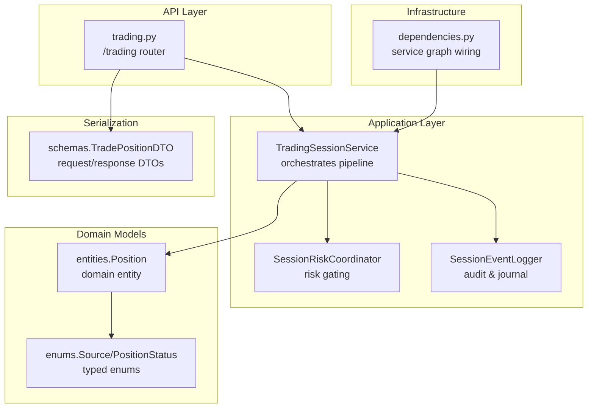
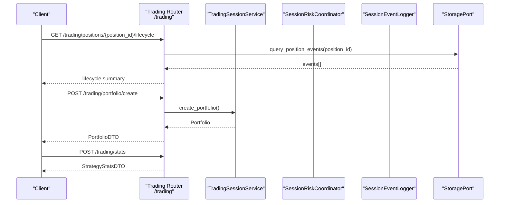
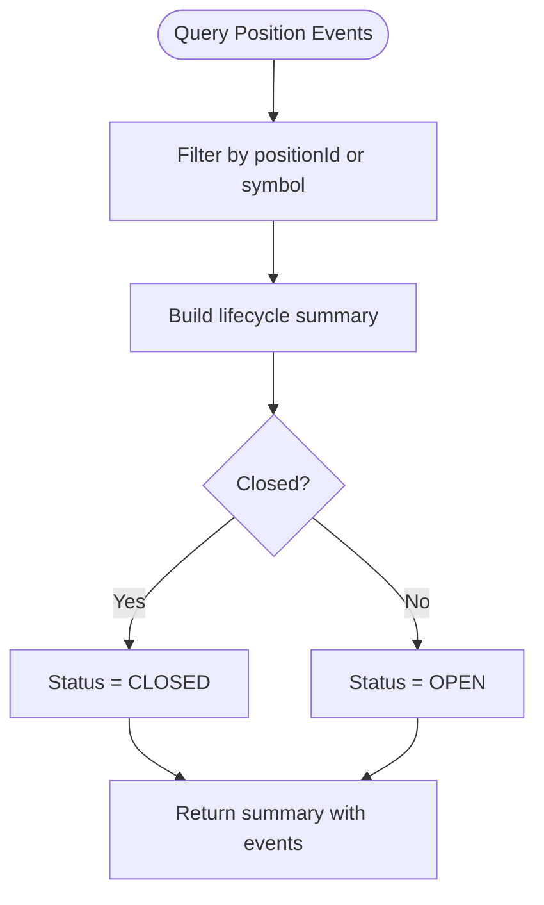
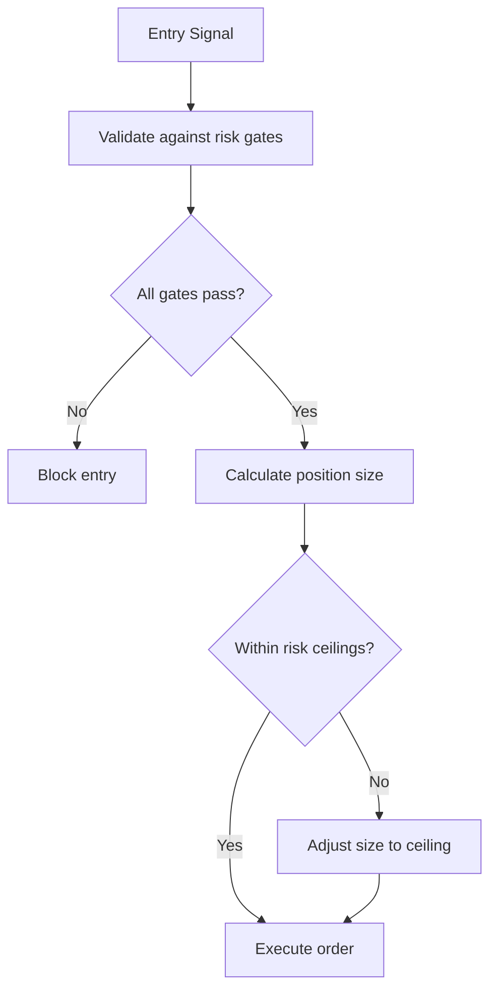
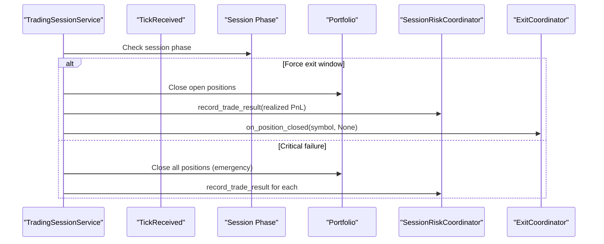
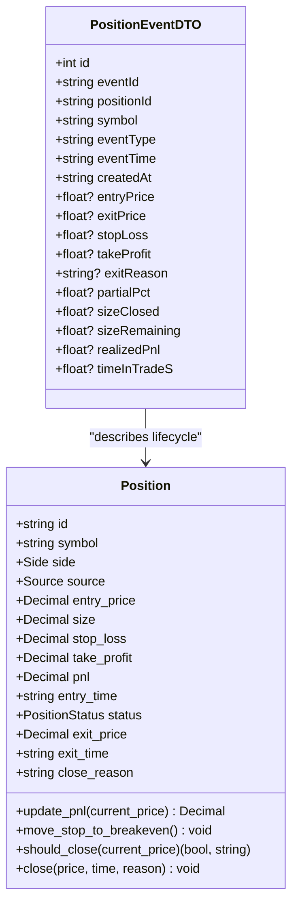
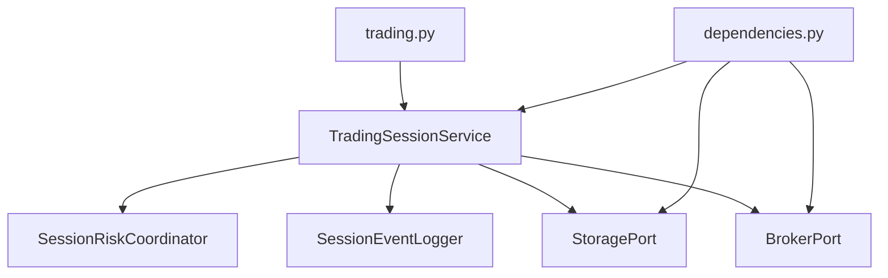

# Trading Control Endpoints

<cite>
**Referenced Files in This Document**
- [trading.py](file://backend/app/api/routers/trading.py)
- [schemas.py](file://backend/app/infrastructure/serialization/schemas.py)
- [entities.py](file://backend/app/domain/trading/models/entities.py)
- [enums.py](file://backend/app/domain/trading/models/enums.py)
- [trading_session.py](file://backend/app/application/services/trading_session.py)
- [session_risk_coordinator.py](file://backend/app/application/services/session_risk_coordinator.py)
- [session_event_logger.py](file://backend/app/application/services/session_event_logger.py)
- [dependencies.py](file://backend/app/api/dependencies.py)
- [position_sizer.py](file://backend/app/domain/fabio_ai/services/position_sizer.py)
- [llm_entry_handler.py](file://backend/app/application/handlers/llm_entry_handler.py)
</cite>

## Table of Contents
1. [Introduction](#introduction)
2. [Project Structure](#project-structure)
3. [Core Components](#core-components)
4. [Architecture Overview](#architecture-overview)
5. [Detailed Component Analysis](#detailed-component-analysis)
6. [Dependency Analysis](#dependency-analysis)
7. [Performance Considerations](#performance-considerations)
8. [Troubleshooting Guide](#troubleshooting-guide)
9. [Conclusion](#conclusion)
10. [Appendices](#appendices)

## Introduction
This document describes the trading control endpoints exposed by the GlassyTrade AI v5 backend. It focuses on manual trading operations, position lifecycle management, order placement orchestration, and trade execution controls. It also documents request schemas for entry/exit orders, position sizing calculations, risk management parameters, and operational controls such as emergency halts and audit logging.

The backend exposes a REST API under the /trading prefix with endpoints for portfolio creation, statistics computation, and position lifecycle inspection. The trading pipeline integrates AI-driven signals, risk coordination, and event logging to support both automated and manual intervention.

## Project Structure
The trading control surface is implemented in the API layer and coordinated by the TradingSessionService in the application layer. Supporting components include:
- API routers for trading operations
- Serialization schemas for request/response DTOs
- Domain models for Positions and Signals
- Risk coordination and event logging services
- Dependency injection wiring for broker/storage adapters

**Diagram sources**
- [trading.py:13-100](file://backend/app/api/routers/trading.py#L13-L100)
- [trading_session.py:85-220](file://backend/app/application/services/trading_session.py#L85-L220)
- [session_risk_coordinator.py:43-120](file://backend/app/application/services/session_risk_coordinator.py#L43-L120)
- [session_event_logger.py:26-77](file://backend/app/application/services/session_event_logger.py#L26-L77)
- [entities.py:83-168](file://backend/app/domain/trading/models/entities.py#L83-L168)
- [enums.py:113-176](file://backend/app/domain/trading/models/enums.py#L113-L176)
- [schemas.py:211-280](file://backend/app/infrastructure/serialization/schemas.py#L211-L280)
- [dependencies.py:43-190](file://backend/app/api/dependencies.py#L43-L190)

**Section sources**
- [trading.py:13-100](file://backend/app/api/routers/trading.py#L13-L100)
- [dependencies.py:43-190](file://backend/app/api/dependencies.py#L43-L190)

## Core Components
- Trading router (/trading): Provides endpoints for portfolio creation, legacy stats computation, and position lifecycle inspection.
- TradingSessionService: Central orchestrator for the trading pipeline, integrating AI signals, risk coordination, and lifecycle management.
- SessionRiskCoordinator: Enforces risk gates and system-wide halt controls.
- SessionEventLogger: Persists position lifecycle events and maintains the trade journal.
- Serialization schemas: Define request/response DTOs for positions, signals, and lifecycle events.

Key responsibilities:
- Manual trading operations: Not currently exposed as dedicated endpoints in the current router; operators rely on position lifecycle inspection and system risk state.
- Position management: Lifecycle events, partial exits, and closed trade history.
- Order placement: Orchestrated internally by the trading session; external control points are limited to system risk state and emergency halts.
- Trade execution controls: Risk gates, session phase enforcement, and emergency closures.

**Section sources**
- [trading.py:42-100](file://backend/app/api/routers/trading.py#L42-L100)
- [trading_session.py:85-220](file://backend/app/application/services/trading_session.py#L85-L220)
- [session_risk_coordinator.py:169-253](file://backend/app/application/services/session_risk_coordinator.py#L169-L253)
- [session_event_logger.py:45-202](file://backend/app/application/services/session_event_logger.py#L45-L202)
- [schemas.py:211-280](file://backend/app/infrastructure/serialization/schemas.py#L211-L280)

## Architecture Overview
The trading control flow connects API requests to the trading session, which validates risk, constructs signals, executes orders, and logs events.

**Diagram sources**
- [trading.py:42-100](file://backend/app/api/routers/trading.py#L42-L100)
- [trading_session.py:419-421](file://backend/app/application/services/trading_session.py#L419-L421)
- [schemas.py:233-255](file://backend/app/infrastructure/serialization/schemas.py#L233-L255)

## Detailed Component Analysis

### Trading Router Endpoints
- POST /trading/portfolio/create
  - Purpose: Create a default portfolio for trading control.
  - Response: PortfolioDTO with balance, equity, leverage, positions, closedTrades, and history snapshots.
  - Notes: Intended for initialization and operator inspection.

- POST /trading/stats
  - Purpose: Compute legacy statistics from a list of closed trades.
  - Request: StatsRequestDTO with closedTrades and source filter.
  - Response: StrategyStatsDTO with totalTrades, wins, losses, winRate, netProfit, avgProfit, largestWin, largestLoss.

- GET /trading/positions/events
  - Purpose: Retrieve append-only lifecycle events for inspection and replay.
  - Query: positionId (optional), symbol (optional).
  - Response: Count and list of PositionEventDTO entries.

- GET /trading/positions/{position_id}/lifecycle
  - Purpose: Replay-friendly lifecycle view for a single position.
  - Path: position_id.
  - Response: Lifecycle summary including positionId, symbol, status, openedAt/closedAt, side, prices, PnL, source, counts, and eventTypes/events.

Security and authorization:
- No explicit authentication decorators are applied in the referenced router; authorization depends on upstream middleware and deployment configuration.

Operational controls:
- Emergency session phase enforcement: The trading session enforces automatic exits during specific market phases, documented in the session service.

**Section sources**
- [trading.py:42-100](file://backend/app/api/routers/trading.py#L42-L100)
- [schemas.py:211-280](file://backend/app/infrastructure/serialization/schemas.py#L211-L280)
- [schemas.py:352-357](file://backend/app/infrastructure/serialization/schemas.py#L352-L357)

### Position Lifecycle Management
Position lifecycle events are append-only and persisted for audit and replay:
- Event types include OPENED, RECOVERED, PARTIAL_EXIT, CLOSED, RECONCILED_STALE, STATE_MISMATCH_UNMANAGED_OPEN.
- The lifecycle summary aggregates counts, staleness, and event sequences for a position.

**Diagram sources**
- [trading.py:16-39](file://backend/app/api/routers/trading.py#L16-L39)
- [trading.py:76-99](file://backend/app/api/routers/trading.py#L76-L99)

**Section sources**
- [trading.py:16-39](file://backend/app/api/routers/trading.py#L16-L39)
- [trading.py:76-99](file://backend/app/api/routers/trading.py#L76-L99)

### Risk Management and Position Sizing
Position sizing and risk management are enforced by the SessionRiskCoordinator and domain-level position sizing logic:
- Position sizing: Calculates risk amount, risk per lot, and allowable lots based on equity, entry/stop prices, point value, and risk percentage. Includes a hard ceiling for maximum risk per trade.
- Risk gates: Validates entries against confluence score, session circuit breakers, daily loss limits, and standard risk manager constraints.
- System risk state: Aggregates halt status, drawdown, and drift alerts across sessions.

**Diagram sources**
- [position_sizer.py:52-105](file://backend/app/domain/fabio_ai/services/position_sizer.py#L52-L105)
- [session_risk_coordinator.py:169-212](file://backend/app/application/services/session_risk_coordinator.py#L169-L212)

**Section sources**
- [position_sizer.py:52-105](file://backend/app/domain/fabio_ai/services/position_sizer.py#L52-L105)
- [session_risk_coordinator.py:169-212](file://backend/app/application/services/session_risk_coordinator.py#L169-L212)

### Trade Execution Controls and Session Phase Enforcement
The trading session enforces execution controls:
- Session phase checks: During specific market phases, open positions are force-closed with realized PnL calculation and risk coordinator updates.
- Emergency closure: On critical failures, the session attempts to close all positions and logs errors.

**Diagram sources**
- [trading_session.py:519-655](file://backend/app/application/services/trading_session.py#L519-L655)

**Section sources**
- [trading_session.py:519-655](file://backend/app/application/services/trading_session.py#L519-L655)

### Programmatic Trading Control and Manual Intervention
Programmatic control:
- Portfolio creation and stats computation enable automation of trading state and performance evaluation.
- Position lifecycle inspection supports programmatic monitoring and reconciliation.

Manual intervention capabilities:
- The current trading router does not expose dedicated manual entry/exit endpoints. Operators rely on:
  - Position lifecycle inspection for visibility.
  - System risk state and emergency halt controls for overriding automated behavior.
  - Session phase enforcement for forced exits.

Note: A backup implementation indicates planned manual entry/exit endpoints with placeholder responses.

**Section sources**
- [trading.py:42-100](file://backend/app/api/routers/trading.py#L42-L100)
- [session_risk_coordinator.py:246-252](file://backend/app/application/services/session_risk_coordinator.py#L246-L252)

### Trade Lifecycle Management
The lifecycle is audited and replayable:
- Position events include OPENED, PARTIAL_EXIT, CLOSED, RECONCILED_STALE, and STATE_MISMATCH_UNMANAGED_OPEN.
- The event logger persists structured payloads with timestamps, prices, sizes, and reasons.

**Diagram sources**
- [entities.py:83-168](file://backend/app/domain/trading/models/entities.py#L83-L168)
- [schemas.py:257-280](file://backend/app/infrastructure/serialization/schemas.py#L257-L280)

**Section sources**
- [entities.py:83-168](file://backend/app/domain/trading/models/entities.py#L83-L168)
- [schemas.py:257-280](file://backend/app/infrastructure/serialization/schemas.py#L257-L280)

## Dependency Analysis
The trading control endpoints depend on the service graph for broker, storage, and AI adapters. The TradingSessionService composes specialized handlers and coordinators.

**Diagram sources**
- [trading.py:3-13](file://backend/app/api/routers/trading.py#L3-L13)
- [dependencies.py:43-190](file://backend/app/api/dependencies.py#L43-L190)
- [trading_session.py:85-220](file://backend/app/application/services/trading_session.py#L85-L220)

**Section sources**
- [trading.py:3-13](file://backend/app/api/routers/trading.py#L3-L13)
- [dependencies.py:43-190](file://backend/app/api/dependencies.py#L43-L190)
- [trading_session.py:85-220](file://backend/app/application/services/trading_session.py#L85-L220)

## Performance Considerations
- Event logging and persistence: Lifecycle events and trade journal entries are persisted asynchronously via the async persistence bus, minimizing impact on request latency.
- Memory bounds: Candle history is capped per symbol to bound memory usage during long-running sessions.
- Risk tier engines: Optional risk tier engine adds dynamic risk adjustments; state is restored from storage to maintain continuity.

[No sources needed since this section provides general guidance]

## Troubleshooting Guide
Common issues and remedies:
- Position not found: The lifecycle endpoint raises a 404 if no events are found for the requested position.
- Stale signals: Pending signals older than a threshold are discarded to prevent outdated decisions.
- Session phase enforcement: During forced exit windows, open positions are automatically closed; verify session phase configuration.
- Emergency closures: On critical failures, the system attempts to close all positions; inspect logs for error messages and realized PnL records.

Operational controls:
- Emergency kill switch: The SessionRiskCoordinator provides global halt/resume controls for trading.
- Session risk state: Use the system risk state to monitor halt status, drawdown, and drift alerts.

**Section sources**
- [trading.py:97-99](file://backend/app/api/routers/trading.py#L97-L99)
- [trading_session.py:261-277](file://backend/app/application/services/trading_session.py#L261-L277)
- [trading_session.py:519-655](file://backend/app/application/services/trading_session.py#L519-L655)
- [session_risk_coordinator.py:246-252](file://backend/app/application/services/session_risk_coordinator.py#L246-L252)
- [session_risk_coordinator.py:254-314](file://backend/app/application/services/session_risk_coordinator.py#L254-L314)

## Conclusion
The GlassyTrade AI v5 trading control endpoints provide portfolio management, statistics, and position lifecycle inspection. While dedicated manual entry/exit endpoints are not exposed in the current router, operators can monitor positions, enforce risk gates, and rely on session phase enforcement and emergency halts for override capabilities. The system emphasizes auditability through event logging and structured DTOs, enabling robust programmatic control and safe trading automation.

[No sources needed since this section summarizes without analyzing specific files]

## Appendices

### Request/Response Schemas
- StatsRequestDTO: closedTrades (list of TradePositionDTO), source (string).
- StrategyStatsDTO: totalTrades (int), wins (int), losses (int), winRate (float), netProfit (float), avgProfit (float), largestWin (float), largestLoss (float).
- PositionEventDTO: id (int), eventId (string), positionId (string), symbol (string), eventType (string), eventTime (string), createdAt (string), optional prices/SL/TP/PnL/reason/percentages/sizes/realized PnL/timeInTradeS.

**Section sources**
- [schemas.py:352-357](file://backend/app/infrastructure/serialization/schemas.py#L352-L357)
- [schemas.py:244-255](file://backend/app/infrastructure/serialization/schemas.py#L244-L255)
- [schemas.py:257-280](file://backend/app/infrastructure/serialization/schemas.py#L257-L280)

### Security and Authorization
- Authentication decorators: None are applied in the referenced trading router.
- Authorization: Depends on upstream middleware and deployment configuration.
- Audit logging: Comprehensive event logging and trade journaling are available for compliance and oversight.

**Section sources**
- [trading.py:3-13](file://backend/app/api/routers/trading.py#L3-L13)
- [session_event_logger.py:45-202](file://backend/app/application/services/session_event_logger.py#L45-L202)