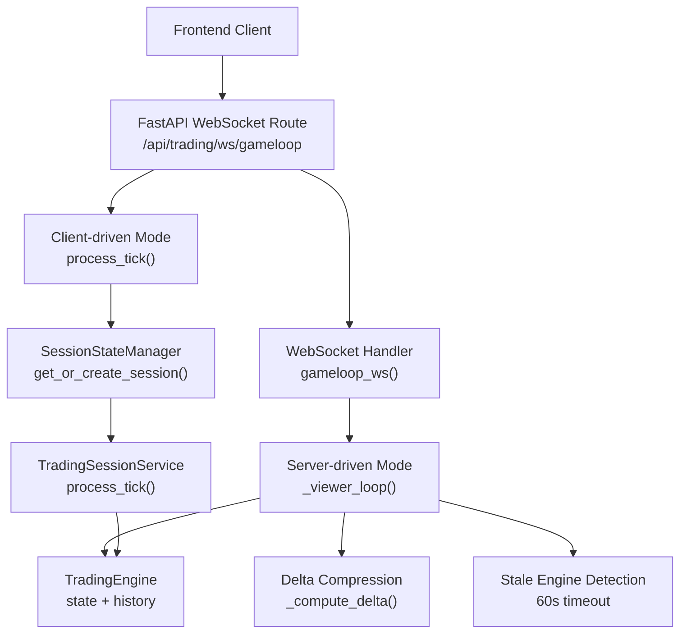
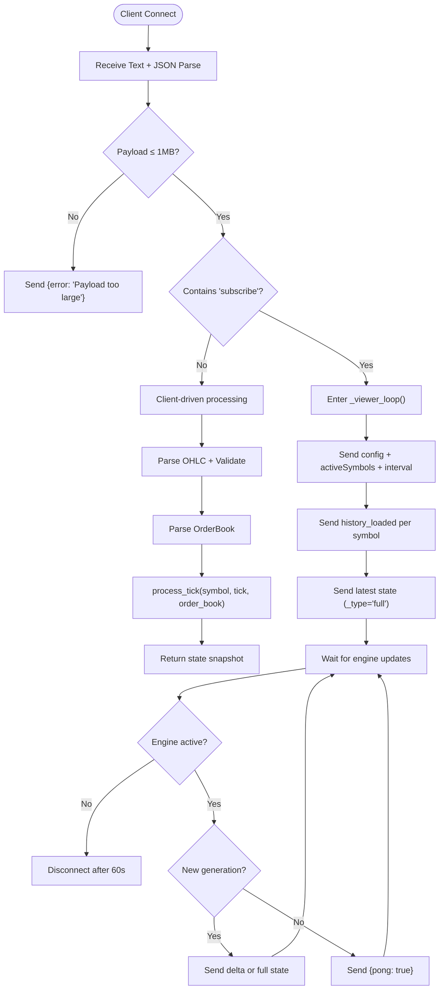
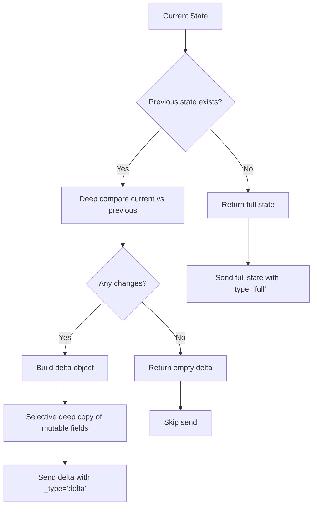
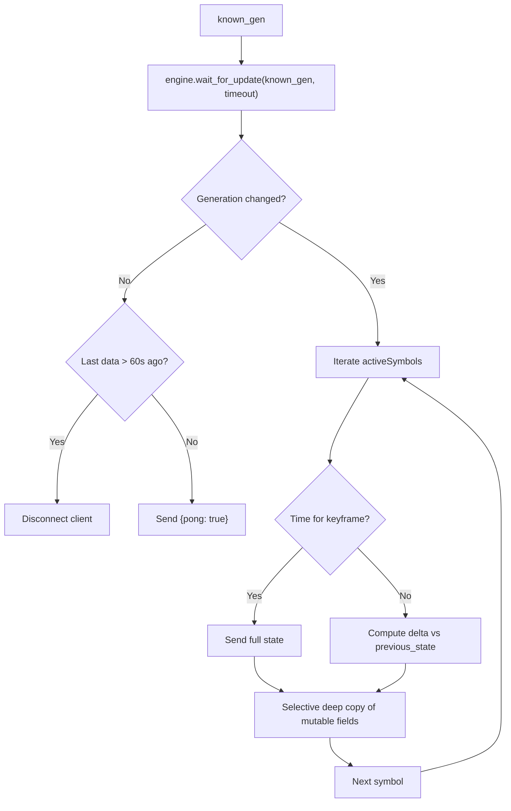
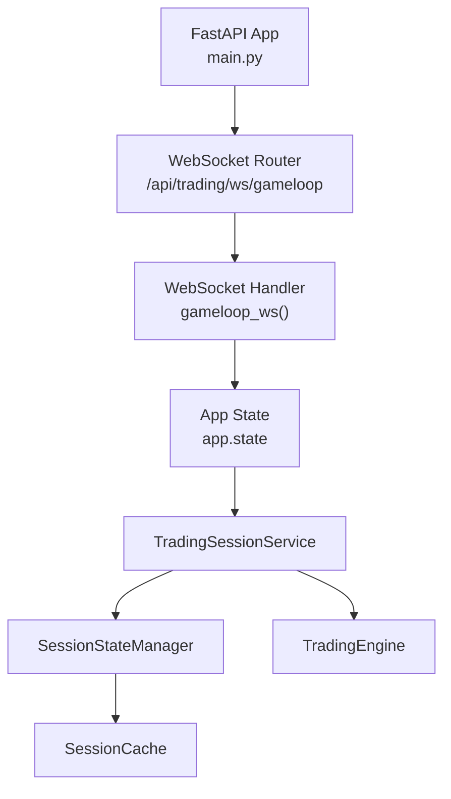

# WebSocket Interface

<cite>
**Referenced Files in This Document**
- [gameloop.py](file://backend/app/api/websocket/gameloop.py)
- [main.py](file://backend/app/main.py)
- [dependencies.py](file://backend/app/api/dependencies.py)
- [schemas.py](file://backend/app/infrastructure/serialization/schemas.py)
- [config.py](file://backend/app/config.py)
- [base.yaml](file://backend/config/base.yaml)
- [session_state_manager.py](file://backend/app/application/services/session_state_manager.py)
- [trading_session.py](file://backend/app/application/services/trading_session.py)
- [engine.py](file://backend/app/application/engine.py)
</cite>

## Update Summary
**Changes Made**
- Updated WebSocket implementation to reflect SessionStateManager successfully wired to FastAPI application
- Enhanced WebSocket handler with comprehensive error handling for stale engines (>60s inactivity)
- Added client-driven WebSocket mode operation alongside server-driven streaming
- Improved delta compression implementation with deep equality checking and selective copying
- Updated connection management with payload size limits and enhanced error recovery

## Table of Contents
1. [Introduction](#introduction)
2. [Project Structure](#project-structure)
3. [Core Components](#core-components)
4. [Architecture Overview](#architecture-overview)
5. [Detailed Component Analysis](#detailed-component-analysis)
6. [Dependency Analysis](#dependency-analysis)
7. [Performance Considerations](#performance-considerations)
8. [Troubleshooting Guide](#troubleshooting-guide)
9. [Conclusion](#conclusion)

## Introduction
This document describes the GlassyTrade AI v5 WebSocket interface used by frontends to receive live trading state and market data. It covers connection establishment, message formats, event types, streaming protocols, configuration, authentication, and connection management. The interface now features both server-driven and client-driven modes with enhanced delta compression, comprehensive error handling for stale engines, and robust session state management through the SessionStateManager.

## Project Structure
The WebSocket endpoint is implemented as a FastAPI WebSocket route and integrated into the application lifecycle. The backend starts a trading engine and exposes both server-driven streaming loops and client-driven processing capabilities to connected clients.



**Diagram sources**
- [gameloop.py:127-225](file://backend/app/api/websocket/gameloop.py#L127-L225)
- [gameloop.py:227-397](file://backend/app/api/websocket/gameloop.py#L227-L397)
- [main.py:240-252](file://backend/app/main.py#L240-L252)
- [session_state_manager.py:103-201](file://backend/app/application/services/session_state_manager.py#L103-L201)

**Section sources**
- [main.py:240-252](file://backend/app/main.py#L240-L252)
- [gameloop.py:127-225](file://backend/app/api/websocket/gameloop.py#L127-L225)

## Core Components
- **Dual-mode WebSocket**: Supports both server-driven streaming from TradingEngine and client-driven processing through SessionStateManager
- **Enhanced Delta Compression**: Deep equality checking with selective copying of mutable objects for memory efficiency
- **Stale Engine Detection**: Automatic disconnection after 60 seconds of no engine activity to prevent zombie connections
- **Robust Error Handling**: Comprehensive exception handling for JSON parsing, network errors, and engine state issues
- **Payload Protection**: 1MB size limit to prevent memory exhaustion attacks
- **Session State Management**: Thread-safe per-symbol state management with automatic cleanup and eviction policies

Key behaviors:
- Clients can choose between server-driven mode (recommended) or client-driven mode for backward compatibility
- Server-driven mode provides efficient delta compression with periodic full snapshots
- Client-driven mode processes incoming tick data through the trading pipeline
- Automatic session cleanup prevents memory leaks with 24-hour idle timeout

**Section sources**
- [gameloop.py:127-225](file://backend/app/api/websocket/gameloop.py#L127-L225)
- [gameloop.py:227-397](file://backend/app/api/websocket/gameloop.py#L227-L397)
- [session_state_manager.py:103-201](file://backend/app/application/services/session_state_manager.py#L103-L201)

## Architecture Overview
The WebSocket subsystem integrates with the application's service graph and trading engine, providing dual-mode operation with enhanced reliability and performance.

```mermaid
sequenceDiagram
participant C as "Client"
participant R as "FastAPI Router"
participant H as "WebSocket Handler"
participant GS as "Global State<br/>app.state"
participant SS as "Session Service<br/>TradingSessionService"
participant SM as "SessionStateManager"
participant E as "TradingEngine"
C->>R : "Connect to /api/trading/ws/gameloop"
R->>H : "Accept WebSocket"
H->>GS : "Access app.state.trading_session"
H->>SS : "Get session service instance"
alt Server-driven mode
H->>E : "get_active_symbols(), get_history(), get_latest_state()"
H-->>C : "{status : 'server_mode', ... }"
H-->>C : "{status : 'history_loaded', history[], count}"
H-->>C : "{...state, _type : 'full'}"
loop Streaming Updates
H->>E : "wait_for_update(known_gen, timeout)"
alt New generation
H-->>C : "{...state, _type : 'delta'} or {pong : true}"
else Stale engine (>60s)
H-->>C : "Disconnect client"
end
end
else Client-driven mode
H->>SS : "get_or_create_session(symbol)"
H->>SM : "process_tick(symbol, tick, order_book)"
H-->>C : "state snapshot"
end
end
```

**Diagram sources**
- [gameloop.py:127-225](file://backend/app/api/websocket/gameloop.py#L127-L225)
- [gameloop.py:227-397](file://backend/app/api/websocket/gameloop.py#L227-L397)
- [trading_session.py:192-205](file://backend/app/application/services/trading_session.py#L192-L205)

## Detailed Component Analysis

### WebSocket Endpoint and Dual-Mode Operation
- **Endpoint**: `/api/trading/ws/gameloop`
- **Mode 1 - Server-driven**: Streams state from TradingEngine with delta compression
- **Mode 2 - Client-driven**: Processes incoming tick data through trading pipeline
- **Subscription**: Server-driven mode requires `{"subscribe": "SYMBOL"}`
- **Backward compatibility**: Client-driven mode supports legacy tick/order book payloads



**Diagram sources**
- [gameloop.py:127-225](file://backend/app/api/websocket/gameloop.py#L127-L225)
- [gameloop.py:227-397](file://backend/app/api/websocket/gameloop.py#L227-L397)

**Section sources**
- [gameloop.py:127-225](file://backend/app/api/websocket/gameloop.py#L127-L225)
- [gameloop.py:227-397](file://backend/app/api/websocket/gameloop.py#L227-L397)

### Enhanced Delta Compression Implementation
The WebSocket handler implements sophisticated delta compression with deep equality checking and selective copying of mutable objects.

**Delta Compression Features**:
- **Deep Equality Checking**: Recursive comparison of nested dictionaries and lists
- **Selective Copying**: Deep copy only mutable objects (portfolio, amt) to prevent reference sharing
- **Symbol Tracking**: Maintains previous state per symbol for accurate delta computation
- **Keyframe Strategy**: Full snapshots every 30 seconds or when state significantly changes



**Diagram sources**
- [gameloop.py:65-77](file://backend/app/api/websocket/gameloop.py#L65-L77)
- [gameloop.py:318-351](file://backend/app/api/websocket/gameloop.py#L318-L351)

**Section sources**
- [gameloop.py:65-77](file://backend/app/api/websocket/gameloop.py#L65-L77)
- [gameloop.py:318-351](file://backend/app/api/websocket/gameloop.py#L318-L351)

### Message Formats and Events

#### Outgoing Messages (Server to Client)
- **Configuration and context**:
  - Keys: `status`, `symbol`, `activeSymbols`, `exchange`, `interval`
  - Purpose: Inform client about streaming context and timeframe
- **Historical data**:
  - Keys: `status`, `symbol`, `_symbol`, `history[]`, `count`
  - Purpose: Provide recent candle history for rendering
- **Full state snapshot**:
  - Keys: `_type = "full"`, plus all state fields
  - Purpose: Initial full state after connecting
- **Delta update**:
  - Keys: `_symbol`, `_type = "delta"`, and changed fields
  - Purpose: Efficient incremental updates
- **Keepalive**:
  - Keys: `pong = true`
  - Purpose: Probes connectivity; sent when no new data

#### Incoming Messages (Client to Server)
- **Subscribe**:
  - Keys: `subscribe` (string)
  - Purpose: Switch to server-driven streaming mode
- **Unsubscribe**:
  - Keys: `unsubscribe` (boolean/string)
  - Purpose: Gracefully terminate streaming
- **Ping**:
  - Keys: `ping` (optional)
  - Behavior: Handled passively; server sends pong on its own schedule
- **Client-driven tick data**:
  - Keys: `symbol`, `tick`, `orderBook`, `history`
  - Purpose: Process tick data through trading pipeline

**Section sources**
- [gameloop.py:246-280](file://backend/app/api/websocket/gameloop.py#L246-L280)
- [gameloop.py:154-201](file://backend/app/api/websocket/gameloop.py#L154-L201)

### Real-Time Data Streaming Protocols
- **Server-driven polling**: The handler waits for the engine to emit a new generation, then broadcasts updates
- **Delta compression**: Compares current state against the last known state per symbol and only sends changed fields
- **Keyframe cadence**: Full snapshots are sent periodically to resync clients
- **Stale engine protection**: Disconnects clients after 60 seconds of no engine activity



**Diagram sources**
- [gameloop.py:302-356](file://backend/app/api/websocket/gameloop.py#L302-L356)

**Section sources**
- [gameloop.py:302-356](file://backend/app/api/websocket/gameloop.py#L302-L356)

### Message Schemas for Data Types
The backend serializes state and market data using DTOs. The WebSocket handler emits state dictionaries and converts historical candles to camelCase fields.

- **OHLC candle schema (camelCase)**:
  - Fields: `time`, `open`, `high`, `low`, `close`, `volume`, `vwap`, `takerBuyVolume`, `delta`
- **OrderBook schema (camelCase)**:
  - Fields: `bids[]`, `asks[]` with `price`, `quantity`
- **State snapshot**:
  - Includes AMT analysis, portfolio, signals, and other trading state fields
  - Converted to camelCase for JSON transport

**Section sources**
- [schemas.py:31-42](file://backend/app/infrastructure/serialization/schemas.py#L31-L42)
- [schemas.py:50-53](file://backend/app/infrastructure/serialization/schemas.py#L50-L53)

### WebSocket Endpoint Configuration and Authentication
- **Endpoint**: `/api/trading/ws/gameloop`
- **Transport**: WebSocket over HTTPS (via FastAPI)
- **Authentication**: Not enforced by the WebSocket handler itself; rely on upstream controls (e.g., reverse proxy, middleware)
- **CORS**: Enabled for configured origins at application startup

Operational settings:
- **Stream interval**: Controlled by `settings.STREAM_INTERVAL`
- **Default exchange**: Controlled by `settings.DEFAULT_EXCHANGE`
- **Active symbols**: Determined by the TradingEngine
- **Payload limit**: 1MB maximum payload size

**Section sources**
- [main.py:222-233](file://backend/app/main.py#L222-L233)
- [gameloop.py:148-151](file://backend/app/api/websocket/gameloop.py#L148-L151)

### Connection Management
- **Accept**: The route accepts the WebSocket connection immediately
- **Graceful disconnect**: Client can send unsubscribe to stop streaming
- **Timeout**: The handler waits up to 5 seconds for engine updates; otherwise sends a keepalive
- **Stale engine protection**: Disconnects clients after 60 seconds of no engine activity
- **Payload protection**: Rejects payloads larger than 1MB with error response
- **Error handling**: JSON decode failures, OS/network errors, and unexpected exceptions are handled with appropriate close codes

**Section sources**
- [gameloop.py:130-135](file://backend/app/api/websocket/gameloop.py#L130-L135)
- [gameloop.py:203-224](file://backend/app/api/websocket/gameloop.py#L203-L224)
- [gameloop.py:304-314](file://backend/app/api/websocket/gameloop.py#L304-L314)

### Examples

#### Example: Subscribe to a Symbol (Server-driven mode)
- **Client sends**:
  ```json
  {"subscribe": "CRUDEOIL 16 APR 8900 CALL"}
  ```
- **Server responds**:
  - Config message with active symbols and exchange info
  - History-loaded messages per symbol
  - Latest state snapshot as full state
  - Subsequent deltas keyed by symbol

**Section sources**
- [gameloop.py:154-159](file://backend/app/api/websocket/gameloop.py#L154-L159)
- [gameloop.py:246-280](file://backend/app/api/websocket/gameloop.py#L246-L280)

#### Example: Client-driven Processing
- **Client sends**:
  ```json
  {
    "symbol": "CRUDEOIL 16 APR 8900 CALL",
    "tick": {"time": "...", "open": 4500, "high": 4520, "low": 4490, "close": 4515, "volume": 100},
    "orderBook": {"bids": [...], "asks": [...]}
  }
  ```
- **Server responds**:
  - State snapshot reflecting processed tick data
  - Includes portfolio, AMT analysis, and trading state

**Section sources**
- [gameloop.py:185-201](file://backend/app/api/websocket/gameloop.py#L185-L201)

#### Example: Handle Connection Re-establishment
- **Client reconnects and resends subscribe**
- **Server replays history and latest state**
- **Client applies deltas incrementally to reconstruct state**
- **Automatic stale engine detection prevents zombie connections**

**Section sources**
- [gameloop.py:227-397](file://backend/app/api/websocket/gameloop.py#L227-L397)

### Client Implementation Guidelines
- **Connect to** `/api/trading/ws/gameloop`
- **Choose mode**: Use server-driven mode for optimal performance, client-driven for backward compatibility
- **On connect, send subscribe** with the desired symbol for server-driven mode
- **Maintain a local state map** keyed by symbol
- **Apply full snapshots** as initial state
- **Apply deltas** by merging changed fields
- **Handle stale engine detection** by reconnecting automatically
- **Implement exponential backoff** for reconnection attempts
- **Monitor payload sizes** to avoid 1MB limit violations

## Dependency Analysis
The WebSocket handler depends on the service graph and TradingEngine to source state and history. The application lifecycle initializes the engine and makes it available to the handler through app.state.



**Diagram sources**
- [main.py:240-252](file://backend/app/main.py#L240-L252)
- [trading_session.py:192-205](file://backend/app/application/services/trading_session.py#L192-L205)
- [session_state_manager.py:103-201](file://backend/app/application/services/session_state_manager.py#L103-L201)

**Section sources**
- [main.py:240-252](file://backend/app/main.py#L240-L252)
- [trading_session.py:192-205](file://backend/app/application/services/trading_session.py#L192-L205)
- [session_state_manager.py:103-201](file://backend/app/application/services/session_state_manager.py#L103-L201)

## Performance Considerations
- **Delta compression**: Reduces payload size by sending only changed fields per symbol
- **Keyframe snapshots**: Full snapshots every ~30 seconds ensure clients can resync without re-requesting history
- **Stale engine protection**: Prevents resource waste from zombie connections
- **Payload limits**: 1MB size limit prevents memory exhaustion attacks
- **Selective copying**: Deep copy only mutable objects (portfolio, amt) to minimize memory usage
- **Backpressure**: The handler polls for updates with a timeout; idle periods trigger keepalive
- **Bandwidth optimization**: Prefer subscribing to only the symbols needed; avoid unnecessary subscriptions

## Troubleshooting Guide
Common issues and resolutions:
- **Invalid JSON**: Server closes with error and abnormal close code; ensure client sends valid JSON
- **Engine not started**: Server responds with error instructing client to retry
- **Stale engine detection**: Server disconnects after 60 seconds of no activity; reconnect to resume streaming
- **Payload too large**: Server rejects payloads > 1MB with error message
- **Network errors**: Handler logs warnings and attempts to close socket cleanly
- **Unexpected errors**: Server logs and closes with internal error code

Client-side checks:
- **Verify endpoint and CORS configuration**
- **Implement exponential backoff** on reconnection
- **Handle stale engine detection** by implementing automatic reconnection
- **Validate incoming messages** and apply deltas safely
- **Monitor payload sizes** to stay within 1MB limit

**Section sources**
- [gameloop.py:203-224](file://backend/app/api/websocket/gameloop.py#L203-L224)
- [gameloop.py:304-314](file://backend/app/api/websocket/gameloop.py#L304-L314)

## Conclusion
GlassyTrade AI v5 provides a robust, dual-mode WebSocket interface for real-time market state streaming. The enhanced implementation features both server-driven and client-driven modes with sophisticated delta compression, comprehensive error handling for stale engines, and thread-safe session state management. Clients receive configuration, historical data, full snapshots, and efficient deltas, with periodic keepalives and automatic stale engine detection to maintain connection health. The 1MB payload protection and selective copying optimizations ensure reliable, high-performance real-time experiences even under heavy load conditions.