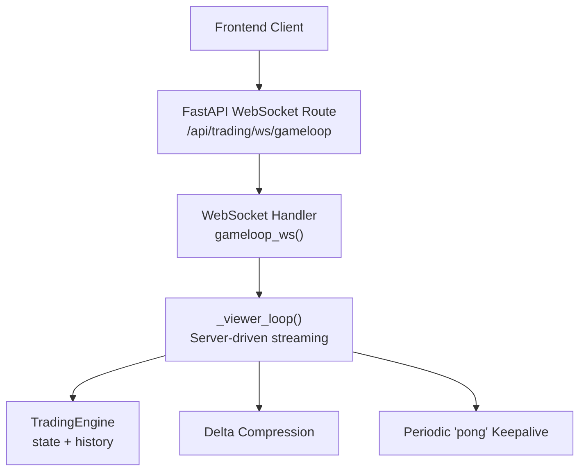
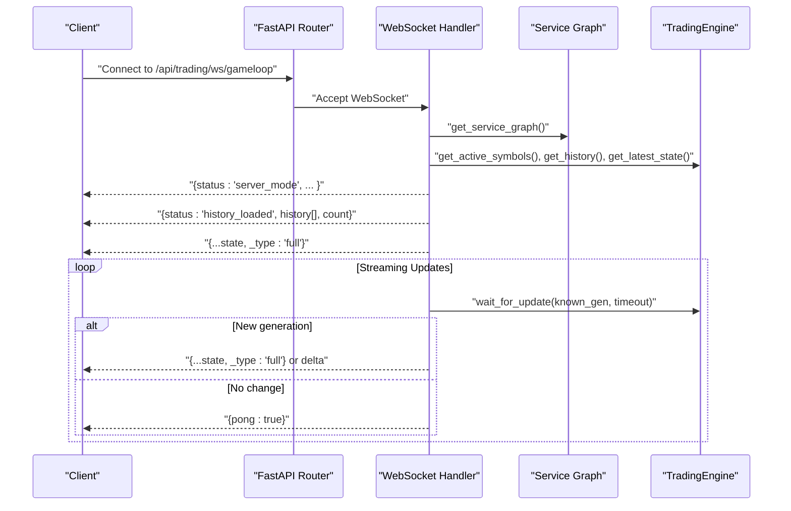
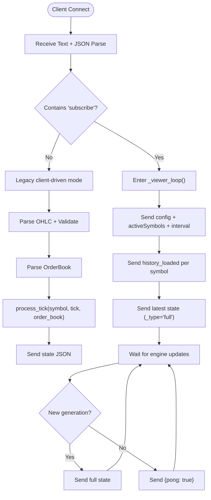
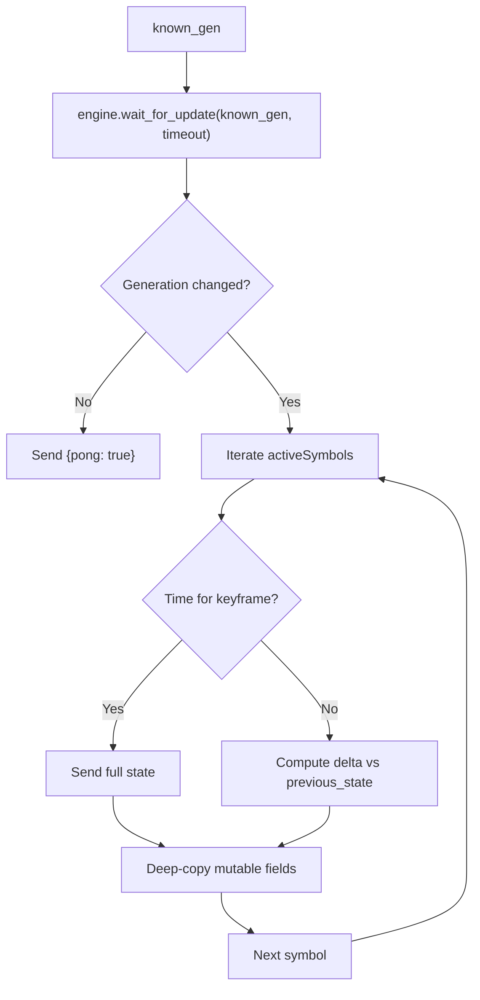
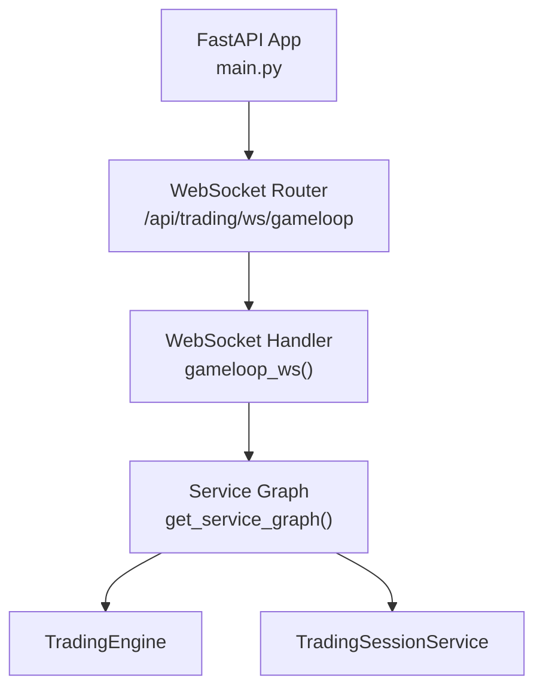

# WebSocket Interface

<cite>
**Referenced Files in This Document**
- [gameloop.py](file://backend/app/api/websocket/gameloop.py)
- [main.py](file://backend/app/main.py)
- [dependencies.py](file://backend/app/api/dependencies.py)
- [schemas.py](file://backend/app/infrastructure/serialization/schemas.py)
- [config.py](file://backend/app/config.py)
- [base.yaml](file://backend/config/base.yaml)
</cite>

## Table of Contents
1. [Introduction](#introduction)
2. [Project Structure](#project-structure)
3. [Core Components](#core-components)
4. [Architecture Overview](#architecture-overview)
5. [Detailed Component Analysis](#detailed-component-analysis)
6. [Dependency Analysis](#dependency-analysis)
7. [Performance Considerations](#performance-considerations)
8. [Troubleshooting Guide](#troubleshooting-guide)
9. [Conclusion](#conclusion)

## Introduction
This document describes the GlassyTrade AI v5 WebSocket interface used by frontends to receive live trading state and market data. It covers connection establishment, message formats, event types, streaming protocols, configuration, authentication, and connection management. It also documents delta compression, heartbeat behavior, error handling, and client implementation guidelines for robust real-time operation.

## Project Structure
The WebSocket endpoint is implemented as a FastAPI WebSocket route and integrated into the application lifecycle. The backend starts a trading engine and exposes a server-driven streaming loop to connected clients.

**Diagram sources**
- [gameloop.py:112-196](file://backend/app/api/websocket/gameloop.py#L112-L196)
- [gameloop.py:198-337](file://backend/app/api/websocket/gameloop.py#L198-L337)
- [main.py:83-127](file://backend/app/main.py#L83-L127)

**Section sources**
- [main.py:80-81](file://backend/app/main.py#L80-L81)
- [main.py:220](file://backend/app/main.py#L220)

## Core Components
- WebSocket route: Exposes a single endpoint for real-time state streaming.
- Server-driven mode: The backend pushes state updates from the TradingEngine.
- Delta compression: Sends compact diffs to reduce bandwidth.
- Keepalive: Periodic "pong" messages maintain connection health.
- Error handling: Structured handling for JSON, network, and runtime errors.

Key behaviors:
- Clients connect and send a subscription message to select a symbol.
- The server responds with configuration, historical candles, and a full snapshot.
- Subsequent updates are deltas keyed by symbol, with periodic full snapshots.

**Section sources**
- [gameloop.py:112-196](file://backend/app/api/websocket/gameloop.py#L112-L196)
- [gameloop.py:198-337](file://backend/app/api/websocket/gameloop.py#L198-L337)

## Architecture Overview
The WebSocket subsystem integrates with the application’s service graph and trading engine. The handler validates inputs, streams configuration and history, and then continuously streams state updates.

**Diagram sources**
- [gameloop.py:112-196](file://backend/app/api/websocket/gameloop.py#L112-L196)
- [gameloop.py:198-337](file://backend/app/api/websocket/gameloop.py#L198-L337)
- [dependencies.py:324-327](file://backend/app/api/dependencies.py#L324-L327)

## Detailed Component Analysis

### WebSocket Endpoint and Control Flow
- Endpoint: /api/trading/ws/gameloop
- Mode: Server-driven streaming from TradingEngine
- Subscription: Client sends a subscribe message with the symbol
- Backward compatibility: Client-driven mode supports legacy clients sending tick/order book payloads

**Diagram sources**
- [gameloop.py:112-196](file://backend/app/api/websocket/gameloop.py#L112-L196)
- [gameloop.py:198-337](file://backend/app/api/websocket/gameloop.py#L198-L337)

**Section sources**
- [gameloop.py:112-196](file://backend/app/api/websocket/gameloop.py#L112-L196)
- [gameloop.py:198-337](file://backend/app/api/websocket/gameloop.py#L198-L337)

### Message Formats and Events

#### Outgoing Messages (Server to Client)
- Configuration and context:
  - Keys: status, symbol, activeSymbols, exchange, interval
  - Purpose: Inform client about streaming context and timeframe
- Historical data:
  - Keys: status, symbol, _symbol, history[], count
  - Purpose: Provide recent candle history for rendering
- Full state snapshot:
  - Keys: _type = "full", plus all state fields
  - Purpose: Initial full state after connecting
- Delta update:
  - Keys: _symbol, _type = "delta", and changed fields
  - Purpose: Efficient incremental updates
- Keepalive:
  - Keys: pong = true
  - Purpose: Probes connectivity; sent when no new data

Notes:
- The server may send a full snapshot every ~30 seconds or when a keyframe is needed.
- The symbol key "_symbol" is included in per-symbol messages.

**Section sources**
- [gameloop.py:214-248](file://backend/app/api/websocket/gameloop.py#L214-L248)
- [gameloop.py:277-302](file://backend/app/api/websocket/gameloop.py#L277-L302)
- [gameloop.py:272](file://backend/app/api/websocket/gameloop.py#L272)

#### Incoming Messages (Client to Server)
- Subscribe:
  - Keys: subscribe (string)
  - Purpose: Start server-driven streaming for the given symbol
- Unsubscribe:
  - Keys: unsubscribe (boolean/string)
  - Purpose: Gracefully terminate streaming
- Ping:
  - Keys: ping (optional)
  - Behavior: Handled passively; server sends pong on its own schedule

Note:
- The handler does not respond to client messages in server-driven mode; it listens for unsubscribe/ping only.

**Section sources**
- [gameloop.py:127-131](file://backend/app/api/websocket/gameloop.py#L127-L131)
- [gameloop.py:340-355](file://backend/app/api/websocket/gameloop.py#L340-L355)

### Real-Time Data Streaming Protocols
- Server-driven polling: The handler waits for the engine to emit a new generation, then broadcasts updates.
- Delta compression: Compares current state against the last known state per symbol and only sends changed fields.
- Keyframe cadence: Full snapshots are sent periodically to resync clients.

**Diagram sources**
- [gameloop.py:269-310](file://backend/app/api/websocket/gameloop.py#L269-L310)

**Section sources**
- [gameloop.py:250-310](file://backend/app/api/websocket/gameloop.py#L250-L310)

### Message Schemas for Data Types
The backend serializes state and market data using DTOs. The WebSocket handler emits state dictionaries and converts historical candles to camelCase fields.

- OHLC candle schema (camelCase):
  - Fields: time, open, high, low, close, volume, vwap, takerBuyVolume, delta
- OrderBook schema (camelCase):
  - Fields: bids[], asks[] with price, quantity
- State snapshot:
  - Includes AMT analysis, portfolio, signals, and other trading state fields
  - Converted to camelCase for JSON transport

Note:
- The handler uses a converter to serialize OHLC history items to camelCase for transmission.

**Section sources**
- [schemas.py:31-42](file://backend/app/infrastructure/serialization/schemas.py#L31-L42)
- [schemas.py:50-53](file://backend/app/infrastructure/serialization/schemas.py#L50-L53)
- [gameloop.py:231-239](file://backend/app/api/websocket/gameloop.py#L231-L239)

### WebSocket Endpoint Configuration and Authentication
- Endpoint: /api/trading/ws/gameloop
- Transport: WebSocket over HTTPS (via FastAPI)
- Authentication: Not enforced by the WebSocket handler itself; rely on upstream controls (e.g., reverse proxy, middleware)
- CORS: Enabled for configured origins at application startup

Operational settings:
- Stream interval: Controlled by settings.STREAM_INTERVAL
- Default exchange: Controlled by settings.DEFAULT_EXCHANGE
- Active symbols: Determined by the TradingEngine

**Section sources**
- [main.py:178-185](file://backend/app/main.py#L178-L185)
- [gameloop.py:217-223](file://backend/app/api/websocket/gameloop.py#L217-L223)
- [config.py:75](file://backend/app/config.py#L75)
- [config.py:48](file://backend/app/config.py#L48)

### Connection Management
- Accept: The route accepts the WebSocket connection immediately.
- Graceful disconnect: Client can send unsubscribe to stop streaming.
- Timeout: The handler waits up to 5 seconds for engine updates; otherwise sends a keepalive.
- Errors: JSON decode failures, OS/network errors, and unexpected exceptions are handled with appropriate close codes.

**Section sources**
- [gameloop.py:114](file://backend/app/api/websocket/gameloop.py#L114)
- [gameloop.py:340-355](file://backend/app/api/websocket/gameloop.py#L340-L355)
- [gameloop.py:318-327](file://backend/app/api/websocket/gameloop.py#L318-L327)

### Examples

#### Example: Subscribe to a Symbol
- Client sends:
  - Keys: subscribe, with the symbol string
- Server responds:
  - Config message
  - History-loaded messages per symbol
  - Latest state snapshot
  - Subsequent deltas or periodic full snapshots

**Section sources**
- [gameloop.py:127-131](file://backend/app/api/websocket/gameloop.py#L127-L131)
- [gameloop.py:214-248](file://backend/app/api/websocket/gameloop.py#L214-L248)

#### Example: Receive Real-Time State Updates
- Server sends:
  - Full snapshot initially
  - Subsequent deltas keyed by symbol
  - Periodic full snapshots every ~30 seconds
  - Keepalive {pong: true} when no new data

**Section sources**
- [gameloop.py:277-302](file://backend/app/api/websocket/gameloop.py#L277-L302)
- [gameloop.py:284-296](file://backend/app/api/websocket/gameloop.py#L284-L296)
- [gameloop.py:272](file://backend/app/api/websocket/gameloop.py#L272)

#### Example: Handle Connection Re-establishment
- Client reconnects and resends subscribe
- Server replays history and latest state
- Client applies deltas incrementally to reconstruct state

**Section sources**
- [gameloop.py:198-337](file://backend/app/api/websocket/gameloop.py#L198-L337)

### Client Implementation Guidelines
- Connect to /api/trading/ws/gameloop
- On connect, send subscribe with the desired symbol
- Maintain a local state map keyed by symbol
- Apply full snapshots as initial state
- Apply deltas by merging changed fields
- Periodically request a full snapshot if desynchronized
- Handle {pong: true} as a keepalive indicator
- On unsubscribe or disconnect, reset local state and reconnect as needed

[No sources needed since this section provides general guidance]

## Dependency Analysis
The WebSocket handler depends on the service graph and the TradingEngine to source state and history. The application lifecycle initializes the engine and makes it available to the handler.

**Diagram sources**
- [main.py:83-127](file://backend/app/main.py#L83-L127)
- [dependencies.py:324-327](file://backend/app/api/dependencies.py#L324-L327)
- [gameloop.py:116-120](file://backend/app/api/websocket/gameloop.py#L116-L120)

**Section sources**
- [main.py:83-127](file://backend/app/main.py#L83-L127)
- [dependencies.py:324-327](file://backend/app/api/dependencies.py#L324-L327)
- [gameloop.py:116-120](file://backend/app/api/websocket/gameloop.py#L116-L120)

## Performance Considerations
- Delta compression reduces payload size by sending only changed fields per symbol.
- Keyframe snapshots (~30s cadence) ensure clients can resync without re-requesting history.
- Backpressure: The handler polls for updates with a timeout; idle periods trigger keepalive.
- Bandwidth: Prefer subscribing to only the symbols needed; avoid unnecessary subscriptions.

[No sources needed since this section provides general guidance]

## Troubleshooting Guide
Common issues and resolutions:
- Invalid JSON: Server closes with an error and abnormal close code; ensure client sends valid JSON.
- Engine not started: Server responds with an error instructing the client to retry.
- Network errors: Handler logs warnings and attempts to close the socket cleanly.
- Unexpected errors: Server logs and closes with an internal error code.

Client-side checks:
- Verify endpoint and CORS configuration.
- Implement exponential backoff on reconnection.
- Validate incoming messages and apply deltas safely.

**Section sources**
- [gameloop.py:174-195](file://backend/app/api/websocket/gameloop.py#L174-L195)
- [gameloop.py:204-207](file://backend/app/api/websocket/gameloop.py#L204-L207)

## Conclusion
GlassyTrade AI v5 provides a robust, server-driven WebSocket interface for real-time market state streaming. Clients receive configuration, historical data, full snapshots, and efficient deltas, with periodic keepalives to maintain connection health. By following the message formats and connection management guidelines, clients can build resilient, high-performance real-time experiences.