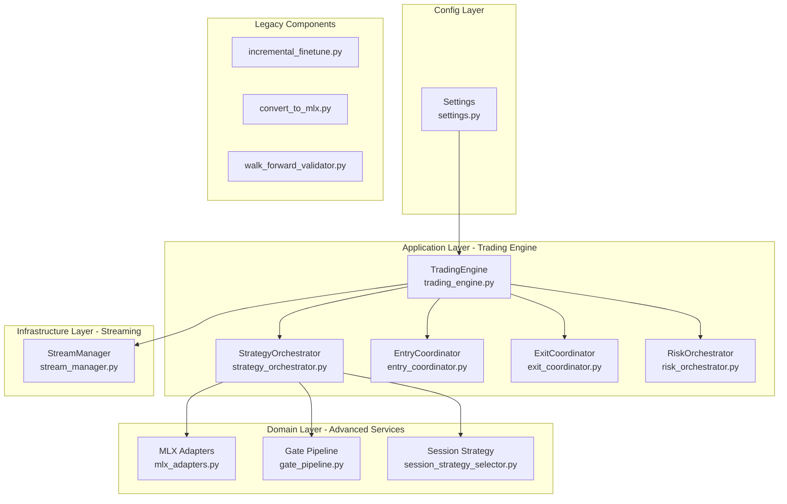
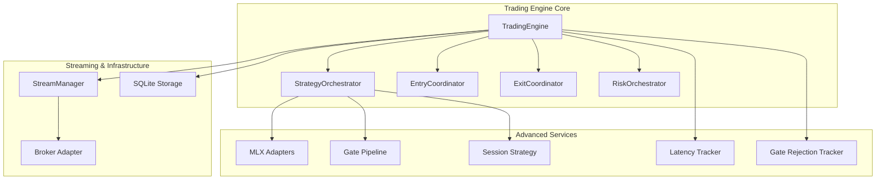
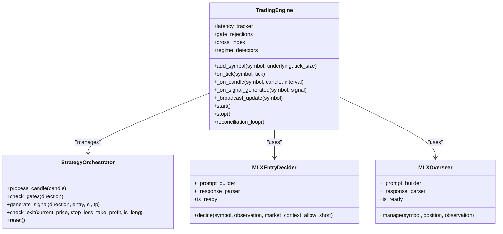
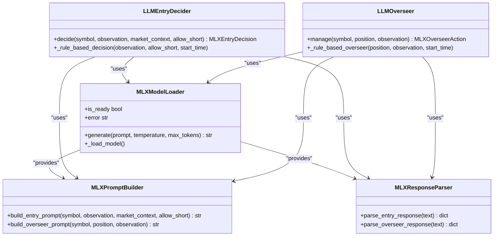
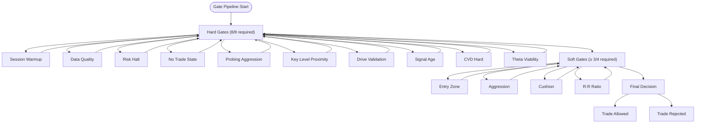
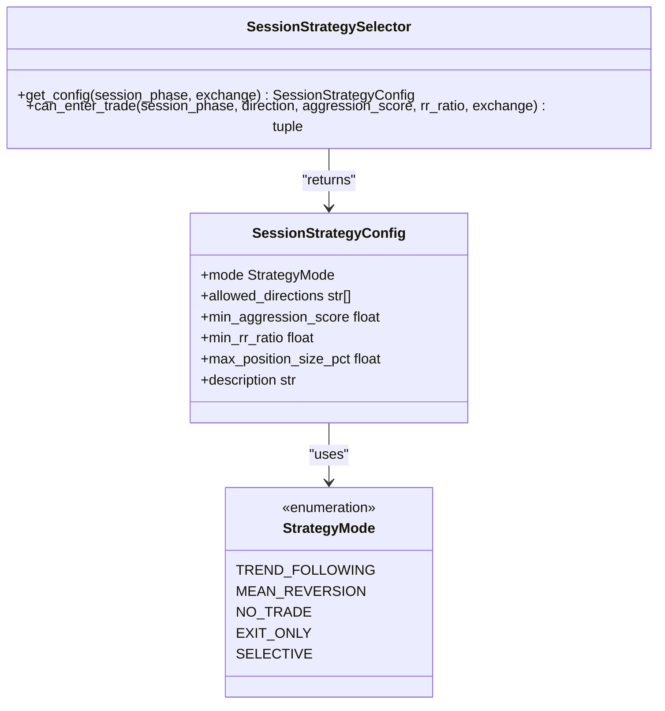
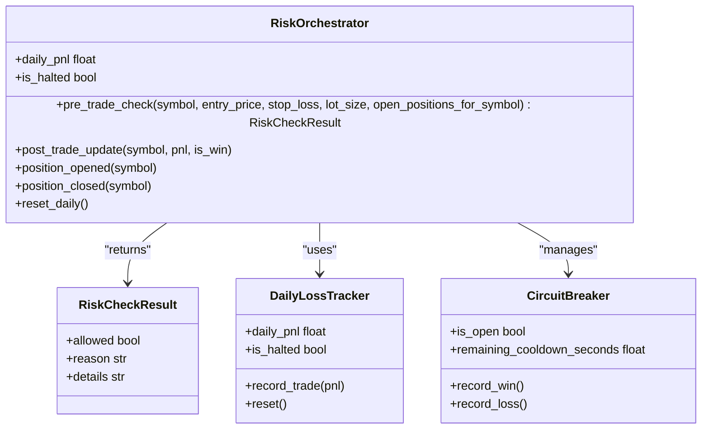
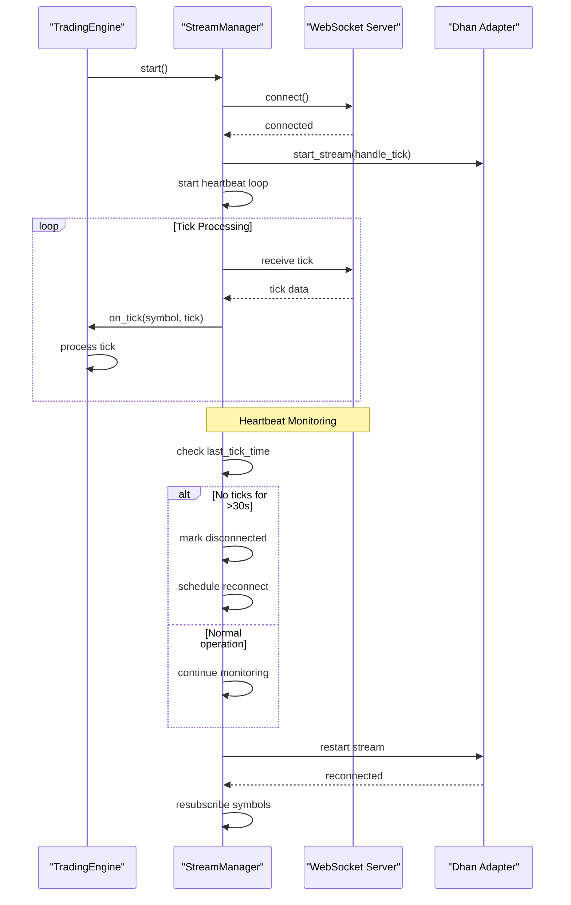
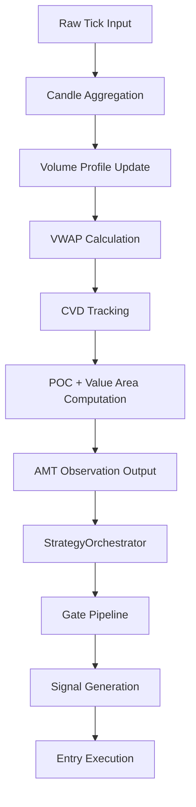
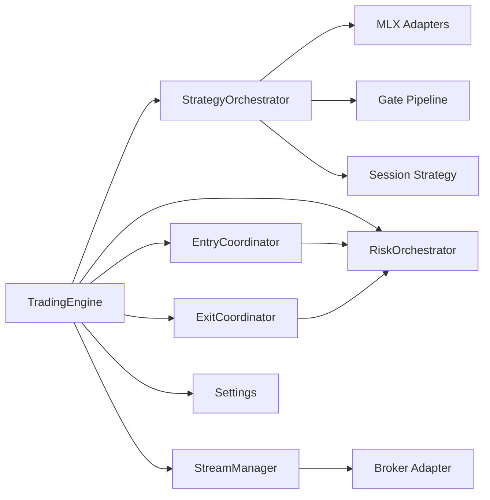

# Advanced Topics

<cite>
**Referenced Files in This Document**
- [main.py](file://appv2/backend/appv2/main.py)
- [trading_engine.py](file://appv2/backend/appv2/application/trading_engine.py)
- [strategy_orchestrator.py](file://appv2/backend/appv2/application/strategy_orchestrator.py)
- [data_pipeline.py](file://appv2/backend/appv2/application/data_pipeline.py)
- [mlx_adapters.py](file://appv2/backend/appv2/domain/services/mlx_adapters.py)
- [risk_orchestrator.py](file://appv2/backend/appv2/application/risk_orchestrator.py)
- [entry_coordinator.py](file://appv2/backend/appv2/application/entry_coordinator.py)
- [exit_coordinator.py](file://appv2/backend/appv2/application/exit_coordinator.py)
- [settings.py](file://appv2/backend/appv2/config/settings.py)
- [gate_pipeline.py](file://appv2/backend/appv2/domain/services/gate_pipeline.py)
- [session_strategy_selector.py](file://appv2/backend/appv2/domain/services/session_strategy_selector.py)
- [stream_manager.py](file://appv2/backend/appv2/infrastructure/stream_manager.py)
- [incremental_finetune.py](file://backend/scripts/incremental_finetune.py)
- [convert_to_mlx.py](file://backend/scripts/convert_to_mlx.py)
- [walk_forward_validator.py](file://backend/app/domain/services/walk_forward_validator.py)
- [backtest_engine.py](file://backend/app/application/services/backtest_engine.py)
- [rl_handler.py](file://backend/app/application/handlers/rl_handler.py)
- [signal_constructor.py](file://backend/app/application/handlers/signal_constructor.py)
- [regime_detector.py](file://backend/app/domain/fabio_ai/services/regime_detector.py)
- [risk_sizing_engine.py](file://backend/app/domain/services/risk_sizing_engine.py)
- [position_sizer.py](file://backend/app/domain/fabio_ai/services/position_sizer.py)
- [entities.py](file://backend/app/domain/trading/models/entities.py)
- [enums.py](file://backend/app/domain/trading/models/enums.py)
- [session_risk_coordinator.py](file://backend/app/application/services/session_risk_coordinator.py)
</cite>

## Update Summary
**Changes Made**
- Added comprehensive appv2 architecture documentation with new TradingEngine and StrategyOrchestrator components
- Integrated advanced MLX adapter system with LLMEntryDecider and LLMOverseer
- Documented new gate pipeline system with 12 hard and soft gates
- Added session strategy selector with exchange-specific configurations
- Included performance optimization features like tick throttling and latency tracking
- Enhanced risk management with circuit breakers and position sizing
- Added comprehensive WebSocket streaming with auto-reconnect capabilities

## Table of Contents
1. [Introduction](#introduction)
2. [Project Structure](#project-structure)
3. [Core Components](#core-components)
4. [Architecture Overview](#architecture-overview)
5. [Detailed Component Analysis](#detailed-component-analysis)
6. [Dependency Analysis](#dependency-analysis)
7. [Performance Considerations](#performance-considerations)
8. [Troubleshooting Guide](#troubleshooting-guide)
9. [Conclusion](#conclusion)
10. [Appendices](#appendices)

## Introduction
This document provides advanced guidance for GlassyTrade AI v5, focusing on custom strategy development with the new appv2 architecture, machine learning model training and fine-tuning, reinforcement learning implementation, and performance optimization. The appv2 architecture introduces a comprehensive trading engine with advanced MLX adapters, sophisticated gate pipelines, and enhanced risk management systems. It documents the incremental fine-tuning process, MLX model conversion workflows, and walk-forward validation methodologies. Practical examples show how to develop custom entry/exit strategies, train custom AI models, and optimize system performance. Advanced trading concepts such as position sizing algorithms, risk management strategies, and market regime detection are explained, along with security considerations, system hardening, and scalability optimization. Guidance is included for extending the system with custom components, integrating new data sources, and developing proprietary trading algorithms.

## Project Structure
GlassyTrade AI v5 appv2 is organized into a comprehensive layered architecture:
- Application layer orchestrates the TradingEngine, StrategyOrchestrator, and specialized coordinators
- Domain layer encapsulates trading models, services, and AI-related logic including MLX adapters
- Infrastructure layer manages WebSocket streaming, broker adapters, and storage systems
- Config layer provides environment-based settings and strategy configurations
- Scripts provide ML workflows for incremental fine-tuning and model conversion
- Tests validate behavior across integration, unit, and validation suites

**Diagram sources**
- [main.py:1-241](file://appv2/backend/appv2/main.py#L1-L241)
- [trading_engine.py:1-638](file://appv2/backend/appv2/application/trading_engine.py#L1-L638)
- [strategy_orchestrator.py:1-245](file://appv2/backend/appv2/application/strategy_orchestrator.py#L1-L245)
- [mlx_adapters.py:1-658](file://appv2/backend/appv2/domain/services/mlx_adapters.py#L1-L658)
- [gate_pipeline.py:1-238](file://appv2/backend/appv2/domain/services/gate_pipeline.py#L1-L238)
- [session_strategy_selector.py:1-198](file://appv2/backend/appv2/domain/services/session_strategy_selector.py#L1-L198)
- [risk_orchestrator.py:1-160](file://appv2/backend/appv2/application/risk_orchestrator.py#L1-L160)
- [entry_coordinator.py:1-185](file://appv2/backend/appv2/application/entry_coordinator.py#L1-L185)
- [exit_coordinator.py:1-178](file://appv2/backend/appv2/application/exit_coordinator.py#L1-L178)
- [settings.py:1-123](file://appv2/backend/appv2/config/settings.py#L1-L123)
- [stream_manager.py:1-271](file://appv2/backend/appv2/infrastructure/stream_manager.py#L1-L271)

**Section sources**
- [main.py:1-241](file://appv2/backend/appv2/main.py#L1-L241)
- [trading_engine.py:1-638](file://appv2/backend/appv2/application/trading_engine.py#L1-L638)
- [strategy_orchestrator.py:1-245](file://appv2/backend/appv2/application/strategy_orchestrator.py#L1-L245)
- [mlx_adapters.py:1-658](file://appv2/backend/appv2/domain/services/mlx_adapters.py#L1-L658)
- [gate_pipeline.py:1-238](file://appv2/backend/appv2/domain/services/gate_pipeline.py#L1-L238)
- [session_strategy_selector.py:1-198](file://appv2/backend/appv2/domain/services/session_strategy_selector.py#L1-L198)
- [risk_orchestrator.py:1-160](file://appv2/backend/appv2/application/risk_orchestrator.py#L1-L160)
- [entry_coordinator.py:1-185](file://appv2/backend/appv2/application/entry_coordinator.py#L1-L185)
- [exit_coordinator.py:1-178](file://appv2/backend/appv2/application/exit_coordinator.py#L1-L178)
- [settings.py:1-123](file://appv2/backend/appv2/config/settings.py#L1-L123)
- [stream_manager.py:1-271](file://appv2/backend/appv2/infrastructure/stream_manager.py#L1-L271)

## Core Components
- **Trading Engine**: Complete live trading engine with all advanced features including throttle mechanism, footprint accumulator, opening classifier, regime detector, market structure classifier, structural stop engine, partition exit manager, drive decay tracker, latency tracker, gate rejection tracker, playbook guard, session risk tiers, capital ladder, session cache, volatility features, state snapshot builder, and MLX adapters.
- **Strategy Orchestrator**: Per-symbol strategy orchestration that processes candles through AMT analysis, market state machine, gate pipeline, and signal generation.
- **MLX Adapters**: Advanced LLM integration with LLMEntryDecider for entry decisions and LLMOverseer for active trade management, including lazy model loading and JSON response parsing.
- **Gate Pipeline**: Sophisticated 12-gate entry validation system with 8 hard gates (fail-fast) and 4 soft gates (quorum-based) for comprehensive trade filtering.
- **Session Strategy Selector**: Exchange-specific strategy configuration with different modes (TREND_FOLLOWING, MEAN_REVERSION, NO_TRADE, EXIT_ONLY, SELECTIVE) for various market sessions.
- **Risk Orchestrator**: Comprehensive risk management with daily loss tracking, circuit breakers, position sizing validation, and exposure limits.
- **Streaming Infrastructure**: Robust WebSocket management with auto-reconnect, heartbeat monitoring, and emergency pause/resume functionality.
- **Data Pipeline**: Multi-symbol, multi-timeframe processing pipeline that transforms ticks into AMT-ready observations.

**Section sources**
- [trading_engine.py:1-638](file://appv2/backend/appv2/application/trading_engine.py#L1-L638)
- [strategy_orchestrator.py:1-245](file://appv2/backend/appv2/application/strategy_orchestrator.py#L1-L245)
- [mlx_adapters.py:1-658](file://appv2/backend/appv2/domain/services/mlx_adapters.py#L1-L658)
- [gate_pipeline.py:1-238](file://appv2/backend/appv2/domain/services/gate_pipeline.py#L1-L238)
- [session_strategy_selector.py:1-198](file://appv2/backend/appv2/domain/services/session_strategy_selector.py#L1-L198)
- [risk_orchestrator.py:1-160](file://appv2/backend/appv2/application/risk_orchestrator.py#L1-L160)
- [stream_manager.py:1-271](file://appv2/backend/appv2/infrastructure/stream_manager.py#L1-L271)
- [data_pipeline.py:1-151](file://appv2/backend/appv2/application/data_pipeline.py#L1-L151)

## Architecture Overview
The appv2 architecture introduces a comprehensive trading system that integrates advanced MLX adapters with sophisticated risk controls and deterministic sizing. The TradingEngine serves as the central orchestrator, managing multiple per-symbol services including AMT analysis, market structure classification, and session-specific strategy execution. The StrategyOrchestrator processes market data through a multi-stage pipeline, while the MLX adapters provide intelligent decision-making capabilities. Advanced gate systems filter potential trades, and comprehensive risk management ensures systematic safety controls.

**Diagram sources**
- [trading_engine.py:77-638](file://appv2/backend/appv2/application/trading_engine.py#L77-L638)
- [strategy_orchestrator.py:54-245](file://appv2/backend/appv2/application/strategy_orchestrator.py#L54-L245)
- [mlx_adapters.py:386-658](file://appv2/backend/appv2/domain/services/mlx_adapters.py#L386-L658)
- [gate_pipeline.py:197-238](file://appv2/backend/appv2/domain/services/gate_pipeline.py#L197-L238)
- [session_strategy_selector.py:125-198](file://appv2/backend/appv2/domain/services/session_strategy_selector.py#L125-L198)
- [risk_orchestrator.py:35-160](file://appv2/backend/appv2/application/risk_orchestrator.py#L35-L160)
- [stream_manager.py:33-271](file://appv2/backend/appv2/infrastructure/stream_manager.py#L33-L271)

## Detailed Component Analysis

### Trading Engine Architecture
The TradingEngine serves as the central orchestrator for all trading activities, implementing a comprehensive system with 500ms tick throttling, footprint accumulation, and advanced market classification services.

**Diagram sources**
- [trading_engine.py:77-638](file://appv2/backend/appv2/application/trading_engine.py#L77-L638)
- [strategy_orchestrator.py:54-245](file://appv2/backend/appv2/application/strategy_orchestrator.py#L54-L245)
- [mlx_adapters.py:386-658](file://appv2/backend/appv2/domain/services/mlx_adapters.py#L386-L658)

**Section sources**
- [trading_engine.py:77-638](file://appv2/backend/appv2/application/trading_engine.py#L77-L638)
- [strategy_orchestrator.py:54-245](file://appv2/backend/appv2/application/strategy_orchestrator.py#L54-L245)
- [mlx_adapters.py:386-658](file://appv2/backend/appv2/domain/services/mlx_adapters.py#L386-L658)

### MLX Adapter System
The MLX adapter system provides intelligent decision-making through advanced LLM integration with lazy loading, prompt building, and response parsing capabilities.

**Diagram sources**
- [mlx_adapters.py:50-124](file://appv2/backend/appv2/domain/services/mlx_adapters.py#L50-L124)
- [mlx_adapters.py:150-311](file://appv2/backend/appv2/domain/services/mlx_adapters.py#L150-L311)
- [mlx_adapters.py:313-384](file://appv2/backend/appv2/domain/services/mlx_adapters.py#L313-L384)
- [mlx_adapters.py:386-533](file://appv2/backend/appv2/domain/services/mlx_adapters.py#L386-L533)
- [mlx_adapters.py:535-658](file://appv2/backend/appv2/domain/services/mlx_adapters.py#L535-L658)

**Section sources**
- [mlx_adapters.py:50-124](file://appv2/backend/appv2/domain/services/mlx_adapters.py#L50-L124)
- [mlx_adapters.py:150-311](file://appv2/backend/appv2/domain/services/mlx_adapters.py#L150-L311)
- [mlx_adapters.py:313-384](file://appv2/backend/appv2/domain/services/mlx_adapters.py#L313-L384)
- [mlx_adapters.py:386-533](file://appv2/backend/appv2/domain/services/mlx_adapters.py#L386-L533)
- [mlx_adapters.py:535-658](file://appv2/backend/appv2/domain/services/mlx_adapters.py#L535-L658)

### Gate Pipeline System
The gate pipeline implements a sophisticated 12-gate validation system with both hard gates (fail-fast) and soft gates (quorum-based) for comprehensive trade filtering.

**Diagram sources**
- [gate_pipeline.py:197-238](file://appv2/backend/appv2/domain/services/gate_pipeline.py#L197-L238)
- [gate_pipeline.py:48-155](file://appv2/backend/appv2/domain/services/gate_pipeline.py#L48-L155)
- [gate_pipeline.py:159-193](file://appv2/backend/appv2/domain/services/gate_pipeline.py#L159-L193)

**Section sources**
- [gate_pipeline.py:1-238](file://appv2/backend/appv2/domain/services/gate_pipeline.py#L1-L238)

### Session Strategy Configuration
The session strategy selector provides exchange-specific configurations with different trading modes for various market sessions and exchanges.

**Diagram sources**
- [session_strategy_selector.py:125-198](file://appv2/backend/appv2/domain/services/session_strategy_selector.py#L125-L198)
- [session_strategy_selector.py:28-44](file://appv2/backend/appv2/domain/services/session_strategy_selector.py#L28-L44)

**Section sources**
- [session_strategy_selector.py:1-198](file://appv2/backend/appv2/domain/services/session_strategy_selector.py#L1-L198)

### Risk Management and Circuit Breakers
The risk orchestrator implements comprehensive risk controls including daily loss tracking, circuit breakers, and position sizing validation.

**Diagram sources**
- [risk_orchestrator.py:35-160](file://appv2/backend/appv2/application/risk_orchestrator.py#L35-L160)
- [risk_orchestrator.py:28-33](file://appv2/backend/appv2/application/risk_orchestrator.py#L28-L33)

**Section sources**
- [risk_orchestrator.py:1-160](file://appv2/backend/appv2/application/risk_orchestrator.py#L1-L160)

### Streaming Infrastructure and WebSocket Management
The StreamManager provides robust WebSocket connectivity with auto-reconnect, heartbeat monitoring, and emergency pause/resume functionality.

**Diagram sources**
- [stream_manager.py:82-271](file://appv2/backend/appv2/infrastructure/stream_manager.py#L82-L271)

**Section sources**
- [stream_manager.py:1-271](file://appv2/backend/appv2/infrastructure/stream_manager.py#L1-L271)

### Data Pipeline and AMT Analysis
The data pipeline processes raw ticks through a comprehensive AMT analysis pipeline producing ready-to-use market observations.

**Diagram sources**
- [data_pipeline.py:67-114](file://appv2/backend/appv2/application/data_pipeline.py#L67-L114)
- [strategy_orchestrator.py:75-136](file://appv2/backend/appv2/application/strategy_orchestrator.py#L75-L136)

**Section sources**
- [data_pipeline.py:1-151](file://appv2/backend/appv2/application/data_pipeline.py#L1-L151)
- [strategy_orchestrator.py:1-245](file://appv2/backend/appv2/application/strategy_orchestrator.py#L1-L245)

## Dependency Analysis
The appv2 architecture establishes clear dependency relationships between components:
- TradingEngine depends on StrategyOrchestrator, EntryCoordinator, ExitCoordinator, and RiskOrchestrator
- StrategyOrchestrator depends on MLX adapters, gate pipeline, and session strategy selector
- MLX adapters integrate with existing prompt builders and response parsers
- Gate pipeline provides validation for all trading decisions
- Session strategy selector configures appropriate trading modes per market session
- Risk orchestrator coordinates with position sizing and circuit breakers
- Stream manager provides robust connectivity for all trading activities

**Diagram sources**
- [trading_engine.py:114-129](file://appv2/backend/appv2/application/trading_engine.py#L114-L129)
- [strategy_orchestrator.py:138-162](file://appv2/backend/appv2/application/strategy_orchestrator.py#L138-L162)
- [mlx_adapters.py:386-402](file://appv2/backend/appv2/domain/services/mlx_adapters.py#L386-L402)
- [gate_pipeline.py:197-238](file://appv2/backend/appv2/domain/services/gate_pipeline.py#L197-L238)
- [session_strategy_selector.py:129-159](file://appv2/backend/appv2/domain/services/session_strategy_selector.py#L129-L159)
- [risk_orchestrator.py:107-141](file://appv2/backend/appv2/application/risk_orchestrator.py#L107-L141)
- [stream_manager.py:33-73](file://appv2/backend/appv2/infrastructure/stream_manager.py#L33-L73)
- [settings.py:12-123](file://appv2/backend/appv2/config/settings.py#L12-L123)

**Section sources**
- [trading_engine.py:1-638](file://appv2/backend/appv2/application/trading_engine.py#L1-L638)
- [strategy_orchestrator.py:1-245](file://appv2/backend/appv2/application/strategy_orchestrator.py#L1-L245)
- [mlx_adapters.py:1-658](file://appv2/backend/appv2/domain/services/mlx_adapters.py#L1-L658)
- [gate_pipeline.py:1-238](file://appv2/backend/appv2/domain/services/gate_pipeline.py#L1-L238)
- [session_strategy_selector.py:1-198](file://appv2/backend/appv2/domain/services/session_strategy_selector.py#L1-L198)
- [risk_orchestrator.py:1-160](file://appv2/backend/appv2/application/risk_orchestrator.py#L1-L160)
- [stream_manager.py:1-271](file://appv2/backend/appv2/infrastructure/stream_manager.py#L1-L271)
- [settings.py:1-123](file://appv2/backend/appv2/config/settings.py#L1-L123)

## Performance Considerations
The appv2 architecture implements several performance optimization strategies:
- **Tick Throttling**: 500ms minimum interval per symbol reduces computational overhead while maintaining responsiveness
- **Lazy MLX Loading**: Model loading occurs on-demand with thread-safe initialization to minimize startup time
- **Asynchronous Processing**: All MLX inference operations use asyncio with configurable timeouts to prevent blocking
- **Efficient Data Structures**: Bounded deques and cached state objects minimize memory overhead
- **Heartbeat Monitoring**: Automatic WebSocket reconnect with exponential backoff prevents resource waste during disconnections
- **Latency Tracking**: Comprehensive p50/p95/p99 latency metrics enable performance monitoring and optimization
- **Gate Rejection Tracking**: Statistical tracking of gate failures helps identify bottlenecks in the decision pipeline
- **Vectorized Computations**: AMT calculations use optimized mathematical operations for candle processing

## Troubleshooting Guide
Common issues and resolutions for the appv2 architecture:
- **MLX Model Loading Failures**: Verify MLX model path exists and mlx-lm/mlx_vlm packages are installed; check lazy loader error messages
- **Gate Pipeline Rejections**: Review gate failure reasons and adjust thresholds in constants.py; ensure sufficient data quality
- **Session Strategy Misconfiguration**: Verify exchange settings and session phase detection; check strategy mode compatibility
- **Risk Orchestrator Failures**: Confirm daily loss limits and circuit breaker settings; review position sizing calculations
- **WebSocket Connectivity Issues**: Check heartbeat monitoring logs; verify auto-reconnect functionality and symbol resubscription
- **MLX Timeout Errors**: Increase timeout values in MLX adapters; consider rule-based fallback implementation
- **Tick Throttle Delays**: Monitor 500ms interval effectiveness; adjust throttle settings based on market conditions
- **Gate Rejection Statistics**: Analyze rejection rates to identify systematic pipeline issues

**Section sources**
- [mlx_adapters.py:87-116](file://appv2/backend/appv2/domain/services/mlx_adapters.py#L87-L116)
- [gate_pipeline.py:224-237](file://appv2/backend/appv2/domain/services/gate_pipeline.py#L224-L237)
- [session_strategy_selector.py:147-159](file://appv2/backend/appv2/domain/services/session_strategy_selector.py#L147-L159)
- [risk_orchestrator.py:69-105](file://appv2/backend/appv2/application/risk_orchestrator.py#L69-L105)
- [stream_manager.py:169-256](file://appv2/backend/appv2/infrastructure/stream_manager.py#L169-L256)

## Conclusion
GlassyTrade AI v5 appv2 represents a comprehensive evolution in algorithmic trading architecture, integrating advanced MLX adapters with sophisticated risk management, gate validation systems, and robust streaming infrastructure. The modular design enables seamless extension through custom strategies, ML workflows, and regime-aware logic. By leveraging the TradingEngine's comprehensive service orchestration, the MLX adapter system's intelligent decision-making, and the extensive gate pipeline validation, teams can develop and deploy proprietary algorithms with enhanced reliability and performance. The architecture's emphasis on observability, resilience, and scalability provides a solid foundation for production trading systems.

## Appendices

### Practical Examples Index
- **Custom Strategy Development**: Implement new market state machines in StrategyOrchestrator; extend gate pipeline with custom validation rules
- **MLX Model Integration**: Deploy custom LLM models through MLX adapters; implement custom prompt builders and response parsers
- **Advanced Risk Management**: Configure custom circuit breakers and position sizing algorithms; implement session-specific risk controls
- **Performance Optimization**: Tune tick throttling intervals; optimize MLX inference parameters; implement custom latency tracking
- **Streaming Enhancements**: Extend StreamManager with custom broker adapters; implement advanced heartbeat monitoring
- **Session Strategy Extension**: Add new exchange configurations; implement custom trading modes for different market conditions