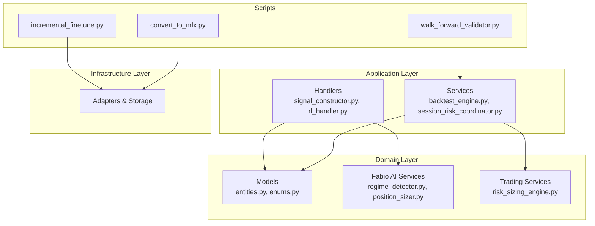
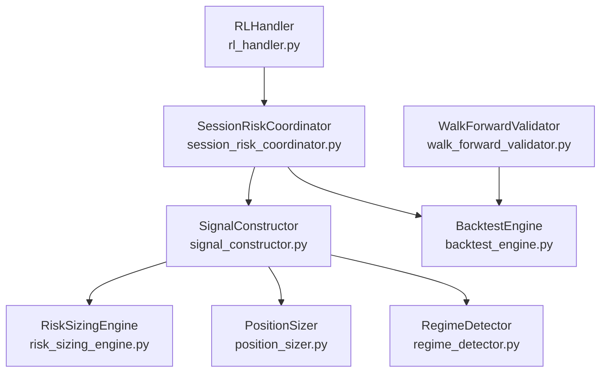
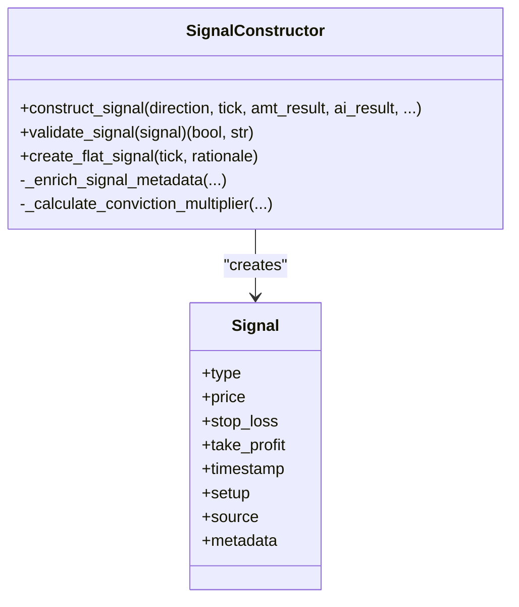
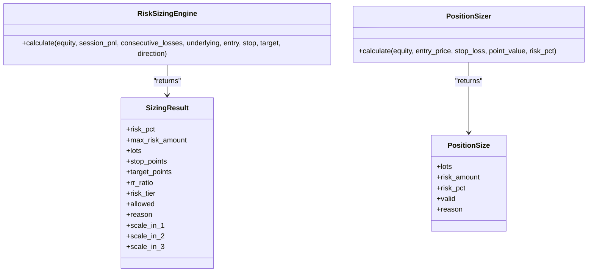
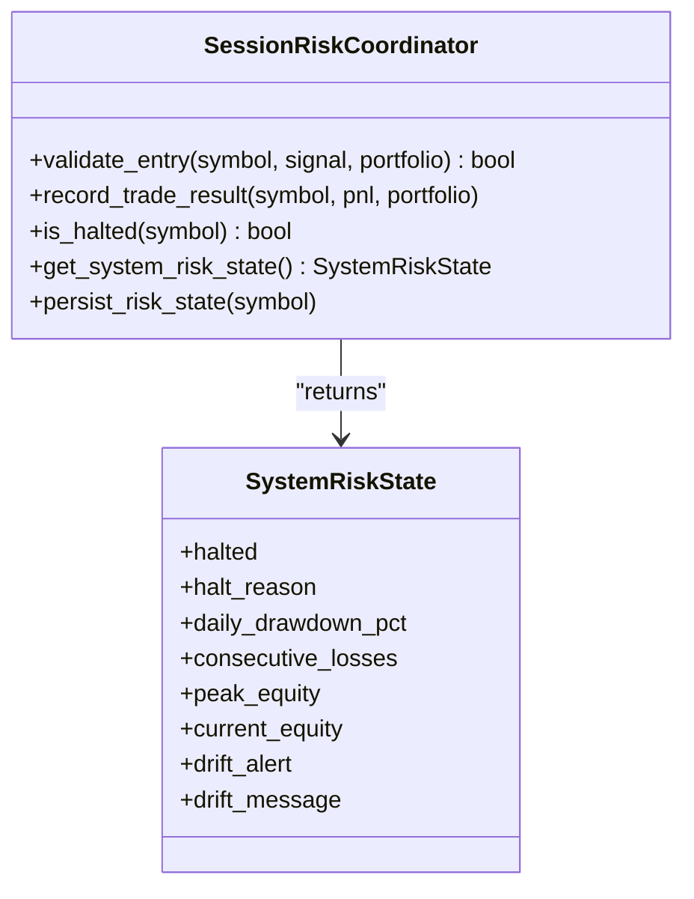
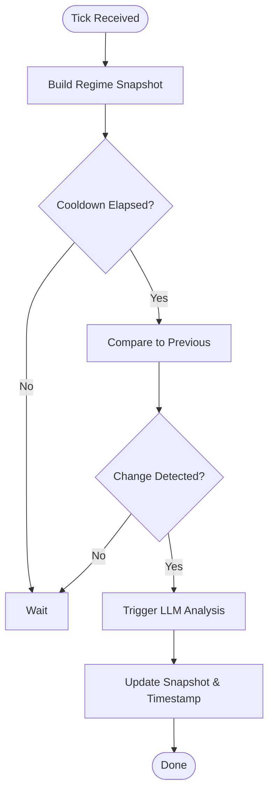
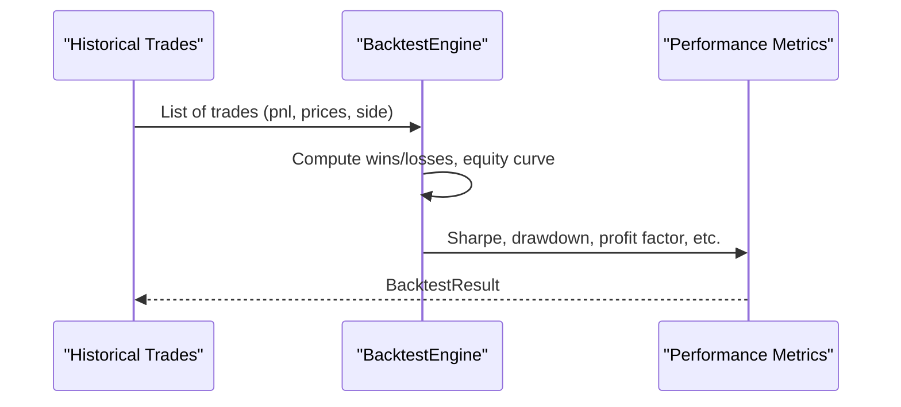
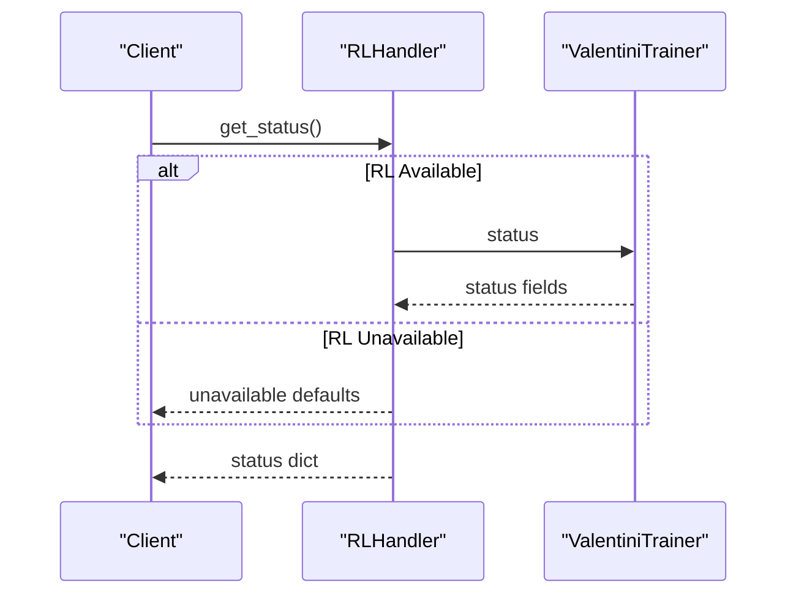
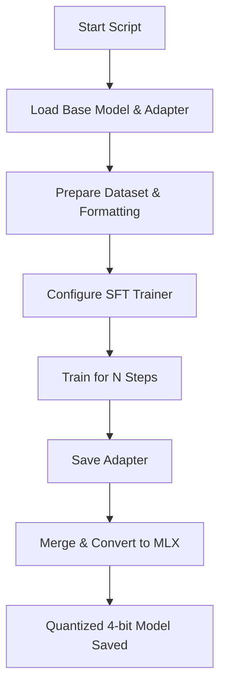
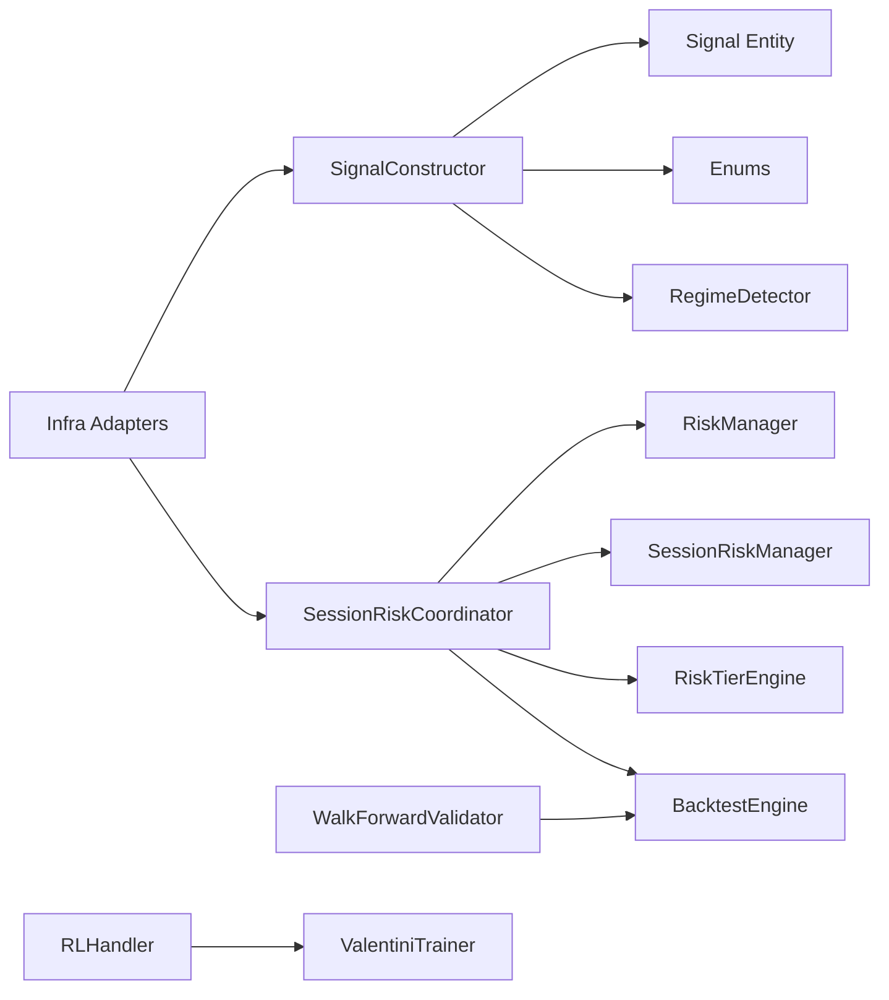

# Advanced Topics

<cite>
**Referenced Files in This Document**
- [incremental_finetune.py](file://backend/scripts/incremental_finetune.py)
- [convert_to_mlx.py](file://backend/scripts/convert_to_mlx.py)
- [walk_forward_validator.py](file://backend/app/domain/services/walk_forward_validator.py)
- [backtest_engine.py](file://backend/app/application/services/backtest_engine.py)
- [rl_handler.py](file://backend/app/application/handlers/rl_handler.py)
- [signal_constructor.py](file://backend/app/application/handlers/signal_constructor.py)
- [regime_detector.py](file://backend/app/domain/fabio_ai/services/regime_detector.py)
- [risk_sizing_engine.py](file://backend/app/domain/services/risk_sizing_engine.py)
- [position_sizer.py](file://backend/app/domain/fabio_ai/services/position_sizer.py)
- [entities.py](file://backend/app/domain/trading/models/entities.py)
- [enums.py](file://backend/app/domain/trading/models/enums.py)
- [session_risk_coordinator.py](file://backend/app/application/services/session_risk_coordinator.py)
</cite>

## Table of Contents
1. [Introduction](#introduction)
2. [Project Structure](#project-structure)
3. [Core Components](#core-components)
4. [Architecture Overview](#architecture-overview)
5. [Detailed Component Analysis](#detailed-component-analysis)
6. [Dependency Analysis](#dependency-analysis)
7. [Performance Considerations](#performance-considerations)
8. [Troubleshooting Guide](#troubleshooting-guide)
9. [Conclusion](#conclusion)
10. [Appendices](#appendices)

## Introduction
This document provides advanced guidance for GlassyTrade AI v5, focusing on custom strategy development, machine learning model training and fine-tuning, reinforcement learning implementation, and performance optimization. It documents the incremental fine-tuning process, MLX model conversion workflows, and walk-forward validation methodologies. Practical examples show how to develop custom entry/exit strategies, train custom AI models, and optimize system performance. Advanced trading concepts such as position sizing algorithms, risk management strategies, and market regime detection are explained, along with security considerations, system hardening, and scalability optimization. Guidance is included for extending the system with custom components, integrating new data sources, and developing proprietary trading algorithms.

## Project Structure
GlassyTrade AI v5 is organized into layered domains:
- Application layer orchestrates handlers and services for trading lifecycle control.
- Domain layer encapsulates trading models, services, and AI-related logic.
- Infrastructure layer adapts external systems (brokers, adapters, storage).
- Scripts provide ML workflows for incremental fine-tuning and model conversion.
- Tests validate behavior across integration, unit, and validation suites.

**Diagram sources**
- [signal_constructor.py:1-275](file://backend/app/application/handlers/signal_constructor.py#L1-L275)
- [rl_handler.py:1-55](file://backend/app/application/handlers/rl_handler.py#L1-L55)
- [backtest_engine.py:1-99](file://backend/app/application/services/backtest_engine.py#L1-L99)
- [session_risk_coordinator.py:1-345](file://backend/app/application/services/session_risk_coordinator.py#L1-L345)
- [entities.py:1-168](file://backend/app/domain/trading/models/entities.py#L1-L168)
- [enums.py:1-200](file://backend/app/domain/trading/models/enums.py#L1-L200)
- [regime_detector.py:1-507](file://backend/app/domain/fabio_ai/services/regime_detector.py#L1-L507)
- [position_sizer.py:1-106](file://backend/app/domain/fabio_ai/services/position_sizer.py#L1-L106)
- [risk_sizing_engine.py:1-204](file://backend/app/domain/services/risk_sizing_engine.py#L1-L204)
- [incremental_finetune.py:1-111](file://backend/scripts/incremental_finetune.py#L1-L111)
- [convert_to_mlx.py:1-63](file://backend/scripts/convert_to_mlx.py#L1-L63)
- [walk_forward_validator.py:1-65](file://backend/app/domain/services/walk_forward_validator.py#L1-L65)

**Section sources**
- [signal_constructor.py:1-275](file://backend/app/application/handlers/signal_constructor.py#L1-L275)
- [backtest_engine.py:1-99](file://backend/app/application/services/backtest_engine.py#L1-L99)
- [session_risk_coordinator.py:1-345](file://backend/app/application/services/session_risk_coordinator.py#L1-L345)
- [regime_detector.py:1-507](file://backend/app/domain/fabio_ai/services/regime_detector.py#L1-L507)
- [position_sizer.py:1-106](file://backend/app/domain/fabio_ai/services/position_sizer.py#L1-L106)
- [risk_sizing_engine.py:1-204](file://backend/app/domain/services/risk_sizing_engine.py#L1-L204)
- [incremental_finetune.py:1-111](file://backend/scripts/incremental_finetune.py#L1-L111)
- [convert_to_mlx.py:1-63](file://backend/scripts/convert_to_mlx.py#L1-L63)
- [walk_forward_validator.py:1-65](file://backend/app/domain/services/walk_forward_validator.py#L1-L65)

## Core Components
- Signal Construction and Validation: Translates AI decisions into validated trade signals with metadata enrichment and R:R checks.
- Position Sizing: Deterministic Kelly-based sizing and fixed fractional sizing per Fabio AMT spec.
- Risk Management: Session-level risk coordinator integrates per-symbol risk managers, circuit breakers, and drawdown monitoring.
- Market Regime Detection: Triggers LLM analysis on meaningful regime changes and enforces rules for contraction and failed auction re-entry.
- Backtesting and Walk-Forward Validation: Computes performance metrics and outlines planned walk-forward validation framework.
- Reinforcement Learning: Optional RL handler for training status and metrics.
- ML Workflows: Incremental fine-tuning and MLX conversion scripts for model deployment.

**Section sources**
- [signal_constructor.py:32-275](file://backend/app/application/handlers/signal_constructor.py#L32-L275)
- [position_sizer.py:32-106](file://backend/app/domain/fabio_ai/services/position_sizer.py#L32-L106)
- [risk_sizing_engine.py:44-204](file://backend/app/domain/services/risk_sizing_engine.py#L44-L204)
- [session_risk_coordinator.py:43-345](file://backend/app/application/services/session_risk_coordinator.py#L43-L345)
- [regime_detector.py:74-507](file://backend/app/domain/fabio_ai/services/regime_detector.py#L74-L507)
- [backtest_engine.py:33-99](file://backend/app/application/services/backtest_engine.py#L33-L99)
- [walk_forward_validator.py:40-65](file://backend/app/domain/services/walk_forward_validator.py#L40-L65)
- [rl_handler.py:17-55](file://backend/app/application/handlers/rl_handler.py#L17-L55)
- [incremental_finetune.py:14-111](file://backend/scripts/incremental_finetune.py#L14-L111)
- [convert_to_mlx.py:16-63](file://backend/scripts/convert_to_mlx.py#L16-L63)

## Architecture Overview
The system composes AI-driven signals with robust risk controls and deterministic sizing. Handlers orchestrate signal construction and optional RL training. Domain services encapsulate market regime detection and sizing logic. Application services manage backtesting, walk-forward validation, and session risk coordination.

**Diagram sources**
- [signal_constructor.py:32-275](file://backend/app/application/handlers/signal_constructor.py#L32-L275)
- [risk_sizing_engine.py:44-204](file://backend/app/domain/services/risk_sizing_engine.py#L44-L204)
- [position_sizer.py:32-106](file://backend/app/domain/fabio_ai/services/position_sizer.py#L32-L106)
- [session_risk_coordinator.py:43-345](file://backend/app/application/services/session_risk_coordinator.py#L43-L345)
- [regime_detector.py:74-507](file://backend/app/domain/fabio_ai/services/regime_detector.py#L74-L507)
- [backtest_engine.py:33-99](file://backend/app/application/services/backtest_engine.py#L33-L99)
- [walk_forward_validator.py:40-65](file://backend/app/domain/services/walk_forward_validator.py#L40-L65)
- [rl_handler.py:17-55](file://backend/app/application/handlers/rl_handler.py#L17-L55)

## Detailed Component Analysis

### Signal Construction and Validation
SignalConstructor builds signals from LLM decisions, enriches metadata (trade thesis, grade score, conviction multiplier), and validates signals for required fields and R:R ratios. It delegates to entry gate builders and grading utilities.

**Diagram sources**
- [signal_constructor.py:32-275](file://backend/app/application/handlers/signal_constructor.py#L32-L275)
- [entities.py:28-76](file://backend/app/domain/trading/models/entities.py#L28-L76)

**Section sources**
- [signal_constructor.py:32-275](file://backend/app/application/handlers/signal_constructor.py#L32-L275)
- [entities.py:28-76](file://backend/app/domain/trading/models/entities.py#L28-L76)

### Position Sizing Algorithms
Two sizing approaches are available:
- Deterministic Kelly-based sizing via RiskSizingEngine with risk tiers, dynamic cushion, and scale-in plans.
- Fixed fractional sizing per Fabio AMT spec via PositionSizer with hard ceilings.

**Diagram sources**
- [risk_sizing_engine.py:44-204](file://backend/app/domain/services/risk_sizing_engine.py#L44-L204)
- [position_sizer.py:32-106](file://backend/app/domain/fabio_ai/services/position_sizer.py#L32-L106)

**Section sources**
- [risk_sizing_engine.py:44-204](file://backend/app/domain/services/risk_sizing_engine.py#L44-L204)
- [position_sizer.py:32-106](file://backend/app/domain/fabio_ai/services/position_sizer.py#L32-L106)

### Risk Management and Session Controls
SessionRiskCoordinator aggregates risk across symbols, enforces grade-score floors, applies session circuit breakers, and coordinates with trade and risk managers. It also supports optional RiskTierEngine integration and persistence.

**Diagram sources**
- [session_risk_coordinator.py:43-345](file://backend/app/application/services/session_risk_coordinator.py#L43-L345)

**Section sources**
- [session_risk_coordinator.py:43-345](file://backend/app/application/services/session_risk_coordinator.py#L43-L345)

### Market Regime Detection and Rule Enforcement
RegimeDetector triggers LLM analysis on regime changes (state transitions, VA boundary crossings, POC migration, delta spikes) and implements:
- Contraction detection (Fabio Rule 8) after expansion.
- Failed auction re-entry blocking (Fabio Rule 11) with circuit breaker.
- Second drive tracking and squeeze detection.

**Diagram sources**
- [regime_detector.py:113-177](file://backend/app/domain/fabio_ai/services/regime_detector.py#L113-L177)

**Section sources**
- [regime_detector.py:74-507](file://backend/app/domain/fabio_ai/services/regime_detector.py#L74-L507)

### Backtesting and Walk-Forward Validation
BacktestEngine computes performance metrics from historical trades. WalkForwardValidator defines types and stubs for rolling train/test windows and validation results.

**Diagram sources**
- [backtest_engine.py:33-99](file://backend/app/application/services/backtest_engine.py#L33-L99)

**Section sources**
- [backtest_engine.py:33-99](file://backend/app/application/services/backtest_engine.py#L33-L99)
- [walk_forward_validator.py:40-65](file://backend/app/domain/services/walk_forward_validator.py#L40-L65)

### Reinforcement Learning Implementation
RLHandler provides optional RL training coordination and exposes status metrics. It gracefully degrades if RL dependencies are unavailable.

**Diagram sources**
- [rl_handler.py:17-55](file://backend/app/application/handlers/rl_handler.py#L17-L55)

**Section sources**
- [rl_handler.py:17-55](file://backend/app/application/handlers/rl_handler.py#L17-L55)

### Machine Learning Workflows: Incremental Fine-Tuning and MLX Conversion
- Incremental fine-tuning: Loads base model and adapter, formats dataset, trains with SFTTrainer, and saves adapter.
- MLX conversion: Merges LoRA into base model, saves merged HF checkpoint, converts to MLX 4-bit.

**Diagram sources**
- [incremental_finetune.py:14-111](file://backend/scripts/incremental_finetune.py#L14-L111)
- [convert_to_mlx.py:16-63](file://backend/scripts/convert_to_mlx.py#L16-L63)

**Section sources**
- [incremental_finetune.py:14-111](file://backend/scripts/incremental_finetune.py#L14-L111)
- [convert_to_mlx.py:16-63](file://backend/scripts/convert_to_mlx.py#L16-L63)

## Dependency Analysis
Key dependencies and relationships:
- SignalConstructor depends on domain models and AI services for signal enrichment.
- SessionRiskCoordinator composes per-symbol risk managers and integrates with trade manager and optional RiskTierEngine.
- RegimeDetector encapsulates market-state logic and enforces rules for regime-sensitive trading.
- BacktestEngine and WalkForwardValidator support performance evaluation and future walk-forward validation.
- RLHandler conditionally depends on RL trainer implementation.
- ML scripts depend on external libraries for training and conversion.

**Diagram sources**
- [signal_constructor.py:32-275](file://backend/app/application/handlers/signal_constructor.py#L32-L275)
- [entities.py:28-76](file://backend/app/domain/trading/models/entities.py#L28-L76)
- [enums.py:120-200](file://backend/app/domain/trading/models/enums.py#L120-L200)
- [regime_detector.py:74-507](file://backend/app/domain/fabio_ai/services/regime_detector.py#L74-L507)
- [session_risk_coordinator.py:43-345](file://backend/app/application/services/session_risk_coordinator.py#L43-L345)
- [backtest_engine.py:33-99](file://backend/app/application/services/backtest_engine.py#L33-L99)
- [walk_forward_validator.py:40-65](file://backend/app/domain/services/walk_forward_validator.py#L40-L65)
- [rl_handler.py:17-55](file://backend/app/application/handlers/rl_handler.py#L17-L55)

**Section sources**
- [signal_constructor.py:32-275](file://backend/app/application/handlers/signal_constructor.py#L32-L275)
- [session_risk_coordinator.py:43-345](file://backend/app/application/services/session_risk_coordinator.py#L43-L345)
- [regime_detector.py:74-507](file://backend/app/domain/fabio_ai/services/regime_detector.py#L74-L507)
- [backtest_engine.py:33-99](file://backend/app/application/services/backtest_engine.py#L33-L99)
- [walk_forward_validator.py:40-65](file://backend/app/domain/services/walk_forward_validator.py#L40-L65)
- [rl_handler.py:17-55](file://backend/app/application/handlers/rl_handler.py#L17-L55)

## Performance Considerations
- Deterministic sizing engines execute in sub-millisecond timeframes, minimizing latency impact.
- RegimeDetector uses bounded deques and snapshots to reduce memory overhead.
- BacktestEngine uses vectorized computations and avoids redundant allocations.
- ML workflows leverage GPU acceleration where available and provide quantized model outputs for inference speed.
- Walk-forward validation is designed to minimize data leakage and improve out-of-sample reliability.

[No sources needed since this section provides general guidance]

## Troubleshooting Guide
Common issues and resolutions:
- Signal validation failures: Verify required fields and R:R ratio thresholds; inspect metadata enrichment logic.
- Position sizing failures: Confirm risk per unit, point value, and instrument lot sizes; check absolute ceiling constraints.
- Session circuit breaker activation: Review consecutive loss counters and session PnL thresholds; ensure proper reset on successful exits.
- RegimeDetector false triggers: Adjust POC migration and delta spike thresholds; ensure cooldown enforcement.
- RL handler unavailability: Confirm RL dependencies installation; fallback status reporting is provided.
- MLX conversion errors: Ensure mlx-lm is installed; verify merged model path and output directory permissions.

**Section sources**
- [signal_constructor.py:216-252](file://backend/app/application/handlers/signal_constructor.py#L216-L252)
- [risk_sizing_engine.py:129-180](file://backend/app/domain/services/risk_sizing_engine.py#L129-L180)
- [position_sizer.py:55-90](file://backend/app/domain/fabio_ai/services/position_sizer.py#L55-L90)
- [session_risk_coordinator.py:194-211](file://backend/app/application/services/session_risk_coordinator.py#L194-L211)
- [regime_detector.py:125-176](file://backend/app/domain/fabio_ai/services/regime_detector.py#L125-L176)
- [rl_handler.py:9-14](file://backend/app/application/handlers/rl_handler.py#L9-L14)
- [convert_to_mlx.py:42-44](file://backend/scripts/convert_to_mlx.py#L42-L44)

## Conclusion
GlassyTrade AI v5 integrates AI-driven signals with robust risk controls and deterministic sizing to achieve reliable, high-performance trading. The modular architecture enables extension through custom strategies, ML workflows, and regime-aware logic. By leveraging backtesting, walk-forward validation, and rule-enforced controls, teams can develop and deploy proprietary algorithms safely and scalably.

[No sources needed since this section summarizes without analyzing specific files]

## Appendices

### Practical Examples Index
- Custom Entry/Exit Strategies: Use SignalConstructor to translate AI decisions into validated signals; enforce grade scores and R:R checks.
- Custom AI Models: Train adapters incrementally using the provided script; convert to MLX for efficient inference.
- Performance Optimization: Apply deterministic sizing engines and bounded buffers in regime detection; use quantized models for inference.

[No sources needed since this section provides general guidance]