# Custom Strategy Development

<cite>
**Referenced Files in This Document**
- [multi_timeframe_amt.py](file://backend/app/domain/fabio_ai/services/multi_timeframe_amt.py)
- [amt_handler.py](file://backend/app/application/handlers/amt_handler.py)
- [entry_gate_coordinator.py](file://backend/app/application/handlers/entry_gate_coordinator.py)
- [signal_constructor.py](file://backend/app/application/handlers/signal_constructor.py)
- [signal_tracking_service.py](file://backend/app/application/services/signal_tracking_service.py)
- [backtest_engine.py](file://backend/app/application/services/backtest_engine.py)
- [risk_sizing_engine.py](file://backend/app/domain/services/risk_sizing_engine.py)
- [protocols.py](file://backend/app/domain/fabio_ai/strategy/protocols.py)
- [probability_inference.py](file://backend/app/domain/ports/probability_inference.py)
- [lgbm_probability_adapter.py](file://backend/app/infrastructure/adapters/lgbm_probability_adapter.py)
- [events.py](file://backend/app/domain/trading/events.py)
- [signal_validator.py](file://backend/app/domain/trading/services/signal_validator.py)
- [experiment_context.py](file://backend/app/application/services/experiment_context.py)
</cite>

## Table of Contents
1. [Introduction](#introduction)
2. [Project Structure](#project-structure)
3. [Core Components](#core-components)
4. [Architecture Overview](#architecture-overview)
5. [Detailed Component Analysis](#detailed-component-analysis)
6. [Dependency Analysis](#dependency-analysis)
7. [Performance Considerations](#performance-considerations)
8. [Troubleshooting Guide](#troubleshooting-guide)
9. [Conclusion](#conclusion)
10. [Appendices](#appendices)

## Introduction
This document explains how to develop custom trading strategies in GlassyTrade AI v5 using the gate pipeline architecture. It covers creating custom entry/exit strategies, implementing custom entry gates, composing strategies across multiple timeframes, integrating machine learning-enhanced rules, validating signals, and evaluating performance via backtesting and risk management. Practical examples include AMT-based strategies, multi-timeframe alignment strategies, and ML-enhanced trading rules. Guidance is also provided for parameter tuning, dynamic strategy switching, and integrating external market indicators and adaptive position sizing.

## Project Structure
GlassyTrade AI v5 organizes strategy development around:
- Domain services for market analysis (AMT, footprint, probability inference)
- Application handlers for gate coordination, signal construction, and lifecycle orchestration
- Infrastructure adapters for ML models and persistence
- Services for risk sizing, signal tracking, and backtesting

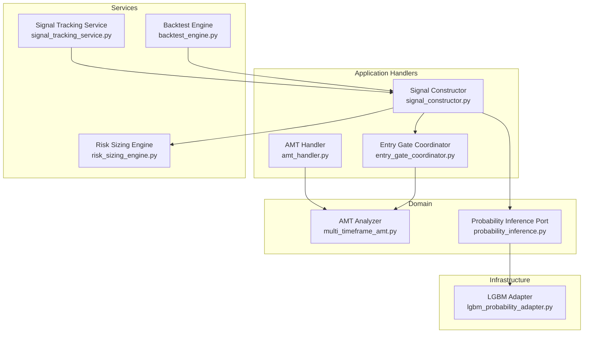

**Diagram sources**
- [multi_timeframe_amt.py:1-507](file://backend/app/domain/fabio_ai/services/multi_timeframe_amt.py#L1-L507)
- [amt_handler.py:1-181](file://backend/app/application/handlers/amt_handler.py#L1-L181)
- [entry_gate_coordinator.py:1-235](file://backend/app/application/handlers/entry_gate_coordinator.py#L1-L235)
- [signal_constructor.py:1-275](file://backend/app/application/handlers/signal_constructor.py#L1-L275)
- [risk_sizing_engine.py:1-88](file://backend/app/domain/services/risk_sizing_engine.py#L1-L88)
- [signal_tracking_service.py:1-385](file://backend/app/application/services/signal_tracking_service.py#L1-L385)
- [backtest_engine.py:1-99](file://backend/app/application/services/backtest_engine.py#L1-L99)
- [probability_inference.py:1-43](file://backend/app/domain/ports/probability_inference.py#L1-L43)
- [lgbm_probability_adapter.py:1-166](file://backend/app/infrastructure/adapters/lgbm_probability_adapter.py#L1-L166)

**Section sources**
- [multi_timeframe_amt.py:1-507](file://backend/app/domain/fabio_ai/services/multi_timeframe_amt.py#L1-L507)
- [amt_handler.py:1-181](file://backend/app/application/handlers/amt_handler.py#L1-L181)
- [entry_gate_coordinator.py:1-235](file://backend/app/application/handlers/entry_gate_coordinator.py#L1-L235)
- [signal_constructor.py:1-275](file://backend/app/application/handlers/signal_constructor.py#L1-L275)
- [risk_sizing_engine.py:1-88](file://backend/app/domain/services/risk_sizing_engine.py#L1-L88)
- [signal_tracking_service.py:1-385](file://backend/app/application/services/signal_tracking_service.py#L1-L385)
- [backtest_engine.py:1-99](file://backend/app/application/services/backtest_engine.py#L1-L99)
- [probability_inference.py:1-43](file://backend/app/domain/ports/probability_inference.py#L1-L43)
- [lgbm_probability_adapter.py:1-166](file://backend/app/infrastructure/adapters/lgbm_probability_adapter.py#L1-L166)

## Core Components
- AMT-based analysis and footprint generation: Provides market context (POC, VA, CVD slope, profile shape) used by gates and signals.
- Multi-timeframe alignment: Combines higher, session, and entry timeframe biases to determine alignment quality and position size multipliers.
- Entry gate coordinator: Orchestrates gate checks (three-align, momentum fade, gate pipeline, CVD hard gate, profile shape gate).
- Signal constructor: Builds validated trade signals enriched with metadata, thesis, and grade scores.
- Risk sizing engine: Deterministic Kelly-inspired sizing with dynamic risk tiers and scale-in plans.
- Signal tracking service: Records decision points, gate block reasons, and generates statistics for performance analysis.
- Backtest engine: Computes performance metrics from historical trade logs.
- Probability inference port and adapter: Provides first-passage probability estimates and dynamic targets for ML-enhanced rules.

**Section sources**
- [multi_timeframe_amt.py:74-164](file://backend/app/domain/fabio_ai/services/multi_timeframe_amt.py#L74-L164)
- [entry_gate_coordinator.py:25-125](file://backend/app/application/handlers/entry_gate_coordinator.py#L25-L125)
- [signal_constructor.py:32-186](file://backend/app/application/handlers/signal_constructor.py#L32-L186)
- [risk_sizing_engine.py:44-88](file://backend/app/domain/services/risk_sizing_engine.py#L44-L88)
- [signal_tracking_service.py:72-330](file://backend/app/application/services/signal_tracking_service.py#L72-L330)
- [backtest_engine.py:33-99](file://backend/app/application/services/backtest_engine.py#L33-L99)
- [probability_inference.py:9-43](file://backend/app/domain/ports/probability_inference.py#L9-L43)
- [lgbm_probability_adapter.py:24-155](file://backend/app/infrastructure/adapters/lgbm_probability_adapter.py#L24-L155)

## Architecture Overview
The strategy pipeline integrates AMT analysis, gate checks, and signal construction, with optional ML enhancements and risk management.

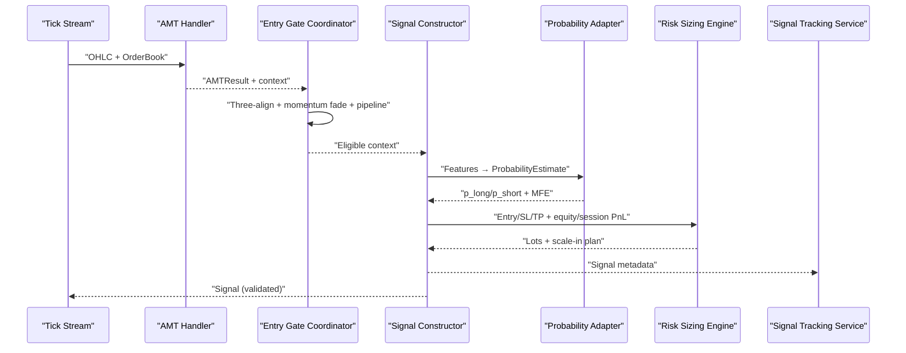

**Diagram sources**
- [amt_handler.py:89-180](file://backend/app/application/handlers/amt_handler.py#L89-L180)
- [entry_gate_coordinator.py:32-125](file://backend/app/application/handlers/entry_gate_coordinator.py#L32-L125)
- [signal_constructor.py:39-107](file://backend/app/application/handlers/signal_constructor.py#L39-L107)
- [probability_inference.py:19-28](file://backend/app/domain/ports/probability_inference.py#L19-L28)
- [lgbm_probability_adapter.py:119-155](file://backend/app/infrastructure/adapters/lgbm_probability_adapter.py#L119-L155)
- [risk_sizing_engine.py:77-88](file://backend/app/domain/services/risk_sizing_engine.py#L77-L88)
- [signal_tracking_service.py:83-138](file://backend/app/application/services/signal_tracking_service.py#L83-L138)

## Detailed Component Analysis

### AMT-Based Strategy Foundation
- AMT handler maintains incremental volume profiles and builds AMTResult DTOs for downstream use.
- Multi-timeframe AMT analyzer derives directional bias from three timeframes and computes alignment strength and trade implications.

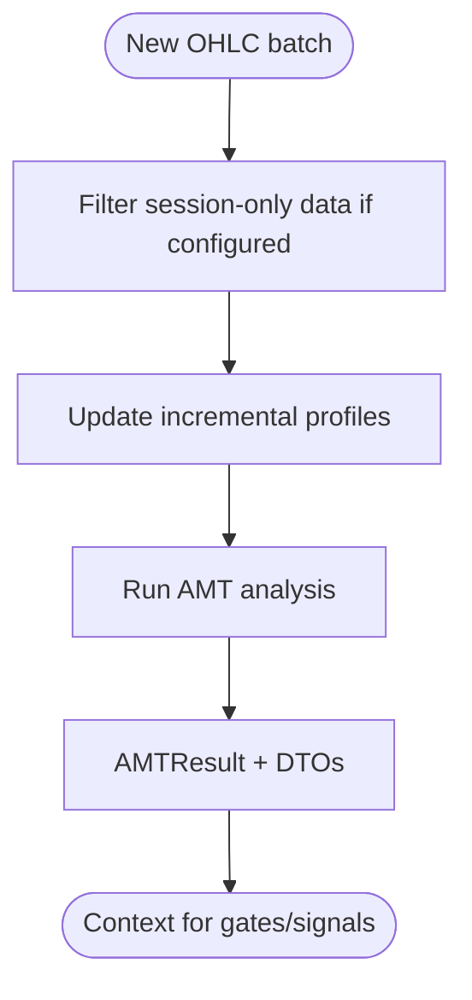

**Diagram sources**
- [amt_handler.py:89-180](file://backend/app/application/handlers/amt_handler.py#L89-L180)
- [multi_timeframe_amt.py:210-261](file://backend/app/domain/fabio_ai/services/multi_timeframe_amt.py#L210-L261)

**Section sources**
- [amt_handler.py:45-180](file://backend/app/application/handlers/amt_handler.py#L45-L180)
- [multi_timeframe_amt.py:74-164](file://backend/app/domain/fabio_ai/services/multi_timeframe_amt.py#L74-L164)

### Gate Pipeline and Custom Entry Gates
- Entry gate coordinator orchestrates:
  - Three-align gate (multi-timeframe alignment)
  - Momentum fade detection
  - Gate pipeline checks (context-dependent)
  - CVD hard gate and profile shape gate
- Custom gates can be integrated by extending the pipeline in the coordinator and adding supporting logic in the gate module.

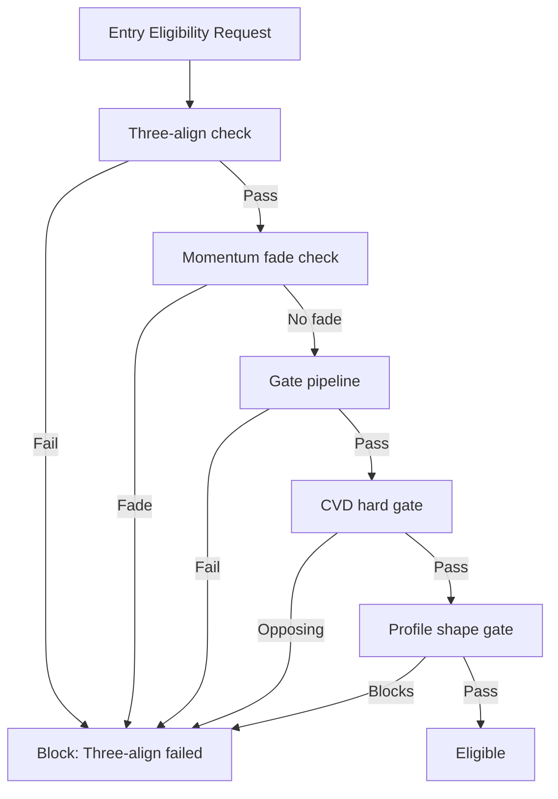

**Diagram sources**
- [entry_gate_coordinator.py:32-125](file://backend/app/application/handlers/entry_gate_coordinator.py#L32-L125)

**Section sources**
- [entry_gate_coordinator.py:25-125](file://backend/app/application/handlers/entry_gate_coordinator.py#L25-L125)

### Signal Construction and Validation
- Signal constructor builds signals from agent decisions, enriches with metadata (thesis, grade score, conviction), and validates basic constraints (prices, R:R).
- Signal validation enforces freshness, direction consistency, and structural constraints.

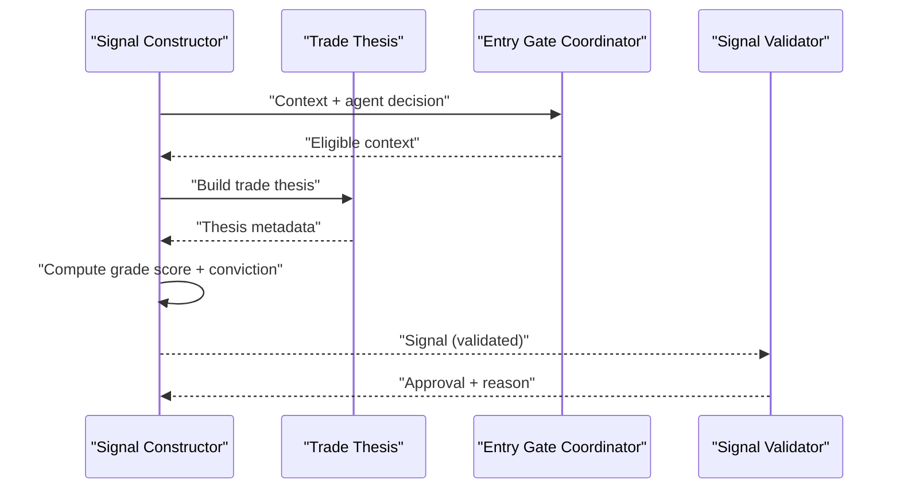

**Diagram sources**
- [signal_constructor.py:39-186](file://backend/app/application/handlers/signal_constructor.py#L39-L186)
- [signal_validator.py:52-92](file://backend/app/domain/trading/services/signal_validator.py#L52-L92)

**Section sources**
- [signal_constructor.py:32-275](file://backend/app/application/handlers/signal_constructor.py#L32-L275)
- [signal_validator.py:52-92](file://backend/app/domain/trading/services/signal_validator.py#L52-L92)
- [events.py:125-173](file://backend/app/domain/trading/events.py#L125-L173)

### Risk Management and Adaptive Position Sizing
- Risk sizing engine computes position size using deterministic Kelly-like logic, adjusting for session PnL, consecutive losses, and minimum/maximum risk tiers.
- Supports scale-in allocation across multiple entries.

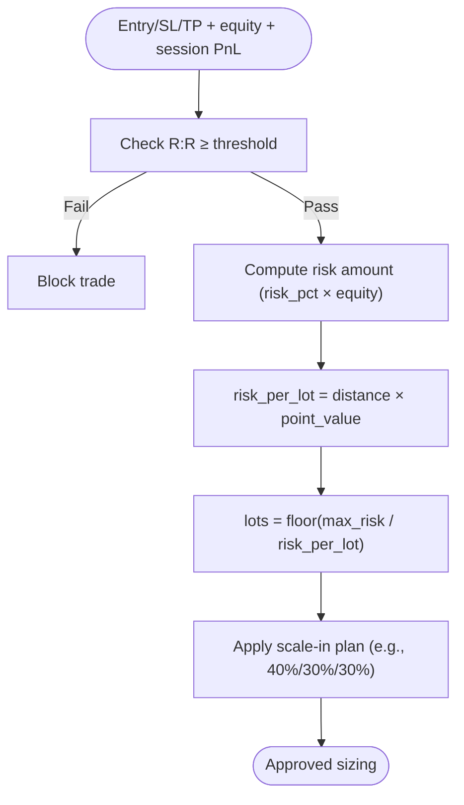

**Diagram sources**
- [risk_sizing_engine.py:77-88](file://backend/app/domain/services/risk_sizing_engine.py#L77-L88)

**Section sources**
- [risk_sizing_engine.py:44-88](file://backend/app/domain/services/risk_sizing_engine.py#L44-L88)

### Machine Learning-Enhanced Trading Rules
- Probability inference port abstracts first-passage probability models; adapter loads LightGBM models and returns calibrated probabilities and expected MFE.
- Strategy can incorporate dynamic TP/SL multipliers based on predicted MFE and confidence thresholds.

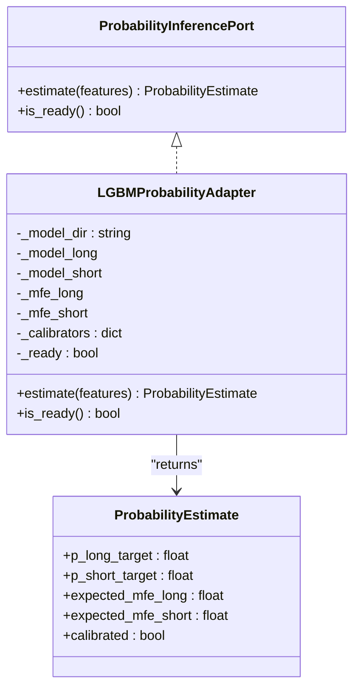

**Diagram sources**
- [probability_inference.py:9-43](file://backend/app/domain/ports/probability_inference.py#L9-L43)
- [lgbm_probability_adapter.py:24-155](file://backend/app/infrastructure/adapters/lgbm_probability_adapter.py#L24-L155)

**Section sources**
- [probability_inference.py:1-43](file://backend/app/domain/ports/probability_inference.py#L1-L43)
- [lgbm_probability_adapter.py:1-166](file://backend/app/infrastructure/adapters/lgbm_probability_adapter.py#L1-L166)

### Strategy Protocols and Composition Patterns
- Strategy protocols define interfaces for setup detection, market context, entry signals, risk calculation, and execution planning.
- Strategy composition can be achieved by combining AMT-based gates, ML-driven probability estimates, and risk-managed sizing into modular components.

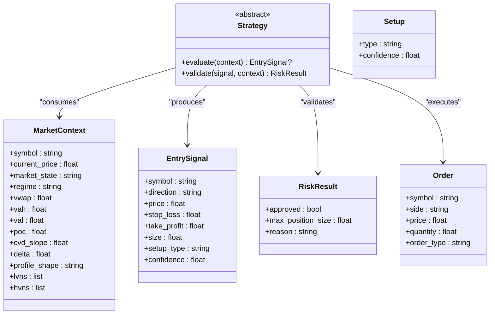

**Diagram sources**
- [protocols.py:15-91](file://backend/app/domain/fabio_ai/strategy/protocols.py#L15-L91)

**Section sources**
- [protocols.py:1-91](file://backend/app/domain/fabio_ai/strategy/protocols.py#L1-L91)

### Multi-Timeframe Analysis Strategy
- Multi-timeframe AMT analyzer computes alignment among higher, session, and entry timeframes, returning an alignment state and position size multiplier.
- Strategy logic can gate entries based on alignment quality and scale position accordingly.

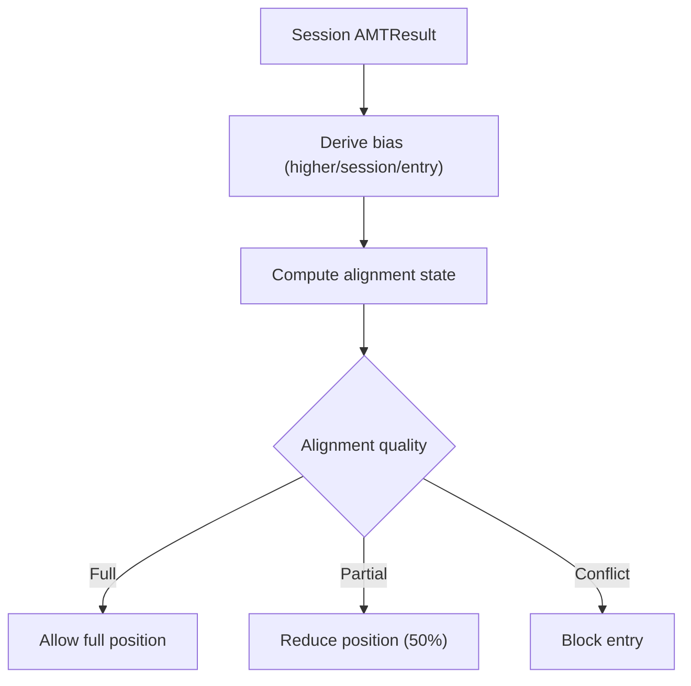

**Diagram sources**
- [multi_timeframe_amt.py:114-164](file://backend/app/domain/fabio_ai/services/multi_timeframe_amt.py#L114-L164)

**Section sources**
- [multi_timeframe_amt.py:74-164](file://backend/app/domain/fabio_ai/services/multi_timeframe_amt.py#L74-L164)

### Backtesting and Performance Evaluation
- Backtest engine computes key metrics from historical trade logs: total trades, win rate, average R:R, total PnL, max drawdown, Sharpe ratio, profit factor, and average win/loss.
- Use experiment context to attribute runs and compare configurations.

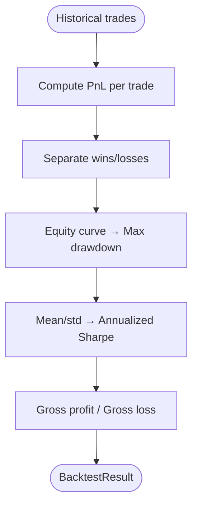

**Diagram sources**
- [backtest_engine.py:39-99](file://backend/app/application/services/backtest_engine.py#L39-L99)
- [experiment_context.py:37-70](file://backend/app/application/services/experiment_context.py#L37-L70)

**Section sources**
- [backtest_engine.py:1-99](file://backend/app/application/services/backtest_engine.py#L1-L99)
- [experiment_context.py:1-70](file://backend/app/application/services/experiment_context.py#L1-L70)

### Signal Tracking and Strategy Composition Insights
- Signal tracking service records every decision point, enabling analysis of gate block rates, generation rates, and timing patterns.
- Use aggregated stats to tune strategy composition and parameter thresholds.

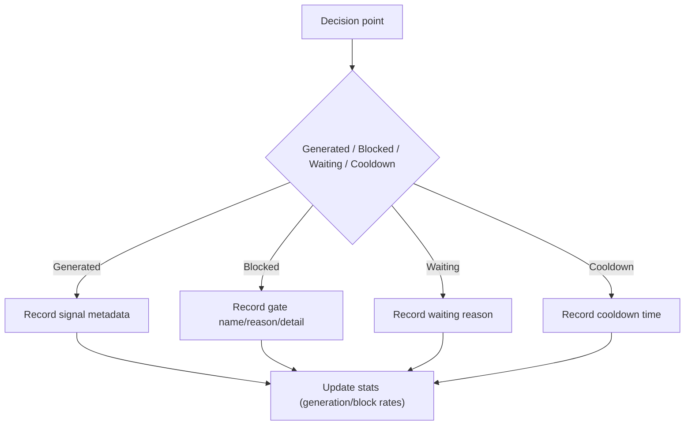

**Diagram sources**
- [signal_tracking_service.py:72-330](file://backend/app/application/services/signal_tracking_service.py#L72-L330)

**Section sources**
- [signal_tracking_service.py:72-385](file://backend/app/application/services/signal_tracking_service.py#L72-L385)

## Dependency Analysis
Key dependencies and coupling:
- AMT handler depends on AMT analyzer and footprint analyzer; caches profile arrays to minimize recomputation.
- Entry gate coordinator composes multiple gate checks and tick-size awareness.
- Signal constructor depends on gate-built context, probability inference, and risk sizing.
- Backtest engine consumes trade logs; experiment context attributes runs.

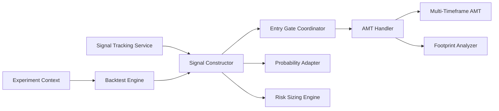

**Diagram sources**
- [amt_handler.py:45-180](file://backend/app/application/handlers/amt_handler.py#L45-L180)
- [multi_timeframe_amt.py:74-164](file://backend/app/domain/fabio_ai/services/multi_timeframe_amt.py#L74-L164)
- [entry_gate_coordinator.py:25-125](file://backend/app/application/handlers/entry_gate_coordinator.py#L25-L125)
- [signal_constructor.py:32-186](file://backend/app/application/handlers/signal_constructor.py#L32-L186)
- [risk_sizing_engine.py:44-88](file://backend/app/domain/services/risk_sizing_engine.py#L44-L88)
- [signal_tracking_service.py:72-138](file://backend/app/application/services/signal_tracking_service.py#L72-L138)
- [backtest_engine.py:33-99](file://backend/app/application/services/backtest_engine.py#L33-L99)
- [experiment_context.py:37-70](file://backend/app/application/services/experiment_context.py#L37-L70)

**Section sources**
- [amt_handler.py:45-180](file://backend/app/application/handlers/amt_handler.py#L45-L180)
- [entry_gate_coordinator.py:25-125](file://backend/app/application/handlers/entry_gate_coordinator.py#L25-L125)
- [signal_constructor.py:32-186](file://backend/app/application/handlers/signal_constructor.py#L32-L186)
- [risk_sizing_engine.py:44-88](file://backend/app/domain/services/risk_sizing_engine.py#L44-L88)
- [signal_tracking_service.py:72-138](file://backend/app/application/services/signal_tracking_service.py#L72-L138)
- [backtest_engine.py:33-99](file://backend/app/application/services/backtest_engine.py#L33-L99)
- [experiment_context.py:37-70](file://backend/app/application/services/experiment_context.py#L37-L70)

## Performance Considerations
- Minimize redundant profile computations by caching DTOs in the AMT handler and updating incrementally.
- Use deterministic risk sizing to avoid model latency; integrate ML predictions asynchronously.
- Keep gate checks lightweight and early-exit when possible to reduce computation overhead.
- Batch process signals and leverage signal tracking to identify bottlenecks in the pipeline.

## Troubleshooting Guide
Common issues and resolutions:
- Gate pipeline failures: Inspect gate block reasons recorded by the signal tracking service; adjust thresholds or remove blocking gates for specific regimes.
- Signal validation failures: Verify price, stop loss, take profit, and R:R constraints; ensure freshness and direction consistency.
- Low signal generation rate: Review gate block summaries and reduce overly restrictive gates; improve confirmation bundles.
- Backtest discrepancies: Confirm trade logs include required fields (pnl, entry/exit prices, side); align session boundaries and initial capital.

**Section sources**
- [signal_tracking_service.py:140-185](file://backend/app/application/services/signal_tracking_service.py#L140-L185)
- [signal_validator.py:216-252](file://backend/app/domain/trading/services/signal_validator.py#L216-L252)
- [backtest_engine.py:39-99](file://backend/app/application/services/backtest_engine.py#L39-L99)

## Conclusion
GlassyTrade AI v5 provides a robust, modular framework for custom strategy development. By leveraging AMT-based market context, a configurable gate pipeline, ML-enhanced probability inference, and deterministic risk management, developers can implement sophisticated entry/exit strategies. The included backtesting and signal tracking services enable rigorous evaluation and continuous refinement of strategy performance.

## Appendices
- Practical examples:
  - AMT-based strategy: Use AMT handler outputs and multi-timeframe alignment to gate entries and size positions.
  - Multi-timeframe strategy: Combine higher, session, and entry timeframe biases to enforce alignment quality.
  - ML-enhanced rules: Integrate probability adapter outputs to dynamically adjust TP/SL and position sizing.
- Strategy composition tips:
  - Layer gates progressively (three-align → momentum fade → pipeline → hard gates).
  - Use signal tracking to identify which gates are most influential and adjust thresholds.
  - Parameter tuning: Sweep risk tiers, R:R minimums, and gate thresholds; evaluate using backtest engine.
  - Dynamic switching: Maintain multiple gate configurations keyed by regime or session phase; switch based on AMT market state and profile shape.