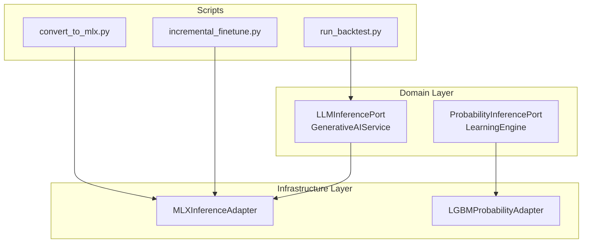
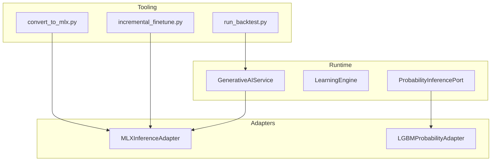
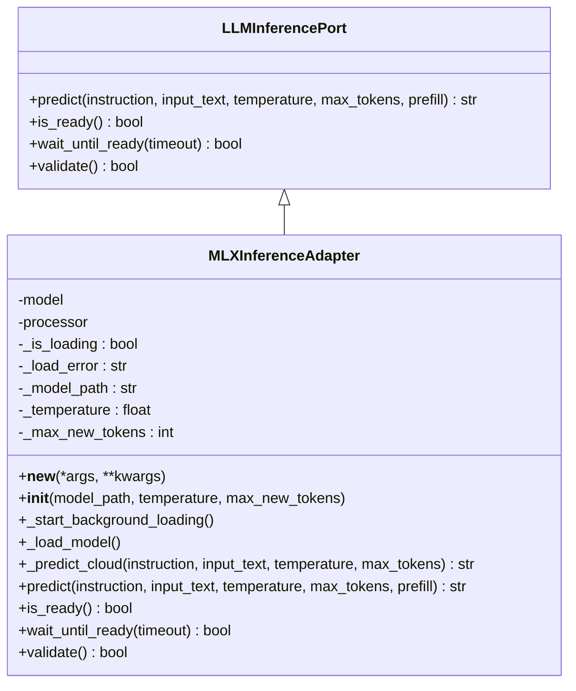
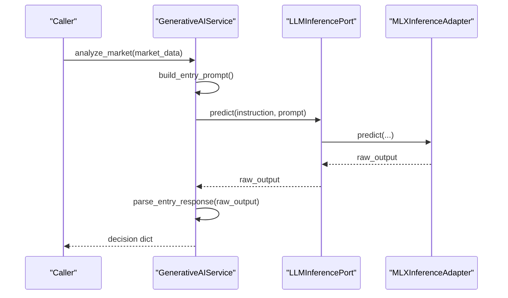
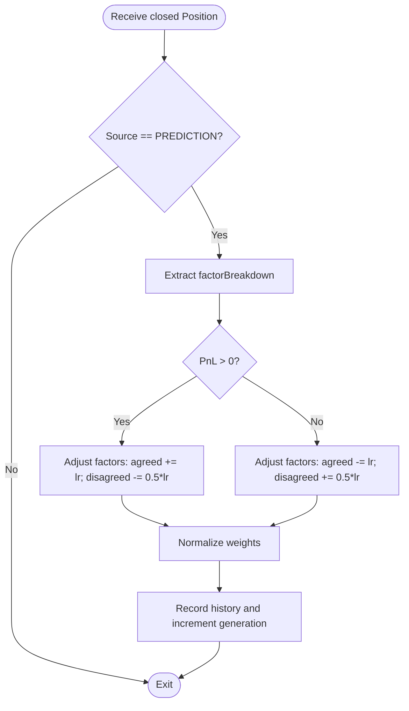
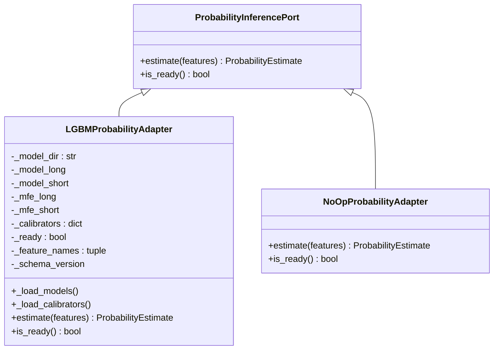
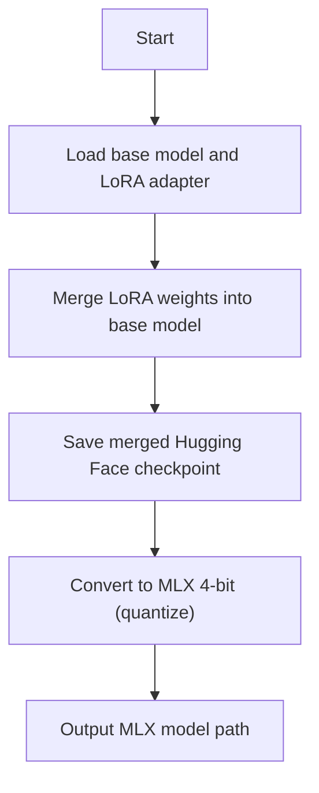
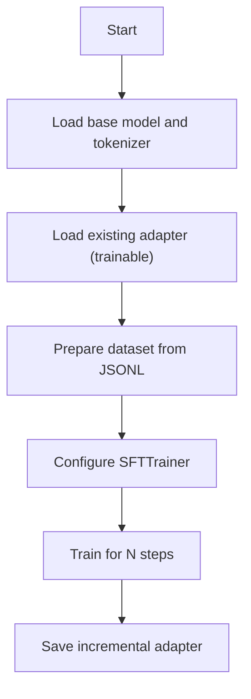
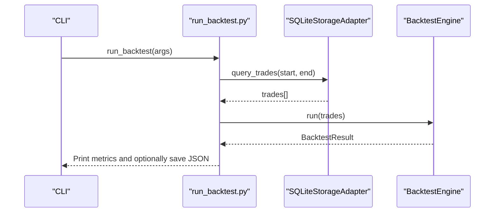
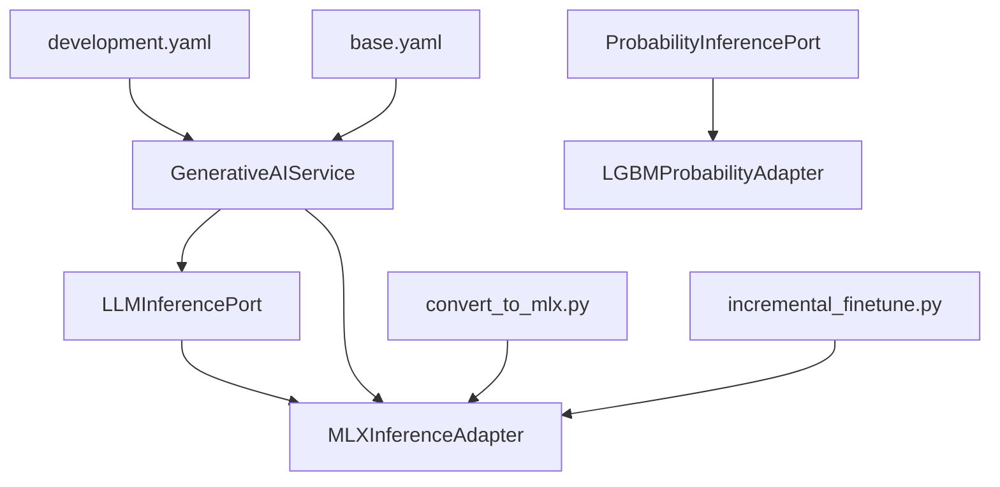

# Machine Learning Models

<cite>
**Referenced Files in This Document**
- [mlx_inference_adapter.py](file://backend/app/infrastructure/adapters/mlx_inference_adapter.py)
- [mlx_gpu_lock.py](file://backend/app/infrastructure/mlx_gpu_lock.py)
- [llm_inference.py](file://backend/app/domain/ports/llm_inference.py)
- [generative_ai_service.py](file://backend/app/domain/fabio_ai/services/generative_ai_service.py)
- [learning_engine.py](file://backend/app/domain/fabio_ai/services/learning_engine.py)
- [probability_inference.py](file://backend/app/domain/ports/probability_inference.py)
- [lgbm_probability_adapter.py](file://backend/app/infrastructure/adapters/lgbm_probability_adapter.py)
- [convert_to_mlx.py](file://backend/scripts/convert_to_mlx.py)
- [incremental_finetune.py](file://backend/scripts/incremental_finetune.py)
- [run_backtest.py](file://backend/scripts/run_backtest.py)
- [development.yaml](file://backend/config/environments/development.yaml)
- [base.yaml](file://backend/config/base.yaml)
</cite>

## Table of Contents
1. [Introduction](#introduction)
2. [Project Structure](#project-structure)
3. [Core Components](#core-components)
4. [Architecture Overview](#architecture-overview)
5. [Detailed Component Analysis](#detailed-component-analysis)
6. [Dependency Analysis](#dependency-analysis)
7. [Performance Considerations](#performance-considerations)
8. [Troubleshooting Guide](#troubleshooting-guide)
9. [Conclusion](#conclusion)
10. [Appendices](#appendices)

## Introduction
This document explains machine learning model management in GlassyTrade AI v5 with a focus on:
- MLX inference adapter for Apple Silicon acceleration
- Conversion workflows from PyTorch/TensorFlow to MLX format
- Generative AI service integration for entry decisions
- Learning engine architecture and probability inference mechanisms
- Practical examples for converting models, configuring adapters, and implementing custom ML pipelines
- Model versioning, deployment strategies, and performance optimization for Apple Silicon
- Training workflows, dataset preparation, and validation methodologies
- Integration with external ML platforms and real-time inference optimization

## Project Structure
GlassyTrade AI v5 organizes ML-related code across three primary layers:
- Domain: Ports and services that define contracts and orchestrate inference and learning
- Infrastructure: Adapters that implement concrete inference and probability engines
- Scripts: Tooling for model conversion, incremental fine-tuning, and backtesting

**Diagram sources**
- [mlx_inference_adapter.py:12-396](file://backend/app/infrastructure/adapters/mlx_inference_adapter.py#L12-L396)
- [llm_inference.py:10-42](file://backend/app/domain/ports/llm_inference.py#L10-L42)
- [generative_ai_service.py:26-99](file://backend/app/domain/fabio_ai/services/generative_ai_service.py#L26-L99)
- [lgbm_probability_adapter.py:24-88](file://backend/app/infrastructure/adapters/lgbm_probability_adapter.py#L24-L88)
- [convert_to_mlx.py:16-63](file://backend/scripts/convert_to_mlx.py#L16-L63)
- [incremental_finetune.py:14-111](file://backend/scripts/incremental_finetune.py#L14-L111)
- [run_backtest.py:18-69](file://backend/scripts/run_backtest.py#L18-L69)

**Section sources**
- [mlx_inference_adapter.py:12-396](file://backend/app/infrastructure/adapters/mlx_inference_adapter.py#L12-L396)
- [generative_ai_service.py:26-99](file://backend/app/domain/fabio_ai/services/generative_ai_service.py#L26-L99)
- [lgbm_probability_adapter.py:24-88](file://backend/app/infrastructure/adapters/lgbm_probability_adapter.py#L24-L88)
- [convert_to_mlx.py:16-63](file://backend/scripts/convert_to_mlx.py#L16-L63)
- [incremental_finetune.py:14-111](file://backend/scripts/incremental_finetune.py#L14-L111)
- [run_backtest.py:18-69](file://backend/scripts/run_backtest.py#L18-L69)

## Core Components
- MLX Inference Adapter: Implements LLM inference on Apple Silicon with background loading, GPU serialization, and cloud fallback.
- Generative AI Service: Orchestrates entry decisions by composing prompts and parsing canonical JSON outputs.
- Learning Engine: Adaptive weight tuning based on closed prediction trades.
- Probability Inference Port and LGBM Adapter: First-passage probability estimation and optional calibration.
- Conversion and Fine-Tuning Scripts: Convert LoRA adapters to MLX 4-bit and perform incremental fine-tuning.
- Backtesting Script: Evaluate historical trade performance.

**Section sources**
- [mlx_inference_adapter.py:12-396](file://backend/app/infrastructure/adapters/mlx_inference_adapter.py#L12-L396)
- [generative_ai_service.py:26-99](file://backend/app/domain/fabio_ai/services/generative_ai_service.py#L26-L99)
- [learning_engine.py:15-101](file://backend/app/domain/fabio_ai/services/learning_engine.py#L15-L101)
- [probability_inference.py:9-43](file://backend/app/domain/ports/probability_inference.py#L9-L43)
- [lgbm_probability_adapter.py:24-88](file://backend/app/infrastructure/adapters/lgbm_probability_adapter.py#L24-L88)
- [convert_to_mlx.py:16-63](file://backend/scripts/convert_to_mlx.py#L16-L63)
- [incremental_finetune.py:14-111](file://backend/scripts/incremental_finetune.py#L14-L111)
- [run_backtest.py:18-69](file://backend/scripts/run_backtest.py#L18-L69)

## Architecture Overview
The ML stack follows a clean architecture with domain ports and infrastructure adapters. Generative AI decisions rely on the MLX adapter, while probabilistic inference is handled by the LGBM adapter. Training and conversion scripts integrate with the broader system.

**Diagram sources**
- [generative_ai_service.py:26-99](file://backend/app/domain/fabio_ai/services/generative_ai_service.py#L26-L99)
- [learning_engine.py:15-101](file://backend/app/domain/fabio_ai/services/learning_engine.py#L15-L101)
- [probability_inference.py:19-43](file://backend/app/domain/ports/probability_inference.py#L19-L43)
- [mlx_inference_adapter.py:12-396](file://backend/app/infrastructure/adapters/mlx_inference_adapter.py#L12-L396)
- [lgbm_probability_adapter.py:24-88](file://backend/app/infrastructure/adapters/lgbm_probability_adapter.py#L24-L88)
- [convert_to_mlx.py:16-63](file://backend/scripts/convert_to_mlx.py#L16-L63)
- [incremental_finetune.py:14-111](file://backend/scripts/incremental_finetune.py#L14-L111)
- [run_backtest.py:18-69](file://backend/scripts/run_backtest.py#L18-L69)

## Detailed Component Analysis

### MLX Inference Adapter
The MLX adapter provides:
- Singleton initialization with background model loading
- GPU serialization lock to prevent Metal concurrency crashes
- JSON-constrained generation with prefill injection
- Cloud fallback via OpenRouter when no local model is configured
- Validation and readiness checks

**Diagram sources**
- [llm_inference.py:10-42](file://backend/app/domain/ports/llm_inference.py#L10-L42)
- [mlx_inference_adapter.py:12-396](file://backend/app/infrastructure/adapters/mlx_inference_adapter.py#L12-L396)

**Section sources**
- [mlx_inference_adapter.py:12-396](file://backend/app/infrastructure/adapters/mlx_inference_adapter.py#L12-L396)
- [mlx_gpu_lock.py:1-19](file://backend/app/infrastructure/mlx_gpu_lock.py#L1-L19)
- [llm_inference.py:6-42](file://backend/app/domain/ports/llm_inference.py#L6-L42)

### Generative AI Service
The Generative AI Service:
- Builds entry prompts from market data
- Caches recent results keyed by MD5 of the prompt
- Calls the LLM adapter and parses canonical JSON outputs
- Returns structured results with direction, rationale, confidence, and metadata

**Diagram sources**
- [generative_ai_service.py:53-99](file://backend/app/domain/fabio_ai/services/generative_ai_service.py#L53-L99)
- [llm_inference.py:13-23](file://backend/app/domain/ports/llm_inference.py#L13-L23)
- [mlx_inference_adapter.py:184-266](file://backend/app/infrastructure/adapters/mlx_inference_adapter.py#L184-L266)

**Section sources**
- [generative_ai_service.py:26-99](file://backend/app/domain/fabio_ai/services/generative_ai_service.py#L26-L99)

### Learning Engine
The Learning Engine:
- Maintains factor weights for trend, momentum, delta, order book, and volatility
- Updates weights based on closed prediction trades using a simplified reinforcement-style adjustment
- Normalizes weights to maintain a stable distribution

**Diagram sources**
- [learning_engine.py:42-101](file://backend/app/domain/fabio_ai/services/learning_engine.py#L42-L101)

**Section sources**
- [learning_engine.py:15-101](file://backend/app/domain/fabio_ai/services/learning_engine.py#L15-L101)

### Probability Inference and LGBM Adapter
The probability inference port defines a contract for first-passage probability estimation. The LGBM adapter loads LightGBM models and optional calibrators and MFE quantile models.

**Diagram sources**
- [probability_inference.py:19-43](file://backend/app/domain/ports/probability_inference.py#L19-L43)
- [lgbm_probability_adapter.py:24-88](file://backend/app/infrastructure/adapters/lgbm_probability_adapter.py#L24-L88)

**Section sources**
- [probability_inference.py:9-43](file://backend/app/domain/ports/probability_inference.py#L9-L43)
- [lgbm_probability_adapter.py:24-88](file://backend/app/infrastructure/adapters/lgbm_probability_adapter.py#L24-L88)

### Model Conversion Workflows (PyTorch/TensorFlow to MLX)
The conversion script merges a LoRA adapter into a base model and converts to MLX 4-bit format. It also demonstrates saving a merged Hugging Face checkpoint prior to conversion.

**Diagram sources**
- [convert_to_mlx.py:16-63](file://backend/scripts/convert_to_mlx.py#L16-L63)

**Section sources**
- [convert_to_mlx.py:16-63](file://backend/scripts/convert_to_mlx.py#L16-L63)

### Incremental Fine-Tuning (Legacy Path)
The incremental fine-tuning script supports legacy training stacks by loading a base model and an existing adapter, then performing SFT on new data.

**Diagram sources**
- [incremental_finetune.py:14-111](file://backend/scripts/incremental_finetune.py#L14-L111)

**Section sources**
- [incremental_finetune.py:14-111](file://backend/scripts/incremental_finetune.py#L14-L111)

### Backtesting Workflow
The backtesting script loads historical trades from SQLite, runs a backtest engine, and prints a summary report with metrics such as win rate, profit factor, and Sharpe ratio.

**Diagram sources**
- [run_backtest.py:18-69](file://backend/scripts/run_backtest.py#L18-L69)

**Section sources**
- [run_backtest.py:18-69](file://backend/scripts/run_backtest.py#L18-L69)

## Dependency Analysis
Key dependencies and relationships:
- GenerativeAIService depends on LLMInferencePort; MLXInferenceAdapter implements the port.
- ProbabilityInferencePort is implemented by LGBMProbabilityAdapter.
- MLX adapter uses a global GPU lock to serialize Metal operations.
- Conversion and fine-tuning scripts depend on external libraries (transformers, peft, trl, mlx-lm).
- Configuration files define LLM model IDs, temperatures, and timeouts.

**Diagram sources**
- [generative_ai_service.py:40-51](file://backend/app/domain/fabio_ai/services/generative_ai_service.py#L40-L51)
- [llm_inference.py:10-27](file://backend/app/domain/ports/llm_inference.py#L10-L27)
- [mlx_inference_adapter.py:12-396](file://backend/app/infrastructure/adapters/mlx_inference_adapter.py#L12-L396)
- [lgbm_probability_adapter.py:24-88](file://backend/app/infrastructure/adapters/lgbm_probability_adapter.py#L24-L88)
- [convert_to_mlx.py:16-63](file://backend/scripts/convert_to_mlx.py#L16-L63)
- [incremental_finetune.py:14-111](file://backend/scripts/incremental_finetune.py#L14-L111)
- [development.yaml:1-33](file://backend/config/environments/development.yaml#L1-L33)
- [base.yaml:480-493](file://backend/config/base.yaml#L480-L493)

**Section sources**
- [generative_ai_service.py:40-51](file://backend/app/domain/fabio_ai/services/generative_ai_service.py#L40-L51)
- [mlx_inference_adapter.py:12-396](file://backend/app/infrastructure/adapters/mlx_inference_adapter.py#L12-L396)
- [lgbm_probability_adapter.py:24-88](file://backend/app/infrastructure/adapters/lgbm_probability_adapter.py#L24-L88)
- [convert_to_mlx.py:16-63](file://backend/scripts/convert_to_mlx.py#L16-L63)
- [incremental_finetune.py:14-111](file://backend/scripts/incremental_finetune.py#L14-L111)
- [development.yaml:1-33](file://backend/config/environments/development.yaml#L1-L33)
- [base.yaml:480-493](file://backend/config/base.yaml#L480-L493)

## Performance Considerations
- Apple Silicon acceleration: MLX adapter is optimized for Apple Silicon and provides 10–30x speedups compared to PyTorch MPS.
- GPU serialization: All load and generate calls are guarded by a global lock to avoid Metal concurrency crashes.
- Background loading: Model loading occurs on a daemon thread to keep the server responsive.
- Cloud fallback: When no local model is configured, requests fall back to OpenRouter with retry and exponential backoff.
- Token limits and prefill: Constraining generation length and injecting JSON prefill reduces hallucinations and improves throughput.
- Calibration and MFE models: Optional Platt scaling and MFE quantile models improve reliability and dynamic take-profit estimation.

[No sources needed since this section provides general guidance]

## Troubleshooting Guide
Common issues and resolutions:
- Model not ready: Use readiness checks and wait utilities; background loading may still be in progress.
- Empty or malformed responses: The adapter extracts the first balanced JSON object; ensure prompts encourage JSON output.
- Metal concurrency errors: Ensure all load/generate calls pass through the global GPU lock.
- Cloud fallback failures: Verify API key and endpoint configuration; the adapter retries with exponential backoff on rate limits.
- Probability model mismatches: Feature schema mismatches trigger warnings; align runtime features with model expectations.

**Section sources**
- [mlx_inference_adapter.py:351-395](file://backend/app/infrastructure/adapters/mlx_inference_adapter.py#L351-L395)
- [lgbm_probability_adapter.py:58-63](file://backend/app/infrastructure/adapters/lgbm_probability_adapter.py#L58-L63)

## Conclusion
GlassyTrade AI v5 integrates a robust ML stack centered on Apple Silicon acceleration via MLX, with a clean separation of concerns between domain services and infrastructure adapters. The Generative AI Service orchestrates entry decisions using a canonical JSON contract, while the Learning Engine adapts factor weights based on realized outcomes. Probability inference leverages LightGBM with optional calibration and dynamic targets. Conversion and training scripts streamline model lifecycle management, and configuration files centralize runtime parameters for reliable deployments.

[No sources needed since this section summarizes without analyzing specific files]

## Appendices

### Practical Examples

- Convert an existing LoRA adapter to MLX 4-bit:
  - Run the conversion script with appropriate base model, adapter, and output paths.
  - The script merges the adapter into the base model, saves a merged Hugging Face checkpoint, and converts to MLX 4-bit.

  **Section sources**
  - [convert_to_mlx.py:16-63](file://backend/scripts/convert_to_mlx.py#L16-L63)

- Configure the MLX inference adapter:
  - Set the model path via constructor or environment variable.
  - Use the singleton adapter instance to call predict with instruction, input text, and optional overrides.
  - Serialize all inference calls through the global GPU lock.

  **Section sources**
  - [mlx_inference_adapter.py:23-36](file://backend/app/infrastructure/adapters/mlx_inference_adapter.py#L23-L36)
  - [mlx_gpu_lock.py:1-19](file://backend/app/infrastructure/mlx_gpu_lock.py#L1-L19)

- Implement a custom machine learning pipeline:
  - Define a new adapter implementing the LLM inference port.
  - Integrate with the Generative AI Service by passing your adapter instance.
  - Add validation and readiness checks to ensure safe deployment.

  **Section sources**
  - [llm_inference.py:10-42](file://backend/app/domain/ports/llm_inference.py#L10-L42)
  - [generative_ai_service.py:40-51](file://backend/app/domain/fabio_ai/services/generative_ai_service.py#L40-L51)

- Model versioning and deployment:
  - Store MLX models under versioned directories and update configuration references accordingly.
  - Use environment-specific YAML files to switch between models and settings.

  **Section sources**
  - [base.yaml:480-493](file://backend/config/base.yaml#L480-L493)
  - [development.yaml:1-33](file://backend/config/environments/development.yaml#L1-L33)

- Training workflows and validation:
  - Use the incremental fine-tuning script to adapt existing adapters on new data.
  - Validate model readiness and correctness using the adapter’s built-in validation routine.
  - Backtest historical trades to evaluate performance before live deployment.

  **Section sources**
  - [incremental_finetune.py:14-111](file://backend/scripts/incremental_finetune.py#L14-L111)
  - [mlx_inference_adapter.py:376-395](file://backend/app/infrastructure/adapters/mlx_inference_adapter.py#L376-L395)
  - [run_backtest.py:18-69](file://backend/scripts/run_backtest.py#L18-L69)