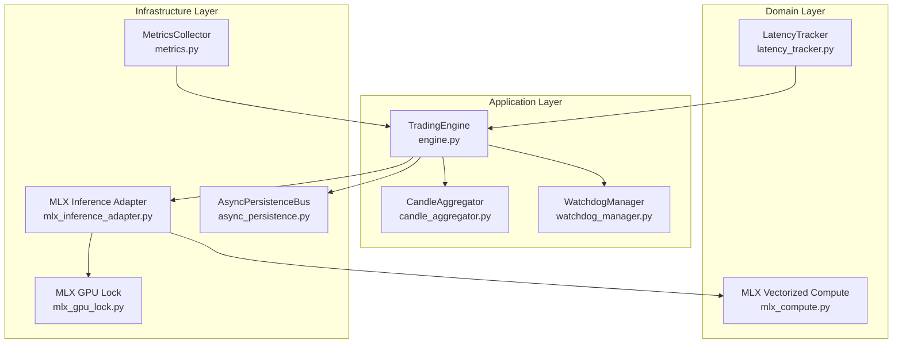
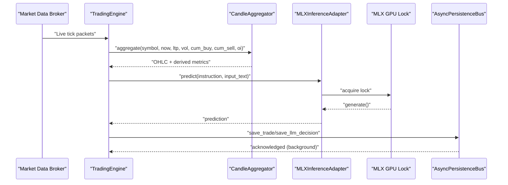
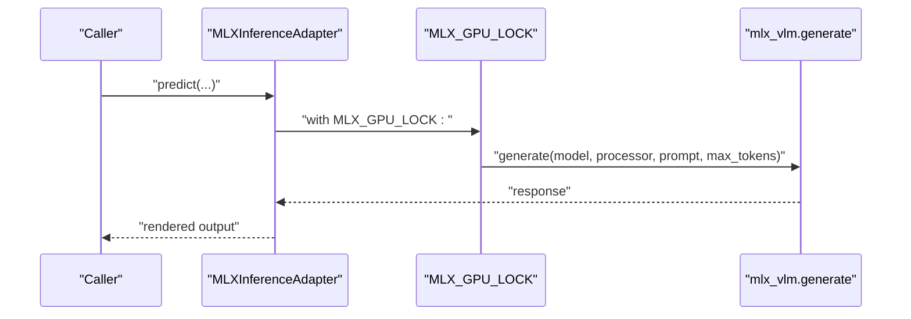
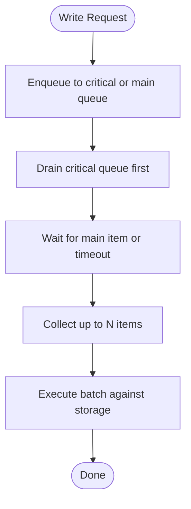
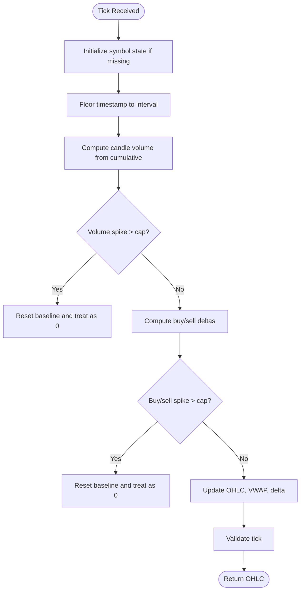
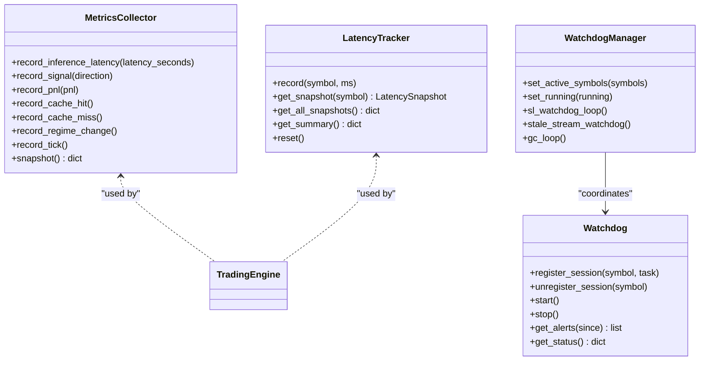
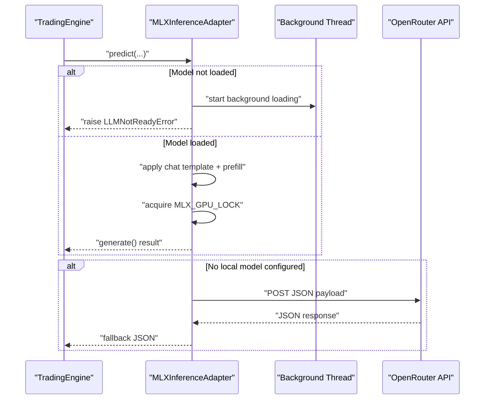
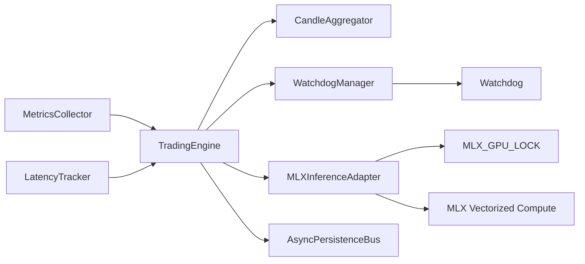

# Performance Optimization

<cite>
**Referenced Files in This Document**
- [mlx_gpu_lock.py](file://backend/app/infrastructure/mlx_gpu_lock.py)
- [mlx_compute.py](file://backend/app/domain/fabio_ai/services/mlx_compute.py)
- [mlx_inference_adapter.py](file://backend/app/infrastructure/adapters/mlx_inference_adapter.py)
- [metrics.py](file://backend/app/infrastructure/metrics.py)
- [latency_tracker.py](file://backend/app/domain/services/latency_tracker.py)
- [watchdog.py](file://backend/app/domain/services/watchdog.py)
- [watchdog_manager.py](file://backend/app/application/watchdog_manager.py)
- [candle_aggregator.py](file://backend/app/application/candle_aggregator.py)
- [engine.py](file://backend/app/application/engine.py)
- [async_persistence.py](file://backend/app/infrastructure/async_persistence.py)
- [utils.py](file://backend/app/application/utils.py)
- [PIPELINE_ARCHITECTURE.md](file://backups/docs/PIPELINE_ARCHITECTURE.md)
- [BACKEND_ARCHITECTURE_ANALYSIS.md](file://backups/docs/BACKEND_ARCHITECTURE_ANALYSIS.md)
- [SPECIFICATION_REVIEW_PLAN.md](file://backups/docs/SPECIFICATION_REVIEW_PLAN.md)
- [Improvement_phasev1.md](file://backups/docs/Improvement_phasev1.md)
- [Improvement_phasev2.md](file://backups/docs/Improvement_phasev2.md)
- [ARCHITECTURE_DEEP_DIVE.md](file://backend/ARCHITECTURE_DEEP_DIVE.md)
- [test_trading_engine.py](file://backend/tests/unit/application/test_trading_engine.py)
</cite>

## Table of Contents
1. [Introduction](#introduction)
2. [Project Structure](#project-structure)
3. [Core Components](#core-components)
4. [Architecture Overview](#architecture-overview)
5. [Detailed Component Analysis](#detailed-component-analysis)
6. [Dependency Analysis](#dependency-analysis)
7. [Performance Considerations](#performance-considerations)
8. [Troubleshooting Guide](#troubleshooting-guide)
9. [Conclusion](#conclusion)
10. [Appendices](#appendices)

## Introduction
This document presents a comprehensive guide to performance optimization in GlassyTrade AI v5. It focuses on system-wide performance monitoring, bottleneck identification, and targeted optimization strategies across MLX GPU utilization, memory management, concurrency, and data processing. Practical examples demonstrate how to optimize candle aggregation, reduce latency in market data processing, and improve AI inference throughput. It also explains the watchdog system for performance monitoring, metrics collection and analysis, resource allocation strategies, CPU/GPU load balancing, memory pooling techniques, efficient data structures, profiling methodologies, performance benchmarking, and capacity planning for high-frequency trading scenarios.

## Project Structure
GlassyTrade AI v5 organizes performance-critical logic across several layers:
- Infrastructure: GPU synchronization, MLX inference adapter, metrics, async persistence, and watchdog manager
- Application: Trading engine, candle aggregation, and watchdog coordination
- Domain: MLX vectorized compute primitives and latency tracking
- Tests and documentation: Benchmarks, pipeline architecture, and specification alignment

**Diagram sources**
- [engine.py:59-126](file://backend/app/application/engine.py#L59-L126)
- [candle_aggregator.py:73-126](file://backend/app/application/candle_aggregator.py#L73-L126)
- [watchdog_manager.py:34-62](file://backend/app/application/watchdog_manager.py#L34-L62)
- [mlx_compute.py:1-289](file://backend/app/domain/fabio_ai/services/mlx_compute.py#L1-L289)
- [latency_tracker.py:43-95](file://backend/app/domain/services/latency_tracker.py#L43-L95)
- [mlx_gpu_lock.py:1-18](file://backend/app/infrastructure/mlx_gpu_lock.py#L1-L18)
- [mlx_inference_adapter.py:12-396](file://backend/app/infrastructure/adapters/mlx_inference_adapter.py#L12-L396)
- [metrics.py:14-98](file://backend/app/infrastructure/metrics.py#L14-L98)
- [async_persistence.py:24-160](file://backend/app/infrastructure/async_persistence.py#L24-L160)

**Section sources**
- [engine.py:59-126](file://backend/app/application/engine.py#L59-L126)
- [candle_aggregator.py:73-126](file://backend/app/application/candle_aggregator.py#L73-L126)
- [watchdog_manager.py:34-62](file://backend/app/application/watchdog_manager.py#L34-L62)
- [mlx_compute.py:1-289](file://backend/app/domain/fabio_ai/services/mlx_compute.py#L1-L289)
- [latency_tracker.py:43-95](file://backend/app/domain/services/latency_tracker.py#L43-L95)
- [mlx_gpu_lock.py:1-18](file://backend/app/infrastructure/mlx_gpu_lock.py#L1-L18)
- [mlx_inference_adapter.py:12-396](file://backend/app/infrastructure/adapters/mlx_inference_adapter.py#L12-L396)
- [metrics.py:14-98](file://backend/app/infrastructure/metrics.py#L14-L98)
- [async_persistence.py:24-160](file://backend/app/infrastructure/async_persistence.py#L24-L160)

## Core Components
- MLX GPU lock and inference adapter: Serialize Metal GPU submissions and provide background model loading with cloud fallback.
- MLX vectorized compute: Hybrid CPU/GPU compute with a crossover threshold to select optimal path per operation size.
- Candle aggregation: Efficient tick-to-candle conversion with volume and delta computation, footprint accumulation, and validation.
- Metrics and latency tracking: Centralized metrics collection and per-symbol latency snapshots with alert thresholds.
- Watchdog and watchdog manager: Session crash detection, SL/TP enforcement, stale stream detection, and periodic GC.
- Async persistence: Offloads storage writes to a background thread to remove I/O latency from the hot path.
- Trading engine: Orchestrates streaming, aggregation, and state updates with throttling and cross-thread notifications.

**Section sources**
- [mlx_gpu_lock.py:1-18](file://backend/app/infrastructure/mlx_gpu_lock.py#L1-L18)
- [mlx_inference_adapter.py:12-396](file://backend/app/infrastructure/adapters/mlx_inference_adapter.py#L12-L396)
- [mlx_compute.py:1-289](file://backend/app/domain/fabio_ai/services/mlx_compute.py#L1-L289)
- [candle_aggregator.py:73-126](file://backend/app/application/candle_aggregator.py#L73-L126)
- [metrics.py:14-98](file://backend/app/infrastructure/metrics.py#L14-L98)
- [latency_tracker.py:43-95](file://backend/app/domain/services/latency_tracker.py#L43-L95)
- [watchdog.py:40-153](file://backend/app/domain/services/watchdog.py#L40-L153)
- [watchdog_manager.py:34-198](file://backend/app/application/watchdog_manager.py#L34-L198)
- [async_persistence.py:24-160](file://backend/app/infrastructure/async_persistence.py#L24-L160)
- [engine.py:59-126](file://backend/app/application/engine.py#L59-L126)

## Architecture Overview
GlassyTrade AI v5 employs a backpressure-first pipeline design, bounded channels, and fail-safe isolation to surface throughput issues early. The trading engine streams ticks, aggregates candles, and coordinates watchdogs and persistence asynchronously. MLX inference is serialized through a global lock to satisfy Metal’s single-threaded command buffer constraint.

**Diagram sources**
- [engine.py:620-800](file://backend/app/application/engine.py#L620-L800)
- [candle_aggregator.py:114-256](file://backend/app/application/candle_aggregator.py#L114-L256)
- [mlx_inference_adapter.py:184-266](file://backend/app/infrastructure/adapters/mlx_inference_adapter.py#L184-L266)
- [mlx_gpu_lock.py:1-18](file://backend/app/infrastructure/mlx_gpu_lock.py#L1-L18)
- [async_persistence.py:45-76](file://backend/app/infrastructure/async_persistence.py#L45-L76)

**Section sources**
- [PIPELINE_ARCHITECTURE.md:60-101](file://backups/docs/PIPELINE_ARCHITECTURE.md#L60-L101)
- [engine.py:620-800](file://backend/app/application/engine.py#L620-L800)
- [mlx_inference_adapter.py:184-266](file://backend/app/infrastructure/adapters/mlx_inference_adapter.py#L184-L266)
- [mlx_gpu_lock.py:1-18](file://backend/app/infrastructure/mlx_gpu_lock.py#L1-L18)
- [async_persistence.py:24-160](file://backend/app/infrastructure/async_persistence.py#L24-L160)

## Detailed Component Analysis

### MLX GPU Utilization Optimization
- Serialization requirement: Metal GPU command buffers must not be submitted concurrently; a global lock serializes all MLX load/generate calls.
- Inference adapter: Background model loading avoids cold-start latency; generates are wrapped in the lock; includes cloud fallback when no local model is configured.
- Vectorized compute: Pure Python optimized for small arrays; MLX batch variants used for large arrays (>500 elements) to leverage GPU throughput.

**Diagram sources**
- [mlx_inference_adapter.py:245-261](file://backend/app/infrastructure/adapters/mlx_inference_adapter.py#L245-L261)
- [mlx_gpu_lock.py:1-18](file://backend/app/infrastructure/mlx_gpu_lock.py#L1-L18)

**Section sources**
- [mlx_gpu_lock.py:1-18](file://backend/app/infrastructure/mlx_gpu_lock.py#L1-L18)
- [mlx_inference_adapter.py:38-81](file://backend/app/infrastructure/adapters/mlx_inference_adapter.py#L38-L81)
- [mlx_inference_adapter.py:245-266](file://backend/app/infrastructure/adapters/mlx_inference_adapter.py#L245-L266)
- [mlx_compute.py:1-289](file://backend/app/domain/fabio_ai/services/mlx_compute.py#L1-L289)

### Memory Management and Concurrency Patterns
- Async persistence bus: Queues writes in two queues—priority critical and main—draining critical first to avoid starvation. Background thread executes batches to minimize SQLite I/O on the hot path.
- Trading engine throttling: Limits process_tick to once per 500 ms per symbol to prevent overload and preserve responsiveness.
- Cross-thread notifications: Uses event loop reference to schedule immediate state updates safely from background threads.

**Diagram sources**
- [async_persistence.py:236-277](file://backend/app/infrastructure/async_persistence.py#L236-L277)

**Section sources**
- [async_persistence.py:24-160](file://backend/app/infrastructure/async_persistence.py#L24-L160)
- [engine.py:768-778](file://backend/app/application/engine.py#L768-L778)
- [engine.py:281-358](file://backend/app/application/engine.py#L281-L358)

### Candle Aggregation Performance
- Efficient state reuse: Per-symbol dictionaries and accumulators initialized once; footprint and delta classifiers reused per symbol.
- Spike capping: Contextual caps on cumulative deltas prevent artifacts from session resets or outliers.
- Validation: Pre-aggregation tick validation ensures robustness and avoids downstream errors.

**Diagram sources**
- [candle_aggregator.py:114-256](file://backend/app/application/candle_aggregator.py#L114-L256)

**Section sources**
- [candle_aggregator.py:73-126](file://backend/app/application/candle_aggregator.py#L73-L126)
- [candle_aggregator.py:142-256](file://backend/app/application/candle_aggregator.py#L142-L256)
- [test_trading_engine.py:491-590](file://backend/tests/unit/application/test_trading_engine.py#L491-L590)

### Latency Tracking and Metrics Collection
- Metrics collector: Thread-safe rolling windows for inference latency, signal counts, PnL, cache hits/misses, regime changes, and ticks processed.
- Latency tracker: Per-symbol snapshots with p50/p95/p99 and alert thresholds; rolling window prevents memory growth.
- Watchdog: Session crash detection with alerts and restart limits; watchdog manager monitors SL/TP, stale streams, and performs periodic GC.

**Diagram sources**
- [metrics.py:14-98](file://backend/app/infrastructure/metrics.py#L14-L98)
- [latency_tracker.py:43-95](file://backend/app/domain/services/latency_tracker.py#L43-L95)
- [watchdog.py:40-153](file://backend/app/domain/services/watchdog.py#L40-L153)
- [watchdog_manager.py:34-198](file://backend/app/application/watchdog_manager.py#L34-L198)

**Section sources**
- [metrics.py:14-98](file://backend/app/infrastructure/metrics.py#L14-L98)
- [latency_tracker.py:43-95](file://backend/app/domain/services/latency_tracker.py#L43-L95)
- [watchdog.py:40-153](file://backend/app/domain/services/watchdog.py#L40-L153)
- [watchdog_manager.py:63-198](file://backend/app/application/watchdog_manager.py#L63-L198)

### AI Inference Throughput Optimization
- Background loading: Model load occurs on a daemon thread to avoid blocking server startup.
- Cloud fallback: When no local model is configured, requests fall back to OpenRouter with exponential backoff on rate limiting.
- Deterministic sampling: Generates are invoked deterministically when sampling parameters are omitted, reducing variability.

**Diagram sources**
- [mlx_inference_adapter.py:38-81](file://backend/app/infrastructure/adapters/mlx_inference_adapter.py#L38-L81)
- [mlx_inference_adapter.py:184-266](file://backend/app/infrastructure/adapters/mlx_inference_adapter.py#L184-L266)
- [mlx_inference_adapter.py:82-183](file://backend/app/infrastructure/adapters/mlx_inference_adapter.py#L82-L183)

**Section sources**
- [mlx_inference_adapter.py:38-81](file://backend/app/infrastructure/adapters/mlx_inference_adapter.py#L38-L81)
- [mlx_inference_adapter.py:184-266](file://backend/app/infrastructure/adapters/mlx_inference_adapter.py#L184-L266)
- [mlx_inference_adapter.py:82-183](file://backend/app/infrastructure/adapters/mlx_inference_adapter.py#L82-L183)

### CPU/GPU Load Balancing and Memory Pooling
- Hybrid compute: MLX crossover threshold at 500 elements balances CPU overhead versus GPU throughput.
- Memory pooling: Reuse per-symbol accumulators and classifiers; avoid repeated allocations in tight loops.
- Bounded queues: Async persistence uses bounded queues to prevent unbounded memory growth; critical writes are prioritized.

**Section sources**
- [mlx_compute.py:20-22](file://backend/app/domain/fabio_ai/services/mlx_compute.py#L20-L22)
- [candle_aggregator.py:87-96](file://backend/app/application/candle_aggregator.py#L87-L96)
- [async_persistence.py:27-40](file://backend/app/infrastructure/async_persistence.py#L27-L40)

### Efficient Data Structures
- OHLC and order book DTOs: Lightweight structures for serialization and transport.
- Rolling windows: Fixed-size buffers for latency and inference metrics to cap memory usage.
- Timezone-aware timestamps: Consistent conversions to IST for interval flooring and candle start alignment.

**Section sources**
- [engine.py:44-56](file://backend/app/application/engine.py#L44-L56)
- [latency_tracker.py:43-95](file://backend/app/domain/services/latency_tracker.py#L43-L95)
- [utils.py:126-138](file://backend/app/application/utils.py#L126-L138)

## Dependency Analysis
The system exhibits strong separation of concerns:
- Application delegates MLX inference to infrastructure adapters, ensuring domain purity.
- Domain services provide MLX compute primitives and latency tracking without infrastructure concerns.
- Watchdog manager coordinates session-level protections and stream health independently of the tick loop.
- Async persistence decouples storage I/O from the trading engine.

**Diagram sources**
- [engine.py:108-116](file://backend/app/application/engine.py#L108-L116)
- [mlx_inference_adapter.py:12-36](file://backend/app/infrastructure/adapters/mlx_inference_adapter.py#L12-L36)
- [mlx_gpu_lock.py:1-18](file://backend/app/infrastructure/mlx_gpu_lock.py#L1-L18)
- [mlx_compute.py:1-289](file://backend/app/domain/fabio_ai/services/mlx_compute.py#L1-L289)
- [watchdog_manager.py:34-62](file://backend/app/application/watchdog_manager.py#L34-L62)
- [watchdog.py:40-51](file://backend/app/domain/services/watchdog.py#L40-L51)
- [metrics.py:14-37](file://backend/app/infrastructure/metrics.py#L14-L37)
- [latency_tracker.py:43-55](file://backend/app/domain/services/latency_tracker.py#L43-L55)

**Section sources**
- [engine.py:108-116](file://backend/app/application/engine.py#L108-L116)
- [mlx_inference_adapter.py:12-36](file://backend/app/infrastructure/adapters/mlx_inference_adapter.py#L12-L36)
- [watchdog_manager.py:34-62](file://backend/app/application/watchdog_manager.py#L34-L62)
- [metrics.py:14-37](file://backend/app/infrastructure/metrics.py#L14-L37)
- [latency_tracker.py:43-55](file://backend/app/domain/services/latency_tracker.py#L43-L55)

## Performance Considerations
- Bottlenecks and hot paths:
  - Candle aggregation: In-memory updates; negligible I/O.
  - Probability agent pipeline: Cascade of agents; minimal latency budget.
  - LLM inference: GPU-bound and serialized; latency dominated by model load and generation.
  - Persistence: Offloaded to background thread; effectively zero-latency on hot path.
- Latency targets:
  - Tick reception to candle aggregation: < 1 ms.
  - AMT analysis: 5–20 ms.
  - LLM inference: 1–2 s.
  - Database write (async): 0 ms (offloaded).
- Recommendations:
  - Keep MLX operations above 500 elements to benefit from GPU.
  - Use background loading and warm-up routines to eliminate cold-start latency.
  - Apply bounded backpressure and fail-safe isolation to surface throughput issues early.
  - Monitor p99 latency thresholds and alert on critical spikes.

**Section sources**
- [ARCHITECTURE_DEEP_DIVE.md:1685-1701](file://backend/ARCHITECTURE_DEEP_DIVE.md#L1685-L1701)
- [PIPELINE_ARCHITECTURE.md:60-68](file://backups/docs/PIPELINE_ARCHITECTURE.md#L60-L68)
- [mlx_compute.py:1-289](file://backend/app/domain/fabio_ai/services/mlx_compute.py#L1-L289)
- [mlx_inference_adapter.py:38-81](file://backend/app/infrastructure/adapters/mlx_inference_adapter.py#L38-L81)
- [async_persistence.py:236-277](file://backend/app/infrastructure/async_persistence.py#L236-L277)

## Troubleshooting Guide
- MLX inference stalls or failures:
  - Verify model path and environment variables; ensure background loading completes.
  - Confirm GPU lock acquisition and release around generate calls.
  - Use cloud fallback when local model is unavailable.
- High latency symptoms:
  - Inspect latency tracker snapshots and alert thresholds.
  - Review metrics for cache hit rates and inference latency percentiles.
- Stream disconnections:
  - Watchdog manager switches to polling fallback if WS never delivers first tick.
  - Stale stream watchdog cancels and reconnects WS after extended gaps.
- Crash recovery:
  - Watchdog records session crashes, schedules restarts up to daily limit, and requires manual intervention beyond that.

**Section sources**
- [mlx_inference_adapter.py:38-81](file://backend/app/infrastructure/adapters/mlx_inference_adapter.py#L38-L81)
- [mlx_inference_adapter.py:245-266](file://backend/app/infrastructure/adapters/mlx_inference_adapter.py#L245-L266)
- [latency_tracker.py:43-95](file://backend/app/domain/services/latency_tracker.py#L43-L95)
- [metrics.py:69-98](file://backend/app/infrastructure/metrics.py#L69-L98)
- [watchdog_manager.py:130-175](file://backend/app/application/watchdog_manager.py#L130-L175)
- [watchdog.py:75-132](file://backend/app/domain/services/watchdog.py#L75-L132)

## Conclusion
GlassyTrade AI v5 achieves high-frequency trading performance through a combination of MLX GPU serialization, hybrid CPU/GPU compute, bounded backpressure, and asynchronous persistence. The system’s watchdogs, metrics, and latency trackers provide continuous monitoring and alerting. Optimizations focus on eliminating I/O on the hot path, leveraging GPU for large batch sizes, and maintaining strict latency budgets. These patterns enable scalable, resilient, and observable performance suitable for live trading environments.

## Appendices
- Profiling and benchmarking:
  - Use latency tracker and metrics collector to establish baselines and detect regressions.
  - Benchmark MLX batch operations above the 500-element threshold to validate GPU benefits.
- Capacity planning:
  - Account for MLX inference latency and throughput when sizing instances.
  - Plan for exchange-specific market hours and polling fallback strategies.

**Section sources**
- [latency_tracker.py:43-95](file://backend/app/domain/services/latency_tracker.py#L43-L95)
- [metrics.py:69-98](file://backend/app/infrastructure/metrics.py#L69-L98)
- [mlx_compute.py:20-22](file://backend/app/domain/fabio_ai/services/mlx_compute.py#L20-L22)
- [watchdog_manager.py:130-175](file://backend/app/application/watchdog_manager.py#L130-L175)
- [SPECIFICATION_REVIEW_PLAN.md:1-36](file://backups/docs/SPECIFICATION_REVIEW_PLAN.md#L1-L36)
- [Improvement_phasev1.md:342-353](file://backups/docs/Improvement_phasev1.md#L342-L353)
- [Improvement_phasev2.md:342-353](file://backups/docs/Improvement_phasev2.md#L342-L353)