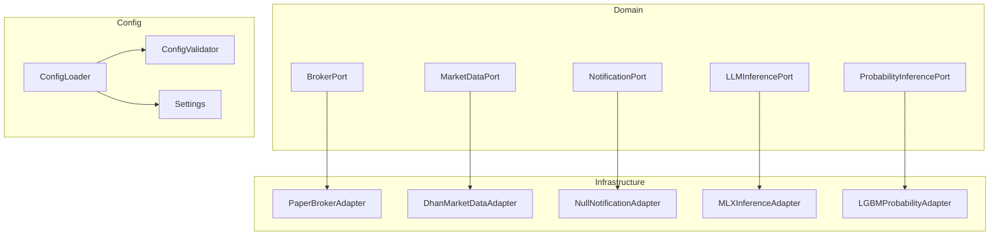
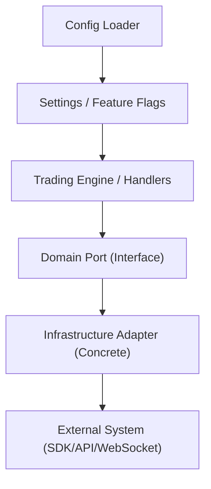
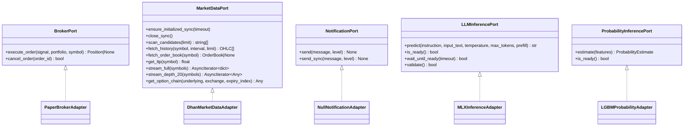
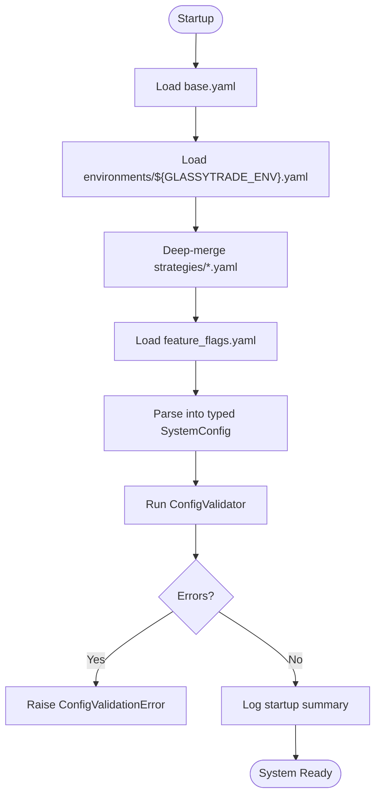
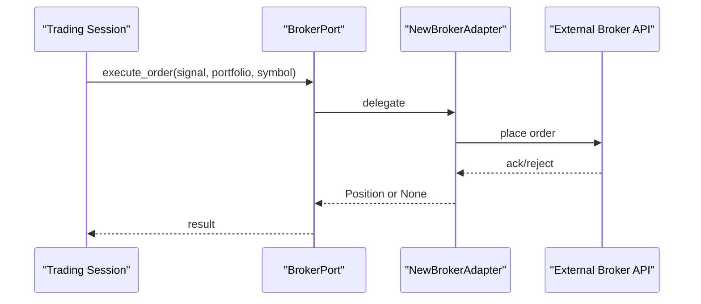
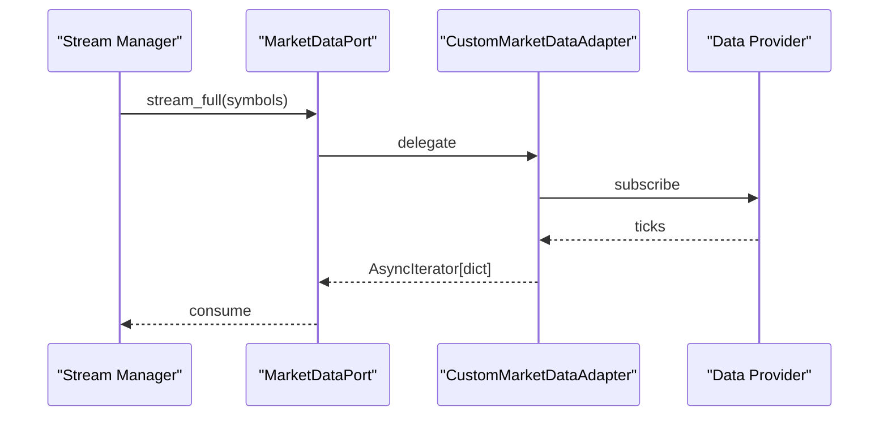
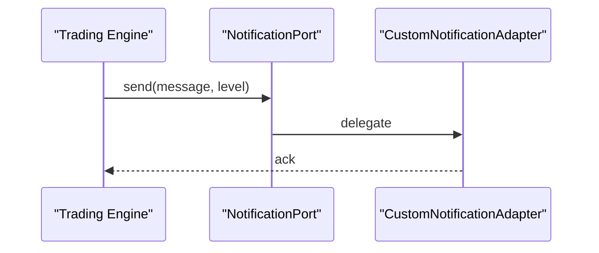
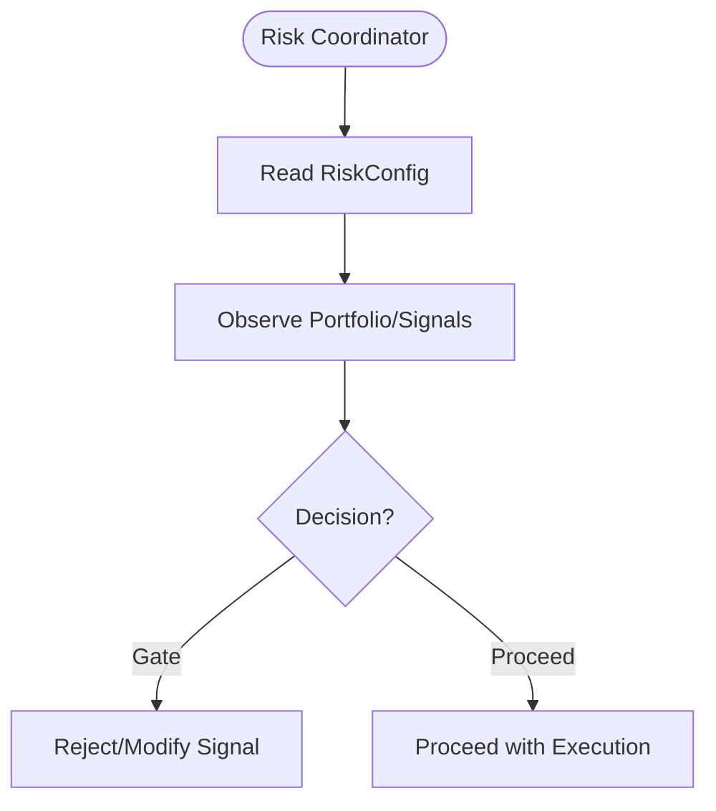
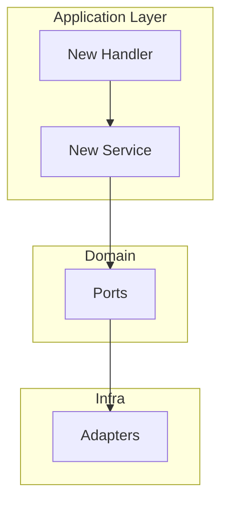
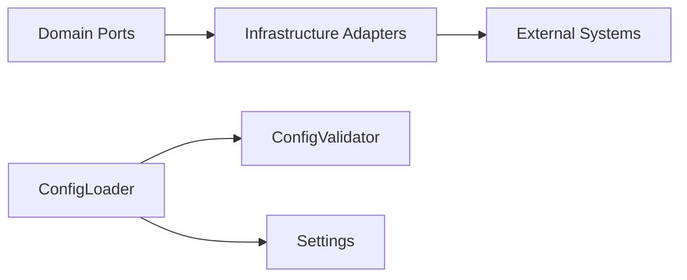

# System Extensions

<cite>
**Referenced Files in This Document**
- [backend/app/domain/ports/__init__.py](file://backend/app/domain/ports/__init__.py)
- [backend/app/domain/ports/broker.py](file://backend/app/domain/ports/broker.py)
- [backend/app/domain/ports/market_data.py](file://backend/app/domain/ports/market_data.py)
- [backend/app/domain/ports/notifications.py](file://backend/app/domain/ports/notifications.py)
- [backend/app/infrastructure/adapters/__init__.py](file://backend/app/infrastructure/adapters/__init__.py)
- [backend/app/infrastructure/adapters/paper_broker.py](file://backend/app/infrastructure/adapters/paper_broker.py)
- [backend/app/infrastructure/adapters/dhan_adapter.py](file://backend/app/infrastructure/adapters/dhan_adapter.py)
- [backend/app/infrastructure/adapters/null_notification_adapter.py](file://backend/app/infrastructure/adapters/null_notification_adapter.py)
- [backend/app/infrastructure/adapters/lgbm_probability_adapter.py](file://backend/app/infrastructure/adapters/lgbm_probability_adapter.py)
- [backend/app/infrastructure/adapters/mlx_inference_adapter.py](file://backend/app/infrastructure/adapters/mlx_inference_adapter.py)
- [backend/app/config_models/loader.py](file://backend/app/config_models/loader.py)
- [backend/app/config_models/validator.py](file://backend/app/config_models/validator.py)
- [backend/app/config.py](file://backend/app/config.py)
</cite>

## Table of Contents
1. [Introduction](#introduction)
2. [Project Structure](#project-structure)
3. [Core Components](#core-components)
4. [Architecture Overview](#architecture-overview)
5. [Detailed Component Analysis](#detailed-component-analysis)
6. [Dependency Analysis](#dependency-analysis)
7. [Performance Considerations](#performance-considerations)
8. [Troubleshooting Guide](#troubleshooting-guide)
9. [Conclusion](#conclusion)
10. [Appendices](#appendices)

## Introduction
This document explains how to extend the GlassyTrade AI v5 system with new capabilities using the ports and adapters pattern. It covers:
- How to integrate new external systems (brokers, market data providers, notifications)
- How to extend configuration management and feature flags
- How to implement custom adapters and ports
- How to add proprietary risk management modules and custom trading engine components
- How to manage configuration loading, validation, and runtime customization
- Plugin architecture, dependency injection patterns, and modular design
- Security considerations, backward compatibility, and integration testing

## Project Structure
GlassyTrade v5 organizes extension points around domain ports and infrastructure adapters:
- Domain ports define abstract interfaces for external systems (broker, market data, notifications, LLM inference, probability inference, storage).
- Infrastructure adapters implement these ports for real-world integrations (paper broker, Dhan market data, null notification, MLX LLM inference, LightGBM probability).
- Configuration is loaded from YAML, validated, and exposed to the application.

**Diagram sources**
- [backend/app/domain/ports/broker.py:11-27](file://backend/app/domain/ports/broker.py#L11-L27)
- [backend/app/domain/ports/market_data.py:19-112](file://backend/app/domain/ports/market_data.py#L19-L112)
- [backend/app/domain/ports/notifications.py:6-22](file://backend/app/domain/ports/notifications.py#L6-L22)
- [backend/app/infrastructure/adapters/paper_broker.py:118-199](file://backend/app/infrastructure/adapters/paper_broker.py#L118-L199)
- [backend/app/infrastructure/adapters/dhan_adapter.py:66-457](file://backend/app/infrastructure/adapters/dhan_adapter.py#L66-L457)
- [backend/app/infrastructure/adapters/null_notification_adapter.py:9-17](file://backend/app/infrastructure/adapters/null_notification_adapter.py#L9-L17)
- [backend/app/infrastructure/adapters/mlx_inference_adapter.py:12-396](file://backend/app/infrastructure/adapters/mlx_inference_adapter.py#L12-L396)
- [backend/app/infrastructure/adapters/lgbm_probability_adapter.py:24-167](file://backend/app/infrastructure/adapters/lgbm_probability_adapter.py#L24-L167)
- [backend/app/config_models/loader.py:139-245](file://backend/app/config_models/loader.py#L139-L245)
- [backend/app/config_models/validator.py:22-177](file://backend/app/config_models/validator.py#L22-L177)
- [backend/app/config.py:26-157](file://backend/app/config.py#L26-L157)

**Section sources**
- [backend/app/domain/ports/__init__.py:1-2](file://backend/app/domain/ports/__init__.py#L1-L2)
- [backend/app/infrastructure/adapters/__init__.py:1-2](file://backend/app/infrastructure/adapters/__init__.py#L1-L2)

## Core Components
- Domain ports: Define contracts for external systems. They are intentionally minimal and free of framework-specific concerns, enabling easy substitution.
- Infrastructure adapters: Implement domain ports for concrete integrations. They encapsulate third-party SDKs, network protocols, and I/O.
- Configuration: Centralized YAML-based configuration loader and validator, plus environment-backed settings.

Key extension points:
- New broker adapters: Implement BrokerPort and wire into the trading engine.
- New market data providers: Implement MarketDataPort and register in the stream manager.
- New notification channels: Implement NotificationPort and configure credentials.
- New inference engines: Implement LLMInferencePort or ProbabilityInferencePort.
- Custom risk modules: Integrate via service composition and configuration flags.

**Section sources**
- [backend/app/domain/ports/broker.py:11-27](file://backend/app/domain/ports/broker.py#L11-L27)
- [backend/app/domain/ports/market_data.py:19-112](file://backend/app/domain/ports/market_data.py#L19-L112)
- [backend/app/domain/ports/notifications.py:6-22](file://backend/app/domain/ports/notifications.py#L6-L22)
- [backend/app/config_models/loader.py:139-245](file://backend/app/config_models/loader.py#L139-L245)
- [backend/app/config_models/validator.py:22-177](file://backend/app/config_models/validator.py#L22-L177)
- [backend/app/config.py:26-157](file://backend/app/config.py#L26-L157)

## Architecture Overview
GlassyTrade v5 follows Clean Architecture with Ports and Adapters:
- Domain defines invariant behavior via ports.
- Application orchestrates workflows using services and handlers.
- Infrastructure adapts external systems to domain ports.

**Diagram sources**
- [backend/app/domain/ports/broker.py:11-27](file://backend/app/domain/ports/broker.py#L11-L27)
- [backend/app/domain/ports/market_data.py:19-112](file://backend/app/domain/ports/market_data.py#L19-L112)
- [backend/app/domain/ports/notifications.py:6-22](file://backend/app/domain/ports/notifications.py#L6-L22)
- [backend/app/infrastructure/adapters/dhan_adapter.py:66-457](file://backend/app/infrastructure/adapters/dhan_adapter.py#L66-L457)
- [backend/app/config_models/loader.py:139-245](file://backend/app/config_models/loader.py#L139-L245)

## Detailed Component Analysis

### Ports and Adapters Pattern
- BrokerPort: Defines order execution and cancellation semantics. Implementations include PaperBrokerAdapter and live broker integrations.
- MarketDataPort: Defines history, quotes, streaming, and optional options chain retrieval. Implementations include DhanMarketDataAdapter and mock/stream generators.
- NotificationPort: Defines asynchronous and synchronous alert delivery. Implementations include NullNotificationAdapter and Telegram/Slack adapters.
- LLMInferencePort and ProbabilityInferencePort: Enable pluggable reasoning and probabilistic inference engines.

**Diagram sources**
- [backend/app/domain/ports/broker.py:11-27](file://backend/app/domain/ports/broker.py#L11-L27)
- [backend/app/domain/ports/market_data.py:19-112](file://backend/app/domain/ports/market_data.py#L19-L112)
- [backend/app/domain/ports/notifications.py:6-22](file://backend/app/domain/ports/notifications.py#L6-L22)
- [backend/app/infrastructure/adapters/paper_broker.py:118-199](file://backend/app/infrastructure/adapters/paper_broker.py#L118-L199)
- [backend/app/infrastructure/adapters/dhan_adapter.py:66-457](file://backend/app/infrastructure/adapters/dhan_adapter.py#L66-L457)
- [backend/app/infrastructure/adapters/null_notification_adapter.py:9-17](file://backend/app/infrastructure/adapters/null_notification_adapter.py#L9-L17)
- [backend/app/infrastructure/adapters/mlx_inference_adapter.py:12-396](file://backend/app/infrastructure/adapters/mlx_inference_adapter.py#L12-L396)
- [backend/app/infrastructure/adapters/lgbm_probability_adapter.py:24-167](file://backend/app/infrastructure/adapters/lgbm_probability_adapter.py#L24-L167)

**Section sources**
- [backend/app/domain/ports/broker.py:11-27](file://backend/app/domain/ports/broker.py#L11-L27)
- [backend/app/domain/ports/market_data.py:19-112](file://backend/app/domain/ports/market_data.py#L19-L112)
- [backend/app/domain/ports/notifications.py:6-22](file://backend/app/domain/ports/notifications.py#L6-L22)

### Configuration Management and Validation
Configuration is loaded from a YAML hierarchy, merged, typed, validated, and logged at startup. Feature flags control optional subsystems.

**Diagram sources**
- [backend/app/config_models/loader.py:139-245](file://backend/app/config_models/loader.py#L139-L245)
- [backend/app/config_models/validator.py:22-177](file://backend/app/config_models/validator.py#L22-L177)

**Section sources**
- [backend/app/config_models/loader.py:139-245](file://backend/app/config_models/loader.py#L139-L245)
- [backend/app/config_models/validator.py:22-177](file://backend/app/config_models/validator.py#L22-L177)
- [backend/app/config.py:26-157](file://backend/app/config.py#L26-L157)

### Adding a New Broker Adapter
Steps:
1. Implement BrokerPort in a new adapter class.
2. Wire the adapter into the application’s dependency graph (see Dependency Injection Patterns).
3. Configure broker_mode and credentials via environment and YAML.
4. Test with PaperBrokerAdapter first, then switch to live mode.

**Diagram sources**
- [backend/app/domain/ports/broker.py:11-27](file://backend/app/domain/ports/broker.py#L11-L27)
- [backend/app/infrastructure/adapters/paper_broker.py:118-199](file://backend/app/infrastructure/adapters/paper_broker.py#L118-L199)

**Section sources**
- [backend/app/domain/ports/broker.py:11-27](file://backend/app/domain/ports/broker.py#L11-L27)
- [backend/app/infrastructure/adapters/paper_broker.py:118-199](file://backend/app/infrastructure/adapters/paper_broker.py#L118-L199)

### Integrating Additional Data Sources
Steps:
1. Implement MarketDataPort in a new adapter.
2. Support fetch_history, stream_full, and optional get_option_chain.
3. Register the adapter in the stream manager and configuration.

**Diagram sources**
- [backend/app/domain/ports/market_data.py:19-112](file://backend/app/domain/ports/market_data.py#L19-L112)
- [backend/app/infrastructure/adapters/dhan_adapter.py:364-457](file://backend/app/infrastructure/adapters/dhan_adapter.py#L364-L457)

**Section sources**
- [backend/app/domain/ports/market_data.py:19-112](file://backend/app/domain/ports/market_data.py#L19-L112)
- [backend/app/infrastructure/adapters/dhan_adapter.py:66-457](file://backend/app/infrastructure/adapters/dhan_adapter.py#L66-L457)

### Implementing Custom Notification Channels
Steps:
1. Implement NotificationPort in a new adapter.
2. Configure credentials via environment variables.
3. Replace NullNotificationAdapter in production.

**Diagram sources**
- [backend/app/domain/ports/notifications.py:6-22](file://backend/app/domain/ports/notifications.py#L6-L22)
- [backend/app/infrastructure/adapters/null_notification_adapter.py:9-17](file://backend/app/infrastructure/adapters/null_notification_adapter.py#L9-L17)

**Section sources**
- [backend/app/domain/ports/notifications.py:6-22](file://backend/app/domain/ports/notifications.py#L6-L22)
- [backend/app/infrastructure/adapters/null_notification_adapter.py:9-17](file://backend/app/infrastructure/adapters/null_notification_adapter.py#L9-L17)

### Implementing Proprietary Risk Management Modules
Approach:
- Encapsulate risk logic in a service that consumes domain events and emits gating decisions.
- Expose configuration flags to enable/disable and tune behavior.
- Validate risk parameters during startup.

[No sources needed since this diagram shows conceptual workflow, not actual code structure]

**Section sources**
- [backend/app/config_models/loader.py:191-235](file://backend/app/config_models/loader.py#L191-L235)
- [backend/app/config_models/validator.py:22-177](file://backend/app/config_models/validator.py#L22-L177)

### Extending the Trading Engine with Custom Components
Approach:
- Add new handlers/services in the application layer.
- Compose them with existing services via dependency injection.
- Gate optional components behind feature flags.

[No sources needed since this diagram shows conceptual workflow, not actual code structure]

## Dependency Analysis
- Domain ports decouple application logic from external systems.
- Infrastructure adapters depend on external SDKs and APIs.
- Configuration loader depends on YAML files and environment variables.
- Validators enforce safety rules at startup.

**Diagram sources**
- [backend/app/config_models/loader.py:139-245](file://backend/app/config_models/loader.py#L139-L245)
- [backend/app/config_models/validator.py:22-177](file://backend/app/config_models/validator.py#L22-L177)

**Section sources**
- [backend/app/config_models/loader.py:139-245](file://backend/app/config_models/loader.py#L139-L245)
- [backend/app/config_models/validator.py:22-177](file://backend/app/config_models/validator.py#L22-L177)

## Performance Considerations
- Asynchronous adapters should avoid blocking I/O and propagate failures promptly.
- Streaming adapters should batch and throttle to reduce overhead.
- Model adapters should preload and cache where feasible; use background loading to avoid startup stalls.
- Use feature flags to disable heavy components in constrained environments.

[No sources needed since this section provides general guidance]

## Troubleshooting Guide
Common issues and remedies:
- Configuration validation failures: Review rule messages and adjust YAML/flags accordingly.
- Adapter readiness errors: Ensure credentials and model paths are set; check cloud fallback configuration.
- Network connectivity: Verify external provider credentials and rate limits.
- Feature flag misconfiguration: Confirm flags align with environment and deployment targets.

**Section sources**
- [backend/app/config_models/validator.py:22-177](file://backend/app/config_models/validator.py#L22-L177)
- [backend/app/infrastructure/adapters/mlx_inference_adapter.py:363-396](file://backend/app/infrastructure/adapters/mlx_inference_adapter.py#L363-L396)

## Conclusion
GlassyTrade v5 provides a robust foundation for extensions using ports and adapters, centralized configuration, and strict validation. By implementing domain ports and wiring adapters into the application, teams can integrate new brokers, market data providers, notifications, and inference engines while maintaining modularity, testability, and safety.

[No sources needed since this section summarizes without analyzing specific files]

## Appendices

### Practical Extension Recipes
- Custom Market Data Adapter
  - Implement MarketDataPort with async stream_full and fetch_history.
  - Support get_option_chain if applicable.
  - Register in the stream manager and update configuration.

- Custom Broker Adapter
  - Implement BrokerPort with execute_order and cancel_order.
  - Validate order semantics against the trading engine’s expectations.
  - Start with PaperBrokerAdapter as a reference.

- Custom Notification Adapter
  - Implement NotificationPort with non-blocking send/send_sync.
  - Configure credentials via environment variables.
  - Replace NullNotificationAdapter in production.

- Custom LLM/Probability Adapter
  - Implement LLMInferencePort or ProbabilityInferencePort.
  - Provide is_ready, wait_until_ready, and validate.
  - Use feature flags to gate optional behavior.

- Risk Module Integration
  - Add a new service that observes domain events and enforces constraints.
  - Expose configuration fields and validators.
  - Gate behind a feature flag.

[No sources needed since this section provides general guidance]