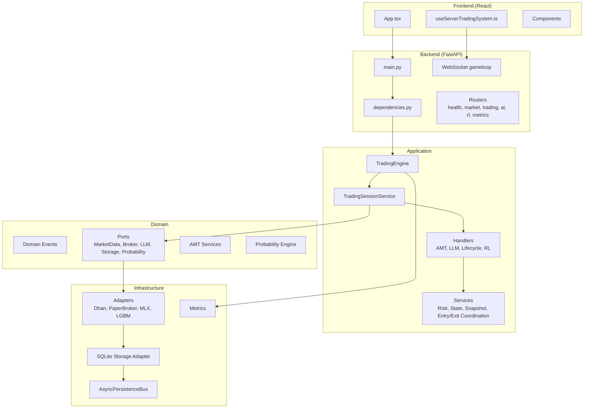
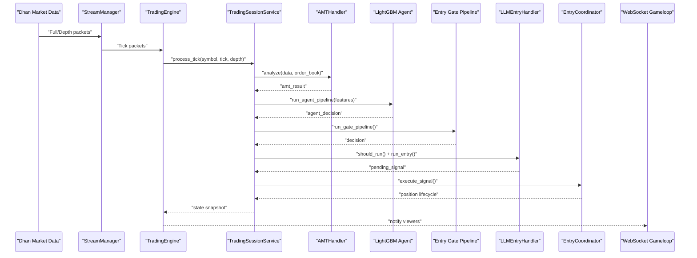
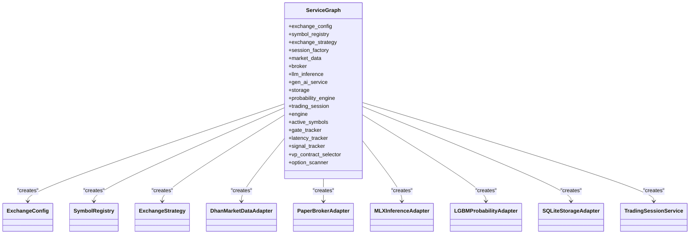
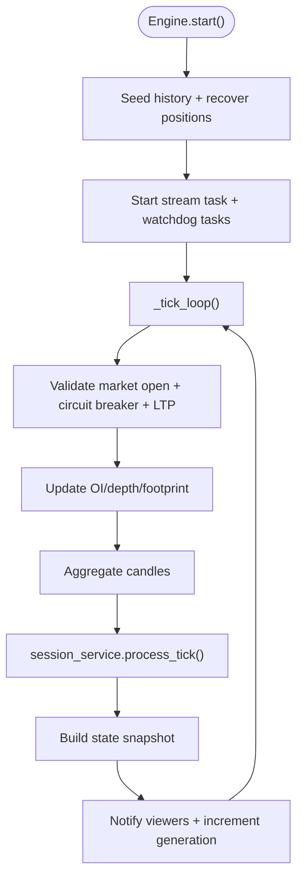
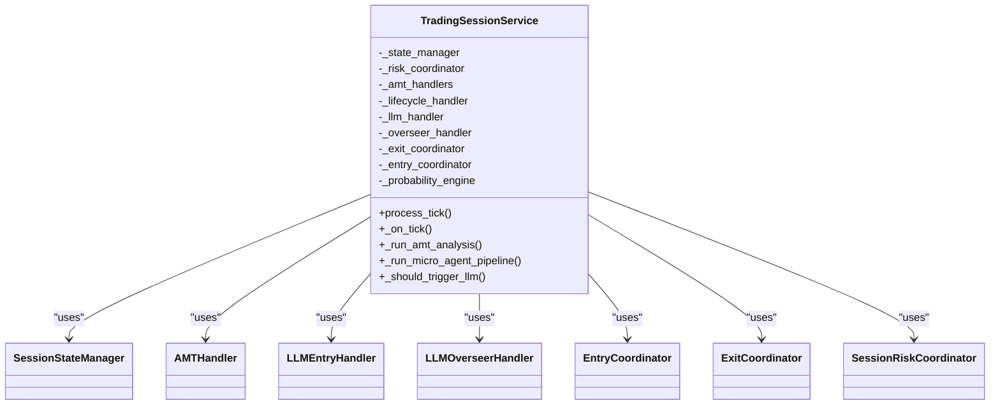
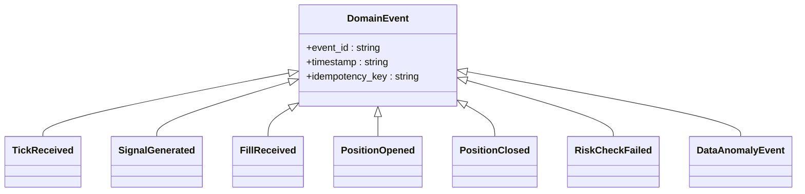
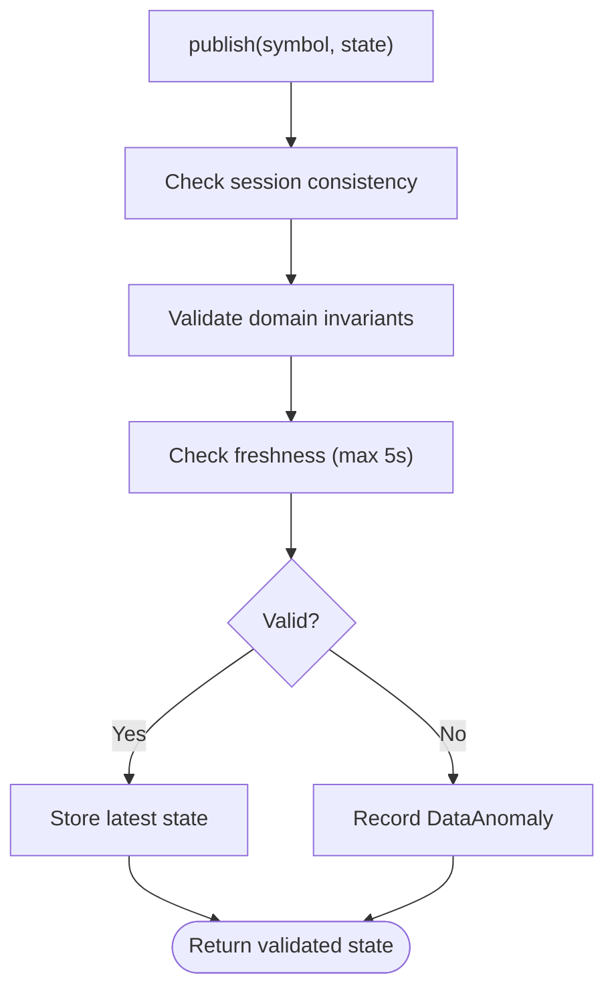
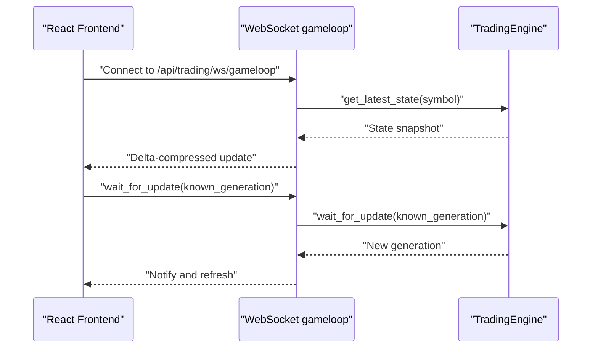
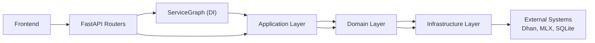
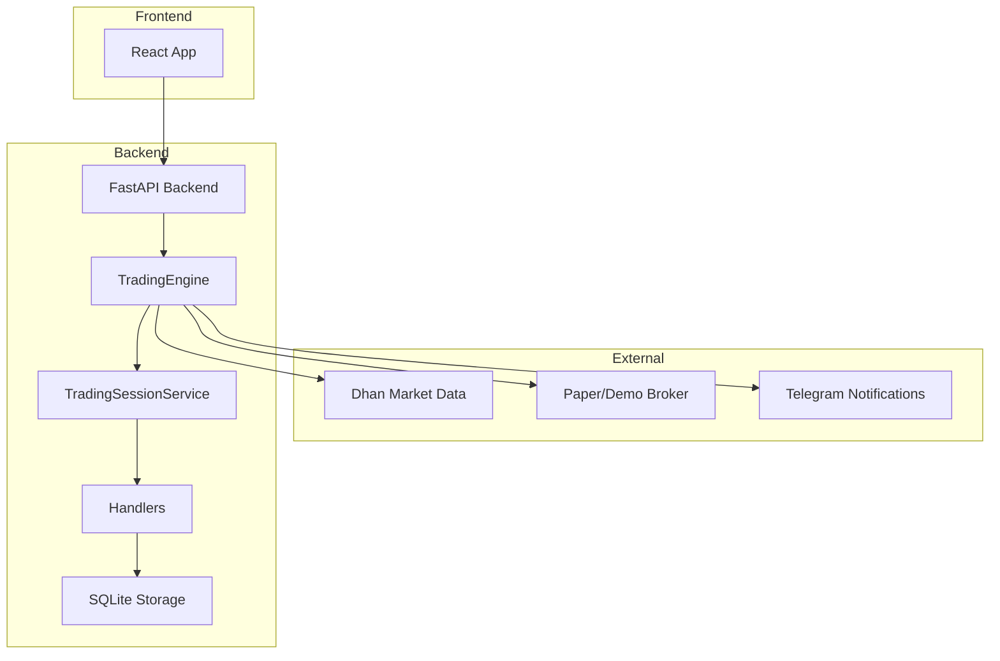

# Architecture Deep Dive

<cite>
**Referenced Files in This Document**
- [backend/app/main.py](file://backend/app/main.py)
- [backend/app/config.py](file://backend/app/config.py)
- [backend/docs/architecture.md](file://backend/docs/architecture.md)
- [ARCHITECTURE.md](file://ARCHITECTURE.md)
- [backend/app/api/dependencies.py](file://backend/app/api/dependencies.py)
- [backend/app/application/engine.py](file://backend/app/application/engine.py)
- [backend/app/application/services/trading_session.py](file://backend/app/application/services/trading_session.py)
- [backend/app/domain/trading/events.py](file://backend/app/domain/trading/events.py)
- [backend/app/domain/trading/event_store.py](file://backend/app/domain/trading/event_store.py)
- [backend/app/domain/services/state_bus.py](file://backend/app/domain/services/state_bus.py)
- [backend/app/api/routers/health.py](file://backend/app/api/routers/health.py)
- [backend/app/api/routers/market.py](file://backend/app/api/routers/market.py)
- [backend/app/api/routers/trading.py](file://backend/app/api/routers/trading.py)
- [backend/app/api/routers/ai.py](file://backend/app/api/routers/ai.py)
- [backend/app/api/routers/rl.py](file://backend/app/api/routers/rl.py)
- [backend/app/api/routers/metrics.py](file://backend/app/api/routers/metrics.py)
- [backend/app/api/websocket/gameloop.py](file://backend/app/api/websocket/gameloop.py)
- [backend/app/infrastructure/adapters/dhan_adapter.py](file://backend/app/infrastructure/adapters/dhan_adapter.py)
- [backend/app/infrastructure/adapters/paper_broker.py](file://backend/app/infrastructure/adapters/paper_broker.py)
- [backend/app/infrastructure/adapters/mlx_inference_adapter.py](file://backend/app/infrastructure/adapters/mlx_inference_adapter.py)
- [backend/app/infrastructure/adapters/lgbm_probability_adapter.py](file://backend/app/infrastructure/adapters/lgbm_probability_adapter.py)
- [backend/app/infrastructure/storage/database.py](file://backend/app/infrastructure/storage/database.py)
- [backend/app/infrastructure/async_persistence.py](file://backend/app/infrastructure/async_persistence.py)
- [backend/app/infrastructure/metrics.py](file://backend/app/infrastructure/metrics.py)
- [backend/app/infrastructure/serialization/schemas.py](file://backend/app/infrastructure/serialization/schemas.py)
- [backend/app/application/stream_manager.py](file://backend/app/application/stream_manager.py)
- [backend/app/application/candle_aggregator.py](file://backend/app/application/candle_aggregator.py)
- [backend/app/application/watchdog_manager.py](file://backend/app/application/watchdog_manager.py)
- [backend/app/application/range_bar_builder.py](file://backend/app/application/range_bar_builder.py)
- [backend/app/application/services/session_state_manager.py](file://backend/app/application/services/session_state_manager.py)
- [backend/app/application/services/session_risk_coordinator.py](file://backend/app/application/services/session_risk_coordinator.py)
- [backend/app/application/services/state_snapshot_builder.py](file://backend/app/application/services/state_snapshot_builder.py)
- [backend/app/application/services/entry_coordinator.py](file://backend/app/application/services/entry_coordinator.py)
- [backend/app/application/services/exit_coordinator.py](file://backend/app/application/services/exit_coordinator.py)
- [backend/app/application/services/trade_journal.py](file://backend/app/application/services/trade_journal.py)
- [backend/app/application/services/backtest_engine.py](file://backend/app/application/services/backtest_engine.py)
- [backend/app/application/utils.py](file://backend/app/application/utils.py)
- [backend/app/shared/timezones.py](file://backend/app/shared/timezones.py)
- [backend/app/shared/resilience.py](file://backend/app/shared/resilience.py)
- [backend/app/domain/ports/market_data.py](file://backend/app/domain/ports/market_data.py)
- [backend/app/domain/ports/broker.py](file://backend/app/domain/ports/broker.py)
- [backend/app/domain/ports/llm_inference.py](file://backend/app/domain/ports/llm_inference.py)
- [backend/app/domain/ports/probability_inference.py](file://backend/app/domain/ports/probability_inference.py)
- [backend/app/domain/ports/storage.py](file://backend/app/domain/ports/storage.py)
- [backend/app/domain/ports/exchange_strategy.py](file://backend/app/domain/ports/exchange_strategy.py)
- [backend/app/domain/models/exchange_config.py](file://backend/app/domain/models/exchange_config.py)
- [backend/app/domain/services/symbol_registry.py](file://backend/app/domain/services/symbol_registry.py)
- [backend/app/domain/services/composite_profile.py](file://backend/app/domain/services/composite_profile.py)
- [backend/app/domain/services/alert_manager.py](file://backend/app/domain/services/alert_manager.py)
- [backend/app/domain/services/npoct_tracker.py](file://backend/app/domain/services/npoct_tracker.py)
- [backend/app/domain/services/session_context_factory.py](file://backend/app/domain/services/session_context_factory.py)
- [backend/app/domain/services/gate_rejection_tracker.py](file://backend/app/domain/services/gate_rejection_tracker.py)
- [backend/app/domain/services/latency_tracker.py](file://backend/app/domain/services/latency_tracker.py)
- [backend/app/domain/services/self_healing.py](file://backend/app/domain/services/self_healing.py)
- [backend/app/domain/services/mobile_alerts.py](file://backend/app/domain/services/mobile_alerts.py)
- [backend/app/domain/fabio_ai/services/generative_ai_service.py](file://backend/app/domain/fabio_ai/services/generative_ai_service.py)
- [backend/app/domain/fabio_ai/services/option_scanner.py](file://backend/app/domain/fabio_ai/services/option_scanner.py)
- [backend/app/domain/fabio_ai/services/vp_contract_selector.py](file://backend/app/domain/fabio_ai/services/vp_contract_selector.py)
- [backend/app/domain/fabio_ai/services/entry_gate.py](file://backend/app/domain/fabio_ai/services/entry_gate.py)
- [backend/app/domain/fabio_ai/services/amt_analyzer.py](file://backend/app/domain/fabio_ai/services/amt_analyzer.py)
- [backend/app/domain/fabio_ai/services/market_state_engine.py](file://backend/app/domain/fabio_ai/services/market_state_engine.py)
- [backend/app/domain/fabio_ai/services/market_structure_classifier.py](file://backend/app/domain/fabio_ai/services/market_structure_classifier.py)
- [backend/app/domain/fabio_ai/services/cvd_tracker.py](file://backend/app/domain/fabio_ai/services/cvd_tracker.py)
- [backend/app/domain/fabio_ai/services/aggression_scorer.py](file://backend/app/domain/fabio_ai/services/aggression_scorer.py)
- [backend/app/domain/fabio_ai/services/oi_analyzer.py](file://backend/app/domain/fabio_ai/services/oi_analyzer.py)
- [backend/app/domain/fabio_ai/services/pre_candle_advisor.py](file://backend/app/domain/fabio_ai/services/pre_candle_advisor.py)
- [backend/app/domain/fabio_ai/services/underlying_futures_provider.py](file://backend/app/domain/fabio_ai/services/underlying_futures_provider.py)
- [backend/app/domain/probability/agent_pipeline.py](file://backend/app/domain/probability/agent_pipeline.py)
- [backend/app/domain/probability/features.py](file://backend/app/domain/probability/features.py)
- [backend/app/domain/probability/labels.py](file://backend/app/domain/probability/labels.py)
- [backend/app/domain/trading/models/value_objects.py](file://backend/app/domain/trading/models/value_objects.py)
- [backend/app/domain/trading/models/entities.py](file://backend/app/domain/trading/models/entities.py)
- [backend/app/domain/trading/models/aggregates.py](file://backend/app/domain/trading/models/aggregates.py)
- [backend/app/domain/trading/models/enums.py](file://backend/app/domain/trading/models/enums.py)
- [backend/app/domain/constants.py](file://backend/app/domain/constants.py)
- [backend/config/consolidated.py](file://backend/config/consolidated.py)
- [backend/config/environments/development.yaml](file://backend/config/environments/development.yaml)
- [backend/config/environments/live.yaml](file://backend/config/environments/live.yaml)
- [backend/config/environments/paper.yaml](file://backend/config/environments/paper.yaml)
- [backend/config/base.yaml](file://backend/config/base.yaml)
- [backend/config/feature_flags.yaml](file://backend/config/feature_flags.yaml)
- [backend/config/instruments.json](file://backend/config/instruments.json)
- [backend/market_config.yaml](file://backend/market_config.yaml)
- [frontend/App.tsx](file://frontend/App.tsx)
- [frontend/hooks/useServerTradingSystem.ts](file://frontend/hooks/useServerTradingSystem.ts)
- [frontend/package.json](file://frontend/package.json)
- [frontend/vite.config.ts](file://frontend/vite.config.ts)
- [frontend/tsconfig.json](file://frontend/tsconfig.json)
- [frontend/index.html](file://frontend/index.html)
- [frontend/index.tsx](file://frontend/index.tsx)
- [frontend/index.css](file://frontend/index.css)
- [frontend/types.ts](file://frontend/types.ts)
- [frontend/types_rl.ts](file://frontend/types_rl.ts)
- [frontend/constants.ts](file://frontend/constants.ts)
- [frontend/components/AIControls.ts](file://frontend/components/AIControls.ts)
- [frontend/components/ChartScene.tsx](file://frontend/components/ChartScene.tsx)
- [frontend/components/GlassPanel.tsx](file://frontend/components/GlassPanel.tsx)
- [frontend/components/JournalPage.tsx](file://frontend/components/JournalPage.tsx)
- [frontend/components/MarketSidebar.tsx](file://frontend/components/MarketSidebar.tsx)
- [frontend/components/SystemStatusBar.tsx](file://frontend/components/SystemStatusBar.tsx)
- [frontend/components/VolumeAccessory.ts](file://frontend/components/VolumeAccessory.ts)
- [frontend/components/ai/index.ts](file://frontend/components/ai/index.ts)
- [frontend/components/ai/DecisionHistoryPanel.tsx](file://frontend/components/ai/DecisionHistoryPanel.tsx)
- [frontend/components/ai/EquityPanel.tsx](file://frontend/components/ai/EquityPanel.tsx)
- [frontend/components/ai/LiveOpportunityCard.tsx](file://frontend/components/ai/LiveOpportunityCard.tsx)
- [frontend/components/ai/ModelIOPanel.tsx](file://frontend/components/ai/ModelIOPanel.tsx)
- [frontend/components/ai/RiskStateDisplay.tsx](file://frontend/components/ai/RiskStateDisplay.tsx)
- [frontend/components/AIAgentAvatar.tsx](file://frontend/components/AIAgentAvatar.tsx)
- [frontend/components/AIAnalysisPanel.tsx](file://frontend/components/AIAnalysisPanel.tsx)
- [frontend/utils/textSanitizer.ts](file://frontend/utils/textSanitizer.ts)
- [frontend/tests/components/ChartScene.test.tsx](file://frontend/tests/components/ChartScene.test.tsx)
- [frontend/tests/components/GlassPanel.test.tsx](file://frontend/tests/components/GlassPanel.test.tsx)
- [frontend/tests/components/MarketSidebar.test.tsx](file://frontend/tests/components/MarketSidebar.test.tsx)
- [frontend/tests/hooks/useServerTradingSystem.test.tsx](file://frontend/tests/hooks/useServerTradingSystem.test.tsx)
- [frontend/tests/integration/trading-flow.test.tsx](file://frontend/tests/integration/trading-flow.test.tsx)
- [frontend/tests/setup.ts](file://frontend/tests/setup.ts)
- [brokers/gateway.py](file://brokers/gateway.py)
- [brokers/reactive.py](file://brokers/reactive.py)
- [brokers/__init__.py](file://brokers/__init__.py)
- [brokers/ports.py](file://brokers/ports.py)
- [brokers/types.py](file://brokers/types.py)
- [brokers/validation.py](file://brokers/validation.py)
- [brokers/market_info.py](file://brokers/market_info.py)
- [brokers/symbol_matcher.py](file://brokers/symbol_matcher.py)
- [brokers/utils/symbol.py](file://brokers/utils/symbol.py)
- [shared/config.py](file://shared/config.py)
- [shared/error_handling.py](file://shared/error_handling.py)
- [shared/resilience.py](file://shared/resilience.py)
- [shared/conversion.py](file://shared/conversion.py)
</cite>

## Table of Contents
1. [Introduction](#introduction)
2. [Project Structure](#project-structure)
3. [Core Components](#core-components)
4. [Architecture Overview](#architecture-overview)
5. [Detailed Component Analysis](#detailed-component-analysis)
6. [Dependency Analysis](#dependency-analysis)
7. [Performance Considerations](#performance-considerations)
8. [Troubleshooting Guide](#troubleshooting-guide)
9. [Conclusion](#conclusion)
10. [Appendices](#appendices)

## Introduction
GlassyTrade AI v5 is a production-grade, event-driven, domain-driven design (DDD) trading system implementing Fabio Valentini’s Auction Market Theory (AMT) methodology with AI-assisted entry decisions. It operates a standalone trading engine that continuously processes market data, evaluates signals, and executes trades independently of the frontend. The backend is built on FastAPI with a robust dependency injection (DI) service graph, event sourcing, and a pipeline architecture. The frontend is a React-based read-only viewer that consumes WebSocket updates and HTTP endpoints.

## Project Structure
The repository follows a layered architecture with clear separation of concerns:
- API Layer (FastAPI): Routers, WebSocket endpoints, and dependency providers
- Application Layer: Trading engine, session orchestration, handlers, and services
- Domain Layer: Entities, events, ports, services implementing AMT and probability engines
- Infrastructure Layer: Adapters for broker, market data, inference, storage, and metrics
- Shared Layer: Cross-cutting utilities and resilience primitives
- Frontend: React application consuming backend APIs and WebSocket streams
- Brokers Library: Reusable broker integration and reactive streaming utilities

**Diagram sources**
- [backend/app/main.py:171-227](file://backend/app/main.py#L171-L227)
- [backend/app/api/dependencies.py:43-384](file://backend/app/api/dependencies.py#L43-L384)
- [backend/app/application/engine.py:59-126](file://backend/app/application/engine.py#L59-L126)
- [backend/app/application/services/trading_session.py:85-229](file://backend/app/application/services/trading_session.py#L85-L229)
- [backend/app/domain/trading/events.py:39-499](file://backend/app/domain/trading/events.py#L39-L499)
- [backend/app/domain/ports/market_data.py:1-200](file://backend/app/domain/ports/market_data.py#L1-L200)
- [backend/app/infrastructure/adapters/dhan_adapter.py:1-200](file://backend/app/infrastructure/adapters/dhan_adapter.py#L1-L200)
- [backend/app/infrastructure/storage/database.py:1-200](file://backend/app/infrastructure/storage/database.py#L1-L200)
- [backend/app/infrastructure/async_persistence.py:1-200](file://backend/app/infrastructure/async_persistence.py#L1-L200)

**Section sources**
- [backend/docs/architecture.md:10-52](file://backend/docs/architecture.md#L10-L52)
- [ARCHITECTURE.md:41-105](file://ARCHITECTURE.md#L41-L105)

## Core Components
- Service Graph (DI Container): Singleton factory wiring all adapters, services, and trackers at startup
- TradingEngine: Standalone event loop processing ticks, aggregating candles, and notifying WebSocket viewers
- TradingSessionService: Orchestrates per-symbol state, delegates to specialized handlers, and coordinates risk and lifecycle
- Domain Events and Event Store: Immutable event model with idempotency, ordering, and replay capability
- State Bus: Validation middleware ensuring data freshness and domain invariants before publishing to consumers
- Handler Architecture: Focused handlers for AMT analysis, LLM entry decisions, overseer, lifecycle, and RL
- Infrastructure Adapters: Dhan market data, PaperBroker, MLX inference, LightGBM probability engine, SQLite persistence

**Section sources**
- [backend/app/api/dependencies.py:43-384](file://backend/app/api/dependencies.py#L43-L384)
- [backend/app/application/engine.py:59-126](file://backend/app/application/engine.py#L59-L126)
- [backend/app/application/services/trading_session.py:85-229](file://backend/app/application/services/trading_session.py#L85-L229)
- [backend/app/domain/trading/events.py:39-114](file://backend/app/domain/trading/events.py#L39-L114)
- [backend/app/domain/trading/event_store.py:51-265](file://backend/app/domain/trading/event_store.py#L51-L265)
- [backend/app/domain/services/state_bus.py:45-165](file://backend/app/domain/services/state_bus.py#L45-L165)

## Architecture Overview
GlassyTrade AI v5 implements:
- DDD + Hexagonal (Ports & Adapters) architecture isolating domain logic behind abstract ports
- Event-driven pipeline: TickReceived → AMT → Agent (LightGBM) → Gate → LLM → Signal → Execution
- Server-driven trading: Engine runs independently; frontend is read-only
- Service Graph DI pattern: Singleton container created at startup, injected via FastAPI dependencies
- Real-time WebSocket viewer: Gameloop endpoint streams state snapshots to the React frontend

**Diagram sources**
- [backend/app/application/engine.py:628-800](file://backend/app/application/engine.py#L628-L800)
- [backend/app/application/services/trading_session.py:233-418](file://backend/app/application/services/trading_session.py#L233-L418)
- [backend/app/domain/trading/events.py:62-78](file://backend/app/domain/trading/events.py#L62-L78)
- [backend/app/api/websocket/gameloop.py:1-200](file://backend/app/api/websocket/gameloop.py#L1-L200)

**Section sources**
- [ARCHITECTURE.md:330-474](file://ARCHITECTURE.md#L330-L474)
- [backend/app/main.py:83-176](file://backend/app/main.py#L83-L176)

## Detailed Component Analysis

### Service Graph (DI Container) and Startup Lifecycle
The ServiceGraph creates and wires all core services once at process startup:
- Exchange abstraction: ExchangeConfig, SymbolRegistry, ExchangeStrategy
- Adapters: DhanMarketDataAdapter, PaperBrokerAdapter, MLXInferenceAdapter, LGBMProbabilityAdapter
- Storage: SQLiteStorageAdapter wrapped by AsyncPersistenceBus
- Generative AI Service: wraps LLM adapter with instruction templates
- TradingSessionService: orchestrates handlers and risk coordination
- Observability: GateRejectionTracker, LatencyTracker, SignalTrackingService
- Active symbols: auto-selected via scanners and VP contract selector

**Diagram sources**
- [backend/app/api/dependencies.py:43-384](file://backend/app/api/dependencies.py#L43-L384)

**Section sources**
- [backend/app/api/dependencies.py:324-384](file://backend/app/api/dependencies.py#L324-L384)
- [backend/app/main.py:83-127](file://backend/app/main.py#L83-L127)

### TradingEngine — Standalone Core
The TradingEngine is the heart of the system:
- Initializes delegated modules: StreamManager, CandleAggregator, RangeBarBuilder, WatchdogManager
- Seeding historical data and mid-trade recovery from DB
- Continuous tick loop validating market open/circuit breaker, updating OI/depth/footprint, aggregating candles, and invoking session processing
- Maintains latest state snapshots and notifies WebSocket viewers via condition variable
- Graceful shutdown: stops engine, flushes pending ticks, tears down thread pools, disconnects market data

**Diagram sources**
- [backend/app/application/engine.py:131-177](file://backend/app/application/engine.py#L131-L177)
- [backend/app/application/engine.py:628-800](file://backend/app/application/engine.py#L628-L800)

**Section sources**
- [backend/app/application/engine.py:59-126](file://backend/app/application/engine.py#L59-L126)
- [backend/app/application/engine.py:131-208](file://backend/app/application/engine.py#L131-L208)
- [backend/app/application/engine.py:372-576](file://backend/app/application/engine.py#L372-L576)

### TradingSessionService — Event-Driven Orchestrator
Per-symbol orchestration coordinating:
- SessionStateManager for state persistence and reset
- AMTHandler for volume profile, LVN/HVN, market state, aggression, CVD
- Micro-agent pipeline using LightGBM models for direction/probability/regime/timing/kelly sizing
- LLMEntryHandler for generative AI entry decisions with worker threads
- LLMOverseerHandler for position monitoring and exit decisions
- EntryCoordinator and ExitCoordinator for execution and lifecycle management
- SessionRiskCoordinator for risk sizing and tier management
- PreCandleAdvisor for non-blocking advisory pushes

**Diagram sources**
- [backend/app/application/services/trading_session.py:85-229](file://backend/app/application/services/trading_session.py#L85-L229)

**Section sources**
- [backend/app/application/services/trading_session.py:233-418](file://backend/app/application/services/trading_session.py#L233-L418)
- [backend/app/application/services/trading_session.py:461-518](file://backend/app/application/services/trading_session.py#L461-L518)

### Domain Events and Event Store
Immutable domain events form the backbone of the event-driven architecture:
- TickReceived, SignalGenerated/Validated, OrderPlaced/Cancelled, FillReceived, PositionOpened/Closed, RiskCheckFailed, DailyLossLimitReached, DataAnomalyEvent
- EventBus with idempotency keys and optional persistence via EventStore
- ReplayEngine for deterministic state reconstruction

**Diagram sources**
- [backend/app/domain/trading/events.py:39-499](file://backend/app/domain/trading/events.py#L39-L499)

**Section sources**
- [backend/app/domain/trading/events.py:39-114](file://backend/app/domain/trading/events.py#L39-L114)
- [backend/app/domain/trading/event_store.py:51-265](file://backend/app/domain/trading/event_store.py#L51-L265)

### State Bus — Validation Middleware
Ensures data integrity before publishing to consumers:
- Session consistency checks (current vs incoming session ID)
- Domain invariants validation (POC/VAL/VAH ordering, VWAP positivity/sign checks)
- Freshness checks (max staleness threshold)
- Anomaly recording and reporting

**Diagram sources**
- [backend/app/domain/services/state_bus.py:82-165](file://backend/app/domain/services/state_bus.py#L82-L165)

**Section sources**
- [backend/app/domain/services/state_bus.py:45-165](file://backend/app/domain/services/state_bus.py#L45-L165)

### Handler Architecture
Focused handlers encapsulate distinct responsibilities:
- AMTHandler: Volume profile, LVN/HVN, market state, aggression, CVD
- LLMEntryHandler: Generative AI entry decisions with worker threads and cooldowns
- LLMOverseerHandler: Position monitoring and exit decisions
- TradeLifecycleHandler: Position lifecycle, stop-outs, partial exits, performance tracking
- RLHandler: Reinforcement learning status
- EntryCoordinator/ExitCoordinator: Execution and lifecycle coordination

**Section sources**
- [backend/app/application/services/trading_session.py:137-199](file://backend/app/application/services/trading_session.py#L137-L199)
- [backend/app/application/services/entry_coordinator.py:1-200](file://backend/app/application/services/entry_coordinator.py#L1-L200)
- [backend/app/application/services/exit_coordinator.py:1-200](file://backend/app/application/services/exit_coordinator.py#L1-L200)

### Infrastructure Adapters and Storage
- DhanMarketDataAdapter: WebSocket streaming, depth feeds, instrument caching, REST fallback
- PaperBrokerAdapter: Simulated execution with slippage and commissions
- MLXInferenceAdapter: Apple Silicon GPU acceleration with LoRA fine-tuned models
- LGBMProbabilityAdapter: First-passage binary classifiers for agent decisions
- SQLiteStorageAdapter + AsyncPersistenceBus: Background-thread persistence for ticks, trades, decisions, positions, events
- Metrics: Telemetry and observability hooks

**Section sources**
- [backend/app/infrastructure/adapters/dhan_adapter.py:1-200](file://backend/app/infrastructure/adapters/dhan_adapter.py#L1-L200)
- [backend/app/infrastructure/adapters/paper_broker.py:1-200](file://backend/app/infrastructure/adapters/paper_broker.py#L1-L200)
- [backend/app/infrastructure/adapters/mlx_inference_adapter.py:1-200](file://backend/app/infrastructure/adapters/mlx_inference_adapter.py#L1-L200)
- [backend/app/infrastructure/adapters/lgbm_probability_adapter.py:1-200](file://backend/app/infrastructure/adapters/lgbm_probability_adapter.py#L1-L200)
- [backend/app/infrastructure/storage/database.py:1-200](file://backend/app/infrastructure/storage/database.py#L1-L200)
- [backend/app/infrastructure/async_persistence.py:1-200](file://backend/app/infrastructure/async_persistence.py#L1-L200)
- [backend/app/infrastructure/metrics.py:1-200](file://backend/app/infrastructure/metrics.py#L1-L200)

### Frontend Integration
The React frontend is a read-only viewer:
- useServerTradingSystem hook manages WebSocket connection to /api/trading/ws/gameloop
- Components render chart overlays, AI panels, journal, and system status
- Delta-compressed updates and generation-based synchronization

**Diagram sources**
- [frontend/hooks/useServerTradingSystem.ts:1-200](file://frontend/hooks/useServerTradingSystem.ts#L1-L200)
- [backend/app/api/websocket/gameloop.py:1-200](file://backend/app/api/websocket/gameloop.py#L1-L200)
- [backend/app/application/engine.py:209-262](file://backend/app/application/engine.py#L209-L262)

**Section sources**
- [frontend/App.tsx:1-200](file://frontend/App.tsx#L1-L200)
- [frontend/hooks/useServerTradingSystem.ts:1-200](file://frontend/hooks/useServerTradingSystem.ts#L1-L200)
- [frontend/components/ChartScene.tsx:1-200](file://frontend/components/ChartScene.tsx#L1-L200)
- [frontend/components/AIAnalysisPanel.tsx:1-200](file://frontend/components/AIAnalysisPanel.tsx#L1-L200)

## Dependency Analysis
The system exhibits strong layering and low coupling:
- API depends on ServiceGraph (DI) and routers
- Application depends on Domain abstractions (ports) and Infrastructure adapters
- Domain encapsulates business logic and invariants
- Infrastructure adapts external systems behind ports
- Frontend depends on backend HTTP/WebSocket endpoints

**Diagram sources**
- [backend/app/api/dependencies.py:43-384](file://backend/app/api/dependencies.py#L43-L384)
- [backend/app/application/engine.py:59-126](file://backend/app/application/engine.py#L59-L126)
- [backend/app/domain/ports/market_data.py:1-200](file://backend/app/domain/ports/market_data.py#L1-L200)

**Section sources**
- [backend/app/api/dependencies.py:43-125](file://backend/app/api/dependencies.py#L43-L125)
- [backend/app/application/engine.py:59-126](file://backend/app/application/engine.py#L59-L126)

## Performance Considerations
- Asynchronous design: asyncio tasks for streaming, watchdogs, and persistence
- Background persistence: AsyncPersistenceBus offloads writes to a dedicated thread
- Throttling: process_tick throttled to 500ms per symbol to bound CPU usage
- Circuit breakers: per-entity failure detection with recovery timeouts
- Memory bounds: capped candle history per symbol (2000) to prevent unbounded growth
- GPU acceleration: MLX inference on Apple Silicon for fast LLM inference
- WebSocket batching: generation-based notifications reduce churn

[No sources needed since this section provides general guidance]

## Troubleshooting Guide
- Graceful shutdown: Engine.stop() cancels tasks, flushes ticks, tears down thread pools, disconnects market data
- Circuit breakers: PerEntityCircuitBreaker protects against repeated failures
- Data anomalies: StateBus validates freshness and invariants, records anomalies for diagnostics
- Rate limiting: Built-in HTTP rate limiter (100 req/min/IP) mitigates abuse
- Logging: Structured JSON logs with component tagging for auditability

**Section sources**
- [backend/app/application/engine.py:178-208](file://backend/app/application/engine.py#L178-L208)
- [backend/app/domain/services/state_bus.py:27-165](file://backend/app/domain/services/state_bus.py#L27-L165)
- [backend/app/main.py:195-210](file://backend/app/main.py#L195-L210)
- [backend/app/shared/resilience.py:1-200](file://backend/app/shared/resilience.py#L1-L200)

## Conclusion
GlassyTrade AI v5 demonstrates a mature, production-grade trading system combining DDD, event-driven architecture, and real-time streaming. The Service Graph DI pattern cleanly wires domain, application, and infrastructure concerns, while the TradingEngine operates independently of the frontend. Robust validation via State Bus, immutable domain events, and replay capabilities ensure correctness and auditability. The system is designed for scalability, resilience, and observability, with clear separation between layers and cross-cutting concerns addressed through adapters, metrics, and structured logging.

[No sources needed since this section summarizes without analyzing specific files]

## Appendices

### System Context Diagram

**Diagram sources**
- [frontend/App.tsx:1-200](file://frontend/App.tsx#L1-L200)
- [backend/app/main.py:171-227](file://backend/app/main.py#L171-L227)
- [backend/app/application/engine.py:59-126](file://backend/app/application/engine.py#L59-L126)
- [backend/app/application/services/trading_session.py:85-229](file://backend/app/application/services/trading_session.py#L85-L229)

### Technology Stack and Dependencies
- Backend Framework: FastAPI + uvicorn
- Streaming: websockets v14+ (asyncio WebSocket)
- AI/ML Inference: MLX (Apple Silicon GPU) + LoRA fine-tuned Nanbeige 3B/Qwen
- Probability Engine: LightGBM (first-passage binary classifiers)
- Storage: SQLite async writes via background thread
- Frontend: React + Vite + custom WS hooks
- Broker: Dhan (via brokers library with ports/adapters)
- Notifications: Telegram (when configured)

**Section sources**
- [ARCHITECTURE.md:27-38](file://ARCHITECTURE.md#L27-L38)

### Configuration and Environment
- Centralized settings via consolidated configuration with environment overrides
- Exchange-specific configurations (NSE/MCX), feature flags, scanner settings, and model paths
- Environment files for development, paper, and live modes

**Section sources**
- [backend/app/config.py:26-157](file://backend/app/config.py#L26-L157)
- [backend/config/consolidated.py:1-200](file://backend/config/consolidated.py#L1-L200)
- [backend/config/environments/development.yaml:1-200](file://backend/config/environments/development.yaml#L1-L200)
- [backend/config/environments/paper.yaml:1-200](file://backend/config/environments/paper.yaml#L1-L200)
- [backend/config/environments/live.yaml:1-200](file://backend/config/environments/live.yaml#L1-L200)