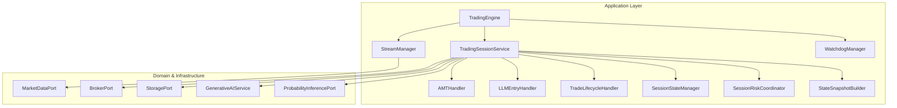
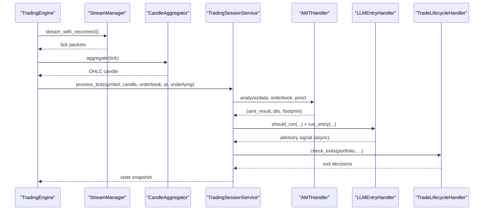
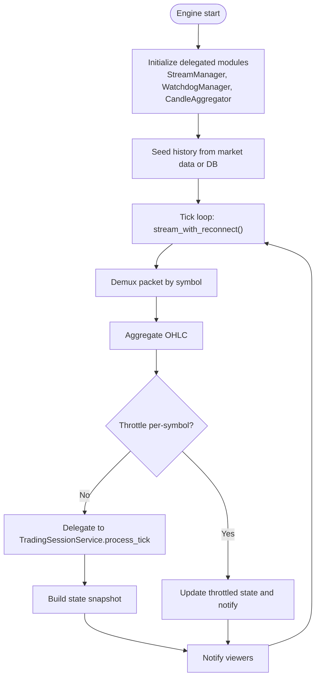
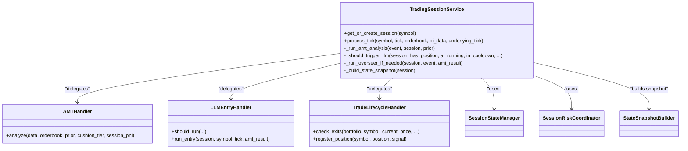
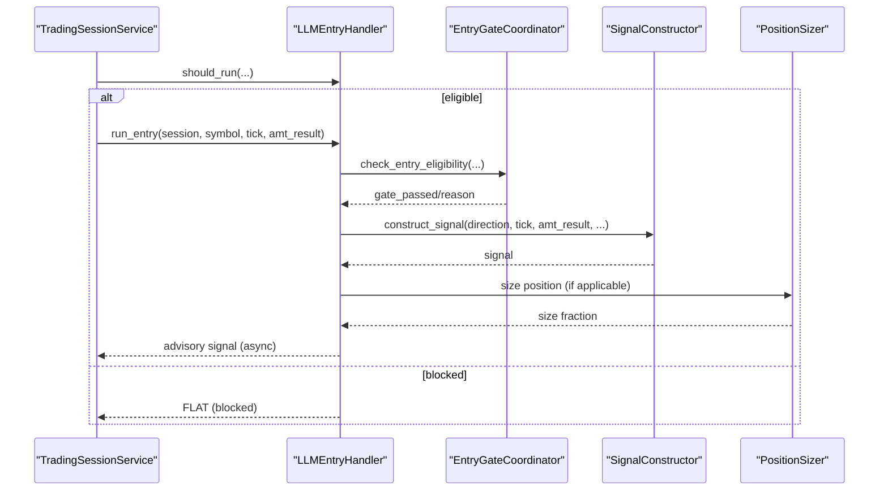
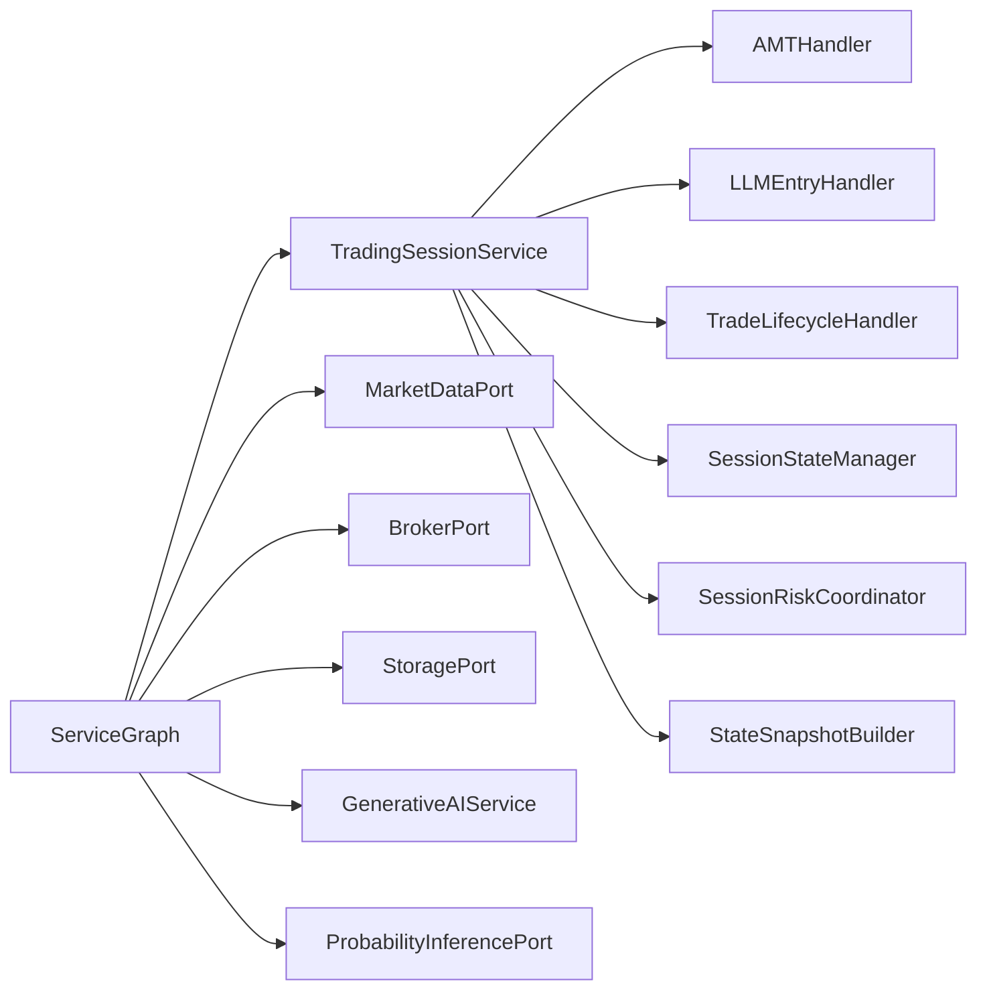

# Application Layer

<cite>
**Referenced Files in This Document**
- [engine.py](file://backend/app/application/engine.py)
- [stream_manager.py](file://backend/app/application/stream_manager.py)
- [watchdog_manager.py](file://backend/app/application/watchdog_manager.py)
- [trading_session.py](file://backend/app/application/services/trading_session.py)
- [amt_handler.py](file://backend/app/application/handlers/amt_handler.py)
- [llm_entry_handler.py](file://backend/app/application/handlers/llm_entry_handler.py)
- [trade_lifecycle_handler.py](file://backend/app/application/handlers/trade_lifecycle_handler.py)
- [session_state_manager.py](file://backend/app/application/services/session_state_manager.py)
- [session_risk_coordinator.py](file://backend/app/application/services/session_risk_coordinator.py)
- [state_snapshot_builder.py](file://backend/app/application/services/state_snapshot_builder.py)
- [dependencies.py](file://backend/app/api/dependencies.py)
</cite>

## Table of Contents
1. [Introduction](#introduction)
2. [Project Structure](#project-structure)
3. [Core Components](#core-components)
4. [Architecture Overview](#architecture-overview)
5. [Detailed Component Analysis](#detailed-component-analysis)
6. [Dependency Analysis](#dependency-analysis)
7. [Performance Considerations](#performance-considerations)
8. [Troubleshooting Guide](#troubleshooting-guide)
9. [Conclusion](#conclusion)

## Introduction
This document describes the Application Layer with a focus on use case orchestration and handler implementations. It explains how TradingEngine acts as the root orchestrator, how TradingSessionService coordinates per-symbol use cases, and how specialized handlers (AMTHandler, LLMEntryHandler, TradeLifecycleHandler) collaborate to process market data, manage risk, and maintain portfolio state. It also documents the service graph dependency injection pattern, handler delegation patterns, event-driven coordination, and the supporting services for session management, risk coordination, portfolio management, and persistence. Real-time data processing is handled by StreamManager, and system health monitoring is coordinated by WatchdogManager.

## Project Structure
The Application Layer is organized around:
- Root orchestrator: TradingEngine
- Per-symbol coordinator: TradingSessionService
- Specialized handlers: AMTHandler, LLMEntryHandler, TradeLifecycleHandler
- Supporting services: SessionStateManager, SessionRiskCoordinator, StateSnapshotBuilder
- Infrastructure for streaming and monitoring: StreamManager, WatchdogManager
- Dependency injection: ServiceGraph wiring

**Diagram sources**
- [engine.py:59-126](file://backend/app/application/engine.py#L59-L126)
- [trading_session.py:85-229](file://backend/app/application/services/trading_session.py#L85-L229)
- [stream_manager.py:32-47](file://backend/app/application/stream_manager.py#L32-L47)
- [watchdog_manager.py:34-46](file://backend/app/application/watchdog_manager.py#L34-L46)
- [dependencies.py:43-163](file://backend/app/api/dependencies.py#L43-L163)

**Section sources**
- [engine.py:59-126](file://backend/app/application/engine.py#L59-L126)
- [trading_session.py:85-229](file://backend/app/application/services/trading_session.py#L85-L229)
- [stream_manager.py:32-47](file://backend/app/application/stream_manager.py#L32-L47)
- [watchdog_manager.py:34-46](file://backend/app/application/watchdog_manager.py#L34-L46)
- [dependencies.py:43-163](file://backend/app/api/dependencies.py#L43-L163)

## Core Components
- TradingEngine: Standalone engine that streams market data, aggregates candles, and orchestrates per-symbol processing. It delegates to StreamManager, CandleAggregator, RangeBarBuilder, and WatchdogManager. It exposes read-only state for WebSocket clients and supports immediate state updates triggered from background threads.
- TradingSessionService: Thin coordinator that manages per-symbol state, wires event subscriptions, and delegates to specialized handlers. It integrates AMT analysis, LLM entry decisions, trade lifecycle management, risk coordination, and event logging.
- StreamManager: Encapsulates market data streaming with reconnection logic, dual-stream depth merging, and polling fallback for symbols without WebSocket delivery.
- WatchdogManager: Independent watchdogs for SL/TP enforcement and stream health monitoring, including stale stream detection and periodic garbage collection.
- AMTHandler: Performs AMT analysis and footprint generation per tick, with incremental volume profile maintenance and caching.
- LLMEntryHandler: Coordinates LLM inference with gate checking, signal construction, and position sizing. It runs LLM analysis in dedicated worker threads per symbol and enforces throttling and safety nets.
- TradeLifecycleHandler: Deterministic position management via TradeManager and PartitionExitManager, including SL/TP trails, CVD-based exits, spread blowout checks, and scale-in triggers.
- SessionStateManager: Manages per-symbol session state, persistence, cleanup, and runtime QA telemetry (playbook guard and explainability).
- SessionRiskCoordinator: Coordinates session-level risk management, including risk tier engines, session risk manager, and system-wide risk aggregation.
- StateSnapshotBuilder: Pure DTO formatter that builds UI-ready state snapshots from session state, risk coordinator, and RL handler.

**Section sources**
- [engine.py:59-126](file://backend/app/application/engine.py#L59-L126)
- [trading_session.py:85-229](file://backend/app/application/services/trading_session.py#L85-L229)
- [stream_manager.py:32-47](file://backend/app/application/stream_manager.py#L32-L47)
- [watchdog_manager.py:34-46](file://backend/app/application/watchdog_manager.py#L34-L46)
- [amt_handler.py:45-66](file://backend/app/application/handlers/amt_handler.py#L45-L66)
- [llm_entry_handler.py:61-95](file://backend/app/application/handlers/llm_entry_handler.py#L61-L95)
- [trade_lifecycle_handler.py:22-41](file://backend/app/application/handlers/trade_lifecycle_handler.py#L22-L41)
- [session_state_manager.py:100-166](file://backend/app/application/services/session_state_manager.py#L100-L166)
- [session_risk_coordinator.py:43-71](file://backend/app/application/services/session_risk_coordinator.py#L43-L71)
- [state_snapshot_builder.py:22-72](file://backend/app/application/services/state_snapshot_builder.py#L22-L72)

## Architecture Overview
The Application Layer follows an event-driven, handler-delegated architecture:
- TradingEngine drives the tick loop, streams data, aggregates candles, and delegates to TradingSessionService per symbol.
- TradingSessionService orchestrates AMT analysis, LLM entry decisions, and trade lifecycle management.
- Handlers remain stateless or minimally stateful and delegate to domain services and infrastructure adapters.
- SessionStateManager and SessionRiskCoordinator provide per-symbol state and risk controls.
- StreamManager and WatchdogManager provide infrastructure-level resiliency and monitoring.

**Diagram sources**
- [engine.py:620-800](file://backend/app/application/engine.py#L620-L800)
- [trading_session.py:233-417](file://backend/app/application/services/trading_session.py#L233-L417)
- [amt_handler.py:89-181](file://backend/app/application/handlers/amt_handler.py#L89-L181)
- [llm_entry_handler.py:330-378](file://backend/app/application/handlers/llm_entry_handler.py#L330-L378)
- [trade_lifecycle_handler.py:47-268](file://backend/app/application/handlers/trade_lifecycle_handler.py#L47-L268)

## Detailed Component Analysis

### TradingEngine
- Responsibilities:
  - Start/stop lifecycle with graceful shutdown
  - Stream market data via StreamManager with reconnection
  - Aggregate candles and throttle processing
  - Dual-feed AMT using underlying futures
  - Build and expose state snapshots for WebSocket clients
  - Trigger immediate state updates from background threads
  - Recover open positions on startup and seed history
- Key behaviors:
  - Initializes delegated modules and sets running state
  - Maintains per-symbol latest state, locks, and generation counter
  - Uses circuit breaker to protect against repeated failures
  - Integrates RangeBarBuilder and underlying futures aggregator
  - Coordinates watchdog tasks for SL/TP and stream health

**Diagram sources**
- [engine.py:131-208](file://backend/app/application/engine.py#L131-L208)
- [engine.py:372-426](file://backend/app/application/engine.py#L372-L426)
- [engine.py:620-800](file://backend/app/application/engine.py#L620-L800)

**Section sources**
- [engine.py:59-126](file://backend/app/application/engine.py#L59-L126)
- [engine.py:131-208](file://backend/app/application/engine.py#L131-L208)
- [engine.py:372-426](file://backend/app/application/engine.py#L372-L426)
- [engine.py:620-800](file://backend/app/application/engine.py#L620-L800)

### TradingSessionService
- Responsibilities:
  - Per-symbol state management via SessionStateManager
  - Orchestrates AMT analysis, LLM entry decisions, and trade lifecycle
  - Integrates risk coordination and event logging
  - Coordinates entry and exit logic via EntryCoordinator and ExitCoordinator
  - Builds state snapshots for UI consumption
- Orchestration highlights:
  - Processes ticks under session lock, persists closed candles, and updates portfolio
  - Executes pending signals from LLM worker threads on the main thread
  - Calls AMTHandler for context analysis and footprint generation
  - Delegates entry gating and signal construction to LLMEntryHandler
  - Manages exits via TradeLifecycleHandler and records trade results

**Diagram sources**
- [trading_session.py:85-229](file://backend/app/application/services/trading_session.py#L85-L229)
- [amt_handler.py:45-66](file://backend/app/application/handlers/amt_handler.py#L45-L66)
- [llm_entry_handler.py:61-95](file://backend/app/application/handlers/llm_entry_handler.py#L61-L95)
- [trade_lifecycle_handler.py:22-41](file://backend/app/application/handlers/trade_lifecycle_handler.py#L22-L41)
- [session_state_manager.py:100-166](file://backend/app/application/services/session_state_manager.py#L100-L166)
- [state_snapshot_builder.py:22-72](file://backend/app/application/services/state_snapshot_builder.py#L22-L72)

**Section sources**
- [trading_session.py:233-417](file://backend/app/application/services/trading_session.py#L233-L417)
- [trading_session.py:656-707](file://backend/app/application/services/trading_session.py#L656-L707)
- [trading_session.py:761-786](file://backend/app/application/services/trading_session.py#L761-L786)
- [trading_session.py:787-807](file://backend/app/application/services/trading_session.py#L787-L807)

### AMTHandler
- Responsibilities:
  - Incremental volume profile maintenance with configurable lookbacks
  - AMT analysis and footprint generation per tick
  - Caching of profile arrays to avoid unnecessary recomputation
  - Session-only filtering for options to reduce theta decay artifacts
- Implementation notes:
  - Converts Decimal-based OHLC to float-based for speed
  - Resets profiles on trading day boundary
  - Updates incremental profiles on new candles and caches profiles on new candle arrival

**Section sources**
- [amt_handler.py:45-66](file://backend/app/application/handlers/amt_handler.py#L45-L66)
- [amt_handler.py:89-181](file://backend/app/application/handlers/amt_handler.py#L89-L181)

### LLMEntryHandler
- Responsibilities:
  - LLM inference coordination with gate checking, signal construction, and position sizing
  - Per-symbol throttling and safety nets (buy-only mode, VWAP extreme checks)
  - Asynchronous worker threads per symbol with bounded queues
  - Integration with RegimeDetector, EntryGateCoordinator, SignalConstructor, PositionSizer
- Key behaviors:
  - should_run() enforces session gates, cooldowns, and readiness
  - run_entry() builds session context, checks gates, constructs advisory signals
  - Worker loop processes queued items sequentially per symbol

**Diagram sources**
- [llm_entry_handler.py:330-378](file://backend/app/application/handlers/llm_entry_handler.py#L330-L378)
- [llm_entry_handler.py:379-800](file://backend/app/application/handlers/llm_entry_handler.py#L379-L800)

**Section sources**
- [llm_entry_handler.py:61-95](file://backend/app/application/handlers/llm_entry_handler.py#L61-L95)
- [llm_entry_handler.py:330-378](file://backend/app/application/handlers/llm_entry_handler.py#L330-L378)
- [llm_entry_handler.py:379-800](file://backend/app/application/handlers/llm_entry_handler.py#L379-L800)

### TradeLifecycleHandler
- Responsibilities:
  - Deterministic position management via TradeManager and PartitionExitManager
  - Exit triggers: SL/TP, CVD kill signals, VWAP trails, imbalances, time-based closes
  - Spread blowout checks, scale-in triggers, and partition-based exits
  - Registration and reconciliation of positions across lifecycle and portfolio
- Integration:
  - Works with Portfolio.process_tick outcomes and TradeManager APIs
  - Adjusts stop loss dynamically and records realized PnL for risk systems

**Section sources**
- [trade_lifecycle_handler.py:22-41](file://backend/app/application/handlers/trade_lifecycle_handler.py#L22-L41)
- [trade_lifecycle_handler.py:47-268](file://backend/app/application/handlers/trade_lifecycle_handler.py#L47-L268)
- [trade_lifecycle_handler.py:270-320](file://backend/app/application/handlers/trade_lifecycle_handler.py#L270-L320)

### SessionStateManager
- Responsibilities:
  - Per-symbol session creation, retrieval, and eviction
  - Persistence of prior session profiles and structural level persistence
  - Runtime QA telemetry: playbook guard and explainability monitors
  - Threading safety for portfolio reads/writes and throttling flags
- Highlights:
  - Session eviction on idle thresholds
  - Day-bound reset of QA state
  - Prior profile loading for gap analysis

**Section sources**
- [session_state_manager.py:100-166](file://backend/app/application/services/session_state_manager.py#L100-L166)
- [session_state_manager.py:168-186](file://backend/app/application/services/session_state_manager.py#L168-L186)
- [session_state_manager.py:338-364](file://backend/app/application/services/session_state_manager.py#L338-L364)

### SessionRiskCoordinator
- Responsibilities:
  - Session-level risk management with per-symbol RiskManager and SessionRiskManager
  - Risk tier engine integration (optional) for dynamic tiering
  - System-wide risk aggregation for control-plane visibility
  - Entry validation across multiple guards: confluence grade, session circuit breaker, daily loss limits, and standard risk controls
- Integration:
  - Persists risk state to storage for continuity across restarts
  - Provides system risk state for emergency halts and monitoring

**Section sources**
- [session_risk_coordinator.py:43-71](file://backend/app/application/services/session_risk_coordinator.py#L43-L71)
- [session_risk_coordinator.py:169-211](file://backend/app/application/services/session_risk_coordinator.py#L169-L211)
- [session_risk_coordinator.py:254-314](file://backend/app/application/services/session_risk_coordinator.py#L254-L314)

### StateSnapshotBuilder
- Responsibilities:
  - Pure DTO formatting for UI dashboards
  - Aggregates portfolio, AMT, prediction, footprint, AI analysis, agent decision, risk state, and explainability metrics
- Integration:
  - Consumed by TradingEngine and UI to render state

**Section sources**
- [state_snapshot_builder.py:22-72](file://backend/app/application/services/state_snapshot_builder.py#L22-L72)
- [state_snapshot_builder.py:75-103](file://backend/app/application/services/state_snapshot_builder.py#L75-L103)
- [state_snapshot_builder.py:120-175](file://backend/app/application/services/state_snapshot_builder.py#L120-L175)

### StreamManager
- Responsibilities:
  - Market data streaming with reconnection and fallback
  - Dual-stream depth merging and polling fallback for MCX options
  - Staleness tracking and switching to polling mode when WS fails to deliver ticks
- Integration:
  - Used by TradingEngine and WatchdogManager

**Section sources**
- [stream_manager.py:32-47](file://backend/app/application/stream_manager.py#L32-L47)
- [stream_manager.py:135-294](file://backend/app/application/stream_manager.py#L135-L294)

### WatchdogManager
- Responsibilities:
  - Independent SL/TP watchdog loop using cached LTP
  - Stale stream detection and forced reconnect or polling fallback
  - Periodic garbage collection to prevent memory leaks
- Integration:
  - Operates independently of the tick loop and uses cached state for SL/TP checks

**Section sources**
- [watchdog_manager.py:34-46](file://backend/app/application/watchdog_manager.py#L34-L46)
- [watchdog_manager.py:63-128](file://backend/app/application/watchdog_manager.py#L63-L128)
- [watchdog_manager.py:130-175](file://backend/app/application/watchdog_manager.py#L130-L175)
- [watchdog_manager.py:177-198](file://backend/app/application/watchdog_manager.py#L177-L198)

### Dependency Injection Pattern (ServiceGraph)
- Wiring:
  - ServiceGraph creates and holds singleton instances for market data, broker, LLM inference, generative AI service, storage, probability engine, and others
  - TradingSessionService is constructed with injected dependencies (broker, gen_ai_service, storage, probability_engine, exchange_config, allow_short)
  - Active symbols are auto-selected and passed to TradingEngine and StreamManager
- Benefits:
  - Single source of truth for dependencies
  - Testable composition via dependency helpers
  - Exchange abstraction via ExchangeStrategy and SessionContextFactory

**Section sources**
- [dependencies.py:43-163](file://backend/app/api/dependencies.py#L43-L163)
- [dependencies.py:324-384](file://backend/app/api/dependencies.py#L324-L384)

## Dependency Analysis
- Coupling:
  - TradingEngine depends on StreamManager, WatchdogManager, and TradingSessionService
  - TradingSessionService depends on AMTHandler, LLMEntryHandler, TradeLifecycleHandler, SessionStateManager, SessionRiskCoordinator, and StateSnapshotBuilder
  - Handlers depend on domain services and infrastructure adapters (e.g., GenerativeAIService, ProbabilityInferencePort)
- Cohesion:
  - Each handler focuses on a single responsibility (AMT, LLM entry, lifecycle)
  - SessionStateManager and SessionRiskCoordinator encapsulate related concerns
- External dependencies:
  - MarketDataPort, BrokerPort, StoragePort, LLMInferencePort, ProbabilityInferencePort
- Potential circular dependencies:
  - None observed among core components; handlers are consumers of services rather than providers

**Diagram sources**
- [dependencies.py:43-163](file://backend/app/api/dependencies.py#L43-L163)
- [trading_session.py:85-229](file://backend/app/application/services/trading_session.py#L85-L229)

**Section sources**
- [dependencies.py:43-163](file://backend/app/api/dependencies.py#L43-L163)
- [trading_session.py:85-229](file://backend/app/application/services/trading_session.py#L85-L229)

## Performance Considerations
- Throttling and batching:
  - TradingEngine throttles process_tick to once per 500ms per symbol
  - LLMEntryHandler uses bounded queues per symbol to prevent overload
- Incremental computation:
  - AMTHandler maintains incremental profiles and caches DTOs to minimize recomputation
- Memory management:
  - WatchdogManager runs periodic garbage collection
  - SessionStateManager evicts idle sessions to bound memory
- Streaming resilience:
  - StreamManager switches to polling fallback when WS fails to deliver ticks
- Parallelism:
  - Dedicated worker threads per symbol for LLM inference
  - ThreadPoolExecutors for inference and prediction workloads

[No sources needed since this section provides general guidance]

## Troubleshooting Guide
- Market data connectivity:
  - Verify StreamManager staleness and polling fallback behavior
  - Check WatchdogManager stale-stream watchdog logs for reconnection attempts
- LLM inference issues:
  - Review LLMEntryHandler throttling and queue capacity
  - Inspect safety nets and gate rejections recorded in the journal
- Position lifecycle:
  - Confirm TradeLifecycleHandler exit triggers and partition state transitions
  - Validate position consistency and reconciliation logs
- Risk halts:
  - Check SessionRiskCoordinator system risk state and halt reasons
- State snapshots:
  - Ensure StateSnapshotBuilder includes expected fields and DTO conversions

**Section sources**
- [stream_manager.py:120-129](file://backend/app/application/stream_manager.py#L120-L129)
- [watchdog_manager.py:130-175](file://backend/app/application/watchdog_manager.py#L130-L175)
- [llm_entry_handler.py:145-150](file://backend/app/application/handlers/llm_entry_handler.py#L145-L150)
- [trade_lifecycle_handler.py:66-77](file://backend/app/application/handlers/trade_lifecycle_handler.py#L66-L77)
- [session_risk_coordinator.py:254-314](file://backend/app/application/services/session_risk_coordinator.py#L254-L314)
- [state_snapshot_builder.py:22-72](file://backend/app/application/services/state_snapshot_builder.py#L22-L72)

## Conclusion
The Application Layer orchestrates trading logic through a clean separation of concerns:
- TradingEngine provides the runtime backbone for streaming, processing, and state exposure
- TradingSessionService coordinates specialized handlers and per-symbol state
- Handlers encapsulate distinct responsibilities (AMT, LLM entry, lifecycle) with clear delegation patterns
- Supporting services manage session state, risk, and persistence
- StreamManager and WatchdogManager ensure resilient, real-time operation

This design enables scalability, maintainability, and observability while keeping domain logic in the Domain Layer and avoiding business rules in the Application Layer.