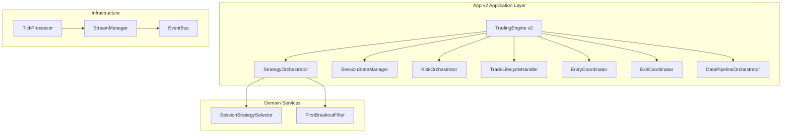
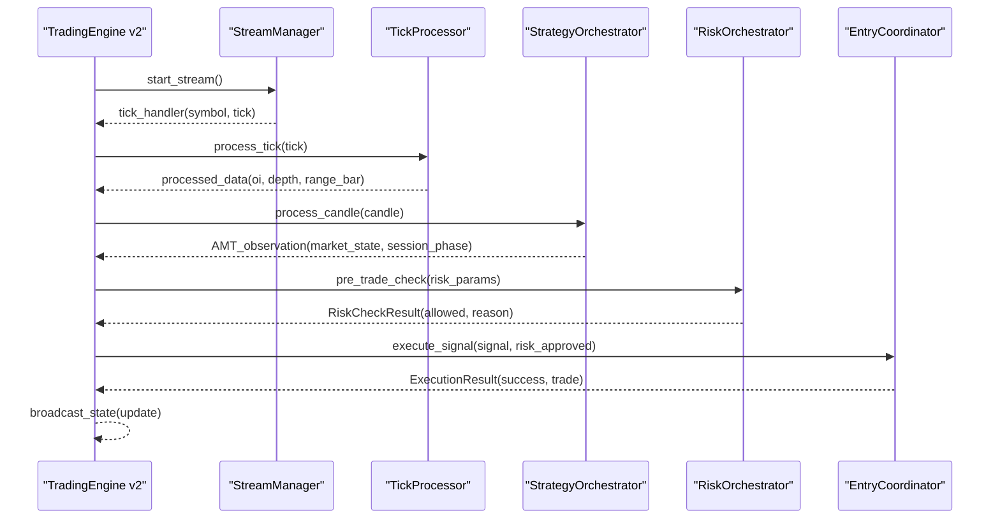
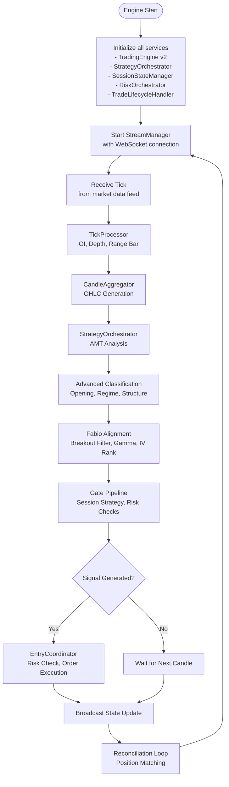
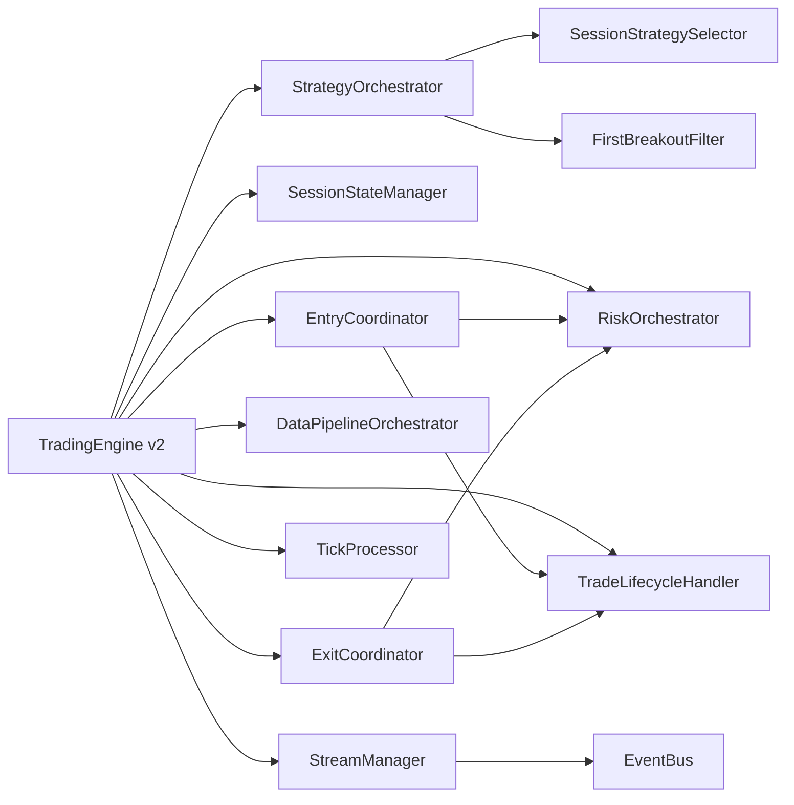

# Application Layer

<cite>
**Referenced Files in This Document**
- [main.py](file://appv2/backend/appv2/main.py)
- [trading_engine.py](file://appv2/backend/appv2/application/trading_engine.py)
- [strategy_orchestrator.py](file://appv2/backend/appv2/application/strategy_orchestrator.py)
- [session_state_manager.py](file://appv2/backend/appv2/application/session_state_manager.py)
- [risk_orchestrator.py](file://appv2/backend/appv2/application/risk_orchestrator.py)
- [trade_lifecycle.py](file://appv2/backend/appv2/application/trade_lifecycle.py)
- [entry_coordinator.py](file://appv2/backend/appv2/application/entry_coordinator.py)
- [exit_coordinator.py](file://appv2/backend/appv2/application/exit_coordinator.py)
- [data_pipeline.py](file://appv2/backend/appv2/application/data_pipeline.py)
- [stream_manager.py](file://appv2/backend/appv2/infrastructure/stream_manager.py)
- [tick_processor.py](file://appv2/backend/appv2/infrastructure/tick_processor.py)
- [event_bus.py](file://appv2/backend/appv2/infrastructure/event_bus.py)
- [session_strategy_selector.py](file://appv2/backend/appv2/domain/services/session_strategy_selector.py)
- [first_breakout_filter.py](file://appv2/backend/appv2/domain/services/first_breakout_filter.py)
</cite>

## Update Summary
**Changes Made**
- Added comprehensive documentation for TradingEngine v2 with all new application services
- Documented session management, risk orchestration, and strategy coordination services
- Updated architecture diagrams to reflect the new appv2 structure
- Added detailed coverage of new domain services and infrastructure components
- Enhanced handler delegation patterns and event-driven coordination documentation

## Table of Contents
1. [Introduction](#introduction)
2. [Project Structure](#project-structure)
3. [Core Components](#core-components)
4. [Architecture Overview](#architecture-overview)
5. [Detailed Component Analysis](#detailed-component-analysis)
6. [Dependency Analysis](#dependency-analysis)
7. [Performance Considerations](#performance-considerations)
8. [Troubleshooting Guide](#troubleshooting-guide)
9. [Conclusion](#conclusion)

## Introduction
This document describes the Application Layer with a focus on use case orchestration and handler implementations for the new appv2 trading system. It explains how TradingEngine v2 acts as the root orchestrator, coordinating per-symbol strategy orchestration, session management, risk coordination, and comprehensive trade lifecycle management. The system integrates advanced AMT analysis, Fabio's alignment services, and sophisticated risk management capabilities. It documents the service graph dependency injection pattern, handler delegation patterns, event-driven coordination, and the supporting services for real-time data processing and system monitoring.

## Project Structure
The Application Layer is organized around TradingEngine v2 as the central orchestrator, with specialized application services handling different aspects of trading:

- **Root orchestrator**: TradingEngine v2 with comprehensive feature set
- **Strategy orchestration**: StrategyOrchestrator for per-symbol AMT analysis and signal generation
- **Session management**: SessionStateManager for persistent per-symbol state
- **Risk coordination**: RiskOrchestrator for comprehensive risk management
- **Trade lifecycle**: TradeLifecycleHandler for position management
- **Entry/exit coordination**: EntryCoordinator and ExitCoordinator for order execution
- **Data pipeline**: DataPipelineOrchestrator for tick-to-candle processing
- **Infrastructure**: StreamManager, TickProcessor, and EventBus for real-time processing

**Diagram sources**
- [trading_engine.py:77-180](file://appv2/backend/appv2/application/trading_engine.py#L77-L180)
- [strategy_orchestrator.py:54-74](file://appv2/backend/appv2/application/strategy_orchestrator.py#L54-L74)
- [session_state_manager.py:87-105](file://appv2/backend/appv2/application/session_state_manager.py#L87-L105)
- [risk_orchestrator.py:35-55](file://appv2/backend/appv2/application/risk_orchestrator.py#L35-L55)
- [trade_lifecycle.py:22-28](file://appv2/backend/appv2/application/trade_lifecycle.py#L22-L28)
- [entry_coordinator.py:33-50](file://appv2/backend/appv2/application/entry_coordinator.py#L33-L50)
- [exit_coordinator.py:23-40](file://appv2/backend/appv2/application/exit_coordinator.py#L23-L40)
- [data_pipeline.py:40-66](file://appv2/backend/appv2/application/data_pipeline.py#L40-L66)
- [stream_manager.py:33-73](file://appv2/backend/appv2/infrastructure/stream_manager.py#L33-L73)
- [tick_processor.py:52-65](file://appv2/backend/appv2/infrastructure/tick_processor.py#L52-L65)
- [event_bus.py:96-118](file://appv2/backend/appv2/infrastructure/event_bus.py#L96-L118)
- [session_strategy_selector.py:125-159](file://appv2/backend/appv2/domain/services/session_strategy_selector.py#L125-L159)
- [first_breakout_filter.py:37-60](file://appv2/backend/appv2/domain/services/first_breakout_filter.py#L37-L60)

**Section sources**
- [trading_engine.py:77-180](file://appv2/backend/appv2/application/trading_engine.py#L77-L180)
- [strategy_orchestrator.py:54-74](file://appv2/backend/appv2/application/strategy_orchestrator.py#L54-L74)
- [session_state_manager.py:87-105](file://appv2/backend/appv2/application/session_state_manager.py#L87-L105)
- [risk_orchestrator.py:35-55](file://appv2/backend/appv2/application/risk_orchestrator.py#L35-L55)
- [trade_lifecycle.py:22-28](file://appv2/backend/appv2/application/trade_lifecycle.py#L22-L28)
- [entry_coordinator.py:33-50](file://appv2/backend/appv2/application/entry_coordinator.py#L33-L50)
- [exit_coordinator.py:23-40](file://appv2/backend/appv2/application/exit_coordinator.py#L23-L40)
- [data_pipeline.py:40-66](file://appv2/backend/appv2/application/data_pipeline.py#L40-L66)
- [stream_manager.py:33-73](file://appv2/backend/appv2/infrastructure/stream_manager.py#L33-L73)
- [tick_processor.py:52-65](file://appv2/backend/appv2/infrastructure/tick_processor.py#L52-L65)
- [event_bus.py:96-118](file://appv2/backend/appv2/infrastructure/event_bus.py#L96-L118)
- [session_strategy_selector.py:125-159](file://appv2/backend/appv2/domain/services/session_strategy_selector.py#L125-L159)
- [first_breakout_filter.py:37-60](file://appv2/backend/appv2/domain/services/first_breakout_filter.py#L37-L60)

## Core Components

### TradingEngine v2
**Updated** Enhanced with comprehensive feature set including throttle mechanism, footprint accumulator, opening classifier, regime detector, market structure classifier, structural stop engine, partition exit manager, drive decay tracker, latency tracker, gate rejection tracker, playbook guard, session risk tiers, capital ladder, session cache, volatility features, state snapshot builder, and advanced LLM adapters.

- **Responsibilities**:
  - Complete live trading engine with ALL features from original backend
  - Manages per-symbol orchestrators, candle aggregators, and tick processors
  - Coordinates advanced AMT classification and Fabio-alignment services
  - Handles cross-index correlation tracking and gamma acceleration detection
  - Implements high-frequency tick processing with 500ms throttle
  - Provides comprehensive state broadcasting and alerting system

- **Key Features**:
  - Advanced AMT classification with opening classifier, regime detector, and market structure classifier
  - Fabio-alignment services including first breakout filter, IV rank tracker, and gamma acceleration detector
  - Comprehensive risk management with session risk tiers and capital ladder
  - Advanced LLM adapters (MLX decider and overseer) for entry decision making
  - Real-time cross-index correlation tracking
  - Enhanced latency tracking and gate rejection monitoring

**Section sources**
- [trading_engine.py:77-180](file://appv2/backend/appv2/application/trading_engine.py#L77-L180)
- [trading_engine.py:186-218](file://appv2/backend/appv2/application/trading_engine.py#L186-L218)
- [trading_engine.py:219-427](file://appv2/backend/appv2/application/trading_engine.py#L219-L427)
- [trading_engine.py:428-518](file://appv2/backend/appv2/application/trading_engine.py#L428-L518)

### StrategyOrchestrator
- **Responsibilities**:
  - Per-symbol strategy orchestration combining AMT analysis with state machine evaluation
  - Manages incremental volume profile, VWAP calculator, and CVD tracker
  - Implements persistent aggression scoring and auction state machine
  - Coordinates gate pipeline execution and signal generation
  - Provides comprehensive market state evaluation and session phase context

- **Key Behaviors**:
  - Processes candles through volume profile, VWAP, and CVD computations
  - Evaluates auction state machine with displacement and acceptance checks
  - Computes aggression scores based on footprint confirmation and CVD slope
  - Generates comprehensive AMT observations with market state and session phase

**Section sources**
- [strategy_orchestrator.py:54-74](file://appv2/backend/appv2/application/strategy_orchestrator.py#L54-L74)
- [strategy_orchestrator.py:75-136](file://appv2/backend/appv2/application/strategy_orchestrator.py#L75-L136)
- [strategy_orchestrator.py:138-162](file://appv2/backend/appv2/application/strategy_orchestrator.py#L138-L162)
- [strategy_orchestrator.py:164-193](file://appv2/backend/appv2/application/strategy_orchestrator.py#L164-L193)

### SessionStateManager
- **Responsibilities**:
  - Manages per-symbol session state with JSON serialization
  - Maintains bounded candle history (2000 candles maximum)
  - Handles pending signals, executed signal IDs, and position state
  - Provides persistence and restoration capabilities via storage interface
  - Supports daily PnL tracking and trade count management

- **Key Features**:
  - Bounded state management with automatic pruning
  - JSON-serializable state for persistence
  - Daily reset functionality and last reset date tracking
  - Executed signal ID tracking with 100-item limit

**Section sources**
- [session_state_manager.py:87-105](file://appv2/backend/appv2/application/session_state_manager.py#L87-L105)
- [session_state_manager.py:110-121](file://appv2/backend/appv2/application/session_state_manager.py#L110-L121)
- [session_state_manager.py:122-154](file://appv2/backend/appv2/application/session_state_manager.py#L122-L154)

### RiskOrchestrator
- **Responsibilities**:
  - Comprehensive pre-trade risk checks including daily loss limits and circuit breakers
  - Position sizing validation and exposure limit management
  - Post-trade PnL recording and consecutive loss tracking
  - Dynamic position count management and daily reset capabilities

- **Key Features**:
  - Daily loss tracker with configurable limits
  - Circuit breaker system with configurable cooldown periods
  - Position counter per symbol with configurable maximums
  - Risk check result dataclass for standardized responses

**Section sources**
- [risk_orchestrator.py:35-55](file://appv2/backend/appv2/application/risk_orchestrator.py#L35-L55)
- [risk_orchestrator.py:56-105](file://appv2/backend/appv2/application/risk_orchestrator.py#L56-L105)
- [risk_orchestrator.py:107-141](file://appv2/backend/appv2/application/risk_orchestrator.py#L107-L141)

### TradeLifecycleHandler
- **Responsibilities**:
  - Full trade lifecycle management from signal to closure
  - Trade creation, modification, and closure with comprehensive cost accounting
  - Stop loss updates for trailing stops and position management
  - Historical trade tracking and PnL calculations

- **Key Features**:
  - UUID-based trade identification system
  - Comprehensive cost breakdown with brokerage, GST, and stamp duty tracking
  - Legacy cost field compatibility for backward compatibility
  - Real-time and net PnL calculations with detailed breakdowns

**Section sources**
- [trade_lifecycle.py:22-66](file://appv2/backend/appv2/application/trade_lifecycle.py#L22-L66)
- [trade_lifecycle.py:68-148](file://appv2/backend/appv2/application/trade_lifecycle.py#L68-L148)
- [trade_lifecycle.py:150-178](file://appv2/backend/appv2/application/trade_lifecycle.py#L150-L178)

### EntryCoordinator
- **Responsibilities**:
  - End-to-end entry pipeline from signal validation to order execution
  - Option chain enrichment and strike selection for options trading
  - Risk validation and position sizing calculations
  - Order routing and execution with both live and paper trading modes

- **Key Features**:
  - Signal TTL management to prevent duplicate executions
  - Automatic option chain fetching and strike selection
  - Comprehensive risk validation with detailed failure reasons
  - Order router integration for optimal order placement

**Section sources**
- [entry_coordinator.py:33-50](file://appv2/backend/appv2/application/entry_coordinator.py#L33-L50)
- [entry_coordinator.py:51-101](file://appv2/backend/appv2/application/entry_coordinator.py#L51-L101)
- [entry_coordinator.py:102-184](file://appv2/backend/appv2/application/entry_coordinator.py#L102-L184)

### ExitCoordinator
- **Responsibilities**:
  - Continuous monitoring of open positions for exit conditions
  - Trailing stop management and dynamic stop loss updates
  - Comprehensive exit execution with broker integration
  - Post-exit state updates and analytics recording

- **Key Features**:
  - Critical fix for broker exit failure handling to prevent state divergence
  - Trail engine integration for dynamic stop loss management
  - Partial exit support for scale-in trading strategies
  - Comprehensive exit analytics and journal logging

**Section sources**
- [exit_coordinator.py:23-40](file://appv2/backend/appv2/application/exit_coordinator.py#L23-L40)
- [exit_coordinator.py:41-92](file://appv2/backend/appv2/application/exit_coordinator.py#L41-L92)
- [exit_coordinator.py:94-151](file://appv2/backend/appv2/application/exit_coordinator.py#L94-L151)

### DataPipelineOrchestrator
- **Responsibilities**:
  - Multi-symbol, multi-timeframe data processing pipeline
  - Tick-to-candle aggregation with volume profile, VWAP, and CVD computations
  - Real-time AMT observation generation with comprehensive metrics
  - State serialization for broadcasting and monitoring

- **Key Features**:
  - Configurable candle intervals with default 60-second timeframe
  - Incremental volume profile with tie-breaking using VWAP
  - Comprehensive pipeline output with POC, VAH, VAL, and CVD metrics
  - State dictionary generation for external system integration

**Section sources**
- [data_pipeline.py:40-66](file://appv2/backend/appv2/application/data_pipeline.py#L40-L66)
- [data_pipeline.py:67-114](file://appv2/backend/appv2/application/data_pipeline.py#L67-L114)
- [data_pipeline.py:116-151](file://appv2/backend/appv2/application/data_pipeline.py#L116-L151)

### StreamManager
- **Responsibilities**:
  - WebSocket connection management with auto-reconnect and exponential backoff
  - Tick demultiplexing by symbol with health monitoring
  - Emergency pause/resume functionality for maintenance
  - Heartbeat monitoring to detect silent disconnections

- **Key Features**:
  - Heartbeat thresholds for warning (15s) and disconnect (30s) detection
  - Reconnect scheduling with progressive backoff up to 30 seconds
  - Health tracking with connection status, tick counts, and symbol subscription
  - Pause/resume capability without disconnecting WebSocket

**Section sources**
- [stream_manager.py:33-73](file://appv2/backend/appv2/infrastructure/stream_manager.py#L33-L73)
- [stream_manager.py:82-124](file://appv2/backend/appv2/infrastructure/stream_manager.py#L82-L124)
- [stream_manager.py:155-216](file://appv2/backend/appv2/infrastructure/stream_manager.py#L155-L216)
- [stream_manager.py:217-271](file://appv2/backend/appv2/infrastructure/stream_manager.py#L217-L271)

### TickProcessor
- **Responsibilities**:
  - Real-time tick processing for OI tracking, depth building, and range bar management
  - Open interest change calculation with percentage tracking
  - 5-level order book depth state maintenance
  - Range bar accumulation with configurable range thresholds

- **Key Features**:
  - OI state tracking with current, previous, and change metrics
  - Depth state with bid/ask prices, quantities, and spread calculations
  - Range bar management with completion detection and new bar initialization
  - Reset functionality for symbol-specific and global state clearing

**Section sources**
- [tick_processor.py:52-65](file://appv2/backend/appv2/infrastructure/tick_processor.py#L52-L65)
- [tick_processor.py:66-108](file://appv2/backend/appv2/infrastructure/tick_processor.py#L66-L108)
- [tick_processor.py:109-160](file://appv2/backend/appv2/infrastructure/tick_processor.py#L109-L160)

### EventBus
- **Responsibilities**:
  - Centralized event distribution system for all trading components
  - Type-safe event handling with subscription management
  - Sequence numbering for event ordering and debugging
  - Asynchronous event publishing with error isolation

- **Key Features**:
  - Comprehensive event type enumeration (Tick, Candle, OrderBook, Trade, Signal, Risk, System)
  - Decorator-based subscription system for clean event handler registration
  - Synchronous and asynchronous event publishing capabilities
  - Statistics tracking for event bus performance monitoring

**Section sources**
- [event_bus.py:96-118](file://appv2/backend/appv2/infrastructure/event_bus.py#L96-L118)
- [event_bus.py:119-141](file://appv2/backend/appv2/infrastructure/event_bus.py#L119-L141)
- [event_bus.py:151-187](file://appv2/backend/appv2/infrastructure/event_bus.py#L151-L187)
- [event_bus.py:188-217](file://appv2/backend/appv2/infrastructure/event_bus.py#L188-L217)

### SessionStrategySelector
- **Responsibilities**:
  - Session-specific strategy mode selection for different market phases
  - Exchange-specific configuration for NSE and MCX markets
  - Strategy mode determination based on time-based session phases
  - Trade eligibility validation with aggression score and R:R ratio checks

- **Key Features**:
  - Pre-configured strategy modes for all session phases (Opening, Primary, Midday, Power Hour, Close)
  - Exchange-specific configurations with MCX US session special handling
  - Strategy mode enumeration with TREND_FOLLOWING, MEAN_REVERSION, NO_TRADE, EXIT_ONLY, SELECTIVE
  - Trade eligibility validation with comprehensive failure reasons

**Section sources**
- [session_strategy_selector.py:125-159](file://appv2/backend/appv2/domain/services/session_strategy_selector.py#L125-L159)
- [session_strategy_selector.py:160-198](file://appv2/backend/appv2/domain/services/session_strategy_selector.py#L160-L198)

### FirstBreakoutFilter
- **Responsibilities**:
  - Advanced breakout confirmation filtering to avoid fake breakouts
  - Multi-stage breakout state management with confirmation tracking
  - Volume-based breakout validation with configurable multipliers
  - Mean reversion opportunity identification after failed breakouts

- **Key Features**:
  - Breakout state enumeration (NO_ATTEMPT, FIRST_ATTEMPT, FIRST_FAILED, CONFIRMED_BREAKOUT, RE_TESTING)
  - Confirmation bar counting with configurable thresholds
  - Volume multiplier validation for breakout authenticity
  - Failed breakout tracking for mean reversion setup identification

**Section sources**
- [first_breakout_filter.py:37-60](file://appv2/backend/appv2/domain/services/first_breakout_filter.py#L37-L60)
- [first_breakout_filter.py:61-167](file://appv2/backend/appv2/domain/services/first_breakout_filter.py#L61-L167)
- [first_breakout_filter.py:169-197](file://appv2/backend/appv2/domain/services/first_breakout_filter.py#L169-L197)

## Architecture Overview
The App v2 Application Layer follows a comprehensive, event-driven architecture with specialized orchestration services:

- **TradingEngine v2** serves as the central orchestrator, managing per-symbol strategy orchestration, session state management, and comprehensive risk coordination
- **StrategyOrchestrator** handles AMT analysis, state machine evaluation, and gate pipeline execution
- **SessionStateManager** provides persistent per-symbol state with JSON serialization and bounded storage
- **RiskOrchestrator** implements comprehensive pre-trade and post-trade risk management
- **TradeLifecycleHandler** manages complete trade lifecycle from creation to closure
- **EntryCoordinator** and **ExitCoordinator** handle order execution and position management
- **DataPipelineOrchestrator** processes ticks into comprehensive AMT observations
- **Infrastructure components** provide real-time data processing, tick handling, and event distribution

**Diagram sources**
- [trading_engine.py:489-518](file://appv2/backend/appv2/application/trading_engine.py#L489-L518)
- [stream_manager.py:155-168](file://appv2/backend/appv2/infrastructure/stream_manager.py#L155-L168)
- [tick_processor.py:66-108](file://appv2/backend/appv2/infrastructure/tick_processor.py#L66-L108)
- [strategy_orchestrator.py:75-136](file://appv2/backend/appv2/application/strategy_orchestrator.py#L75-L136)
- [risk_orchestrator.py:56-105](file://appv2/backend/appv2/application/risk_orchestrator.py#L56-L105)
- [entry_coordinator.py:51-101](file://appv2/backend/appv2/application/entry_coordinator.py#L51-L101)

## Detailed Component Analysis

### TradingEngine v2 Orchestration Flow
**Updated** Enhanced with comprehensive feature integration and advanced AMT classification pipeline.

The TradingEngine v2 orchestrates a sophisticated trading pipeline with advanced features:

1. **Real-time Tick Processing**: StreamManager receives WebSocket ticks and passes them to on_tick handler
2. **Tick Processing**: TickProcessor extracts OI, depth, and range bar data from raw ticks
3. **Candle Generation**: CandleAggregator converts ticks into OHLC candles for specified intervals
4. **AMT Analysis**: StrategyOrchestrator processes completed candles through volume profile, VWAP, and CVD computations
5. **Advanced Classification**: Opening classifier, regime detector, and market structure classifier provide additional context
6. **Fabio Alignment**: First breakout filter, IV rank tracker, and gamma acceleration detector apply advanced filters
7. **Gate Pipeline**: Session strategy selector and gate evaluation determine trade eligibility
8. **Signal Generation**: Validated signals are sent to entry coordinator for execution
9. **State Broadcasting**: Comprehensive state updates are broadcast to clients

**Diagram sources**
- [trading_engine.py:219-427](file://appv2/backend/appv2/application/trading_engine.py#L219-L427)
- [trading_engine.py:489-518](file://appv2/backend/appv2/application/trading_engine.py#L489-L518)
- [trading_engine.py:519-565](file://appv2/backend/appv2/application/trading_engine.py#L519-L565)

**Section sources**
- [trading_engine.py:77-180](file://appv2/backend/appv2/application/trading_engine.py#L77-L180)
- [trading_engine.py:186-218](file://appv2/backend/appv2/application/trading_engine.py#L186-L218)
- [trading_engine.py:219-427](file://appv2/backend/appv2/application/trading_engine.py#L219-L427)
- [trading_engine.py:428-518](file://appv2/backend/appv2/application/trading_engine.py#L428-L518)

### StrategyOrchestrator AMT Pipeline
The StrategyOrchestrator implements a comprehensive AMT analysis pipeline:

1. **Volume Profile Update**: Incremental volume profile computation with tick size consideration
2. **VWAP Calculation**: Volume-weighted average price with sigma calculation
3. **CVD Tracking**: Cumulative Volume Delta computation and slope analysis
4. **Market State Evaluation**: Auction state machine evaluation with displacement and acceptance checks
5. **Aggression Scoring**: Persistent aggression scorer based on footprint confirmation and CVD slope
6. **Session Context**: Session information extraction with exchange-specific considerations
7. **Observation Generation**: Comprehensive AMT observation with all computed metrics

**Section sources**
- [strategy_orchestrator.py:75-136](file://appv2/backend/appv2/application/strategy_orchestrator.py#L75-L136)
- [strategy_orchestrator.py:138-162](file://appv2/backend/appv2/application/strategy_orchestrator.py#L138-L162)
- [strategy_orchestrator.py:164-193](file://appv2/backend/appv2/application/strategy_orchestrator.py#L164-L193)

### SessionStateManager Persistence Model
**Updated** Enhanced with comprehensive state management and JSON serialization capabilities.

The SessionStateManager provides robust per-symbol state management:

- **SymbolSessionState Dataclass**: Serializable state container with comprehensive fields
- **Bounded Candle History**: Automatic pruning to maintain 2000 most recent candles
- **Pending Signal Management**: Structured pending signal storage with execution tracking
- **Position State Tracking**: Complete position state with daily PnL and trade count
- **Persistence Interface**: Async storage integration for state persistence and restoration
- **JSON Serialization**: Complete state serialization for external system integration

**Section sources**
- [session_state_manager.py:26-84](file://appv2/backend/appv2/application/session_state_manager.py#L26-L84)
- [session_state_manager.py:122-154](file://appv2/backend/appv2/application/session_state_manager.py#L122-L154)
- [session_state_manager.py:156-159](file://appv2/backend/appv2/application/session_state_manager.py#L156-L159)

### RiskOrchestrator Comprehensive Risk Management
**Updated** Enhanced with improved position management and daily reset capabilities.

The RiskOrchestrator implements multi-layered risk management:

1. **Daily Loss Tracking**: Configurable daily loss limits with halt functionality
2. **Circuit Breaker System**: Exchange-specific circuit breakers with configurable cooldown
3. **Position Limits**: Maximum positions per symbol with dynamic tracking
4. **Position Sizing**: Automated position size calculation based on capital and risk parameters
5. **Post-Trade Updates**: PnL recording, consecutive loss tracking, and position count management
6. **Session Reset**: Daily reset functionality for new trading day preparation

**Section sources**
- [risk_orchestrator.py:35-55](file://appv2/backend/appv2/application/risk_orchestrator.py#L35-L55)
- [risk_orchestrator.py:56-105](file://appv2/backend/appv2/application/risk_orchestrator.py#L56-L105)
- [risk_orchestrator.py:107-141](file://appv2/backend/appv2/application/risk_orchestrator.py#L107-L141)

### TradeLifecycleHandler Comprehensive Trade Management
**Updated** Enhanced with detailed cost accounting and legacy compatibility.

The TradeLifecycleHandler manages complete trade lifecycle with comprehensive features:

1. **Trade Creation**: UUID-based trade identification with comprehensive parameter capture
2. **Cost Accounting**: Detailed cost breakdown including brokerage, GST, stamp duty, and other fees
3. **Stop Loss Management**: Dynamic stop loss updates for trailing strategies
4. **Trade Closure**: Complete trade closure with PnL calculations and historical tracking
5. **Legacy Compatibility**: Backward compatibility with legacy commission and slippage fields
6. **Historical Tracking**: Comprehensive trade history with detailed analytics

**Section sources**
- [trade_lifecycle.py:22-66](file://appv2/backend/appv2/application/trade_lifecycle.py#L22-L66)
- [trade_lifecycle.py:68-148](file://appv2/backend/appv2/application/trade_lifecycle.py#L68-L148)
- [trade_lifecycle.py:150-178](file://appv2/backend/appv2/application/trade_lifecycle.py#L150-L178)

### EntryCoordinator Comprehensive Order Execution
**Updated** Enhanced with improved risk validation and order routing.

The EntryCoordinator implements end-to-end order execution:

1. **Signal Validation**: TTL checking and duplicate prevention
2. **Option Chain Enrichment**: Automatic strike selection for options trading
3. **Risk Validation**: Comprehensive pre-trade risk checks with detailed failure reasons
4. **Position Sizing**: Automated position calculation based on risk parameters
5. **Order Execution**: Both live and paper trading mode support
6. **State Management**: Trade creation and signal tracking integration

**Section sources**
- [entry_coordinator.py:51-101](file://appv2/backend/appv2/application/entry_coordinator.py#L51-L101)
- [entry_coordinator.py:102-184](file://appv2/backend/appv2/application/entry_coordinator.py#L102-L184)

### ExitCoordinator Advanced Position Management
**Updated** Enhanced with critical broker failure handling and partial exit support.

The ExitCoordinator provides sophisticated position management:

1. **Continuous Monitoring**: Real-time position monitoring with trailing stop updates
2. **Exit Decision Logic**: Comprehensive exit condition evaluation with multiple criteria
3. **Broker Integration**: Critical fix for broker failure handling to prevent state divergence
4. **Partial Exit Support**: Scale-in trading with partial position closures
5. **Analytics Integration**: Post-exit analytics and journal logging
6. **Risk Updates**: Post-exit risk state updates and position count management

**Section sources**
- [exit_coordinator.py:41-92](file://appv2/backend/appv2/application/exit_coordinator.py#L41-L92)
- [exit_coordinator.py:94-151](file://appv2/backend/appv2/application/exit_coordinator.py#L94-L151)

### DataPipelineOrchestrator Multi-Timeframe Processing
**Updated** Enhanced with comprehensive state serialization and multi-interval support.

The DataPipelineOrchestrator provides sophisticated data processing:

1. **Multi-Interval Support**: Configurable candle intervals with default 60-second timeframe
2. **Volume Profile Processing**: Incremental volume profile with VWAP tie-breaking
3. **VWAP Computation**: Volume-weighted average price with sigma calculation
4. **CVD Tracking**: Cumulative Volume Delta with slope analysis
5. **State Serialization**: Comprehensive state dictionary for external integration
6. **Pipeline Output**: Structured output with all computed metrics and candle data

**Section sources**
- [data_pipeline.py:67-114](file://appv2/backend/appv2/application/data_pipeline.py#L67-L114)
- [data_pipeline.py:116-151](file://appv2/backend/appv2/application/data_pipeline.py#L116-L151)

### StreamManager Robust Connection Management
**Updated** Enhanced with improved heartbeat monitoring and reconnect logic.

The StreamManager provides reliable market data connectivity:

1. **Auto-Reconnect**: Exponential backoff with progressive delay up to 30 seconds
2. **Heartbeat Monitoring**: Silent connection detection with configurable thresholds
3. **Health Tracking**: Comprehensive connection health metrics and statistics
4. **Emergency Controls**: Pause/resume functionality without disconnecting
5. **Symbol Management**: Dynamic subscription and unsubscription handling
6. **Error Isolation**: Robust error handling with graceful degradation

**Section sources**
- [stream_manager.py:82-124](file://appv2/backend/appv2/infrastructure/stream_manager.py#L82-L124)
- [stream_manager.py:155-216](file://appv2/backend/appv2/infrastructure/stream_manager.py#L155-L216)
- [stream_manager.py:217-271](file://appv2/backend/appv2/infrastructure/stream_manager.py#L217-L271)

### TickProcessor Real-Time Data Extraction
**Updated** Enhanced with comprehensive range bar management and state tracking.

The TickProcessor extracts meaningful market data from raw ticks:

1. **OI Tracking**: Current, previous, and change metrics with percentage calculations
2. **Depth Analysis**: Bid/ask prices, quantities, and spread computations
3. **Range Bar Management**: Configurable range thresholds with completion detection
4. **State Persistence**: Previous tick and OI state tracking for calculations
5. **Reset Functionality**: Symbol-specific and global state clearing capabilities

**Section sources**
- [tick_processor.py:66-108](file://appv2/backend/appv2/infrastructure/tick_processor.py#L66-L108)
- [tick_processor.py:109-160](file://appv2/backend/appv2/infrastructure/tick_processor.py#L109-L160)

### EventBus Centralized Communication
**Updated** Enhanced with comprehensive event type enumeration and subscription management.

The EventBus provides centralized communication for all system components:

1. **Event Types**: Comprehensive enumeration covering all trading event categories
2. **Subscription Management**: Decorator-based and programmatic subscription systems
3. **Sequence Numbering**: Event ordering and debugging capabilities
4. **Asynchronous Processing**: Non-blocking event publishing with error isolation
5. **Statistics Tracking**: Event bus performance monitoring and debugging
6. **Global Instance**: Single point of access for all event handling

**Section sources**
- [event_bus.py:119-141](file://appv2/backend/appv2/infrastructure/event_bus.py#L119-L141)
- [event_bus.py:151-187](file://appv2/backend/appv2/infrastructure/event_bus.py#L151-L187)
- [event_bus.py:188-217](file://appv2/backend/appv2/infrastructure/event_bus.py#L188-L217)

### SessionStrategySelector Time-Based Strategy Management
**Updated** Enhanced with comprehensive exchange-specific configurations and validation.

The SessionStrategySelector provides intelligent strategy mode selection:

1. **Session Phase Detection**: Automatic session phase recognition based on timestamps
2. **Exchange-Specific Configurations**: NSE and MCX market-specific strategy modes
3. **Strategy Mode Enumeration**: Comprehensive strategy mode definitions
4. **Trade Eligibility Validation**: Aggression score and R:R ratio validation
5. **Dynamic Configuration**: Pre-configured strategy modes for all market phases
6. **Failure Handling**: Graceful fallback to NO_TRADE mode for unknown phases

**Section sources**
- [session_strategy_selector.py:125-159](file://appv2/backend/appv2/domain/services/session_strategy_selector.py#L125-L159)
- [session_strategy_selector.py:160-198](file://appv2/backend/appv2/domain/services/session_strategy_selector.py#L160-L198)

### FirstBreakoutFilter Advanced Breakout Validation
**Updated** Enhanced with comprehensive breakout state management and confirmation tracking.

The FirstBreakoutFilter prevents fake breakout entries:

1. **Breakout State Management**: Comprehensive state tracking (NO_ATTEMPT, FIRST_ATTEMPT, FIRST_FAILED, CONFIRMED_BREAKOUT, RE_TESTING)
2. **Confirmation Logic**: Multi-bar confirmation with volume validation
3. **Failed Breakout Tracking**: Mean reversion opportunity identification
4. **Direction Tracking**: Up/down breakout direction management
5. **Session Reset**: State reset functionality for new trading sessions
6. **Validation Methods**: Convenience properties for state checking and level tracking

**Section sources**
- [first_breakout_filter.py:61-167](file://appv2/backend/appv2/domain/services/first_breakout_filter.py#L61-L167)
- [first_breakout_filter.py:169-197](file://appv2/backend/appv2/domain/services/first_breakout_filter.py#L169-L197)

## Dependency Analysis
**Updated** Enhanced with comprehensive service dependencies and integration patterns.

The App v2 Application Layer exhibits excellent dependency management:

- **TradingEngine v2 Dependencies**:
  - Core services: StrategyOrchestrator, SessionStateManager, RiskOrchestrator, TradeLifecycleHandler
  - Coordination services: EntryCoordinator, ExitCoordinator
  - Infrastructure: StreamManager, TickProcessor, GameStateBroadcaster
  - Advanced services: TickThrottle, FootprintAccumulator, OpeningClassifier, RegimeDetector

- **Service Integration Patterns**:
  - Per-symbol service instantiation with bounded state management
  - Cross-service communication through event bus and direct method calls
  - Dependency injection through constructor parameters and property accessors
  - Asynchronous processing with proper error handling and recovery

- **External Dependencies**:
  - Market data feeds via StreamManager and broker adapters
  - Storage interfaces for state persistence and restoration
  - LLM adapters for advanced entry decision making
  - Alert systems for trade notifications and risk monitoring

**Diagram sources**
- [trading_engine.py:94-134](file://appv2/backend/appv2/application/trading_engine.py#L94-L134)
- [strategy_orchestrator.py:57-74](file://appv2/backend/appv2/application/strategy_orchestrator.py#L57-L74)
- [entry_coordinator.py:36-49](file://appv2/backend/appv2/application/entry_coordinator.py#L36-L49)
- [exit_coordinator.py:26-39](file://appv2/backend/appv2/application/exit_coordinator.py#L26-L39)
- [stream_manager.py:47-52](file://appv2/backend/appv2/infrastructure/stream_manager.py#L47-L52)
- [event_bus.py:215-217](file://appv2/backend/appv2/infrastructure/event_bus.py#L215-L217)

**Section sources**
- [trading_engine.py:94-134](file://appv2/backend/appv2/application/trading_engine.py#L94-L134)
- [strategy_orchestrator.py:57-74](file://appv2/backend/appv2/application/strategy_orchestrator.py#L57-L74)
- [entry_coordinator.py:36-49](file://appv2/backend/appv2/application/entry_coordinator.py#L36-L49)
- [exit_coordinator.py:26-39](file://appv2/backend/appv2/application/exit_coordinator.py#L26-L39)
- [stream_manager.py:47-52](file://appv2/backend/appv2/infrastructure/stream_manager.py#L47-L52)
- [event_bus.py:215-217](file://appv2/backend/appv2/infrastructure/event_bus.py#L215-L217)

## Performance Considerations
**Updated** Enhanced with comprehensive performance optimization strategies.

The App v2 system implements multiple performance optimization strategies:

- **Throttling Mechanisms**:
  - 500ms throttle for heavy processing operations to prevent overload
  - Symbol-specific throttling to optimize resource utilization
  - Critical fix ensuring exits are checked on every tick without throttle

- **Memory Management**:
  - Bounded candle history (2000 candles maximum) with automatic pruning
  - Session state persistence with JSON serialization for efficient storage
  - Symbol-specific state management to prevent memory leaks

- **Processing Optimization**:
  - Incremental volume profile computation with efficient cache updates
  - Asynchronous processing with proper error isolation
  - Multi-interval candle processing with selective computation

- **Connection Resilience**:
  - Exponential backoff for reconnection attempts (up to 30 seconds)
  - Heartbeat monitoring to detect silent disconnections
  - Graceful degradation when broker adapters are unavailable

- **Parallel Processing**:
  - Asynchronous task execution for independent operations
  - Event-driven architecture minimizing blocking operations
  - Efficient state broadcasting to multiple clients

## Troubleshooting Guide
**Updated** Enhanced with comprehensive troubleshooting procedures for App v2 components.

**Critical Issues**:

- **Market Data Connectivity**:
  - Verify StreamManager heartbeat monitoring and reconnect attempts
  - Check WebSocket connection status and symbol subscription lists
  - Monitor tick processing rates and connection health metrics

- **Risk Management Failures**:
  - Review RiskOrchestrator daily loss limits and circuit breaker status
  - Verify position sizing calculations and risk parameter validation
  - Check position count tracking and daily reset functionality

- **Trade Execution Problems**:
  - Validate EntryCoordinator signal TTL and duplicate prevention
  - Review broker adapter connectivity and order routing
  - Check TradeLifecycleHandler trade creation and closure processes

- **State Management Issues**:
  - Verify SessionStateManager persistence and restoration
  - Monitor state serialization and JSON conversion processes
  - Check symbol-specific state isolation and cleanup

- **Performance Degradation**:
  - Monitor throttle mechanisms and processing delays
  - Review memory usage and state pruning effectiveness
  - Check event bus performance and subscriber counts

**Section sources**
- [stream_manager.py:169-216](file://appv2/backend/appv2/infrastructure/stream_manager.py#L169-L216)
- [risk_orchestrator.py:56-105](file://appv2/backend/appv2/application/risk_orchestrator.py#L56-L105)
- [entry_coordinator.py:102-184](file://appv2/backend/appv2/application/entry_coordinator.py#L102-L184)
- [session_state_manager.py:122-154](file://appv2/backend/appv2/application/session_state_manager.py#L122-L154)
- [trading_engine.py:519-565](file://appv2/backend/appv2/application/trading_engine.py#L519-L565)

## Conclusion
The App v2 Application Layer represents a comprehensive, production-ready trading system with advanced features and robust architecture:

- **TradingEngine v2** provides complete orchestration with all features from the original backend plus advanced AMT classification and Fabio alignment services
- **Specialized Orchestration Services** handle distinct aspects of trading from AMT analysis to risk management
- **Comprehensive State Management** ensures persistence, recovery, and real-time updates
- **Advanced Risk Management** implements multi-layered protection with dynamic position sizing and circuit breakers
- **Robust Infrastructure** provides reliable market data connectivity with heartbeat monitoring and auto-reconnect
- **Event-Driven Architecture** enables loose coupling and scalable component interaction

This design enables enterprise-scale trading operations with comprehensive monitoring, risk control, and performance optimization while maintaining clean separation of concerns between application services and domain logic.