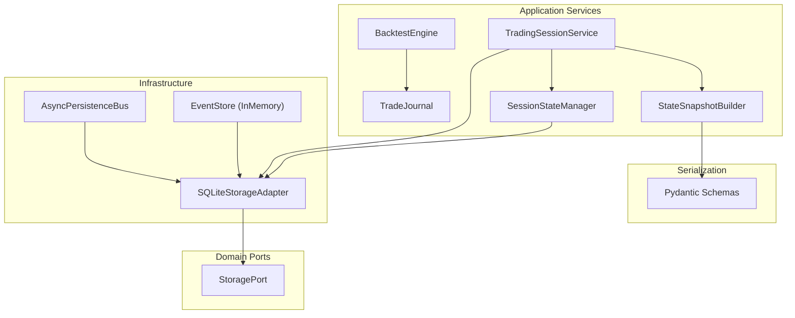
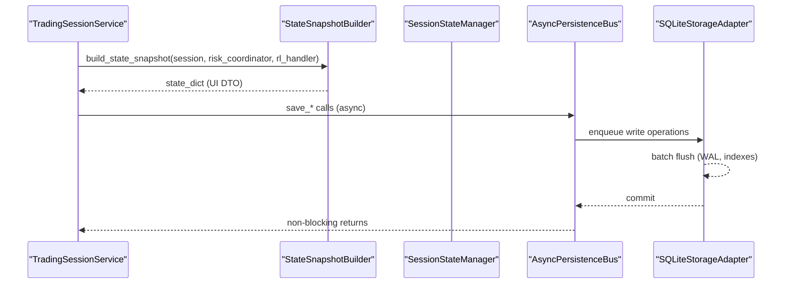
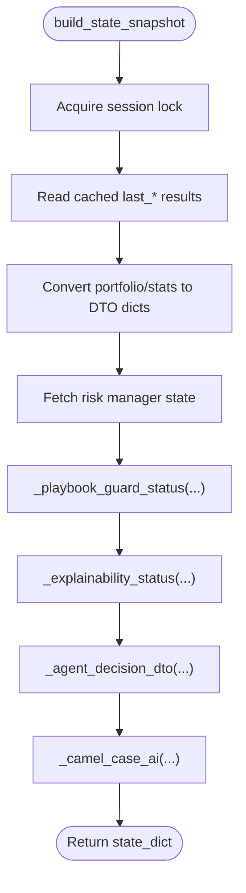
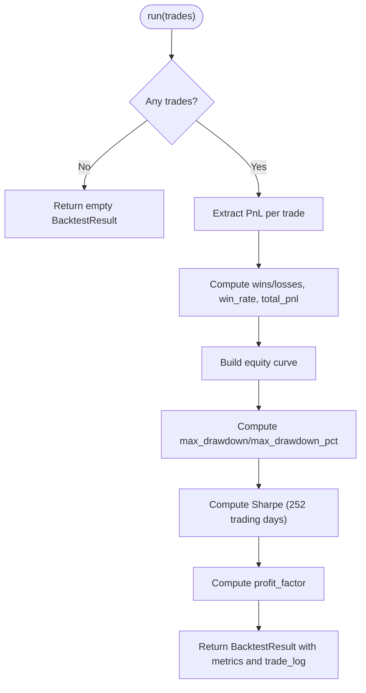
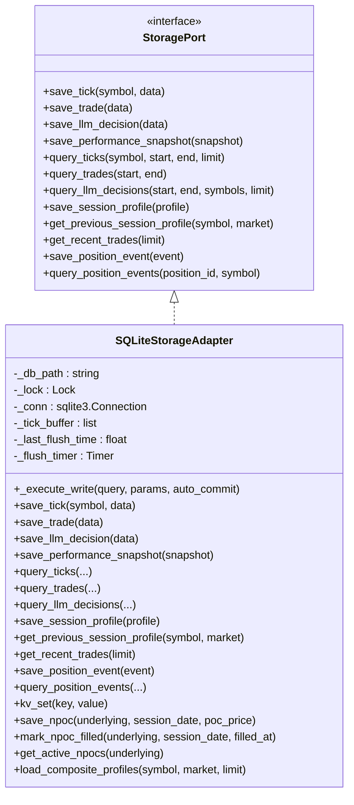
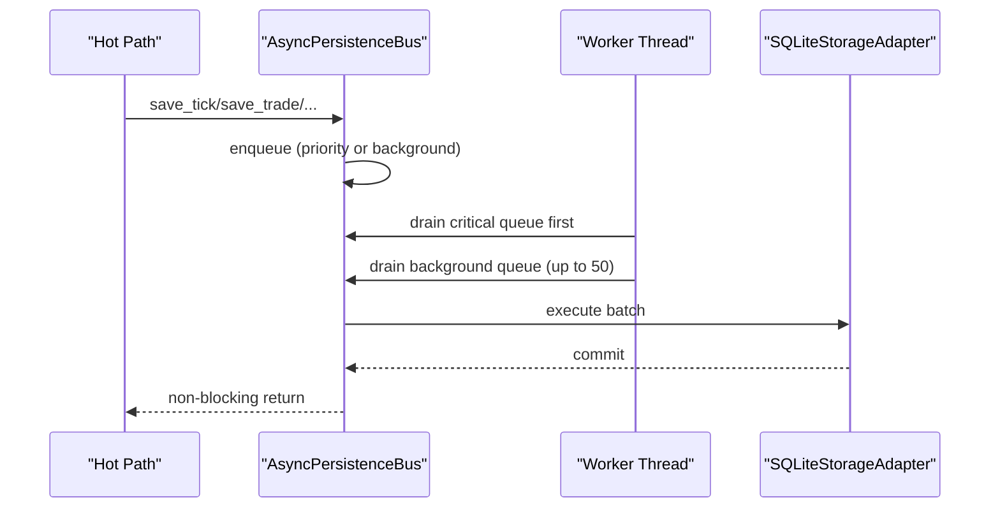
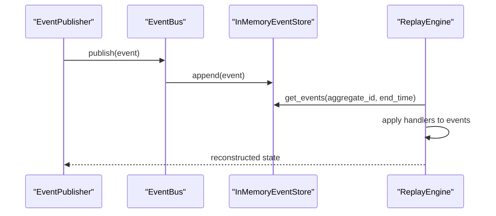
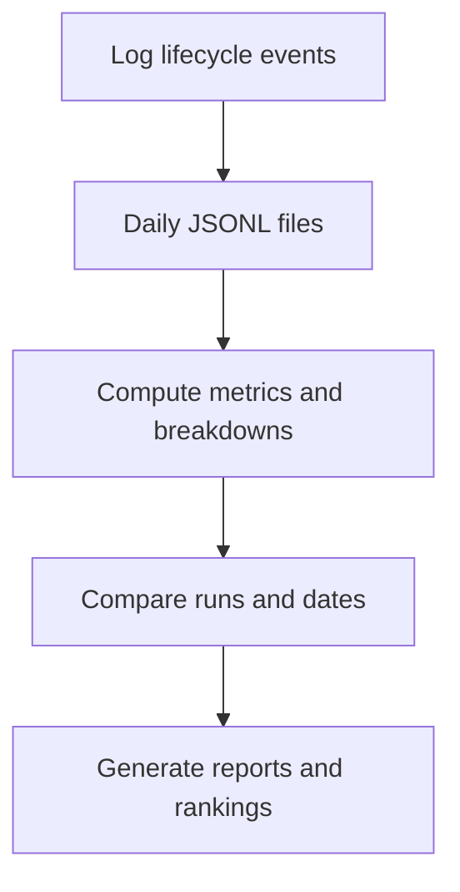
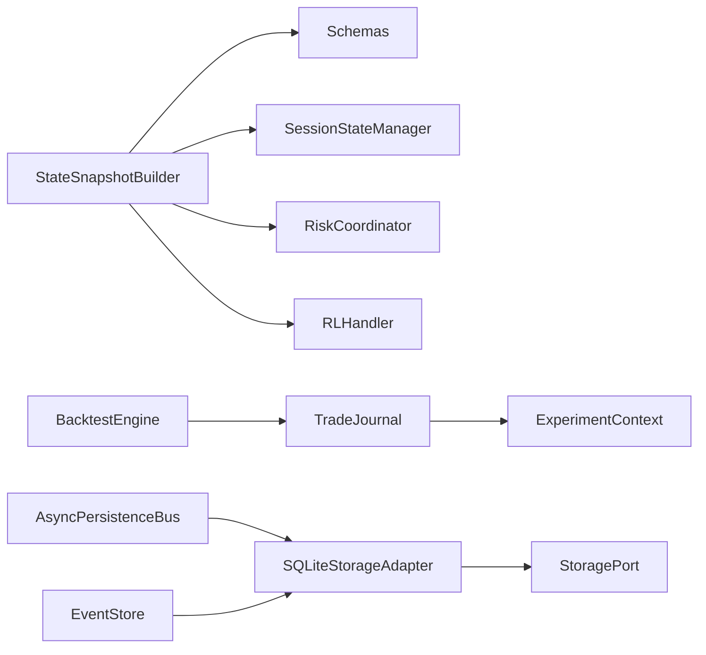

# Data Persistence

<cite>
**Referenced Files in This Document**
- [state_snapshot_builder.py](file://backend/app/application/services/state_snapshot_builder.py)
- [backtest_engine.py](file://backend/app/application/services/backtest_engine.py)
- [database.py](file://backend/app/infrastructure/storage/database.py)
- [async_persistence.py](file://backend/app/infrastructure/async_persistence.py)
- [schemas.py](file://backend/app/infrastructure/serialization/schemas.py)
- [storage.py](file://backend/app/domain/ports/storage.py)
- [config.py](file://backend/app/config.py)
- [event_store.py](file://backend/app/domain/trading/event_store.py)
- [session_state_manager.py](file://backend/app/application/services/session_state_manager.py)
- [trading_session.py](file://backend/app/application/services/trading_session.py)
- [trade_journal.py](file://backend/app/application/services/trade_journal.py)
- [experiment_context.py](file://backend/app/application/services/experiment_context.py)
- [development.yaml](file://backend/config/environments/development.yaml)
- [consolidated.py](file://backend/config/consolidated.py)
</cite>

## Update Summary
**Changes Made**
- Enhanced Database Layer with Consolidated Write Operations and Centralized Error Handling
- Improved Session Profile Lookup with Multi-Tier Fallback Strategies
- Strengthened Transaction Management and Reliability Through Unified Write Pipeline
- Added Composite Profile Queries and Enhanced NPOC Persistence
- Updated Configuration Management with Consolidated Settings Architecture

## Table of Contents
1. [Introduction](#introduction)
2. [Project Structure](#project-structure)
3. [Core Components](#core-components)
4. [Architecture Overview](#architecture-overview)
5. [Detailed Component Analysis](#detailed-component-analysis)
6. [Dependency Analysis](#dependency-analysis)
7. [Performance Considerations](#performance-considerations)
8. [Troubleshooting Guide](#troubleshooting-guide)
9. [Conclusion](#conclusion)
10. [Appendices](#appendices)

## Introduction
This document explains the data persistence services that capture system state, support historical simulation, and manage research-grade datasets. It covers:
- StateSnapshotBuilder: builds UI-ready state snapshots from session state
- BacktestEngine: computes performance metrics from historical trade logs
- Storage subsystem: SQLite-backed persistence with async write pipeline and consolidated error handling
- Event Store: append-only domain events for deterministic replay
- Research data management: trade journaling and experiment context
- Configuration, performance tuning, and debugging aids

**Updated** Enhanced with consolidated write operations, multi-tier session profile fallback strategies, and centralized error handling for improved reliability and transaction management.

## Project Structure
The persistence stack spans application services, infrastructure storage, serialization DTOs, and domain ports. The async persistence bus decouples real-time trading from disk I/O, while the event store enables deterministic replay.

**Diagram sources**
- [state_snapshot_builder.py:22-72](file://backend/app/application/services/state_snapshot_builder.py#L22-L72)
- [backtest_engine.py:33-99](file://backend/app/application/services/backtest_engine.py#L33-L99)
- [database.py:183-218](file://backend/app/infrastructure/storage/database.py#L183-L218)
- [async_persistence.py:24-131](file://backend/app/infrastructure/async_persistence.py#L24-L131)
- [schemas.py:367-667](file://backend/app/infrastructure/serialization/schemas.py#L367-L667)
- [storage.py:54-121](file://backend/app/domain/ports/storage.py#L54-L121)
- [event_store.py:51-97](file://backend/app/domain/trading/event_store.py#L51-L97)

**Section sources**
- [state_snapshot_builder.py:1-175](file://backend/app/application/services/state_snapshot_builder.py#L1-L175)
- [backtest_engine.py:1-99](file://backend/app/application/services/backtest_engine.py#L1-L99)
- [database.py:1-861](file://backend/app/infrastructure/storage/database.py#L1-L861)
- [async_persistence.py:1-277](file://backend/app/infrastructure/async_persistence.py#L1-L277)
- [schemas.py:1-667](file://backend/app/infrastructure/serialization/schemas.py#L1-L667)
- [storage.py:1-121](file://backend/app/domain/ports/storage.py#L1-L121)
- [event_store.py:1-498](file://backend/app/domain/trading/event_store.py#L1-L498)

## Core Components
- StateSnapshotBuilder: transforms session state into a UI-friendly DTO with risk, stats, and playbook guard telemetry.
- BacktestEngine: evaluates historical trade sequences and computes performance metrics.
- SQLiteStorageAdapter: thread-safe SQLite persistence with WAL mode, indexing, batched tick writes, and consolidated error handling.
- AsyncPersistenceBus: queues writes on a background thread to avoid blocking the trading hot path.
- EventStore: append-only domain events with idempotency and deterministic replay.
- TradeJournal: daily JSONL logging for research-grade analysis and run comparisons.
- ExperimentContext: stable run fingerprinting for reproducible experiments.

**Updated** Enhanced with consolidated write operations through `_execute_write()` method, improved session profile lookup with multi-tier fallback strategies, and strengthened transaction management with unified error handling.

**Section sources**
- [state_snapshot_builder.py:22-175](file://backend/app/application/services/state_snapshot_builder.py#L22-L175)
- [backtest_engine.py:33-99](file://backend/app/application/services/backtest_engine.py#L33-L99)
- [database.py:183-800](file://backend/app/infrastructure/storage/database.py#L183-L800)
- [async_persistence.py:24-277](file://backend/app/infrastructure/async_persistence.py#L24-L277)
- [event_store.py:51-498](file://backend/app/domain/trading/event_store.py#L51-L498)
- [trade_journal.py:84-908](file://backend/app/application/services/trade_journal.py#L84-L908)
- [experiment_context.py:18-70](file://backend/app/application/services/experiment_context.py#L18-L70)

## Architecture Overview
The persistence architecture separates concerns:
- Application services produce structured state and metrics
- AsyncPersistenceBus batches and flushes writes to SQLite
- EventStore captures immutable domain events for replay
- TradeJournal records detailed lifecycle events for research
- Configuration controls feature flags and thresholds

**Diagram sources**
- [trading_session.py:85-200](file://backend/app/application/services/trading_session.py#L85-L200)
- [state_snapshot_builder.py:22-72](file://backend/app/application/services/state_snapshot_builder.py#L22-L72)
- [async_persistence.py:24-168](file://backend/app/infrastructure/async_persistence.py#L24-L168)
- [database.py:183-250](file://backend/app/infrastructure/storage/database.py#L183-L250)

## Detailed Component Analysis

### StateSnapshotBuilder
Purpose:
- Produce a UI-ready snapshot from session state, including portfolio, stats, risk, and playbook guard telemetry.

Key behaviors:
- Uses DTO converters for portfolio and stats
- Computes playbook guard status and alignment
- Aggregates explainability metrics and thresholds
- Returns a flat dict with camelCase keys for the frontend

**Diagram sources**
- [state_snapshot_builder.py:22-175](file://backend/app/application/services/state_snapshot_builder.py#L22-L175)
- [schemas.py:483-667](file://backend/app/infrastructure/serialization/schemas.py#L483-L667)

**Section sources**
- [state_snapshot_builder.py:22-175](file://backend/app/application/services/state_snapshot_builder.py#L22-L175)
- [schemas.py:483-667](file://backend/app/infrastructure/serialization/schemas.py#L483-L667)

### BacktestEngine
Purpose:
- Evaluate historical trade sequences and compute performance metrics.

Processing logic:
- Validates input trades and extracts PnL series
- Computes wins/losses, win rate, total PnL
- Builds equity curve and calculates max drawdown and percent drawdown
- Estimates Sharpe ratio (annualized) and profit factor

**Diagram sources**
- [backtest_engine.py:39-99](file://backend/app/application/services/backtest_engine.py#L39-L99)

**Section sources**
- [backtest_engine.py:33-99](file://backend/app/application/services/backtest_engine.py#L33-L99)

### Storage Subsystem (SQLiteStorageAdapter)
Purpose:
- Persistent storage for ticks, trades, LLM decisions, performance snapshots, session profiles, open positions, position events, and KV crash-safe state.

**Updated** Enhanced with consolidated write operations, multi-tier session profile fallback strategies, and centralized error handling.

Design highlights:
- Thread-safe via a single persistent connection and a lock
- WAL mode for concurrency and durability
- Unique index on (symbol, time) for ticks deduplication
- Batched tick writes (every 50 ticks or 5 seconds)
- Separate critical vs. background queues in AsyncPersistenceBus
- Rich query APIs for research and UI
- Consolidated write operations through `_execute_write()` method
- Multi-tier session profile lookup with fallback strategies
- Enhanced transaction management with unified error handling

**Diagram sources**
- [storage.py:54-121](file://backend/app/domain/ports/storage.py#L54-L121)
- [database.py:183-800](file://backend/app/infrastructure/storage/database.py#L183-L800)

**Section sources**
- [database.py:183-800](file://backend/app/infrastructure/storage/database.py#L183-L800)
- [storage.py:54-121](file://backend/app/domain/ports/storage.py#L54-L121)

### AsyncPersistenceBus
Purpose:
- Offload storage writes to a background thread to minimize latency in the trading hot path.

Key features:
- Two queues: critical (trade/position) and background (ticks/decisions)
- Priority draining of critical queue to avoid starvation
- Batch execution and periodic flush
- Drop detection and logging for backpressure

**Diagram sources**
- [async_persistence.py:24-277](file://backend/app/infrastructure/async_persistence.py#L24-L277)
- [database.py:220-279](file://backend/app/infrastructure/storage/database.py#L220-L279)

**Section sources**
- [async_persistence.py:24-277](file://backend/app/infrastructure/async_persistence.py#L24-L277)

### Event Store (Deterministic Replay)
Purpose:
- Immutable append-only event store enabling deterministic state reconstruction.

Highlights:
- Idempotency via idempotency keys
- Query by aggregate_id and event type
- Replay engine to reconstruct state deterministically
- Context-aware event bus with per-session isolation

**Diagram sources**
- [event_store.py:204-265](file://backend/app/domain/trading/event_store.py#L204-L265)
- [event_store.py:436-498](file://backend/app/domain/trading/event_store.py#L436-L498)

**Section sources**
- [event_store.py:51-498](file://backend/app/domain/trading/event_store.py#L51-L498)

### TradeJournal (Research Data Management)
Purpose:
- Comprehensive JSONL logging of all lifecycle events for research-grade analysis and run comparisons.

Capabilities:
- Daily JSONL files with rich fields for thesis, market state, agent drivers, and performance metrics
- Aggregations: daily breakdowns, feature driver analysis, playbook purity, and misuse assessment
- Comparison across runs and date ranges
- Promotion assessment with tunable thresholds

**Diagram sources**
- [trade_journal.py:84-908](file://backend/app/application/services/trade_journal.py#L84-L908)

**Section sources**
- [trade_journal.py:84-908](file://backend/app/application/services/trade_journal.py#L84-L908)

### ExperimentContext (Configuration for Reproducibility)
Purpose:
- Build a stable run fingerprint combining configuration and model metadata for reproducible experiments.

Key points:
- Captures trading mode, exchange, stream interval, allow_short, LLM flags, and schema versions
- Generates a short fingerprint and ISO timestamped run_id

**Section sources**
- [experiment_context.py:18-70](file://backend/app/application/services/experiment_context.py#L18-L70)

## Dependency Analysis
- StateSnapshotBuilder depends on:
  - SessionStateManager for cached results
  - RiskCoordinator for risk state
  - RLHandler for RL status
  - Serialization schemas for DTO conversions
- BacktestEngine depends on:
  - Historical trade logs with PnL fields
- Storage subsystem depends on:
  - StoragePort interface
  - SQLite primitives and indexes
- AsyncPersistenceBus depends on:
  - StoragePort implementation
  - Threading primitives
- EventStore depends on:
  - Domain events and idempotency keys
- TradeJournal depends on:
  - ExperimentContext for run metadata
  - Timezone utilities

**Diagram sources**
- [state_snapshot_builder.py:12-19](file://backend/app/application/services/state_snapshot_builder.py#L12-L19)
- [backtest_engine.py:8-13](file://backend/app/application/services/backtest_engine.py#L8-L13)
- [async_persistence.py:24-40](file://backend/app/infrastructure/async_persistence.py#L24-L40)
- [database.py:183-196](file://backend/app/infrastructure/storage/database.py#L183-L196)
- [event_store.py:51-61](file://backend/app/domain/trading/event_store.py#L51-L61)
- [trade_journal.py:84-102](file://backend/app/application/services/trade_journal.py#L84-L102)
- [experiment_context.py:18-34](file://backend/app/application/services/experiment_context.py#L18-L34)

**Section sources**
- [state_snapshot_builder.py:12-19](file://backend/app/application/services/state_snapshot_builder.py#L12-L19)
- [backtest_engine.py:8-13](file://backend/app/application/services/backtest_engine.py#L8-L13)
- [database.py:183-196](file://backend/app/infrastructure/storage/database.py#L183-L196)
- [async_persistence.py:24-40](file://backend/app/infrastructure/async_persistence.py#L24-L40)
- [event_store.py:51-61](file://backend/app/domain/trading/event_store.py#L51-L61)
- [trade_journal.py:84-102](file://backend/app/application/services/trade_journal.py#L84-L102)
- [experiment_context.py:18-34](file://backend/app/application/services/experiment_context.py#L18-L34)

## Performance Considerations
- SQLite tuning:
  - WAL mode improves concurrency and durability
  - Normal sync and checkpoint settings balance safety and throughput
  - Unique index on (symbol, time) for ticks reduces duplicates and speeds queries
- Write batching:
  - Tick buffer flushes at 50 items or 5 seconds
  - Critical writes (trade/position) are prioritized to avoid starvation
  - Consolidated write operations eliminate duplicated try/except/rollback patterns
- Query optimization:
  - Indexed columns: ticks (symbol,time), trades (closed_at), decisions/performances (created_at), session profiles (symbol,market,date)
- Memory management:
  - Session eviction for idle symbols to cap memory usage
- Backtesting:
  - Efficient equity curve and rolling peak computation
  - Sharpe ratio computed with sample variance for small samples
- **Updated** Enhanced session profile lookup with multi-tier fallback strategies for improved reliability

[No sources needed since this section provides general guidance]

## Troubleshooting Guide
Common issues and remedies:
- Duplicate ticks:
  - SQLite enforces a unique index on (symbol, time); duplicates are removed on init
  - Verify tick timestamps and deduplicate upstream
- Queue drops:
  - AsyncPersistenceBus logs dropped writes; tune queue sizes or reduce write frequency
- Write failures:
  - SQLite exceptions are caught and logged; inspect logs around storage operations
  - Consolidated error handling through `_execute_write()` method
- Event replay anomalies:
  - Use ReplayEngine to reconstruct state deterministically
  - Validate idempotency keys to prevent duplicate processing
- Data integrity:
  - Use TradeJournal summaries and daily reports to detect anomalies
  - Compare runs using assessment thresholds to identify regressions
- **Updated** Session profile lookup failures:
  - Multi-tier fallback strategies handle various symbol formats (NSE/MCX)
  - Enhanced error handling prevents system crashes during profile resolution

**Section sources**
- [database.py:204-217](file://backend/app/infrastructure/storage/database.py#L204-L217)
- [async_persistence.py:196-207](file://backend/app/infrastructure/async_persistence.py#L196-L207)
- [event_store.py:234-248](file://backend/app/domain/trading/event_store.py#L234-L248)
- [trade_journal.py:761-796](file://backend/app/application/services/trade_journal.py#L761-L796)

## Conclusion
The persistence stack combines deterministic event replay, robust SQL storage, asynchronous writes, and research-grade logging to support both real-time trading and historical analysis. Configuration flags enable controlled behavior across environments, while built-in diagnostics help maintain data integrity and performance. The enhanced database layer provides improved reliability through consolidated write operations, multi-tier session profile fallback strategies, and centralized error handling.

[No sources needed since this section summarizes without analyzing specific files]

## Appendices

### Configuration Options for Persistence
- Environment-specific settings:
  - Development environment restricts symbols and relaxes risk for testing
- Runtime flags:
  - Playbook guard thresholds, explainability alerts, and LLM inference settings
- Storage tuning:
  - SQLite journal mode, synchronous settings, and WAL checkpoints
- **Updated** Consolidated configuration management:
  - Unified settings architecture through `ConsolidatedConfig`
  - Environment variable overrides for flexible deployment
  - Strategy-specific configurations via YAML files

**Section sources**
- [development.yaml:1-33](file://backend/config/environments/development.yaml#L1-L33)
- [config.py:61-84](file://backend/app/config.py#L61-L84)
- [database.py:200-203](file://backend/app/infrastructure/storage/database.py#L200-L203)
- [consolidated.py:173-426](file://backend/config/consolidated.py#L173-L426)

### State Serialization Patterns
- DTO conversion layer:
  - Portfolio, stats, AMT results, and footprint are converted to camelCase dicts
- Snapshot composition:
  - Risk state, playbook guard, explainability, and agent decision DTOs are merged into a single state dict

**Section sources**
- [schemas.py:367-667](file://backend/app/infrastructure/serialization/schemas.py#L367-L667)
- [state_snapshot_builder.py:22-175](file://backend/app/application/services/state_snapshot_builder.py#L22-L175)

### Historical Data Replay Capabilities
- EventStore:
  - Append-only events with idempotency and query by aggregate_id
- ReplayEngine:
  - Reconstruct state deterministically by applying registered handlers
- BacktestEngine:
  - Compute metrics from historical trade logs

**Section sources**
- [event_store.py:436-498](file://backend/app/domain/trading/event_store.py#L436-L498)
- [backtest_engine.py:33-99](file://backend/app/application/services/backtest_engine.py#L33-L99)

### Research Data Management
- TradeJournal:
  - Daily JSONL entries with rich fields for thesis, market state, and performance
  - Aggregations and run comparisons for evaluation
- ExperimentContext:
  - Stable run fingerprints for reproducibility

**Section sources**
- [trade_journal.py:84-908](file://backend/app/application/services/trade_journal.py#L84-L908)
- [experiment_context.py:18-70](file://backend/app/application/services/experiment_context.py#L18-L70)

### Enhanced Database Features
- **Updated** Consolidated Write Operations:
  - `_execute_write()` method eliminates duplicated try/except/rollback patterns
  - Unified transaction management across all write operations
  - Improved error handling and rollback mechanisms
- **Updated** Multi-Tier Session Profile Lookup:
  - Exact symbol match as primary strategy
  - Underlying extraction for options symbols (NSE/MCX formats)
  - Market-wide fallback for session profile resolution
  - Enhanced reliability through progressive fallback approaches
- **Updated** Composite Profile Queries:
  - `load_composite_profiles()` for multi-session analysis
  - Support for session window calculations and trend analysis
- **Updated** Enhanced NPOC Persistence:
  - `save_npoc()`, `mark_npoc_filled()`, and `get_active_npocs()` methods
  - Naked POC tracking for advanced market structure analysis

**Section sources**
- [database.py:220-234](file://backend/app/infrastructure/storage/database.py#L220-L234)
- [database.py:595-650](file://backend/app/infrastructure/storage/database.py#L595-L650)
- [database.py:922-941](file://backend/app/infrastructure/storage/database.py#L922-L941)
- [database.py:869-897](file://backend/app/infrastructure/storage/database.py#L869-L897)

### Session State Management Enhancements
- **Updated** SessionStateManager Integration:
  - Automatic prior session profile loading during session creation
  - Enhanced error handling for profile resolution failures
  - Support for multi-tier fallback strategies in profile lookup
  - Improved session eviction policies for memory management

**Section sources**
- [session_state_manager.py:142-166](file://backend/app/application/services/session_state_manager.py#L142-L166)
- [session_state_manager.py:171-189](file://backend/app/application/services/session_state_manager.py#L171-L189)