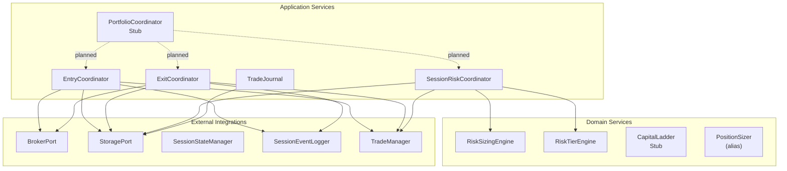
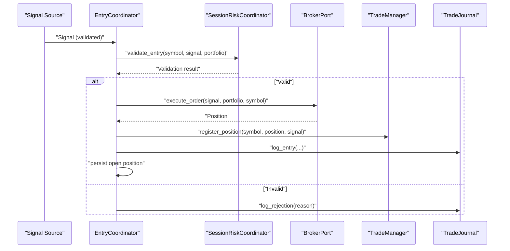
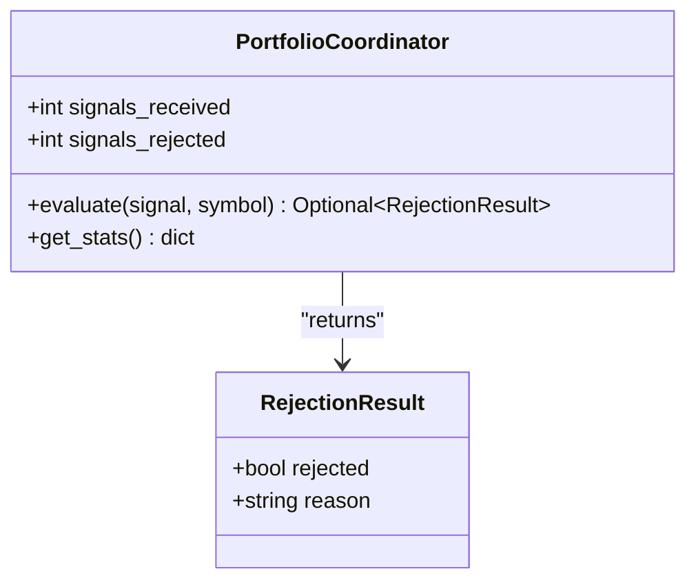
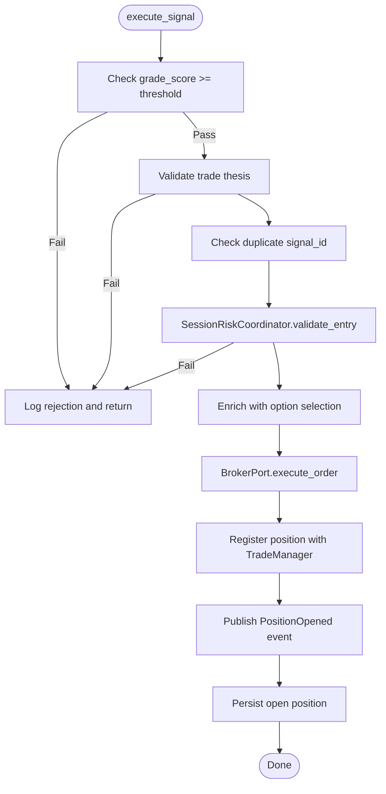
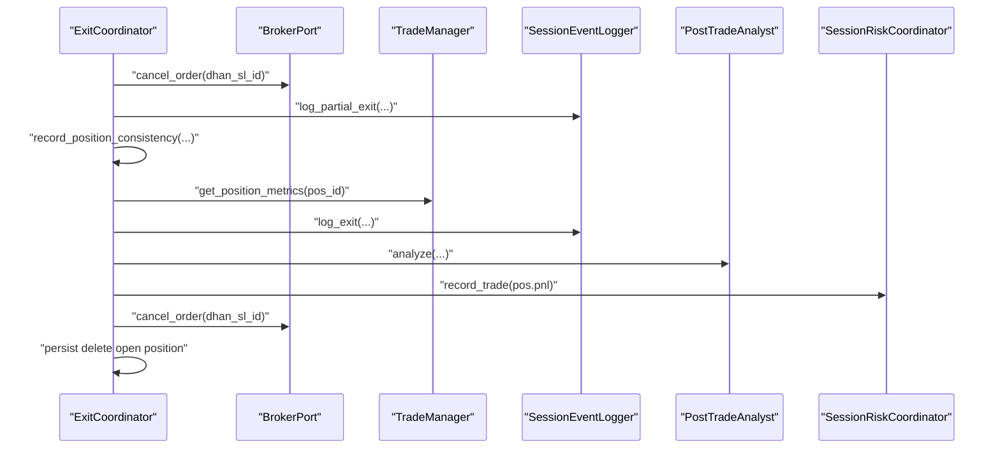
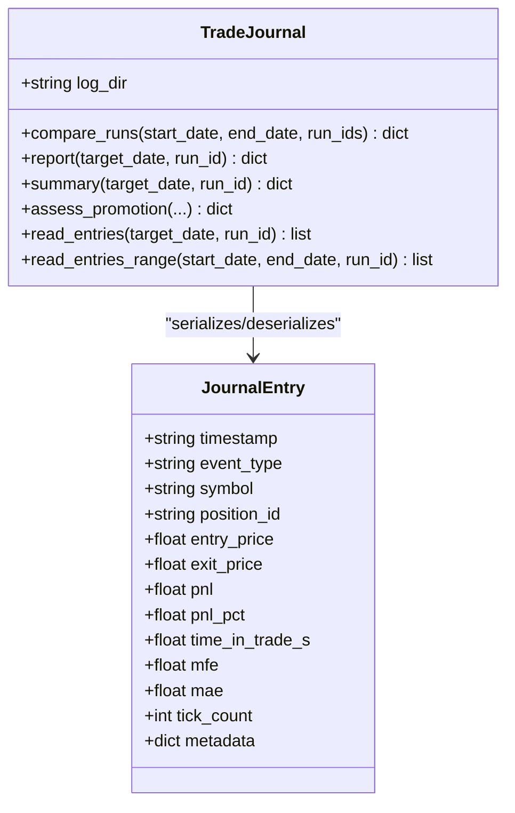
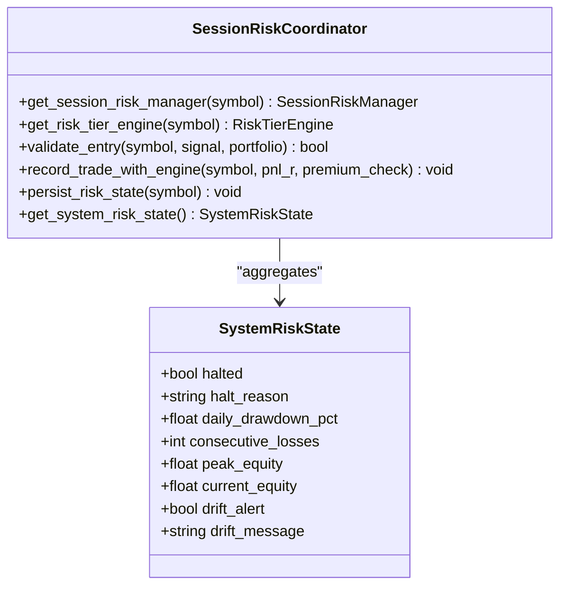
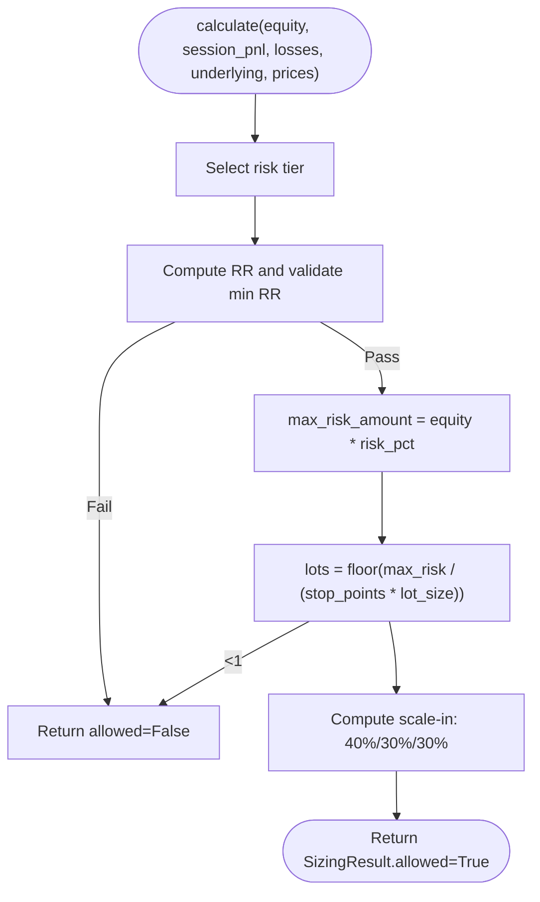
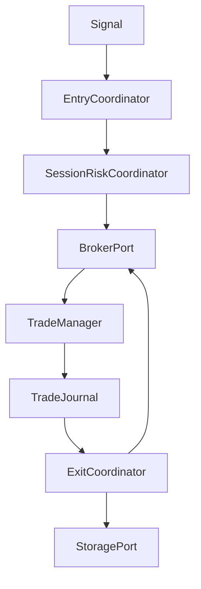
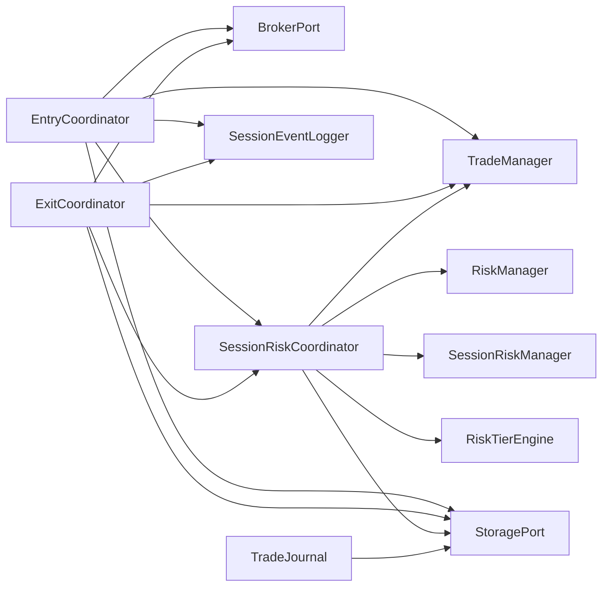

# Portfolio Coordination

<cite>
**Referenced Files in This Document**
- [portfolio_coordinator.py](file://backend/app/application/services/portfolio_coordinator.py)
- [entry_coordinator.py](file://backend/app/application/services/entry_coordinator.py)
- [exit_coordinator.py](file://backend/app/application/services/exit_coordinator.py)
- [trade_journal.py](file://backend/app/application/services/trade_journal.py)
- [session_risk_coordinator.py](file://backend/app/application/services/session_risk_coordinator.py)
- [risk_sizing_engine.py](file://backend/app/domain/services/risk_sizing_engine.py)
- [risk_tier_engine.py](file://backend/app/domain/services/risk_tier_engine.py)
- [capital_ladder.py](file://backend/app/domain/services/capital_ladder.py)
- [position_sizer.py](file://backend/app/application/handlers/position_sizer.py)
</cite>

## Table of Contents
1. [Introduction](#introduction)
2. [Project Structure](#project-structure)
3. [Core Components](#core-components)
4. [Architecture Overview](#architecture-overview)
5. [Detailed Component Analysis](#detailed-component-analysis)
6. [Dependency Analysis](#dependency-analysis)
7. [Performance Considerations](#performance-considerations)
8. [Troubleshooting Guide](#troubleshooting-guide)
9. [Conclusion](#conclusion)
10. [Appendices](#appendices)

## Introduction
This document explains the portfolio coordination services that orchestrate cross-symbol signal filtering, entry execution, exit management, and performance tracking. It also documents portfolio-wide risk controls, signal coordination across multiple symbols, trade lifecycle management, position sizing algorithms, risk allocation strategies, and reporting capabilities. Integration with trading sessions, position reconciliation mechanisms, and portfolio-level analytics are covered to support robust and auditable trading operations.

## Project Structure
The portfolio coordination services reside primarily in the application services layer, with risk sizing and tier engines in the domain layer. The services coordinate with brokers, storage, and event logging to enforce risk, execute orders, and maintain a comprehensive trade journal.

**Diagram sources**
- [portfolio_coordinator.py:22-44](file://backend/app/application/services/portfolio_coordinator.py#L22-L44)
- [entry_coordinator.py:41-65](file://backend/app/application/services/entry_coordinator.py#L41-L65)
- [exit_coordinator.py:35-63](file://backend/app/application/services/exit_coordinator.py#L35-L63)
- [trade_journal.py:84-92](file://backend/app/application/services/trade_journal.py#L84-L92)
- [session_risk_coordinator.py:43-71](file://backend/app/application/services/session_risk_coordinator.py#L43-L71)
- [risk_sizing_engine.py:44-76](file://backend/app/domain/services/risk_sizing_engine.py#L44-L76)
- [risk_tier_engine.py:96-118](file://backend/app/domain/services/risk_tier_engine.py#L96-L118)
- [capital_ladder.py:46-54](file://backend/app/domain/services/capital_ladder.py#L46-L54)

**Section sources**
- [portfolio_coordinator.py:1-44](file://backend/app/application/services/portfolio_coordinator.py#L1-L44)
- [entry_coordinator.py:1-286](file://backend/app/application/services/entry_coordinator.py#L1-L286)
- [exit_coordinator.py:1-253](file://backend/app/application/services/exit_coordinator.py#L1-L253)
- [trade_journal.py:1-908](file://backend/app/application/services/trade_journal.py#L1-L908)
- [session_risk_coordinator.py:1-345](file://backend/app/application/services/session_risk_coordinator.py#L1-L345)
- [risk_sizing_engine.py:1-204](file://backend/app/domain/services/risk_sizing_engine.py#L1-L204)
- [risk_tier_engine.py:1-286](file://backend/app/domain/services/risk_tier_engine.py#L1-L286)
- [capital_ladder.py:1-95](file://backend/app/domain/services/capital_ladder.py#L1-L95)
- [position_sizer.py:1-10](file://backend/app/application/handlers/position_sizer.py#L1-L10)

## Core Components
- PortfolioCoordinator (planned stub): Central coordinator for cross-symbol signal filtering and portfolio-level decisions.
- EntryCoordinator: Executes validated signals, enriches with option selection, coordinates broker execution, registers positions, publishes events, and persists state.
- ExitCoordinator: Handles partial exits, stop-outs, and full position closures; integrates learning, risk recording, and persistence.
- TradeJournal: Comprehensive JSONL logging of all trade decisions with performance analytics and reporting.
- SessionRiskCoordinator: Aggregates session-level risk, enforces circuit breakers, validates entries, and persists risk state.
- RiskSizingEngine: Deterministic Kelly-based sizing with risk tiers, lot calculation, and scale-in plan.
- RiskTierEngine: Dynamic A/B/C risk model with premium unlock conditions and state transitions.
- CapitalLadder (stub): Planned tiered position management framework.
- PositionSizer (alias): Exposes domain PositionSizer for legacy compatibility.

**Section sources**
- [portfolio_coordinator.py:22-44](file://backend/app/application/services/portfolio_coordinator.py#L22-L44)
- [entry_coordinator.py:41-286](file://backend/app/application/services/entry_coordinator.py#L41-L286)
- [exit_coordinator.py:35-253](file://backend/app/application/services/exit_coordinator.py#L35-L253)
- [trade_journal.py:84-908](file://backend/app/application/services/trade_journal.py#L84-L908)
- [session_risk_coordinator.py:43-345](file://backend/app/application/services/session_risk_coordinator.py#L43-L345)
- [risk_sizing_engine.py:44-204](file://backend/app/domain/services/risk_sizing_engine.py#L44-L204)
- [risk_tier_engine.py:96-286](file://backend/app/domain/services/risk_tier_engine.py#L96-L286)
- [capital_ladder.py:46-95](file://backend/app/domain/services/capital_ladder.py#L46-L95)
- [position_sizer.py:1-10](file://backend/app/application/handlers/position_sizer.py#L1-L10)

## Architecture Overview
The system separates concerns across entry, exit, risk, and journaling services, with deterministic risk sizing and optional dynamic risk tiers. The architecture supports multi-symbol coordination and integrates with trading sessions for risk-aware execution and reporting.

**Diagram sources**
- [entry_coordinator.py:66-286](file://backend/app/application/services/entry_coordinator.py#L66-L286)
- [session_risk_coordinator.py:169-212](file://backend/app/application/services/session_risk_coordinator.py#L169-L212)
- [trade_journal.py:320-364](file://backend/app/application/services/trade_journal.py#L320-L364)

## Detailed Component Analysis

### PortfolioCoordinator (Cross-Symbol Signal Filtering)
- Purpose: Central portfolio coordinator for cross-symbol signal filtering and portfolio-level decisions.
- Status: Stub with type definitions; currently accepts all signals without rejections.
- Planned responsibilities: consume signals from SignalBus, apply portfolio-level filters, and decide on entry/exit/sizing.

**Diagram sources**
- [portfolio_coordinator.py:15-44](file://backend/app/application/services/portfolio_coordinator.py#L15-L44)

**Section sources**
- [portfolio_coordinator.py:22-44](file://backend/app/application/services/portfolio_coordinator.py#L22-L44)

### EntryCoordinator (Signal Execution and Position Opening)
- Responsibilities:
  - Validate trade thesis and duplicate signal IDs.
  - Enforce minimum confluence grade score.
  - Delegate risk validation to SessionRiskCoordinator.
  - Enrich signal with option selection (strike, type, lot size).
  - Execute via broker and register with TradeManager.
  - Publish PositionOpened event and persist state.
- Thread safety: Uses locks around critical sections; network I/O is performed outside locks to avoid blocking.

**Diagram sources**
- [entry_coordinator.py:66-286](file://backend/app/application/services/entry_coordinator.py#L66-L286)

**Section sources**
- [entry_coordinator.py:41-286](file://backend/app/application/services/entry_coordinator.py#L41-L286)

### ExitCoordinator (Position Lifecycle and Closure)
- Responsibilities:
  - Handle partial exits: cancel broker SL and log.
  - Record stop-out events with session phase for learning.
  - On full closure: cancel hardware SL, reconcile positions, learn, compute metrics, log exit, trigger post-trade analysis, record successful exit, update session risk, persist deletion.
- Integration points: TradeManager, SessionStateManager, SessionEventLogger, LLM handlers, PostTradeAnalyst, SessionRiskCoordinator.

**Diagram sources**
- [exit_coordinator.py:64-253](file://backend/app/application/services/exit_coordinator.py#L64-L253)

**Section sources**
- [exit_coordinator.py:35-253](file://backend/app/application/services/exit_coordinator.py#L35-L253)

### TradeJournal (Performance Tracking and Reporting)
- Data model: JournalEntry captures signal generation, entry, rejection, exit, partial exit, and overseer actions with rich metadata.
- Logging: Writes daily JSONL files with thread-safety.
- Analytics: Computes performance metrics, bucketed breakdowns (by session, symbol, feature drivers), and assessment criteria for promotion.
- APIs:
  - Read entries for a date or range.
  - Build completed trades from paired entry/exit events.
  - Generate summaries and reports.
  - Compare runs and assess eligibility for promotion.

**Diagram sources**
- [trade_journal.py:84-520](file://backend/app/application/services/trade_journal.py#L84-L520)

**Section sources**
- [trade_journal.py:84-908](file://backend/app/application/services/trade_journal.py#L84-L908)

### SessionRiskCoordinator (Portfolio-Wide Risk Controls)
- Responsibilities:
  - Manage per-symbol and session risk managers.
  - Validate entries against confluence grade, session circuit breakers, daily loss limits, and position sizing/exposure.
  - Persist risk state to storage for continuity.
  - Aggregate system risk state for control-plane visibility.
- Optional RiskTierEngine integration for dynamic risk tiers with premium unlocks.

**Diagram sources**
- [session_risk_coordinator.py:43-345](file://backend/app/application/services/session_risk_coordinator.py#L43-L345)

**Section sources**
- [session_risk_coordinator.py:43-345](file://backend/app/application/services/session_risk_coordinator.py#L43-L345)

### Position Sizing and Risk Allocation Strategies
- RiskSizingEngine (deterministic Kelly-based):
  - Base risk: 0.30% with hard clamp 0.25%–0.50%.
  - Dynamic cushion: up to +20% of session PnL when winning.
  - Consecutive loss reduction: down to 0.25% after 2+ losses.
  - RR minimum: 2.0 (ideal 2.5–4.0).
  - Scale-in plan: 40%/30%/30% split across three entries.
- RiskTierEngine (dynamic A/B/C):
  - Tiers: HALT (0%), C (0.15%), B (0.25%), A (0.45%) of capital.
  - Premium unlock for Tier A requires multiple conditions (aggression, LVN strength, divergence, drive, ML probability).
  - Circuit breaker halts after 3 consecutive losses.
- CapitalLadder (stub): Planned tiered rungs for position management.
- PositionSizer (alias): Domain PositionSizer exposed for compatibility.

**Diagram sources**
- [risk_sizing_engine.py:77-204](file://backend/app/domain/services/risk_sizing_engine.py#L77-L204)

**Section sources**
- [risk_sizing_engine.py:44-204](file://backend/app/domain/services/risk_sizing_engine.py#L44-L204)
- [risk_tier_engine.py:96-286](file://backend/app/domain/services/risk_tier_engine.py#L96-L286)
- [capital_ladder.py:46-95](file://backend/app/domain/services/capital_ladder.py#L46-L95)
- [position_sizer.py:1-10](file://backend/app/application/handlers/position_sizer.py#L1-L10)

### Conceptual Overview
- Signal coordination across symbols: EntryCoordinator validates signals and delegates risk checks; SessionRiskCoordinator centralizes risk enforcement; PortfolioCoordinator (planned) will filter signals at the portfolio level.
- Trade lifecycle: Signals → EntryCoordinator → Broker → TradeManager → Journal → ExitCoordinator → Broker/Storage.
- Reporting: TradeJournal aggregates performance and supports run comparisons and promotion assessments.

[No sources needed since this diagram shows conceptual workflow, not actual code structure]

[No sources needed since this section doesn't analyze specific source files]

## Dependency Analysis
- Coupling:
  - EntryCoordinator depends on BrokerPort, TradeManager, SessionEventLogger, StoragePort, SessionRiskCoordinator, OptionSelector, and SessionStateManager.
  - ExitCoordinator depends on BrokerPort, TradeManager, SessionEventLogger, LLM handlers, PostTradeAnalyst, SessionRiskCoordinator, and StoragePort.
  - SessionRiskCoordinator depends on RiskManager, SessionRiskManager, optional RiskTierEngine, TradeManager, and StoragePort.
  - TradeJournal depends on StoragePort and time utilities.
- Cohesion:
  - Each service maintains a single responsibility aligned with lifecycle stages.
- External dependencies:
  - BrokerPort and StoragePort abstractions enable pluggable adapters.
  - SessionStateManager coordinates session state across symbols.

**Diagram sources**
- [entry_coordinator.py:48-65](file://backend/app/application/services/entry_coordinator.py#L48-L65)
- [exit_coordinator.py:42-63](file://backend/app/application/services/exit_coordinator.py#L42-L63)
- [session_risk_coordinator.py:50-71](file://backend/app/application/services/session_risk_coordinator.py#L50-L71)
- [trade_journal.py:87-92](file://backend/app/application/services/trade_journal.py#L87-L92)

**Section sources**
- [entry_coordinator.py:41-65](file://backend/app/application/services/entry_coordinator.py#L41-L65)
- [exit_coordinator.py:35-63](file://backend/app/application/services/exit_coordinator.py#L35-L63)
- [session_risk_coordinator.py:43-71](file://backend/app/application/services/session_risk_coordinator.py#L43-L71)
- [trade_journal.py:84-92](file://backend/app/application/services/trade_journal.py#L84-L92)

## Performance Considerations
- Deterministic sizing: RiskSizingEngine executes in sub-millisecond time, avoiding LLM overhead.
- Locking strategy: EntryCoordinator minimizes lock duration by moving broker I/O outside locks.
- Persistence: TradeJournal writes are serialized per-day JSONL files with internal locking to prevent contention.
- Risk state persistence: SessionRiskCoordinator persists risk state to storage to recover between restarts.
- Reporting: TradeJournal computes metrics and reports incrementally; use date-range APIs to limit I/O.

[No sources needed since this section provides general guidance]

## Troubleshooting Guide
- Entry rejections:
  - Inspect logs for confluence grade floor and thesis validation failures.
  - Verify duplicate signal detection and risk validation outcomes.
- Partial exit cleanup:
  - Confirm broker SL cancellation and logging; check for exceptions during cancellation.
- Full exit reconciliation:
  - Ensure position consistency checks and session risk updates occur after closure.
- Risk tier halts:
  - Review consecutive loss counts and daily PnL thresholds; confirm premium unlock conditions for Tier A.
- Journal ingestion:
  - Validate JSONL file existence and integrity; use read APIs with run_id filters for targeted queries.

**Section sources**
- [entry_coordinator.py:86-179](file://backend/app/application/services/entry_coordinator.py#L86-L179)
- [exit_coordinator.py:90-253](file://backend/app/application/services/exit_coordinator.py#L90-L253)
- [session_risk_coordinator.py:181-244](file://backend/app/application/services/session_risk_coordinator.py#L181-L244)
- [trade_journal.py:542-574](file://backend/app/application/services/trade_journal.py#L542-L574)

## Conclusion
The portfolio coordination services provide a robust, deterministic, and auditable framework for multi-symbol trading. Entry and exit are governed by strict risk controls, while TradeJournal ensures comprehensive post-session analytics. Risk sizing engines and optional dynamic risk tiers offer flexible risk allocation strategies. The architecture supports integration with trading sessions, position reconciliation, and production-grade reporting for portfolio-level insights.

[No sources needed since this section summarizes without analyzing specific files]

## Appendices
- Position sizing parameters:
  - Base risk: 0.30% (clamped 0.25%–0.50%)
  - Cushion multiplier: 20% of session PnL when winning
  - Consecutive loss threshold: 2
  - Minimum R:R: 2.0
- Risk tier thresholds:
  - Tier A unlock: daily P&L ≥ 3R with premium setup
  - Tier B unlock: daily P&L ≥ 1R
  - Circuit breaker: 3 consecutive losses

[No sources needed since this section provides general guidance]