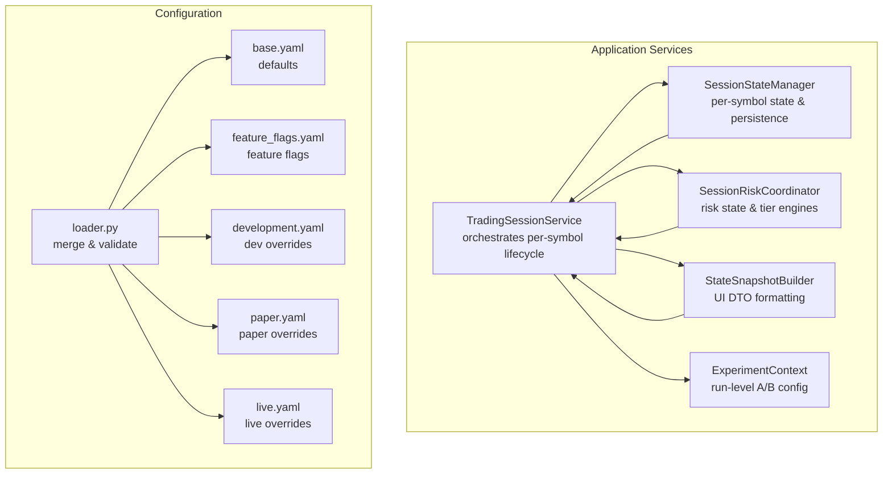
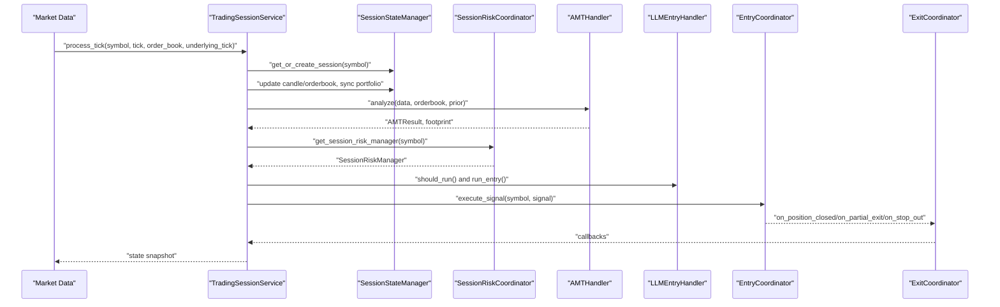
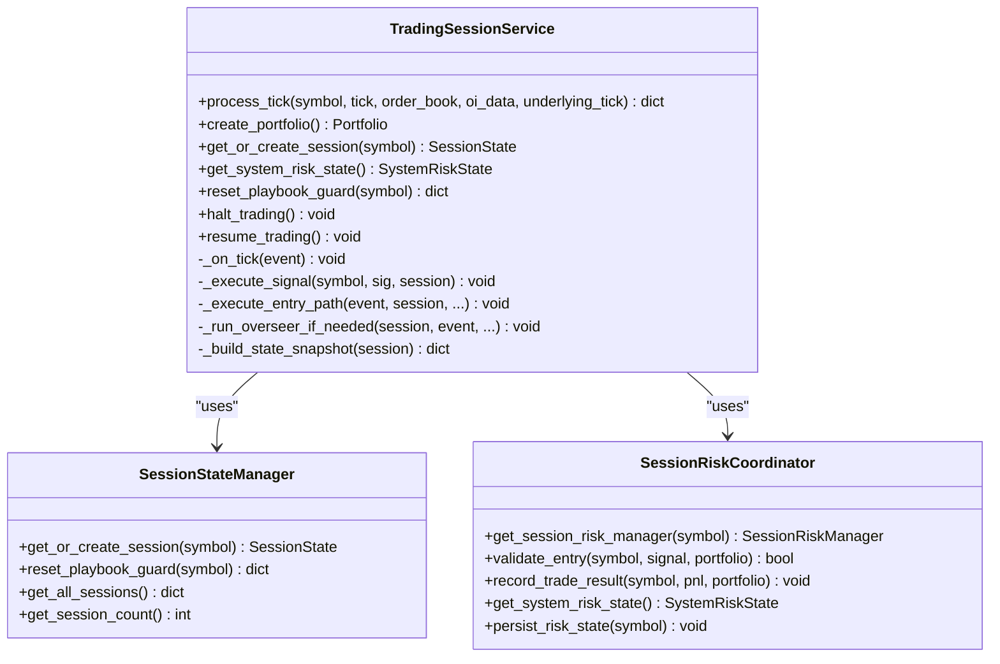
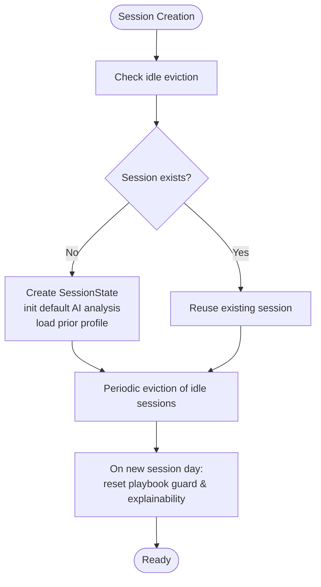
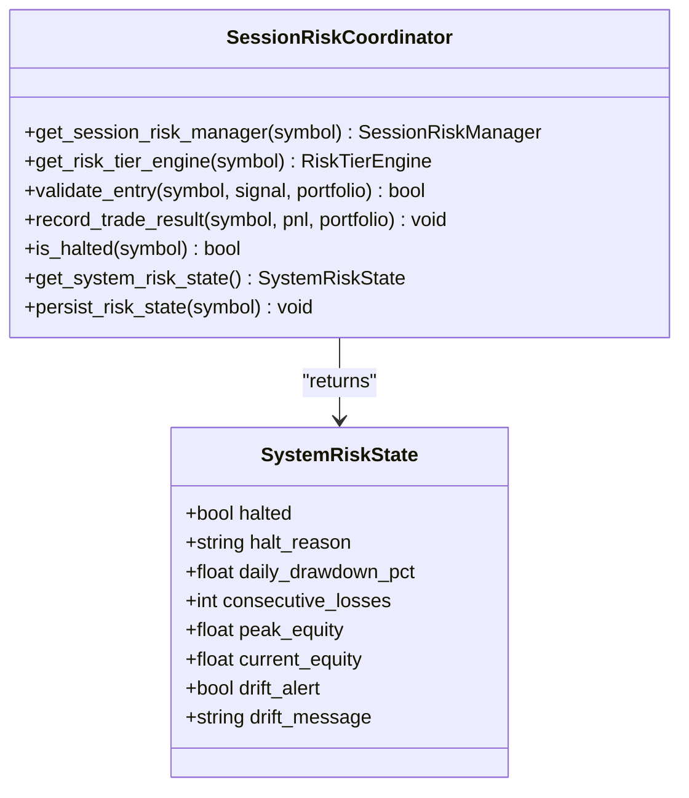
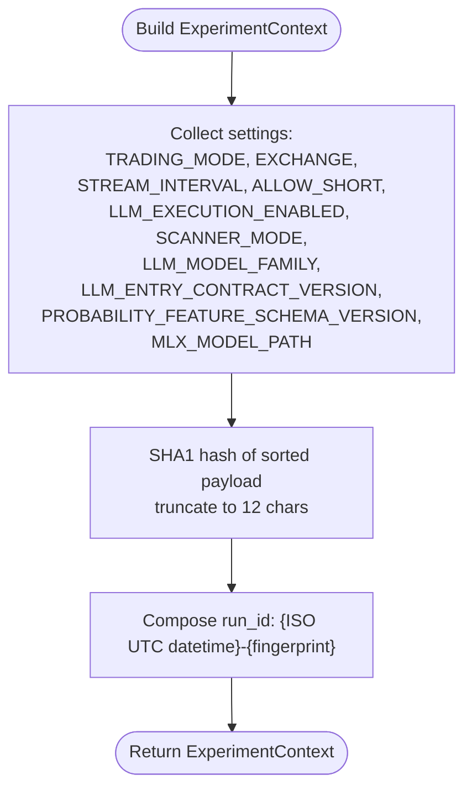
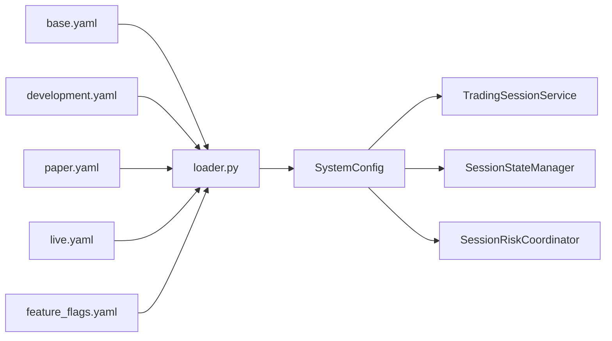

# Session Management

<cite>
**Referenced Files in This Document**
- [trading_session.py](file://backend/app/application/services/trading_session.py)
- [session_state_manager.py](file://backend/app/application/services/session_state_manager.py)
- [session_risk_coordinator.py](file://backend/app/application/services/session_risk_coordinator.py)
- [experiment_context.py](file://backend/app/application/services/experiment_context.py)
- [state_snapshot_builder.py](file://backend/app/application/services/state_snapshot_builder.py)
- [base.yaml](file://backend/config/base.yaml)
- [feature_flags.yaml](file://backend/config/feature_flags.yaml)
- [development.yaml](file://backend/config/environments/development.yaml)
- [paper.yaml](file://backend/config/environments/paper.yaml)
- [live.yaml](file://backend/config/environments/live.yaml)
- [loader.py](file://backend/app/config_models/loader.py)
- [test_trading_session_unit.py](file://backend/tests/unit/application/test_trading_session_unit.py)
</cite>

## Table of Contents
1. [Introduction](#introduction)
2. [Project Structure](#project-structure)
3. [Core Components](#core-components)
4. [Architecture Overview](#architecture-overview)
5. [Detailed Component Analysis](#detailed-component-analysis)
6. [Dependency Analysis](#dependency-analysis)
7. [Performance Considerations](#performance-considerations)
8. [Troubleshooting Guide](#troubleshooting-guide)
9. [Conclusion](#conclusion)
10. [Appendices](#appendices)

## Introduction
This document explains the session management subsystem that orchestrates trading activity per symbol. It covers the primary orchestrator TradingSessionService, the per-symbol state persistence layer SessionStateManager, the risk control coordinator SessionRiskCoordinator, and the A/B testing framework ExperimentContext. It documents the session lifecycle, state synchronization, risk parameter management, and experimental feature toggles. It also explains session isolation patterns, state persistence mechanisms, and how risk controls coordinate with trading decisions, along with configuration options, performance considerations, and debugging capabilities.

## Project Structure
The session management services reside in the backend application services layer and integrate with configuration models, environment files, and feature flags.

**Diagram sources**
- [trading_session.py:85-220](file://backend/app/application/services/trading_session.py#L85-L220)
- [session_state_manager.py:100-167](file://backend/app/application/services/session_state_manager.py#L100-L167)
- [session_risk_coordinator.py:43-150](file://backend/app/application/services/session_risk_coordinator.py#L43-L150)
- [experiment_context.py:18-70](file://backend/app/application/services/experiment_context.py#L18-L70)
- [state_snapshot_builder.py:22-72](file://backend/app/application/services/state_snapshot_builder.py#L22-L72)
- [loader.py:139-245](file://backend/app/config_models/loader.py#L139-L245)
- [base.yaml:1-493](file://backend/config/base.yaml#L1-L493)
- [feature_flags.yaml:1-37](file://backend/config/feature_flags.yaml#L1-L37)
- [development.yaml:1-33](file://backend/config/environments/development.yaml#L1-L33)
- [paper.yaml:1-25](file://backend/config/environments/paper.yaml#L1-L25)
- [live.yaml:1-26](file://backend/config/environments/live.yaml#L1-L26)

**Section sources**
- [trading_session.py:85-220](file://backend/app/application/services/trading_session.py#L85-L220)
- [session_state_manager.py:100-167](file://backend/app/application/services/session_state_manager.py#L100-L167)
- [session_risk_coordinator.py:43-150](file://backend/app/application/services/session_risk_coordinator.py#L43-L150)
- [experiment_context.py:18-70](file://backend/app/application/services/experiment_context.py#L18-L70)
- [state_snapshot_builder.py:22-72](file://backend/app/application/services/state_snapshot_builder.py#L22-L72)
- [loader.py:139-245](file://backend/app/config_models/loader.py#L139-L245)
- [base.yaml:1-493](file://backend/config/base.yaml#L1-L493)
- [feature_flags.yaml:1-37](file://backend/config/feature_flags.yaml#L1-L37)
- [development.yaml:1-33](file://backend/config/environments/development.yaml#L1-L33)
- [paper.yaml:1-25](file://backend/config/environments/paper.yaml#L1-L25)
- [live.yaml:1-26](file://backend/config/environments/live.yaml#L1-L26)

## Core Components
- TradingSessionService: Primary orchestrator that coordinates per-symbol state, event processing, risk gating, entry/exit execution, and observability.
- SessionStateManager: Manages per-symbol SessionState, including state persistence, idle eviction, and runtime QA telemetry (playbook guard and explainability).
- SessionRiskCoordinator: Centralizes risk state per symbol, integrates risk tier engines, validates entries, and aggregates system risk.
- ExperimentContext: Captures run-level configuration fingerprint for A/B testing and attribution.
- StateSnapshotBuilder: Formats session state into UI-ready DTOs.

**Section sources**
- [trading_session.py:85-220](file://backend/app/application/services/trading_session.py#L85-L220)
- [session_state_manager.py:100-167](file://backend/app/application/services/session_state_manager.py#L100-L167)
- [session_risk_coordinator.py:43-150](file://backend/app/application/services/session_risk_coordinator.py#L43-L150)
- [experiment_context.py:18-70](file://backend/app/application/services/experiment_context.py#L18-L70)
- [state_snapshot_builder.py:22-72](file://backend/app/application/services/state_snapshot_builder.py#L22-L72)

## Architecture Overview
The session management architecture is event-driven and strongly isolated per symbol. TradingSessionService receives ticks, updates per-symbol SessionState, runs AMT and micro-agent pipelines, evaluates risk gates, and executes entry/exit decisions through specialized coordinators.

**Diagram sources**
- [trading_session.py:233-417](file://backend/app/application/services/trading_session.py#L233-L417)
- [trading_session.py:1025-1280](file://backend/app/application/services/trading_session.py#L1025-L1280)
- [session_state_manager.py:117-166](file://backend/app/application/services/session_state_manager.py#L117-L166)
- [session_risk_coordinator.py:86-150](file://backend/app/application/services/session_risk_coordinator.py#L86-L150)

## Detailed Component Analysis

### TradingSessionService
Responsibilities:
- Per-symbol orchestration: tick ingestion, state updates, AMT analysis, micro-agent pipeline, entry gating, LLM advisory, overseer checks, and exit execution.
- Risk integration: consults SessionRiskCoordinator for session risk state and validates entries.
- Persistence: persists trades, performance snapshots, and session profiles.
- Observability: records latency, gate decisions, and session-phase transitions.

Key behaviors:
- Session isolation: each symbol has an independent SessionState protected by a lock.
- Pending signal drain: LLM worker thread sets a pending signal; it is drained on the next tick to keep portfolio mutations on the main thread.
- Candle management: deduplicates sub-candle updates and caps history length.
- Session-phase gating: enforces session close windows and forces exits when required.
- Risk-aware entry: gates entry by session risk manager, trade manager, and risk manager.

**Diagram sources**
- [trading_session.py:85-220](file://backend/app/application/services/trading_session.py#L85-L220)
- [session_state_manager.py:100-167](file://backend/app/application/services/session_state_manager.py#L100-L167)
- [session_risk_coordinator.py:43-150](file://backend/app/application/services/session_risk_coordinator.py#L43-L150)

**Section sources**
- [trading_session.py:233-417](file://backend/app/application/services/trading_session.py#L233-L417)
- [trading_session.py:1025-1280](file://backend/app/application/services/trading_session.py#L1025-L1280)
- [trading_session.py:1329-1344](file://backend/app/application/services/trading_session.py#L1329-L1344)

### SessionStateManager
Responsibilities:
- Per-symbol state container: mutable data, orderbook, portfolio, learning engine, cached analysis results.
- Thread safety: RLock around portfolio reads/writes and throttling flags.
- Lifecycle: creation, reuse, idle eviction, and day-bound resets for QA telemetry.
- Persistence: loads prior session profile and print levels for cross-session continuity.

Runtime QA:
- Playbook guard: tracks rejections and tripping conditions.
- Explainability monitor: tracks feature driver coverage and aggression rate.

**Diagram sources**
- [session_state_manager.py:117-166](file://backend/app/application/services/session_state_manager.py#L117-L166)
- [session_state_manager.py:168-186](file://backend/app/application/services/session_state_manager.py#L168-L186)
- [session_state_manager.py:338-364](file://backend/app/application/services/session_state_manager.py#L338-L364)

**Section sources**
- [session_state_manager.py:31-98](file://backend/app/application/services/session_state_manager.py#L31-L98)
- [session_state_manager.py:100-167](file://backend/app/application/services/session_state_manager.py#L100-L167)
- [session_state_manager.py:168-186](file://backend/app/application/services/session_state_manager.py#L168-L186)
- [session_state_manager.py:338-364](file://backend/app/application/services/session_state_manager.py#L338-L364)

### SessionRiskCoordinator
Responsibilities:
- Per-symbol risk managers: RiskManager, SessionRiskManager, optional RiskTierEngine.
- Validation: confluence grade score, session circuit breaker, daily loss limits, and standard risk sizing.
- Aggregation: system-wide risk state for control-plane visibility.
- Persistence: crash-safe persistence of risk state and tier engine state.

**Diagram sources**
- [session_risk_coordinator.py:43-150](file://backend/app/application/services/session_risk_coordinator.py#L43-L150)
- [session_risk_coordinator.py:29-41](file://backend/app/application/services/session_risk_coordinator.py#L29-L41)

**Section sources**
- [session_risk_coordinator.py:43-150](file://backend/app/application/services/session_risk_coordinator.py#L43-L150)
- [session_risk_coordinator.py:254-314](file://backend/app/application/services/session_risk_coordinator.py#L254-L314)

### ExperimentContext
Responsibilities:
- Builds a stable run-level fingerprint capturing configuration and model contract versions.
- Enables A/B testing and evaluation by attributing runs to specific configurations.

**Diagram sources**
- [experiment_context.py:37-70](file://backend/app/application/services/experiment_context.py#L37-L70)

**Section sources**
- [experiment_context.py:18-70](file://backend/app/application/services/experiment_context.py#L18-L70)

### StateSnapshotBuilder
Responsibilities:
- Pure DTO formatting for UI dashboards.
- Aggregates portfolio, AMT/footprint, AI analysis, agent decision, playbook guard, explainability monitor, RL status, and risk state.

**Section sources**
- [state_snapshot_builder.py:22-72](file://backend/app/application/services/state_snapshot_builder.py#L22-L72)
- [state_snapshot_builder.py:75-103](file://backend/app/application/services/state_snapshot_builder.py#L75-L103)
- [state_snapshot_builder.py:120-139](file://backend/app/application/services/state_snapshot_builder.py#L120-L139)
- [state_snapshot_builder.py:142-158](file://backend/app/application/services/state_snapshot_builder.py#L142-L158)
- [state_snapshot_builder.py:161-175](file://backend/app/application/services/state_snapshot_builder.py#L161-L175)

## Dependency Analysis
Configuration loading merges base defaults, environment overrides, strategy files, and feature flags into a typed SystemConfig. Feature flags influence runtime behavior such as risk tier engine, LLM roles, and scalping engines.

**Diagram sources**
- [loader.py:139-245](file://backend/app/config_models/loader.py#L139-L245)
- [base.yaml:1-493](file://backend/config/base.yaml#L1-L493)
- [feature_flags.yaml:1-37](file://backend/config/feature_flags.yaml#L1-L37)
- [development.yaml:1-33](file://backend/config/environments/development.yaml#L1-L33)
- [paper.yaml:1-25](file://backend/config/environments/paper.yaml#L1-L25)
- [live.yaml:1-26](file://backend/config/environments/live.yaml#L1-L26)

**Section sources**
- [loader.py:139-245](file://backend/app/config_models/loader.py#L139-L245)
- [base.yaml:1-493](file://backend/config/base.yaml#L1-L493)
- [feature_flags.yaml:1-37](file://backend/config/feature_flags.yaml#L1-L37)
- [development.yaml:1-33](file://backend/config/environments/development.yaml#L1-L33)
- [paper.yaml:1-25](file://backend/config/environments/paper.yaml#L1-L25)
- [live.yaml:1-26](file://backend/config/environments/live.yaml#L1-L26)

## Performance Considerations
- Memory bounds: MAX_CANDLES_PER_SYMBOL caps per-symbol candle history to bound memory in long-running sessions.
- Idle eviction: sessions idle for more than 24 hours with no open positions are evicted to reclaim memory.
- Locking: per-symbol RLock prevents contention while ensuring thread-safe portfolio mutations.
- Persistence batching: storage writes are performed selectively (ticks, trades, performance snapshots) to reduce IO overhead.
- Feature flags: enabling heavy features (e.g., RiskTierEngine, scalping) increases CPU and memory usage; tune flags per environment.

[No sources needed since this section provides general guidance]

## Troubleshooting Guide
Common issues and diagnostics:
- Stale signals: TradingSessionService discards signals older than 600 seconds to prevent stale decisions.
- Position state mismatches: Consistency checks reconcile portfolio vs lifecycle state and log mismatches.
- Session-phase exits: During session close windows, forced exits occur with realized PnL recording.
- Risk halts: If any risk manager or tier engine halts trading, entries are blocked until resumed.
- Gate decisions: Gate tracking and signal tracking are non-critical; failures are logged but do not break the pipeline.
- Debugging aids: Latency tracking records tick-to-signal latency; observability trackers capture overseer and AI throttling states.

**Section sources**
- [trading_session.py:261-277](file://backend/app/application/services/trading_session.py#L261-L277)
- [trading_session.py:422-458](file://backend/app/application/services/trading_session.py#L422-L458)
- [trading_session.py:519-625](file://backend/app/application/services/trading_session.py#L519-L625)
- [session_risk_coordinator.py:246-253](file://backend/app/application/services/session_risk_coordinator.py#L246-L253)
- [trading_session.py:1273-1276](file://backend/app/application/services/trading_session.py#L1273-L1276)

## Conclusion
The session management system provides robust, per-symbol isolation with strong risk controls, crash-safe persistence, and comprehensive observability. TradingSessionService orchestrates the lifecycle, SessionStateManager maintains state and QA telemetry, SessionRiskCoordinator enforces risk gates and aggregates system risk, and ExperimentContext supports A/B testing. Configuration is centralized and validated, enabling safe experimentation and deployment across environments.

[No sources needed since this section summarizes without analyzing specific files]

## Appendices

### Configuration Options
- Base defaults: capital, risk parameters, exchange configs, LLM settings, and global constants.
- Environment overrides: development, paper, and live environments adjust risk, broker mode, and LLM constraints.
- Feature flags: toggle risk tier engine, LLM roles, scalping engines, and other experimental features.

**Section sources**
- [base.yaml:1-493](file://backend/config/base.yaml#L1-L493)
- [development.yaml:1-33](file://backend/config/environments/development.yaml#L1-L33)
- [paper.yaml:1-25](file://backend/config/environments/paper.yaml#L1-L25)
- [live.yaml:1-26](file://backend/config/environments/live.yaml#L1-L26)
- [feature_flags.yaml:1-37](file://backend/config/feature_flags.yaml#L1-L37)
- [loader.py:139-245](file://backend/app/config_models/loader.py#L139-L245)

### Unit Tests Highlights
- Session lifecycle: creation, reuse, and eviction verified under concurrency.
- Signal idempotency: duplicate signal IDs are ignored.
- Candle management: deduplication and MAX_CANDLES cap enforced.
- Prior profile loading: cross-session prior profiles and print levels loaded.
- State snapshot: DTO keys and runtime QA fields validated.

**Section sources**
- [test_trading_session_unit.py:161-233](file://backend/tests/unit/application/test_trading_session_unit.py#L161-L233)
- [test_trading_session_unit.py:242-277](file://backend/tests/unit/application/test_trading_session_unit.py#L242-L277)
- [test_trading_session_unit.py:336-349](file://backend/tests/unit/application/test_trading_session_unit.py#L336-L349)
- [test_trading_session_unit.py:423-494](file://backend/tests/unit/application/test_trading_session_unit.py#L423-L494)
- [test_trading_session_unit.py:505-580](file://backend/tests/unit/application/test_trading_session_unit.py#L505-L580)