# Trading Engine

<cite>
**Referenced Files in This Document**
- [engine.py](file://backend/app/application/engine.py)
- [stream_manager.py](file://backend/app/application/stream_manager.py)
- [candle_aggregator.py](file://backend/app/application/candle_aggregator.py)
- [watchdog_manager.py](file://backend/app/application/watchdog_manager.py)
- [state_snapshot_builder.py](file://backend/app/application/services/state_snapshot_builder.py)
- [main.py](file://backend/app/main.py)
- [utils.py](file://backend/app/application/utils.py)
- [circuit_breakers.py](file://backend/app/domain/services/circuit_breakers.py)
</cite>

## Table of Contents
1. [Introduction](#introduction)
2. [Project Structure](#project-structure)
3. [Core Components](#core-components)
4. [Architecture Overview](#architecture-overview)
5. [Detailed Component Analysis](#detailed-component-analysis)
6. [Dependency Analysis](#dependency-analysis)
7. [Performance Considerations](#performance-considerations)
8. [Troubleshooting Guide](#troubleshooting-guide)
9. [Conclusion](#conclusion)

## Introduction
The TradingEngine is the standalone orchestrator that runs continuously, independent of frontend connections. It is responsible for:
- Streaming live market data and handling reconnection/fallback logic
- Aggregating raw ticks into OHLC candles and computing derived metrics
- Executing the full trading pipeline per symbol (including AI/AMT/RL signals)
- Maintaining per-symbol state snapshots for real-time UI consumption
- Enforcing protective mechanisms such as throttling, circuit breakers, and watchdogs
- Coordinating mid-trade recovery and cross-thread notifications to frontend viewers

The engine starts automatically with the backend and remains active even if the frontend disconnects.

## Project Structure
The TradingEngine lives under the application layer and delegates work to focused modules:
- StreamManager: market data ingestion and reconnection
- CandleAggregator: tick-to-candle aggregation and footprint/delta computation
- WatchdogManager: SL/TP enforcement and stream health monitoring
- StateSnapshotBuilder: pure DTO formatting for UI state
- Utilities: market hours gating and symbol parsing helpers

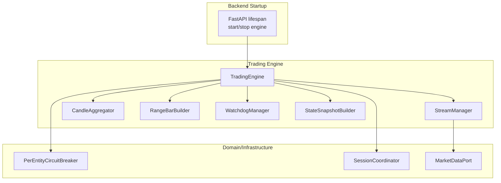

**Diagram sources**
- [main.py:83-127](file://backend/app/main.py#L83-L127)
- [engine.py:73-126](file://backend/app/application/engine.py#L73-L126)
- [stream_manager.py:32-47](file://backend/app/application/stream_manager.py#L32-L47)
- [candle_aggregator.py:73-86](file://backend/app/application/candle_aggregator.py#L73-L86)
- [watchdog_manager.py:34-46](file://backend/app/application/watchdog_manager.py#L34-L46)
- [state_snapshot_builder.py:22-72](file://backend/app/application/services/state_snapshot_builder.py#L22-L72)

**Section sources**
- [main.py:83-127](file://backend/app/main.py#L83-L127)
- [engine.py:73-126](file://backend/app/application/engine.py#L73-L126)

## Core Components
- TradingEngine: central coordinator, lifecycle manager, per-symbol state, throttling, notifications, mid-trade recovery, and cross-thread signaling
- StreamManager: dual-stream (full + depth) with reconnection, polling fallback, and staleness detection
- CandleAggregator: OHLCV aggregation, VWAP, delta, footprint accumulation
- WatchdogManager: SL/TP enforcement, stale stream detection, periodic GC
- StateSnapshotBuilder: deterministic DTO projection of session state for UI

**Section sources**
- [engine.py:59-126](file://backend/app/application/engine.py#L59-L126)
- [stream_manager.py:32-47](file://backend/app/application/stream_manager.py#L32-L47)
- [candle_aggregator.py:73-86](file://backend/app/application/candle_aggregator.py#L73-L86)
- [watchdog_manager.py:34-46](file://backend/app/application/watchdog_manager.py#L34-L46)
- [state_snapshot_builder.py:22-72](file://backend/app/application/services/state_snapshot_builder.py#L22-L72)

## Architecture Overview
The engine’s runtime is a continuous loop that:
- Streams ticks with reconnection and fallback
- Aggregates candles and computes derived metrics
- Calls the session coordinator to process the tick and compute state
- Updates per-symbol state snapshots and notifies viewers
- Runs watchdogs for SL/TP and stream health
- Applies throttling and circuit breaker protections

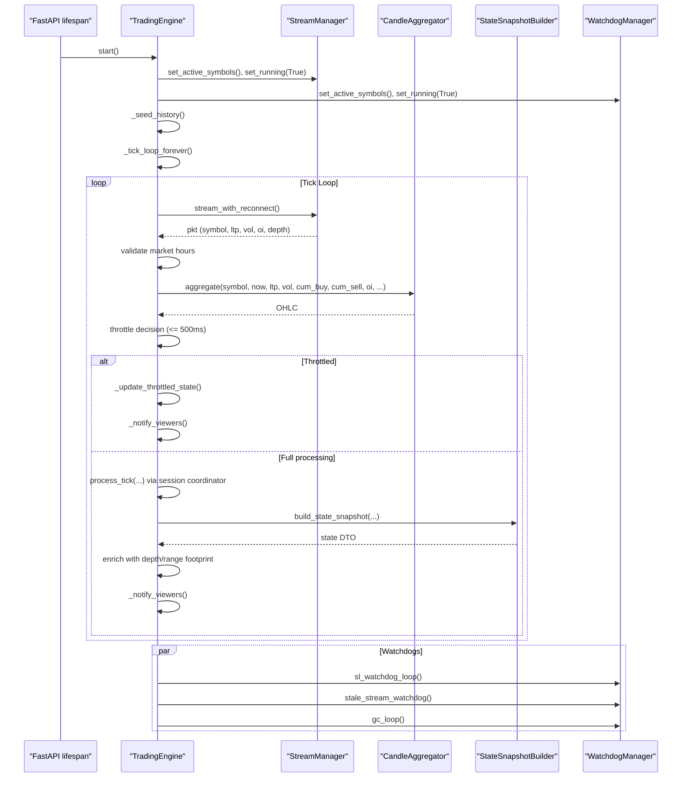

**Diagram sources**
- [main.py:108-126](file://backend/app/main.py#L108-L126)
- [engine.py:131-177](file://backend/app/application/engine.py#L131-L177)
- [engine.py:620-862](file://backend/app/application/engine.py#L620-L862)
- [stream_manager.py:135-294](file://backend/app/application/stream_manager.py#L135-L294)
- [candle_aggregator.py:114-256](file://backend/app/application/candle_aggregator.py#L114-L256)
- [state_snapshot_builder.py:22-72](file://backend/app/application/services/state_snapshot_builder.py#L22-L72)
- [watchdog_manager.py:63-175](file://backend/app/application/watchdog_manager.py#L63-L175)

## Detailed Component Analysis

### TradingEngine
Responsibilities:
- Lifecycle: start/stop, seed history, mid-trade recovery, graceful shutdown
- Tick loop: stream, aggregate, throttle, notify, and circuit breaker
- Per-symbol state: latest state snapshots, generation counter, async condition, per-symbol locks
- Cross-thread notifications: capture event loop and schedule notifications from background threads
- Delegation: StreamManager, CandleAggregator, WatchdogManager, RangeBarBuilder, StateSnapshotBuilder

Key behaviors:
- Start initializes active symbols, per-symbol state, and spawns stream/watchdog tasks
- Tick loop validates market hours, demultiplexes packets, updates OI, merges depth, aggregates candles, throttles processing, and calls session coordinator
- Throttling: limits process_tick to once every 500 ms per symbol; updates a minimal state for viewers in between
- Notifications: 150 ms minimum throttle for viewer updates; uses asyncio.Condition and generation counter
- Mid-trade recovery: loads open positions from storage on startup and registers them with lifecycle
- Circuit breaker: per-symbol state machine integrated around processing failures

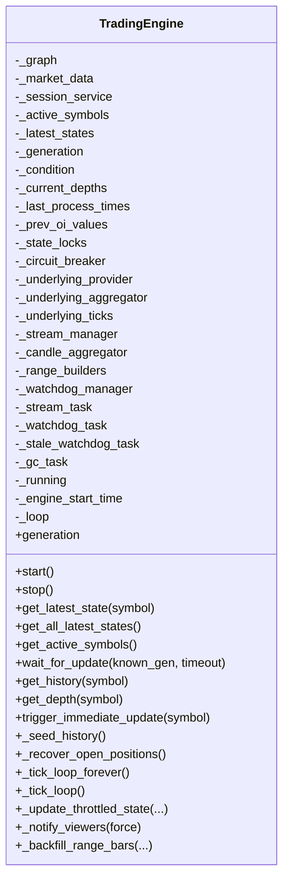

**Diagram sources**
- [engine.py:59-126](file://backend/app/application/engine.py#L59-L126)
- [engine.py:131-208](file://backend/app/application/engine.py#L131-L208)
- [engine.py:281-358](file://backend/app/application/engine.py#L281-L358)
- [engine.py:620-862](file://backend/app/application/engine.py#L620-L862)
- [engine.py:867-933](file://backend/app/application/engine.py#L867-L933)
- [engine.py:934-981](file://backend/app/application/engine.py#L934-L981)

**Section sources**
- [engine.py:59-126](file://backend/app/application/engine.py#L59-L126)
- [engine.py:131-208](file://backend/app/application/engine.py#L131-L208)
- [engine.py:281-358](file://backend/app/application/engine.py#L281-L358)
- [engine.py:620-862](file://backend/app/application/engine.py#L620-L862)
- [engine.py:867-933](file://backend/app/application/engine.py#L867-L933)
- [engine.py:934-981](file://backend/app/application/engine.py#L934-L981)

### StreamManager
Responsibilities:
- Dual-stream: full quotes plus depth (20 levels) where supported
- Reconnection with exponential backoff and a cooldown between attempts
- Polling fallback for symbols that do not arrive via WebSocket (e.g., MCX options)
- Staleness detection and switching to polling mode after initial timeout
- Tick counting and last tick time tracking

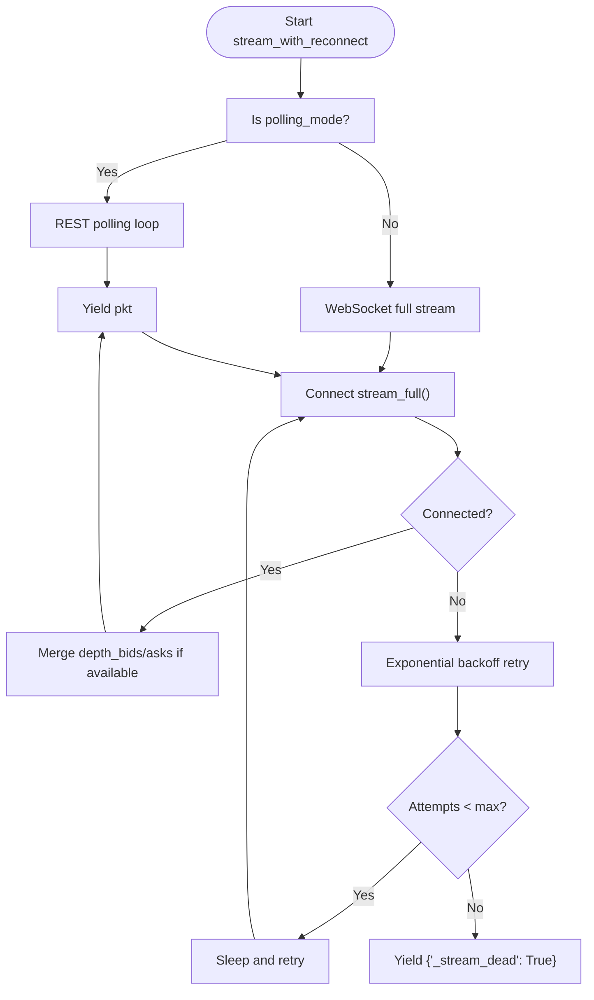

**Diagram sources**
- [stream_manager.py:135-294](file://backend/app/application/stream_manager.py#L135-L294)

**Section sources**
- [stream_manager.py:32-47](file://backend/app/application/stream_manager.py#L32-L47)
- [stream_manager.py:135-294](file://backend/app/application/stream_manager.py#L135-L294)

### CandleAggregator
Responsibilities:
- Tick-to-candle aggregation with contextual caps for resets
- Volume, buy/sell volume, VWAP computation
- Delta classification (Lee-Ready or body-ratio proxy)
- Footprint accumulation per candle

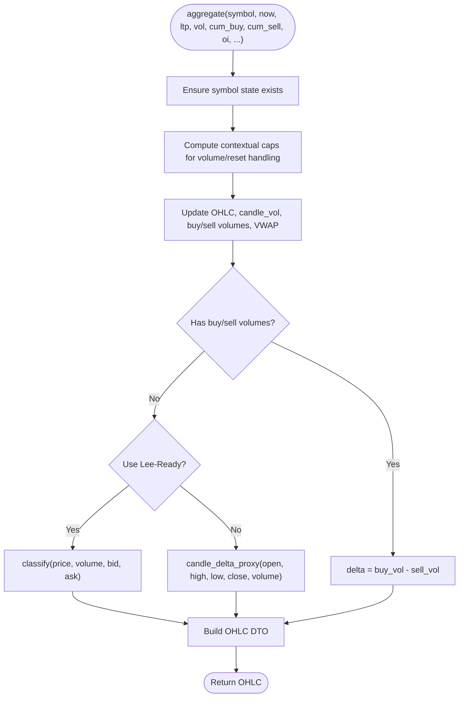

**Diagram sources**
- [candle_aggregator.py:114-256](file://backend/app/application/candle_aggregator.py#L114-L256)

**Section sources**
- [candle_aggregator.py:73-86](file://backend/app/application/candle_aggregator.py#L73-L86)
- [candle_aggregator.py:114-256](file://backend/app/application/candle_aggregator.py#L114-L256)
- [candle_aggregator.py:258-301](file://backend/app/application/candle_aggregator.py#L258-L301)

### WatchdogManager
Responsibilities:
- SL/TP watchdog: evaluates open positions against cached LTP even when stream is disconnected
- Stale stream watchdog: detects and recovers from hung streams; switches to polling if WS never delivers ticks
- Periodic GC: runs every 30 minutes to prevent memory leaks

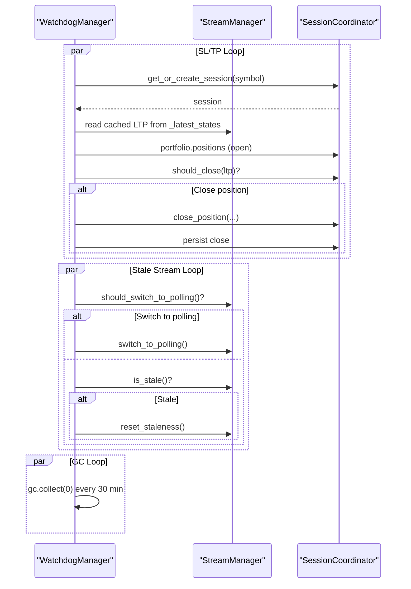

**Diagram sources**
- [watchdog_manager.py:63-175](file://backend/app/application/watchdog_manager.py#L63-L175)

**Section sources**
- [watchdog_manager.py:34-46](file://backend/app/application/watchdog_manager.py#L34-L46)
- [watchdog_manager.py:63-175](file://backend/app/application/watchdog_manager.py#L63-L175)

### StateSnapshotBuilder
Responsibilities:
- Pure DTO formatting for UI consumption
- Extracts portfolio, stats, AI/AMT/RL/Agent signals, risk state, and explainability metrics

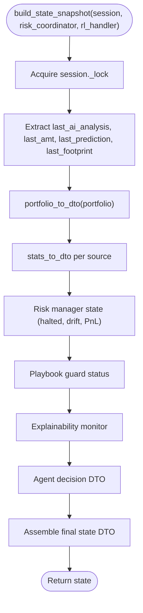

**Diagram sources**
- [state_snapshot_builder.py:22-72](file://backend/app/application/services/state_snapshot_builder.py#L22-L72)

**Section sources**
- [state_snapshot_builder.py:22-72](file://backend/app/application/services/state_snapshot_builder.py#L22-L72)

### Lifecycle Management (start/stop)
- start(): sets running state, initializes delegated modules, seeds history, recovers positions, and launches tasks
- stop(): cancels all tasks and logs graceful shutdown

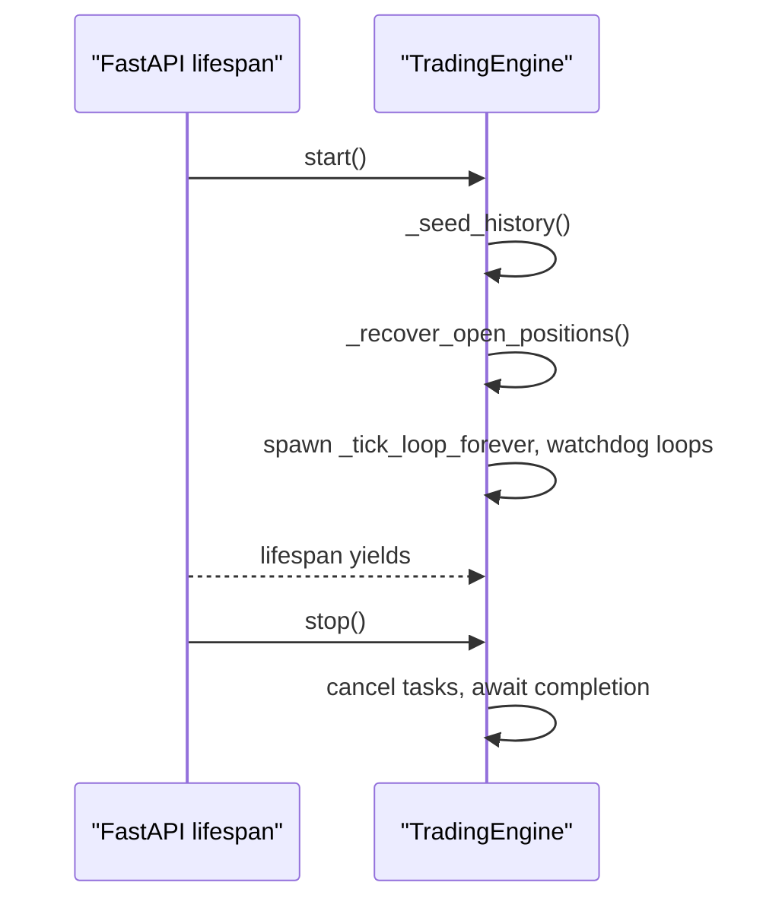

**Diagram sources**
- [main.py:108-126](file://backend/app/main.py#L108-L126)
- [engine.py:131-177](file://backend/app/application/engine.py#L131-L177)
- [engine.py:178-208](file://backend/app/application/engine.py#L178-L208)

**Section sources**
- [main.py:108-126](file://backend/app/main.py#L108-L126)
- [engine.py:131-177](file://backend/app/application/engine.py#L131-L177)
- [engine.py:178-208](file://backend/app/application/engine.py#L178-L208)

### Per-Symbol State Management
- _latest_states: per-symbol state snapshots for UI
- _state_locks: per-symbol thread locks for safe updates
- _generation + asyncio.Condition: generation counter and broadcast to viewers
- _last_process_times: throttle control per symbol
- _current_depths: cached order book for visualization
- _prev_oi_values: OI change tracking

**Section sources**
- [engine.py:79-94](file://backend/app/application/engine.py#L79-L94)
- [engine.py:209-262](file://backend/app/application/engine.py#L209-L262)
- [engine.py:867-911](file://backend/app/application/engine.py#L867-L911)

### Circuit Breaker Patterns
- Per-entity circuit breaker: records success/failure per symbol; used around processing to prevent cascading failures
- Domain-level circuit breakers: non-overridable hard locks (consecutive losses, daily drawdown, profit target) evaluated by risk coordinator

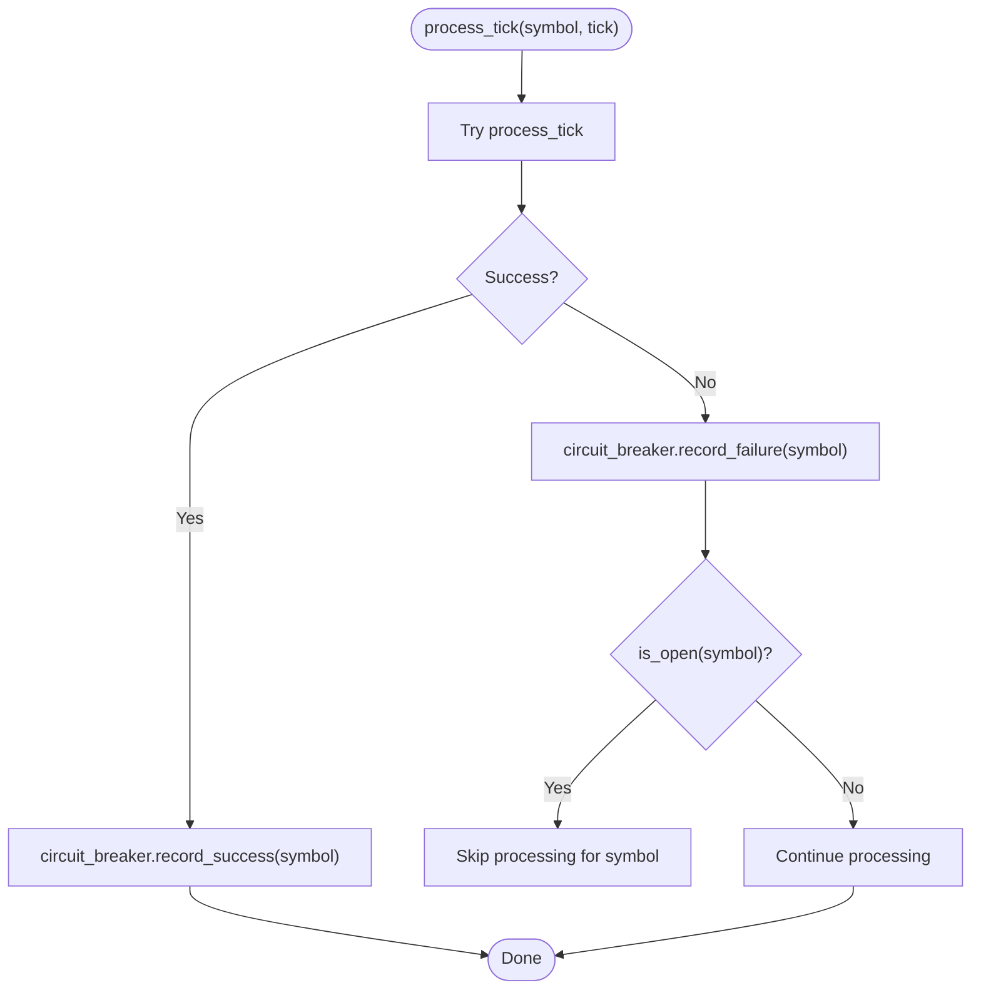

**Diagram sources**
- [engine.py:849-856](file://backend/app/application/engine.py#L849-L856)

**Section sources**
- [engine.py:95-98](file://backend/app/application/engine.py#L95-L98)
- [engine.py:849-856](file://backend/app/application/engine.py#L849-L856)
- [circuit_breakers.py:44-105](file://backend/app/domain/services/circuit_breakers.py#L44-L105)

### Mid-Trade Recovery Mechanisms
- On startup, engine queries storage for open positions
- Validates exchange affinity and restores positions into portfolio
- Registers positions with lifecycle handler for overseer and trade management

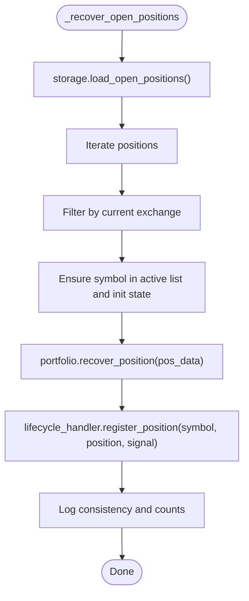

**Diagram sources**
- [engine.py:431-576](file://backend/app/application/engine.py#L431-L576)

**Section sources**
- [engine.py:431-576](file://backend/app/application/engine.py#L431-L576)

### Throttling Strategies
- Processing throttle: process_tick invoked at most once every 500 ms per symbol
- Viewer notification throttle: at least 150 ms between notifications to reduce UI churn
- Depth updates: cached depth merged into packets when available

**Section sources**
- [engine.py:768-778](file://backend/app/application/engine.py#L768-L778)
- [engine.py:916-933](file://backend/app/application/engine.py#L916-L933)
- [stream_manager.py:149-177](file://backend/app/application/stream_manager.py#L149-L177)

### Notification Systems and Cross-Thread Communication
- Async condition + generation counter: viewers wait for generation to advance
- trigger_immediate_update: builds a fresh state snapshot and schedules notification from any thread using the stored event loop reference
- call_soon_threadsafe: safe cross-thread scheduling

**Section sources**
- [engine.py:251-262](file://backend/app/application/engine.py#L251-L262)
- [engine.py:281-358](file://backend/app/application/engine.py#L281-L358)
- [engine.py:916-933](file://backend/app/application/engine.py#L916-L933)

### Market Hours Gate
- is_market_open: enforces exchange-specific trading hours and prevents processing outside market time

**Section sources**
- [utils.py:98-124](file://backend/app/application/utils.py#L98-L124)
- [engine.py:651-652](file://backend/app/application/engine.py#L651-L652)

## Dependency Analysis
- TradingEngine depends on:
  - StreamManager for market data
  - CandleAggregator for OHLCV and derived metrics
  - WatchdogManager for SL/TP and stream health
  - StateSnapshotBuilder for UI DTOs
  - PerEntityCircuitBreaker for per-symbol resilience
  - SessionCoordinator for process_tick and portfolio operations

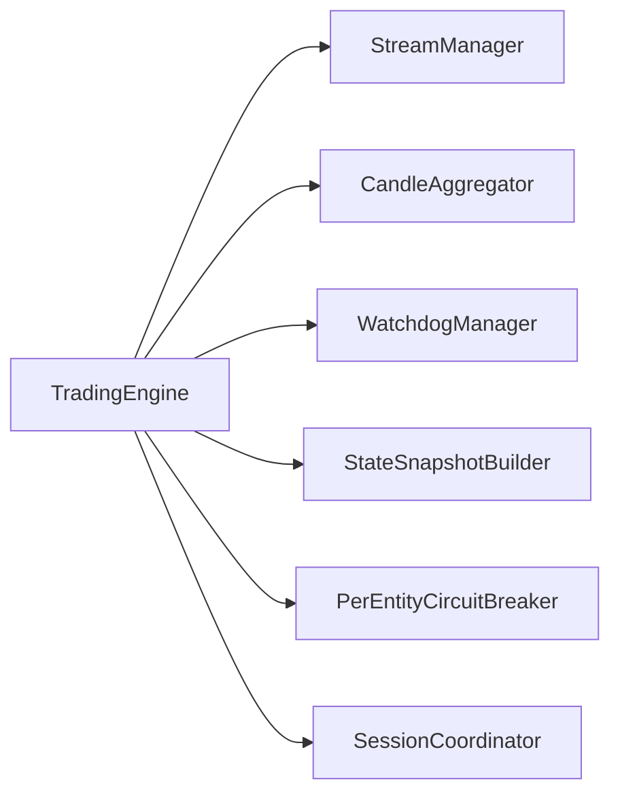

**Diagram sources**
- [engine.py:108-116](file://backend/app/application/engine.py#L108-L116)
- [engine.py:296-307](file://backend/app/application/engine.py#L296-L307)

**Section sources**
- [engine.py:108-116](file://backend/app/application/engine.py#L108-L116)
- [engine.py:296-307](file://backend/app/application/engine.py#L296-L307)

## Performance Considerations
- Throttling reduces CPU load by limiting full processing to ~2 Hz per symbol
- Asynchronous design avoids blocking the event loop; heavy work is offloaded to threads where appropriate
- Watchdog GC runs periodically to mitigate memory growth in long sessions
- Depth caching minimizes repeated parsing and reduces UI update frequency

## Troubleshooting Guide
Common issues and diagnostics:
- Market data disconnections: Watchdog stale stream watchdog will cancel the stream and trigger reconnection; if no ticks arrive within the initial grace period, engine switches to polling mode
- Processing failures: Per-entity circuit breaker opens after repeated failures; subsequent ticks are skipped until recovery
- Frontend not updating: Verify generation counter and notify throttling; ensure trigger_immediate_update is called from background threads using the stored event loop reference
- Startup positions missing: Confirm storage availability and exchange filtering in mid-trade recovery

**Section sources**
- [watchdog_manager.py:130-175](file://backend/app/application/watchdog_manager.py#L130-L175)
- [engine.py:663-664](file://backend/app/application/engine.py#L663-L664)
- [engine.py:281-358](file://backend/app/application/engine.py#L281-L358)
- [engine.py:431-576](file://backend/app/application/engine.py#L431-L576)

## Conclusion
The TradingEngine is a robust, resilient orchestrator that operates independently of frontend connectivity. It integrates streaming, aggregation, state management, and protective mechanisms into a cohesive pipeline. Its design emphasizes:
- Resilience: reconnection, fallback, circuit breakers, and watchdogs
- Efficiency: throttling and asynchronous processing
- Observability: generation counters, notifications, and detailed logs
- Safety: mid-trade recovery and non-overridable domain-level circuit breakers