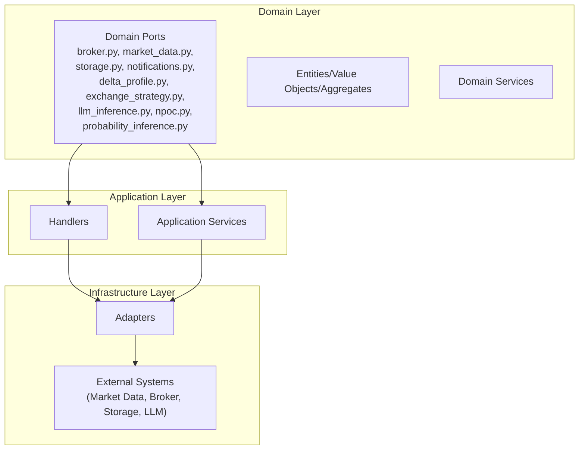
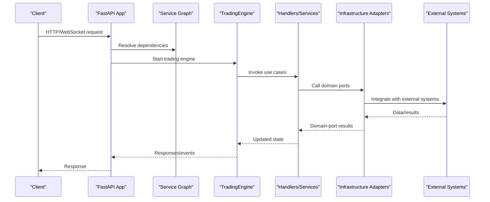
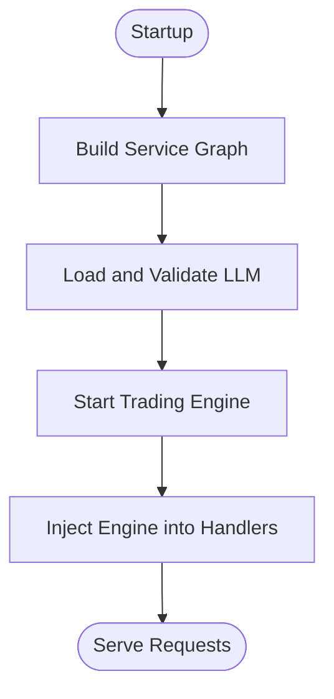
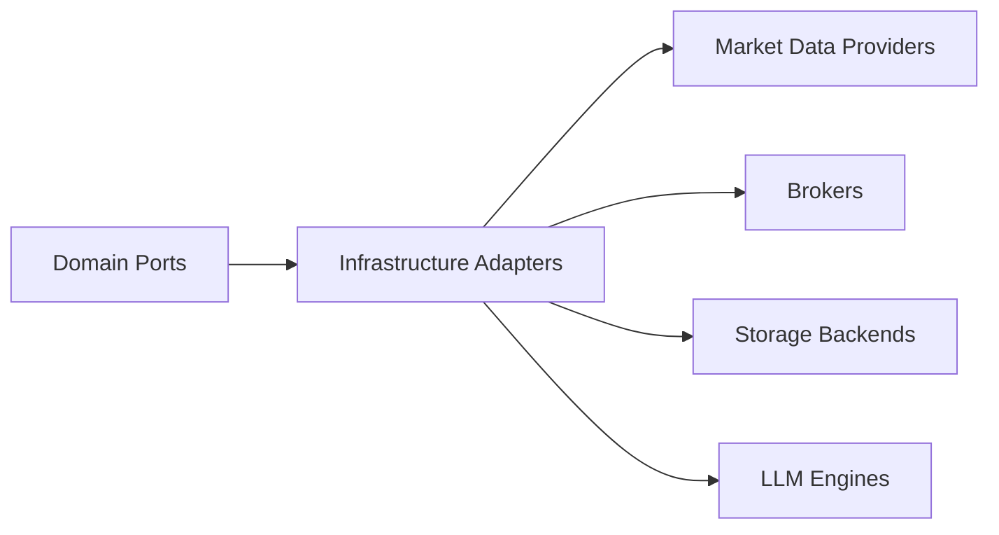
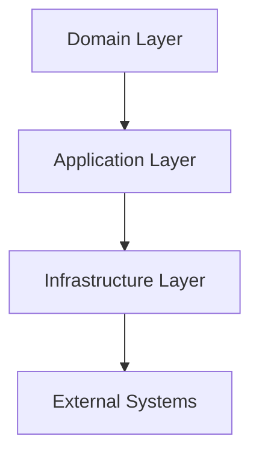

# Clean Architecture Layers

<cite>
**Referenced Files in This Document**
- [backend/app/main.py](file://backend/app/main.py)
- [backend/app/config.py](file://backend/app/config.py)
- [backend/app/domain/ports/__init__.py](file://backend/app/domain/ports/__init__.py)
- [backend/app/domain/ports/broker.py](file://backend/app/domain/ports/broker.py)
- [backend/app/domain/ports/market_data.py](file://backend/app/domain/ports/market_data.py)
- [backend/app/domain/ports/storage.py](file://backend/app/domain/ports/storage.py)
- [backend/app/domain/ports/notifications.py](file://backend/app/domain/ports/notifications.py)
- [backend/app/domain/ports/delta_profile.py](file://backend/app/domain/ports/delta_profile.py)
- [backend/app/domain/ports/exchange_strategy.py](file://backend/app/domain/ports/exchange_strategy.py)
- [backend/app/domain/ports/llm_inference.py](file://backend/app/domain/ports/llm_inference.py)
- [backend/app/domain/ports/npoc.py](file://backend/app/domain/ports/npoc.py)
- [backend/app/domain/ports/probability_inference.py](file://backend/app/domain/ports/probability_inference.py)
- [backend/app/infrastructure/adapters/__init__.py](file://backend/app/infrastructure/adapters/__init__.py)
- [backend/app/application/services/__init__.py](file://backend/app/application/services/__init__.py)
</cite>

## Table of Contents
1. [Introduction](#introduction)
2. [Project Structure](#project-structure)
3. [Core Components](#core-components)
4. [Architecture Overview](#architecture-overview)
5. [Detailed Component Analysis](#detailed-component-analysis)
6. [Dependency Analysis](#dependency-analysis)
7. [Performance Considerations](#performance-considerations)
8. [Troubleshooting Guide](#troubleshooting-guide)
9. [Conclusion](#conclusion)

## Introduction
This document explains the three-layer clean architecture implemented in the backend. It focuses on:
- Layer 1 (Domain): Pure business logic with entities, value objects, aggregates, and error hierarchies.
- Layer 2 (Application): Orchestration of use cases without domain rules, including handlers and services.
- Layer 3 (Infrastructure): Implementations of external integrations via adapters.

It also documents the dependency inversion principle (infrastructure depends on application, which depends on domain), the service graph dependency injection pattern, port/adapter architecture, and how each layer maintains separation of concerns. Finally, it enumerates the 11 domain ports/interfaces and their responsibilities.

## Project Structure
The backend follows a layered structure:
- Domain: Ports (interfaces), entities/value objects/aggregates, and domain services.
- Application: Handlers and services that orchestrate use cases.
- Infrastructure: Adapters implementing domain ports and integrating with external systems.

**Diagram sources**
- [backend/app/domain/ports/__init__.py:1-2](file://backend/app/domain/ports/__init__.py#L1-L2)
- [backend/app/application/services/__init__.py:1-2](file://backend/app/application/services/__init__.py#L1-L2)
- [backend/app/infrastructure/adapters/__init__.py:1-2](file://backend/app/infrastructure/adapters/__init__.py#L1-L2)

**Section sources**
- [backend/app/main.py:1-227](file://backend/app/main.py#L1-L227)
- [backend/app/config.py:1-157](file://backend/app/config.py#L1-L157)

## Core Components
This section outlines the three layers and how they interact.

- Domain Layer
  - Contains pure business abstractions (ports/interfaces) and domain models.
  - Defines error contracts and guarantees for infrastructure implementations.
  - Provides entities, value objects, and aggregates used across the system.

- Application Layer
  - Orchestrates use cases without embedding domain rules.
  - Composed of handlers and services that depend on domain ports.
  - Implements the service graph pattern for dependency injection.

- Infrastructure Layer
  - Implements domain ports via adapters.
  - Integrates with external systems (market data feeds, brokers, storage, LLMs).
  - Depends on application and domain ports, not on application logic.

Key architectural principles:
- Dependency Inversion: Infrastructure depends on application; application depends on domain.
- Port/Adapter: Domain defines ports; infrastructure provides adapters.
- Separation of Concerns: Domain is free of external concerns; Application coordinates; Infrastructure handles integrations.

**Section sources**
- [backend/app/domain/ports/__init__.py:1-2](file://backend/app/domain/ports/__init__.py#L1-L2)
- [backend/app/application/services/__init__.py:1-2](file://backend/app/application/services/__init__.py#L1-L2)
- [backend/app/infrastructure/adapters/__init__.py:1-2](file://backend/app/infrastructure/adapters/__init__.py#L1-L2)

## Architecture Overview
The system initializes a service graph at startup and wires domain ports to infrastructure adapters. The trading engine and handlers consume the graph to process market data, run inference, and coordinate trades.

**Diagram sources**
- [backend/app/main.py:83-170](file://backend/app/main.py#L83-L170)

**Section sources**
- [backend/app/main.py:1-227](file://backend/app/main.py#L1-L227)

## Detailed Component Analysis

### Domain Layer: Ports and Contracts
The Domain defines 11 ports/interfaces that encapsulate external concerns. These ports are the foundation of dependency inversion and enable interchangeable implementations.

- Broker Port
  - Responsibilities: Execute orders and cancel orders.
  - Inputs: Signal, Portfolio, Symbol.
  - Outputs: New Position or None.

- Market Data Port
  - Responsibilities: Historical data, LTP, order book, live streams, candidate scanning.
  - Error contract: Returns defaults for missing data; raises on failures.
  - Lifecycle hooks: Initialization and close.

- Storage Port
  - Responsibilities: Persist ticks, trades, LLM decisions, positions, events; query history.
  - Sub-ports: TickStoragePort, TradeStoragePort, DecisionStoragePort, OpenPositionStoragePort, PositionEventStoragePort.

- Notifications Port
  - Responsibilities: Send asynchronous and synchronous alerts.
  - Constraints: Non-blocking for tick processing.

- Delta Profile Port
  - Responsibilities: Maintain delta-colored volume profile; detect high delta zones; reset.
  - Data contracts: DeltaBucket and DeltaProfile value objects.

- Exchange Strategy Port
  - Responsibilities: Encapsulate exchange-specific thresholds, windows, and rules.
  - Methods: Config, session times, thresholds, EIA windows, symbol exchange resolution.

- LLM Inference Port
  - Responsibilities: Run inference, readiness checks, validation, blocking wait.
  - Error: LLMNotReadyError for premature inference.

- NPOC Port
  - Responsibilities: Track naked previous session POCs; fill on revisit; load from storage.
  - Data contracts: NPOCRecord and NPOCResult value objects.

- Probability Inference Port
  - Responsibilities: First-passage probability estimates; readiness.
  - NoOp adapter: Neutral estimates when model is not trained.

```mermaid
classDiagram
class BrokerPort {
+execute_order(signal, portfolio, symbol) Position|None
+cancel_order(order_id) bool
}
class MarketDataPort {
+ensure_initialized_sync(timeout)
+close_sync()
+scan_candidates(limit) str[]
+fetch_history(symbol, interval, limit) OHLC[]
+fetch_order_book(symbol) OrderBook|None
+get_ltp(symbol) float
+stream_full(symbols) AsyncIterator~dict~
+stream_depth_20(symbols) AsyncIterator~Any~
+get_option_chain(underlying, exchange, expiry_index) Any
}
class StoragePort {
+save_tick(symbol, tick_data)
+query_ticks(symbol, start, end, limit)
+save_trade(trade_data)
+query_trades(start, end)
+save_llm_decision(decision_data)
+query_llm_decisions(start, end)
+save_performance_snapshot(snapshot)
+save_session_profile(profile_data)
+get_previous_session_profile(symbol, market) dict|None
+get_recent_trades(limit)
+save_position_event(event)
+query_position_events(position_id, symbol)
}
class NotificationPort {
+send(message, level) None
+send_sync(message, level) None
}
class DeltaProfilePort {
+update(price, ask_vol, bid_vol) None
+get_profile() DeltaBucket[]
+get_high_delta_zones(direction, sigma_mult) float[]
+reset() None
}
class ExchangeStrategy {
+config ExchangeConfig
+name str
+get_cvd_block_threshold() float
+get_warm_up_minutes() int
+get_aggression_sigma() float
+get_displacement_multiplier() float
+get_balance_ratio_threshold() float
+get_big_trade_multiplier() float
+get_llm_instruction() str
+is_eia_window(symbol, ist_dt) bool
+get_session_close_time() (int,int)
+get_session_open_time() (int,int)
+is_underlying(symbol) bool
+get_symbol_exchange(symbol, registry) str
}
class LLMInferencePort {
+predict(instruction, input_text, temperature, max_tokens, prefill) str
+is_ready() bool
+wait_until_ready(timeout) bool
+validate() bool
}
class NPOCPort {
+add_session_poc(underlying, date, poc) None
+check_and_fill(underlying, current_price, tick_size) str[]
+get_active_npocs(underlying, current_price, lookback_days) NPOCResult
+load_from_storage(underlying) None
}
class ProbabilityInferencePort {
+estimate(features) ProbabilityEstimate
+is_ready() bool
}
```

**Diagram sources**
- [backend/app/domain/ports/broker.py:11-27](file://backend/app/domain/ports/broker.py#L11-L27)
- [backend/app/domain/ports/market_data.py:19-112](file://backend/app/domain/ports/market_data.py#L19-L112)
- [backend/app/domain/ports/storage.py:54-121](file://backend/app/domain/ports/storage.py#L54-L121)
- [backend/app/domain/ports/notifications.py:6-22](file://backend/app/domain/ports/notifications.py#L6-L22)
- [backend/app/domain/ports/delta_profile.py:37-75](file://backend/app/domain/ports/delta_profile.py#L37-L75)
- [backend/app/domain/ports/exchange_strategy.py:21-105](file://backend/app/domain/ports/exchange_strategy.py#L21-L105)
- [backend/app/domain/ports/llm_inference.py:10-42](file://backend/app/domain/ports/llm_inference.py#L10-L42)
- [backend/app/domain/ports/npoc.py:29-57](file://backend/app/domain/ports/npoc.py#L29-L57)
- [backend/app/domain/ports/probability_inference.py:19-44](file://backend/app/domain/ports/probability_inference.py#L19-L44)

**Section sources**
- [backend/app/domain/ports/broker.py:1-27](file://backend/app/domain/ports/broker.py#L1-L27)
- [backend/app/domain/ports/market_data.py:1-112](file://backend/app/domain/ports/market_data.py#L1-L112)
- [backend/app/domain/ports/storage.py:1-121](file://backend/app/domain/ports/storage.py#L1-L121)
- [backend/app/domain/ports/notifications.py:1-22](file://backend/app/domain/ports/notifications.py#L1-L22)
- [backend/app/domain/ports/delta_profile.py:1-75](file://backend/app/domain/ports/delta_profile.py#L1-L75)
- [backend/app/domain/ports/exchange_strategy.py:1-105](file://backend/app/domain/ports/exchange_strategy.py#L1-L105)
- [backend/app/domain/ports/llm_inference.py:1-42](file://backend/app/domain/ports/llm_inference.py#L1-L42)
- [backend/app/domain/ports/npoc.py:1-57](file://backend/app/domain/ports/npoc.py#L1-L57)
- [backend/app/domain/ports/probability_inference.py:1-44](file://backend/app/domain/ports/probability_inference.py#L1-L44)

### Application Layer: Handlers and Services
The Application layer orchestrates use cases without embedding domain rules. It depends on domain ports and composes application services and handlers. The service graph is created at startup and injected into runtime components.

- Service Graph Pattern
  - Created once at startup.
  - Wires domain ports to infrastructure adapters.
  - Provides centralized access to all collaborators.

- Trading Engine and Session Management
  - Starts and coordinates trading lifecycle.
  - Injects engine references into handlers for UI updates.

- Configuration
  - Settings consolidate environment-driven configuration and expose computed values.

**Diagram sources**
- [backend/app/main.py:83-127](file://backend/app/main.py#L83-L127)
- [backend/app/config.py:26-157](file://backend/app/config.py#L26-L157)

**Section sources**
- [backend/app/main.py:1-227](file://backend/app/main.py#L1-L227)
- [backend/app/config.py:1-157](file://backend/app/config.py#L1-L157)

### Infrastructure Layer: Adapters and External Integrations
The Infrastructure layer implements domain ports via adapters. It integrates with external systems such as market data providers, brokers, storage backends, and LLM inference engines.

- Adapters Module
  - Houses implementations of domain ports.
  - Provides concrete behavior for market data, broker execution, storage persistence, notifications, and inference.

- External Systems
  - Market Data: WebSocket feeds, historical APIs, order book snapshots.
  - Broker: Paper/live execution adapters.
  - Storage: Persistent stores for ticks, trades, decisions, positions, events.
  - LLM: Model backends with readiness and validation.

**Diagram sources**
- [backend/app/infrastructure/adapters/__init__.py:1-2](file://backend/app/infrastructure/adapters/__init__.py#L1-L2)

**Section sources**
- [backend/app/infrastructure/adapters/__init__.py:1-2](file://backend/app/infrastructure/adapters/__init__.py#L1-L2)

## Dependency Analysis
Clean architecture enforces strict dependency directions:
- Domain depends on nothing external.
- Application depends on Domain ports.
- Infrastructure depends on Application and Domain ports.

- Dependency Inversion Principle
  - Domain defines ports; Infrastructure implements them.
  - Application composes domain ports; Infrastructure provides implementations.
  - This prevents external concerns from leaking into the domain.

- Port/Adapter Architecture
  - Each domain port corresponds to a concrete adapter in Infrastructure.
  - Adapters translate between domain abstractions and external APIs.

- Service Graph Injection
  - The service graph is constructed at startup and passed to the trading engine and handlers.
  - This centralizes wiring and enables testability via mock adapters.

**Section sources**
- [backend/app/main.py:83-127](file://backend/app/main.py#L83-L127)
- [backend/app/domain/ports/__init__.py:1-2](file://backend/app/domain/ports/__init__.py#L1-L2)
- [backend/app/application/services/__init__.py:1-2](file://backend/app/application/services/__init__.py#L1-L2)
- [backend/app/infrastructure/adapters/__init__.py:1-2](file://backend/app/infrastructure/adapters/__init__.py#L1-L2)

## Performance Considerations
- Startup Latency
  - LLM model loading and validation occur during startup; the server waits up to a configured timeout.
  - Consider preloading models and caching warm-up steps to reduce cold-start delays.

- Throughput and Concurrency
  - Asynchronous market data streaming and inference calls improve throughput.
  - Ensure adapters implement efficient buffering and backpressure to avoid overwhelming downstream systems.

- Persistence and Batch Writes
  - Use batched writes for ticks and events to minimize I/O overhead.
  - Implement periodic flushes and graceful shutdown routines to prevent data loss.

- Rate Limiting
  - Built-in HTTP rate limiting protects internal services from overload.

[No sources needed since this section provides general guidance]

## Troubleshooting Guide
Common issues and remedies:
- LLM Not Ready
  - Symptom: Inference attempts fail early in startup.
  - Action: Verify model paths and readiness checks; ensure wait_until_ready completes before serving traffic.

- Market Data Disconnections
  - Symptom: Streaming halts or returns errors.
  - Action: Confirm adapter lifecycle hooks (initialize/close) and reconnection logic.

- Storage Failures
  - Symptom: Persistence calls raise exceptions.
  - Action: Validate adapter implementations and storage backends; confirm query limits and transaction boundaries.

- Broker Rejections
  - Symptom: Orders not executed; returns None.
  - Action: Inspect adapter logs and broker responses; validate order parameters and account permissions.

- Notification Delays
  - Symptom: Alerts delayed or lost.
  - Action: Ensure adapters implement non-blocking send semantics; monitor queue depths.

**Section sources**
- [backend/app/main.py:88-107](file://backend/app/main.py#L88-L107)
- [backend/app/domain/ports/llm_inference.py:6-42](file://backend/app/domain/ports/llm_inference.py#L6-L42)
- [backend/app/domain/ports/market_data.py:26-38](file://backend/app/domain/ports/market_data.py#L26-L38)
- [backend/app/domain/ports/storage.py:63-121](file://backend/app/domain/ports/storage.py#L63-L121)
- [backend/app/domain/ports/notifications.py:9-22](file://backend/app/domain/ports/notifications.py#L9-L22)

## Conclusion
The backend implements a robust three-layer clean architecture:
- Domain ports define the system’s capabilities and contracts.
- Application orchestrates use cases via the service graph and dependency injection.
- Infrastructure adapts external systems to domain abstractions.

This design ensures maintainability, testability, and scalability while keeping domain logic pure and independent of external concerns.