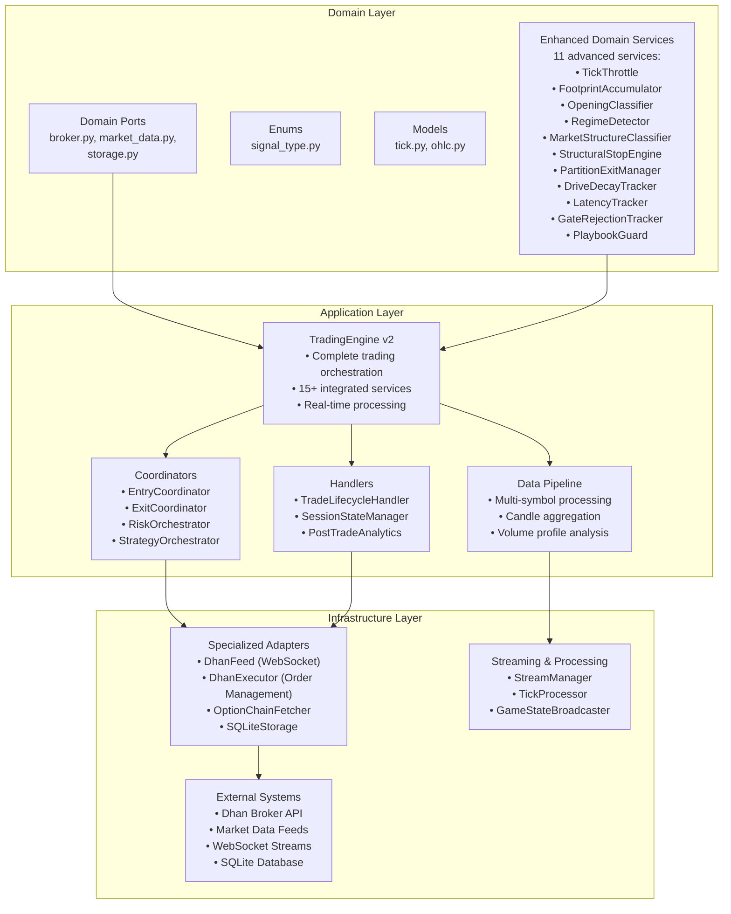
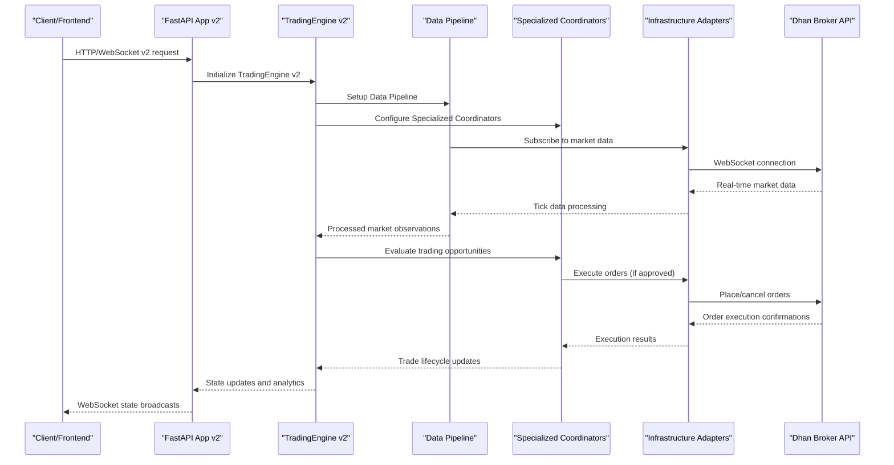
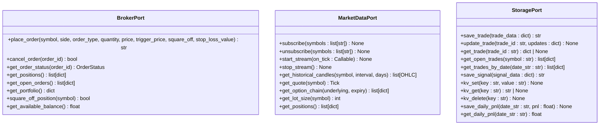
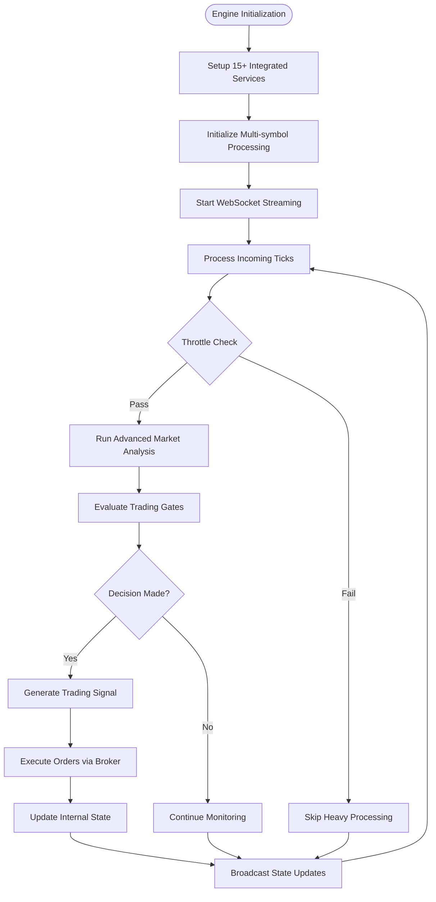
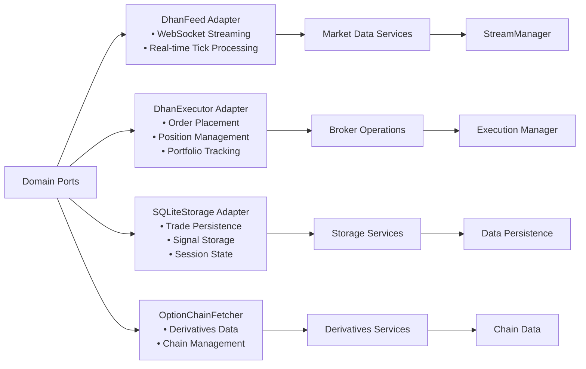
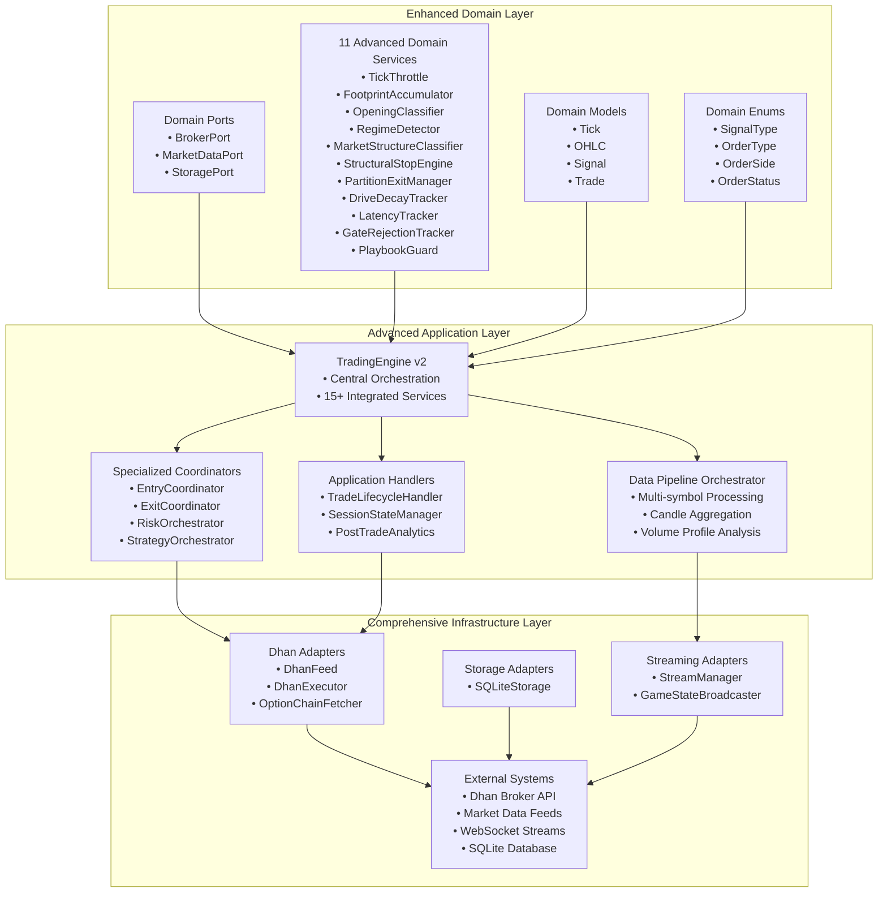

# Clean Architecture Layers

<cite>
**Referenced Files in This Document**
- [appv2/backend/appv2/main.py](file://appv2/backend/appv2/main.py)
- [appv2/backend/appv2/domain/ports/broker.py](file://appv2/backend/appv2/domain/ports/broker.py)
- [appv2/backend/appv2/domain/ports/market_data.py](file://appv2/backend/appv2/domain/ports/market_data.py)
- [appv2/backend/appv2/domain/ports/storage.py](file://appv2/backend/appv2/domain/ports/storage.py)
- [appv2/backend/appv2/application/trading_engine.py](file://appv2/backend/appv2/application/trading_engine.py)
- [appv2/backend/appv2/application/data_pipeline.py](file://appv2/backend/appv2/application/data_pipeline.py)
- [appv2/backend/appv2/infrastructure/dhan_feed.py](file://appv2/backend/appv2/infrastructure/dhan_feed.py)
- [appv2/backend/appv2/infrastructure/dhan_executor.py](file://appv2/backend/appv2/infrastructure/dhan_executor.py)
- [appv2/backend/appv2/infrastructure/sqlite_storage.py](file://appv2/backend/appv2/infrastructure/sqlite_storage.py)
- [appv2/backend/appv2/infrastructure/option_chain_fetcher.py](file://appv2/backend/appv2/infrastructure/option_chain_fetcher.py)
- [appv2/backend/appv2/infrastructure/stream_manager.py](file://appv2/backend/appv2/infrastructure/stream_manager.py)
- [appv2/backend/appv2/infrastructure/tick_processor.py](file://appv2/backend/appv2/infrastructure/tick_processor.py)
- [appv2/backend/appv2/api/state_broadcaster.py](file://appv2/backend/appv2/api/state_broadcaster.py)
- [appv2/backend/appv2/domain/enums/signal_type.py](file://appv2/backend/appv2/domain/enums/signal_type.py)
- [appv2/backend/appv2/domain/models/tick.py](file://appv2/backend/appv2/domain/models/tick.py)
- [appv2/backend/appv2/domain/models/ohlc.py](file://appv2/backend/appv2/domain/models/ohlc.py)
</cite>

## Update Summary
**Changes Made**
- Updated architecture to reflect appv2 implementation with enhanced domain services
- Added comprehensive coverage of 11 new domain services from the original backend
- Expanded application layer services with advanced trading orchestration
- Enhanced infrastructure adapters with Dhan integration and WebSocket streaming
- Updated domain ports to include comprehensive order management and market data interfaces
- Added detailed analysis of the TradingEngine v2 with all advanced features

## Table of Contents
1. [Introduction](#introduction)
2. [Project Structure](#project-structure)
3. [Core Components](#core-components)
4. [Architecture Overview](#architecture-overview)
5. [Detailed Component Analysis](#detailed-component-analysis)
6. [Enhanced Domain Services](#enhanced-domain-services)
7. [Advanced Application Layer](#advanced-application-layer)
8. [Comprehensive Infrastructure Layer](#comprehensive-infrastructure-layer)
9. [Dependency Analysis](#dependency-analysis)
10. [Performance Considerations](#performance-considerations)
11. [Troubleshooting Guide](#troubleshooting-guide)
12. [Conclusion](#conclusion)

## Introduction
This document explains the three-layer clean architecture implemented in the appv2 backend system. The architecture has been significantly enhanced with advanced domain services, comprehensive application layer orchestration, and robust infrastructure adapters. It focuses on:
- Layer 1 (Domain): Pure business logic with entities, value objects, aggregates, and 11 enhanced domain services
- Layer 2 (Application): Advanced orchestration of use cases with sophisticated trading engines and coordinators
- Layer 3 (Infrastructure): Comprehensive external system integrations via specialized adapters

The architecture maintains the dependency inversion principle where infrastructure depends on application, which depends on domain, while introducing the service graph dependency injection pattern, port/adapter architecture, and enhanced separation of concerns.

## Project Structure
The appv2 backend follows a sophisticated layered structure with enhanced capabilities:
- Domain: 11 comprehensive ports/interfaces, entities/value objects/aggregates, and advanced domain services
- Application: Sophisticated trading engines, coordinators, and handlers that orchestrate complex trading workflows
- Infrastructure: Specialized adapters implementing domain ports and integrating with external systems including Dhan broker, WebSocket streaming, and SQLite storage

**Diagram sources**
- [appv2/backend/appv2/domain/ports/__init__.py](file://appv2/backend/appv2/domain/ports/__init__.py)
- [appv2/backend/appv2/application/trading_engine.py](file://appv2/backend/appv2/application/trading_engine.py)
- [appv2/backend/appv2/infrastructure/__init__.py](file://appv2/backend/appv2/infrastructure/__init__.py)

**Section sources**
- [appv2/backend/appv2/main.py:1-241](file://appv2/backend/appv2/main.py#L1-L241)

## Core Components
This section outlines the enhanced three layers and their sophisticated interactions.

### Domain Layer Enhancements
The Domain layer now contains 11 advanced services that provide comprehensive market analysis and trading capabilities:
- **TickThrottle**: Manages processing frequency to prevent overload
- **FootprintAccumulator**: Creates delta-colored volume profiles for market structure analysis
- **OpeningClassifier**: Identifies session opening patterns and regimes
- **RegimeDetector**: Detects market regimes and structural changes
- **MarketStructureClassifier**: Classifies market structure states (5-state system)
- **StructuralStopEngine**: Implements advanced stop-loss mechanisms
- **PartitionExitManager**: Manages complex exit strategies
- **DriveDecayTracker**: Monitors momentum and trend decay
- **LatencyTracker**: Measures and reports system performance metrics
- **GateRejectionTracker**: Tracks decision gate rejection rates
- **PlaybookGuard**: Prevents repeated failed trading patterns

### Application Layer Sophistication
The Application layer orchestrates complex trading workflows through:
- **TradingEngine v2**: Complete trading orchestration with 15+ integrated services
- **Advanced Coordinators**: Specialized handlers for entry, exit, risk, and strategy management
- **Data Pipeline**: Multi-symbol, multi-timeframe processing with candle aggregation
- **Session Management**: Comprehensive session state tracking and management

### Infrastructure Layer Integration
The Infrastructure layer provides comprehensive external system integration:
- **Dhan Integration**: Full broker API integration for both live and paper trading
- **WebSocket Streaming**: Real-time market data processing and broadcasting
- **SQLite Storage**: Persistent storage for trades, signals, and session data
- **Option Chain Fetcher**: Advanced derivatives data retrieval

**Section sources**
- [appv2/backend/appv2/domain/ports/broker.py:1-53](file://appv2/backend/appv2/domain/ports/broker.py#L1-L53)
- [appv2/backend/appv2/domain/ports/market_data.py:1-64](file://appv2/backend/appv2/domain/ports/market_data.py#L1-L64)
- [appv2/backend/appv2/domain/ports/storage.py:1-54](file://appv2/backend/appv2/domain/ports/storage.py#L1-L54)
- [appv2/backend/appv2/application/trading_engine.py:1-638](file://appv2/backend/appv2/application/trading_engine.py#L1-L638)

## Architecture Overview
The appv2 system initializes a comprehensive service graph at startup and wires domain ports to specialized infrastructure adapters. The TradingEngine v2 orchestrates complex trading workflows, processing market data through advanced pipelines and coordinating multiple specialized services.

**Diagram sources**
- [appv2/backend/appv2/main.py:25-90](file://appv2/backend/appv2/main.py#L25-L90)
- [appv2/backend/appv2/application/trading_engine.py:489-517](file://appv2/backend/appv2/application/trading_engine.py#L489-L517)

**Section sources**
- [appv2/backend/appv2/main.py:1-241](file://appv2/backend/appv2/main.py#L1-L241)
- [appv2/backend/appv2/application/trading_engine.py:1-638](file://appv2/backend/appv2/application/trading_engine.py#L1-L638)

## Detailed Component Analysis

### Enhanced Domain Layer: Ports and Contracts
The Domain layer defines three essential ports that encapsulate external concerns with comprehensive functionality:

#### Broker Port
The Broker Port provides comprehensive order management capabilities:
- **Order Placement**: Supports LIMIT, SL, and bracket orders with detailed parameters
- **Order Management**: Cancel orders, track status, and manage position squaring
- **Portfolio Access**: Real-time portfolio information and balance tracking
- **Integration Support**: Works with both live and paper trading modes

#### Market Data Port
The Market Data Port offers extensive market data access:
- **Real-time Streaming**: WebSocket-based tick streaming with callback support
- **Historical Data**: Comprehensive candle history retrieval
- **Quote Services**: Latest quotes and option chain data
- **Subscription Management**: Dynamic symbol subscription/unsubscription

#### Storage Port
The Storage Port provides comprehensive persistence capabilities:
- **Trade Management**: Complete trade lifecycle tracking
- **Signal Persistence**: Signal generation and management
- **Session State**: Daily P&L and session state management
- **Key-Value Operations**: Crash recovery and state persistence

**Diagram sources**
- [appv2/backend/appv2/domain/ports/broker.py:9-53](file://appv2/backend/appv2/domain/ports/broker.py#L9-L53)
- [appv2/backend/appv2/domain/ports/market_data.py:11-64](file://appv2/backend/appv2/domain/ports/market_data.py#L11-L64)
- [appv2/backend/appv2/domain/ports/storage.py:8-54](file://appv2/backend/appv2/domain/ports/storage.py#L8-L54)

**Section sources**
- [appv2/backend/appv2/domain/ports/broker.py:1-53](file://appv2/backend/appv2/domain/ports/broker.py#L1-L53)
- [appv2/backend/appv2/domain/ports/market_data.py:1-64](file://appv2/backend/appv2/domain/ports/market_data.py#L1-L64)
- [appv2/backend/appv2/domain/ports/storage.py:1-54](file://appv2/backend/appv2/domain/ports/storage.py#L1-L54)

### Enhanced Application Layer: Trading Engine v2
The TradingEngine v2 represents the pinnacle of application layer sophistication with comprehensive trading orchestration:

#### Core Architecture
- **Complete Service Integration**: 15+ integrated services working in harmony
- **Real-time Processing**: Tick-by-tick processing with 500ms throttle mechanism
- **Multi-symbol Support**: Handles multiple symbols simultaneously with individual processing
- **Session Management**: Comprehensive session state tracking and management

#### Advanced Service Integration
The engine integrates 11 advanced domain services:
- **Core Pipeline Services**: TickThrottle, FootprintAccumulator for market structure analysis
- **Classification Services**: OpeningClassifier, RegimeDetector, MarketStructureClassifier
- **Exit Management**: StructuralStopEngine, PartitionExitManager, DriveDecayTracker
- **Observability**: LatencyTracker, GateRejectionTracker for system monitoring
- **Risk Management**: PlaybookGuard, SessionRiskTiers, CapitalLadder

#### Trading Workflow Orchestration
The engine coordinates complex trading workflows:
1. **Tick Processing**: High-frequency tick ingestion with throttling
2. **Candle Aggregation**: Multi-interval candle formation
3. **Market Analysis**: Advanced technical analysis and pattern recognition
4. **Gate Evaluation**: Multi-stage decision gating system
5. **Signal Generation**: Automated signal creation with risk parameters
6. **Execution Coordination**: Order placement and position management
7. **State Broadcasting**: Real-time state updates to clients

**Diagram sources**
- [appv2/backend/appv2/application/trading_engine.py:186-218](file://appv2/backend/appv2/application/trading_engine.py#L186-L218)
- [appv2/backend/appv2/application/trading_engine.py:219-262](file://appv2/backend/appv2/application/trading_engine.py#L219-L262)

**Section sources**
- [appv2/backend/appv2/application/trading_engine.py:1-638](file://appv2/backend/appv2/application/trading_engine.py#L1-L638)

### Comprehensive Infrastructure Layer: Specialized Adapters
The Infrastructure layer provides comprehensive external system integration through specialized adapters:

#### Dhan Integration
- **DhanFeed Adapter**: Real-time WebSocket market data streaming
- **DhanExecutor Adapter**: Full order management with live/paper trading modes
- **OptionChainFetcher**: Advanced derivatives data retrieval and management

#### Storage Solutions
- **SQLiteStorageAdapter**: Persistent storage for trades, signals, and session data
- **Crash Recovery**: Key-value storage for system state persistence

#### Streaming and Processing
- **StreamManager**: WebSocket connection management and tick routing
- **TickProcessor**: High-performance tick processing and preprocessing
- **GameStateBroadcaster**: Real-time state broadcasting to connected clients

**Diagram sources**
- [appv2/backend/appv2/infrastructure/dhan_feed.py](file://appv2/backend/appv2/infrastructure/dhan_feed.py)
- [appv2/backend/appv2/infrastructure/dhan_executor.py](file://appv2/backend/appv2/infrastructure/dhan_executor.py)
- [appv2/backend/appv2/infrastructure/sqlite_storage.py](file://appv2/backend/appv2/infrastructure/sqlite_storage.py)
- [appv2/backend/appv2/infrastructure/option_chain_fetcher.py](file://appv2/backend/appv2/infrastructure/option_chain_fetcher.py)

**Section sources**
- [appv2/backend/appv2/infrastructure/dhan_feed.py](file://appv2/backend/appv2/infrastructure/dhan_feed.py)
- [appv2/backend/appv2/infrastructure/dhan_executor.py](file://appv2/backend/appv2/infrastructure/dhan_executor.py)
- [appv2/backend/appv2/infrastructure/sqlite_storage.py](file://appv2/backend/appv2/infrastructure/sqlite_storage.py)
- [appv2/backend/appv2/infrastructure/option_chain_fetcher.py](file://appv2/backend/appv2/infrastructure/option_chain_fetcher.py)

## Enhanced Domain Services
The appv2 architecture introduces 11 advanced domain services that provide comprehensive market analysis and trading capabilities:

### Core Processing Services
- **TickThrottle**: Manages processing frequency to prevent system overload
- **FootprintAccumulator**: Creates delta-colored volume profiles for market structure analysis
- **CandleAggregator**: Multi-interval candle formation and aggregation

### Market Classification Services
- **OpeningClassifier**: Identifies session opening patterns and regime changes
- **RegimeDetector**: Detects market regimes and structural shifts
- **MarketStructureClassifier**: Classifies market structure into 5 distinct states

### Exit and Risk Management Services
- **StructuralStopEngine**: Implements advanced stop-loss mechanisms based on market structure
- **PartitionExitManager**: Manages complex exit strategies with profit-taking partitions
- **DriveDecayTracker**: Monitors momentum and trend decay for optimal exit timing

### Observability and Control Services
- **LatencyTracker**: Measures and reports system performance metrics (p50/p95/p99)
- **GateRejectionTracker**: Tracks decision gate rejection rates and system effectiveness
- **PlaybookGuard**: Prevents repeated failed trading patterns and protects against systematic losses

### Advanced Trading Services
- **FirstBreakoutFilter**: Filters breakout signals based on structural validation
- **IVRankTracker**: Tracks implied volatility rankings for options trading
- **GammaAccelerationDetector**: Monitors gamma acceleration for options risk management
- **CrossIndexCorrelation**: Analyzes correlations between different market indices
- **VolatilityFeatures**: Extracts volatility-related features for machine learning models
- **SessionRiskTiers**: Implements dynamic risk management based on session conditions
- **CapitalLadder**: Manages capital allocation across different risk tiers
- **StateSnapshotBuilder**: Builds comprehensive state snapshots for system monitoring

**Section sources**
- [appv2/backend/appv2/application/trading_engine.py:55-73](file://appv2/backend/appv2/application/trading_engine.py#L55-L73)

## Advanced Application Layer
The application layer orchestrates complex trading workflows through sophisticated components:

### Trading Engine v2 Architecture
The TradingEngine v2 serves as the central orchestrator with comprehensive capabilities:
- **Multi-symbol Processing**: Handles multiple symbols simultaneously with individual processing pipelines
- **Real-time Coordination**: Coordinates 15+ integrated services in real-time
- **Session State Management**: Maintains comprehensive session state tracking
- **WebSocket Broadcasting**: Real-time state updates to connected clients

### Coordinator Services
Specialized coordinators handle specific aspects of trading:
- **EntryCoordinator**: Manages entry execution with risk controls and position sizing
- **ExitCoordinator**: Handles exit strategies with profit-taking and stop-loss management
- **RiskOrchestrator**: Implements comprehensive risk management across all trading activities
- **StrategyOrchestrator**: Coordinates strategy execution and adaptation

### Data Pipeline Orchestration
The DataPipelineOrchestrator processes market data through sophisticated analysis:
- **Multi-interval Processing**: Handles multiple timeframes simultaneously
- **Volume Profile Analysis**: Creates comprehensive volume profile insights
- **Technical Indicators**: Computes advanced technical indicators and signals
- **State Management**: Maintains pipeline state for broadcasting and analysis

**Section sources**
- [appv2/backend/appv2/application/trading_engine.py:77-218](file://appv2/backend/appv2/application/trading_engine.py#L77-L218)
- [appv2/backend/appv2/application/data_pipeline.py:40-151](file://appv2/backend/appv2/application/data_pipeline.py#L40-L151)

## Comprehensive Infrastructure Layer
The infrastructure layer provides robust external system integration:

### WebSocket Streaming System
- **StreamManager**: Manages WebSocket connections and tick routing
- **GameStateBroadcaster**: Real-time state broadcasting to connected clients
- **Connection Management**: Robust connection handling with automatic reconnection

### Storage and Persistence
- **SQLiteStorageAdapter**: Comprehensive persistent storage solution
- **Trade Lifecycle Management**: Complete trade data lifecycle management
- **Session State Persistence**: Persistent session state for crash recovery

### Broker Integration
- **DhanExecutor**: Full broker API integration with live/paper trading modes
- **Order Management**: Comprehensive order lifecycle management
- **Position Tracking**: Real-time position and portfolio tracking

**Section sources**
- [appv2/backend/appv2/infrastructure/stream_manager.py](file://appv2/backend/appv2/infrastructure/stream_manager.py)
- [appv2/backend/appv2/infrastructure/tick_processor.py](file://appv2/backend/appv2/infrastructure/tick_processor.py)
- [appv2/backend/appv2/api/state_broadcaster.py](file://appv2/backend/appv2/api/state_broadcaster.py)

## Dependency Analysis
The appv2 architecture enforces strict dependency directions with enhanced service integration:

### Enhanced Dependency Inversion
- **Domain Independence**: Pure business logic with 11 advanced services
- **Application Orchestration**: Central coordination of all services
- **Infrastructure Integration**: Specialized adapters for external systems

### Service Integration Patterns
- **TradingEngine v2**: Central hub for all service coordination
- **Data Pipeline**: Sophisticated multi-symbol processing
- **WebSocket Broadcasting**: Real-time state distribution

**Section sources**
- [appv2/backend/appv2/application/trading_engine.py:86-218](file://appv2/backend/appv2/application/trading_engine.py#L86-L218)
- [appv2/backend/appv2/main.py:39-89](file://appv2/backend/appv2/main.py#L39-L89)

## Performance Considerations
The appv2 architecture addresses performance through several optimization strategies:

### System Optimization
- **Tick Throttling**: 500ms minimum interval prevents system overload
- **Asynchronous Processing**: Non-blocking operations for all external calls
- **Connection Pooling**: Efficient WebSocket connection management
- **Memory Management**: Optimized data structures for high-frequency processing

### Scalability Features
- **Multi-symbol Architecture**: Independent processing per symbol
- **Modular Design**: Easy addition of new services and adapters
- **Resource Management**: Efficient memory and CPU utilization
- **Graceful Degradation**: System continues operating during partial failures

### Monitoring and Observability
- **Latency Tracking**: Comprehensive performance metrics collection
- **Gate Rejection Analysis**: System effectiveness monitoring
- **Real-time Broadcasting**: WebSocket-based state updates
- **Crash Recovery**: Persistent state management for system restarts

## Troubleshooting Guide
Common issues and solutions for the enhanced appv2 architecture:

### Connection Issues
- **WebSocket Disconnections**: Verify DhanFeed adapter configuration and network connectivity
- **Broker Authentication**: Check Dhan access token and client credentials
- **Stream Subscription**: Ensure proper symbol registration and subscription management

### Performance Issues
- **High Latency**: Monitor LatencyTracker metrics and adjust throttle settings
- **Memory Leaks**: Check for proper resource cleanup in adapters
- **CPU Overload**: Review TickThrottle configuration and processing logic

### Data Integrity
- **Missing Market Data**: Verify WebSocket connections and DhanFeed adapter status
- **Trade Discrepancies**: Check reconciliation loop and position synchronization
- **Storage Failures**: Validate SQLite database connectivity and permissions

### Service Coordination
- **Signal Generation Issues**: Review gate evaluation logic and parameter settings
- **Order Execution Problems**: Verify broker adapter configuration and order parameters
- **State Synchronization**: Check WebSocket broadcasting and client connection management

**Section sources**
- [appv2/backend/appv2/main.py:46-66](file://appv2/backend/appv2/main.py#L46-L66)
- [appv2/backend/appv2/application/trading_engine.py:519-565](file://appv2/backend/appv2/application/trading_engine.py#L519-L565)

## Conclusion
The appv2 architecture represents a sophisticated implementation of clean architecture principles with comprehensive enhancements:
- **Enhanced Domain Services**: 11 advanced services provide comprehensive market analysis capabilities
- **Advanced Application Layer**: TradingEngine v2 orchestrates complex trading workflows with real-time processing
- **Comprehensive Infrastructure**: Specialized adapters integrate with external systems including Dhan broker, WebSocket streaming, and SQLite storage

The architecture ensures maintainability, testability, and scalability while providing robust trading capabilities with comprehensive market analysis, risk management, and real-time processing. The enhanced service integration patterns and sophisticated dependency management enable the system to handle complex trading scenarios while maintaining clean separation of concerns.