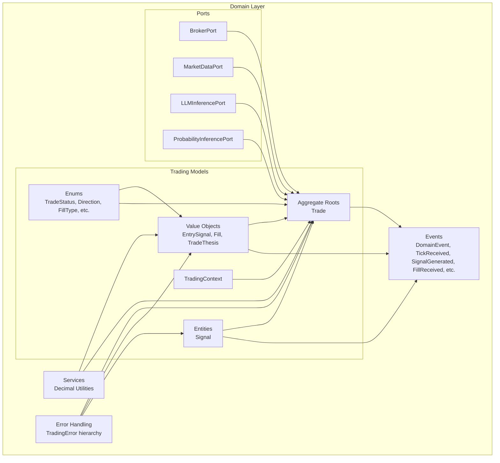
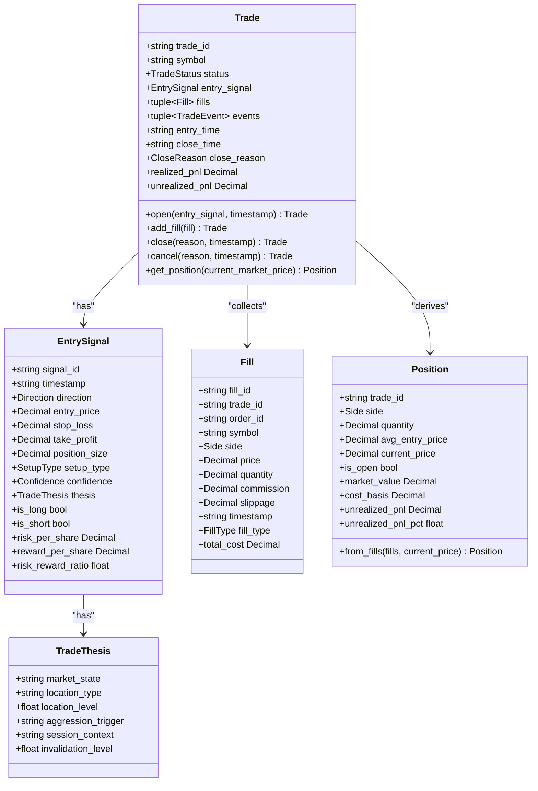
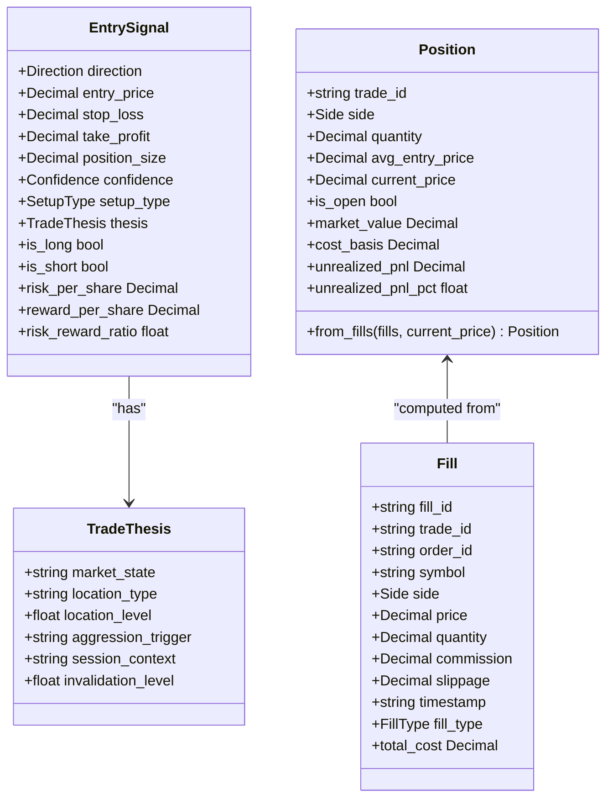
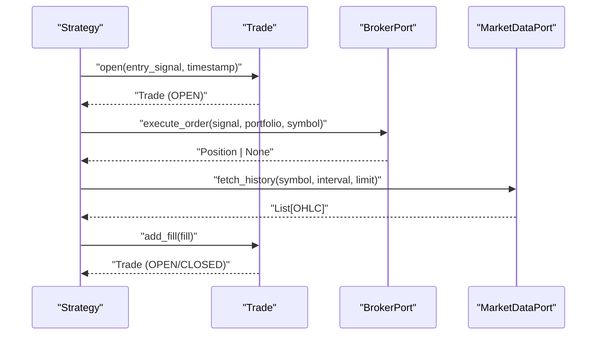
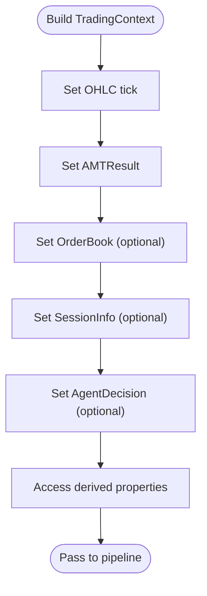
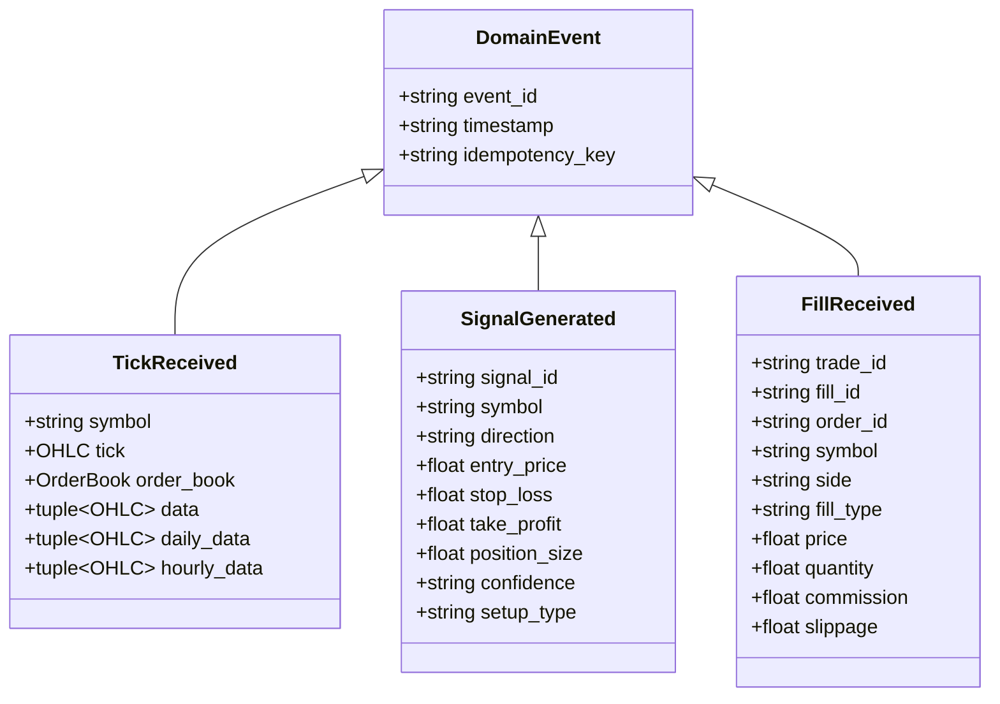
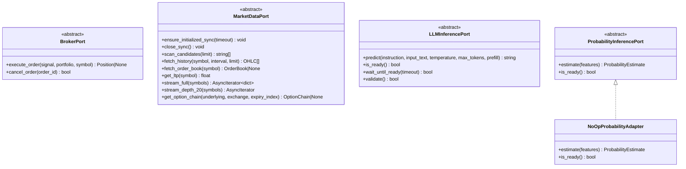
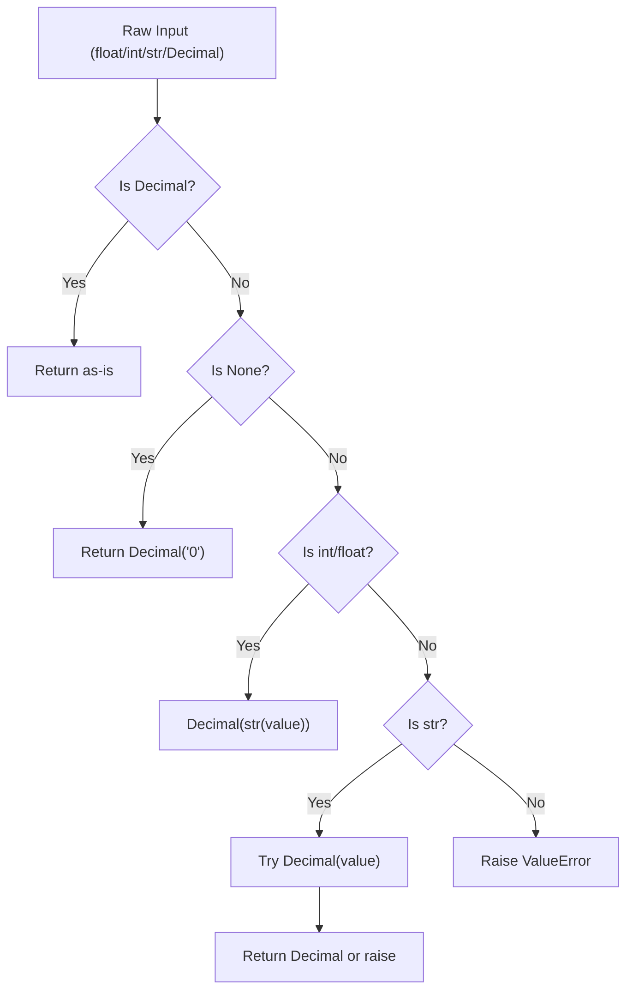
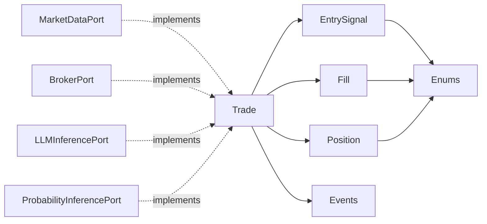

# Domain Layer

<cite>
**Referenced Files in This Document**
- [trade_aggregate.py](file://backend/app/domain/trading/models/trade_aggregate.py)
- [enums.py](file://backend/app/domain/trading/models/enums.py)
- [trading_context.py](file://backend/app/domain/trading/models/trading_context.py)
- [events.py](file://backend/app/domain/trading/events.py)
- [broker.py](file://backend/app/domain/ports/broker.py)
- [market_data.py](file://backend/app/domain/ports/market_data.py)
- [llm_inference.py](file://backend/app/domain/ports/llm_inference.py)
- [probability_inference.py](file://backend/app/domain/ports/probability_inference.py)
- [decimal_utils.py](file://backend/app/domain/services/decimal_utils.py)
- [error_handling.py](file://shared/error_handling.py)
</cite>

## Table of Contents
1. [Introduction](#introduction)
2. [Project Structure](#project-structure)
3. [Core Components](#core-components)
4. [Architecture Overview](#architecture-overview)
5. [Detailed Component Analysis](#detailed-component-analysis)
6. [Dependency Analysis](#dependency-analysis)
7. [Performance Considerations](#performance-considerations)
8. [Troubleshooting Guide](#troubleshooting-guide)
9. [Conclusion](#conclusion)

## Introduction
This document describes the Domain Layer of the trading system with a focus on pure business logic and entities. It documents trading value objects (EntrySignal, Fill, Position, TradeThesis), domain entities (Signal), and aggregate roots (Trade). It also covers the 11 domain ports/interfaces (BrokerPort, MarketDataPort, LLMInferencePort, ProbabilityInferencePort, plus others), the error hierarchy rooted in a base TradingError, monetary precision handling via Decimal and dedicated utilities, enum definitions, and business rule enforcement. Finally, it explains the broker-agnostic design principles and the zero external dependencies requirement for the domain layer.

## Project Structure
The Domain Layer is organized around:
- Trading models: value objects, entities, aggregates, enums, and context
- Ports: abstract interfaces for market data, broker execution, inference, and storage
- Events: immutable domain events that capture state transitions
- Services: domain utilities (e.g., Decimal conversion)
- Shared error handling: standardized exception hierarchy

**Diagram sources**
- [trade_aggregate.py:86-275](file://backend/app/domain/trading/models/trade_aggregate.py#L86-L275)
- [enums.py:113-200](file://backend/app/domain/trading/models/enums.py#L113-L200)
- [trading_context.py:28-150](file://backend/app/domain/trading/models/trading_context.py#L28-L150)
- [events.py:39-498](file://backend/app/domain/trading/events.py#L39-L498)
- [broker.py:11-26](file://backend/app/domain/ports/broker.py#L11-L26)
- [market_data.py:19-112](file://backend/app/domain/ports/market_data.py#L19-L112)
- [llm_inference.py:10-42](file://backend/app/domain/ports/llm_inference.py#L10-L42)
- [probability_inference.py:19-44](file://backend/app/domain/ports/probability_inference.py#L19-L44)
- [decimal_utils.py:13-46](file://backend/app/domain/services/decimal_utils.py#L13-L46)
- [error_handling.py:19-70](file://shared/error_handling.py#L19-L70)

**Section sources**
- [trade_aggregate.py:1-795](file://backend/app/domain/trading/models/trade_aggregate.py#L1-L795)
- [enums.py:1-200](file://backend/app/domain/trading/models/enums.py#L1-L200)
- [trading_context.py:1-150](file://backend/app/domain/trading/models/trading_context.py#L1-L150)
- [events.py:1-499](file://backend/app/domain/trading/events.py#L1-L499)
- [broker.py:1-27](file://backend/app/domain/ports/broker.py#L1-L27)
- [market_data.py:1-112](file://backend/app/domain/ports/market_data.py#L1-L112)
- [llm_inference.py:1-42](file://backend/app/domain/ports/llm_inference.py#L1-L42)
- [probability_inference.py:1-44](file://backend/app/domain/ports/probability_inference.py#L1-L44)
- [decimal_utils.py:1-46](file://backend/app/domain/services/decimal_utils.py#L1-L46)
- [error_handling.py:1-203](file://shared/error_handling.py#L1-L203)

## Core Components
- Trading Value Objects
  - EntrySignal: immutable entry decision with direction, prices, stop-loss, take-profit, position size, confidence, and optional thesis.
  - Fill: immutable executed order with side, price, quantity, commission, slippage, and fill type.
  - Position: derived state computed from fills (net quantity, average entry, unrealized PnL).
  - TradeThesis: rationale for the trade (market state, location, aggression trigger, etc.).
- Entities
  - Signal: domain entity representing a validated trade intent (used by ports).
- Aggregate Roots
  - Trade: aggregate root encapsulating lifecycle state (PENDING, OPEN, CLOSED), entry signal, fills, events, and derived position.
- Enums
  - TradeStatus, CloseReason, Confidence, Direction, FillType, SetupType, Side, MarketState, etc.
- Trading Context
  - TradingContext: immutable container aggregating tick, AMT result, order book, session info, and agent decision.
- Events
  - DomainEvent and typed events (TickReceived, SignalGenerated, FillReceived, PositionClosed, etc.) form the audit trail.
- Ports
  - BrokerPort, MarketDataPort, LLMInferencePort, ProbabilityInferencePort, plus others (delta_profile, exchange_strategy, notifications, npoc, storage).
- Monetary Precision
  - Decimal utilities and Decimal fields ensure precise financial computations.
- Error Handling
  - TradingError base class with specialized subclasses and standardized decorators.

**Section sources**
- [trade_aggregate.py:86-275](file://backend/app/domain/trading/models/trade_aggregate.py#L86-L275)
- [enums.py:113-200](file://backend/app/domain/trading/models/enums.py#L113-L200)
- [trading_context.py:28-150](file://backend/app/domain/trading/models/trading_context.py#L28-L150)
- [events.py:39-498](file://backend/app/domain/trading/events.py#L39-L498)
- [broker.py:11-26](file://backend/app/domain/ports/broker.py#L11-L26)
- [market_data.py:19-112](file://backend/app/domain/ports/market_data.py#L19-L112)
- [llm_inference.py:10-42](file://backend/app/domain/ports/llm_inference.py#L10-L42)
- [probability_inference.py:19-44](file://backend/app/domain/ports/probability_inference.py#L19-L44)
- [decimal_utils.py:13-46](file://backend/app/domain/services/decimal_utils.py#L13-L46)
- [error_handling.py:19-70](file://shared/error_handling.py#L19-L70)

## Architecture Overview
The Domain Layer enforces a strict separation between pure business logic and infrastructure concerns:
- Aggregates (Trade) own invariants and enforce business rules.
- Value Objects are immutable and encapsulate domain facts.
- Ports define the domain-to-infrastructure boundaries without leaking infrastructural details into the domain.
- Events capture state changes and enable auditability and replay.
- Decimal utilities and enums ensure correctness and type safety.

**Diagram sources**
- [trade_aggregate.py:86-275](file://backend/app/domain/trading/models/trade_aggregate.py#L86-L275)
- [trade_aggregate.py:293-795](file://backend/app/domain/trading/models/trade_aggregate.py#L293-L795)

**Section sources**
- [trade_aggregate.py:1-795](file://backend/app/domain/trading/models/trade_aggregate.py#L1-L795)

## Detailed Component Analysis

### Trading Value Objects and Entities
- EntrySignal
  - Encapsulates the immutable decision to enter a trade with prices, risk/reward, and optional thesis.
  - Provides derived properties for risk/reward metrics.
- Fill
  - Captures the immutable execution details and computes total cost including commission and slippage.
- Position
  - Derived from fills; computed on-demand to ensure consistency with the source of truth (fills).
  - Includes unrealized PnL and percentage metrics.
- TradeThesis
  - Captures the rationale behind a trade (market state, location, session context).
- Signal
  - Domain entity used by ports to represent validated intents.

**Diagram sources**
- [trade_aggregate.py:86-275](file://backend/app/domain/trading/models/trade_aggregate.py#L86-L275)

**Section sources**
- [trade_aggregate.py:86-275](file://backend/app/domain/trading/models/trade_aggregate.py#L86-L275)

### Aggregate Root: Trade
- Responsibilities
  - Enforce lifecycle invariants (status derived from position).
  - Append-only event log for deterministic replay.
  - Compute realized and unrealized PnL from fills.
  - Provide factory methods to create and reconstruct trades from snapshots.
- Commands
  - open, add_fill, close, cancel.
- Queries
  - get_position, realized_pnl, total_commission, total_slippage, risk metrics.

**Diagram sources**
- [trade_aggregate.py:521-664](file://backend/app/domain/trading/models/trade_aggregate.py#L521-L664)
- [broker.py:11-26](file://backend/app/domain/ports/broker.py#L11-L26)
- [market_data.py:19-112](file://backend/app/domain/ports/market_data.py#L19-L112)

**Section sources**
- [trade_aggregate.py:293-795](file://backend/app/domain/trading/models/trade_aggregate.py#L293-L795)

### Trading Context Models
- TradingContext
  - Immutable container aggregating tick, AMT result, order book, session info, and agent decision.
  - Provides convenient properties for price, volume, delta, market state, POC, VAH/VAL, CVD slope, aggression, VWAP, profile shape, session phase, opening relation, and agent signals.
  - Supports functional updates returning new contexts.

**Diagram sources**
- [trading_context.py:28-150](file://backend/app/domain/trading/models/trading_context.py#L28-L150)

**Section sources**
- [trading_context.py:1-150](file://backend/app/domain/trading/models/trading_context.py#L1-L150)

### Domain Events
- DomainEvent base class with immutable identity, timestamp, and idempotency key.
- Typed events:
  - Market: TickReceived
  - Analysis: AIAnalysisCompleted
  - Signals: SignalGenerated, SignalValidated
  - Orders: OrderPlaced, OrderCancelled
  - Fills: FillReceived
  - Positions: PositionChanged, PositionOpened, PositionClosed
  - Risk: RiskCheckFailed, DailyLossLimitReached
  - Diagnostics: DataAnomalyEvent
- Event type registry enables reconstruction and dispatch.

**Diagram sources**
- [events.py:39-498](file://backend/app/domain/trading/events.py#L39-L498)

**Section sources**
- [events.py:1-499](file://backend/app/domain/trading/events.py#L1-L499)

### Domain Ports and Contracts
- BrokerPort
  - execute_order(signal, portfolio, symbol) -> Position | None
  - cancel_order(order_id) -> bool
- MarketDataPort
  - Initialization hooks: ensure_initialized_sync, close_sync
  - Queries: scan_candidates, fetch_history, fetch_order_book, get_ltp
  - Streaming: stream_full, stream_depth_20
  - Options: get_option_chain (optional)
- LLMInferencePort
  - predict(instruction, input_text, temperature, max_tokens, prefill) -> str
  - is_ready() -> bool
  - wait_until_ready(timeout), validate()
- ProbabilityInferencePort
  - estimate(features) -> ProbabilityEstimate
  - is_ready() -> bool
  - NoOpProbabilityAdapter returns neutral estimates when model is not trained

**Diagram sources**
- [broker.py:11-26](file://backend/app/domain/ports/broker.py#L11-L26)
- [market_data.py:19-112](file://backend/app/domain/ports/market_data.py#L19-L112)
- [llm_inference.py:10-42](file://backend/app/domain/ports/llm_inference.py#L10-L42)
- [probability_inference.py:19-44](file://backend/app/domain/ports/probability_inference.py#L19-L44)

**Section sources**
- [broker.py:1-27](file://backend/app/domain/ports/broker.py#L1-L27)
- [market_data.py:1-112](file://backend/app/domain/ports/market_data.py#L1-L112)
- [llm_inference.py:1-42](file://backend/app/domain/ports/llm_inference.py#L1-L42)
- [probability_inference.py:1-44](file://backend/app/domain/ports/probability_inference.py#L1-L44)

### Monetary Precision Handling
- Decimal fields in value objects and aggregates ensure precise financial arithmetic.
- to_decimal utility converts numeric inputs to Decimal, raising explicit errors for unsupported types.
- Domain enforces Decimal arithmetic for prices, quantities, commissions, slippage, and PnL calculations.

**Diagram sources**
- [decimal_utils.py:13-46](file://backend/app/domain/services/decimal_utils.py#L13-L46)

**Section sources**
- [decimal_utils.py:1-46](file://backend/app/domain/services/decimal_utils.py#L1-L46)
- [trade_aggregate.py:144-180](file://backend/app/domain/trading/models/trade_aggregate.py#L144-L180)

### Error Hierarchy and Handling
- Base class: TradingError with error_code and context.
- Specialized exceptions: SignalError, GateError, LLMError, StorageError, RiskError.
- Standardized decorators and helpers:
  - handle_errors for safe wrapping with logging and optional re-raising
  - log_and_continue for non-critical errors
  - safe_execute for robust function execution
  - ErrorContext context manager for structured error handling

**Diagram sources**
- [error_handling.py:19-70](file://shared/error_handling.py#L19-L70)

**Section sources**
- [error_handling.py:1-203](file://shared/error_handling.py#L1-L203)

### Business Rule Enforcement
- Trade invariants
  - position = Position.from_fills(fills) always holds.
  - status = OPEN iff position.is_open.
  - realized_pnl sums contributions from exit fills.
- Fill semantics
  - ENTRY, PARTIAL, EXIT, SCALE_IN, SCALE_OUT types govern position changes.
- Risk and reward
  - risk_per_share and risk_reward_ratio derived from EntrySignal.
- PnL computation
  - Unrealized PnL computed from current_price vs avg_entry_price.
  - Realized PnL computed by matching exits to entries (FIFO-style).

**Diagram sources**
- [trade_aggregate.py:417-421](file://backend/app/domain/trading/models/trade_aggregate.py#L417-L421)
- [trade_aggregate.py:196-275](file://backend/app/domain/trading/models/trade_aggregate.py#L196-L275)

**Section sources**
- [trade_aggregate.py:293-795](file://backend/app/domain/trading/models/trade_aggregate.py#L293-L795)

### Broker-Agnostic Design and Zero External Dependencies
- Ports abstract infrastructure concerns:
  - MarketDataPort decouples market data providers.
  - BrokerPort decouples order execution (paper/live).
  - LLMInferencePort and ProbabilityInferencePort decouple AI/ML adapters.
- Domain models depend only on stdlib constructs (dataclasses, Decimal, Enum) and internal domain types.
- No imports from infrastructure or shared modules in domain services (as documented in decimal_utils).

**Section sources**
- [market_data.py:1-112](file://backend/app/domain/ports/market_data.py#L1-L112)
- [broker.py:1-27](file://backend/app/domain/ports/broker.py#L1-L27)
- [llm_inference.py:1-42](file://backend/app/domain/ports/llm_inference.py#L1-L42)
- [probability_inference.py:1-44](file://backend/app/domain/ports/probability_inference.py#L1-L44)
- [decimal_utils.py:1-6](file://backend/app/domain/services/decimal_utils.py#L1-L6)

## Dependency Analysis
- Internal dependencies
  - Trade depends on EntrySignal, Fill, Position, enums, and events.
  - Events depend on value objects and entities.
  - Ports are consumed by application services and infrastructure adapters.
- External dependencies
  - Domain avoids external dependencies; adapters implement ports in infrastructure.

**Diagram sources**
- [trade_aggregate.py:293-795](file://backend/app/domain/trading/models/trade_aggregate.py#L293-L795)
- [events.py:39-498](file://backend/app/domain/trading/events.py#L39-L498)
- [broker.py:11-26](file://backend/app/domain/ports/broker.py#L11-L26)
- [market_data.py:19-112](file://backend/app/domain/ports/market_data.py#L19-L112)
- [llm_inference.py:10-42](file://backend/app/domain/ports/llm_inference.py#L10-L42)
- [probability_inference.py:19-44](file://backend/app/domain/ports/probability_inference.py#L19-L44)

**Section sources**
- [trade_aggregate.py:1-795](file://backend/app/domain/trading/models/trade_aggregate.py#L1-L795)
- [events.py:1-499](file://backend/app/domain/trading/events.py#L1-L499)
- [broker.py:1-27](file://backend/app/domain/ports/broker.py#L1-L27)
- [market_data.py:1-112](file://backend/app/domain/ports/market_data.py#L1-L112)
- [llm_inference.py:1-42](file://backend/app/domain/ports/llm_inference.py#L1-L42)
- [probability_inference.py:1-44](file://backend/app/domain/ports/probability_inference.py#L1-L44)

## Performance Considerations
- Immutability and on-demand derivation reduce memory overhead and ensure deterministic replay.
- Decimal arithmetic prevents floating-point drift in financial computations.
- Event sourcing supports efficient audits and selective recomputation.
- Ports enable caching and batching at infrastructure adapters without affecting domain logic.

## Troubleshooting Guide
- Use standardized error handling utilities to log and continue on non-critical failures.
- For inference readiness, use wait_until_ready to avoid runtime errors.
- Validate inputs with to_decimal to catch conversion issues early.
- Inspect event histories to diagnose state inconsistencies.

**Section sources**
- [error_handling.py:71-203](file://shared/error_handling.py#L71-L203)
- [llm_inference.py:29-37](file://backend/app/domain/ports/llm_inference.py#L29-L37)
- [decimal_utils.py:13-46](file://backend/app/domain/services/decimal_utils.py#L13-L46)

## Conclusion
The Domain Layer cleanly separates business logic from infrastructure via value objects, entities, aggregates, and ports. It enforces strong invariants, uses immutable events for auditability, and maintains monetary precision with Decimal. The error handling framework and broker-agnostic design principles ensure robustness and flexibility across diverse execution environments.