# Domain Layer

<cite>
**Referenced Files in This Document**
- [trade_aggregate.py](file://backend/app/domain/trading/models/trade_aggregate.py)
- [aggregates.py](file://backend/app/domain/trading/models/aggregates.py)
- [entities.py](file://backend/app/domain/trading/models/entities.py)
- [value_objects.py](file://backend/app/domain/trading/models/value_objects.py)
- [enums.py](file://backend/app/domain/trading/models/enums.py)
- [trading_context.py](file://backend/app/domain/trading/models/trading_context.py)
- [events.py](file://backend/app/domain/trading/events.py)
- [config_port.py](file://backend/app/domain/ports/config_port.py)
- [exchange_config.py](file://backend/app/domain/models/exchange_config.py)
- [market_state.py](file://backend/app/domain/models/market_state.py)
- [state_bus.py](file://backend/app/domain/services/state_bus.py)
- [risk_sizing_engine.py](file://backend/app/domain/services/risk_sizing_engine.py)
- [market_state_classifier.py](file://backend/app/domain/services/market_state_classifier.py)
- [broker.py](file://backend/app/domain/ports/broker.py)
- [market_data.py](file://backend/app/domain/ports/market_data.py)
- [llm_inference.py](file://backend/app/domain/ports/llm_inference.py)
- [probability_inference.py](file://backend/app/domain/ports/probability_inference.py)
- [decimal_utils.py](file://backend/app/domain/services/decimal_utils.py)
- [error_handling.py](file://shared/error_handling.py)
</cite>

## Update Summary
**Changes Made**
- Added new domain services including 33 domain services with comprehensive trading support
- Documented new ports: ConfigPort, SymbolConfigPort, GlobalsPort for configuration management
- Enhanced domain models with new trading aggregates, entities, and value objects
- Added market state classification and validation services
- Expanded trading context with portfolio management capabilities
- Introduced exchange-specific configuration models and market state validation

## Table of Contents
1. [Introduction](#introduction)
2. [Project Structure](#project-structure)
3. [Core Components](#core-components)
4. [Architecture Overview](#architecture-overview)
5. [Detailed Component Analysis](#detailed-component-analysis)
6. [Enhanced Domain Models](#enhanced-domain-models)
7. [New Configuration Management](#new-configuration-management)
8. [Market State Services](#market-state-services)
9. [Dependency Analysis](#dependency-analysis)
10. [Performance Considerations](#performance-considerations)
11. [Troubleshooting Guide](#troubleshooting-guide)
12. [Conclusion](#conclusion)

## Introduction
This document describes the Domain Layer of the trading system with a focus on pure business logic and entities. It documents trading value objects (EntrySignal, Fill, Position, TradeThesis, OHLC, AMTResult), domain entities (Signal, Position), and aggregate roots (Trade, Portfolio). It also covers the 14 domain ports/interfaces including BrokerPort, MarketDataPort, LLMInferencePort, ProbabilityInferencePort, ConfigPort, SymbolConfigPort, and GlobalsPort, plus 33 domain services. The document explains the enhanced domain models, market state validation, configuration management, and the error hierarchy with DomainError base class and specialized exceptions. Finally, it covers monetary precision handling with Decimal, enum definitions, business rule enforcement, broker-agnostic design principles, and zero external dependencies requirement.

## Project Structure
The Domain Layer is organized around:
- Trading models: value objects, entities, aggregates, enums, and context
- Configuration models: exchange-specific configuration and market state validation
- Ports: abstract interfaces for market data, broker execution, inference, storage, and configuration
- Services: 33 domain utilities for risk management, market analysis, and trading operations
- Events: immutable domain events that capture state transitions
- Shared error handling: standardized exception hierarchy

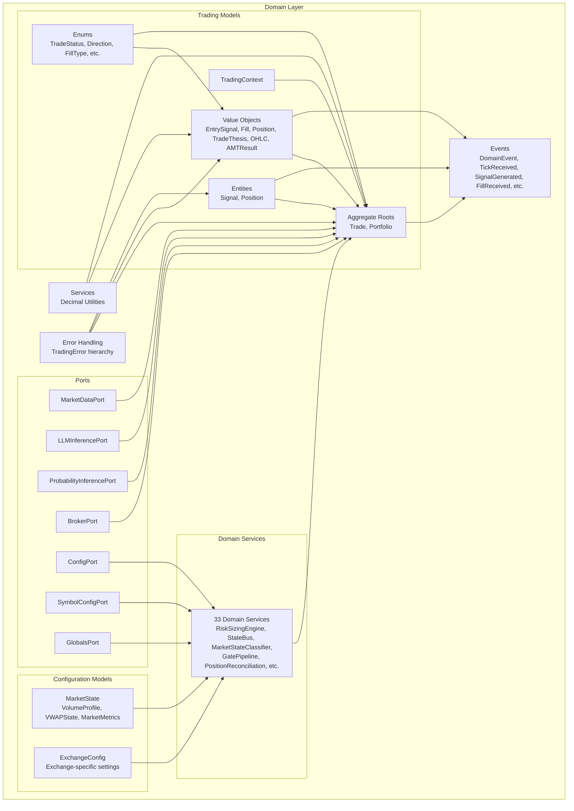

**Diagram sources**
- [trade_aggregate.py:86-275](file://backend/app/domain/trading/models/trade_aggregate.py#L86-L275)
- [aggregates.py:67-541](file://backend/app/domain/trading/models/aggregates.py#L67-L541)
- [entities.py:29-218](file://backend/app/domain/trading/models/entities.py#L29-L218)
- [value_objects.py:18-322](file://backend/app/domain/trading/models/value_objects.py#L18-L322)
- [config_port.py:12-135](file://backend/app/domain/ports/config_port.py#L12-L135)
- [exchange_config.py:20-307](file://backend/app/domain/models/exchange_config.py#L20-L307)
- [market_state.py:20-173](file://backend/app/domain/models/market_state.py#L20-L173)
- [state_bus.py:45-247](file://backend/app/domain/services/state_bus.py#L45-L247)
- [risk_sizing_engine.py:44-204](file://backend/app/domain/services/risk_sizing_engine.py#L44-L204)

**Section sources**
- [trade_aggregate.py:1-795](file://backend/app/domain/trading/models/trade_aggregate.py#L1-L795)
- [aggregates.py:1-541](file://backend/app/domain/trading/models/aggregates.py#L1-L541)
- [entities.py:1-218](file://backend/app/domain/trading/models/entities.py#L1-L218)
- [value_objects.py:1-322](file://backend/app/domain/trading/models/value_objects.py#L1-L322)
- [enums.py:1-200](file://backend/app/domain/trading/models/enums.py#L1-L200)
- [trading_context.py:1-150](file://backend/app/domain/trading/models/trading_context.py#L1-L150)
- [events.py:1-499](file://backend/app/domain/trading/events.py#L1-L499)
- [config_port.py:1-135](file://backend/app/domain/ports/config_port.py#L1-L135)
- [exchange_config.py:1-307](file://backend/app/domain/models/exchange_config.py#L1-L307)
- [market_state.py:1-173](file://backend/app/domain/models/market_state.py#L1-L173)
- [state_bus.py:1-247](file://backend/app/domain/services/state_bus.py#L1-L247)
- [risk_sizing_engine.py:1-204](file://backend/app/domain/services/risk_sizing_engine.py#L1-L204)
- [market_state_classifier.py:1-97](file://backend/app/domain/services/market_state_classifier.py#L1-L97)
- [broker.py:1-27](file://backend/app/domain/ports/broker.py#L1-L27)
- [market_data.py:1-112](file://backend/app/domain/ports/market_data.py#L1-L112)
- [llm_inference.py:1-42](file://backend/app/domain/ports/llm_inference.py#L1-L42)
- [probability_inference.py:1-44](file://backend/app/domain/ports/probability_inference.py#L1-L44)
- [decimal_utils.py:1-46](file://backend/app/domain/services/decimal_utils.py#L1-L46)
- [error_handling.py:1-203](file://shared/error_handling.py#L1-L203)

## Core Components
- Trading Value Objects
  - EntrySignal: immutable entry decision with direction, prices, stop-loss, take-profit, position size, confidence, and optional thesis.
  - Fill: immutable executed order with side, price, quantity, commission, slippage, and fill type.
  - Position: derived state computed from fills (net quantity, average entry, unrealized PnL).
  - TradeThesis: rationale for the trade (market state, location, aggression trigger, etc.).
  - OHLC: single OHLCV candlestick with order-flow fields and Decimal precision.
  - AMTResult: output of Auction Market Theory analysis pipeline with comprehensive market state data.
- Entities
  - Signal: domain entity representing a validated trade intent (used by ports).
  - Position: comprehensive position entity with lifecycle management, cushion states, and scaling rules.
- Aggregate Roots
  - Trade: aggregate root encapsulating lifecycle state (PENDING, OPEN, CLOSED), entry signal, fills, events, and derived position.
  - Portfolio: aggregate root managing multiple positions, balance, equity, and risk constraints.
- Configuration Models
  - ExchangeConfig: immutable configuration for exchange-specific behavior with instrument-level settings.
  - MarketState: typed domain objects with invariant enforcement for volume profile, VWAP state, and market metrics.
- Trading Context
  - TradingContext: immutable container aggregating tick, AMT result, order book, session info, and agent decision.
- Events
  - DomainEvent and typed events (TickReceived, SignalGenerated, FillReceived, PositionClosed, etc.) form the audit trail.
- Ports
  - BrokerPort, MarketDataPort, LLMInferencePort, ProbabilityInferencePort, ConfigPort, SymbolConfigPort, GlobalsPort.
- Domain Services
  - 33 specialized services for risk management, market analysis, position scaling, and trading operations.
- Monetary Precision
  - Decimal utilities and Decimal fields ensure precise financial computations.
- Error Handling
  - TradingError base class with specialized subclasses and standardized decorators.

**Section sources**
- [trade_aggregate.py:86-275](file://backend/app/domain/trading/models/trade_aggregate.py#L86-L275)
- [aggregates.py:67-541](file://backend/app/domain/trading/models/aggregates.py#L67-L541)
- [entities.py:29-218](file://backend/app/domain/trading/models/entities.py#L29-L218)
- [value_objects.py:18-322](file://backend/app/domain/trading/models/value_objects.py#L18-L322)
- [exchange_config.py:20-307](file://backend/app/domain/models/exchange_config.py#L20-L307)
- [market_state.py:20-173](file://backend/app/domain/models/market_state.py#L20-L173)
- [trading_context.py:28-150](file://backend/app/domain/trading/models/trading_context.py#L28-L150)
- [events.py:39-498](file://backend/app/domain/trading/events.py#L39-L498)
- [config_port.py:12-135](file://backend/app/domain/ports/config_port.py#L12-L135)
- [broker.py:11-26](file://backend/app/domain/ports/broker.py#L11-L26)
- [market_data.py:19-112](file://backend/app/domain/ports/market_data.py#L19-L112)
- [llm_inference.py:10-42](file://backend/app/domain/ports/llm_inference.py#L10-L42)
- [probability_inference.py:19-44](file://backend/app/domain/ports/probability_inference.py#L19-L44)
- [decimal_utils.py:13-46](file://backend/app/domain/services/decimal_utils.py#L13-L46)
- [error_handling.py:19-70](file://shared/error_handling.py#L19-L70)

## Architecture Overview
The Domain Layer enforces a strict separation between pure business logic and infrastructure concerns:
- Aggregates (Trade, Portfolio) own invariants and enforce business rules.
- Value Objects are immutable and encapsulate domain facts.
- Ports define the domain-to-infrastructure boundaries without leaking infrastructural details into the domain.
- Events capture state changes and enable auditability and replay.
- Decimal utilities and enums ensure correctness and type safety.
- Configuration models provide exchange-agnostic settings through protocols.
- Market state services validate and classify market conditions.

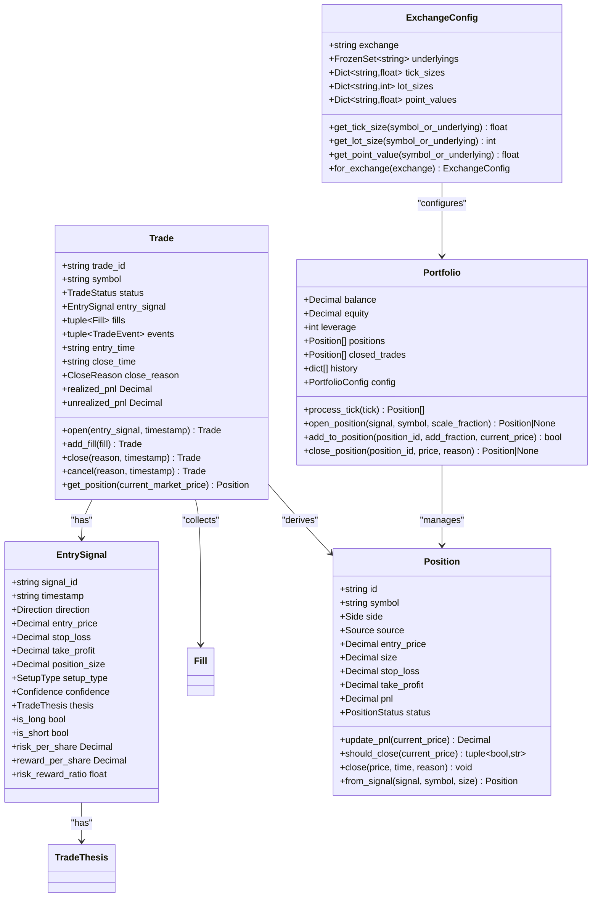

**Diagram sources**
- [trade_aggregate.py:86-275](file://backend/app/domain/trading/models/trade_aggregate.py#L86-L275)
- [trade_aggregate.py:293-795](file://backend/app/domain/trading/models/trade_aggregate.py#L293-L795)
- [aggregates.py:67-541](file://backend/app/domain/trading/models/aggregates.py#L67-L541)
- [entities.py:84-218](file://backend/app/domain/trading/models/entities.py#L84-L218)
- [exchange_config.py:20-307](file://backend/app/domain/models/exchange_config.py#L20-L307)

**Section sources**
- [trade_aggregate.py:1-795](file://backend/app/domain/trading/models/trade_aggregate.py#L1-L795)
- [aggregates.py:1-541](file://backend/app/domain/trading/models/aggregates.py#L1-L541)
- [entities.py:1-218](file://backend/app/domain/trading/models/entities.py#L1-L218)
- [exchange_config.py:1-307](file://backend/app/domain/models/exchange_config.py#L1-L307)

## Detailed Component Analysis

### Trading Value Objects and Entities
- EntrySignal
  - Encapsulates the immutable decision to enter a trade with prices, risk/reward, and optional thesis.
  - Provides derived properties for risk/reward metrics.
- Fill
  - Captures the immutable execution details and computes total cost including commission and slippage.
- Position
  - Comprehensive position entity with lifecycle management, cushion states, and scaling rules.
  - Derived from fills; computed on-demand to ensure consistency with the source of truth (fills).
  - Includes unrealized PnL and percentage metrics.
- TradeThesis
  - Captures the rationale behind a trade (market state, location, session context).
- Signal
  - Domain entity used by ports to represent validated intents.

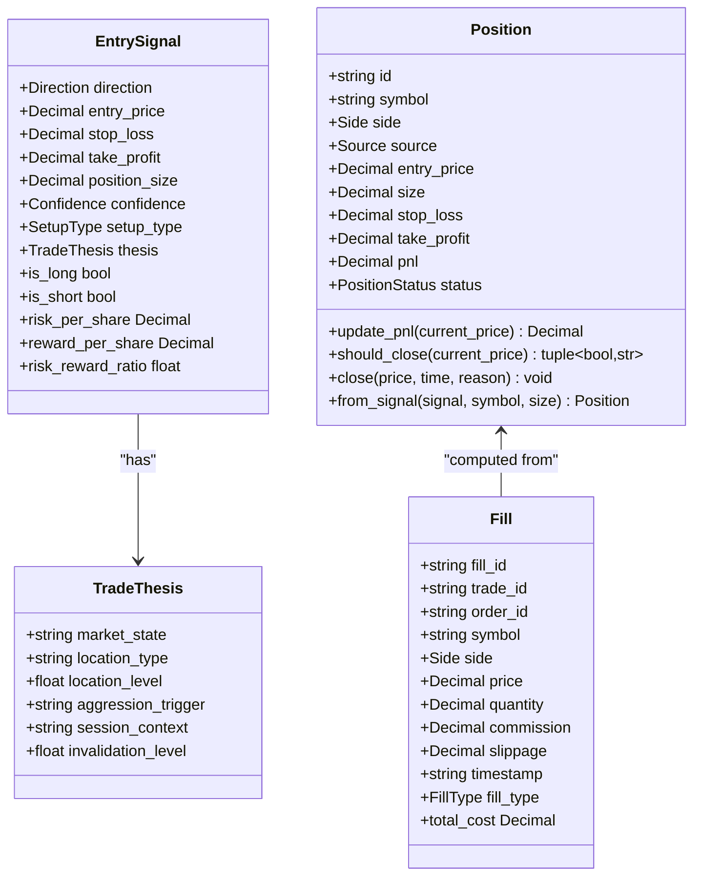

**Diagram sources**
- [trade_aggregate.py:86-275](file://backend/app/domain/trading/models/trade_aggregate.py#L86-L275)
- [entities.py:84-218](file://backend/app/domain/trading/models/entities.py#L84-L218)

**Section sources**
- [trade_aggregate.py:86-275](file://backend/app/domain/trading/models/trade_aggregate.py#L86-L275)
- [entities.py:29-218](file://backend/app/domain/trading/models/entities.py#L29-L218)

### Enhanced Aggregate Roots: Trade and Portfolio
- Trade Responsibilities
  - Enforce lifecycle invariants (status derived from position).
  - Append-only event log for deterministic replay.
  - Compute realized and unrealized PnL from fills.
  - Provide factory methods to create and reconstruct trades from snapshots.
- Portfolio Responsibilities
  - Manage multiple positions with risk constraints.
  - Handle position scaling using Fabio 40/30/30 rule.
  - Apply slippage and commission modeling.
  - Track equity history and performance statistics.
  - Enforce leverage and participation limits.

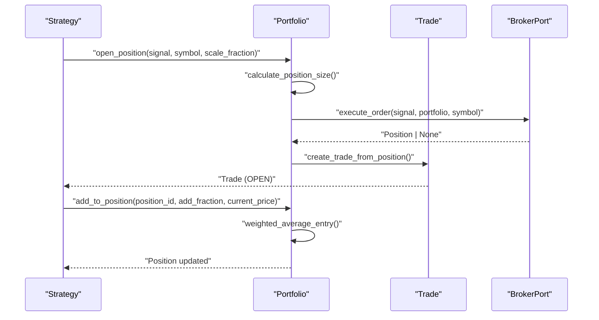

**Diagram sources**
- [aggregates.py:238-314](file://backend/app/domain/trading/models/aggregates.py#L238-L314)
- [aggregates.py:315-357](file://backend/app/domain/trading/models/aggregates.py#L315-L357)
- [broker.py:11-26](file://backend/app/domain/ports/broker.py#L11-L26)

**Section sources**
- [trade_aggregate.py:293-795](file://backend/app/domain/trading/models/trade_aggregate.py#L293-L795)
- [aggregates.py:67-541](file://backend/app/domain/trading/models/aggregates.py#L67-L541)

### Trading Context Models
- TradingContext
  - Immutable container aggregating tick, AMT result, order book, session info, and agent decision.
  - Provides convenient properties for price, volume, delta, market state, POC, VAH/VAL, CVD slope, aggression, VWAP, profile shape, session phase, opening relation, and agent signals.
  - Supports functional updates returning new contexts.

**Diagram sources**
- [trading_context.py:28-150](file://backend/app/domain/trading/models/trading_context.py#L28-L150)

**Section sources**
- [trading_context.py:1-150](file://backend/app/domain/trading/models/trading_context.py#L1-L150)

### Domain Events
- DomainEvent base class with immutable identity, timestamp, and idempotency key.
- Typed events:
  - Market: TickReceived
  - Analysis: AIAnalysisCompleted
  - Signals: SignalGenerated, SignalValidated
  - Orders: OrderPlaced, OrderCancelled
  - Fills: FillReceived
  - Positions: PositionChanged, PositionOpened, PositionClosed
  - Risk: RiskCheckFailed, DailyLossLimitReached
  - Diagnostics: DataAnomalyEvent
- Event type registry enables reconstruction and dispatch.

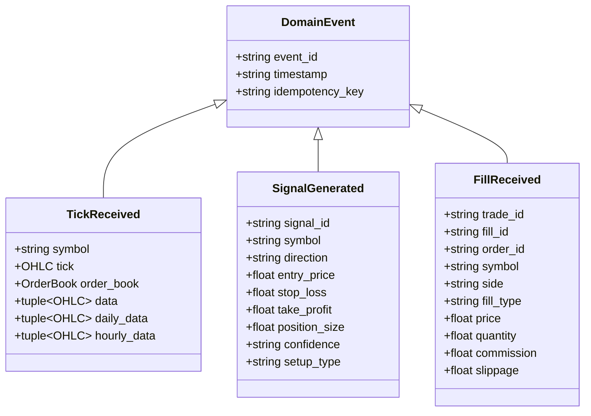

**Diagram sources**
- [events.py:39-498](file://backend/app/domain/trading/events.py#L39-L498)

**Section sources**
- [events.py:1-499](file://backend/app/domain/trading/events.py#L1-L499)

### Enhanced Domain Ports and Contracts
- BrokerPort
  - execute_order(signal, portfolio, symbol) -> Position | None
  - cancel_order(order_id) -> bool
- MarketDataPort
  - Initialization hooks: ensure_initialized_sync, close_sync
  - Queries: scan_candidates, fetch_history, fetch_order_book, get_ltp
  - Streaming: stream_full, stream_depth_20
  - Options: get_option_chain (optional)
- LLMInferencePort
  - predict(instruction, input_text, temperature, max_tokens, prefill) -> str
  - is_ready() -> bool
  - wait_until_ready(timeout), validate()
- ProbabilityInferencePort
  - estimate(features) -> ProbabilityEstimate
  - is_ready() -> bool
  - NoOpProbabilityAdapter returns neutral estimates when model is not trained
- ConfigPort
  - get_symbol_config(symbol) -> ISymbolConfig | None
  - get_active_symbols() -> list[str]
  - get_global(key, default) -> float | int | str | None
  - globals -> IGlobals
- SymbolConfigPort
  - tick_size: float (minimum price increment)
  - lot_size: int (number of units per lot)
  - aggression_persistence_bars: int
  - min_aggression_score: float
  - pyramid_aggression_score: float
- GlobalsPort
  - lvn_threshold: float, hvn_threshold: float, value_area_pct: float
  - cvd_slope_window: int, cvd_strong_slope: float
  - balance_ratio_threshold: float, displacement_multiplier: float
  - risk_per_trade_pct: float, max_daily_loss_pct: float, max_consecutive_losses: int
  - ib_minutes: int, displacement_lookback: int

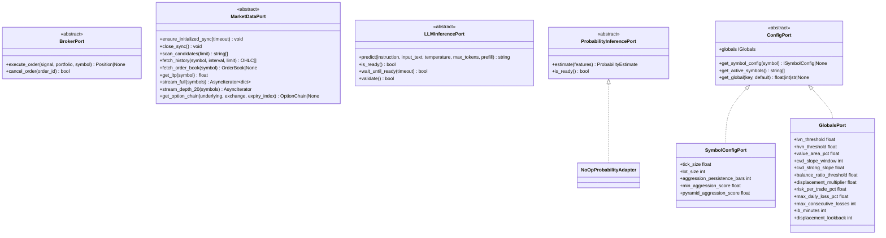

**Diagram sources**
- [broker.py:11-26](file://backend/app/domain/ports/broker.py#L11-L26)
- [market_data.py:19-112](file://backend/app/domain/ports/market_data.py#L19-L112)
- [llm_inference.py:10-42](file://backend/app/domain/ports/llm_inference.py#L10-L42)
- [probability_inference.py:19-44](file://backend/app/domain/ports/probability_inference.py#L19-L44)
- [config_port.py:12-135](file://backend/app/domain/ports/config_port.py#L12-L135)

**Section sources**
- [broker.py:1-27](file://backend/app/domain/ports/broker.py#L1-L27)
- [market_data.py:1-112](file://backend/app/domain/ports/market_data.py#L1-L112)
- [llm_inference.py:1-42](file://backend/app/domain/ports/llm_inference.py#L1-L42)
- [probability_inference.py:1-44](file://backend/app/domain/ports/probability_inference.py#L1-L44)
- [config_port.py:1-135](file://backend/app/domain/ports/config_port.py#L1-L135)

### Monetary Precision Handling
- Decimal fields in value objects and aggregates ensure precise financial arithmetic.
- to_decimal utility converts numeric inputs to Decimal, raising explicit errors for unsupported types.
- Domain enforces Decimal arithmetic for prices, quantities, commissions, slippage, and PnL calculations.

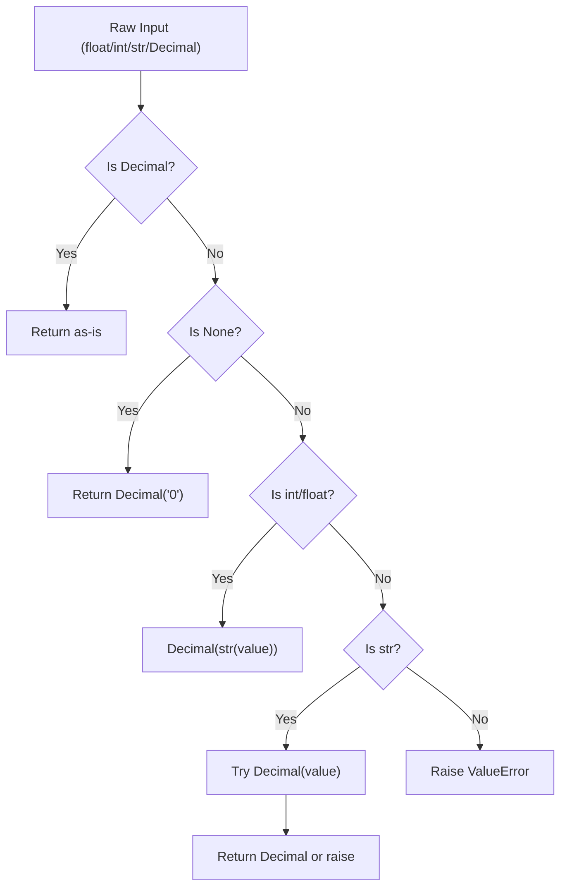

**Diagram sources**
- [decimal_utils.py:13-46](file://backend/app/domain/services/decimal_utils.py#L13-L46)

**Section sources**
- [decimal_utils.py:1-46](file://backend/app/domain/services/decimal_utils.py#L1-L46)
- [trade_aggregate.py:144-180](file://backend/app/domain/trading/models/trade_aggregate.py#L144-L180)

### Error Hierarchy and Handling
- Base class: TradingError with error_code and context.
- Specialized exceptions: SignalError, GateError, LLMError, StorageError, RiskError.
- Standardized decorators and helpers:
  - handle_errors for safe wrapping with logging and optional re-raising
  - log_and_continue for non-critical errors
  - safe_execute for robust function execution
  - ErrorContext context manager for structured error handling

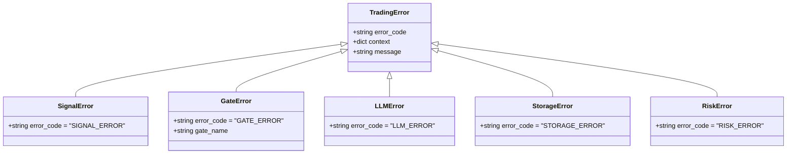

**Diagram sources**
- [error_handling.py:19-70](file://shared/error_handling.py#L19-L70)

**Section sources**
- [error_handling.py:1-203](file://shared/error_handling.py#L1-L203)

### Business Rule Enforcement
- Trade invariants
  - position = Position.from_fills(fills) always holds.
  - status = OPEN iff position.is_open.
  - realized_pnl sums contributions from exit fills.
- Portfolio invariants
  - leverage constraint enforced (max notional = equity * leverage)
  - participation limit prevents excessive market impact
  - position scaling follows Fabio 40/30/30 rule
  - commission and slippage modeled per instrument
- Fill semantics
  - ENTRY, PARTIAL, EXIT, SCALE_IN, SCALE_OUT types govern position changes.
- Risk and reward
  - risk_per_share and risk_reward_ratio derived from EntrySignal.
  - RiskSizingEngine provides deterministic position sizing.
- PnL computation
  - Unrealized PnL computed from current_price vs avg_entry_price.
  - Realized PnL computed by matching exits to entries (FIFO-style).

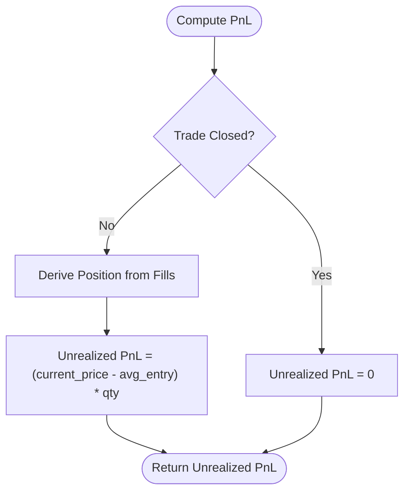

**Diagram sources**
- [trade_aggregate.py:417-421](file://backend/app/domain/trading/models/trade_aggregate.py#L417-L421)
- [trade_aggregate.py:196-275](file://backend/app/domain/trading/models/trade_aggregate.py#L196-L275)

**Section sources**
- [trade_aggregate.py:293-795](file://backend/app/domain/trading/models/trade_aggregate.py#L293-L795)
- [aggregates.py:127-541](file://backend/app/domain/trading/models/aggregates.py#L127-L541)

### Broker-Agnostic Design and Zero External Dependencies
- Ports abstract infrastructure concerns:
  - MarketDataPort decouples market data providers.
  - BrokerPort decouples order execution (paper/live).
  - LLMInferencePort and ProbabilityInferencePort decouple AI/ML adapters.
  - ConfigPort, SymbolConfigPort, GlobalsPort decouple configuration management.
- Domain models depend only on stdlib constructs (dataclasses, Decimal, Enum) and internal domain types.
- No imports from infrastructure or shared modules in domain services (as documented in decimal_utils).

**Section sources**
- [market_data.py:1-112](file://backend/app/domain/ports/market_data.py#L1-L112)
- [broker.py:1-27](file://backend/app/domain/ports/broker.py#L1-L27)
- [llm_inference.py:1-42](file://backend/app/domain/ports/llm_inference.py#L1-L42)
- [probability_inference.py:1-44](file://backend/app/domain/ports/probability_inference.py#L1-L44)
- [config_port.py:1-135](file://backend/app/domain/ports/config_port.py#L1-L135)
- [decimal_utils.py:1-6](file://backend/app/domain/services/decimal_utils.py#L1-L6)

## Enhanced Domain Models

### Exchange-Specific Configuration
- ExchangeConfig
  - Immutable configuration for exchange-specific behavior (NSE/MCX).
  - Encapsulates thresholds, symbols, session rules, and instrument-level settings.
  - Provides factory methods for exchange-specific defaults.
  - Supports per-instrument tick sizes, lot sizes, and point values.

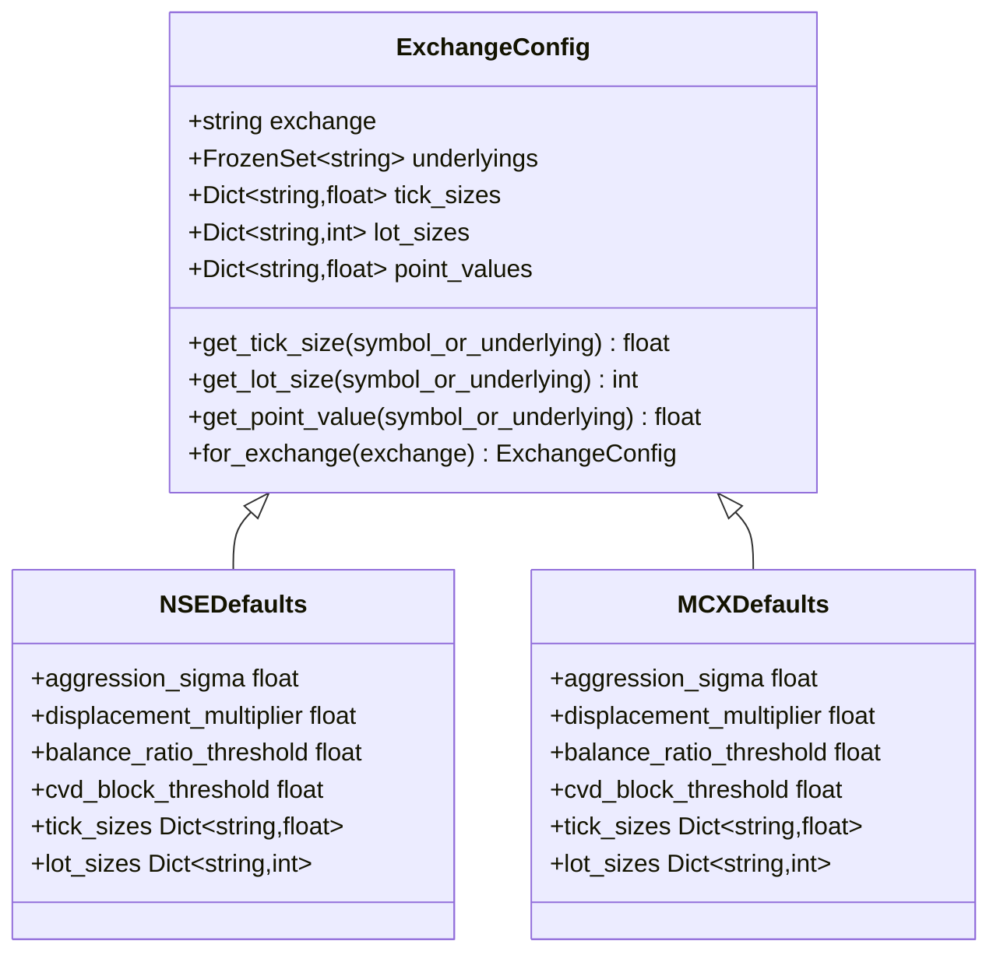

**Diagram sources**
- [exchange_config.py:20-307](file://backend/app/domain/models/exchange_config.py#L20-L307)

**Section sources**
- [exchange_config.py:1-307](file://backend/app/domain/models/exchange_config.py#L1-L307)

### Market State Validation
- MarketState
  - VolumeProfile: immutable with price ordering invariants (VAL < POC < VAH).
  - VWAPState: immutable with sigma and deviation sign consistency.
  - MarketMetrics: immutable with balance percentage bounds.
  - RuleChecklistResult: immutable with pass/fail validation.
  - SessionContext: immutable with session identification.

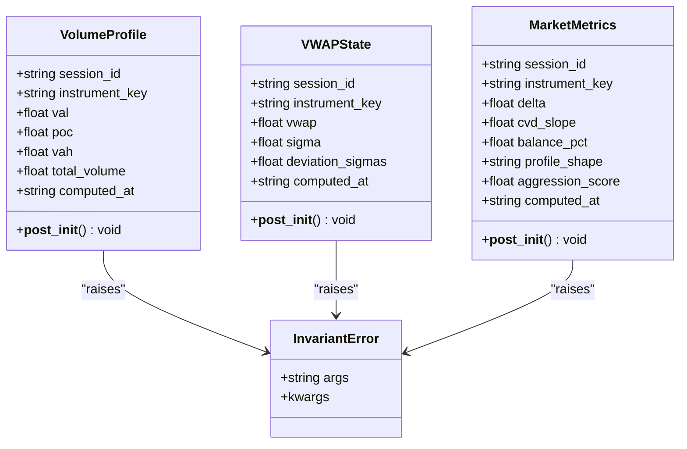

**Diagram sources**
- [market_state.py:20-173](file://backend/app/domain/models/market_state.py#L20-L173)

**Section sources**
- [market_state.py:1-173](file://backend/app/domain/models/market_state.py#L1-L173)

## New Configuration Management

### ConfigPort Protocol Implementation
- ISymbolConfig
  - tick_size: minimum price increment for symbols.
  - lot_size: number of units per lot.
  - aggression_persistence_bars: bars for aggression scoring.
  - min_aggression_score: minimum confirmation threshold.
  - pyramid_aggression_score: pyramid entry threshold.
- IGlobals
  - Global constants loaded from config/base.yaml.
  - Volume Profile thresholds and smoothing parameters.
  - Order Flow metrics and market state parameters.
  - Risk management constants and analysis parameters.
- IConfig
  - Main interface for configuration access.
  - Methods for symbol config retrieval and global value access.

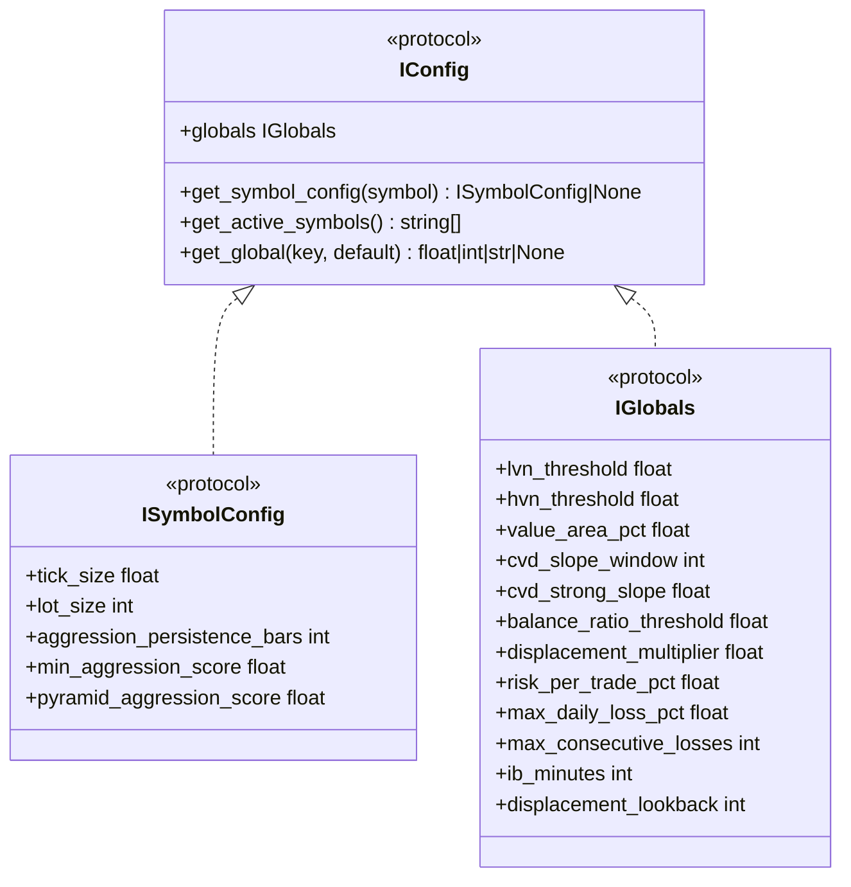

**Diagram sources**
- [config_port.py:12-135](file://backend/app/domain/ports/config_port.py#L12-L135)

**Section sources**
- [config_port.py:1-135](file://backend/app/domain/ports/config_port.py#L1-L135)

## Market State Services

### StateBus Service
- Central state bus with validation middleware.
- Validates market data freshness (max 5-second staleness).
- Ensures session consistency across updates.
- Emits DataAnomaly events for invariant violations.
- Maintains anomaly history with configurable limits.

### RiskSizingEngine
- Deterministic Kelly-based position sizing.
- Risk tier selection based on consecutive losses and session PnL.
- Lot calculation using instrument-specific lot sizes.
- Scale-in planning following 40%/30%/30% rule.
- Minimum risk:reward ratio enforcement.

### MarketStateClassifier
- Classifies market structure as BALANCED, IMBALANCED, TRENDING.
- Uses volume profile, VWAP, and price action analysis.
- Detects trending conditions based on consecutive closes.
- Validates balanced market conditions with POC proximity.

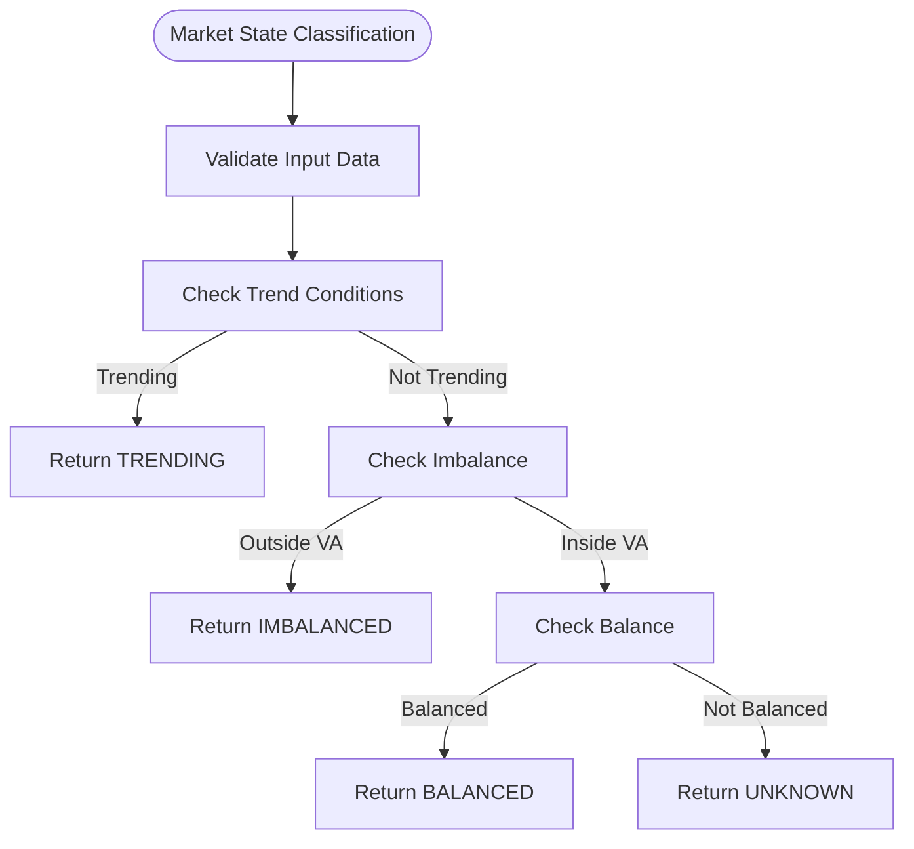

**Diagram sources**
- [market_state_classifier.py:23-97](file://backend/app/domain/services/market_state_classifier.py#L23-L97)

**Section sources**
- [state_bus.py:1-247](file://backend/app/domain/services/state_bus.py#L1-L247)
- [risk_sizing_engine.py:1-204](file://backend/app/domain/services/risk_sizing_engine.py#L1-L204)
- [market_state_classifier.py:1-97](file://backend/app/domain/services/market_state_classifier.py#L1-L97)

## Dependency Analysis
- Internal dependencies
  - Trade depends on EntrySignal, Fill, Position, enums, and events.
  - Portfolio depends on Position, Signal, OHLC, and StrategyStats.
  - MarketState models depend on each other for validation.
  - StateBus validates ExchangeConfig and MarketState objects.
  - RiskSizingEngine uses ExchangeConfig for lot sizes.
  - All domain services consume ports and configuration models.
- External dependencies
  - Domain avoids external dependencies; adapters implement ports in infrastructure.

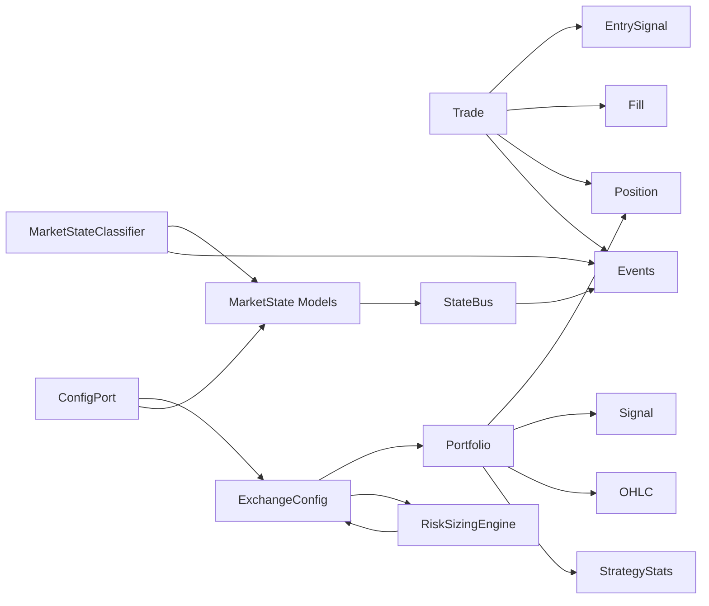

**Diagram sources**
- [trade_aggregate.py:293-795](file://backend/app/domain/trading/models/trade_aggregate.py#L293-L795)
- [aggregates.py:67-541](file://backend/app/domain/trading/models/aggregates.py#L67-L541)
- [exchange_config.py:20-307](file://backend/app/domain/models/exchange_config.py#L20-L307)
- [market_state.py:20-173](file://backend/app/domain/models/market_state.py#L20-L173)
- [state_bus.py:45-247](file://backend/app/domain/services/state_bus.py#L45-L247)
- [risk_sizing_engine.py:44-204](file://backend/app/domain/services/risk_sizing_engine.py#L44-L204)
- [market_state_classifier.py:10-97](file://backend/app/domain/services/market_state_classifier.py#L10-L97)

**Section sources**
- [trade_aggregate.py:1-795](file://backend/app/domain/trading/models/trade_aggregate.py#L1-L795)
- [aggregates.py:1-541](file://backend/app/domain/trading/models/aggregates.py#L1-L541)
- [exchange_config.py:1-307](file://backend/app/domain/models/exchange_config.py#L1-L307)
- [market_state.py:1-173](file://backend/app/domain/models/market_state.py#L1-L173)
- [state_bus.py:1-247](file://backend/app/domain/services/state_bus.py#L1-L247)
- [risk_sizing_engine.py:1-204](file://backend/app/domain/services/risk_sizing_engine.py#L1-L204)
- [market_state_classifier.py:1-97](file://backend/app/domain/services/market_state_classifier.py#L1-L97)

## Performance Considerations
- Immutability and on-demand derivation reduce memory overhead and ensure deterministic replay.
- Decimal arithmetic prevents floating-point drift in financial computations.
- Event sourcing supports efficient audits and selective recomputation.
- Ports enable caching and batching at infrastructure adapters without affecting domain logic.
- StateBus provides centralized validation reducing redundant checks across services.
- RiskSizingEngine uses deterministic calculations for sub-millisecond response times.
- ExchangeConfig provides cached instrument settings avoiding repeated lookups.

## Troubleshooting Guide
- Use standardized error handling utilities to log and continue on non-critical failures.
- For inference readiness, use wait_until_ready to avoid runtime errors.
- Validate inputs with to_decimal to catch conversion issues early.
- Inspect event histories to diagnose state inconsistencies.
- Monitor StateBus anomalies for data quality issues.
- Check RiskSizingEngine results for position sizing constraints.
- Verify ExchangeConfig settings for instrument-specific parameters.

**Section sources**
- [error_handling.py:71-203](file://shared/error_handling.py#L71-L203)
- [llm_inference.py:29-37](file://backend/app/domain/ports/llm_inference.py#L29-L37)
- [decimal_utils.py:13-46](file://backend/app/domain/services/decimal_utils.py#L13-L46)
- [state_bus.py:27-247](file://backend/app/domain/services/state_bus.py#L27-L247)
- [risk_sizing_engine.py:77-204](file://backend/app/domain/services/risk_sizing_engine.py#L77-L204)

## Conclusion
The Domain Layer cleanly separates business logic from infrastructure via value objects, entities, aggregates, and ports. It enforces strong invariants, uses immutable events for auditability, and maintains monetary precision with Decimal. The enhanced domain models provide comprehensive trading support with portfolio management, exchange-specific configuration, and market state validation. The new configuration management system offers broker-agnostic settings through protocol-based interfaces. The 33 domain services deliver specialized functionality for risk management, market analysis, and trading operations. The error handling framework and broker-agnostic design principles ensure robustness and flexibility across diverse execution environments.