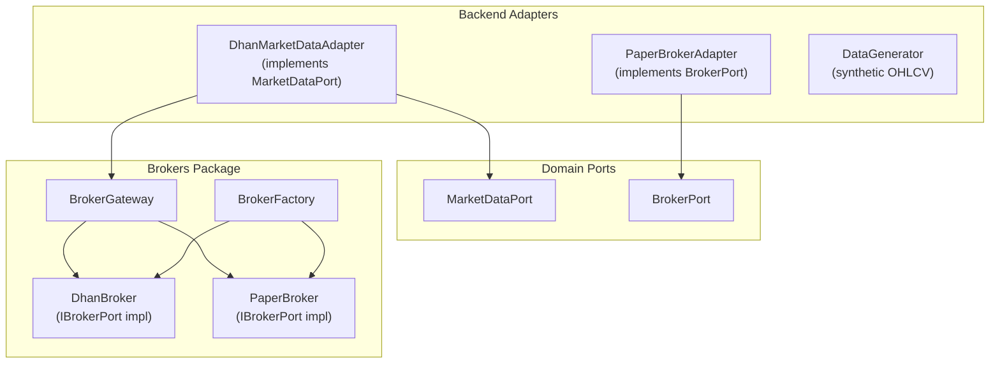
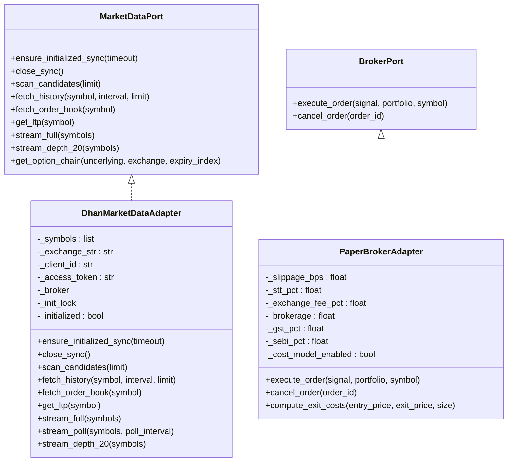
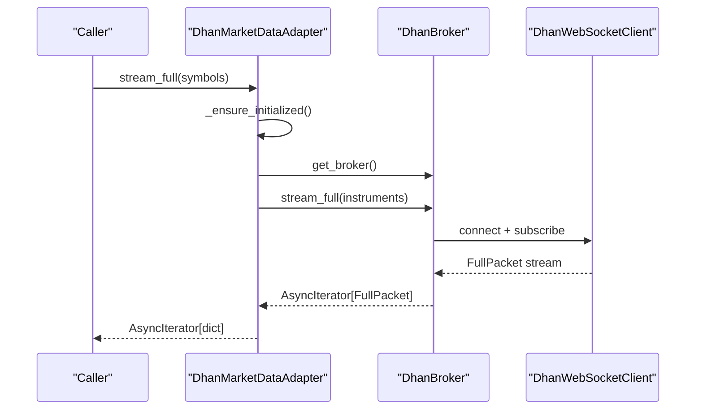
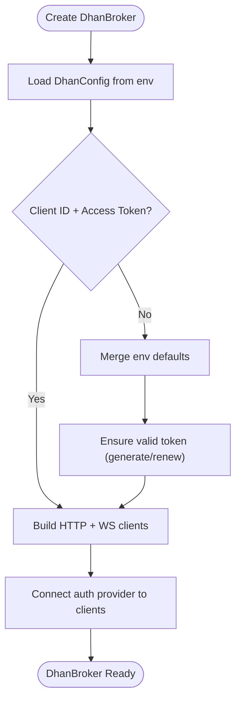
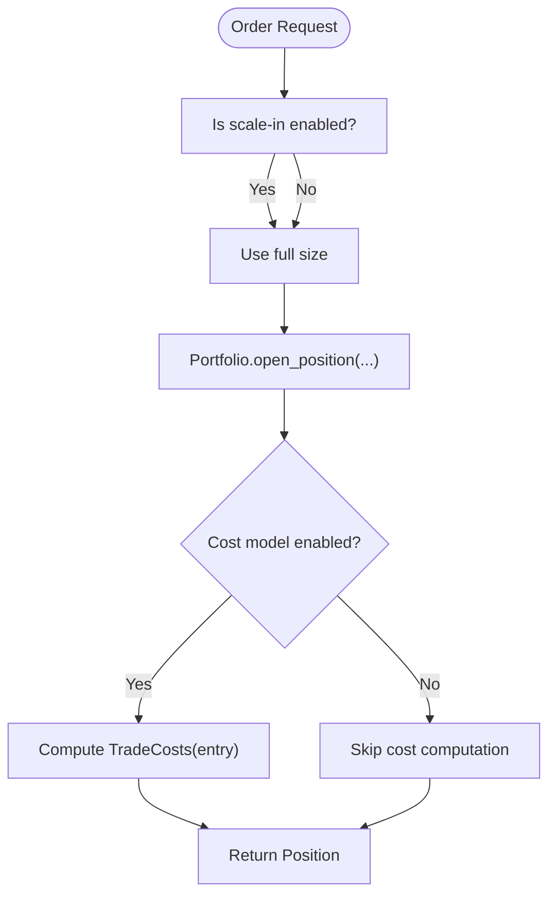
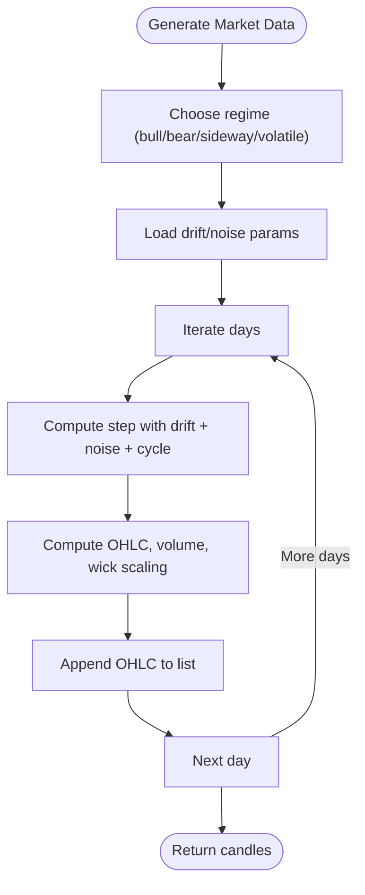
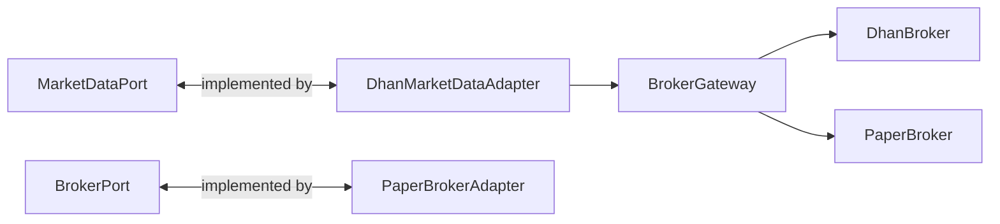

# Broker Adapters

<cite>
**Referenced Files in This Document**
- [broker.py](file://backend/app/domain/ports/broker.py)
- [market_data.py](file://backend/app/domain/ports/market_data.py)
- [dhan_adapter.py](file://backend/app/infrastructure/adapters/dhan_adapter.py)
- [paper_broker.py](file://backend/app/infrastructure/adapters/paper_broker.py)
- [data_generator.py](file://backend/app/infrastructure/adapters/data_generator.py)
- [ports.py](file://brokers/broker/ports.py)
- [gateway.py](file://brokers/gateway.py)
- [broker.py](file://brokers/broker/dhan/application/broker.py)
- [entities.py](file://brokers/broker/entities.py)
- [types.py](file://brokers/broker/types.py)
</cite>

## Table of Contents
1. [Introduction](#introduction)
2. [Project Structure](#project-structure)
3. [Core Components](#core-components)
4. [Architecture Overview](#architecture-overview)
5. [Detailed Component Analysis](#detailed-component-analysis)
6. [Dependency Analysis](#dependency-analysis)
7. [Performance Considerations](#performance-considerations)
8. [Troubleshooting Guide](#troubleshooting-guide)
9. [Conclusion](#conclusion)

## Introduction
This document explains the broker adapters powering market data and order execution across environments. It covers:
- Dhan WebSocket integration and market data streaming
- Paper trading broker for backtesting and development
- Data generator for deterministic synthetic market data
- Adapter interfaces, connection management, authentication, and heartbeat/reconnection strategies
- Configuration requirements, error handling, and fallback mechanisms

## Project Structure
The broker ecosystem is split between the backend adapters and the reusable brokers package:
- Backend adapters implement domain ports and integrate with the brokers package
- The brokers package provides unified interfaces, gateways, and implementations (Dhan, Paper)



**Diagram sources**
- [dhan_adapter.py:66-457](file://backend/app/infrastructure/adapters/dhan_adapter.py#L66-L457)
- [paper_broker.py:118-199](file://backend/app/infrastructure/adapters/paper_broker.py#L118-L199)
- [data_generator.py:27-82](file://backend/app/infrastructure/adapters/data_generator.py#L27-L82)
- [market_data.py:19-112](file://backend/app/domain/ports/market_data.py#L19-L112)
- [broker.py:11-27](file://backend/app/domain/ports/broker.py#L11-L27)
- [gateway.py:154-423](file://brokers/gateway.py#L154-L423)
- [ports.py:87-418](file://brokers/broker/ports.py#L87-L418)
- [broker.py:76-823](file://brokers/broker/dhan/application/broker.py#L76-L823)

**Section sources**
- [dhan_adapter.py:66-457](file://backend/app/infrastructure/adapters/dhan_adapter.py#L66-L457)
- [paper_broker.py:118-199](file://backend/app/infrastructure/adapters/paper_broker.py#L118-L199)
- [data_generator.py:27-82](file://backend/app/infrastructure/adapters/data_generator.py#L27-L82)
- [market_data.py:19-112](file://backend/app/domain/ports/market_data.py#L19-L112)
- [broker.py:11-27](file://backend/app/domain/ports/broker.py#L11-L27)
- [gateway.py:154-423](file://brokers/gateway.py#L154-L423)
- [ports.py:87-418](file://brokers/broker/ports.py#L87-L418)
- [broker.py:76-823](file://brokers/broker/dhan/application/broker.py#L76-L823)

## Core Components
- MarketDataPort: Defines lifecycle, market data queries, live streaming, and optional options support.
- BrokerPort: Defines order execution and cancellation for paper/live brokers.
- DhanMarketDataAdapter: Bridges backend to the brokers package DhanBroker for production-grade market data and streaming.
- PaperBrokerAdapter: Simulates realistic trading costs and order execution for backtesting and dev.
- DataGenerator: Produces deterministic synthetic OHLCV for tests and demos.

Key responsibilities:
- Connection management: DhanBroker manages HTTP and WebSocket lifecycles and caches instrument metadata.
- Authentication: DhanBroker supports token generation/renewal and integrates with an auth provider.
- Streaming: DhanBroker exposes ticker, quotes, depth, and full-packet feeds; fallbacks for MCX OPTFUT via REST polling.
- Cost modeling: PaperBrokerAdapter simulates realistic trading costs and scale-in behavior.

**Section sources**
- [market_data.py:19-112](file://backend/app/domain/ports/market_data.py#L19-L112)
- [broker.py:11-27](file://backend/app/domain/ports/broker.py#L11-L27)
- [dhan_adapter.py:66-457](file://backend/app/infrastructure/adapters/dhan_adapter.py#L66-L457)
- [paper_broker.py:118-199](file://backend/app/infrastructure/adapters/paper_broker.py#L118-L199)
- [data_generator.py:27-82](file://backend/app/infrastructure/adapters/data_generator.py#L27-L82)

## Architecture Overview
The system separates domain interfaces from infrastructure implementations. Backend adapters implement domain ports and delegate to the brokers package, which provides a unified gateway and concrete broker implementations.



**Diagram sources**
- [market_data.py:19-112](file://backend/app/domain/ports/market_data.py#L19-L112)
- [broker.py:11-27](file://backend/app/domain/ports/broker.py#L11-L27)
- [dhan_adapter.py:66-457](file://backend/app/infrastructure/adapters/dhan_adapter.py#L66-L457)
- [paper_broker.py:118-199](file://backend/app/infrastructure/adapters/paper_broker.py#L118-L199)

## Detailed Component Analysis

### Dhan WebSocket Integration and Market Data Streaming
DhanMarketDataAdapter implements MarketDataPort and delegates to DhanBroker from the brokers package. It:
- Lazily initializes DhanBroker with thread-safe guards
- Converts backend entities to broker entities and vice versa
- Provides REST fallback for MCX OPTFUT via stream_poll
- Exposes stream_full and stream_depth_20



**Diagram sources**
- [dhan_adapter.py:364-435](file://backend/app/infrastructure/adapters/dhan_adapter.py#L364-L435)
- [broker.py:652-663](file://brokers/broker/dhan/application/broker.py#L652-L663)

Key behaviors:
- Initialization: Uses a lock to ensure single initialization across sync/async contexts.
- Instrument resolution: Builds Instrument objects and auto-detects exchanges and option types.
- Streaming: stream_full yields dicts for compatibility; stream_poll provides REST fallback for MCX OPTFUT.

**Section sources**
- [dhan_adapter.py:102-147](file://backend/app/infrastructure/adapters/dhan_adapter.py#L102-L147)
- [dhan_adapter.py:167-190](file://backend/app/infrastructure/adapters/dhan_adapter.py#L167-L190)
- [dhan_adapter.py:364-435](file://backend/app/infrastructure/adapters/dhan_adapter.py#L364-L435)

### Authentication and Token Management
DhanBroker creates and manages credentials:
- Loads from environment or accepts explicit parameters
- Ensures a valid access token (generation/renewal) before building clients
- Integrates an auth provider with HTTP and WebSocket clients for runtime refresh



**Diagram sources**
- [broker.py:139-255](file://brokers/broker/dhan/application/broker.py#L139-L255)

**Section sources**
- [broker.py:139-255](file://brokers/broker/dhan/application/broker.py#L139-L255)

### Heartbeat Handling and Reconnection Strategies
- DhanBroker maintains a persistent event loop and thread for async operations.
- WebSocket client is managed by DhanBroker; close_sync ensures graceful shutdown.
- Circuit breaker protection is available via CircuitBreakerWrapper for synchronous operations.

```mermaid
sequenceDiagram
participant App as "Application"
participant Broker as "DhanBroker"
participant Loop as "Sidecar Event Loop"
participant WS as "WebSocket Client"
App->>Broker : initialize()
Broker->>Loop : start thread + run_forever
Broker->>WS : connect()
WS-->>Broker : connected
App->>Broker : close_sync()
Broker->>WS : disconnect()
Broker->>Loop : stop()
WS-->>Broker : disconnected
Loop-->>Broker : stopped
```

**Diagram sources**
- [broker.py:284-351](file://brokers/broker/dhan/application/broker.py#L284-L351)

**Section sources**
- [broker.py:284-351](file://brokers/broker/dhan/application/broker.py#L284-L351)
- [ports.py:639-800](file://brokers/broker/ports.py#L639-L800)

### Paper Trading Broker for Backtesting and Development
PaperBrokerAdapter implements BrokerPort with:
- Realistic cost model (slippage, STT, exchange fees, brokerage, GST, SEBI)
- Scale-in behavior for LLM-driven entries
- No-op for individual stop bracket cancellation (as applicable)



**Diagram sources**
- [paper_broker.py:139-175](file://backend/app/infrastructure/adapters/paper_broker.py#L139-L175)

**Section sources**
- [paper_broker.py:118-199](file://backend/app/infrastructure/adapters/paper_broker.py#L118-L199)

### Data Generator for Deterministic Synthetic Market Data
DataGenerator produces synthetic OHLCV series for testing:
- Regimes: bullish, bearish, sideways, volatile
- Noise and drift parameters per regime
- Generates realistic OHLC, volume, VWAP, taker buy volume, and delta



**Diagram sources**
- [data_generator.py:27-82](file://backend/app/infrastructure/adapters/data_generator.py#L27-L82)

**Section sources**
- [data_generator.py:27-82](file://backend/app/infrastructure/adapters/data_generator.py#L27-L82)

## Dependency Analysis
- Backend adapters depend on domain ports and the brokers package.
- DhanMarketDataAdapter depends on DhanBroker; PaperBrokerAdapter depends on BrokerPort.
- BrokerGateway provides a unified API and factory for broker creation and circuit breaker protection.



**Diagram sources**
- [market_data.py:19-112](file://backend/app/domain/ports/market_data.py#L19-L112)
- [broker.py:11-27](file://backend/app/domain/ports/broker.py#L11-L27)
- [dhan_adapter.py:66-101](file://backend/app/infrastructure/adapters/dhan_adapter.py#L66-L101)
- [gateway.py:154-248](file://brokers/gateway.py#L154-L248)
- [ports.py:87-100](file://brokers/broker/ports.py#L87-L100)

**Section sources**
- [gateway.py:154-248](file://brokers/gateway.py#L154-L248)
- [ports.py:87-100](file://brokers/broker/ports.py#L87-L100)

## Performance Considerations
- DhanBroker uses a persistent sidecar event loop to avoid repeated loop creation overhead.
- Instrument cache reduces repeated symbol resolution calls.
- Circuit breaker protects synchronous operations against transient failures.
- DataGenerator uses deterministic RNG seeds for reproducible tests.

[No sources needed since this section provides general guidance]

## Troubleshooting Guide
Common issues and resolutions:
- Initialization failures: DhanBroker initialization logs and propagates exceptions; ensure credentials are valid.
- WebSocket disconnections: Use close_sync to gracefully shut down; verify loop thread termination.
- MCX OPTFUT no-data: Use stream_poll fallback to poll LTP via REST.
- Dry-run mode: BrokerGateway intercepts order placement/cancellation when DRY_RUN is enabled.

**Section sources**
- [dhan_adapter.py:102-147](file://backend/app/infrastructure/adapters/dhan_adapter.py#L102-L147)
- [broker.py:307-351](file://brokers/broker/dhan/application/broker.py#L307-L351)
- [dhan_adapter.py:383-435](file://backend/app/infrastructure/adapters/dhan_adapter.py#L383-L435)
- [gateway.py:319-348](file://brokers/gateway.py#L319-L348)

## Conclusion
The broker adapters provide a clean separation between domain interfaces and infrastructure implementations. DhanMarketDataAdapter offers production-grade market data and streaming with robust initialization, authentication, and fallback strategies. PaperBrokerAdapter enables realistic backtesting with a comprehensive cost model. DataGenerator supplies deterministic synthetic data for testing. Together, these components support reliable trading workflows across development, backtesting, and live environments.