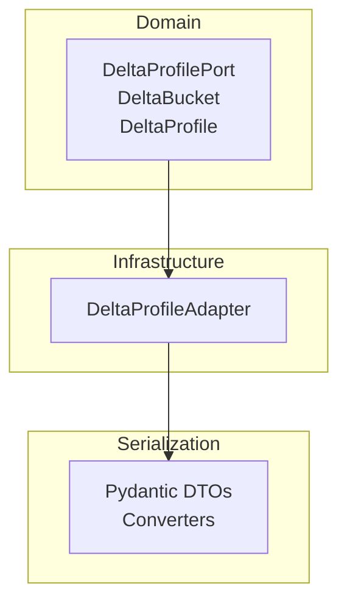
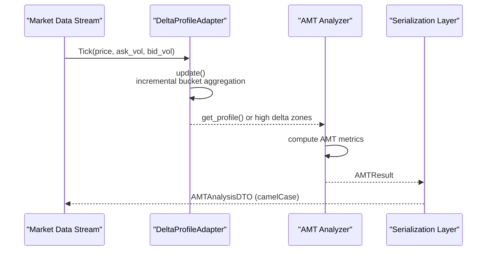
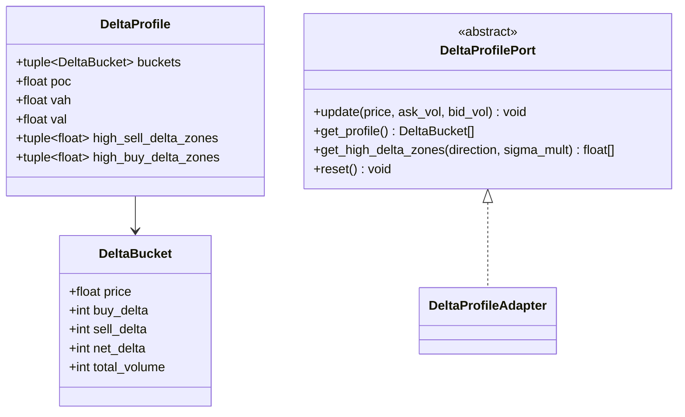
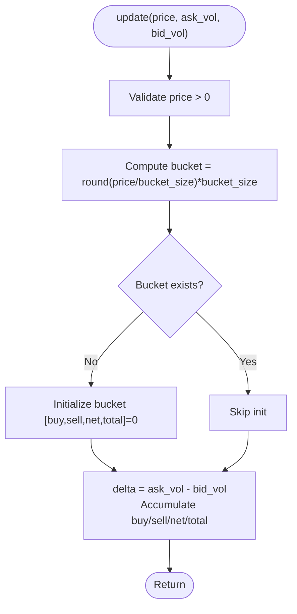
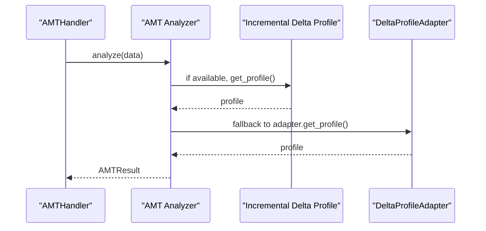
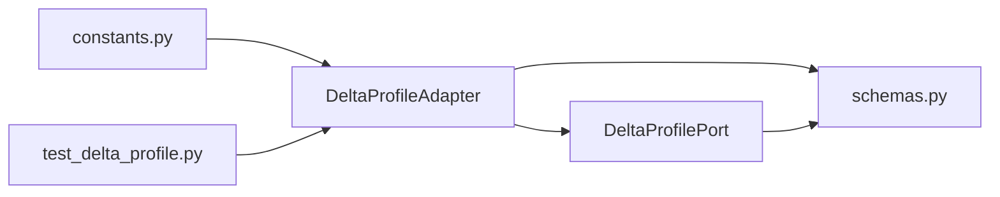

# Delta Profile Adapters

<cite>
**Referenced Files in This Document**
- [delta_profile_adapter.py](file://backend/app/infrastructure/adapters/delta_profile_adapter.py)
- [delta_profile.py](file://backend/app/domain/ports/delta_profile.py)
- [schemas.py](file://backend/app/infrastructure/serialization/schemas.py)
- [constants.py](file://backend/app/domain/constants.py)
- [test_delta_profile.py](file://backend/tests/unit/test_delta_profile.py)
- [amt_analyzer.py](file://backend/app/domain/fabio_ai/services/amt_analyzer.py)
- [amt_handler.py](file://backend/app/application/handlers/amt_handler.py)
</cite>

## Table of Contents
1. [Introduction](#introduction)
2. [Project Structure](#project-structure)
3. [Core Components](#core-components)
4. [Architecture Overview](#architecture-overview)
5. [Detailed Component Analysis](#detailed-component-analysis)
6. [Dependency Analysis](#dependency-analysis)
7. [Performance Considerations](#performance-considerations)
8. [Troubleshooting Guide](#troubleshooting-guide)
9. [Conclusion](#conclusion)

## Introduction
This document explains the delta profile adapters and serialization infrastructure used for real-time order flow analysis. It covers:
- The delta profile adapter implementation for bid/ask depth tracking and volume delta calculations
- Serialization schemas for data interchange using Pydantic models and validation rules
- Integration with market data streams, delta calculation algorithms, and profile construction patterns
- Performance considerations for high-frequency data processing and memory management
- The relationship between delta profiles and AMT analysis components

## Project Structure
The delta profile feature spans three layers:
- Domain port and data contracts define the delta profile interface and immutable DTOs
- Infrastructure adapter implements the delta profile computation with O(1) per-tick updates
- Serialization layer provides Pydantic DTOs and converters for API interchange

**Diagram sources**
- [delta_profile.py:14-75](file://backend/app/domain/ports/delta_profile.py#L14-L75)
- [delta_profile_adapter.py:20-143](file://backend/app/infrastructure/adapters/delta_profile_adapter.py#L20-L143)
- [schemas.py:1-667](file://backend/app/infrastructure/serialization/schemas.py#L1-L667)

**Section sources**
- [delta_profile.py:1-75](file://backend/app/domain/ports/delta_profile.py#L1-L75)
- [delta_profile_adapter.py:1-143](file://backend/app/infrastructure/adapters/delta_profile_adapter.py#L1-L143)
- [schemas.py:1-667](file://backend/app/infrastructure/serialization/schemas.py#L1-L667)

## Core Components
- DeltaProfilePort defines the abstract interface for delta-colored volume profiles, including update semantics, profile retrieval, high delta zone detection, and reset behavior.
- DeltaBucket and DeltaProfile are immutable DTOs carrying per-price-level delta metrics and derived profile statistics.
- DeltaProfileAdapter implements the port with O(1) incremental updates, bucket accumulation, and high delta zone detection using sigma thresholds.
- Serialization schemas provide Pydantic DTOs for API payloads and converters to transform domain objects into transportable structures.

Key responsibilities:
- Real-time delta aggregation per price bucket
- High delta zone identification aligned with Fabio methodology (LONG entry via high sell delta; SHORT entry via high buy delta)
- Seamless API serialization and deserialization with strict field validation and camelCase aliasing

**Section sources**
- [delta_profile.py:14-75](file://backend/app/domain/ports/delta_profile.py#L14-L75)
- [delta_profile_adapter.py:20-143](file://backend/app/infrastructure/adapters/delta_profile_adapter.py#L20-L143)
- [schemas.py:1-667](file://backend/app/infrastructure/serialization/schemas.py#L1-L667)

## Architecture Overview
The delta profile pipeline integrates with AMT analysis as follows:
- Market data feeds tick updates to the delta profile adapter
- The adapter maintains per-bucket accumulators and exposes high delta zones
- AMT analyzer consumes the delta profile (via incremental or full rebuild) to inform market state and entry signals
- Serialization converts internal domain structures to DTOs for API exposure

**Diagram sources**
- [delta_profile_adapter.py:37-76](file://backend/app/infrastructure/adapters/delta_profile_adapter.py#L37-L76)
- [amt_analyzer.py:653-675](file://backend/app/domain/fabio_ai/services/amt_analyzer.py#L653-L675)
- [schemas.py:91-163](file://backend/app/infrastructure/serialization/schemas.py#L91-L163)

## Detailed Component Analysis

### DeltaProfilePort and DTO Contracts
- DeltaBucket encapsulates price-level delta metrics: buy_delta, sell_delta, net_delta, total_volume.
- DeltaProfile aggregates buckets with derived statistics (POC, VAH, VAL) and high delta zones for both directions.
- DeltaProfilePort defines the interface for update, profile retrieval, high delta zone detection, and reset.

**Diagram sources**
- [delta_profile.py:14-75](file://backend/app/domain/ports/delta_profile.py#L14-L75)

**Section sources**
- [delta_profile.py:14-75](file://backend/app/domain/ports/delta_profile.py#L14-L75)

### DeltaProfileAdapter Implementation
- Maintains a dictionary of buckets keyed by rounded price levels using a configurable bucket size.
- update(): O(1) operation that increments buy/sell delta, net delta, and total volume per bucket.
- get_profile(): Returns sorted list of DeltaBucket instances for the current state.
- get_high_delta_zones(): Computes mean absolute net delta across buckets and flags zones exceeding sigma_mult × mean for LONG (net_delta very negative) or SHORT (net_delta very positive).
- get_delta_at_price(): Retrieves per-bucket deltas for a given price after rounding.
- reset(), bucket_size, bucket_count, total_volume: Utility properties for state inspection and lifecycle management.

**Diagram sources**
- [delta_profile_adapter.py:37-57](file://backend/app/infrastructure/adapters/delta_profile_adapter.py#L37-L57)

**Section sources**
- [delta_profile_adapter.py:20-143](file://backend/app/infrastructure/adapters/delta_profile_adapter.py#L20-L143)
- [constants.py:42-67](file://backend/app/domain/constants.py#L42-L67)

### Serialization Infrastructure and Validation
- Pydantic DTOs define API contracts with camelCase aliases for frontend compatibility.
- Converters bridge domain objects to DTOs and vice versa, ensuring type safety and schema validation.
- Example DTOs include OHLCDataDTO, OrderBookDTO, VolumeProfileLevelDTO, AggressivePrintDTO, TradeSignalDTO, and AMTAnalysisDTO.
- Converters include ohlc_to_dto, dto_to_ohlc, dto_to_order_book, dto_to_weights, position_to_dto, position_event_to_dto, portfolio_to_dto, signal_to_dto, amt_result_to_dto, stats_to_dto, footprint_to_dto.

Validation rules and patterns:
- Field aliasing ensures camelCase JSON payloads while keeping Pythonic field names internally.
- Optional fields and defaults prevent missing data errors during deserialization.
- Extra fields forbidden in selected models prevents schema drift.
- Converters enforce type casting and optional metadata enrichment.

**Section sources**
- [schemas.py:31-163](file://backend/app/infrastructure/serialization/schemas.py#L31-L163)
- [schemas.py:371-667](file://backend/app/infrastructure/serialization/schemas.py#L371-L667)

### Integration with AMT Analysis
- AMT analyzer selects between incremental delta profile and full rebuild based on availability and data growth.
- When an incremental delta profile is present, the analyzer uses get_profile() to derive market state and entry zones.
- High delta zones computed by the adapter feed into AMT decision logic for LONG/SHORT entries aligned with Fabio methodology.

**Diagram sources**
- [amt_analyzer.py:653-675](file://backend/app/domain/fabio_ai/services/amt_analyzer.py#L653-L675)
- [amt_handler.py:254-266](file://backend/app/application/handlers/amt_handler.py#L254-L266)

**Section sources**
- [amt_analyzer.py:653-675](file://backend/app/domain/fabio_ai/services/amt_analyzer.py#L653-L675)
- [amt_handler.py:254-266](file://backend/app/application/handlers/amt_handler.py#L254-L266)

## Dependency Analysis
- Domain depends on ports and DTOs; infrastructure adapters implement ports; serialization depends on domain DTOs but not vice versa.
- Constants module supplies bucket size and sigma thresholds used by the adapter.
- Tests validate adapter correctness and edge cases.

**Diagram sources**
- [constants.py:42-67](file://backend/app/domain/constants.py#L42-L67)
- [delta_profile_adapter.py:32-35](file://backend/app/infrastructure/adapters/delta_profile_adapter.py#L32-L35)
- [delta_profile.py:37-75](file://backend/app/domain/ports/delta_profile.py#L37-L75)
- [schemas.py:1-667](file://backend/app/infrastructure/serialization/schemas.py#L1-L667)
- [test_delta_profile.py:1-153](file://backend/tests/unit/test_delta_profile.py#L1-L153)

**Section sources**
- [constants.py:42-67](file://backend/app/domain/constants.py#L42-L67)
- [delta_profile_adapter.py:32-35](file://backend/app/infrastructure/adapters/delta_profile_adapter.py#L32-L35)
- [delta_profile.py:37-75](file://backend/app/domain/ports/delta_profile.py#L37-L75)
- [schemas.py:1-667](file://backend/app/infrastructure/serialization/schemas.py#L1-L667)
- [test_delta_profile.py:1-153](file://backend/tests/unit/test_delta_profile.py#L1-L153)

## Performance Considerations
- Time complexity
  - update(): O(1) average-case dictionary access and mutation
  - get_profile(): O(B log B) due to sorting B buckets
  - get_high_delta_zones(): O(B) to compute mean absolute net delta and filter zones
- Space complexity
  - Buckets stored in a hash map; memory scales with distinct price buckets observed
  - Bucket size influences memory footprint and resolution; tuned via constants
- High-frequency processing
  - Prefer incremental updates to avoid rebuilding the entire profile
  - Use bucket_size appropriate to instrument tick size and price scale
  - Limit lookback windows in downstream analyzers to cap recomputation cost
- Memory management
  - Reset adapter at session boundaries to clear accumulated state
  - Monitor bucket_count and total_volume for anomaly detection
- Validation strategies
  - Validate price > 0 and non-negative volumes before bucket updates
  - Normalize price to bucket before accessing or initializing buckets
  - Use sigma_mult thresholds to reduce noise and false positives

[No sources needed since this section provides general guidance]

## Troubleshooting Guide
Common issues and resolutions:
- Empty or stale profile
  - Ensure update() receives valid price (> 0) and non-negative ask/bid volumes
  - Verify bucket_size aligns with instrument tick size to avoid excessive fragmentation
- Unexpected high delta zones
  - Adjust sigma_mult in get_high_delta_zones() to tighten or relax thresholds
  - Confirm that net_delta signs match intended direction (LONG: negative; SHORT: positive)
- Serialization errors
  - Validate DTO field types and presence of required fields
  - Use converters to ensure proper type casting and aliasing
- Integration with AMT analyzer
  - Confirm incremental delta profile availability when data grows by exactly one candle
  - On bulk growth or shrinkage, expect full rebuild and verify handler logic

**Section sources**
- [delta_profile_adapter.py:45-46](file://backend/app/infrastructure/adapters/delta_profile_adapter.py#L45-L46)
- [delta_profile_adapter.py:94-112](file://backend/app/infrastructure/adapters/delta_profile_adapter.py#L94-L112)
- [schemas.py:371-400](file://backend/app/infrastructure/serialization/schemas.py#L371-L400)
- [amt_handler.py:254-266](file://backend/app/application/handlers/amt_handler.py#L254-L266)

## Conclusion
The delta profile adapter provides an efficient, O(1)-per-tick mechanism for aggregating bid/ask depth and computing net delta per price bucket. Combined with robust serialization DTOs and converters, it enables seamless integration with AMT analysis for real-time order flow insights. Proper configuration of bucket size and sigma thresholds, along with disciplined reset and validation practices, ensures reliable performance in high-frequency trading environments.