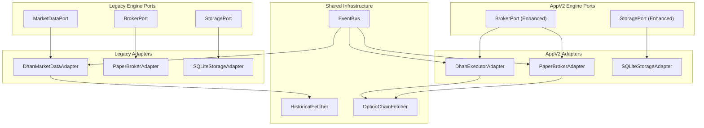
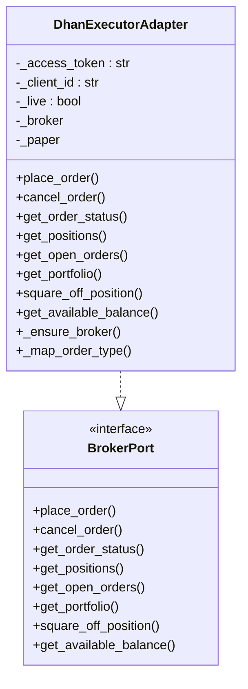
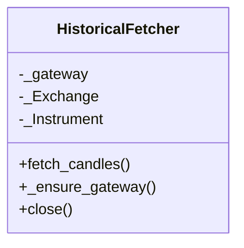
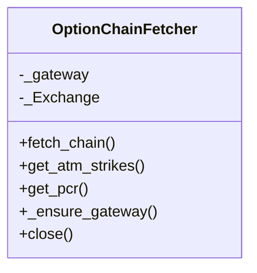
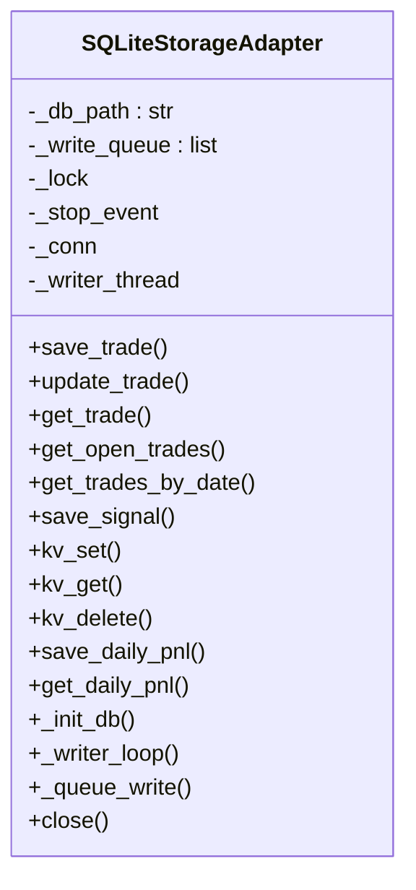
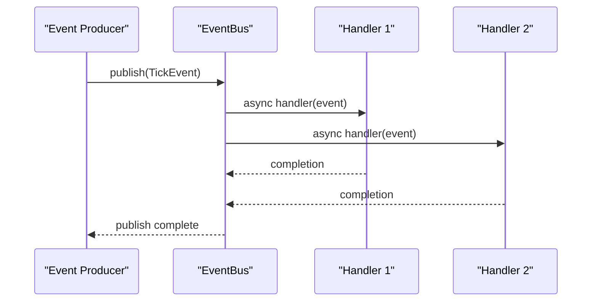
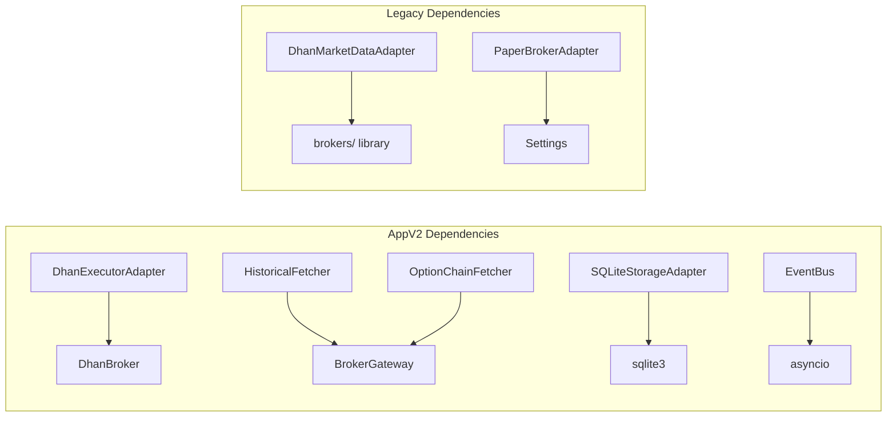

# Infrastructure Layer

<cite>
**Referenced Files in This Document**
- [dhan_executor.py](file://appv2/backend/appv2/infrastructure/dhan_executor.py)
- [historical_fetcher.py](file://appv2/backend/appv2/infrastructure/historical_fetcher.py)
- [option_chain_fetcher.py](file://appv2/backend/appv2/infrastructure/option_chain_fetcher.py)
- [sqlite_storage.py](file://appv2/backend/appv2/infrastructure/sqlite_storage.py)
- [paper_executor.py](file://appv2/backend/appv2/infrastructure/paper_executor.py)
- [event_bus.py](file://appv2/backend/appv2/infrastructure/event_bus.py)
- [main.py](file://appv2/backend/appv2/infrastructure/main.py)
- [adapters/__init__.py](file://backend/app/infrastructure/adapters/__init__.py)
- [dhan_adapter.py](file://backend/app/infrastructure/adapters/dhan_adapter.py)
- [paper_broker.py](file://backend/app/infrastructure/adapters/paper_broker.py)
- [mlx_inference_adapter.py](file://backend/app/infrastructure/adapters/mlx_inference_adapter.py)
- [lgbm_probability_adapter.py](file://backend/app/infrastructure/adapters/lgbm_probability_adapter.py)
- [null_notification_adapter.py](file://backend/app/infrastructure/adapters/null_notification_adapter.py)
- [async_persistence.py](file://backend/app/infrastructure/async_persistence.py)
- [database.py](file://backend/app/infrastructure/storage/database.py)
- [schemas.py](file://backend/app/infrastructure/serialization/schemas.py)
- [metrics.py](file://backend/app/infrastructure/metrics.py)
- [mlx_gpu_lock.py](file://backend/app/infrastructure/mlx_gpu_lock.py)
- [development.yaml](file://backend/config/environments/development.yaml)
</cite>

## Update Summary
**Changes Made**
- Added comprehensive documentation for new appv2 infrastructure adapters
- Documented Dhan executor adapter with live trading safety controls
- Added historical fetcher component for Dhan API integration
- Documented option chain fetcher for NFO options data
- Enhanced SQLite storage adapter with async background persistence
- Updated broker adapter architecture to include both appv2 and legacy adapters
- Expanded infrastructure layer to cover both trading engines

## Table of Contents
1. [Introduction](#introduction)
2. [Project Structure](#project-structure)
3. [Core Components](#core-components)
4. [Architecture Overview](#architecture-overview)
5. [Detailed Component Analysis](#detailed-component-analysis)
6. [Dependency Analysis](#dependency-analysis)
7. [Performance Considerations](#performance-considerations)
8. [Troubleshooting Guide](#troubleshooting-guide)
9. [Conclusion](#conclusion)
10. [Appendices](#appendices)

## Introduction
This document describes the Infrastructure Layer responsible for external system integrations and concrete implementations across both the legacy backend and the new appv2 trading system. It covers:
- Broker adapters: Dhan (live) and Paper (simulated) for both trading engines
- Machine Learning inference adapters: MLX (Apple Silicon) and LightGBM
- Storage implementation: SQLite with async persistence for both engines
- Event bus system for decoupled communication
- Historical data fetching and option chain integration
- Notifications: Telegram-like integration via a generic NotificationPort
- Configuration management and environment-specific settings

The layer follows the Ports and Adapters pattern, mapping domain ports to concrete adapters and ensuring clean separation between business logic and external concerns across both trading systems.

## Project Structure
The Infrastructure Layer is organized by concern with dual trading engine support:
- appv2/infrastructure: New trading engine adapters and components
- backend/app/infrastructure/adapters: Legacy trading engine adapters
- storage: persistence adapters for both engines
- serialization: Pydantic DTOs for API boundary
- metrics: singleton metrics collector
- async_persistence: background I/O offloading
- event_bus: central event distribution system

```mermaid
graph TB
subgraph "Legacy Backend Infrastructure"
A1["adapters/"]
S1["storage/"]
SER1["serialization/"]
M1["metrics.py"]
AP1["async_persistence.py"]
L1["mlx_gpu_lock.py"]
end
subgraph "AppV2 Infrastructure"
A2["dhan_executor.py"]
A3["historical_fetcher.py"]
A4["option_chain_fetcher.py"]
A5["sqlite_storage.py"]
A6["paper_executor.py"]
A7["event_bus.py"]
end
A1 --> |"DhanMarketDataAdapter"| A11["dhan_adapter.py"]
A1 --> |"PaperBrokerAdapter"| A12["paper_broker.py"]
A1 --> |"MLXInferenceAdapter"| A13["mlx_inference_adapter.py"]
A1 --> |"LGBMProbabilityAdapter"| A14["lgbm_probability_adapter.py"]
A1 --> |"NullNotificationAdapter"| A15["null_notification_adapter.py"]
S1 --> |"SQLiteStorageAdapter"| S11["database.py"]
A2 --> |"Live Order Execution"| A21["DhanBroker"]
A3 --> |"Historical Data"| A31["BrokerGateway"]
A4 --> |"Options Chain"| A41["BrokerGateway"]
A5 --> |"Async Persistence"| A51["Background Writer"]
A7 --> |"Event Distribution"| A71["Event Handlers"]
```

**Diagram sources**
- [dhan_executor.py](file://appv2/backend/appv2/infrastructure/dhan_executor.py)
- [historical_fetcher.py](file://appv2/backend/appv2/infrastructure/historical_fetcher.py)
- [option_chain_fetcher.py](file://appv2/backend/appv2/infrastructure/option_chain_fetcher.py)
- [sqlite_storage.py](file://appv2/backend/appv2/infrastructure/sqlite_storage.py)
- [paper_executor.py](file://appv2/backend/appv2/infrastructure/paper_executor.py)
- [event_bus.py](file://appv2/backend/appv2/infrastructure/event_bus.py)
- [adapters/__init__.py](file://backend/app/infrastructure/adapters/__init__.py)
- [dhan_adapter.py](file://backend/app/infrastructure/adapters/dhan_adapter.py)
- [paper_broker.py](file://backend/app/infrastructure/adapters/paper_broker.py)
- [mlx_inference_adapter.py](file://backend/app/infrastructure/adapters/mlx_inference_adapter.py)
- [lgbm_probability_adapter.py](file://backend/app/infrastructure/adapters/lgbm_probability_adapter.py)
- [null_notification_adapter.py](file://backend/app/infrastructure/adapters/null_notification_adapter.py)
- [database.py](file://backend/app/infrastructure/storage/database.py)
- [async_persistence.py](file://backend/app/infrastructure/async_persistence.py)
- [schemas.py](file://backend/app/infrastructure/serialization/schemas.py)
- [metrics.py](file://backend/app/infrastructure/metrics.py)
- [mlx_gpu_lock.py](file://backend/app/infrastructure/mlx_gpu_lock.py)

**Section sources**
- [dhan_executor.py](file://appv2/backend/appv2/infrastructure/dhan_executor.py)
- [historical_fetcher.py](file://appv2/backend/appv2/infrastructure/historical_fetcher.py)
- [option_chain_fetcher.py](file://appv2/backend/appv2/infrastructure/option_chain_fetcher.py)
- [sqlite_storage.py](file://appv2/backend/appv2/infrastructure/sqlite_storage.py)
- [paper_executor.py](file://appv2/backend/appv2/infrastructure/paper_executor.py)
- [event_bus.py](file://appv2/backend/appv2/infrastructure/event_bus.py)
- [adapters/__init__.py](file://backend/app/infrastructure/adapters/__init__.py)

## Core Components
- **Broker adapters (Legacy)**: DhanMarketDataAdapter for live market data and PaperBrokerAdapter for simulated execution
- **Broker adapters (AppV2)**: DhanExecutorAdapter for live order execution with safety controls and PaperBrokerAdapter for simulated execution
- **Historical data**: HistoricalFetcher for Dhan API integration with configurable intervals and date ranges
- **Options chain**: OptionChainFetcher for NFO options data with ATM strike calculation and PCR ratio computation
- **Storage (AppV2)**: SQLiteStorageAdapter with async background persistence and comprehensive CRUD operations
- **Event system**: Central EventBus for decoupled communication between system components
- **ML inference adapters**: MLXInferenceAdapter and LGBMProbabilityAdapter for machine learning inference
- **Notifications**: NullNotificationAdapter for development and production-ready notification integration
- **Observability**: MetricsCollector for system monitoring and performance tracking

**Section sources**
- [dhan_executor.py](file://appv2/backend/appv2/infrastructure/dhan_executor.py)
- [historical_fetcher.py](file://appv2/backend/appv2/infrastructure/historical_fetcher.py)
- [option_chain_fetcher.py](file://appv2/backend/appv2/infrastructure/option_chain_fetcher.py)
- [sqlite_storage.py](file://appv2/backend/appv2/infrastructure/sqlite_storage.py)
- [paper_executor.py](file://appv2/backend/appv2/infrastructure/paper_executor.py)
- [event_bus.py](file://appv2/backend/appv2/infrastructure/event_bus.py)
- [dhan_adapter.py](file://backend/app/infrastructure/adapters/dhan_adapter.py)
- [paper_broker.py](file://backend/app/infrastructure/adapters/paper_broker.py)
- [mlx_inference_adapter.py](file://backend/app/infrastructure/adapters/mlx_inference_adapter.py)
- [lgbm_probability_adapter.py](file://backend/app/infrastructure/adapters/lgbm_probability_adapter.py)
- [null_notification_adapter.py](file://backend/app/infrastructure/adapters/null_notification_adapter.py)
- [async_persistence.py](file://backend/app/infrastructure/async_persistence.py)
- [database.py](file://backend/app/infrastructure/storage/database.py)
- [metrics.py](file://backend/app/infrastructure/metrics.py)

## Architecture Overview
The Infrastructure Layer supports two concurrent trading engines with unified external integrations:
- **Legacy Engine**: Uses MarketDataPort, BrokerPort, and StoragePort interfaces
- **AppV2 Engine**: Uses enhanced BrokerPort with live trading safety and comprehensive storage operations
- **Shared Services**: Event bus, historical data fetching, and options chain integration
- **Cross-Engine Compatibility**: Both engines share common adapters for consistency

**Diagram sources**
- [dhan_executor.py](file://appv2/backend/appv2/infrastructure/dhan_executor.py)
- [historical_fetcher.py](file://appv2/backend/appv2/infrastructure/historical_fetcher.py)
- [option_chain_fetcher.py](file://appv2/backend/appv2/infrastructure/option_chain_fetcher.py)
- [sqlite_storage.py](file://appv2/backend/appv2/infrastructure/sqlite_storage.py)
- [paper_executor.py](file://appv2/backend/appv2/infrastructure/paper_executor.py)
- [event_bus.py](file://appv2/backend/appv2/infrastructure/event_bus.py)
- [dhan_adapter.py](file://backend/app/infrastructure/adapters/dhan_adapter.py)
- [paper_broker.py](file://backend/app/infrastructure/adapters/paper_broker.py)
- [database.py](file://backend/app/infrastructure/storage/database.py)

## Detailed Component Analysis

### Broker Adapters

#### DhanExecutorAdapter (AppV2)
- **Live Trading Safety**: Requires explicit LIVE_TRADING environment variable for real order placement
- **Dual Mode Operation**: Delegates to PaperBrokerAdapter when live trading is disabled
- **Order Type Mapping**: Converts OrderType enum to Dhan-specific order type strings
- **Real-time Execution**: Integrates with DhanBroker for live order placement, cancellation, and status tracking
- **Comprehensive Operations**: Supports order placement, cancellation, position management, and portfolio queries

**Diagram sources**
- [dhan_executor.py](file://appv2/backend/appv2/infrastructure/dhan_executor.py)

**Section sources**
- [dhan_executor.py](file://appv2/backend/appv2/infrastructure/dhan_executor.py)

#### HistoricalFetcher
- **Dhan API Integration**: Wraps BrokerGateway for historical data retrieval with simplified interface
- **Flexible Intervals**: Supports 1m, 5m, 15m, 1h, and 1d intervals with automatic conversion
- **Date Range Control**: Configurable day ranges for historical data requests
- **Exchange Support**: Handles INDEX, NSE, NFO, and MCX exchanges with proper enum mapping
- **Error Handling**: Robust exception handling with detailed logging for debugging

**Diagram sources**
- [historical_fetcher.py](file://appv2/backend/appv2/infrastructure/historical_fetcher.py)

**Section sources**
- [historical_fetcher.py](file://appv2/backend/appv2/infrastructure/historical_fetcher.py)

#### OptionChainFetcher
- **Options Chain Integration**: Provides comprehensive NFO options data with strike-by-strike analysis
- **ATM Strike Detection**: Automatically identifies At-The-Money strikes for options trading
- **PCR Calculation**: Computes Put-Call Ratio from options chain data for market sentiment analysis
- **Rich Metadata**: Returns comprehensive options data including greeks (delta, gamma, theta, vega, iv)
- **Unified Interface**: Returns structured data compatible with trading algorithms

**Diagram sources**
- [option_chain_fetcher.py](file://appv2/backend/appv2/infrastructure/option_chain_fetcher.py)

**Section sources**
- [option_chain_fetcher.py](file://appv2/backend/appv2/infrastructure/option_chain_fetcher.py)

#### SQLiteStorageAdapter (AppV2)
- **Async Background Persistence**: Uses dedicated writer thread with queue-based operation
- **Comprehensive CRUD Operations**: Supports trades, signals, key-value store, and daily PnL tracking
- **Thread Safety**: Implements proper locking mechanisms for concurrent access
- **JSON Serialization**: Automatic JSON encoding/decoding for complex data structures
- **Background Processing**: Efficient batch processing with configurable flush intervals

**Diagram sources**
- [sqlite_storage.py](file://appv2/backend/appv2/infrastructure/sqlite_storage.py)

**Section sources**
- [sqlite_storage.py](file://appv2/backend/appv2/infrastructure/sqlite_storage.py)

### Event Bus System
- **Centralized Communication**: EventBus serves as single point of access for all system events
- **Event Types**: Supports TickEvent, CandleEvent, OrderBookEvent, TradeEvent, SignalEvent, RiskEvent, and SystemEvent
- **Asynchronous Processing**: Full async/await support with proper error handling
- **Subscriber Management**: Dynamic subscription/unsubscription with decorator support
- **Statistics Tracking**: Built-in event counting and subscriber statistics

**Diagram sources**
- [event_bus.py](file://appv2/backend/appv2/infrastructure/event_bus.py)

**Section sources**
- [event_bus.py](file://appv2/backend/appv2/infrastructure/event_bus.py)

### Legacy Infrastructure Components
- **DhanMarketDataAdapter**: Implements MarketDataPort using brokers/ library for live market data
- **PaperBrokerAdapter**: Implements BrokerPort for simulated order execution with realistic cost model
- **MLXInferenceAdapter**: Implements LLMInferencePort using Apple Silicon MLX runtime
- **LGBMProbabilityAdapter**: Implements ProbabilityInferencePort using LightGBM models
- **SQLiteStorageAdapter**: Implements StoragePort with WAL mode and comprehensive CRUD operations

**Section sources**
- [dhan_adapter.py](file://backend/app/infrastructure/adapters/dhan_adapter.py)
- [paper_broker.py](file://backend/app/infrastructure/adapters/paper_broker.py)
- [mlx_inference_adapter.py](file://backend/app/infrastructure/adapters/mlx_inference_adapter.py)
- [lgbm_probability_adapter.py](file://backend/app/infrastructure/adapters/lgbm_probability_adapter.py)
- [database.py](file://backend/app/infrastructure/storage/database.py)

## Dependency Analysis
- **Adapter Pattern Mapping**: Both engines use the same Ports and Adapters pattern with enhanced AppV2 support
- **Shared Dependencies**: HistoricalFetcher and OptionChainFetcher depend on BrokerGateway for authentication
- **Cross-Engine Compatibility**: AppV2 adapters designed to work alongside legacy adapters
- **External Dependencies**: 
  - DhanExecutorAdapter depends on DhanBroker library
  - HistoricalFetcher depends on BrokerGateway and shared entities
  - SQLiteStorageAdapter uses Python's sqlite3 module
  - Event system uses asyncio for asynchronous processing

**Diagram sources**
- [dhan_executor.py](file://appv2/backend/appv2/infrastructure/dhan_executor.py)
- [historical_fetcher.py](file://appv2/backend/appv2/infrastructure/historical_fetcher.py)
- [option_chain_fetcher.py](file://appv2/backend/appv2/infrastructure/option_chain_fetcher.py)
- [sqlite_storage.py](file://appv2/backend/appv2/infrastructure/sqlite_storage.py)
- [event_bus.py](file://appv2/backend/appv2/infrastructure/event_bus.py)
- [dhan_adapter.py](file://backend/app/infrastructure/adapters/dhan_adapter.py)
- [paper_broker.py](file://backend/app/infrastructure/adapters/paper_broker.py)

**Section sources**
- [dhan_executor.py](file://appv2/backend/appv2/infrastructure/dhan_executor.py)
- [historical_fetcher.py](file://appv2/backend/appv2/infrastructure/historical_fetcher.py)
- [option_chain_fetcher.py](file://appv2/backend/appv2/infrastructure/option_chain_fetcher.py)
- [sqlite_storage.py](file://appv2/backend/appv2/infrastructure/sqlite_storage.py)
- [event_bus.py](file://appv2/backend/appv2/infrastructure/event_bus.py)
- [dhan_adapter.py](file://backend/app/infrastructure/adapters/dhan_adapter.py)
- [paper_broker.py](file://backend/app/infrastructure/adapters/paper_broker.py)

## Performance Considerations
- **Async Background Processing**: AppV2 SQLiteStorageAdapter uses dedicated writer thread to avoid blocking
- **Queue-Based Operations**: HistoricalFetcher and OptionChainFetcher implement efficient request queuing
- **Event Bus Optimization**: EventBus uses async handlers for non-blocking event processing
- **Memory Management**: Proper resource cleanup with context managers and graceful shutdown
- **Connection Pooling**: Shared BrokerGateway instances reduce connection overhead

## Troubleshooting Guide
- **DhanExecutorAdapter**
  - Live trading disabled: Check LIVE_TRADING environment variable
  - Order mapping issues: Verify OrderType enum to Dhan type conversion
  - Authentication failures: Validate access_token and client_id configuration
- **HistoricalFetcher**
  - Exchange mapping errors: Verify exchange string to enum conversion
  - Date range issues: Check interval formatting (1m, 5m, etc.)
  - Data empty responses: BrokerGateway may have rate limiting restrictions
- **OptionChainFetcher**
  - ATM strike detection: Ensure options chain contains valid strike prices
  - PCR calculation: Handle division by zero for empty options chains
  - Data structure changes: Monitor BrokerGateway API updates
- **SQLiteStorageAdapter**
  - Write queue overflow: Monitor queue size and adjust processing rate
  - JSON serialization errors: Validate data structure before storage
  - Database corruption: Implement proper backup and recovery procedures
- **EventBus**
  - Handler exceptions: Check individual handler error logs
  - Memory leaks: Monitor subscriber count and cleanup unused handlers
  - Performance degradation: Optimize handler complexity and event frequency

**Section sources**
- [dhan_executor.py](file://appv2/backend/appv2/infrastructure/dhan_executor.py)
- [historical_fetcher.py](file://appv2/backend/appv2/infrastructure/historical_fetcher.py)
- [option_chain_fetcher.py](file://appv2/backend/appv2/infrastructure/option_chain_fetcher.py)
- [sqlite_storage.py](file://appv2/backend/appv2/infrastructure/sqlite_storage.py)
- [event_bus.py](file://appv2/backend/appv2/infrastructure/event_bus.py)

## Conclusion
The Infrastructure Layer successfully supports both legacy and modern trading engines through a unified adapter pattern. The addition of DhanExecutorAdapter, HistoricalFetcher, OptionChainFetcher, and enhanced SQLiteStorageAdapter provides comprehensive market data, options chain, and storage capabilities. The centralized EventBus enables scalable event-driven architecture, while the dual-mode broker system ensures safe transition between paper and live trading modes.

## Appendices

### Configuration Management
- **Environment Variables**: LIVE_TRADING, TELEGRAM_BOT_TOKEN, TELEGRAM_CHAT_ID
- **Database Paths**: Configurable SQLite database locations for both engines
- **Symbol Registration**: Dynamic symbol registration during application startup
- **Trading Modes**: Support for paper and live trading modes with safety controls

**Section sources**
- [main.py](file://appv2/backend/appv2/infrastructure/main.py)
- [dhan_executor.py](file://appv2/backend/appv2/infrastructure/dhan_executor.py)
- [sqlite_storage.py](file://appv2/backend/appv2/infrastructure/sqlite_storage.py)

### Port-to-Adapter Mapping
- **BrokerPort**: DhanExecutorAdapter (AppV2), DhanMarketDataAdapter (Legacy), PaperBrokerAdapter (Both)
- **StoragePort**: SQLiteStorageAdapter (AppV2), SQLiteStorageAdapter (Legacy)
- **MarketDataPort**: DhanMarketDataAdapter (Legacy)
- **EventBus**: Central event distribution system

**Section sources**
- [dhan_executor.py](file://appv2/backend/appv2/infrastructure/dhan_executor.py)
- [historical_fetcher.py](file://appv2/backend/appv2/infrastructure/historical_fetcher.py)
- [option_chain_fetcher.py](file://appv2/backend/appv2/infrastructure/option_chain_fetcher.py)
- [sqlite_storage.py](file://appv2/backend/appv2/infrastructure/sqlite_storage.py)
- [paper_executor.py](file://appv2/backend/appv2/infrastructure/paper_executor.py)
- [dhan_adapter.py](file://backend/app/infrastructure/adapters/dhan_adapter.py)
- [paper_broker.py](file://backend/app/infrastructure/adapters/paper_broker.py)
- [database.py](file://backend/app/infrastructure/storage/database.py)
- [event_bus.py](file://appv2/backend/appv2/infrastructure/event_bus.py)