# Infrastructure Layer

<cite>
**Referenced Files in This Document**
- [adapters/__init__.py](file://backend/app/infrastructure/adapters/__init__.py)
- [dhan_adapter.py](file://backend/app/infrastructure/adapters/dhan_adapter.py)
- [paper_broker.py](file://backend/app/infrastructure/adapters/paper_broker.py)
- [mlx_inference_adapter.py](file://backend/app/infrastructure/adapters/mlx_inference_adapter.py)
- [lgbm_probability_adapter.py](file://backend/app/infrastructure/adapters/lgbm_probability_adapter.py)
- [null_notification_adapter.py](file://backend/app/infrastructure/adapters/null_notification_adapter.py)
- [async_persistence.py](file://backend/app/infrastructure/async_persistence.py)
- [database.py](file://backend/app/infrastructure/storage/database.py)
- [schemas.py](file://backend/app/infrastructure/serialization/schemas.py)
- [metrics.py](file://backend/app/infrastructure/metrics.py)
- [mlx_gpu_lock.py](file://backend/app/infrastructure/mlx_gpu_lock.py)
- [development.yaml](file://backend/config/environments/development.yaml)
</cite>

## Table of Contents
1. [Introduction](#introduction)
2. [Project Structure](#project-structure)
3. [Core Components](#core-components)
4. [Architecture Overview](#architecture-overview)
5. [Detailed Component Analysis](#detailed-component-analysis)
6. [Dependency Analysis](#dependency-analysis)
7. [Performance Considerations](#performance-considerations)
8. [Troubleshooting Guide](#troubleshooting-guide)
9. [Conclusion](#conclusion)
10. [Appendices](#appendices)

## Introduction
This document describes the Infrastructure Layer responsible for external system integrations and concrete implementations. It covers:
- Broker adapters: Dhan (live) and Paper (simulated)
- Machine Learning inference adapters: MLX (Apple Silicon) and LightGBM
- Storage implementation: SQLite
- Notifications: Telegram-like integration via a generic NotificationPort with a null/no-op adapter
- Async persistence bus for decoupled I/O
- Serialization schemas for API DTOs
- Metrics collection and observability
- Configuration management and environment-specific settings

The layer follows the Ports and Adapters pattern, mapping domain ports to concrete adapters and ensuring clean separation between business logic and external concerns.

## Project Structure
The Infrastructure Layer is organized by concern:
- adapters: concrete implementations of domain ports
- storage: persistence adapter and schema
- serialization: Pydantic DTOs for API boundary
- metrics: singleton metrics collector
- async_persistence: background I/O offloading
- mlx_gpu_lock: process-wide GPU serialization lock

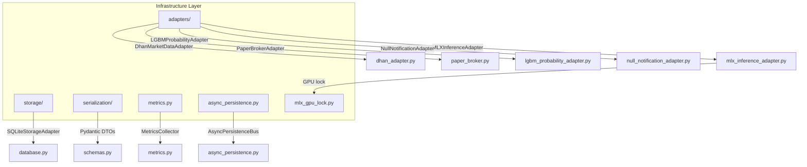

**Diagram sources**
- [adapters/__init__.py](file://backend/app/infrastructure/adapters/__init__.py)
- [dhan_adapter.py](file://backend/app/infrastructure/adapters/dhan_adapter.py)
- [paper_broker.py](file://backend/app/infrastructure/adapters/paper_broker.py)
- [mlx_inference_adapter.py](file://backend/app/infrastructure/adapters/mlx_inference_adapter.py)
- [lgbm_probability_adapter.py](file://backend/app/infrastructure/adapters/lgbm_probability_adapter.py)
- [null_notification_adapter.py](file://backend/app/infrastructure/adapters/null_notification_adapter.py)
- [database.py](file://backend/app/infrastructure/storage/database.py)
- [schemas.py](file://backend/app/infrastructure/serialization/schemas.py)
- [metrics.py](file://backend/app/infrastructure/metrics.py)
- [async_persistence.py](file://backend/app/infrastructure/async_persistence.py)
- [mlx_gpu_lock.py](file://backend/app/infrastructure/mlx_gpu_lock.py)

**Section sources**
- [adapters/__init__.py](file://backend/app/infrastructure/adapters/__init__.py)

## Core Components
- Broker adapters
  - DhanMarketDataAdapter: Implements MarketDataPort using the brokers/ library for live market data and streaming
  - PaperBrokerAdapter: Implements BrokerPort for simulated order execution with a realistic cost model
- ML inference adapters
  - MLXInferenceAdapter: Implements LLMInferencePort using Apple Silicon MLX runtime with optional cloud fallback
  - LGBMProbabilityAdapter: Implements ProbabilityInferencePort using LightGBM models for first-passage probabilities
- Storage
  - SQLiteStorageAdapter: Implements StoragePort with WAL mode, indexing, and tick batching
- Notifications
  - NullNotificationAdapter: Implements NotificationPort as a no-op adapter for development/testing
- Async persistence
  - AsyncPersistenceBus: Offloads storage writes to a background thread, prioritizing critical writes
- Serialization
  - Pydantic DTOs in schemas.py: Define API-bound DTOs with camelCase aliasing and converters
- Observability
  - MetricsCollector: Singleton metrics collector exposing latency, signals, PnL, cache stats, and regime changes
  - MLX_GPU_LOCK: Process-wide lock for Metal GPU serialization

**Section sources**
- [dhan_adapter.py](file://backend/app/infrastructure/adapters/dhan_adapter.py)
- [paper_broker.py](file://backend/app/infrastructure/adapters/paper_broker.py)
- [mlx_inference_adapter.py](file://backend/app/infrastructure/adapters/mlx_inference_adapter.py)
- [lgbm_probability_adapter.py](file://backend/app/infrastructure/adapters/lgbm_probability_adapter.py)
- [database.py](file://backend/app/infrastructure/storage/database.py)
- [null_notification_adapter.py](file://backend/app/infrastructure/adapters/null_notification_adapter.py)
- [async_persistence.py](file://backend/app/infrastructure/async_persistence.py)
- [schemas.py](file://backend/app/infrastructure/serialization/schemas.py)
- [metrics.py](file://backend/app/infrastructure/metrics.py)
- [mlx_gpu_lock.py](file://backend/app/infrastructure/mlx_gpu_lock.py)

## Architecture Overview
The Infrastructure Layer adheres to Ports and Adapters:
- Domain defines ports (MarketDataPort, BrokerPort, LLMInferencePort, ProbabilityInferencePort, StoragePort, NotificationPort)
- Infrastructure provides concrete adapters implementing those ports
- Application orchestrates adapters and coordinates flows
- AsyncPersistenceBus wraps StoragePort to decouple I/O from the hot path
- MetricsCollector and DTOs support observability and API boundary

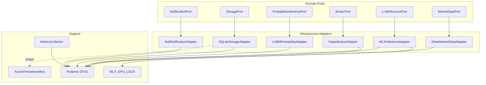

**Diagram sources**
- [dhan_adapter.py](file://backend/app/infrastructure/adapters/dhan_adapter.py)
- [paper_broker.py](file://backend/app/infrastructure/adapters/paper_broker.py)
- [mlx_inference_adapter.py](file://backend/app/infrastructure/adapters/mlx_inference_adapter.py)
- [lgbm_probability_adapter.py](file://backend/app/infrastructure/adapters/lgbm_probability_adapter.py)
- [database.py](file://backend/app/infrastructure/storage/database.py)
- [null_notification_adapter.py](file://backend/app/infrastructure/adapters/null_notification_adapter.py)
- [async_persistence.py](file://backend/app/infrastructure/async_persistence.py)
- [metrics.py](file://backend/app/infrastructure/metrics.py)
- [schemas.py](file://backend/app/infrastructure/serialization/schemas.py)
- [mlx_gpu_lock.py](file://backend/app/infrastructure/mlx_gpu_lock.py)

## Detailed Component Analysis

### Broker Adapters

#### DhanMarketDataAdapter
- Implements MarketDataPort using the brokers/ DhanBroker
- Lazy-initializes DhanBroker with thread-safe guards
- Provides:
  - Historical OHLC candles with delta proxy approximation
  - Order book retrieval
  - LTP lookup
  - Full packet streaming and REST fallback polling for specific exchanges
- Exchange and option detection logic for symbol routing
- IST timezone handling and robust timestamp normalization

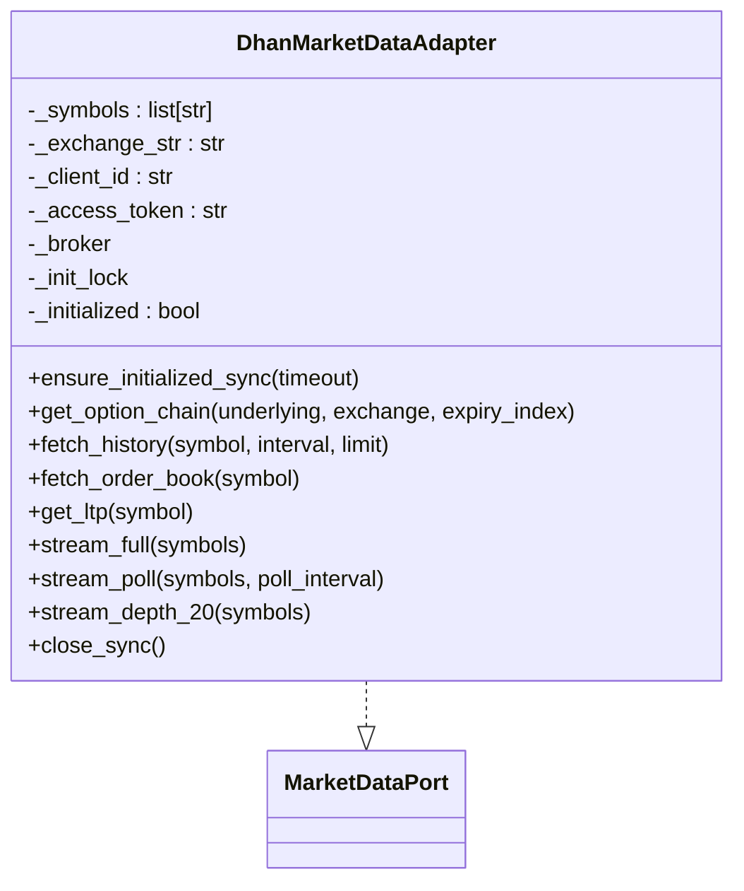

**Diagram sources**
- [dhan_adapter.py](file://backend/app/infrastructure/adapters/dhan_adapter.py)

**Section sources**
- [dhan_adapter.py](file://backend/app/infrastructure/adapters/dhan_adapter.py)

#### PaperBrokerAdapter
- Implements BrokerPort for simulated order execution
- Realistic cost model with configurable parameters
- Supports scale-in behavior and cost breakdown logging
- Computes exit costs separately for accurate PnL tracking

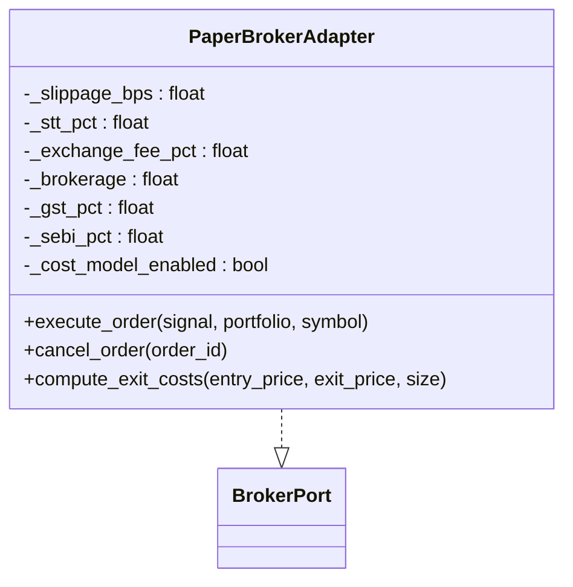

**Diagram sources**
- [paper_broker.py](file://backend/app/infrastructure/adapters/paper_broker.py)

**Section sources**
- [paper_broker.py](file://backend/app/infrastructure/adapters/paper_broker.py)

### ML Inference Adapters

#### MLXInferenceAdapter
- Implements LLMInferencePort using MLX runtime on Apple Silicon
- Background model loading with error handling and readiness checks
- Cloud fallback to OpenRouter with exponential backoff on rate limits
- Process-wide GPU lock to prevent Metal concurrency crashes
- Predict method supports JSON-prefill and overseer/entry targeting

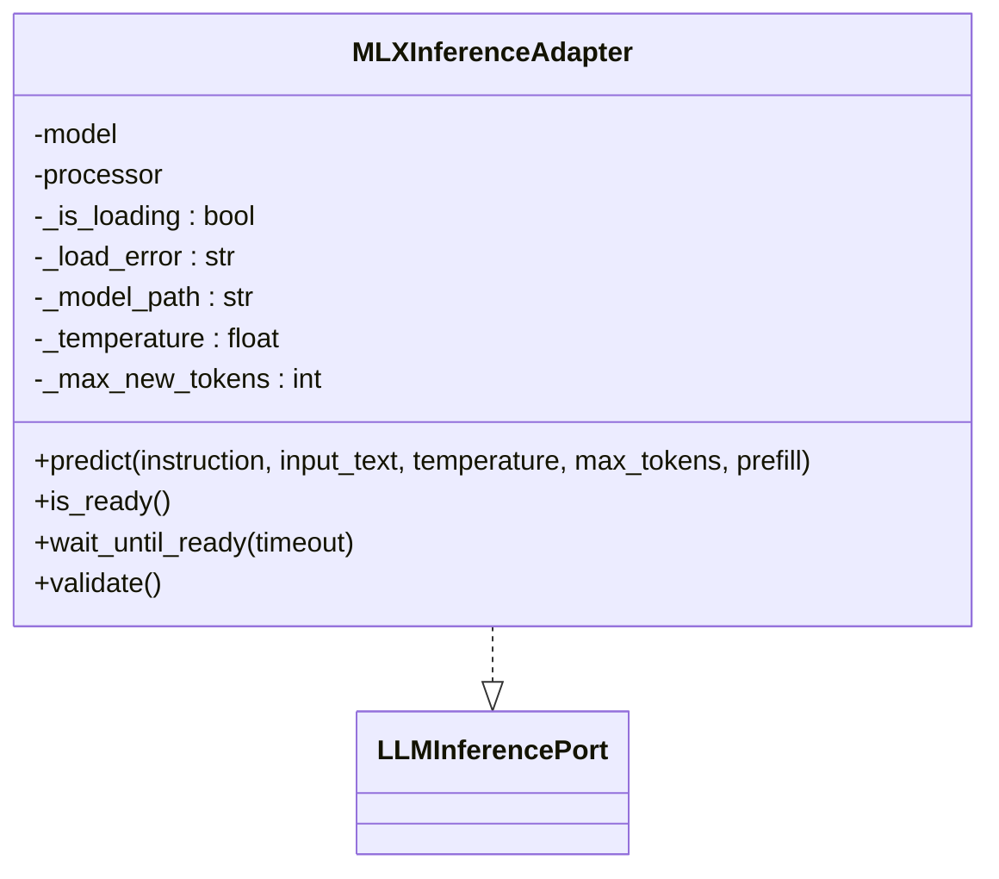

**Diagram sources**
- [mlx_inference_adapter.py](file://backend/app/infrastructure/adapters/mlx_inference_adapter.py)

**Section sources**
- [mlx_inference_adapter.py](file://backend/app/infrastructure/adapters/mlx_inference_adapter.py)
- [mlx_gpu_lock.py](file://backend/app/infrastructure/mlx_gpu_lock.py)

#### LGBMProbabilityAdapter
- Implements ProbabilityInferencePort using LightGBM models
- Loads long/short models and optional Platt scaling calibrators
- Optional MFE quantile models for dynamic TP
- Feature schema validation and calibration pipeline

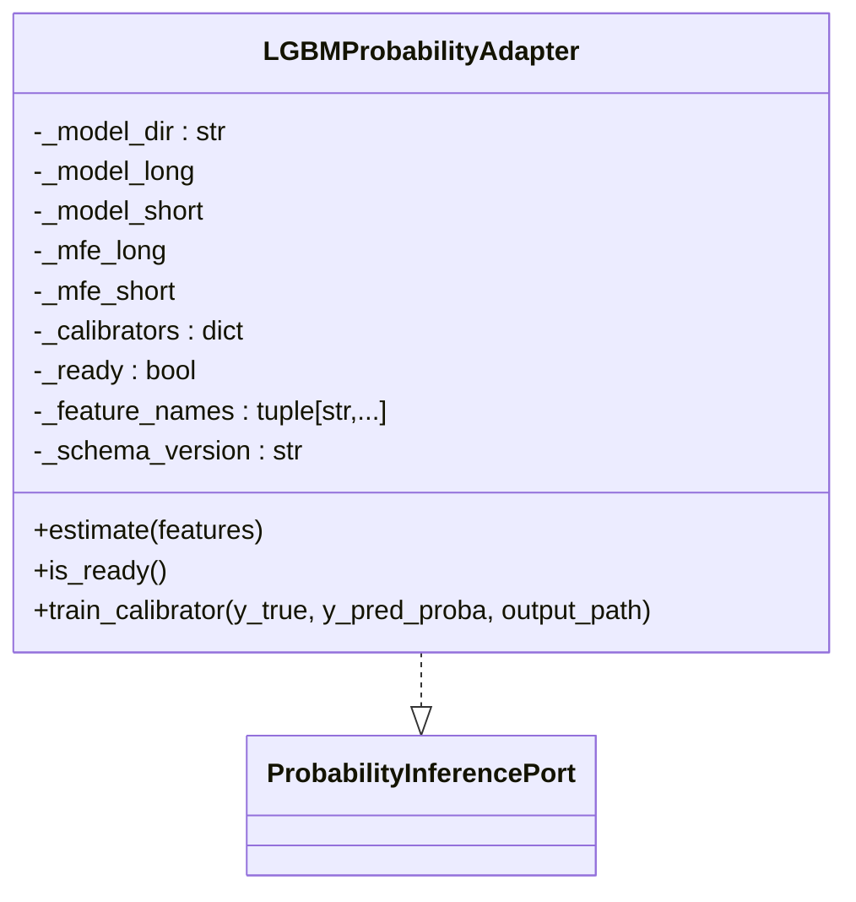

**Diagram sources**
- [lgbm_probability_adapter.py](file://backend/app/infrastructure/adapters/lgbm_probability_adapter.py)

**Section sources**
- [lgbm_probability_adapter.py](file://backend/app/infrastructure/adapters/lgbm_probability_adapter.py)

### Storage Implementation

#### SQLiteStorageAdapter
- Implements StoragePort with WAL mode and indexing
- Tick batching with background flush timer
- Thread-safe via a single persistent connection and lock
- Comprehensive CRUD for ticks, trades, LLM decisions, positions, events, profiles, and KV store
- Unique index on (symbol, time) for deduplication

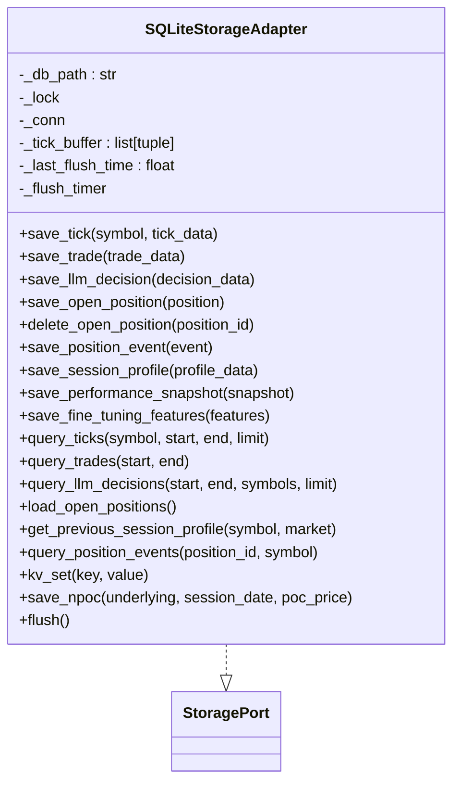

**Diagram sources**
- [database.py](file://backend/app/infrastructure/storage/database.py)

**Section sources**
- [database.py](file://backend/app/infrastructure/storage/database.py)

### Notifications
- NullNotificationAdapter implements NotificationPort as a no-op adapter suitable for development and testing
- In production, a Telegram adapter would be wired similarly by implementing NotificationPort

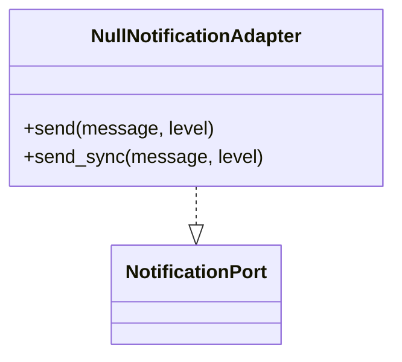

**Diagram sources**
- [null_notification_adapter.py](file://backend/app/infrastructure/adapters/null_notification_adapter.py)

**Section sources**
- [null_notification_adapter.py](file://backend/app/infrastructure/adapters/null_notification_adapter.py)

### Async Persistence Layer
- AsyncPersistenceBus wraps any StoragePort and queues write operations
- Two queues: main queue for general writes, priority critical queue for trade/position persistence
- Worker thread drains queues, executes batches, and logs dropped writes
- Stop gracefully flushes remaining writes and logs diagnostics

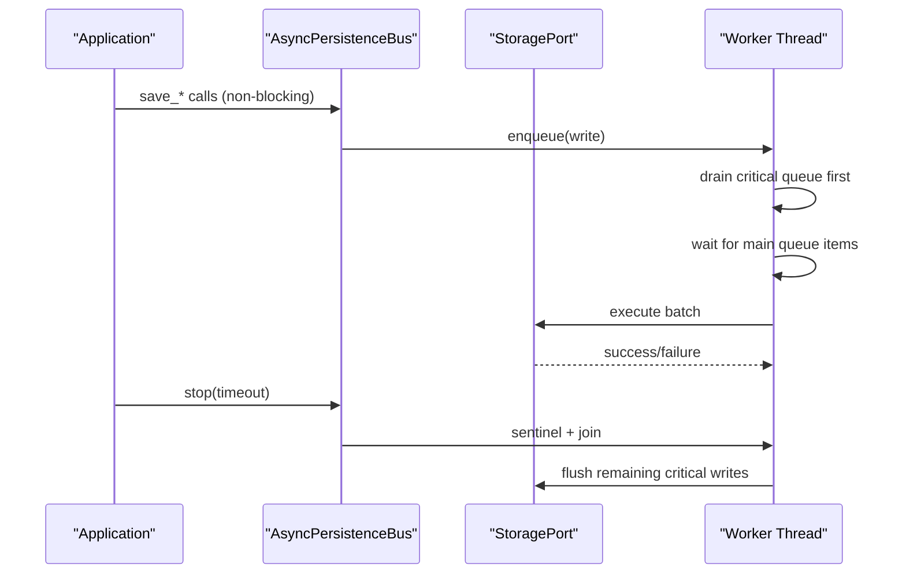

**Diagram sources**
- [async_persistence.py](file://backend/app/infrastructure/async_persistence.py)

**Section sources**
- [async_persistence.py](file://backend/app/infrastructure/async_persistence.py)

### Serialization Schemas
- Pydantic DTOs define API-bound contracts with camelCase aliasing
- Converters bridge domain objects to DTOs and vice versa
- Covers market data, order book, AMT analysis, AI analysis, trading positions, and events

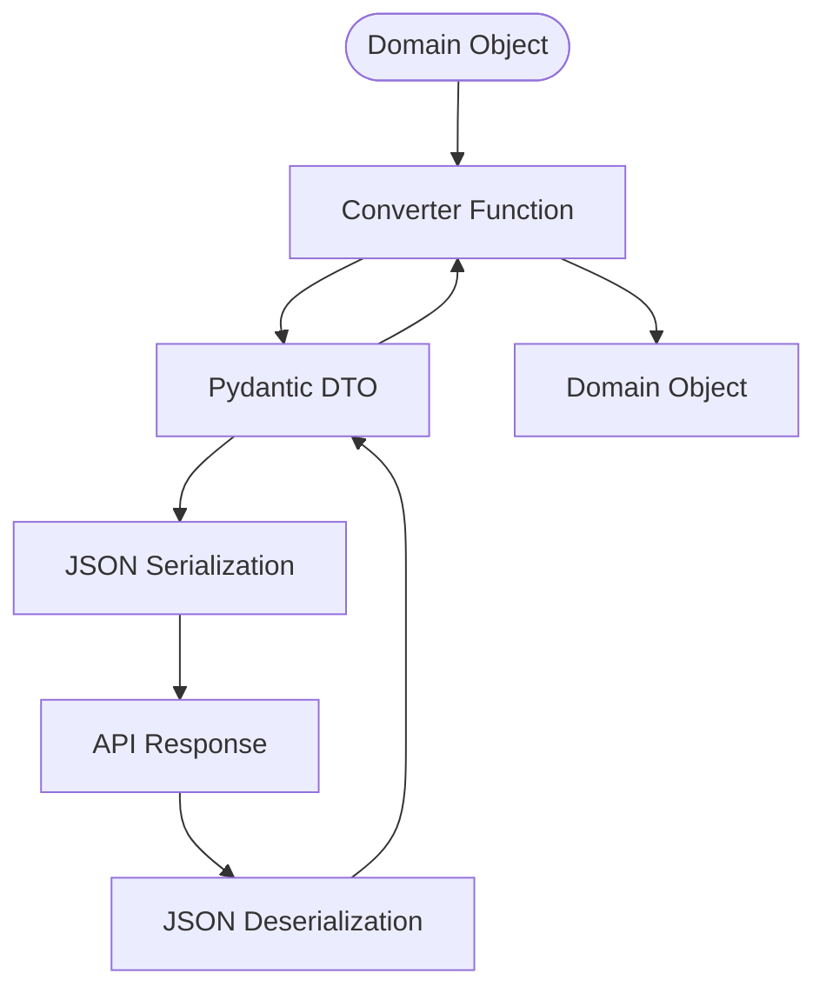

**Diagram sources**
- [schemas.py](file://backend/app/infrastructure/serialization/schemas.py)

**Section sources**
- [schemas.py](file://backend/app/infrastructure/serialization/schemas.py)

### Metrics Collection and Observability
- MetricsCollector is a singleton tracking inference latency, signal counts, PnL, cache hits/misses, regime changes, and ticks processed
- Snapshot exposes uptime, counts, percentiles, and ratios for the /api/v1/metrics endpoint

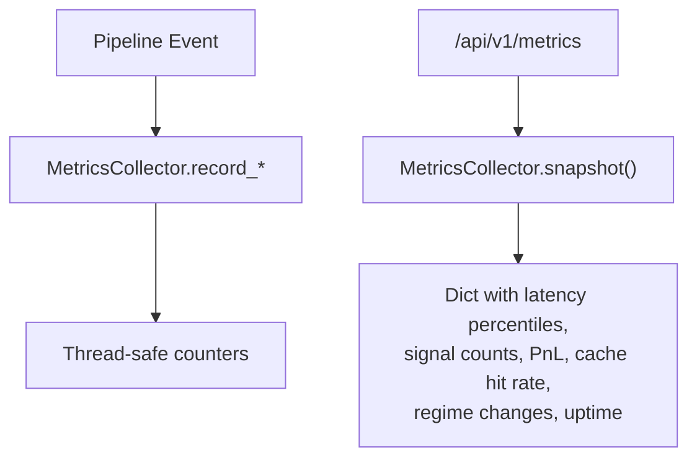

**Diagram sources**
- [metrics.py](file://backend/app/infrastructure/metrics.py)

**Section sources**
- [metrics.py](file://backend/app/infrastructure/metrics.py)

## Dependency Analysis
- Adapter pattern mapping
  - MarketDataPort → DhanMarketDataAdapter
  - BrokerPort → PaperBrokerAdapter
  - LLMInferencePort → MLXInferenceAdapter
  - ProbabilityInferencePort → LGBMProbabilityAdapter
  - StoragePort → SQLiteStorageAdapter
  - NotificationPort → NullNotificationAdapter
- Coupling and cohesion
  - Adapters are cohesive around a single responsibility and loosely coupled to domain ports
  - AsyncPersistenceBus composes StoragePort without modifying its interface
  - DTOs isolate API concerns from domain models
- External dependencies
  - MLXInferenceAdapter depends on mlx_vlm and environment variables for cloud fallback
  - LGBMProbabilityAdapter depends on LightGBM and optional scikit-learn for calibration
  - DhanMarketDataAdapter depends on brokers/ library and Exchange enums

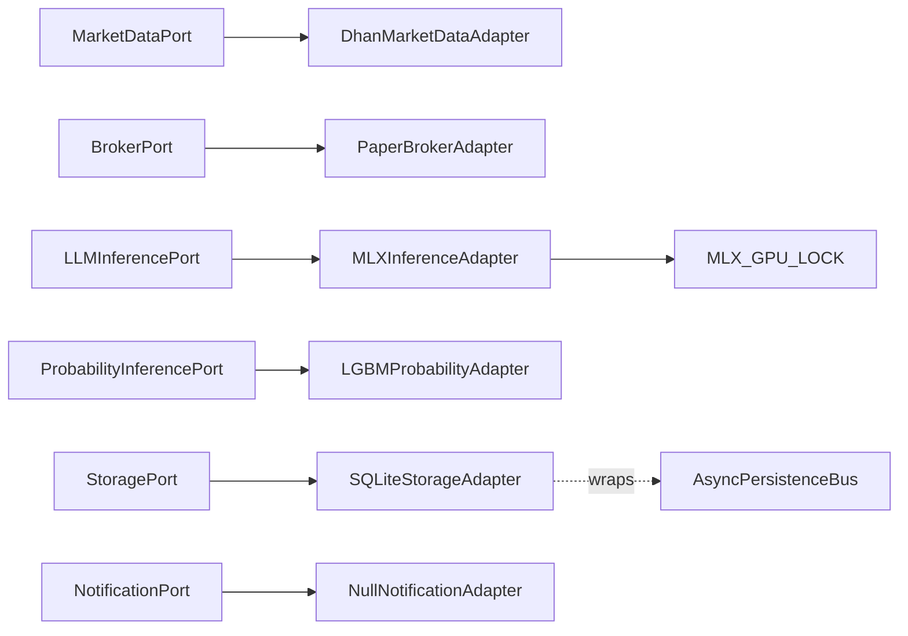

**Diagram sources**
- [dhan_adapter.py](file://backend/app/infrastructure/adapters/dhan_adapter.py)
- [paper_broker.py](file://backend/app/infrastructure/adapters/paper_broker.py)
- [mlx_inference_adapter.py](file://backend/app/infrastructure/adapters/mlx_inference_adapter.py)
- [lgbm_probability_adapter.py](file://backend/app/infrastructure/adapters/lgbm_probability_adapter.py)
- [database.py](file://backend/app/infrastructure/storage/database.py)
- [null_notification_adapter.py](file://backend/app/infrastructure/adapters/null_notification_adapter.py)
- [async_persistence.py](file://backend/app/infrastructure/async_persistence.py)
- [mlx_gpu_lock.py](file://backend/app/infrastructure/mlx_gpu_lock.py)

**Section sources**
- [dhan_adapter.py](file://backend/app/infrastructure/adapters/dhan_adapter.py)
- [paper_broker.py](file://backend/app/infrastructure/adapters/paper_broker.py)
- [mlx_inference_adapter.py](file://backend/app/infrastructure/adapters/mlx_inference_adapter.py)
- [lgbm_probability_adapter.py](file://backend/app/infrastructure/adapters/lgbm_probability_adapter.py)
- [database.py](file://backend/app/infrastructure/storage/database.py)
- [null_notification_adapter.py](file://backend/app/infrastructure/adapters/null_notification_adapter.py)
- [async_persistence.py](file://backend/app/infrastructure/async_persistence.py)
- [mlx_gpu_lock.py](file://backend/app/infrastructure/mlx_gpu_lock.py)

## Performance Considerations
- AsyncPersistenceBus
  - Non-blocking write API from the hot path
  - Priority critical queue prevents starvation during high tick volume
  - Batch execution reduces SQLite transaction overhead
  - Drop-and-log behavior for overflow with warnings
- SQLiteStorageAdapter
  - WAL mode improves concurrency and durability
  - Tick batching and flush timers reduce I/O frequency
  - Unique index on (symbol, time) ensures deduplication
- MLXInferenceAdapter
  - Background loading avoids cold-start latency
  - GPU lock prevents Metal crashes under concurrency
  - Cloud fallback mitigates local resource limitations
- MetricsCollector
  - Thread-safe snapshots with capped latency history
  - Percentile calculations for latency SLI

[No sources needed since this section provides general guidance]

## Troubleshooting Guide
- DhanMarketDataAdapter
  - Initialization failures: check credentials and network connectivity; initialization is guarded by a lock and logs errors
  - Option chain availability: returns None for unsupported exchanges (e.g., MCX commodities without options)
  - Streaming fallback: REST polling is used for MCX OPTFUT when WebSocket yields no data
- PaperBrokerAdapter
  - Cost model disabled: set cost_model.enabled to enable realistic slippage and fees
  - Scale-in behavior: controlled by signal metadata; verify metadata presence
- MLXInferenceAdapter
  - Model not ready: wait_until_ready or is_ready indicates loading state; use cloud fallback when configured
  - GPU concurrency: ensure MLX_GPU_LOCK is held during load/generate calls
  - Cloud fallback: configure OPENROUTER_API_KEY and MODEL_ID; monitor rate-limit backoff
- LGBMProbabilityAdapter
  - Models missing: adapter returns neutral estimates; ensure model files exist in model_dir
  - Feature schema mismatch: logs warning when runtime features differ from model
  - Calibration: optional Platt scaling; train_calibrator builds calibrators from historical predictions
- SQLiteStorageAdapter
  - WAL mode and checkpoint tuning: PRAGMA settings configured at init
  - Tick deduplication: unique index creation with cleanup of duplicates
  - Concurrency: single connection with lock; avoid same-thread checks disabled for adapter usage
- AsyncPersistenceBus
  - Queue drops: monitor dropped_count and logs; adjust max_queue_size or increase worker throughput
  - Stop behavior: sentinel-based graceful shutdown with critical write flush
- MetricsCollector
  - Latency percentiles: moving window of 1000 samples with tail trimming for stability
  - Thread-safety: internal lock protects counters; snapshot copies arrays to avoid race conditions

**Section sources**
- [dhan_adapter.py](file://backend/app/infrastructure/adapters/dhan_adapter.py)
- [paper_broker.py](file://backend/app/infrastructure/adapters/paper_broker.py)
- [mlx_inference_adapter.py](file://backend/app/infrastructure/adapters/mlx_inference_adapter.py)
- [lgbm_probability_adapter.py](file://backend/app/infrastructure/adapters/lgbm_probability_adapter.py)
- [database.py](file://backend/app/infrastructure/storage/database.py)
- [async_persistence.py](file://backend/app/infrastructure/async_persistence.py)
- [metrics.py](file://backend/app/infrastructure/metrics.py)

## Conclusion
The Infrastructure Layer cleanly separates domain logic from external systems through well-defined ports and concrete adapters. It provides robust integrations for market data, simulated trading, ML inference, storage, notifications, and observability. The async persistence bus removes I/O latency from the hot path, while metrics and DTOs support operational visibility and API consistency. Configuration is environment-driven, enabling safe development and production deployments.

[No sources needed since this section summarizes without analyzing specific files]

## Appendices

### Configuration Management
- Environment-specific settings (development.yaml) control:
  - broker_mode (paper)
  - log_level (DEBUG)
  - exchange enablement and symbol filtering
  - risk parameters
  - cost model configuration

**Section sources**
- [development.yaml](file://backend/config/environments/development.yaml)

### Port-to-Adapter Mapping
- MarketDataPort → DhanMarketDataAdapter
- BrokerPort → PaperBrokerAdapter
- LLMInferencePort → MLXInferenceAdapter
- ProbabilityInferencePort → LGBMProbabilityAdapter
- StoragePort → SQLiteStorageAdapter
- NotificationPort → NullNotificationAdapter

**Section sources**
- [dhan_adapter.py](file://backend/app/infrastructure/adapters/dhan_adapter.py)
- [paper_broker.py](file://backend/app/infrastructure/adapters/paper_broker.py)
- [mlx_inference_adapter.py](file://backend/app/infrastructure/adapters/mlx_inference_adapter.py)
- [lgbm_probability_adapter.py](file://backend/app/infrastructure/adapters/lgbm_probability_adapter.py)
- [database.py](file://backend/app/infrastructure/storage/database.py)
- [null_notification_adapter.py](file://backend/app/infrastructure/adapters/null_notification_adapter.py)