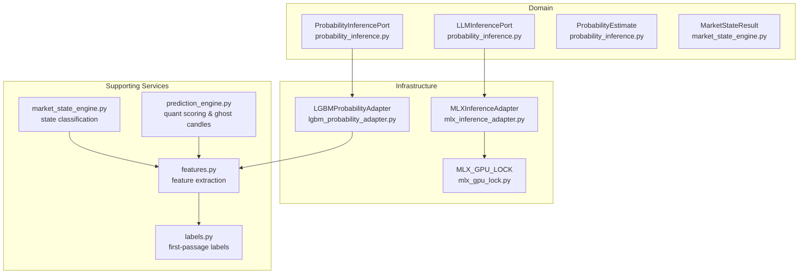
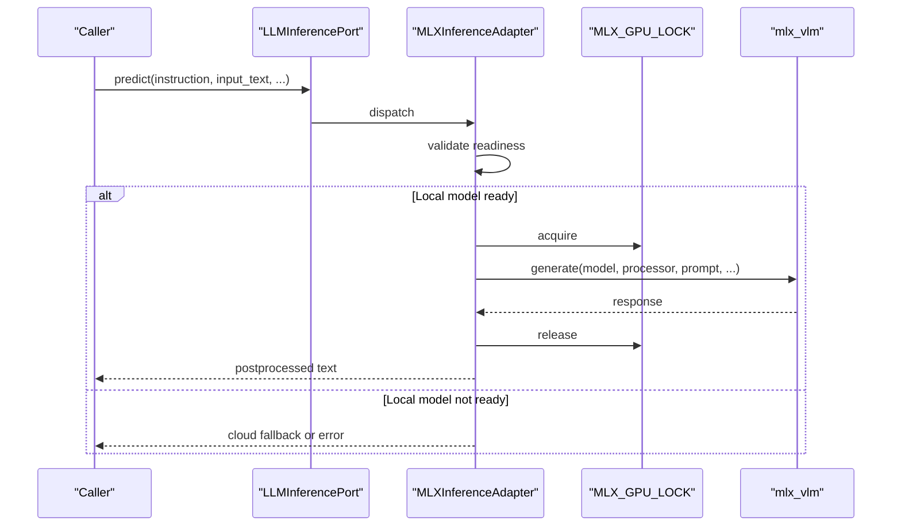
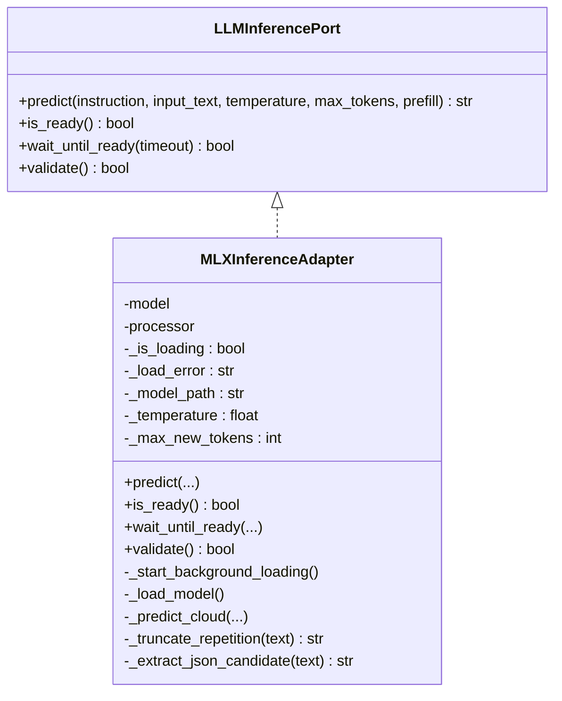
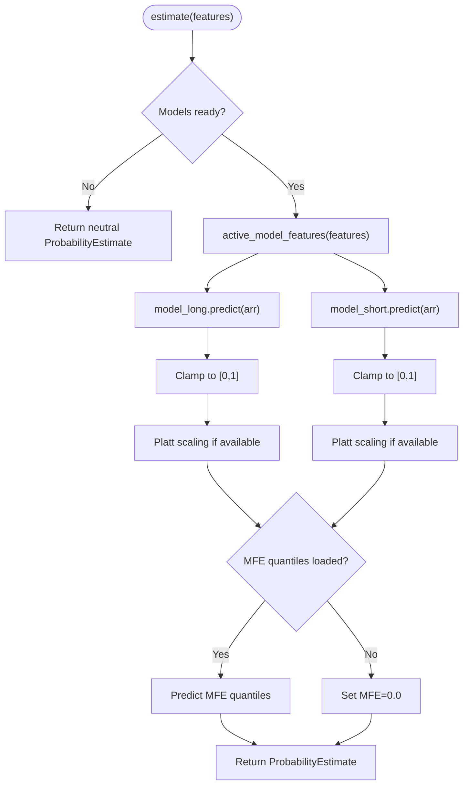
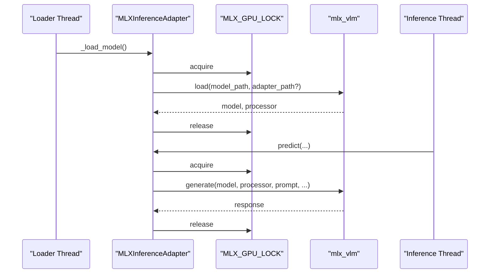
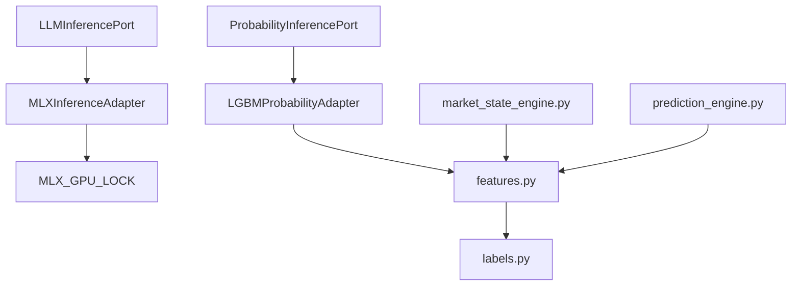

# ML Inference Adapters

<cite>
**Referenced Files in This Document**
- [mlx_inference_adapter.py](file://backend/app/infrastructure/adapters/mlx_inference_adapter.py)
- [lgbm_probability_adapter.py](file://backend/app/infrastructure/adapters/lgbm_probability_adapter.py)
- [mlx_gpu_lock.py](file://backend/app/infrastructure/mlx_gpu_lock.py)
- [llm_inference.py](file://backend/app/domain/ports/llm_inference.py)
- [probability_inference.py](file://backend/app/domain/ports/probability_inference.py)
- [features.py](file://backend/app/domain/probability/features.py)
- [labels.py](file://backend/app/domain/probability/labels.py)
- [market_state_engine.py](file://backend/app/domain/fabio_ai/services/market_state_engine.py)
- [market_state.py](file://backend/app/domain/models/market_state.py)
- [prediction_engine.py](file://backend/app/domain/fabio_ai/services/prediction_engine.py)
</cite>

## Table of Contents
1. [Introduction](#introduction)
2. [Project Structure](#project-structure)
3. [Core Components](#core-components)
4. [Architecture Overview](#architecture-overview)
5. [Detailed Component Analysis](#detailed-component-analysis)
6. [Dependency Analysis](#dependency-analysis)
7. [Performance Considerations](#performance-considerations)
8. [Troubleshooting Guide](#troubleshooting-guide)
9. [Conclusion](#conclusion)
10. [Appendices](#appendices)

## Introduction
This document explains the machine learning inference adapters powering the GlassyTrade AI system, focusing on:
- MLX Apple Silicon optimization for multimodal LLM inference
- LightGBM-based first-passage probability inference for market state classification
- Adapter interfaces, model loading, and batch processing patterns
- GPU serialization via a global lock for stability and throughput
- Model configuration, input preprocessing, and output postprocessing
- Probability estimation, threshold management, and confidence scoring
- Performance optimization, model versioning, and fallback strategies

## Project Structure
The ML inference stack spans domain abstractions, infrastructure adapters, and supporting services:
- Domain ports define stable interfaces for inference systems
- Infrastructure adapters implement concrete inference backends
- Supporting services handle feature engineering, market state classification, and prediction synthesis

**Diagram sources**
- [llm_inference.py:10-42](file://backend/app/domain/ports/llm_inference.py#L10-L42)
- [probability_inference.py:19-44](file://backend/app/domain/ports/probability_inference.py#L19-L44)
- [mlx_inference_adapter.py:12-396](file://backend/app/infrastructure/adapters/mlx_inference_adapter.py#L12-L396)
- [lgbm_probability_adapter.py:24-167](file://backend/app/infrastructure/adapters/lgbm_probability_adapter.py#L24-L167)
- [mlx_gpu_lock.py:1-19](file://backend/app/infrastructure/mlx_gpu_lock.py#L1-L19)
- [features.py:18-423](file://backend/app/domain/probability/features.py#L18-L423)
- [labels.py:15-171](file://backend/app/domain/probability/labels.py#L15-L171)
- [market_state_engine.py:45-193](file://backend/app/domain/fabio_ai/services/market_state_engine.py#L45-L193)
- [prediction_engine.py:62-210](file://backend/app/domain/fabio_ai/services/prediction_engine.py#L62-L210)

**Section sources**
- [llm_inference.py:10-42](file://backend/app/domain/ports/llm_inference.py#L10-L42)
- [probability_inference.py:19-44](file://backend/app/domain/ports/probability_inference.py#L19-L44)
- [mlx_inference_adapter.py:12-396](file://backend/app/infrastructure/adapters/mlx_inference_adapter.py#L12-L396)
- [lgbm_probability_adapter.py:24-167](file://backend/app/infrastructure/adapters/lgbm_probability_adapter.py#L24-L167)
- [mlx_gpu_lock.py:1-19](file://backend/app/infrastructure/mlx_gpu_lock.py#L1-L19)
- [features.py:18-423](file://backend/app/domain/probability/features.py#L18-L423)
- [labels.py:15-171](file://backend/app/domain/probability/labels.py#L15-L171)
- [market_state_engine.py:45-193](file://backend/app/domain/fabio_ai/services/market_state_engine.py#L45-L193)
- [prediction_engine.py:62-210](file://backend/app/domain/fabio_ai/services/prediction_engine.py#L62-L210)

## Core Components
- MLXInferenceAdapter: Implements LLMInferencePort for Apple Silicon using MLX. Provides background loading, GPU lock serialization, cloud fallback, and robust output postprocessing.
- LGBMProbabilityAdapter: Implements ProbabilityInferencePort for first-passage probability estimation using LightGBM. Supports calibration, optional MFE quantiles, and schema-version-aware feature handling.
- MLX_GPU_LOCK: Global threading lock ensuring Metal GPU command buffers are not submitted concurrently.
- Domain Ports: Define stable interfaces for inference systems and standardized readiness/validation semantics.
- Feature Engineering: Active model feature set and schema versioning for probability inference.
- Market State Classification: 4-state classification engine feeding into feature extraction and downstream decisions.

**Section sources**
- [mlx_inference_adapter.py:12-396](file://backend/app/infrastructure/adapters/mlx_inference_adapter.py#L12-L396)
- [lgbm_probability_adapter.py:24-167](file://backend/app/infrastructure/adapters/lgbm_probability_adapter.py#L24-L167)
- [mlx_gpu_lock.py:1-19](file://backend/app/infrastructure/mlx_gpu_lock.py#L1-L19)
- [llm_inference.py:10-42](file://backend/app/domain/ports/llm_inference.py#L10-L42)
- [probability_inference.py:19-44](file://backend/app/domain/ports/probability_inference.py#L19-L44)
- [features.py:18-71](file://backend/app/domain/probability/features.py#L18-L71)
- [market_state_engine.py:45-156](file://backend/app/domain/fabio_ai/services/market_state_engine.py#L45-L156)

## Architecture Overview
The system separates domain concerns from infrastructure implementations. Adapters encapsulate runtime specifics (MLX, LightGBM) behind stable ports. A global GPU lock serializes MLX operations to prevent Metal framework concurrency issues. Probability inference relies on a canonical feature schema and optional calibration.

**Diagram sources**
- [llm_inference.py:10-42](file://backend/app/domain/ports/llm_inference.py#L10-L42)
- [mlx_inference_adapter.py:184-266](file://backend/app/infrastructure/adapters/mlx_inference_adapter.py#L184-L266)
- [mlx_gpu_lock.py:10-15](file://backend/app/infrastructure/mlx_gpu_lock.py#L10-L15)

**Section sources**
- [mlx_inference_adapter.py:184-266](file://backend/app/infrastructure/adapters/mlx_inference_adapter.py#L184-L266)
- [mlx_gpu_lock.py:10-15](file://backend/app/infrastructure/mlx_gpu_lock.py#L10-L15)
- [llm_inference.py:10-42](file://backend/app/domain/ports/llm_inference.py#L10-L42)

## Detailed Component Analysis

### MLXInferenceAdapter
- Purpose: Apple Silicon-optimized LLM inference with background loading, GPU lock serialization, and cloud fallback.
- Initialization and Background Loading:
  - Validates model path from constructor or environment variable.
  - Starts a daemon thread to load the model and processor using MLX.
  - Tracks loading state and error conditions.
- Inference:
  - Applies ChatML template with optional prefill injection.
  - Serializes generate() calls via MLX_GPU_LOCK to avoid Metal concurrency crashes.
  - Postprocesses output: overseer truncation and JSON candidate extraction.
- Cloud Fallback:
  - Uses OpenRouter API when no local model is configured.
  - Implements exponential backoff for rate-limit handling.
- Readiness and Validation:
  - is_ready() considers loading state, load errors, and cloud fallback availability.
  - validate() performs a quick sanity check.

**Diagram sources**
- [llm_inference.py:10-42](file://backend/app/domain/ports/llm_inference.py#L10-L42)
- [mlx_inference_adapter.py:12-396](file://backend/app/infrastructure/adapters/mlx_inference_adapter.py#L12-L396)

**Section sources**
- [mlx_inference_adapter.py:23-81](file://backend/app/infrastructure/adapters/mlx_inference_adapter.py#L23-L81)
- [mlx_inference_adapter.py:184-266](file://backend/app/infrastructure/adapters/mlx_inference_adapter.py#L184-L266)
- [mlx_inference_adapter.py:82-183](file://backend/app/infrastructure/adapters/mlx_inference_adapter.py#L82-L183)
- [mlx_inference_adapter.py:351-396](file://backend/app/infrastructure/adapters/mlx_inference_adapter.py#L351-L396)

### LGBMProbabilityAdapter
- Purpose: Estimate first-passage probabilities and optional MFE quantiles using LightGBM models.
- Model Loading:
  - Loads separate long and short models from disk.
  - Validates feature schema alignment and logs mismatches.
  - Optionally loads Platt scaling calibrators and MFE quantile models.
- Estimation:
  - Extracts active model features from input dictionary.
  - Produces calibrated probabilities and optional MFE predictions.
- Readiness:
  - is_ready() reflects whether models are loaded and validated.

**Diagram sources**
- [lgbm_probability_adapter.py:119-155](file://backend/app/infrastructure/adapters/lgbm_probability_adapter.py#L119-L155)
- [features.py:343-345](file://backend/app/domain/probability/features.py#L343-L345)

**Section sources**
- [lgbm_probability_adapter.py:27-77](file://backend/app/infrastructure/adapters/lgbm_probability_adapter.py#L27-L77)
- [lgbm_probability_adapter.py:119-155](file://backend/app/infrastructure/adapters/lgbm_probability_adapter.py#L119-L155)
- [probability_inference.py:9-17](file://backend/app/domain/ports/probability_inference.py#L9-L17)

### MLX GPU Lock Mechanism
- Purpose: Serialize MLX load/generate operations to avoid Metal concurrency crashes.
- Usage: Encloses model load and generate calls with a global threading lock.
- Impact: Ensures deterministic throughput and stability on Apple Silicon.

**Diagram sources**
- [mlx_inference_adapter.py:55-81](file://backend/app/infrastructure/adapters/mlx_inference_adapter.py#L55-L81)
- [mlx_inference_adapter.py:249-260](file://backend/app/infrastructure/adapters/mlx_inference_adapter.py#L249-L260)
- [mlx_gpu_lock.py:10-15](file://backend/app/infrastructure/mlx_gpu_lock.py#L10-L15)

**Section sources**
- [mlx_gpu_lock.py:1-19](file://backend/app/infrastructure/mlx_gpu_lock.py#L1-L19)
- [mlx_inference_adapter.py:63-73](file://backend/app/infrastructure/adapters/mlx_inference_adapter.py#L63-L73)
- [mlx_inference_adapter.py:249-260](file://backend/app/infrastructure/adapters/mlx_inference_adapter.py#L249-L260)

### Probability Adapter: Market State Classification and Confidence Scoring
- Market State Engine:
  - Implements a 4-state classification (NO_TRADE, PROBING, IMBALANCED, BALANCED) with zone sub-classification.
  - Emits confidence scores and triggers for auditability.
- Feature Extraction:
  - Canonical 42-feature schema for first-passage modeling.
  - Encodes categorical features (profile shape, market state) and temporal/session flags.
- Prediction Engine:
  - Computes quant score and generates “ghost” candles for projection.
  - Provides sentiment and confidence derived from weighted factors.

**Diagram sources**
- [market_state_engine.py:45-156](file://backend/app/domain/fabio_ai/services/market_state_engine.py#L45-L156)
- [features.py:75-228](file://backend/app/domain/probability/features.py#L75-L228)
- [lgbm_probability_adapter.py:119-155](file://backend/app/infrastructure/adapters/lgbm_probability_adapter.py#L119-L155)
- [prediction_engine.py:69-209](file://backend/app/domain/fabio_ai/services/prediction_engine.py#L69-L209)

**Section sources**
- [market_state_engine.py:45-156](file://backend/app/domain/fabio_ai/services/market_state_engine.py#L45-L156)
- [features.py:18-71](file://backend/app/domain/probability/features.py#L18-L71)
- [features.py:75-228](file://backend/app/domain/probability/features.py#L75-L228)
- [prediction_engine.py:69-209](file://backend/app/domain/fabio_ai/services/prediction_engine.py#L69-L209)

## Dependency Analysis
- Adapter-to-port coupling:
  - MLXInferenceAdapter implements LLMInferencePort.
  - LGBMProbabilityAdapter implements ProbabilityInferencePort.
- Internal dependencies:
  - MLXInferenceAdapter depends on MLX_GPU_LOCK and environment variables for model paths.
  - LGBMProbabilityAdapter depends on feature extraction and optional calibration artifacts.
- Domain model invariants:
  - Market state and related domain objects enforce invariants to prevent invalid states.

**Diagram sources**
- [llm_inference.py:10-42](file://backend/app/domain/ports/llm_inference.py#L10-L42)
- [probability_inference.py:19-44](file://backend/app/domain/ports/probability_inference.py#L19-L44)
- [mlx_inference_adapter.py:12-396](file://backend/app/infrastructure/adapters/mlx_inference_adapter.py#L12-L396)
- [lgbm_probability_adapter.py:24-167](file://backend/app/infrastructure/adapters/lgbm_probability_adapter.py#L24-L167)
- [mlx_gpu_lock.py:1-19](file://backend/app/infrastructure/mlx_gpu_lock.py#L1-L19)
- [features.py:18-423](file://backend/app/domain/probability/features.py#L18-L423)
- [labels.py:15-171](file://backend/app/domain/probability/labels.py#L15-L171)
- [market_state_engine.py:45-156](file://backend/app/domain/fabio_ai/services/market_state_engine.py#L45-L156)
- [prediction_engine.py:69-209](file://backend/app/domain/fabio_ai/services/prediction_engine.py#L69-L209)

**Section sources**
- [llm_inference.py:10-42](file://backend/app/domain/ports/llm_inference.py#L10-L42)
- [probability_inference.py:19-44](file://backend/app/domain/ports/probability_inference.py#L19-L44)
- [mlx_inference_adapter.py:12-396](file://backend/app/infrastructure/adapters/mlx_inference_adapter.py#L12-L396)
- [lgbm_probability_adapter.py:24-167](file://backend/app/infrastructure/adapters/lgbm_probability_adapter.py#L24-L167)
- [features.py:18-423](file://backend/app/domain/probability/features.py#L18-L423)

## Performance Considerations
- MLX GPU Serialization:
  - Use MLX_GPU_LOCK to serialize load/generate calls and avoid Metal concurrency crashes.
- Background Model Loading:
  - Kick off model load on a daemon thread to keep server startup responsive.
- Cloud Fallback:
  - Configure API keys and URLs for fallback to maintain availability when local models are missing.
- Feature Schema Versioning:
  - Track schema version and warn on mismatches to prevent silent inference drift.
- Calibration:
  - Use Platt scaling to improve probability reliability; retrain calibrators periodically with historical predictions.
- Output Postprocessing:
  - Truncate repetitive overseer thinking and extract JSON candidates to stabilize downstream parsing.

[No sources needed since this section provides general guidance]

## Troubleshooting Guide
- Model Not Ready:
  - Check is_ready() and wait_until_ready() to ensure loading succeeded.
  - Inspect load error state and environment variables for model paths.
- Metal Concurrency Crashes:
  - Confirm all MLX load/generate calls are guarded by MLX_GPU_LOCK.
- Cloud Fallback Failures:
  - Verify API key presence and retry with exponential backoff.
- Probability Model Issues:
  - Ensure models exist at expected paths and feature schema matches runtime.
  - Validate calibration artifacts and MFE quantile models if enabled.
- Market State Misclassification:
  - Review state engine thresholds and balance ratio requirements.

**Section sources**
- [mlx_inference_adapter.py:351-396](file://backend/app/infrastructure/adapters/mlx_inference_adapter.py#L351-L396)
- [mlx_inference_adapter.py:201-210](file://backend/app/infrastructure/adapters/mlx_inference_adapter.py#L201-L210)
- [lgbm_probability_adapter.py:39-77](file://backend/app/infrastructure/adapters/lgbm_probability_adapter.py#L39-L77)
- [market_state_engine.py:45-156](file://backend/app/domain/fabio_ai/services/market_state_engine.py#L45-L156)

## Conclusion
The ML inference adapters provide a robust, Apple Silicon-optimized path for multimodal LLM inference and probabilistic market state classification. By enforcing strict GPU serialization, schema versioning, and calibration, the system achieves stability and performance. The port-abstraction design cleanly separates domain logic from infrastructure, enabling safe evolution and fallback strategies.

[No sources needed since this section summarizes without analyzing specific files]

## Appendices

### Model Configuration and Environment Variables
- MLX:
  - MLX_MODEL_PATH: Path to the MLX model directory.
  - MLX_ADAPTER_PATH: Optional LoRA adapter path.
  - OPENROUTER_API_KEY: Cloud fallback API key.
  - MODEL_ID: Cloud fallback model identifier.
  - CLOUD_FALLBACK_URL: Cloud endpoint URL.
- Probability:
  - fp_long.txt, fp_short.txt: LightGBM booster model files.
  - Optional: fp_long_calibrator.pkl, fp_short_calibrator.pkl (Platt scaling).
  - Optional: mfe_long_q50.txt, mfe_short_q50.txt (MFE quantiles).

**Section sources**
- [mlx_inference_adapter.py:42-48](file://backend/app/infrastructure/adapters/mlx_inference_adapter.py#L42-L48)
- [mlx_inference_adapter.py:95-99](file://backend/app/infrastructure/adapters/mlx_inference_adapter.py#L95-L99)
- [lgbm_probability_adapter.py:40-48](file://backend/app/infrastructure/adapters/lgbm_probability_adapter.py#L40-L48)
- [lgbm_probability_adapter.py:79-88](file://backend/app/infrastructure/adapters/lgbm_probability_adapter.py#L79-L88)
- [lgbm_probability_adapter.py:69-74](file://backend/app/infrastructure/adapters/lgbm_probability_adapter.py#L69-L74)

### Batch Processing Patterns
- Probability Estimation:
  - Prepare feature vectors aligned to FEATURE_NAMES and pass through estimate().
  - Use active_model_features() to ensure canonical schema.
- Market State and Features:
  - Compute market state using detect_market_state(), then extract features for probability models.
- Prediction Engine:
  - Aggregate quant score and generate projected candles for downstream use.

**Section sources**
- [features.py:343-345](file://backend/app/domain/probability/features.py#L343-L345)
- [market_state_engine.py:45-156](file://backend/app/domain/fabio_ai/services/market_state_engine.py#L45-L156)
- [prediction_engine.py:69-209](file://backend/app/domain/fabio_ai/services/prediction_engine.py#L69-L209)