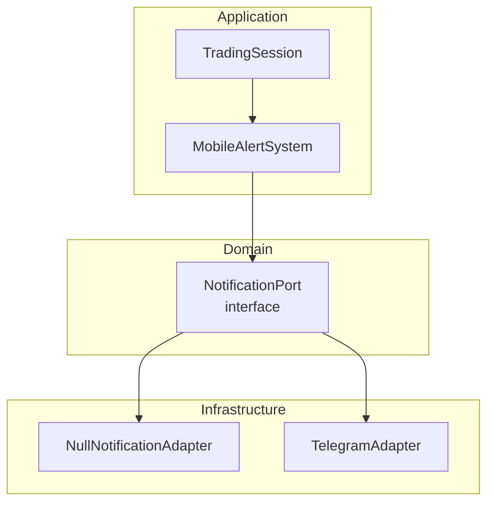
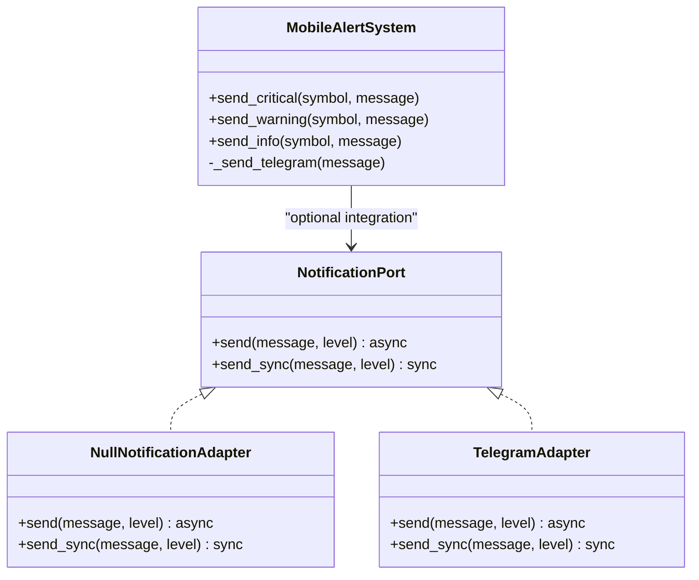
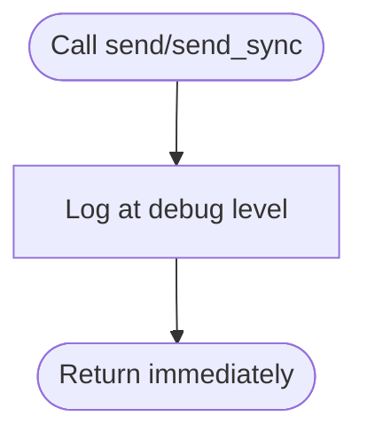
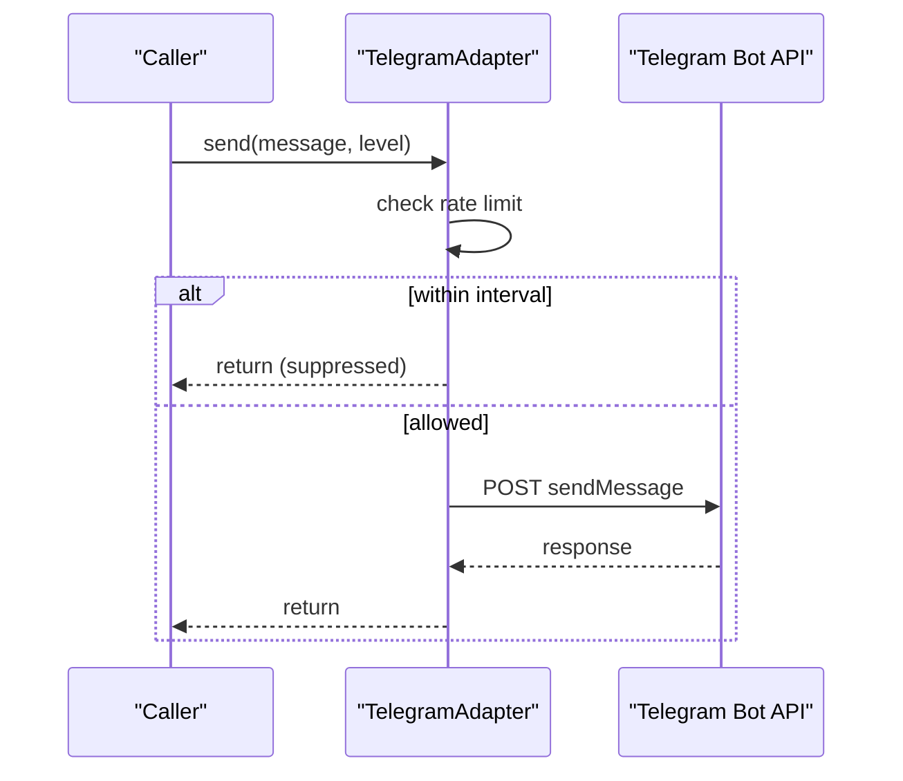
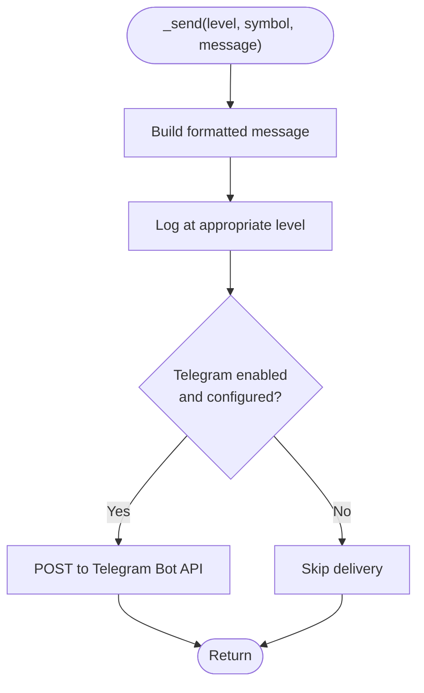
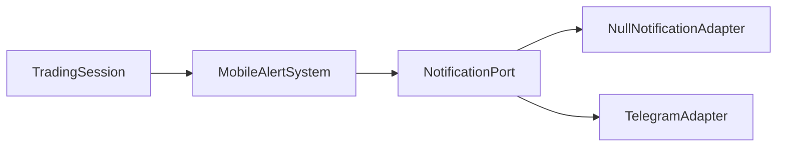

# Notification Adapters

<cite>
**Referenced Files in This Document**
- [notifications.py](file://backend/app/domain/ports/notifications.py)
- [null_notification_adapter.py](file://backend/app/infrastructure/adapters/null_notification_adapter.py)
- [telegram_adapter.py](file://backups/backend_backup_20260319_124426/app/infrastructure/adapters/telegram_adapter.py)
- [mobile_alerts.py](file://backend/app/domain/services/mobile_alerts.py)
- [test_notifications.py](file://backups/backend_backup_20260319_124426/tests/unit/infrastructure/test_notifications.py)
- [development.yaml](file://backend/config/environments/development.yaml)
- [base.yaml](file://backend/config/base.yaml)
- [config.py](file://backend/app/config.py)
- [trading_session.py](file://backend/app/application/services/trading_session.py)
</cite>

## Table of Contents
1. [Introduction](#introduction)
2. [Project Structure](#project-structure)
3. [Core Components](#core-components)
4. [Architecture Overview](#architecture-overview)
5. [Detailed Component Analysis](#detailed-component-analysis)
6. [Dependency Analysis](#dependency-analysis)
7. [Performance Considerations](#performance-considerations)
8. [Troubleshooting Guide](#troubleshooting-guide)
9. [Conclusion](#conclusion)

## Introduction
This document explains the notification subsystem used to deliver operational alerts across the system. It covers the adapter abstraction that enables pluggable channels, the null adapter for testing and development, and the Telegram adapter for production. It also documents the notification interface contract, message formatting, delivery mechanisms, configuration options, rate limiting strategies, and error handling for delivery failures.

## Project Structure
The notification system spans three layers:
- Domain port defining the contract for sending notifications
- Infrastructure adapters implementing the contract for different channels
- Application services that orchestrate alerting and formatting

**Diagram sources**
- [notifications.py:6-21](file://backend/app/domain/ports/notifications.py#L6-L21)
- [null_notification_adapter.py:9-16](file://backend/app/infrastructure/adapters/null_notification_adapter.py#L9-L16)
- [telegram_adapter.py:13-49](file://backups/backend_backup_20260319_124426/app/infrastructure/adapters/telegram_adapter.py#L13-L49)
- [mobile_alerts.py:38-141](file://backend/app/domain/services/mobile_alerts.py#L38-L141)
- [trading_session.py:215-216](file://backend/app/application/services/trading_session.py#L215-L216)

**Section sources**
- [notifications.py:1-22](file://backend/app/domain/ports/notifications.py#L1-L22)
- [null_notification_adapter.py:1-17](file://backend/app/infrastructure/adapters/null_notification_adapter.py#L1-L17)
- [telegram_adapter.py:1-50](file://backups/backend_backup_20260319_124426/app/infrastructure/adapters/telegram_adapter.py#L1-L50)
- [mobile_alerts.py:1-141](file://backend/app/domain/services/mobile_alerts.py#L1-L141)
- [trading_session.py:215-216](file://backend/app/application/services/trading_session.py#L215-L216)

## Core Components
- NotificationPort: Defines the asynchronous and synchronous notification contract with three alert levels.
- NullNotificationAdapter: Discards notifications and logs at debug level; ideal for development and testing.
- TelegramAdapter: Sends alerts via Telegram Bot API with non-blocking semantics and rate limiting per level.
- MobileAlertSystem: A higher-level service that formats and sends alerts, logs them, and optionally posts to Telegram.

Key responsibilities:
- Asynchronous send: fire-and-forget, non-blocking
- Synchronous send_sync: convenience wrapper for non-async contexts
- Levels: INFO, WARNING, CRITICAL
- Formatting: structured text with emojis and timestamps
- Delivery fallback: logs when external delivery fails or is disabled

**Section sources**
- [notifications.py:6-21](file://backend/app/domain/ports/notifications.py#L6-L21)
- [null_notification_adapter.py:9-16](file://backend/app/infrastructure/adapters/null_notification_adapter.py#L9-L16)
- [telegram_adapter.py:13-49](file://backups/backend_backup_20260319_124426/app/infrastructure/adapters/telegram_adapter.py#L13-L49)
- [mobile_alerts.py:38-141](file://backend/app/domain/services/mobile_alerts.py#L38-L141)

## Architecture Overview
The system uses an adapter pattern to decouple alerting from delivery channels. The domain defines a single interface; infrastructure provides concrete adapters. Application services can depend on the port for flexibility and testability.

**Diagram sources**
- [notifications.py:6-21](file://backend/app/domain/ports/notifications.py#L6-L21)
- [null_notification_adapter.py:9-16](file://backend/app/infrastructure/adapters/null_notification_adapter.py#L9-L16)
- [telegram_adapter.py:13-49](file://backups/backend_backup_20260319_124426/app/infrastructure/adapters/telegram_adapter.py#L13-L49)
- [mobile_alerts.py:38-141](file://backend/app/domain/services/mobile_alerts.py#L38-L141)

## Detailed Component Analysis

### NotificationPort Contract
- Purpose: Define a minimal, non-blocking notification interface.
- Methods:
  - send(message, level): asynchronous, fire-and-forget
  - send_sync(message, level): synchronous wrapper for non-async callers
- Levels: "INFO" | "WARNING" | "CRITICAL"
- Constraints: Must be non-blocking to avoid delaying tick processing.

**Section sources**
- [notifications.py:6-21](file://backend/app/domain/ports/notifications.py#L6-L21)

### NullNotificationAdapter
- Behavior: Logs incoming notifications at debug level without sending.
- Use cases: Development, testing, and environments where alerts are intentionally disabled.
- Implementation notes: Both async and sync variants log truncated messages.

**Diagram sources**
- [null_notification_adapter.py:12-16](file://backend/app/infrastructure/adapters/null_notification_adapter.py#L12-L16)

**Section sources**
- [null_notification_adapter.py:1-17](file://backend/app/infrastructure/adapters/null_notification_adapter.py#L1-L17)
- [test_notifications.py:8-16](file://backups/backend_backup_20260319_124426/tests/unit/infrastructure/test_notifications.py#L8-L16)

### TelegramAdapter
- Delivery mechanism: Asynchronous HTTP requests to Telegram Bot API.
- Rate limiting: Enforced per level with a minimum interval; suppresses rapid re-sends.
- Non-blocking: Uses asyncio tasks and timeouts to avoid blocking.
- Error handling: Catches exceptions and logs warnings; does not fail the caller.

**Diagram sources**
- [telegram_adapter.py:22-39](file://backups/backend_backup_20260319_124426/app/infrastructure/adapters/telegram_adapter.py#L22-L39)

**Section sources**
- [telegram_adapter.py:1-50](file://backups/backend_backup_20260319_124426/app/infrastructure/adapters/telegram_adapter.py#L1-L50)
- [test_notifications.py:19-27](file://backups/backend_backup_20260319_124426/tests/unit/infrastructure/test_notifications.py#L19-L27)

### MobileAlertSystem (Formatting and Delivery)
- Levels: CRITICAL, WARNING, INFO with emoji prefixes and timestamped formatting.
- Logging: Always logs regardless of Telegram configuration.
- Telegram delivery: Optional; falls back to logging if disabled or misconfigured.
- Stats and filtering: Provides alert history retrieval and counts.

**Diagram sources**
- [mobile_alerts.py:69-93](file://backend/app/domain/services/mobile_alerts.py#L69-L93)

**Section sources**
- [mobile_alerts.py:38-141](file://backend/app/domain/services/mobile_alerts.py#L38-L141)

### Integration in TradingSession
- Configuration: Reads Telegram credentials from settings and passes them to the alert system.
- Purpose: Centralized initialization of alerting capabilities during session start.

**Section sources**
- [trading_session.py:215-216](file://backend/app/application/services/trading_session.py#L215-L216)

## Dependency Analysis
- NotificationPort is the core dependency for adapters and services.
- NullNotificationAdapter and TelegramAdapter both implement NotificationPort.
- MobileAlertSystem depends on NotificationPort for optional integration and on Telegram APIs when enabled.
- TradingSession constructs alerting components using environment-provided settings.

**Diagram sources**
- [notifications.py:6-21](file://backend/app/domain/ports/notifications.py#L6-L21)
- [null_notification_adapter.py:9-16](file://backend/app/infrastructure/adapters/null_notification_adapter.py#L9-L16)
- [telegram_adapter.py:13-49](file://backups/backend_backup_20260319_124426/app/infrastructure/adapters/telegram_adapter.py#L13-L49)
- [mobile_alerts.py:38-141](file://backend/app/domain/services/mobile_alerts.py#L38-L141)
- [trading_session.py:215-216](file://backend/app/application/services/trading_session.py#L215-L216)

**Section sources**
- [notifications.py:1-22](file://backend/app/domain/ports/notifications.py#L1-L22)
- [null_notification_adapter.py:1-17](file://backend/app/infrastructure/adapters/null_notification_adapter.py#L1-L17)
- [telegram_adapter.py:1-50](file://backups/backend_backup_20260319_124426/app/infrastructure/adapters/telegram_adapter.py#L1-L50)
- [mobile_alerts.py:1-141](file://backend/app/domain/services/mobile_alerts.py#L1-L141)
- [trading_session.py:215-216](file://backend/app/application/services/trading_session.py#L215-L216)

## Performance Considerations
- Non-blocking design: Adheres to the requirement that notifications must not block tick processing.
- Async I/O: TelegramAdapter uses asynchronous HTTP clients to minimize overhead.
- Rate limiting: Per-level throttling reduces API churn and avoids suppression of urgent messages.
- Logging overhead: Null adapter minimizes I/O in development; production delivery adds network latency and potential retries.

[No sources needed since this section provides general guidance]

## Troubleshooting Guide
Common issues and resolutions:
- Telegram delivery failures
  - Symptoms: Warnings logged for Telegram send failures; alerts not delivered.
  - Resolution: Verify bot token and chat ID; check network connectivity; review logs for Telegram API errors.
- Rate limiting suppression
  - Symptoms: Messages appear suppressed for repeated same-level alerts.
  - Resolution: Adjust minimum interval or reduce frequency of identical-level alerts.
- Misconfiguration in development
  - Symptoms: Alerts not visible in production-like environments.
  - Resolution: Use NullNotificationAdapter or configure Telegram credentials; confirm environment settings.
- Testing scenarios
  - Use NullNotificationAdapter to validate alert triggers without sending real notifications.

**Section sources**
- [telegram_adapter.py:38-39](file://backups/backend_backup_20260319_124426/app/infrastructure/adapters/telegram_adapter.py#L38-L39)
- [mobile_alerts.py:90-93](file://backend/app/domain/services/mobile_alerts.py#L90-L93)
- [test_notifications.py:19-27](file://backups/backend_backup_20260319_124426/tests/unit/infrastructure/test_notifications.py#L19-L27)

## Conclusion
The notification subsystem provides a clean, extensible abstraction for alert delivery. The null adapter supports safe development and testing, while the Telegram adapter offers robust production delivery with rate limiting and error handling. The MobileAlertSystem centralizes formatting and fallback behavior, and the TradingSession integrates these components using environment-driven configuration.