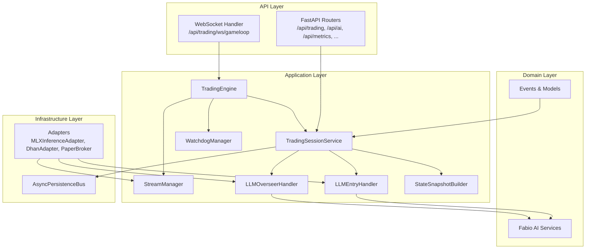
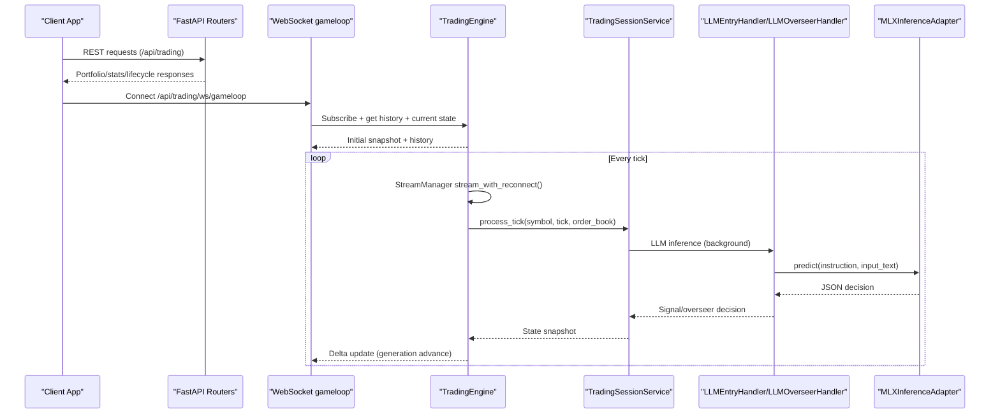
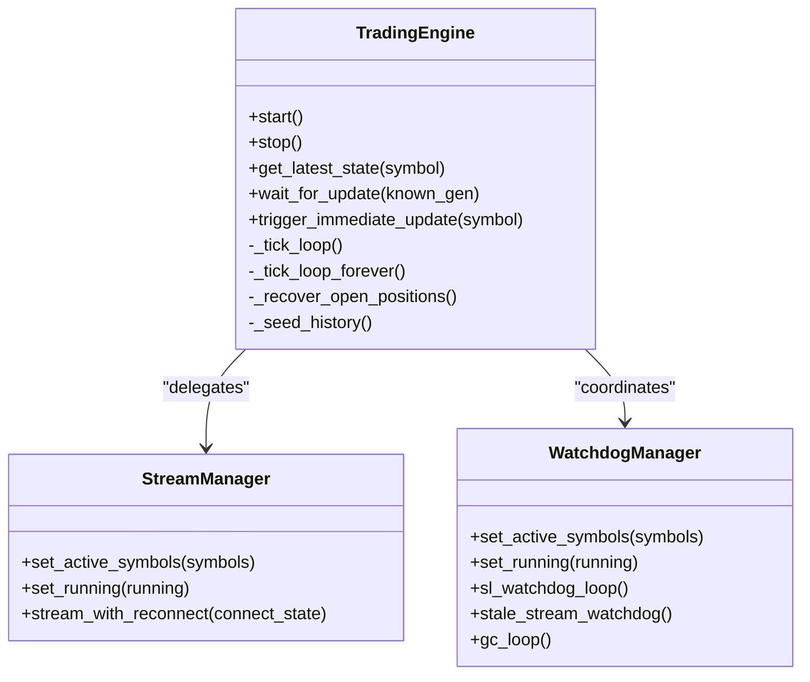
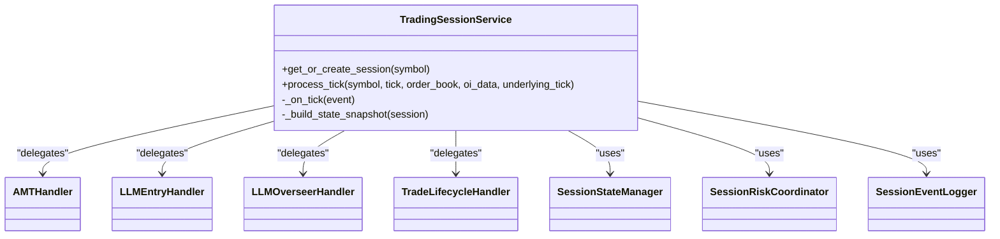
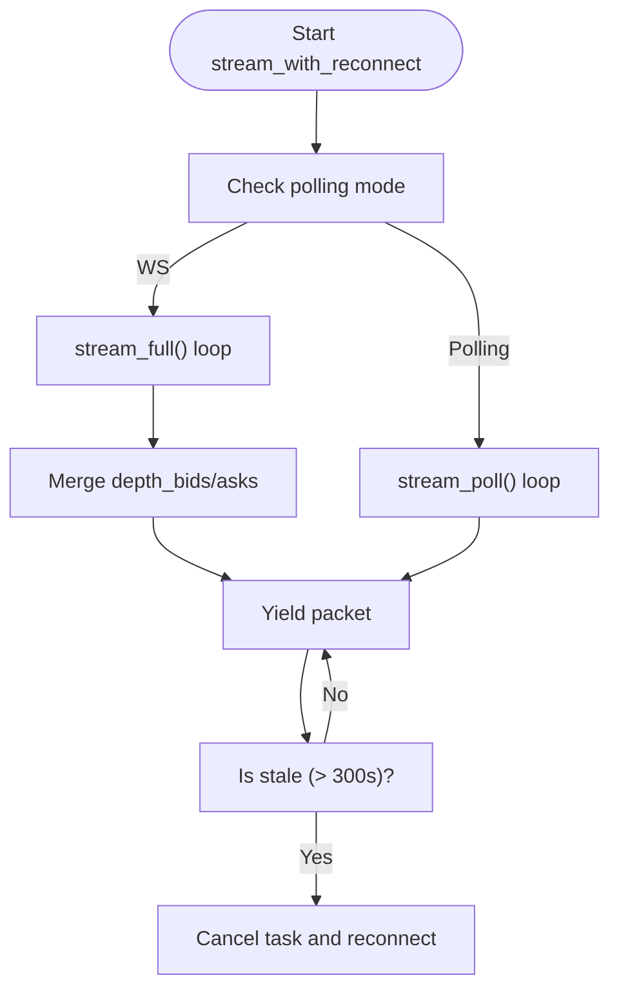
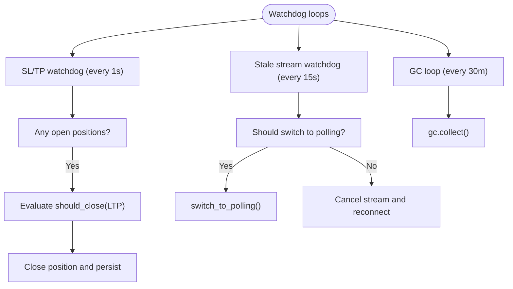
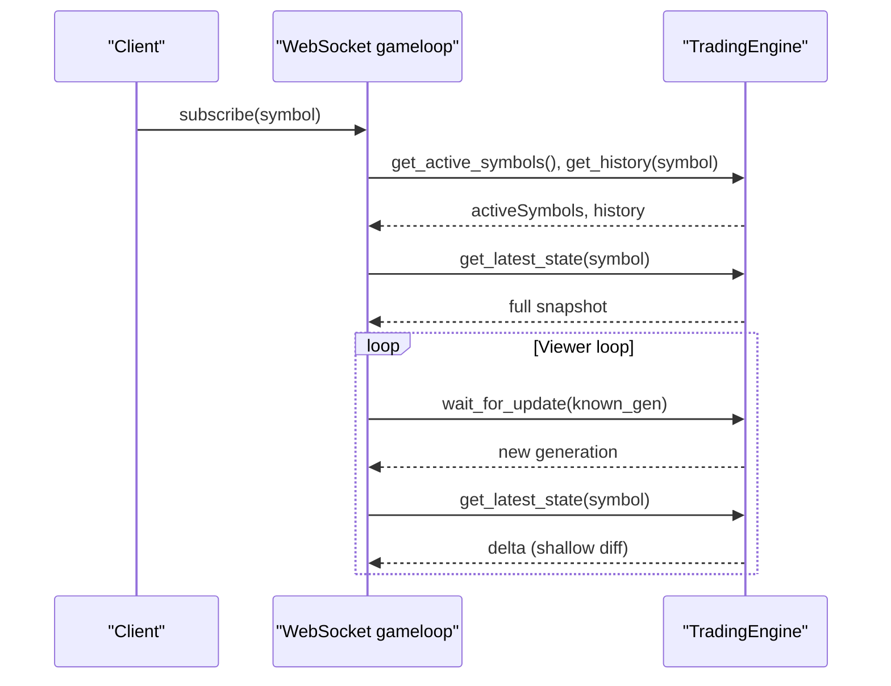
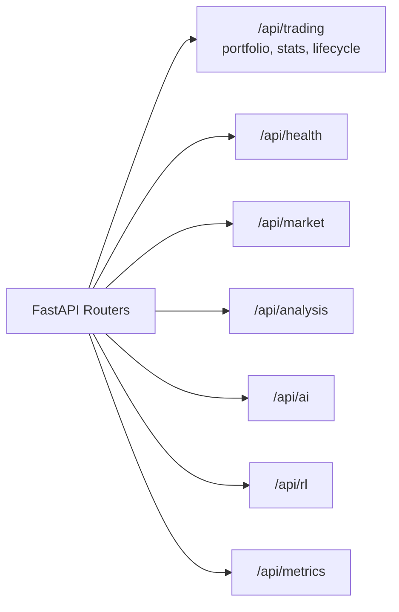
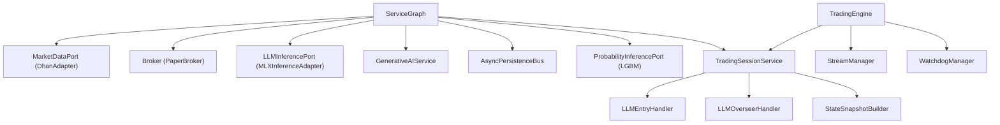

# Component Interactions

<cite>
**Referenced Files in This Document**
- [backend/app/main.py](file://backend/app/main.py)
- [backend/app/api/dependencies.py](file://backend/app/api/dependencies.py)
- [backend/app/application/engine.py](file://backend/app/application/engine.py)
- [backend/app/application/services/trading_session.py](file://backend/app/application/services/trading_session.py)
- [backend/app/application/stream_manager.py](file://backend/app/application/stream_manager.py)
- [backend/app/application/watchdog_manager.py](file://backend/app/application/watchdog_manager.py)
- [backend/app/api/websocket/gameloop.py](file://backend/app/api/websocket/gameloop.py)
- [backend/app/api/routers/trading.py](file://backend/app/api/routers/trading.py)
- [backend/app/application/handlers/llm_entry_handler.py](file://backend/app/application/handlers/llm_entry_handler.py)
- [backend/app/application/handlers/llm_overseer_handler.py](file://backend/app/application/handlers/llm_overseer_handler.py)
- [backend/app/application/services/state_snapshot_builder.py](file://backend/app/application/services/state_snapshot_builder.py)
- [backend/app/infrastructure/adapters/mlx_inference_adapter.py](file://backend/app/infrastructure/adapters/mlx_inference_adapter.py)
- [backend/app/domain/fabio_ai/services/generative_ai_service.py](file://backend/app/domain/fabio_ai/services/generative_ai_service.py)
</cite>

## Table of Contents
1. [Introduction](#introduction)
2. [Project Structure](#project-structure)
3. [Core Components](#core-components)
4. [Architecture Overview](#architecture-overview)
5. [Detailed Component Analysis](#detailed-component-analysis)
6. [Dependency Analysis](#dependency-analysis)
7. [Performance Considerations](#performance-considerations)
8. [Troubleshooting Guide](#troubleshooting-guide)
9. [Conclusion](#conclusion)

## Introduction
This document explains the component interaction patterns and data flow in the GlassyTrade AI backend. The TradingEngine acts as the central orchestrator, coordinating market data ingestion, candle aggregation, and the event-driven trading pipeline through the TradingSessionService. The system uses an event-driven architecture with handler delegation, robust state management, and a carefully designed threading model that leverages an asyncio event loop, background tasks, and ThreadPoolExecutor for LLM inference. The document also maps the relationships among FastAPI routers, WebSocket handlers, and trading pipeline components, and describes service graph dependency injection, port/adapter communication, and cross-component messaging patterns.

## Project Structure
The backend is organized around a layered architecture:
- Application layer: engines, services, handlers, and managers
- Domain layer: models, events, and services implementing business logic
- Infrastructure layer: adapters and persistence
- API layer: FastAPI routers and WebSocket handlers



**Diagram sources**
- [backend/app/main.py:171-227](file://backend/app/main.py#L171-L227)
- [backend/app/api/dependencies.py:43-327](file://backend/app/api/dependencies.py#L43-L327)
- [backend/app/application/engine.py:59-126](file://backend/app/application/engine.py#L59-L126)
- [backend/app/application/services/trading_session.py:85-229](file://backend/app/application/services/trading_session.py#L85-L229)
- [backend/app/application/stream_manager.py:32-65](file://backend/app/application/stream_manager.py#L32-L65)
- [backend/app/application/watchdog_manager.py:34-62](file://backend/app/application/watchdog_manager.py#L34-L62)
- [backend/app/api/websocket/gameloop.py:112-196](file://backend/app/api/websocket/gameloop.py#L112-L196)
- [backend/app/application/handlers/llm_entry_handler.py:61-95](file://backend/app/application/handlers/llm_entry_handler.py#L61-L95)
- [backend/app/application/handlers/llm_overseer_handler.py:53-84](file://backend/app/application/handlers/llm_overseer_handler.py#L53-L84)
- [backend/app/application/services/state_snapshot_builder.py:22-72](file://backend/app/application/services/state_snapshot_builder.py#L22-L72)
- [backend/app/infrastructure/adapters/mlx_inference_adapter.py:12-37](file://backend/app/infrastructure/adapters/mlx_inference_adapter.py#L12-L37)
- [backend/app/domain/fabio_ai/services/generative_ai_service.py:26-44](file://backend/app/domain/fabio_ai/services/generative_ai_service.py#L26-L44)

**Section sources**
- [backend/app/main.py:72-227](file://backend/app/main.py#L72-L227)
- [backend/app/api/dependencies.py:43-327](file://backend/app/api/dependencies.py#L43-L327)

## Core Components
- TradingEngine: Central orchestrator that manages market data streaming, candle aggregation, watchdogs, and state exposure to the UI. It exposes read-only state snapshots and supports immediate UI updates triggered from background threads.
- TradingSessionService: Event-driven coordinator delegating to specialized handlers (LLM entry, overseer, lifecycle, risk, state, event logging). It builds state snapshots consumed by the UI.
- StreamManager: Manages dual-stream (full + depth) and polling fallback for symbols with no WebSocket data, with reconnection and staleness detection.
- WatchdogManager: Independent SL/TP watchdog and stream health monitoring; runs even when the tick stream is disconnected.
- LLMEntryHandler and LLMOverseerHandler: Coordinate LLM inference via ThreadPoolExecutor, maintain per-symbol queues and worker threads, and enforce gating and safety nets.
- GenerativeAIService and MLXInferenceAdapter: Provide the LLM inference runtime with caching, JSON parsing, and GPU serialization.
- WebSocket gameloop: Thin viewer that streams engine state to the UI with delta compression and generation-based polling.
- FastAPI routers: Provide REST endpoints for portfolio, stats, and lifecycle data.

**Section sources**
- [backend/app/application/engine.py:59-126](file://backend/app/application/engine.py#L59-L126)
- [backend/app/application/services/trading_session.py:85-229](file://backend/app/application/services/trading_session.py#L85-L229)
- [backend/app/application/stream_manager.py:32-65](file://backend/app/application/stream_manager.py#L32-L65)
- [backend/app/application/watchdog_manager.py:34-62](file://backend/app/application/watchdog_manager.py#L34-L62)
- [backend/app/application/handlers/llm_entry_handler.py:61-95](file://backend/app/application/handlers/llm_entry_handler.py#L61-L95)
- [backend/app/application/handlers/llm_overseer_handler.py:53-84](file://backend/app/application/handlers/llm_overseer_handler.py#L53-L84)
- [backend/app/domain/fabio_ai/services/generative_ai_service.py:26-44](file://backend/app/domain/fabio_ai/services/generative_ai_service.py#L26-L44)
- [backend/app/infrastructure/adapters/mlx_inference_adapter.py:12-37](file://backend/app/infrastructure/adapters/mlx_inference_adapter.py#L12-L37)
- [backend/app/api/websocket/gameloop.py:112-196](file://backend/app/api/websocket/gameloop.py#L112-L196)
- [backend/app/api/routers/trading.py:13-100](file://backend/app/api/routers/trading.py#L13-L100)

## Architecture Overview
The system follows a production-grade DDD and event-driven design:
- Service Graph: Created once at startup via a DI factory, wiring adapters, services, and trackers.
- TradingEngine: Starts market data streaming, aggregates candles, throttles processing, and delegates to TradingSessionService for event-driven processing.
- Handlers: LLMEntryHandler and LLMOverseerHandler coordinate inference with gating and safety nets, using ThreadPoolExecutor for concurrency.
- State Exposure: TradingEngine exposes state snapshots and notifies WebSocket viewers via generation counters and asyncio.Condition.
- Persistence: AsyncPersistenceBus serializes writes to a background thread.



**Diagram sources**
- [backend/app/main.py:171-227](file://backend/app/main.py#L171-L227)
- [backend/app/api/websocket/gameloop.py:198-337](file://backend/app/api/websocket/gameloop.py#L198-L337)
- [backend/app/application/engine.py:620-800](file://backend/app/application/engine.py#L620-L800)
- [backend/app/application/services/trading_session.py:233-417](file://backend/app/application/services/trading_session.py#L233-L417)
- [backend/app/application/handlers/llm_entry_handler.py:379-781](file://backend/app/application/handlers/llm_entry_handler.py#L379-L781)
- [backend/app/application/handlers/llm_overseer_handler.py:108-402](file://backend/app/application/handlers/llm_overseer_handler.py#L108-L402)
- [backend/app/infrastructure/adapters/mlx_inference_adapter.py:184-266](file://backend/app/infrastructure/adapters/mlx_inference_adapter.py#L184-L266)

## Detailed Component Analysis

### TradingEngine
- Responsibilities: Market data streaming, candle aggregation, watchdog coordination, mid-trade recovery, throttled processing, and state exposure to UI.
- Threading model: Uses asyncio event loop for scheduling; cross-thread notifications call the stored loop reference to schedule UI updates safely.
- State management: Maintains per-symbol latest state snapshots, generation counter, and condition variable for viewer notifications.



**Diagram sources**
- [backend/app/application/engine.py:59-126](file://backend/app/application/engine.py#L59-L126)
- [backend/app/application/stream_manager.py:32-65](file://backend/app/application/stream_manager.py#L32-L65)
- [backend/app/application/watchdog_manager.py:34-62](file://backend/app/application/watchdog_manager.py#L34-L62)

**Section sources**
- [backend/app/application/engine.py:131-208](file://backend/app/application/engine.py#L131-L208)
- [backend/app/application/engine.py:281-358](file://backend/app/application/engine.py#L281-L358)
- [backend/app/application/engine.py:431-576](file://backend/app/application/engine.py#L431-L576)
- [backend/app/application/engine.py:620-800](file://backend/app/application/engine.py#L620-L800)

### TradingSessionService
- Responsibilities: Event-driven processing, handler delegation, session state management, risk coordination, and state snapshot building.
- Delegation: AMT analysis, entry/exit lifecycle, LLM entry/overseer, RL status, session state, risk management, and event logging.
- Snapshot building: Pure DTO formatting for UI consumption.



**Diagram sources**
- [backend/app/application/services/trading_session.py:85-229](file://backend/app/application/services/trading_session.py#L85-L229)
- [backend/app/application/services/trading_session.py:233-417](file://backend/app/application/services/trading_session.py#L233-L417)
- [backend/app/application/services/state_snapshot_builder.py:22-72](file://backend/app/application/services/state_snapshot_builder.py#L22-L72)

**Section sources**
- [backend/app/application/services/trading_session.py:233-417](file://backend/app/application/services/trading_session.py#L233-L417)
- [backend/app/application/services/state_snapshot_builder.py:22-72](file://backend/app/application/services/state_snapshot_builder.py#L22-L72)

### StreamManager
- Responsibilities: Dual-stream (full + depth) and polling fallback, reconnection logic, and staleness detection.
- Behavior: Switches to polling mode for symbols with no WebSocket data; maintains tick counts and last tick times.



**Diagram sources**
- [backend/app/application/stream_manager.py:135-294](file://backend/app/application/stream_manager.py#L135-L294)

**Section sources**
- [backend/app/application/stream_manager.py:135-294](file://backend/app/application/stream_manager.py#L135-L294)

### WatchdogManager
- Responsibilities: Independent SL/TP watchdog, stale stream detection, and periodic garbage collection.
- Behavior: Evaluates SL/TP on cached LTP even when stream is disconnected; reconnects or switches to polling based on staleness thresholds.



**Diagram sources**
- [backend/app/application/watchdog_manager.py:63-198](file://backend/app/application/watchdog_manager.py#L63-L198)

**Section sources**
- [backend/app/application/watchdog_manager.py:63-198](file://backend/app/application/watchdog_manager.py#L63-L198)

### LLMEntryHandler and LLMOverseerHandler
- Responsibilities: Coordinate LLM inference with gating, safety nets, and per-symbol worker threads.
- Concurrency: ThreadPoolExecutor for inference; bounded queues per symbol; dedicated worker threads ensure serialized processing per symbol.
- Safety: Session gates, regime detectors, and probability overrides guide decisions.

```mermaid
sequenceDiagram
participant Session as "TradingSessionService"
participant Entry as "LLMEntryHandler"
participant Over as "LLMOverseerHandler"
participant GenAI as "GenerativeAIService"
participant Adapter as "MLXInferenceAdapter"
Session->>Entry : run_entry(session, symbol, tick, amt_result)
Entry->>GenAI : analyze_market(market_data)
GenAI->>Adapter : predict(instruction, input_text)
Adapter-->>GenAI : JSON decision
GenAI-->>Entry : Parsed decision
Entry-->>Session : Advisory-only signal
Session->>Over : run_overseer(...)
Over->>GenAI : predict(...)
Adapter-->>Over : JSON decision
Over-->>Session : Action (HOLD/TIGHTEN_SL/PARTIAL_EXIT/FULL_EXIT/ADD)
```

**Diagram sources**
- [backend/app/application/handlers/llm_entry_handler.py:379-781](file://backend/app/application/handlers/llm_entry_handler.py#L379-L781)
- [backend/app/application/handlers/llm_overseer_handler.py:108-402](file://backend/app/application/handlers/llm_overseer_handler.py#L108-L402)
- [backend/app/domain/fabio_ai/services/generative_ai_service.py:53-99](file://backend/app/domain/fabio_ai/services/generative_ai_service.py#L53-L99)
- [backend/app/infrastructure/adapters/mlx_inference_adapter.py:184-266](file://backend/app/infrastructure/adapters/mlx_inference_adapter.py#L184-L266)

**Section sources**
- [backend/app/application/handlers/llm_entry_handler.py:61-95](file://backend/app/application/handlers/llm_entry_handler.py#L61-L95)
- [backend/app/application/handlers/llm_overseer_handler.py:53-84](file://backend/app/application/handlers/llm_overseer_handler.py#L53-L84)
- [backend/app/domain/fabio_ai/services/generative_ai_service.py:26-44](file://backend/app/domain/fabio_ai/services/generative_ai_service.py#L26-L44)
- [backend/app/infrastructure/adapters/mlx_inference_adapter.py:12-37](file://backend/app/infrastructure/adapters/mlx_inference_adapter.py#L12-L37)

### WebSocket gameloop
- Responsibilities: Server-driven viewer that streams engine state to the UI with delta compression and generation-based polling.
- Behavior: Sends config, history, and current snapshots; then waits for generation updates and streams deltas.



**Diagram sources**
- [backend/app/api/websocket/gameloop.py:198-337](file://backend/app/api/websocket/gameloop.py#L198-L337)
- [backend/app/application/engine.py:251-262](file://backend/app/application/engine.py#L251-L262)

**Section sources**
- [backend/app/api/websocket/gameloop.py:112-196](file://backend/app/api/websocket/gameloop.py#L112-L196)
- [backend/app/api/websocket/gameloop.py:198-337](file://backend/app/api/websocket/gameloop.py#L198-L337)

### REST Routers
- Trading router: Provides portfolio creation, stats computation, and lifecycle event retrieval.
- Other routers: Health, market, analysis, AI, RL, metrics.



**Diagram sources**
- [backend/app/api/routers/trading.py:13-100](file://backend/app/api/routers/trading.py#L13-L100)
- [backend/app/main.py:72-80](file://backend/app/main.py#L72-L80)

**Section sources**
- [backend/app/api/routers/trading.py:13-100](file://backend/app/api/routers/trading.py#L13-L100)
- [backend/app/main.py:72-80](file://backend/app/main.py#L72-L80)

## Dependency Analysis
The system uses a service graph for dependency injection, ensuring singletons and consistent wiring across components.



**Diagram sources**
- [backend/app/api/dependencies.py:43-327](file://backend/app/api/dependencies.py#L43-L327)
- [backend/app/application/engine.py:59-126](file://backend/app/application/engine.py#L59-L126)
- [backend/app/application/services/trading_session.py:85-229](file://backend/app/application/services/trading_session.py#L85-L229)

**Section sources**
- [backend/app/api/dependencies.py:43-327](file://backend/app/api/dependencies.py#L43-L327)

## Performance Considerations
- Throttling: The engine throttles process_tick to once per 500ms per symbol to balance responsiveness and resource usage.
- Background tasks: Dedicated tasks for streaming, watchdogs, and garbage collection run concurrently on the asyncio event loop.
- ThreadPoolExecutor: LLM inference runs in background threads to avoid blocking the event loop; GPU lock serializes mlx_vlm generate calls.
- Caching: GenerativeAIService caches LLM responses keyed by prompt hash to reduce redundant inference.
- Persistence: AsyncPersistenceBus batches writes to a background thread to minimize UI latency spikes.

[No sources needed since this section provides general guidance]

## Troubleshooting Guide
- LLM readiness: The server validates the LLM model readiness and logs readiness and validation outcomes. Failures are logged with detailed exceptions.
- Handler thread pools: Handlers expose cleanup() to shutdown thread pools on shutdown; failures are logged with debug level.
- Market data connectivity: StreamManager detects zero-tick windows and switches to polling mode; WatchdogManager cancels tasks and reconnects on staleness.
- Engine stop/start: Graceful shutdown stops engine, flushes pending ticks, shuts down thread pools, and disconnects market data.

**Section sources**
- [backend/app/main.py:83-170](file://backend/app/main.py#L83-L170)
- [backend/app/application/handlers/llm_overseer_handler.py:504-516](file://backend/app/application/handlers/llm_overseer_handler.py#L504-L516)
- [backend/app/application/stream_manager.py:86-134](file://backend/app/application/stream_manager.py#L86-L134)
- [backend/app/application/watchdog_manager.py:130-175](file://backend/app/application/watchdog_manager.py#L130-L175)

## Conclusion
The GlassyTrade AI backend employs a robust, event-driven architecture centered on the TradingEngine and coordinated by the TradingSessionService. The system integrates FastAPI routers and WebSocket handlers to serve both REST and real-time UI needs, while maintaining strict separation of concerns through domain ports and infrastructure adapters. The threading model leverages an asyncio event loop for orchestration, background tasks for continuous monitoring, and ThreadPoolExecutor for LLM inference, ensuring responsive and reliable trading operations.