# Data Flow and Processing

<cite>
**Referenced Files in This Document**
- [gameloop.py](file://backend/app/api/websocket/gameloop.py)
- [engine.py](file://backend/app/application/engine.py)
- [candle_aggregator.py](file://backend/app/application/candle_aggregator.py)
- [stream_manager.py](file://backend/app/application/stream_manager.py)
- [watchdog_manager.py](file://backend/app/application/watchdog_manager.py)
- [amt_handler.py](file://backend/app/application/handlers/amt_handler.py)
- [llm_entry_handler.py](file://backend/app/application/handlers/llm_entry_handler.py)
- [session_state_manager.py](file://backend/app/application/services/session_state_manager.py)
- [event_store.py](file://backend/app/domain/trading/event_store.py)
- [underlying_futures_provider.py](file://backend/app/domain/services/underlying_futures_provider.py)
- [latency_tracker.py](file://backend/app/domain/services/latency_tracker.py)
- [circuit_breakers.py](file://backend/app/domain/services/circuit_breakers.py)
- [resilience.py](file://shared/resilience.py)
- [architecture.md](file://backend/docs/architecture.md)
- [SYSTEM_DOCUMENTATION.md](file://docs/SYSTEM_DOCUMENTATION.md)
- [remedition_plan.md](file://docs/remedition_plan.md)
- [amt_computation.py](file://backendv2/app/runtime/pipeline/amt_computation.py)
- [events.py](file://backendv2/app/runtime/pipeline/events.py)
- [amt_analyzer.py](file://backendv2/app/domain/amt/service/amt_analyzer.py)
- [session.py](file://backendv2/app/runtime/orchestrator/session.py)
- [schemas.py](file://backendv2/app/infrastructure/serialization/schemas.py)
- [test_amt_computation.py](file://backendv2/tests/unit/runtime/pipeline/test_amt_computation.py)
- [test_amt_websocket_state.py](file://backendv2/tests/integration/test_amt_websocket_state.py)
- [INTEGRATION_TEST_RESULTS.md](file://INTEGRATION_TEST_RESULTS.md)
</cite>

## Update Summary
**Changes Made**
- Added comprehensive AMTComputationStage implementation with full 6-stage AMT analysis pipeline
- Integrated AMT processing into SessionRuntime pipeline for real-time WebSocket state updates
- Enhanced tick processing pipeline with per-candle AMT computation and serialization
- Updated WebSocket state management to include complete AMT analysis data
- Added memory management and per-symbol history tracking for AMT computations

## Table of Contents
1. [Introduction](#introduction)
2. [Project Structure](#project-structure)
3. [Core Components](#core-components)
4. [Architecture Overview](#architecture-overview)
5. [Detailed Component Analysis](#detailed-component-analysis)
6. [Dependency Analysis](#dependency-analysis)
7. [Performance Considerations](#performance-considerations)
8. [Troubleshooting Guide](#troubleshooting-guide)
9. [Conclusion](#conclusion)

## Introduction
This document explains the end-to-end data flow and processing pipeline from Dhan WebSocket reception through candle aggregation, comprehensive AMT analysis, dual-engine gating, LLM decision-making, and real-time state synchronization. The system now features a dedicated AMTComputationStage that processes each candle through a complete 6-stage AMT analysis pipeline, providing real-time market structure insights to the frontend.

Key enhancements include:
- New AMTComputationStage with full 6-stage analysis (Profile Building, Market State Detection, Setup Classification, Session Context, Multi-Timeframe, Order Flow)
- Real-time AMT computation integrated into the tick processing pipeline
- Enhanced WebSocket state management with complete AMT analysis data
- Per-symbol memory management and history tracking for efficient AMT processing
- Comprehensive serialization layer for AMT results to support frontend visualization

## Project Structure
The system is organized around a dual architecture: the legacy backend with traditional components and the new v2 runtime pipeline with enhanced AMT processing capabilities. The core pipeline now includes dedicated AMT computation stages that process candles through comprehensive market structure analysis.

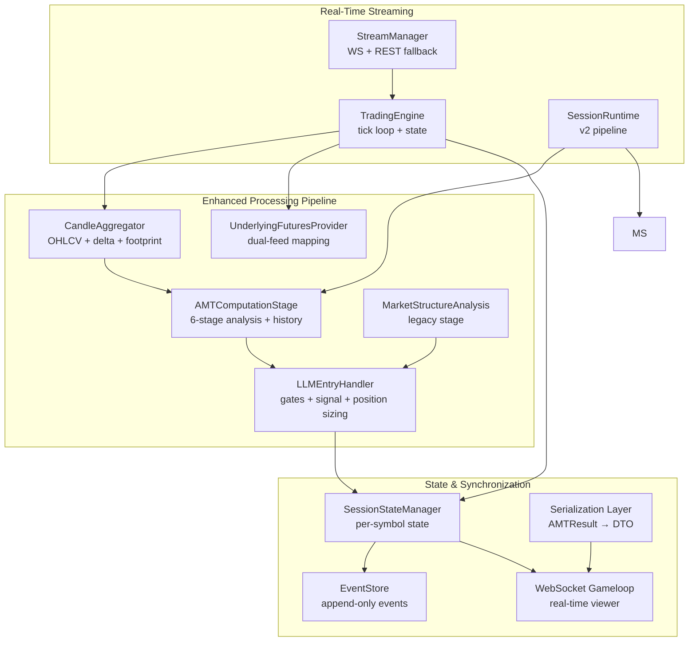

**Diagram sources**
- [stream_manager.py:32-304](file://backend/app/application/stream_manager.py#L32-L304)
- [engine.py:59-800](file://backend/app/application/engine.py#L59-L800)
- [candle_aggregator.py:73-324](file://backend/app/application/candle_aggregator.py#L73-L324)
- [underlying_futures_provider.py:104-261](file://backend/app/domain/services/underlying_futures_provider.py#L104-L261)
- [amt_handler.py:45-181](file://backend/app/application/handlers/amt_handler.py#L45-L181)
- [llm_entry_handler.py:61-1082](file://backend/app/application/handlers/llm_entry_handler.py#L61-L1082)
- [session_state_manager.py:100-410](file://backend/app/application/services/session_state_manager.py#L100-L410)
- [event_store.py:51-498](file://backend/app/domain/trading/event_store.py#L51-L498)
- [gameloop.py:112-356](file://backend/app/api/websocket/gameloop.py#L112-L356)
- [amt_computation.py:18-91](file://backendv2/app/runtime/pipeline/amt_computation.py#L18-L91)
- [session.py:43-499](file://backendv2/app/runtime/orchestrator/session.py#L43-L499)
- [schemas.py:492-600](file://backendv2/app/infrastructure/serialization/schemas.py#L492-L600)

**Section sources**
- [architecture.md:54-69](file://backend/docs/architecture.md#L54-L69)
- [SYSTEM_DOCUMENTATION.md:347-392](file://docs/SYSTEM_DOCUMENTATION.md#L347-L392)
- [remedition_plan.md:42-65](file://docs/remedition_plan.md#L42-L65)

## Core Components
- StreamManager: Orchestrates WebSocket streaming with reconnection and REST polling fallback for symbols without live data.
- TradingEngine: Central tick loop that aggregates candles, throttles processing, coordinates dual feeds, and maintains per-symbol state snapshots.
- CandleAggregator: Builds OHLCV candles, computes VWAP, delta, and accumulates tick footprint.
- UnderlyingFuturesProvider: Dynamically maps option symbols to underlying futures for dual-feed AMT analysis.
- AMTComputationStage: NEW - Dedicated pipeline stage that processes candles through comprehensive 6-stage AMT analysis with per-symbol history management and memory limits.
- MarketStructureAnalysis: Legacy stage that provides basic market structure analysis (now complemented by AMTComputationStage).
- AMTHandler: Legacy handler for incremental volume profile analysis and dual-feed processing.
- LLMEntryHandler: Coordinates LLM inference, gate checks, signal construction, and position sizing with per-symbol queues and workers.
- SessionStateManager: Manages per-symbol mutable state, throttling flags, pending signals, and explainability telemetry.
- EventStore: Append-only event store with idempotency and replay support for deterministic state reconstruction.
- WatchdogManager: SL/TP watchdog and stale stream detection to maintain resilience during disconnections.
- Resilience utilities: Per-entity circuit breakers and non-overridable circuit breakers.
- Serialization Layer: Converts AMTResult objects to frontend-friendly DTOs for WebSocket transmission.

**Section sources**
- [stream_manager.py:32-304](file://backend/app/application/stream_manager.py#L32-L304)
- [engine.py:59-800](file://backend/app/application/engine.py#L59-L800)
- [candle_aggregator.py:73-324](file://backend/app/application/candle_aggregator.py#L73-L324)
- [underlying_futures_provider.py:104-261](file://backend/app/domain/services/underlying_futures_provider.py#L104-L261)
- [amt_handler.py:45-181](file://backend/app/application/handlers/amt_handler.py#L45-L181)
- [llm_entry_handler.py:61-1082](file://backend/app/application/handlers/llm_entry_handler.py#L61-L1082)
- [session_state_manager.py:100-410](file://backend/app/application/services/session_state_manager.py#L100-L410)
- [event_store.py:51-498](file://backend/app/domain/trading/event_store.py#L51-L498)
- [watchdog_manager.py:34-198](file://backend/app/application/watchdog_manager.py#L34-L198)
- [resilience.py:135-160](file://shared/resilience.py#L135-L160)
- [circuit_breakers.py:44-110](file://backend/app/domain/services/circuit_breakers.py#L44-L110)
- [amt_computation.py:18-91](file://backendv2/app/runtime/pipeline/amt_computation.py#L18-L91)
- [schemas.py:492-600](file://backendv2/app/infrastructure/serialization/schemas.py#L492-L600)

## Architecture Overview
The enhanced pipeline now includes a dedicated AMTComputationStage that processes each candle through a comprehensive 6-stage analysis pipeline, providing real-time market structure insights. The system maintains backward compatibility while adding sophisticated AMT analysis capabilities.

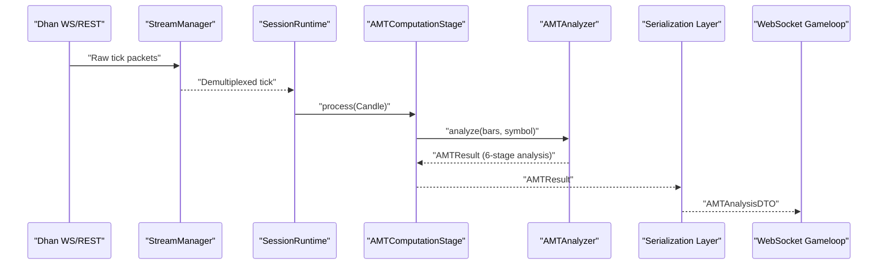

**Diagram sources**
- [stream_manager.py:135-294](file://backend/app/application/stream_manager.py#L135-L294)
- [session.py:374-454](file://backendv2/app/runtime/orchestrator/session.py#L374-L454)
- [amt_computation.py:36-73](file://backendv2/app/runtime/pipeline/amt_computation.py#L36-L73)
- [amt_analyzer.py:75-172](file://backendv2/app/domain/amt/service/amt_analyzer.py#L75-L172)
- [schemas.py:492-600](file://backendv2/app/infrastructure/serialization/schemas.py#L492-L600)

## Detailed Component Analysis

### Enhanced AMT Processing Pipeline
**Updated** The system now features a comprehensive AMTComputationStage that processes each candle through a complete 6-stage analysis pipeline:

1. **Profile Building**: Volume profile construction and POC/VA extraction
2. **Market State Detection**: Balance ratio calculation, displacement detection, and acceptance analysis
3. **Setup Classification**: Profile shape classification (P/b/D/B) and trend/mean reversion detection
4. **Session Context**: Initial balance analysis, gap classification, and opening type determination
5. **Multi-Timeframe**: Daily/hourly alignment analysis for context
6. **Order Flow**: CVD tracking, aggression scoring, absorption detection, and break analysis

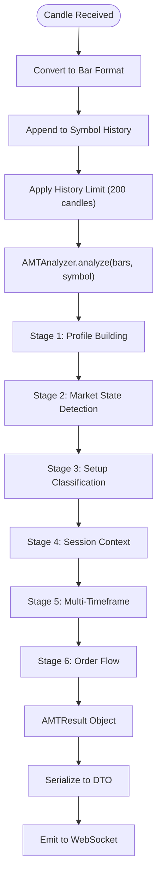

**Diagram sources**
- [amt_computation.py:36-73](file://backendv2/app/runtime/pipeline/amt_computation.py#L36-L73)
- [amt_analyzer.py:75-172](file://backendv2/app/domain/amt/service/amt_analyzer.py#L75-L172)
- [test_amt_computation.py:14-47](file://backendv2/tests/unit/runtime/pipeline/test_amt_computation.py#L14-L47)

**Section sources**
- [amt_computation.py:18-91](file://backendv2/app/runtime/pipeline/amt_computation.py#L18-L91)
- [amt_analyzer.py:38-445](file://backendv2/app/domain/amt/service/amt_analyzer.py#L38-L445)
- [test_amt_computation.py:14-147](file://backendv2/tests/unit/runtime/pipeline/test_amt_computation.py#L14-L147)

### SessionRuntime Integration
**Updated** The SessionRuntime now integrates AMTComputationStage into the main processing pipeline, ensuring each candle triggers comprehensive AMT analysis:

- **Per-candle processing**: AMTComputationStage processes every candle as it's generated
- **Memory management**: Automatic history trimming to prevent memory bloat
- **Real-time updates**: AMT results serialized and sent to WebSocket clients
- **Snapshot integration**: AMT state included in session snapshots for debugging and monitoring

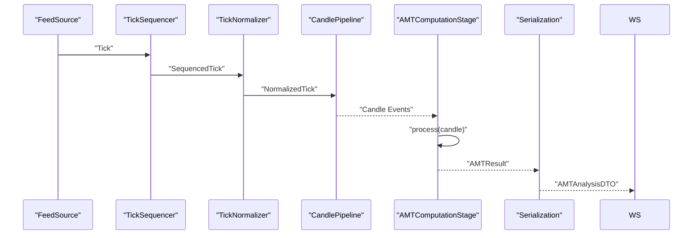

**Diagram sources**
- [session.py:374-454](file://backendv2/app/runtime/orchestrator/session.py#L374-L454)
- [amt_computation.py:36-73](file://backendv2/app/runtime/pipeline/amt_computation.py#L36-L73)
- [schemas.py:492-600](file://backendv2/app/infrastructure/serialization/schemas.py#L492-L600)

**Section sources**
- [session.py:43-499](file://backendv2/app/runtime/orchestrator/session.py#L43-L499)
- [INTEGRATION_TEST_RESULTS.md:83-113](file://INTEGRATION_TEST_RESULTS.md#L83-L113)

### WebSocket State Management Enhancement
**Updated** The WebSocket state now includes comprehensive AMT analysis data for real-time frontend visualization:

- **Complete AMT data**: Market state, POC, VAH, VAL, profile shape, and advanced metrics
- **DTO serialization**: AMTResult objects converted to AMTAnalysisDTO for frontend consumption
- **Real-time updates**: AMT analysis updates with each processed candle
- **Symbol isolation**: Independent AMT state for each trading symbol

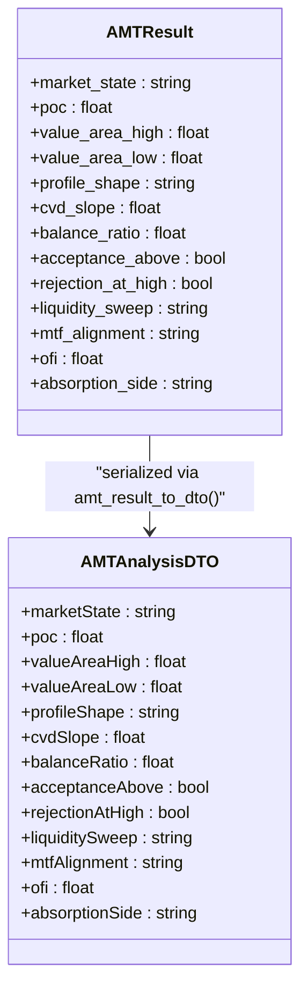

**Diagram sources**
- [schemas.py:68-147](file://backendv2/app/infrastructure/serialization/schemas.py#L68-L147)
- [schemas.py:492-600](file://backendv2/app/infrastructure/serialization/schemas.py#L492-L600)

**Section sources**
- [schemas.py:68-147](file://backendv2/app/infrastructure/serialization/schemas.py#L68-L147)
- [schemas.py:492-600](file://backendv2/app/infrastructure/serialization/schemas.py#L492-L600)
- [test_amt_websocket_state.py:15-131](file://backendv2/tests/integration/test_amt_websocket_state.py#L15-L131)

### Tick Processing Pipeline
- Dhan WS/REST → StreamManager: Handles reconnection, dual-stream depth merging, and REST polling fallback for symbols without WS data.
- TradingEngine._tick_loop: Demultiplexes ticks, updates order book depth, aggregates candles, validates, throttles to once per 500ms per symbol, and coordinates dual feeds.
- Per-symbol throttling: Elapsed time since last process tick determines whether to process or update throttled state and notify viewers.
- Circuit breaker: Per-entity circuit breaker checks before processing each tick to isolate failing symbols.
- **NEW**: AMTComputationStage processes each candle through comprehensive 6-stage analysis pipeline.

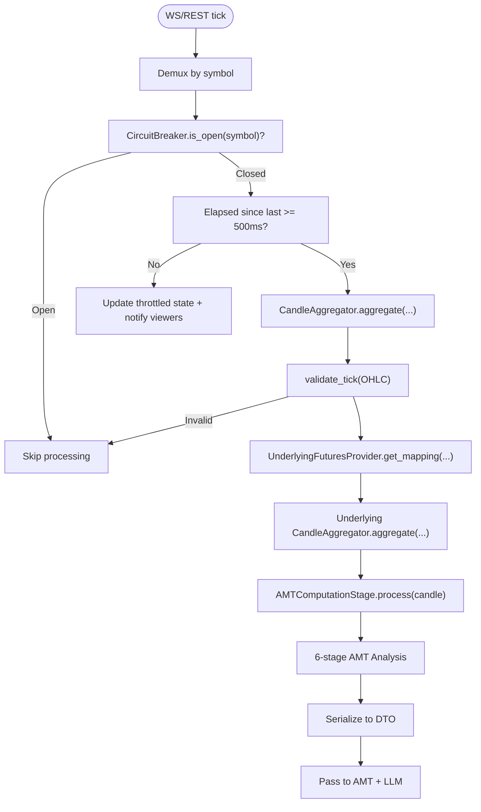

**Diagram sources**
- [engine.py:628-800](file://backend/app/application/engine.py#L628-L800)
- [resilience.py:135-160](file://shared/resilience.py#L135-L160)
- [candle_aggregator.py:114-324](file://backend/app/application/candle_aggregator.py#L114-L324)
- [underlying_futures_provider.py:159-210](file://backend/app/domain/services/underlying_futures_provider.py#L159-L210)
- [amt_computation.py:36-73](file://backendv2/app/runtime/pipeline/amt_computation.py#L36-L73)

**Section sources**
- [engine.py:628-800](file://backend/app/application/engine.py#L628-L800)
- [stream_manager.py:135-294](file://backend/app/application/stream_manager.py#L135-L294)
- [candle_aggregator.py:114-256](file://backend/app/application/candle_aggregator.py#L114-L256)
- [amt_computation.py:18-91](file://backendv2/app/runtime/pipeline/amt_computation.py#L18-L91)

### Candle Aggregation and Footprint
- Maintains per-symbol candle state with OHLC, volume, VWAP, and delta.
- Uses Lee-Ready or body-ratio proxy delta depending on configuration.
- Accumulates tick footprint per candle for orderflow visualization.
- Validates OHLC inputs to prevent invalid states.

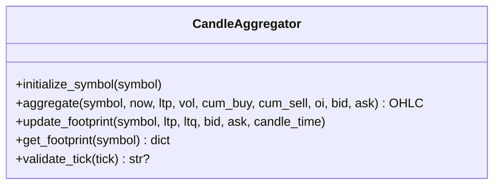

**Diagram sources**
- [candle_aggregator.py:73-324](file://backend/app/application/candle_aggregator.py#L73-L324)

**Section sources**
- [candle_aggregator.py:73-324](file://backend/app/application/candle_aggregator.py#L73-L324)

### AMT Analysis and Dual Feed
- **Enhanced**: AMTComputationStage now provides comprehensive 6-stage analysis for each candle.
- **Legacy Support**: AMTHandler continues to support dual-feed processing for options analysis.
- **Memory Management**: Automatic history trimming to prevent memory bloat (default 200 candles).
- **Real-time Updates**: AMT results serialized and sent to WebSocket clients immediately.

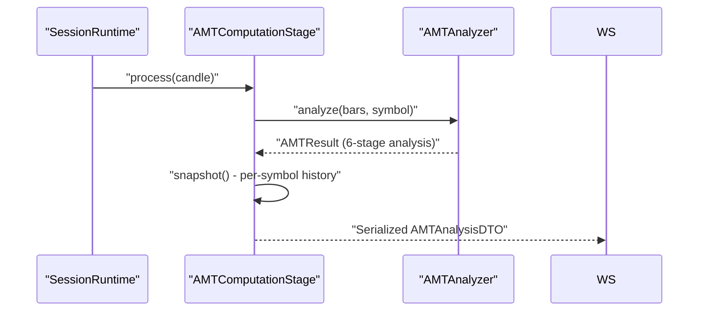

**Diagram sources**
- [session.py:374-454](file://backendv2/app/runtime/orchestrator/session.py#L374-L454)
- [amt_computation.py:36-81](file://backendv2/app/runtime/pipeline/amt_computation.py#L36-L81)
- [amt_analyzer.py:75-172](file://backendv2/app/domain/amt/service/amt_analyzer.py#L75-L172)

**Section sources**
- [amt_computation.py:18-91](file://backendv2/app/runtime/pipeline/amt_computation.py#L18-L91)
- [amt_analyzer.py:38-445](file://backendv2/app/domain/amt/service/amt_analyzer.py#L38-L445)
- [amt_handler.py:45-181](file://backend/app/application/handlers/amt_handler.py#L45-L181)
- [underlying_futures_provider.py:104-261](file://backend/app/domain/services/underlying_futures_provider.py#L104-L261)

### LLM Decision Making and Gates
- LLMEntryHandler coordinates gate checking, signal construction, and position sizing.
- Uses per-symbol bounded queues and worker threads to serialize LLM calls and prevent overload.
- Applies session gates, quant engine gates, and safety nets (e.g., VWAP extremes, buy-only mode).
- Stores LLM decisions and reasoning for auditability.

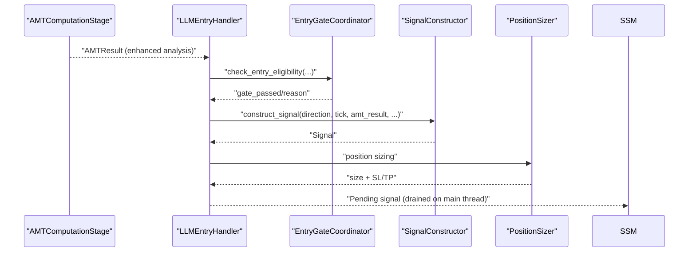

**Diagram sources**
- [llm_entry_handler.py:379-800](file://backend/app/application/handlers/llm_entry_handler.py#L379-L800)
- [session_state_manager.py:31-100](file://backend/app/application/services/session_state_manager.py#L31-L100)

**Section sources**
- [llm_entry_handler.py:61-1082](file://backend/app/application/handlers/llm_entry_handler.py#L61-L1082)
- [session_state_manager.py:100-410](file://backend/app/application/services/session_state_manager.py#L100-L410)

### Event Sourcing and State Management
- EventStore provides append-only storage with idempotency and replay support.
- EventBus publishes events to handlers and persists them, ensuring deterministic reconstruction.
- SessionStateManager encapsulates per-symbol state, throttling flags, and explainability telemetry.
- TradingEngine exposes get_latest_state and wait_for_update for real-time viewer synchronization.

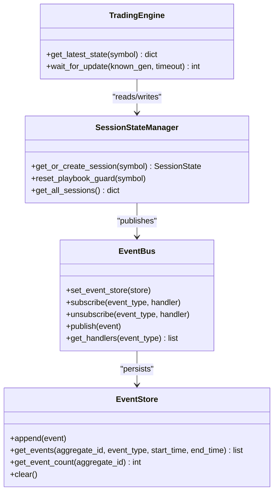

**Diagram sources**
- [event_store.py:51-498](file://backend/app/domain/trading/event_store.py#L51-L498)
- [session_state_manager.py:100-410](file://backend/app/application/services/session_state_manager.py#L100-L410)
- [engine.py:209-262](file://backend/app/application/engine.py#L209-L262)

**Section sources**
- [event_store.py:51-498](file://backend/app/domain/trading/event_store.py#L51-L498)
- [session_state_manager.py:100-410](file://backend/app/application/services/session_state_manager.py#L100-L410)
- [engine.py:209-262](file://backend/app/application/engine.py#L209-L262)

### Real-Time Data Synchronization
- WebSocket gameloop streams engine state to frontend with delta compression and periodic keyframes.
- **Enhanced**: Now includes comprehensive AMT analysis data in state updates.
- **NEW**: AMTAnalysisDTO provides structured data for frontend visualization.
- Server-driven mode: engine drives updates; client requests subscription and receives history + deltas.
- Viewer loop handles keepalive, timeouts, and graceful disconnects.

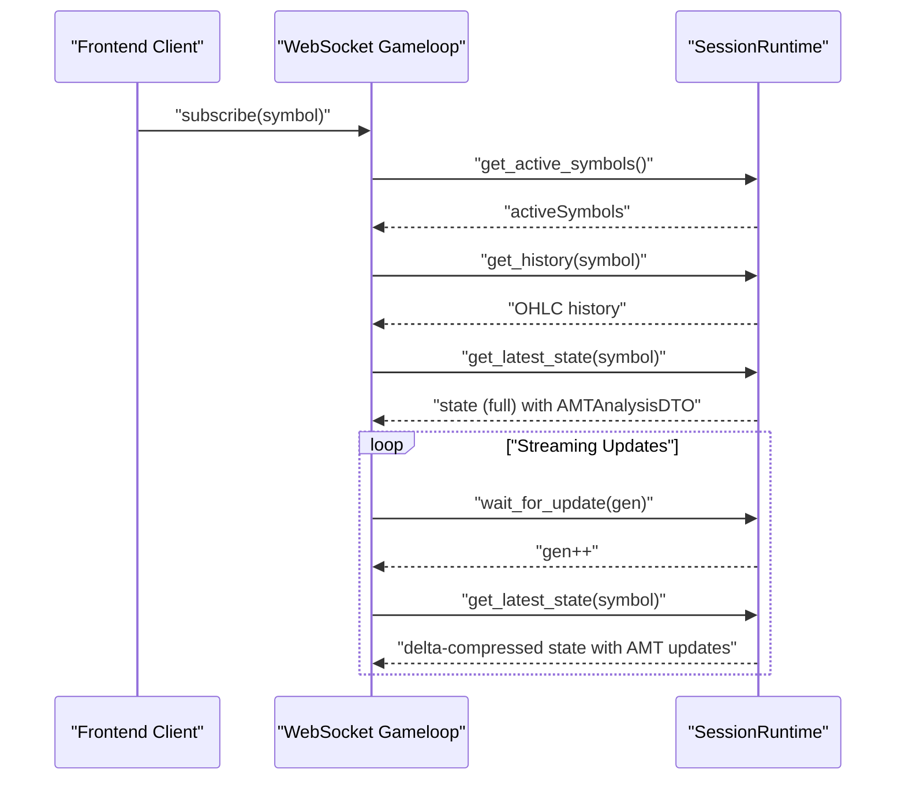

**Diagram sources**
- [gameloop.py:198-337](file://backend/app/api/websocket/gameloop.py#L198-L337)
- [session.py:246-291](file://backendv2/app/runtime/orchestrator/session.py#L246-L291)
- [schemas.py:492-600](file://backendv2/app/infrastructure/serialization/schemas.py#L492-L600)

**Section sources**
- [gameloop.py:112-356](file://backend/app/api/websocket/gameloop.py#L112-L356)
- [session.py:246-291](file://backendv2/app/runtime/orchestrator/session.py#L246-L291)
- [schemas.py:492-600](file://backendv2/app/infrastructure/serialization/schemas.py#L492-L600)

## Dependency Analysis
- **Enhanced Coupling**: SessionRuntime now depends on AMTComputationStage for comprehensive market structure analysis.
- **Legacy Support**: AMTHandler continues to work alongside the new AMTComputationStage for backward compatibility.
- **Memory Management**: AMTComputationStage includes automatic history trimming to prevent memory issues.
- **Serialization Layer**: AMTResult objects are converted to AMTAnalysisDTO for frontend consumption.
- **External Dependencies**: Dhan broker adapter, optional REST polling fallback, and frontend WebSocket transport remain unchanged.

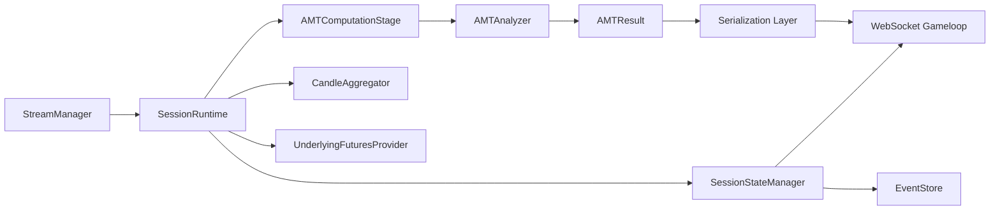

**Diagram sources**
- [stream_manager.py:32-304](file://backend/app/application/stream_manager.py#L32-L304)
- [session.py:43-499](file://backendv2/app/runtime/orchestrator/session.py#L43-L499)
- [amt_computation.py:18-91](file://backendv2/app/runtime/pipeline/amt_computation.py#L18-L91)
- [amt_analyzer.py:38-445](file://backendv2/app/domain/amt/service/amt_analyzer.py#L38-L445)
- [schemas.py:492-600](file://backendv2/app/infrastructure/serialization/schemas.py#L492-L600)

**Section sources**
- [session.py:43-499](file://backendv2/app/runtime/orchestrator/session.py#L43-L499)
- [llm_entry_handler.py:61-1082](file://backend/app/application/handlers/llm_entry_handler.py#L61-L1082)
- [amt_computation.py:18-91](file://backendv2/app/runtime/pipeline/amt_computation.py#L18-L91)

## Performance Considerations
- **Throughput and latency**:
  - Tick ingestion: StreamManager WS with exponential backoff and REST polling fallback.
  - Candle aggregation: Constant-time updates per incoming tick; footprint accumulation is O(1) per tick.
  - **Enhanced**: AMTComputationStage processes each candle through 6-stage analysis with optimized memory management.
  - LLM inference: Per-symbol bounded queue with a single worker; cooldown prevents rate limiting.
- **Memory Management**:
  - **NEW**: AMTComputationStage automatically trims history to 200 candles per symbol to prevent memory bloat.
  - Automatic cleanup prevents unbounded memory growth during extended trading sessions.
- **Optimizations**:
  - Per-symbol throttling (500ms) reduces redundant processing.
  - Dual feed for options leverages underlying futures to improve AMT stability.
  - EventStore idempotency avoids duplicate processing overhead.
  - **Enhanced**: Real-time AMT analysis with efficient serialization for WebSocket transmission.
  - Watchdog SL/TP continues protecting positions during stream disconnections.
- **Latency tracking**:
  - LatencyTracker records per-symbol latency snapshots (p50/p95/p99/max).
  - Warning thresholds: p99 > 50ms; Critical thresholds: p99 > 200ms.

**Section sources**
- [engine.py:768-778](file://backend/app/application/engine.py#L768-L778)
- [llm_entry_handler.py:379-379](file://backend/app/application/handlers/llm_entry_handler.py#L379-L379)
- [latency_tracker.py:43-95](file://backend/app/domain/services/latency_tracker.py#L43-L95)
- [amt_computation.py:65-67](file://backendv2/app/runtime/pipeline/amt_computation.py#L65-L67)

## Troubleshooting Guide
- **Stream disconnections**:
  - WatchdogManager detects stale streams and triggers reconnects or switches to polling.
  - StreamManager implements exponential backoff and dual-stream depth merging.
- **Circuit breakers**:
  - Per-entity circuit breaker isolates failing symbols; non-overridable breakers enforce hard stops based on consecutive losses, drawdown, and profit targets.
- **Enhanced AMT Issues**:
  - **NEW**: AMTComputationStage automatically trims history to prevent memory issues.
  - **NEW**: AMTResult serialization errors can be resolved by ensuring all fields are properly mapped in AMTAnalysisDTO.
  - **NEW**: Integration tests verify proper AMT data flow through WebSocket state.
- **Frontend synchronization**:
  - WebSocket gameloop handles graceful disconnects, timeouts, and delta compression; keyframes periodically refresh state.
  - **Enhanced**: AMT analysis updates are now included in state snapshots for real-time frontend visualization.
- **State consistency**:
  - EventStore ensures idempotent event persistence; ReplayEngine reconstructs state deterministically.

**Section sources**
- [watchdog_manager.py:130-198](file://backend/app/application/watchdog_manager.py#L130-L198)
- [stream_manager.py:135-294](file://backend/app/application/stream_manager.py#L135-L294)
- [resilience.py:135-160](file://shared/resilience.py#L135-L160)
- [circuit_breakers.py:44-110](file://backend/app/domain/services/circuit_breakers.py#L44-L110)
- [gameloop.py:198-337](file://backend/app/api/websocket/gameloop.py#L198-L337)
- [event_store.py:234-260](file://backend/app/domain/trading/event_store.py#L234-L260)
- [test_amt_websocket_state.py:132-228](file://backendv2/tests/integration/test_amt_websocket_state.py#L132-L228)

## Conclusion
The system now implements a robust, resilient, and highly informative pipeline from tick reception to decision execution. The new AMTComputationStage provides comprehensive 6-stage market structure analysis for each candle, significantly enhancing the quality of trading insights. Per-symbol throttling, dual feeds, and circuit breakers protect throughput and safety. Event sourcing and session state management enable deterministic replay and real-time synchronization with enhanced AMT data. Latency tracking and watchdogs further enhance reliability and performance across live trading conditions. The integration of comprehensive AMT analysis with real-time WebSocket state updates provides traders with immediate access to sophisticated market structure insights.