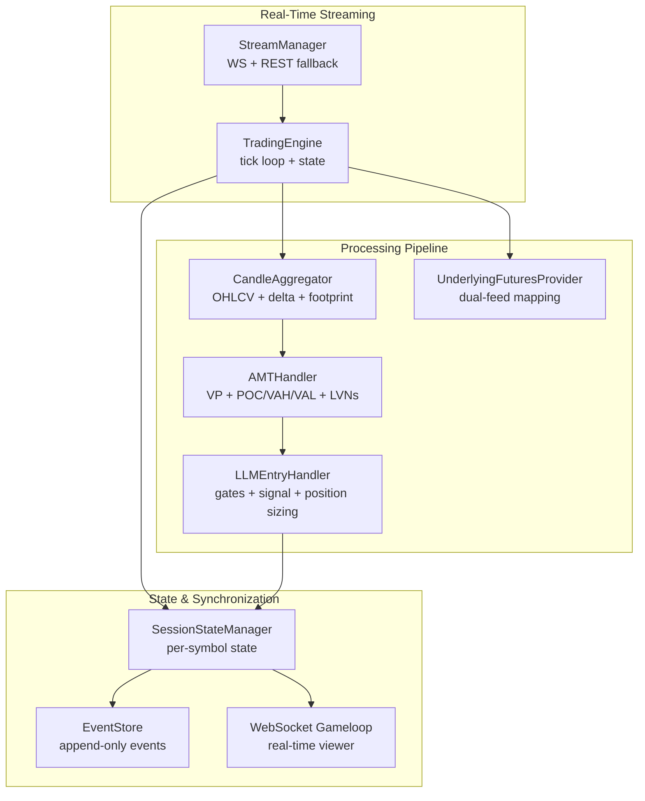
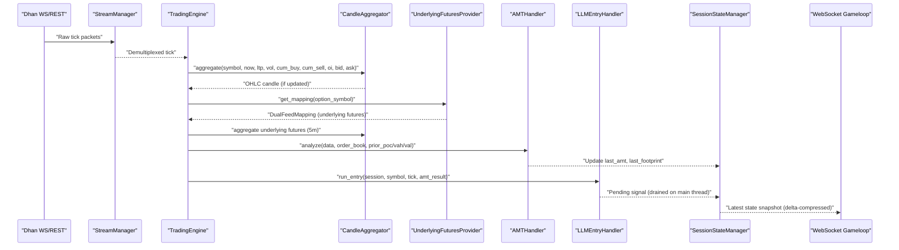
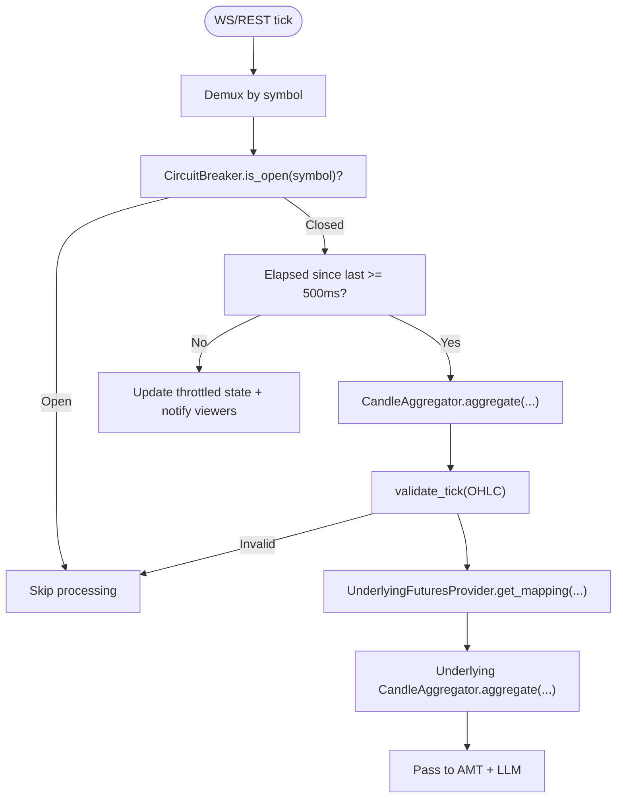
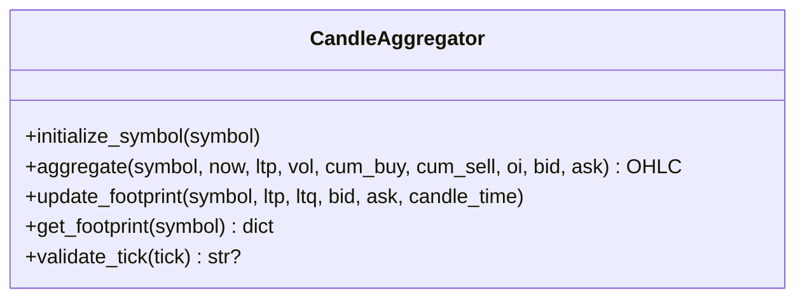
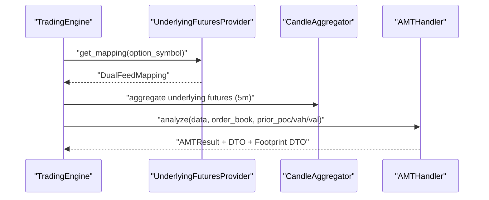
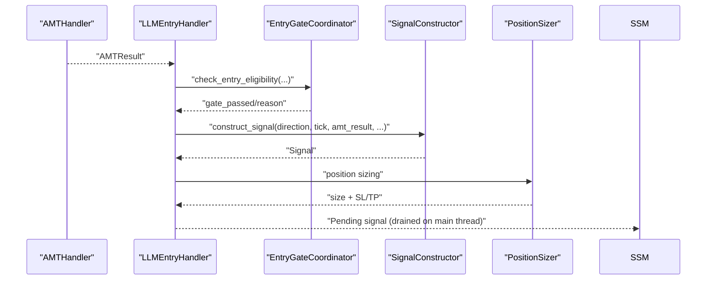
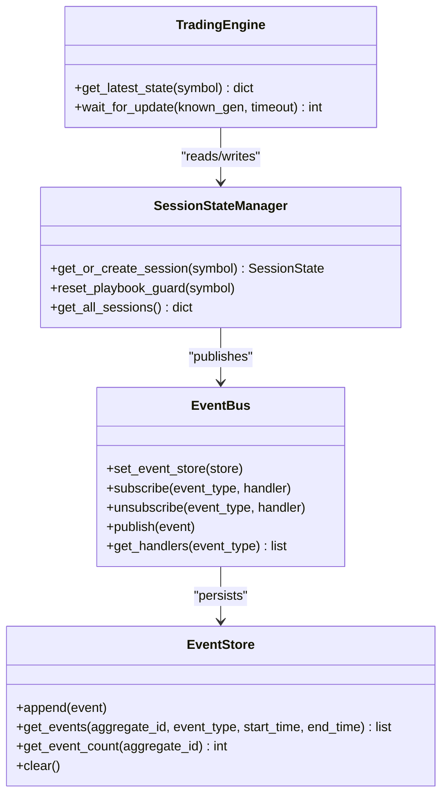
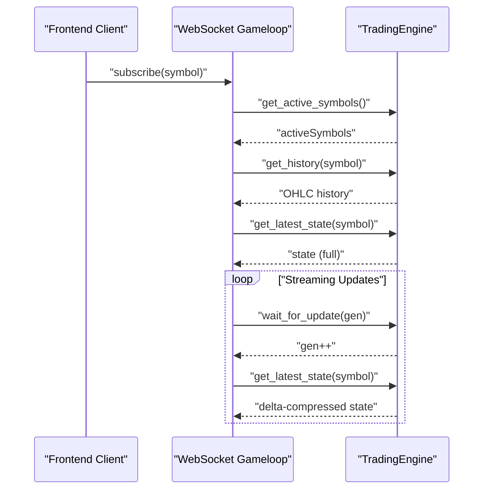
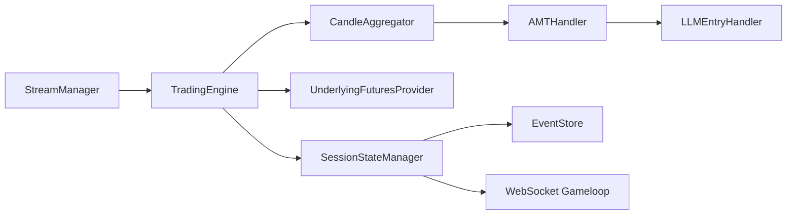

# Data Flow and Processing

<cite>
**Referenced Files in This Document**
- [gameloop.py](file://backend/app/api/websocket/gameloop.py)
- [engine.py](file://backend/app/application/engine.py)
- [candle_aggregator.py](file://backend/app/application/candle_aggregator.py)
- [stream_manager.py](file://backend/app/application/stream_manager.py)
- [watchdog_manager.py](file://backend/app/application/watchdog_manager.py)
- [amt_handler.py](file://backend/app/application/handlers/amt_handler.py)
- [llm_entry_handler.py](file://backend/app/application/handlers/llm_entry_handler.py)
- [session_state_manager.py](file://backend/app/application/services/session_state_manager.py)
- [event_store.py](file://backend/app/domain/trading/event_store.py)
- [underlying_futures_provider.py](file://backend/app/domain/services/underlying_futures_provider.py)
- [latency_tracker.py](file://backend/app/domain/services/latency_tracker.py)
- [circuit_breakers.py](file://backend/app/domain/services/circuit_breakers.py)
- [resilience.py](file://shared/resilience.py)
- [architecture.md](file://backend/docs/architecture.md)
- [SYSTEM_DOCUMENTATION.md](file://docs/SYSTEM_DOCUMENTATION.md)
- [remedition_plan.md](file://docs/remedition_plan.md)
</cite>

## Table of Contents
1. [Introduction](#introduction)
2. [Project Structure](#project-structure)
3. [Core Components](#core-components)
4. [Architecture Overview](#architecture-overview)
5. [Detailed Component Analysis](#detailed-component-analysis)
6. [Dependency Analysis](#dependency-analysis)
7. [Performance Considerations](#performance-considerations)
8. [Troubleshooting Guide](#troubleshooting-guide)
9. [Conclusion](#conclusion)

## Introduction
This document explains the end-to-end data flow and processing pipeline from Dhan WebSocket reception through candle aggregation, AMT analysis, dual-engine gating, LLM decision-making, and real-time state synchronization. It covers:
- Tick ingestion and per-symbol throttling
- Dual processing streams for options and underlying futures
- Circuit breaker patterns and watchdog protections
- Event sourcing and state management across stages
- Real-time synchronization to the frontend
- Performance characteristics, latency measurements, and optimization strategies

## Project Structure
The system is organized around a standalone TradingEngine that continuously streams market data, aggregates candles, and orchestrates analysis and decision-making. Supporting modules handle streaming, aggregation, AMT analysis, LLM coordination, session state, and event sourcing.

**Diagram sources**
- [stream_manager.py:32-304](file://backend/app/application/stream_manager.py#L32-L304)
- [engine.py:59-800](file://backend/app/application/engine.py#L59-L800)
- [candle_aggregator.py:73-324](file://backend/app/application/candle_aggregator.py#L73-L324)
- [underlying_futures_provider.py:104-261](file://backend/app/domain/services/underlying_futures_provider.py#L104-L261)
- [amt_handler.py:45-181](file://backend/app/application/handlers/amt_handler.py#L45-L181)
- [llm_entry_handler.py:61-1082](file://backend/app/application/handlers/llm_entry_handler.py#L61-L1082)
- [session_state_manager.py:100-410](file://backend/app/application/services/session_state_manager.py#L100-L410)
- [event_store.py:51-498](file://backend/app/domain/trading/event_store.py#L51-L498)
- [gameloop.py:112-356](file://backend/app/api/websocket/gameloop.py#L112-L356)

**Section sources**
- [architecture.md:54-69](file://backend/docs/architecture.md#L54-L69)
- [SYSTEM_DOCUMENTATION.md:347-392](file://docs/SYSTEM_DOCUMENTATION.md#L347-L392)
- [remedition_plan.md:42-65](file://docs/remedition_plan.md#L42-L65)

## Core Components
- StreamManager: Orchestrates WebSocket streaming with reconnection and REST polling fallback for symbols without live data.
- TradingEngine: Central tick loop that aggregates candles, throttles processing, coordinates dual feeds, and maintains per-symbol state snapshots.
- CandleAggregator: Builds OHLCV candles, computes VWAP, delta, and accumulates tick footprint.
- UnderlyingFuturesProvider: Dynamically maps option symbols to underlying futures for dual-feed AMT analysis.
- AMTHandler: Incremental volume profile, POC/VAH/VAL, LVNs/HVNs, market state classification, and footprint generation.
- LLMEntryHandler: Coordinates LLM inference, gate checks, signal construction, and position sizing with per-symbol queues and workers.
- SessionStateManager: Manages per-symbol mutable state, throttling flags, pending signals, and explainability telemetry.
- EventStore: Append-only event store with idempotency and replay support for deterministic state reconstruction.
- WatchdogManager: SL/TP watchdog and stale stream detection to maintain resilience during disconnections.
- Resilience utilities: Per-entity circuit breakers and non-overridable circuit breakers.

**Section sources**
- [stream_manager.py:32-304](file://backend/app/application/stream_manager.py#L32-L304)
- [engine.py:59-800](file://backend/app/application/engine.py#L59-L800)
- [candle_aggregator.py:73-324](file://backend/app/application/candle_aggregator.py#L73-L324)
- [underlying_futures_provider.py:104-261](file://backend/app/domain/services/underlying_futures_provider.py#L104-L261)
- [amt_handler.py:45-181](file://backend/app/application/handlers/amt_handler.py#L45-L181)
- [llm_entry_handler.py:61-1082](file://backend/app/application/handlers/llm_entry_handler.py#L61-L1082)
- [session_state_manager.py:100-410](file://backend/app/application/services/session_state_manager.py#L100-L410)
- [event_store.py:51-498](file://backend/app/domain/trading/event_store.py#L51-L498)
- [watchdog_manager.py:34-198](file://backend/app/application/watchdog_manager.py#L34-L198)
- [resilience.py:135-160](file://shared/resilience.py#L135-L160)
- [circuit_breakers.py:44-110](file://backend/app/domain/services/circuit_breakers.py#L44-L110)

## Architecture Overview
The pipeline begins with Dhan WebSocket (or REST polling fallback) and ends with real-time frontend synchronization. The engine runs independently of frontend viewers and applies per-symbol throttling and circuit breaker protections.

**Diagram sources**
- [stream_manager.py:135-294](file://backend/app/application/stream_manager.py#L135-L294)
- [engine.py:628-800](file://backend/app/application/engine.py#L628-L800)
- [candle_aggregator.py:114-256](file://backend/app/application/candle_aggregator.py#L114-L256)
- [underlying_futures_provider.py:159-210](file://backend/app/domain/services/underlying_futures_provider.py#L159-L210)
- [amt_handler.py:89-181](file://backend/app/application/handlers/amt_handler.py#L89-L181)
- [llm_entry_handler.py:379-800](file://backend/app/application/handlers/llm_entry_handler.py#L379-L800)
- [session_state_manager.py:31-100](file://backend/app/application/services/session_state_manager.py#L31-L100)
- [gameloop.py:198-337](file://backend/app/api/websocket/gameloop.py#L198-L337)

## Detailed Component Analysis

### Tick Processing Pipeline
- Dhan WS/REST → StreamManager: Handles reconnection, dual-stream depth merging, and REST polling fallback for symbols without WS data.
- TradingEngine._tick_loop: Demultiplexes ticks, updates order book depth, aggregates candles, validates, throttles to once per 500ms per symbol, and coordinates dual feeds.
- Per-symbol throttling: Elapsed time since last process tick determines whether to process or update throttled state and notify viewers.
- Circuit breaker: Per-entity circuit breaker checks before processing each tick to isolate failing symbols.

**Diagram sources**
- [engine.py:628-800](file://backend/app/application/engine.py#L628-L800)
- [resilience.py:135-160](file://shared/resilience.py#L135-L160)
- [candle_aggregator.py:114-324](file://backend/app/application/candle_aggregator.py#L114-L324)
- [underlying_futures_provider.py:159-210](file://backend/app/domain/services/underlying_futures_provider.py#L159-L210)

**Section sources**
- [engine.py:628-800](file://backend/app/application/engine.py#L628-L800)
- [stream_manager.py:135-294](file://backend/app/application/stream_manager.py#L135-L294)
- [candle_aggregator.py:114-256](file://backend/app/application/candle_aggregator.py#L114-L256)

### Candle Aggregation and Footprint
- Maintains per-symbol candle state with OHLC, volume, VWAP, and delta.
- Uses Lee-Ready or body-ratio proxy delta depending on configuration.
- Accumulates tick footprint per candle for orderflow visualization.
- Validates OHLC inputs to prevent invalid states.

**Diagram sources**
- [candle_aggregator.py:73-324](file://backend/app/application/candle_aggregator.py#L73-L324)

**Section sources**
- [candle_aggregator.py:73-324](file://backend/app/application/candle_aggregator.py#L73-L324)

### AMT Analysis and Dual Feed
- AMTHandler builds incremental volume profile (session-only for options), computes POC/VAH/VAL, detects LVNs/HVNs, and generates footprint.
- Dual feed: Underlying futures aggregated for options to inform AMT analysis and reduce theta decay effects.
- Session-only VP for options improves accuracy by focusing on current session.

**Diagram sources**
- [engine.py:780-799](file://backend/app/application/engine.py#L780-L799)
- [underlying_futures_provider.py:159-210](file://backend/app/domain/services/underlying_futures_provider.py#L159-L210)
- [amt_handler.py:89-181](file://backend/app/application/handlers/amt_handler.py#L89-L181)

**Section sources**
- [amt_handler.py:45-181](file://backend/app/application/handlers/amt_handler.py#L45-L181)
- [underlying_futures_provider.py:104-261](file://backend/app/domain/services/underlying_futures_provider.py#L104-L261)

### LLM Decision Making and Gates
- LLMEntryHandler coordinates gate checking, signal construction, and position sizing.
- Uses per-symbol bounded queues and worker threads to serialize LLM calls and prevent overload.
- Applies session gates, quant engine gates, and safety nets (e.g., VWAP extremes, buy-only mode).
- Stores LLM decisions and reasoning for auditability.

**Diagram sources**
- [llm_entry_handler.py:379-800](file://backend/app/application/handlers/llm_entry_handler.py#L379-L800)
- [session_state_manager.py:31-100](file://backend/app/application/services/session_state_manager.py#L31-L100)

**Section sources**
- [llm_entry_handler.py:61-1082](file://backend/app/application/handlers/llm_entry_handler.py#L61-L1082)
- [session_state_manager.py:100-410](file://backend/app/application/services/session_state_manager.py#L100-L410)

### Event Sourcing and State Management
- EventStore provides append-only storage with idempotency and replay support.
- EventBus publishes events to handlers and persists them, ensuring deterministic reconstruction.
- SessionStateManager encapsulates per-symbol state, throttling flags, and explainability telemetry.
- TradingEngine exposes get_latest_state and wait_for_update for real-time viewer synchronization.

**Diagram sources**
- [event_store.py:51-498](file://backend/app/domain/trading/event_store.py#L51-L498)
- [session_state_manager.py:100-410](file://backend/app/application/services/session_state_manager.py#L100-L410)
- [engine.py:209-262](file://backend/app/application/engine.py#L209-L262)

**Section sources**
- [event_store.py:51-498](file://backend/app/domain/trading/event_store.py#L51-L498)
- [session_state_manager.py:100-410](file://backend/app/application/services/session_state_manager.py#L100-L410)
- [engine.py:209-262](file://backend/app/application/engine.py#L209-L262)

### Real-Time Data Synchronization
- WebSocket gameloop streams engine state to frontend with delta compression and periodic keyframes.
- Server-driven mode: engine drives updates; client requests subscription and receives history + deltas.
- Viewer loop handles keepalive, timeouts, and graceful disconnects.

**Diagram sources**
- [gameloop.py:198-337](file://backend/app/api/websocket/gameloop.py#L198-L337)
- [engine.py:209-262](file://backend/app/application/engine.py#L209-L262)

**Section sources**
- [gameloop.py:112-356](file://backend/app/api/websocket/gameloop.py#L112-L356)
- [engine.py:209-262](file://backend/app/application/engine.py#L209-L262)

## Dependency Analysis
- Coupling: TradingEngine depends on StreamManager, CandleAggregator, UnderlyingFuturesProvider, and SessionStateManager. AMTHandler and LLMEntryHandler depend on SessionStateManager and shared services.
- Cohesion: Each module encapsulates a single responsibility (streaming, aggregation, analysis, decision-making, state).
- External dependencies: Dhan broker adapter (via MarketDataPort), optional REST polling fallback, and frontend WebSocket transport.

**Diagram sources**
- [stream_manager.py:32-304](file://backend/app/application/stream_manager.py#L32-L304)
- [engine.py:59-800](file://backend/app/application/engine.py#L59-L800)
- [candle_aggregator.py:73-324](file://backend/app/application/candle_aggregator.py#L73-L324)
- [underlying_futures_provider.py:104-261](file://backend/app/domain/services/underlying_futures_provider.py#L104-L261)
- [amt_handler.py:45-181](file://backend/app/application/handlers/amt_handler.py#L45-L181)
- [llm_entry_handler.py:61-1082](file://backend/app/application/handlers/llm_entry_handler.py#L61-L1082)
- [session_state_manager.py:100-410](file://backend/app/application/services/session_state_manager.py#L100-L410)
- [event_store.py:51-498](file://backend/app/domain/trading/event_store.py#L51-L498)
- [gameloop.py:112-356](file://backend/app/api/websocket/gameloop.py#L112-L356)

**Section sources**
- [engine.py:59-800](file://backend/app/application/engine.py#L59-L800)
- [llm_entry_handler.py:61-1082](file://backend/app/application/handlers/llm_entry_handler.py#L61-L1082)

## Performance Considerations
- Throughput and latency:
  - Tick ingestion: StreamManager WS with exponential backoff and REST polling fallback.
  - Candle aggregation: Constant-time updates per incoming tick; footprint accumulation is O(1) per tick.
  - AMT analysis: Incremental VP updates; rebuild only on new candles or significant data changes.
  - LLM inference: Per-symbol bounded queue with a single worker; cooldown prevents rate limiting.
- Optimizations:
  - Per-symbol throttling (500ms) reduces redundant processing.
  - Dual feed for options leverages underlying futures to improve AMT stability.
  - EventStore idempotency avoids duplicate processing overhead.
  - Watchdog SL/TP continues protecting positions during stream disconnections.
- Latency tracking:
  - LatencyTracker records per-symbol latency snapshots (p50/p95/p99/max).
  - Warning thresholds: p99 > 50ms; Critical thresholds: p99 > 200ms.

**Section sources**
- [engine.py:768-778](file://backend/app/application/engine.py#L768-L778)
- [llm_entry_handler.py:379-379](file://backend/app/application/handlers/llm_entry_handler.py#L379-L379)
- [latency_tracker.py:43-95](file://backend/app/domain/services/latency_tracker.py#L43-L95)

## Troubleshooting Guide
- Stream disconnections:
  - WatchdogManager detects stale streams and triggers reconnects or switches to polling.
  - StreamManager implements exponential backoff and dual-stream depth merging.
- Circuit breakers:
  - Per-entity circuit breaker isolates failing symbols; non-overridable breakers enforce hard stops based on consecutive losses, drawdown, and profit targets.
- Frontend synchronization:
  - WebSocket gameloop handles graceful disconnects, timeouts, and delta compression; keyframes periodically refresh state.
- State consistency:
  - EventStore ensures idempotent event persistence; ReplayEngine reconstructs state deterministically.

**Section sources**
- [watchdog_manager.py:130-198](file://backend/app/application/watchdog_manager.py#L130-L198)
- [stream_manager.py:135-294](file://backend/app/application/stream_manager.py#L135-L294)
- [resilience.py:135-160](file://shared/resilience.py#L135-L160)
- [circuit_breakers.py:44-110](file://backend/app/domain/services/circuit_breakers.py#L44-L110)
- [gameloop.py:198-337](file://backend/app/api/websocket/gameloop.py#L198-L337)
- [event_store.py:234-260](file://backend/app/domain/trading/event_store.py#L234-L260)

## Conclusion
The system implements a robust, resilient, and observable pipeline from tick reception to decision execution. Per-symbol throttling, dual feeds, and circuit breakers protect throughput and safety. Event sourcing and session state management enable deterministic replay and real-time synchronization. Latency tracking and watchdogs further enhance reliability and performance across live trading conditions.