# Dual Processing Streams

<cite>
**Referenced Files in This Document**
- [underlying_futures_provider.py](file://backend/app/domain/services/underlying_futures_provider.py)
- [amt_handler.py](file://backend/app/application/handlers/amt_handler.py)
- [engine.py](file://backend/app/application/engine.py)
- [stream_manager.py](file://backend/app/application/stream_manager.py)
- [multi_timeframe_amt.py](file://backend/app/domain/fabio_ai/services/multi_timeframe_amt.py)
- [circuit_breakers.py](file://backend/app/domain/services/circuit_breakers.py)
- [event_store.py](file://backend/app/domain/trading/event_store.py)
- [events.py](file://backend/app/domain/trading/events.py)
- [state_snapshot_builder.py](file://backend/app/application/services/state_snapshot_builder.py)
- [watchdog_manager.py](file://backend/app/application/watchdog_manager.py)
- [symbol_registry.py](file://backend/app/domain/services/symbol_registry.py)
- [utils.py](file://backend/app/application/utils.py)
</cite>

## Table of Contents
1. [Introduction](#introduction)
2. [Project Structure](#project-structure)
3. [Core Components](#core-components)
4. [Architecture Overview](#architecture-overview)
5. [Detailed Component Analysis](#detailed-component-analysis)
6. [Dependency Analysis](#dependency-analysis)
7. [Performance Considerations](#performance-considerations)
8. [Troubleshooting Guide](#troubleshooting-guide)
9. [Conclusion](#conclusion)

## Introduction
This document explains the dual processing streams architecture used for options and underlying futures analysis. It covers:
- Options-to-underlying futures mapping
- Concurrent processing of option chains and underlying instruments
- Synchronized multi-timeframe AMT analysis
- Per-symbol throttling and resource control
- Circuit breaker patterns and system safeguards
- Event sourcing for auditability
- Real-time synchronization and state management
- Performance characteristics and optimization strategies

## Project Structure
The dual-stream architecture spans application orchestration, market data ingestion, analysis, and state management:
- Stream ingestion and reconnection are handled by the Stream Manager and Watchdog Manager
- The Trading Engine coordinates per-symbol state, throttling, and dual-feed aggregation
- AMT analysis runs concurrently for options and their mapped underlying futures
- Multi-timeframe alignment synthesizes insights across higher, session, and entry timeframes
- Event sourcing maintains immutable audit trails

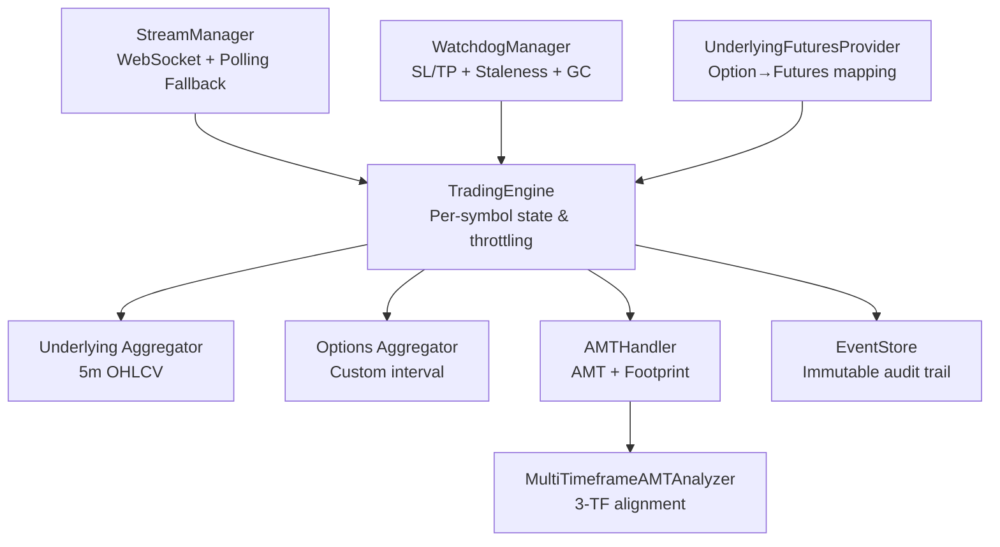

**Diagram sources**
- [stream_manager.py:32-304](file://backend/app/application/stream_manager.py#L32-L304)
- [engine.py:59-126](file://backend/app/application/engine.py#L59-L126)
- [underlying_futures_provider.py:159-210](file://backend/app/domain/services/underlying_futures_provider.py#L159-L210)
- [amt_handler.py:45-181](file://backend/app/application/handlers/amt_handler.py#L45-L181)
- [multi_timeframe_amt.py:74-164](file://backend/app/domain/fabio_ai/services/multi_timeframe_amt.py#L74-L164)
- [event_store.py:51-170](file://backend/app/domain/trading/event_store.py#L51-L170)

**Section sources**
- [stream_manager.py:32-304](file://backend/app/application/stream_manager.py#L32-L304)
- [engine.py:59-126](file://backend/app/application/engine.py#L59-L126)
- [underlying_futures_provider.py:159-210](file://backend/app/domain/services/underlying_futures_provider.py#L159-L210)
- [amt_handler.py:45-181](file://backend/app/application/handlers/amt_handler.py#L45-L181)
- [multi_timeframe_amt.py:74-164](file://backend/app/domain/fabio_ai/services/multi_timeframe_amt.py#L74-L164)
- [event_store.py:51-170](file://backend/app/domain/trading/event_store.py#L51-L170)

## Core Components
- Underlying Futures Provider: Maps option symbols to their dynamic underlying futures symbols and loads instrument configuration.
- Stream Manager: Manages WebSocket streaming with dual-stream depth merging and REST polling fallback for symbols without live feeds.
- Trading Engine: Orchestrates per-symbol state, throttling, dual-feed candle aggregation, and state snapshot building.
- AMT Handler: Performs Auction Market Theory analysis and footprint generation using incremental volume profiles.
- Multi-Timeframe AMT Analyzer: Computes three-timeframe alignment (higher, session, entry) and derives trade implications.
- Watchdog Manager: Enforces SL/TP protection, detects stale streams, and performs periodic garbage collection.
- Event Store: Append-only, idempotent event store for domain events enabling deterministic replay and auditability.
- Symbol Registry: Centralized exchange and symbol classification logic.

**Section sources**
- [underlying_futures_provider.py:159-210](file://backend/app/domain/services/underlying_futures_provider.py#L159-L210)
- [stream_manager.py:32-304](file://backend/app/application/stream_manager.py#L32-L304)
- [engine.py:59-126](file://backend/app/application/engine.py#L59-L126)
- [amt_handler.py:45-181](file://backend/app/application/handlers/amt_handler.py#L45-L181)
- [multi_timeframe_amt.py:74-164](file://backend/app/domain/fabio_ai/services/multi_timeframe_amt.py#L74-L164)
- [watchdog_manager.py:34-198](file://backend/app/application/watchdog_manager.py#L34-L198)
- [event_store.py:51-170](file://backend/app/domain/trading/event_store.py#L51-L170)
- [symbol_registry.py:19-94](file://backend/app/domain/services/symbol_registry.py#L19-L94)

## Architecture Overview
The dual processing streams architecture operates as follows:
- Real-time market data is ingested via Stream Manager, which merges depth 20 levels into full packets and falls back to REST polling for symbols without live feeds.
- The Trading Engine aggregates ticks into candles for both options and mapped underlying futures, applying per-symbol throttling to cap processing frequency.
- AMT analysis is performed for both option chains and underlying instruments, with incremental volume profiles to optimize performance.
- Multi-timeframe alignment synthesizes higher, session, and entry bias to guide position sizing and entry decisions.
- Event sourcing captures immutable domain events for auditability and deterministic replay.
- Watchdog Manager ensures SL/TP protection and stream health even during disconnections.

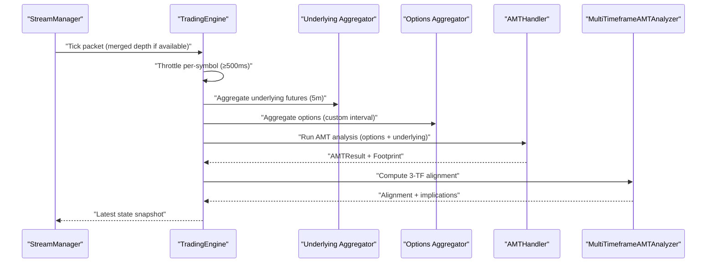

**Diagram sources**
- [stream_manager.py:135-289](file://backend/app/application/stream_manager.py#L135-L289)
- [engine.py:618-800](file://backend/app/application/engine.py#L618-L800)
- [amt_handler.py:89-181](file://backend/app/application/handlers/amt_handler.py#L89-L181)
- [multi_timeframe_amt.py:114-164](file://backend/app/domain/fabio_ai/services/multi_timeframe_amt.py#L114-L164)

**Section sources**
- [stream_manager.py:135-289](file://backend/app/application/stream_manager.py#L135-L289)
- [engine.py:618-800](file://backend/app/application/engine.py#L618-L800)
- [amt_handler.py:89-181](file://backend/app/application/handlers/amt_handler.py#L89-L181)
- [multi_timeframe_amt.py:114-164](file://backend/app/domain/fabio_ai/services/multi_timeframe_amt.py#L114-L164)

## Detailed Component Analysis

### Underlying Futures Mapping
The UnderlyingFuturesProvider resolves the dynamic underlying futures symbol for an option contract using the option’s expiration date and exchange. It falls back to static configuration when dynamic derivation is not possible.

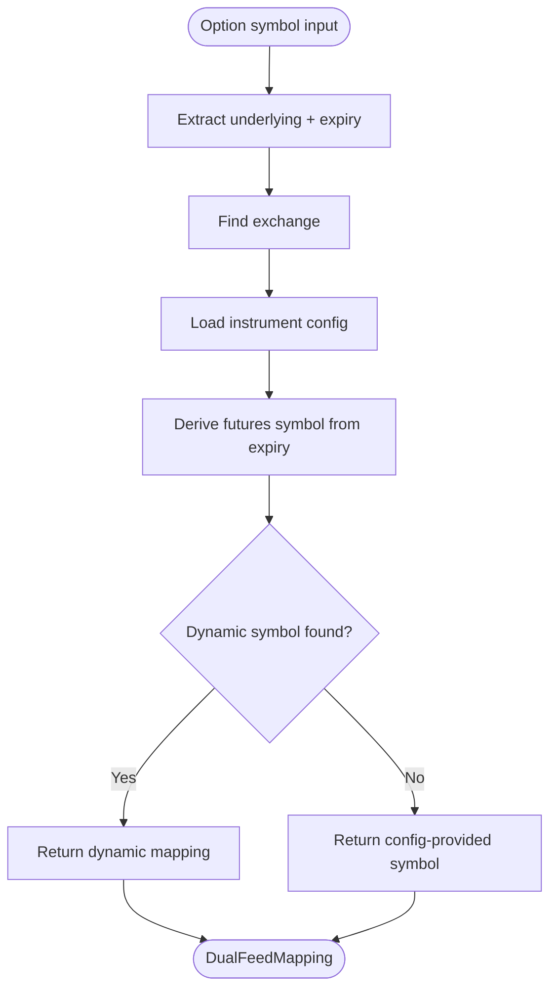

**Diagram sources**
- [underlying_futures_provider.py:159-210](file://backend/app/domain/services/underlying_futures_provider.py#L159-L210)

**Section sources**
- [underlying_futures_provider.py:159-210](file://backend/app/domain/services/underlying_futures_provider.py#L159-L210)

### Concurrent Option and Underlying Processing
The Trading Engine initializes separate candle aggregators for options and underlying futures, aggregates ticks concurrently, and caches the latest underlying tick for AMT analysis. Per-symbol throttling ensures processing occurs at most once every 500 ms.

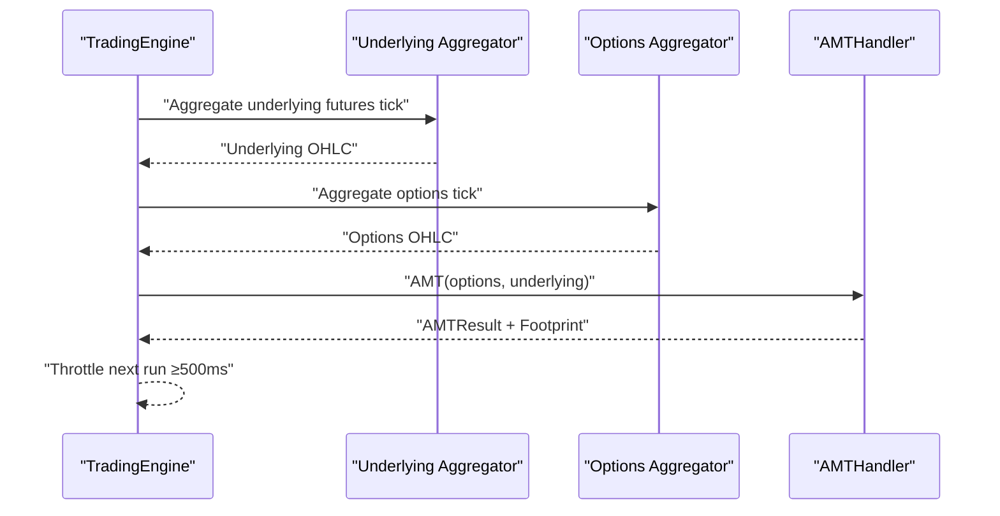

**Diagram sources**
- [engine.py:780-800](file://backend/app/application/engine.py#L780-L800)
- [amt_handler.py:89-181](file://backend/app/application/handlers/amt_handler.py#L89-L181)

**Section sources**
- [engine.py:780-800](file://backend/app/application/engine.py#L780-L800)
- [amt_handler.py:89-181](file://backend/app/application/handlers/amt_handler.py#L89-L181)

### Synchronized Multi-Timeframe AMT Analysis
The MultiTimeframeAMTAnalyzer computes three-timeframe alignment using higher, session, and entry biases derived from AMT results. It returns alignment state, strength, and position sizing implications.

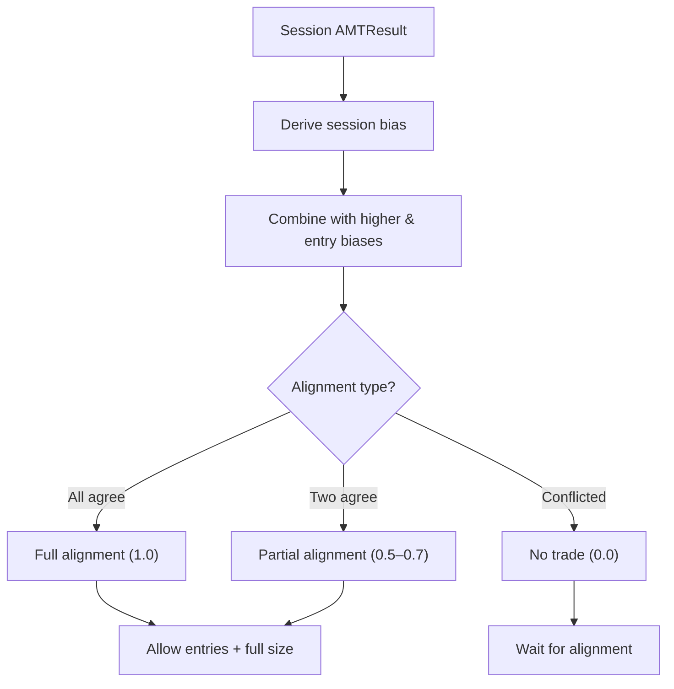

**Diagram sources**
- [multi_timeframe_amt.py:114-164](file://backend/app/domain/fabio_ai/services/multi_timeframe_amt.py#L114-L164)

**Section sources**
- [multi_timeframe_amt.py:74-164](file://backend/app/domain/fabio_ai/services/multi_timeframe_amt.py#L74-L164)

### Per-Symbol Throttling and Resource Control
The Trading Engine enforces a 500 ms minimum interval between process_tick invocations per symbol. It also applies a per-entity circuit breaker to halt processing on repeated failures and switches to polling fallback when WebSocket feeds are silent.

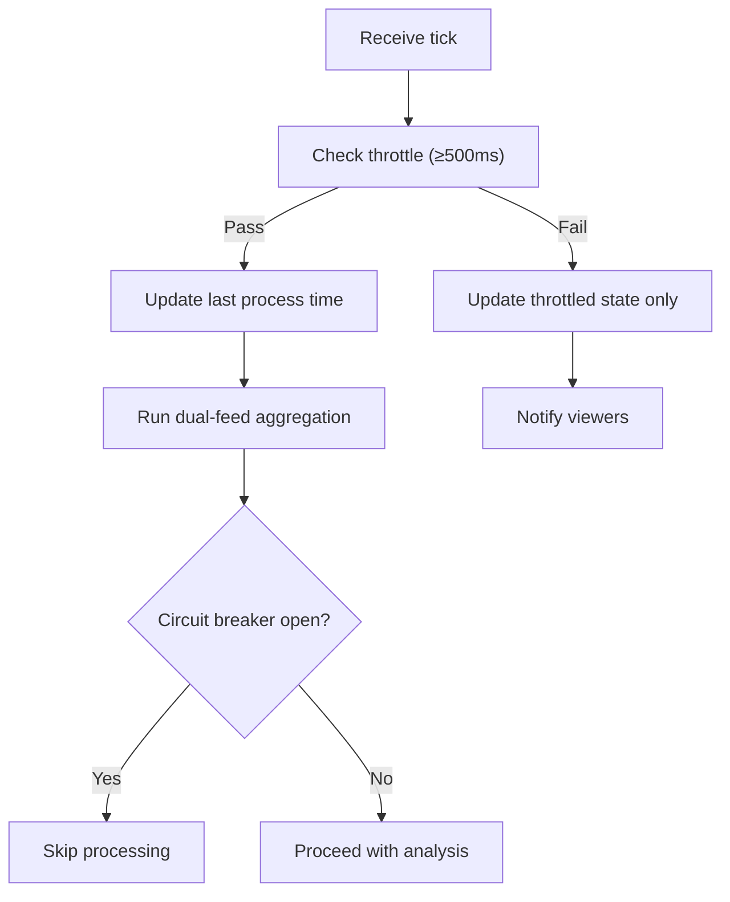

**Diagram sources**
- [engine.py:768-778](file://backend/app/application/engine.py#L768-L778)
- [engine.py:663-664](file://backend/app/application/engine.py#L663-L664)

**Section sources**
- [engine.py:768-778](file://backend/app/application/engine.py#L768-L778)
- [engine.py:663-664](file://backend/app/application/engine.py#L663-L664)

### Circuit Breaker Patterns
Non-overridable circuit breakers protect the system from excessive losses and extreme drawdowns. They evaluate consecutive losses, session PnL, and daily drawdown thresholds to lock trading when triggered.

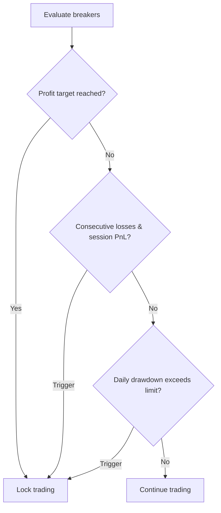

**Diagram sources**
- [circuit_breakers.py:64-105](file://backend/app/domain/services/circuit_breakers.py#L64-L105)

**Section sources**
- [circuit_breakers.py:44-110](file://backend/app/domain/services/circuit_breakers.py#L44-L110)

### Event Sourcing Implementation
The Event Store provides append-only, idempotent storage of domain events with indexing by aggregate and timestamp ordering. It supports deterministic replay and auditability.

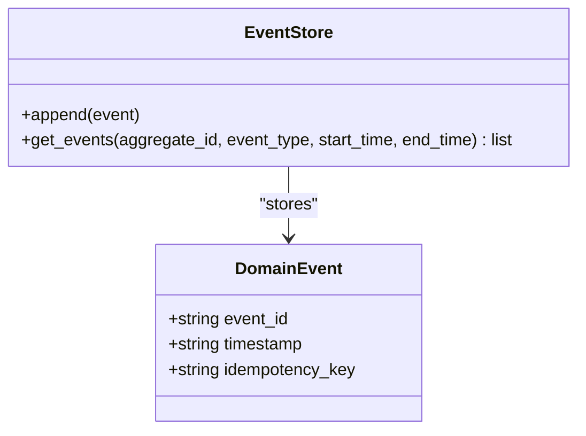

**Diagram sources**
- [event_store.py:51-170](file://backend/app/domain/trading/event_store.py#L51-L170)
- [events.py:39-55](file://backend/app/domain/trading/events.py#L39-L55)

**Section sources**
- [event_store.py:51-170](file://backend/app/domain/trading/event_store.py#L51-L170)
- [events.py:39-55](file://backend/app/domain/trading/events.py#L39-L55)

### Real-Time Data Synchronization and State Management
The Trading Engine maintains per-symbol latest state snapshots, protected by thread locks, and notifies WebSocket viewers via a condition variable. State snapshots are built from session state and enriched with engine-specific fields.

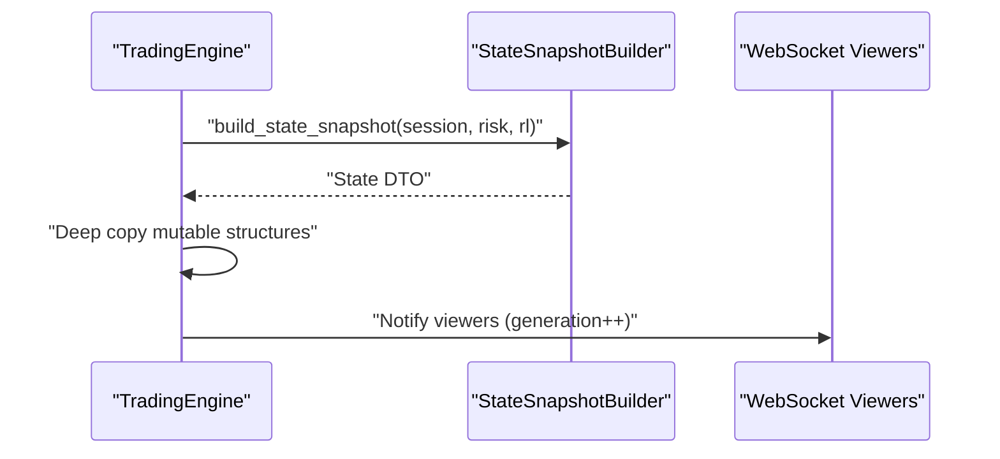

**Diagram sources**
- [engine.py:281-358](file://backend/app/application/engine.py#L281-L358)
- [state_snapshot_builder.py:22-72](file://backend/app/application/services/state_snapshot_builder.py#L22-L72)

**Section sources**
- [engine.py:281-358](file://backend/app/application/engine.py#L281-L358)
- [state_snapshot_builder.py:22-72](file://backend/app/application/services/state_snapshot_builder.py#L22-L72)

### Stream Health Monitoring and Polling Fallback
The Watchdog Manager runs independent loops for SL/TP enforcement, stale stream detection, and garbage collection. It triggers reconnection or switches to polling fallback when WebSocket feeds are unresponsive.

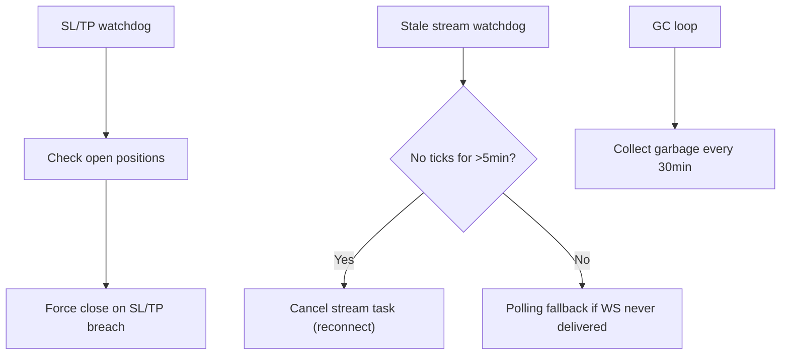

**Diagram sources**
- [watchdog_manager.py:63-198](file://backend/app/application/watchdog_manager.py#L63-L198)

**Section sources**
- [watchdog_manager.py:34-198](file://backend/app/application/watchdog_manager.py#L34-L198)

## Dependency Analysis
Key dependencies and relationships:
- Trading Engine depends on Stream Manager, Underlying Futures Provider, and Candle Aggregators
- AMT Handler depends on Incremental Volume Profiles and Footprint Analyzer
- Multi-Timeframe AMT Analyzer composes AMT results across timeframes
- Event Store persists immutable domain events for auditability
- Watchdog Manager monitors stream health and positions independently
- Symbol Registry centralizes exchange and symbol classification logic

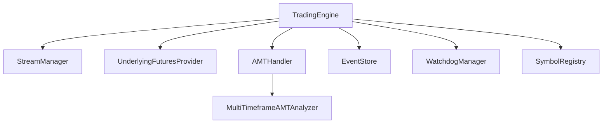

**Diagram sources**
- [engine.py:59-126](file://backend/app/application/engine.py#L59-L126)
- [underlying_futures_provider.py:159-210](file://backend/app/domain/services/underlying_futures_provider.py#L159-L210)
- [amt_handler.py:45-181](file://backend/app/application/handlers/amt_handler.py#L45-L181)
- [multi_timeframe_amt.py:74-164](file://backend/app/domain/fabio_ai/services/multi_timeframe_amt.py#L74-L164)
- [event_store.py:51-170](file://backend/app/domain/trading/event_store.py#L51-L170)
- [watchdog_manager.py:34-198](file://backend/app/application/watchdog_manager.py#L34-L198)
- [symbol_registry.py:19-94](file://backend/app/domain/services/symbol_registry.py#L19-L94)

**Section sources**
- [engine.py:59-126](file://backend/app/application/engine.py#L59-L126)
- [underlying_futures_provider.py:159-210](file://backend/app/domain/services/underlying_futures_provider.py#L159-L210)
- [amt_handler.py:45-181](file://backend/app/application/handlers/amt_handler.py#L45-L181)
- [multi_timeframe_amt.py:74-164](file://backend/app/domain/fabio_ai/services/multi_timeframe_amt.py#L74-L164)
- [event_store.py:51-170](file://backend/app/domain/trading/event_store.py#L51-L170)
- [watchdog_manager.py:34-198](file://backend/app/application/watchdog_manager.py#L34-L198)
- [symbol_registry.py:19-94](file://backend/app/domain/services/symbol_registry.py#L19-L94)

## Performance Considerations
- Incremental Volume Profiles: AMTHandler uses incremental profiles to avoid rebuilding on every tick, reducing CPU and memory overhead.
- Per-Entity Throttling: 500 ms minimum processing interval per symbol prevents redundant analysis and caps resource usage.
- Dual-Stream Depth Merge: Depth 20 levels are cached and merged into full packets to minimize downstream processing cost.
- Polling Fallback: For symbols without live feeds, REST polling reduces idle CPU while ensuring continuity.
- Garbage Collection: Periodic GC mitigates memory growth in long-running sessions.
- Multi-Timeframe Alignment: Lightweight bias derivation and alignment scoring minimize computational overhead.

[No sources needed since this section provides general guidance]

## Troubleshooting Guide
Common issues and mitigations:
- No ticks from WebSocket: Watchdog Manager detects staleness and reconnects; polling fallback is activated if WS never delivers.
- Processing not triggered: Verify per-symbol throttle interval and that market hours gate allows processing.
- Circuit breaker lockouts: Review breaker thresholds and session PnL; resolve underlying issues before reopening.
- State not updating: Confirm state snapshot builder is invoked and thread locks are respected; check viewer notification mechanism.
- Event replay anomalies: Use Event Store queries to inspect ordering and idempotency keys.

**Section sources**
- [watchdog_manager.py:130-198](file://backend/app/application/watchdog_manager.py#L130-L198)
- [engine.py:768-778](file://backend/app/application/engine.py#L768-L778)
- [circuit_breakers.py:64-105](file://backend/app/domain/services/circuit_breakers.py#L64-L105)
- [state_snapshot_builder.py:22-72](file://backend/app/application/services/state_snapshot_builder.py#L22-L72)
- [event_store.py:141-170](file://backend/app/domain/trading/event_store.py#L141-L170)

## Conclusion
The dual processing streams architecture integrates real-time market data ingestion, concurrent option and underlying analysis, and synchronized multi-timeframe alignment. Robust throttling, circuit breakers, and event sourcing ensure efficient, safe, and auditable operation. The design balances responsiveness with resource control, enabling high-frequency tick processing while maintaining system stability.