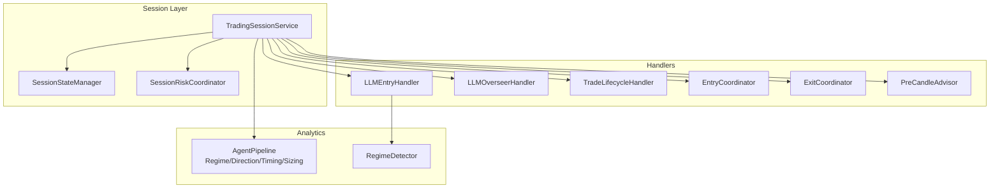
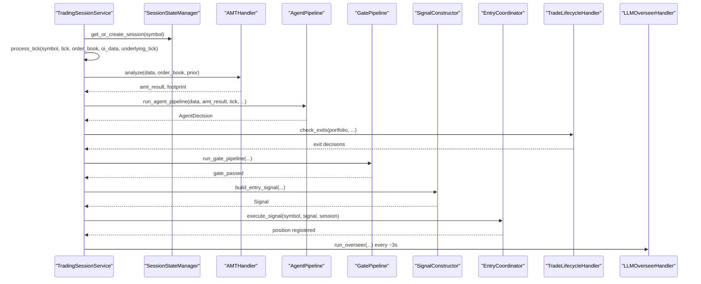
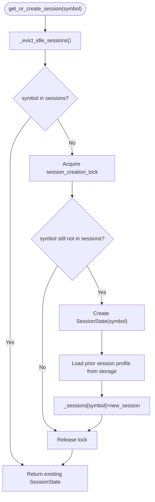
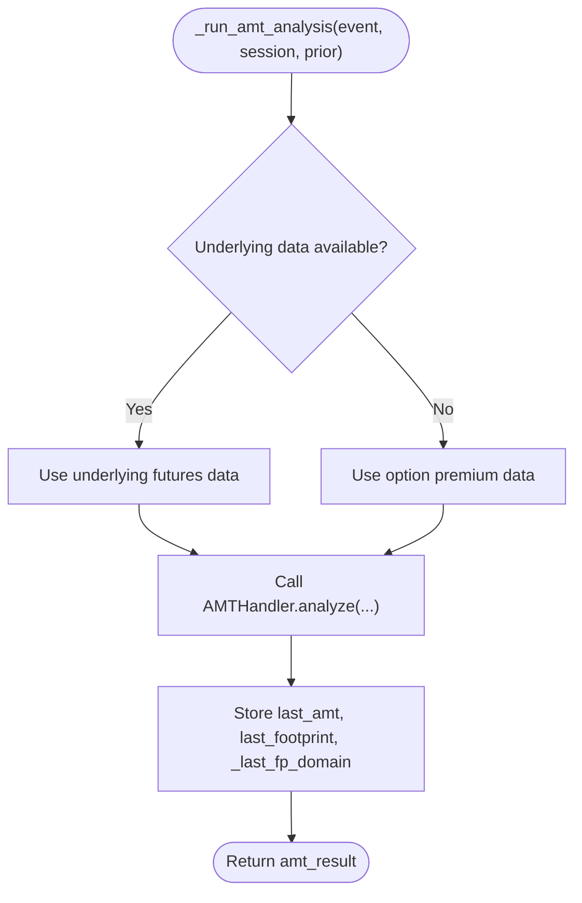
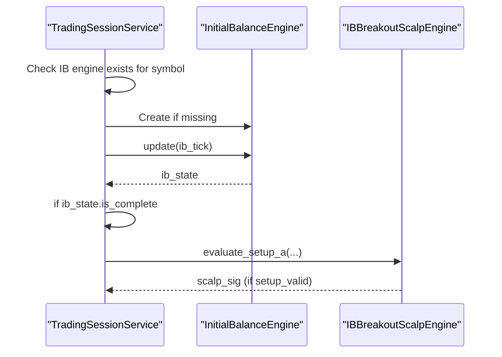
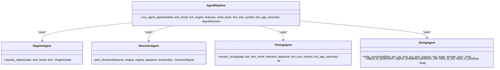
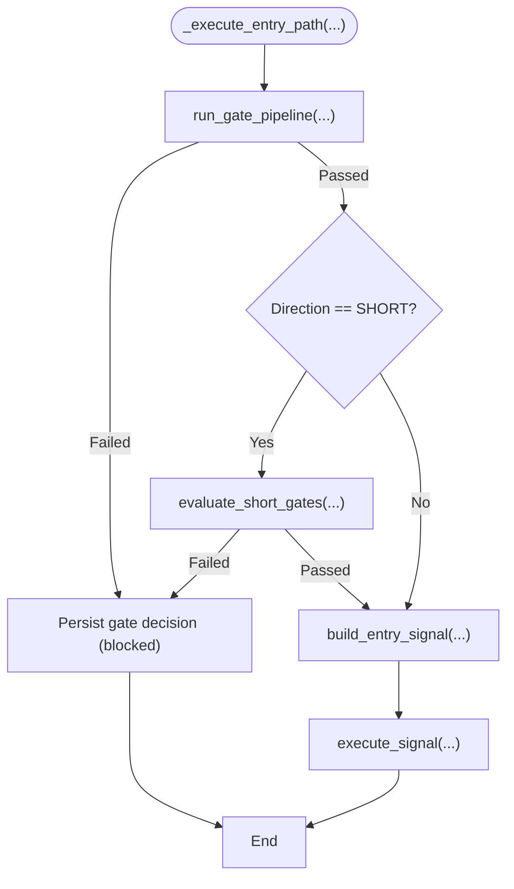
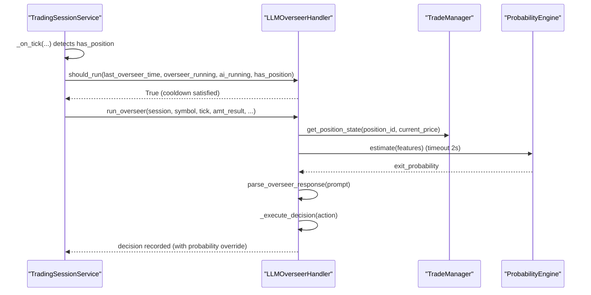
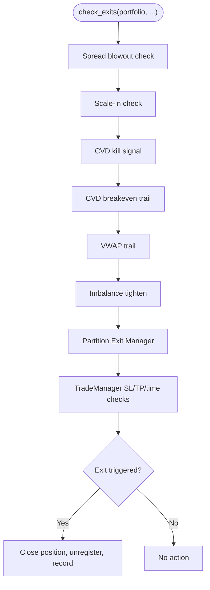
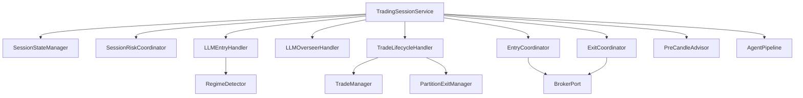

# Session Processing Pipeline

<cite>
**Referenced Files in This Document**
- [trading_session.py](file://backend/app/application/services/trading_session.py)
- [session_state_manager.py](file://backend/app/application/services/session_state_manager.py)
- [session_risk_coordinator.py](file://backend/app/application/services/session_risk_coordinator.py)
- [llm_entry_handler.py](file://backend/app/application/handlers/llm_entry_handler.py)
- [llm_overseer_handler.py](file://backend/app/application/handlers/llm_overseer_handler.py)
- [pre_candle_advisor.py](file://backend/app/application/handlers/pre_candle_advisor.py)
- [entry_coordinator.py](file://backend/app/application/services/entry_coordinator.py)
- [exit_coordinator.py](file://backend/app/application/services/exit_coordinator.py)
- [agent_pipeline.py](file://backend/app/domain/probability/agent_pipeline.py)
- [regime_detector.py](file://backend/app/domain/fabio_ai/services/regime_detector.py)
- [trade_lifecycle_handler.py](file://backend/app/application/handlers/trade_lifecycle_handler.py)
</cite>

## Table of Contents
1. [Introduction](#introduction)
2. [Project Structure](#project-structure)
3. [Core Components](#core-components)
4. [Architecture Overview](#architecture-overview)
5. [Detailed Component Analysis](#detailed-component-analysis)
6. [Dependency Analysis](#dependency-analysis)
7. [Performance Considerations](#performance-considerations)
8. [Troubleshooting Guide](#troubleshooting-guide)
9. [Conclusion](#conclusion)

## Introduction
This document explains the session processing pipeline within TradingSessionService, focusing on per-symbol state management, session creation and eviction logic, thread safety via double-checked locking, and the end-to-end analysis pipeline. It covers AMT analysis integration, footprint generation, initial balance engine updates, IB breakout evaluation, 1-minute bar engine processing, the micro-agent cascade (<1ms latency), gate pipeline validation, signal construction, overseer trigger mechanism every 3 seconds, position management workflows, pre-candle advisory, trade lifecycle exit checks, and cross-thread signal processing from LLM worker threads.

## Project Structure
The session pipeline is orchestrated by TradingSessionService, which delegates to focused handlers and services:
- SessionState management and eviction
- Risk coordination and session risk manager
- LLM entry and overseer handlers
- Gate pipeline and signal construction
- Entry and exit coordinators
- Micro-agent cascade (RegimeAgent, DirectionAgent, TimingAgent, SizingAgent)
- Pre-candle advisory
- Trade lifecycle management



**Diagram sources**
- [trading_session.py:85-220](file://backend/app/application/services/trading_session.py#L85-L220)
- [session_state_manager.py:100-167](file://backend/app/application/services/session_state_manager.py#L100-L167)
- [session_risk_coordinator.py:43-149](file://backend/app/application/services/session_risk_coordinator.py#L43-L149)
- [llm_entry_handler.py:61-95](file://backend/app/application/handlers/llm_entry_handler.py#L61-L95)
- [llm_overseer_handler.py:53-84](file://backend/app/application/handlers/llm_overseer_handler.py#L53-L84)
- [trade_lifecycle_handler.py:22-46](file://backend/app/application/handlers/trade_lifecycle_handler.py#L22-L46)
- [entry_coordinator.py:41-65](file://backend/app/application/services/entry_coordinator.py#L41-L65)
- [exit_coordinator.py:35-63](file://backend/app/application/services/exit_coordinator.py#L35-L63)
- [pre_candle_advisor.py:61-80](file://backend/app/application/handlers/pre_candle_advisor.py#L61-L80)
- [agent_pipeline.py:586-764](file://backend/app/domain/probability/agent_pipeline.py#L586-L764)
- [regime_detector.py:74-108](file://backend/app/domain/fabio_ai/services/regime_detector.py#L74-L108)

**Section sources**
- [trading_session.py:85-220](file://backend/app/application/services/trading_session.py#L85-L220)
- [session_state_manager.py:100-167](file://backend/app/application/services/session_state_manager.py#L100-L167)
- [session_risk_coordinator.py:43-149](file://backend/app/application/services/session_risk_coordinator.py#L43-L149)

## Core Components
- TradingSessionService: Central coordinator delegating to specialized handlers and engines. Provides unified entry path for per-symbol state, orchestrates AMT analysis, micro-agent cascade, gate pipeline, signal construction, overseer, and position lifecycle.
- SessionStateManager: Manages per-symbol SessionState, thread-safe creation and eviction, and runtime QA state reset.
- SessionRiskCoordinator: Coordinates per-symbol risk managers, session risk manager, and risk-tier engine; validates entries and aggregates system risk state.
- LLMEntryHandler: Orchestrates LLM inference with gated execution, builds advisory signals, and manages per-symbol worker queues.
- LLMOverseerHandler: Runs active position management every ~3 seconds, evaluates exits/adds/partials, and integrates probability overrides.
- TradeLifecycleHandler: Deterministic position management via TradeManager and PartitionExitManager; handles exits, trails, scale-ins, and consistency.
- EntryCoordinator: Validates signals, enriches with option selection, executes orders, registers positions, logs events, and persists state.
- ExitCoordinator: Handles partial exits, stop-outs, and full position closures; cleans up broker SLs and records learning/metrics.
- PreCandleAdvisor: Non-blocking advisory fired T-60s before 5-minute bar close.
- AgentPipeline: Ultra-fast micro-agent cascade (<1ms) with RegimeAgent, DirectionAgent, TimingAgent, and SizingAgent.
- RegimeDetector: Detects regime changes, contraction, squeeze, and failed auction re-entry blocking.

**Section sources**
- [trading_session.py:85-220](file://backend/app/application/services/trading_session.py#L85-L220)
- [session_state_manager.py:31-98](file://backend/app/application/services/session_state_manager.py#L31-L98)
- [session_risk_coordinator.py:43-149](file://backend/app/application/services/session_risk_coordinator.py#L43-L149)
- [llm_entry_handler.py:61-95](file://backend/app/application/handlers/llm_entry_handler.py#L61-L95)
- [llm_overseer_handler.py:53-84](file://backend/app/application/handlers/llm_overseer_handler.py#L53-L84)
- [trade_lifecycle_handler.py:22-46](file://backend/app/application/handlers/trade_lifecycle_handler.py#L22-L46)
- [entry_coordinator.py:41-65](file://backend/app/application/services/entry_coordinator.py#L41-L65)
- [exit_coordinator.py:35-63](file://backend/app/application/services/exit_coordinator.py#L35-L63)
- [pre_candle_advisor.py:61-80](file://backend/app/application/handlers/pre_candle_advisor.py#L61-L80)
- [agent_pipeline.py:586-764](file://backend/app/domain/probability/agent_pipeline.py#L586-L764)
- [regime_detector.py:74-108](file://backend/app/domain/fabio_ai/services/regime_detector.py#L74-L108)

## Architecture Overview
The session pipeline processes incoming ticks, updates per-symbol state, runs AMT analysis, executes micro-agent decisions, validates gates, constructs signals, and manages positions. It also periodically invokes the overseer and pre-candle advisory.



**Diagram sources**
- [trading_session.py:233-417](file://backend/app/application/services/trading_session.py#L233-L417)
- [trading_session.py:1025-1276](file://backend/app/application/services/trading_session.py#L1025-L1276)
- [agent_pipeline.py:586-764](file://backend/app/domain/probability/agent_pipeline.py#L586-L764)
- [trade_lifecycle_handler.py:47-268](file://backend/app/application/handlers/trade_lifecycle_handler.py#L47-L268)
- [llm_overseer_handler.py:108-166](file://backend/app/application/handlers/llm_overseer_handler.py#L108-L166)
- [entry_coordinator.py:66-286](file://backend/app/application/services/entry_coordinator.py#L66-L286)

## Detailed Component Analysis

### Unified Entry Path and Per-Symbol State Management
- Session creation and retrieval: get_or_create_session(symbol) ensures a SessionState exists and loads prior session profiles from storage.
- Double-checked locking: SessionStateManager.get_or_create_session uses a session creation lock around a double-checked lookup to avoid redundant allocations and race conditions.
- Thread safety: SessionState exposes an RLock for all portfolio reads/writes and throttling flags. Cross-thread signal processing uses a pending signal queue drained on the next tick under lock.
- Eviction policy: Idle sessions (no open positions) older than 24 hours are evicted hourly to bound memory.



**Diagram sources**
- [session_state_manager.py:117-167](file://backend/app/application/services/session_state_manager.py#L117-L167)
- [session_state_manager.py:168-186](file://backend/app/application/services/session_state_manager.py#L168-L186)

**Section sources**
- [session_state_manager.py:117-167](file://backend/app/application/services/session_state_manager.py#L117-L167)
- [session_state_manager.py:168-186](file://backend/app/application/services/session_state_manager.py#L168-L186)
- [trading_session.py:229-232](file://backend/app/application/services/trading_session.py#L229-L232)

### Tick Processing and Cross-Thread Signal Handling
- Pending signal drain: On each tick, TradingSessionService drains any pending signal from the LLM worker thread under session._lock and enforces a TTL (e.g., 10 minutes) to discard stale signals.
- Data store updates: Maintains OHLC data and underlying futures data, with capped length to bound memory.
- Portfolio tick processing: Updates portfolio state and records closed positions, invoking ExitCoordinator and persisting trade results.
- Entry path delegation: Converts TickReceived event into the unified entry path, including AMT analysis, micro-agent pipeline, gate pipeline, and signal execution.

```mermaid
sequenceDiagram
participant TS as "TradingSessionService"
participant S as "SessionState"
participant LLM as "LLM Worker Thread"
participant EC as "EntryCoordinator"
LLM->>S : _pending_signal = (symbol, Signal)
TS->>S : Acquire _lock
TS->>S : _last_tick_time = now
TS->>S : pending = _pending_signal; _pending_signal = None
TS->>TS : TTL check (discard if >10min)
TS->>TS : if pending then _execute_signal(symbol, signal, session)
TS->>S : Release _lock
TS->>S : Update data store (capped length)
TS->>S : Update portfolio
TS->>EC : execute_signal(symbol, signal, session)
```

**Diagram sources**
- [trading_session.py:253-279](file://backend/app/application/services/trading_session.py#L253-L279)
- [trading_session.py:280-327](file://backend/app/application/services/trading_session.py#L280-L327)
- [trading_session.py:328-417](file://backend/app/application/services/trading_session.py#L328-L417)
- [entry_coordinator.py:66-286](file://backend/app/application/services/entry_coordinator.py#L66-L286)

**Section sources**
- [trading_session.py:253-279](file://backend/app/application/services/trading_session.py#L253-L279)
- [trading_session.py:280-327](file://backend/app/application/services/trading_session.py#L280-L327)
- [trading_session.py:328-417](file://backend/app/application/services/trading_session.py#L328-L417)
- [entry_coordinator.py:66-286](file://backend/app/application/services/entry_coordinator.py#L66-L286)

### AMT Analysis Integration and Footprint Generation
- Dual feed selection: Uses underlying futures data for AMT analysis when available; otherwise falls back to option premium data.
- Prior profile injection: Loads prior session profile (POC/VAH/VAL/print levels) to inform gap analysis and structural level persistence.
- Result caching: Stores last_amt, last_footprint, and last_fp_domain in SessionState for downstream components.
- Session phase gating: On Phase 5 (15:15-15:30 IST), forces exit of all open positions and persists session profile.



**Diagram sources**
- [trading_session.py:656-707](file://backend/app/application/services/trading_session.py#L656-L707)

**Section sources**
- [trading_session.py:656-707](file://backend/app/application/services/trading_session.py#L656-L707)

### Initial Balance Engine Updates and IB Breakout Evaluation
- IB engine initialization: Creates InitialBalanceEngine per symbol on demand.
- IB state update: Updates IB engine with either option or underlying tick depending on availability.
- IB breakout scalp: When IB completes, evaluates Setup A using IBBreakoutScalpEngine with cvd_slope_1m and baseline volume to generate IB scalp signals.



**Diagram sources**
- [trading_session.py:1031-1111](file://backend/app/application/services/trading_session.py#L1031-L1111)

**Section sources**
- [trading_session.py:1031-1111](file://backend/app/application/services/trading_session.py#L1031-L1111)

### 1-Minute Bar Engine Processing
- OneMinBarEngine: Updated per tick with normalized delta-weighted volume and timestamp to track intrabar dynamics for potential setups.

**Section sources**
- [trading_session.py:1112-1125](file://backend/app/application/services/trading_session.py#L1112-L1125)

### Micro-Agent Cascade (<1ms Latency)
The micro-agent pipeline runs ultra-fast:
- RegimeAgent: Classifies market regime (TRENDING/BALANCED/VOLATILE/DEAD) and allowed directions.
- DirectionAgent: Estimates P(long/short) via probability model and selects direction with regime filters.
- TimingAgent: Decides ENTER_NOW/WAIT/SKIP based on delta, CVD, aggressive prints, and gate synchronization.
- SizingAgent: Computes Kelly-optimal position size and adjusts SL/TP multipliers.



**Diagram sources**
- [agent_pipeline.py:586-764](file://backend/app/domain/probability/agent_pipeline.py#L586-L764)
- [agent_pipeline.py:100-164](file://backend/app/domain/probability/agent_pipeline.py#L100-L164)
- [agent_pipeline.py:179-230](file://backend/app/domain/probability/agent_pipeline.py#L179-L230)
- [agent_pipeline.py:237-359](file://backend/app/domain/probability/agent_pipeline.py#L237-L359)
- [agent_pipeline.py:490-578](file://backend/app/domain/probability/agent_pipeline.py#L490-L578)

**Section sources**
- [agent_pipeline.py:586-764](file://backend/app/domain/probability/agent_pipeline.py#L586-L764)

### Gate Pipeline Validation and Signal Construction
- Gate pipeline: Validates market state, drive number, aggression, distance to levels, and other criteria to approve entries.
- Short gates: Additional evaluation for short setups including displacement, failed breakout, and book imbalance.
- Signal construction: Builds entry signals enriched with AI rationale, setup type, session context, and risk parameters.



**Diagram sources**
- [trading_session.py:819-970](file://backend/app/application/services/trading_session.py#L819-L970)
- [trading_session.py:910-940](file://backend/app/application/services/trading_session.py#L910-L940)

**Section sources**
- [trading_session.py:819-970](file://backend/app/application/services/trading_session.py#L819-L970)

### Overseer Trigger Mechanism (Every 3 Seconds)
- Cooldown enforcement: LLMOverseerHandler.should_run enforces a 3-second cooldown between overseer calls.
- Position monitoring: When positions exist, runs overseer analysis asynchronously, computes exit probability via probability engine, applies probability override logic, and executes decisions (HOLD/TIGHTEN_SL/PARTIAL_EXIT/FULL_EXIT/ADD).
- Immediate UI updates: Triggers engine updates upon decision execution.



**Diagram sources**
- [llm_overseer_handler.py:90-106](file://backend/app/application/handlers/llm_overseer_handler.py#L90-L106)
- [llm_overseer_handler.py:108-166](file://backend/app/application/handlers/llm_overseer_handler.py#L108-L166)
- [llm_overseer_handler.py:220-358](file://backend/app/application/handlers/llm_overseer_handler.py#L220-L358)

**Section sources**
- [llm_overseer_handler.py:90-106](file://backend/app/application/handlers/llm_overseer_handler.py#L90-L106)
- [llm_overseer_handler.py:108-166](file://backend/app/application/handlers/llm_overseer_handler.py#L108-L166)
- [llm_overseer_handler.py:220-358](file://backend/app/application/handlers/llm_overseer_handler.py#L220-L358)

### Position Management Workflows
- Deterministic exits: TradeLifecycleHandler checks spread blowout, scale-in triggers, CVD kill signals, breakeven trails, VWAP trails, imbalance tightens, and partition exits.
- Broker SL scrubbing: ExitCoordinator cancels hardware SLs on partial/full exits.
- Post-trade analysis: ExitCoordinator triggers post-trade LLM analysis and persists state.
- Session risk: Records trade results in SessionRiskCoordinator and persists risk state.



**Diagram sources**
- [trade_lifecycle_handler.py:47-268](file://backend/app/application/handlers/trade_lifecycle_handler.py#L47-L268)
- [exit_coordinator.py:64-126](file://backend/app/application/services/exit_coordinator.py#L64-L126)
- [exit_coordinator.py:143-253](file://backend/app/application/services/exit_coordinator.py#L143-L253)

**Section sources**
- [trade_lifecycle_handler.py:47-268](file://backend/app/application/handlers/trade_lifecycle_handler.py#L47-L268)
- [exit_coordinator.py:64-126](file://backend/app/application/services/exit_coordinator.py#L64-L126)
- [exit_coordinator.py:143-253](file://backend/app/application/services/exit_coordinator.py#L143-L253)

### Pre-Candle Advisory System
- Trigger: Fires T-60s before 5-minute bar close (bar minute 4) with debounce protection.
- Non-blocking: Asynchronous advisory with 12s timeout; results pushed to dashboard via callback.
- Scenario narrative: Builds advisory prompt and parses structured response for scenario, expected setup, and key levels.

**Section sources**
- [pre_candle_advisor.py:85-107](file://backend/app/application/handlers/pre_candle_advisor.py#L85-L107)
- [pre_candle_advisor.py:109-130](file://backend/app/application/handlers/pre_candle_advisor.py#L109-L130)
- [pre_candle_advisor.py:131-187](file://backend/app/application/handlers/pre_candle_advisor.py#L131-L187)

### Trade Lifecycle Exit Checks and Cross-Thread Signal Processing
- Duplicate signal prevention: SessionState tracks executed signal IDs to avoid duplicate position openings.
- Cross-thread safety: Pending signals are stored in SessionState and drained on the main thread under lock to ensure portfolio mutations occur on the main thread.
- Signal TTL: Discards stale signals older than 10 minutes.

**Section sources**
- [session_state_manager.py:83-84](file://backend/app/application/services/session_state_manager.py#L83-L84)
- [trading_session.py:253-279](file://backend/app/application/services/trading_session.py#L253-L279)
- [entry_coordinator.py:137-143](file://backend/app/application/services/entry_coordinator.py#L137-L143)

## Dependency Analysis


**Diagram sources**
- [trading_session.py:85-220](file://backend/app/application/services/trading_session.py#L85-L220)
- [llm_entry_handler.py:61-95](file://backend/app/application/handlers/llm_entry_handler.py#L61-L95)
- [llm_overseer_handler.py:53-84](file://backend/app/application/handlers/llm_overseer_handler.py#L53-L84)
- [trade_lifecycle_handler.py:22-46](file://backend/app/application/handlers/trade_lifecycle_handler.py#L22-L46)
- [entry_coordinator.py:41-65](file://backend/app/application/services/entry_coordinator.py#L41-L65)
- [exit_coordinator.py:35-63](file://backend/app/application/services/exit_coordinator.py#L35-L63)
- [agent_pipeline.py:586-764](file://backend/app/domain/probability/agent_pipeline.py#L586-L764)
- [regime_detector.py:74-108](file://backend/app/domain/fabio_ai/services/regime_detector.py#L74-L108)

**Section sources**
- [trading_session.py:85-220](file://backend/app/application/services/trading_session.py#L85-L220)
- [llm_entry_handler.py:61-95](file://backend/app/application/handlers/llm_entry_handler.py#L61-L95)
- [llm_overseer_handler.py:53-84](file://backend/app/application/handlers/llm_overseer_handler.py#L53-L84)
- [trade_lifecycle_handler.py:22-46](file://backend/app/application/handlers/trade_lifecycle_handler.py#L22-L46)
- [entry_coordinator.py:41-65](file://backend/app/application/services/entry_coordinator.py#L41-L65)
- [exit_coordinator.py:35-63](file://backend/app/application/services/exit_coordinator.py#L35-L63)
- [agent_pipeline.py:586-764](file://backend/app/domain/probability/agent_pipeline.py#L586-L764)
- [regime_detector.py:74-108](file://backend/app/domain/fabio_ai/services/regime_detector.py#L74-L108)

## Performance Considerations
- Ultra-low-latency micro-agent cascade (<1ms) using rule-based and LightGBM agents.
- Coordinated throttling: LLM entry cooldown (30s), overseer cooldown (3s), and execution cooldown (60s) prevent excessive calls.
- Memory bounds: Capped candle history per symbol and periodic session eviction for idle sessions.
- Non-blocking advisories: Pre-candle advisory runs with timeouts to avoid blocking the main pipeline.

## Troubleshooting Guide
- AMT failures: The pipeline continues with exits/overseer checks when AMT fails; a minimal sentinel is used to keep downstream logic intact.
- Stale signals: Pending signals older than 10 minutes are discarded to prevent stale decisions.
- Position state mismatches: Consistency checks reconcile managed vs open positions and log mismatches for audit.
- Spread blowout: Automatic exit on extreme bid-ask spreads to protect capital.
- Probability engine timeouts: Overseer probability inference uses timeouts; defaults to HOLD when estimates fail.

**Section sources**
- [trading_session.py:1050-1067](file://backend/app/application/services/trading_session.py#L1050-L1067)
- [trading_session.py:261-277](file://backend/app/application/services/trading_session.py#L261-L277)
- [trade_lifecycle_handler.py:66-77](file://backend/app/application/handlers/trade_lifecycle_handler.py#L66-L77)
- [trade_lifecycle_handler.py:84-106](file://backend/app/application/handlers/trade_lifecycle_handler.py#L84-L106)
- [llm_overseer_handler.py:236-259](file://backend/app/application/handlers/llm_overseer_handler.py#L236-L259)

## Conclusion
The session processing pipeline in TradingSessionService provides a robust, thread-safe, and high-performance framework for options scalping. It integrates AMT analysis, micro-agent decisions, gate validation, and overseer-driven position management, while maintaining strict risk controls and operational observability. The design leverages double-checked locking for session creation, bounded memory usage, and coordinated throttling to sustain sub-millisecond latency across the hot path.