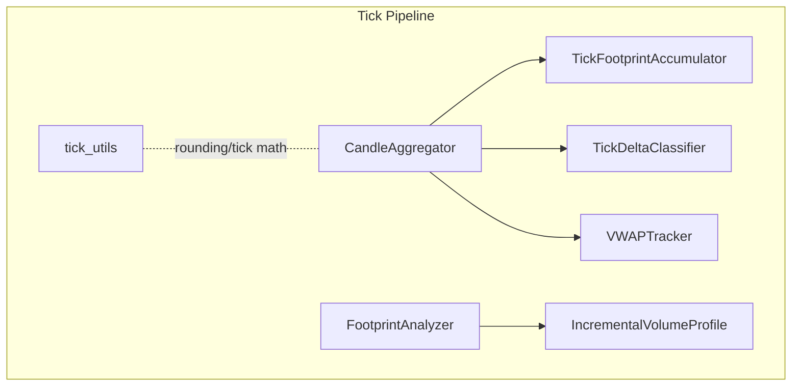
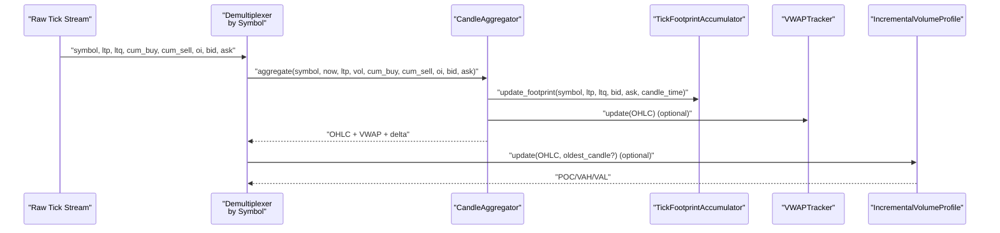
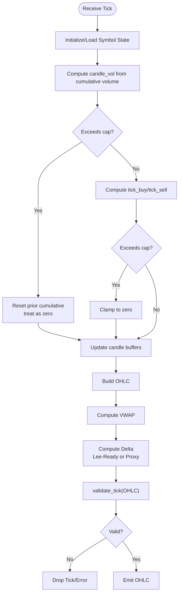
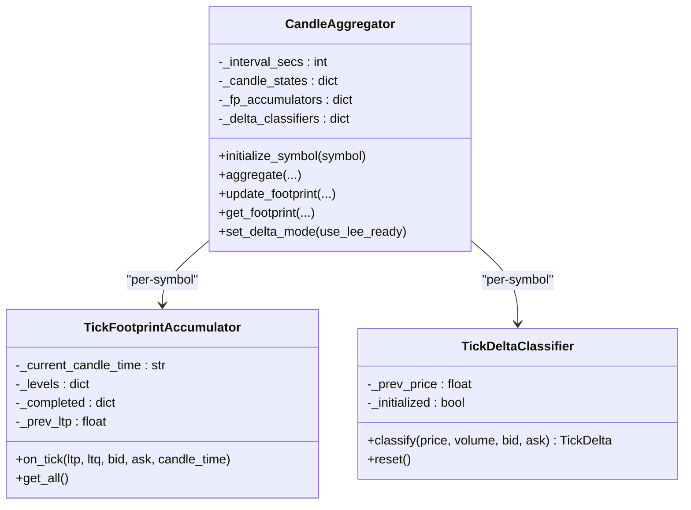
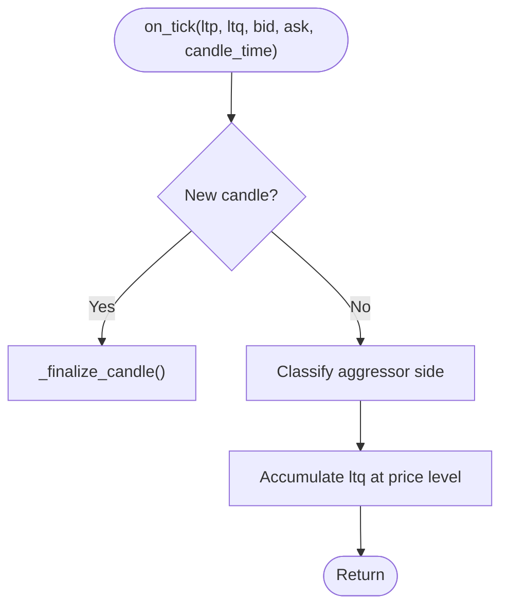
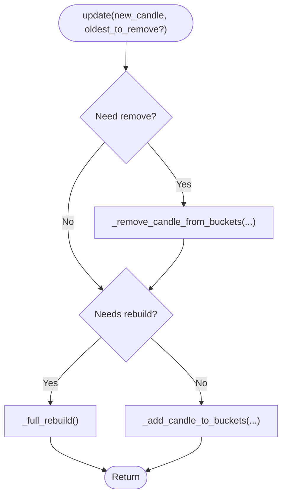
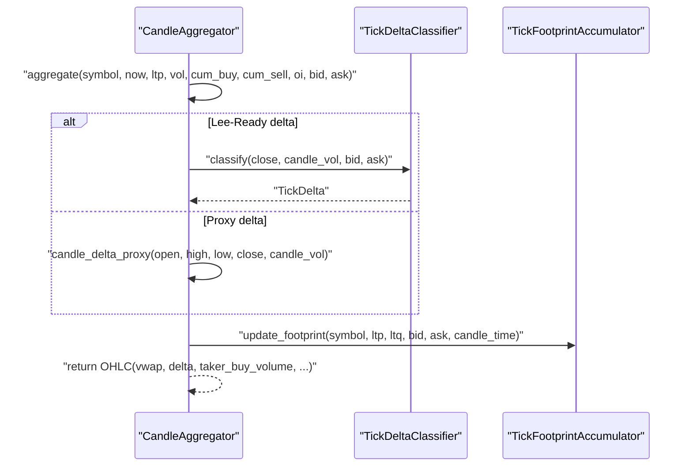
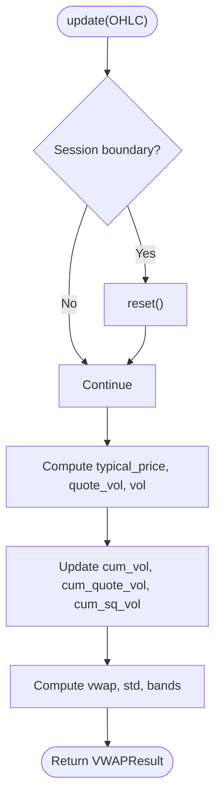
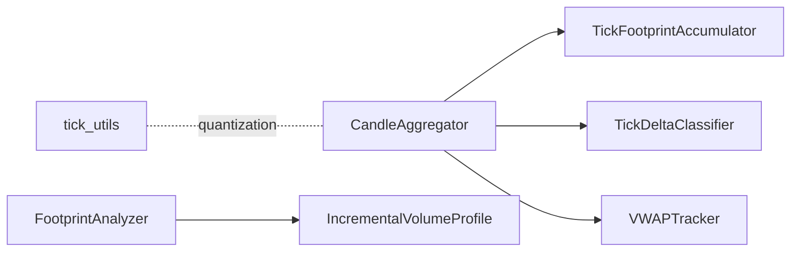

# Tick Processing Pipeline

<cite>
**Referenced Files in This Document**
- [candle_aggregator.py](file://backend/app/application/candle_aggregator.py)
- [tick_delta.py](file://backend/app/domain/services/tick_delta.py)
- [footprint_analyzer.py](file://backend/app/domain/fabio_ai/services/footprint_analyzer.py)
- [tick_utils.py](file://backend/app/domain/services/tick_utils.py)
- [volume_profile.py](file://backend/app/domain/services/volume_profile.py)
- [vwap_tracker.py](file://backend/app/domain/services/vwap_tracker.py)
</cite>

## Table of Contents
1. [Introduction](#introduction)
2. [Project Structure](#project-structure)
3. [Core Components](#core-components)
4. [Architecture Overview](#architecture-overview)
5. [Detailed Component Analysis](#detailed-component-analysis)
6. [Dependency Analysis](#dependency-analysis)
7. [Performance Considerations](#performance-considerations)
8. [Troubleshooting Guide](#troubleshooting-guide)
9. [Conclusion](#conclusion)

## Introduction
This document describes the tick processing pipeline from raw market data reception to processed candle data. It covers tick validation, demultiplexing by symbol, per-symbol circuit breaker checks, open interest tracking with change detection, throttling, footprint accumulation, incremental volume profile updates, error handling, data quality assurance, and performance optimizations. It also documents the integration with CandleAggregator for OHLCV calculation, VWAP computation, delta tracking, and Lee-Ready delta classification.

## Project Structure
The tick pipeline spans several modules:
- CandleAggregator: central aggregator for OHLCV, VWAP, delta, and footprint updates
- TickDeltaClassifier: Lee-Ready delta classification at tick level
- TickFootprintAccumulator: per-candle footprint builder from tick-level aggressor classification
- FootprintAnalyzer: footprint chart generation from OHLC deltas
- VolumeProfile: incremental volume profile with POC/VAH/VAL computation
- VWAPTracker: session-cumulative VWAP with sigma bands
- tick_utils: price rounding and tick-size utilities

**Diagram sources**
- [candle_aggregator.py:73-324](file://backend/app/application/candle_aggregator.py#L73-L324)
- [tick_delta.py:41-195](file://backend/app/domain/services/tick_delta.py#L41-L195)
- [footprint_analyzer.py:126-342](file://backend/app/domain/fabio_ai/services/footprint_analyzer.py#L126-L342)
- [volume_profile.py:293-491](file://backend/app/domain/services/volume_profile.py#L293-L491)
- [vwap_tracker.py:33-106](file://backend/app/domain/services/vwap_tracker.py#L33-L106)
- [tick_utils.py:12-83](file://backend/app/domain/services/tick_utils.py#L12-L83)

**Section sources**
- [candle_aggregator.py:1-324](file://backend/app/application/candle_aggregator.py#L1-L324)
- [tick_delta.py:1-195](file://backend/app/domain/services/tick_delta.py#L1-L195)
- [footprint_analyzer.py:1-342](file://backend/app/domain/fabio_ai/services/footprint_analyzer.py#L1-L342)
- [volume_profile.py:1-491](file://backend/app/domain/services/volume_profile.py#L1-L491)
- [vwap_tracker.py:1-106](file://backend/app/domain/services/vwap_tracker.py#L1-L106)
- [tick_utils.py:1-83](file://backend/app/domain/services/tick_utils.py#L1-L83)

## Core Components
- CandleAggregator: aggregates ticks into OHLCV candles, computes VWAP, delta, and manages per-symbol state, footprint accumulation, and tick validation
- TickDeltaClassifier: applies Lee-Ready algorithm to classify each tick as buy/sell initiated or neutral
- TickFootprintAccumulator: accumulates tick-level aggressor volumes per price level within a candle timeframe
- FootprintAnalyzer: generates footprint charts from OHLC delta data using Gaussian weighting and POC/imbalance detection
- IncrementalVolumeProfile: maintains volume profile buckets incrementally and recomputes POC/VAH/VAL efficiently
- VWAPTracker: session-cumulative VWAP with sigma bands and automatic session boundary detection
- tick_utils: provides tick-size-aware rounding and quantization helpers

**Section sources**
- [candle_aggregator.py:73-324](file://backend/app/application/candle_aggregator.py#L73-L324)
- [tick_delta.py:41-195](file://backend/app/domain/services/tick_delta.py#L41-L195)
- [footprint_analyzer.py:126-342](file://backend/app/domain/fabio_ai/services/footprint_analyzer.py#L126-L342)
- [volume_profile.py:293-491](file://backend/app/domain/services/volume_profile.py#L293-L491)
- [vwap_tracker.py:33-106](file://backend/app/domain/services/vwap_tracker.py#L33-L106)
- [tick_utils.py:12-83](file://backend/app/domain/services/tick_utils.py#L12-L83)

## Architecture Overview
The pipeline receives tick messages, validates them, demultiplexes by symbol, updates per-symbol state, and produces OHLCV candles enriched with VWAP, delta, and footprint data. Optional volume profile updates and VWAP bands are computed downstream.

**Diagram sources**
- [candle_aggregator.py:114-257](file://backend/app/application/candle_aggregator.py#L114-L257)
- [footprint_analyzer.py:258-301](file://backend/app/domain/fabio_ai/services/footprint_analyzer.py#L258-L301)
- [vwap_tracker.py:46-92](file://backend/app/domain/services/vwap_tracker.py#L46-L92)
- [volume_profile.py:447-491](file://backend/app/domain/services/volume_profile.py#L447-L491)

## Detailed Component Analysis

### Tick Validation and Quality Assurance
- Validation checks performed by CandleAggregator.validate_tick:
  - Rejects NaN, Inf, non-positive OHLC values
  - Rejects NaN, Inf, or negative volume
  - Ensures high >= low
- Additional safeguards in aggregation:
  - Cumulative volume/side volume sanity checks with contextual caps (>5% of cumulative) to handle session resets
  - Ignores negative or decreasing cumulative values by resetting prior cumulative and treating current as zero

**Diagram sources**
- [candle_aggregator.py:142-257](file://backend/app/application/candle_aggregator.py#L142-L257)
- [candle_aggregator.py:302-324](file://backend/app/application/candle_aggregator.py#L302-L324)

**Section sources**
- [candle_aggregator.py:142-257](file://backend/app/application/candle_aggregator.py#L142-L257)
- [candle_aggregator.py:302-324](file://backend/app/application/candle_aggregator.py#L302-L324)

### Demultiplexing by Symbol and Per-Symbol State Management
- CandleAggregator maintains separate state per symbol:
  - Candle buffers: open/high/low/close, cumulative volumes, buy/sell volumes, VWAP numerator/denominator, OI
  - TickFootprintAccumulator instances per symbol
  - TickDeltaClassifier instances per symbol
- Initialization on first tick per symbol ensures isolated state

**Diagram sources**
- [candle_aggregator.py:73-96](file://backend/app/application/candle_aggregator.py#L73-L96)
- [footprint_analyzer.py:126-170](file://backend/app/domain/fabio_ai/services/footprint_analyzer.py#L126-L170)
- [tick_delta.py:41-51](file://backend/app/domain/services/tick_delta.py#L41-L51)

**Section sources**
- [candle_aggregator.py:73-96](file://backend/app/application/candle_aggregator.py#L73-L96)
- [footprint_analyzer.py:126-170](file://backend/app/domain/fabio_ai/services/footprint_analyzer.py#L126-L170)
- [tick_delta.py:41-51](file://backend/app/domain/services/tick_delta.py#L41-L51)

### Circuit Breaker Checks and OI Tracking with Change Detection
- Per-symbol circuit breaker checks are not implemented in the analyzed files. If required, integrate a per-symbol limiter around the aggregate call to cap processing rate or reject outliers.
- OI tracking:
  - CandleAggregator stores and updates OI per symbol during aggregation
  - For change detection, compare current OI against previous stored OI and emit alerts when thresholds are exceeded

Recommendations:
- Add a per-symbol OI cache keyed by symbol and compare with incoming OI to trigger alerts or throttling
- Introduce a circuit breaker threshold guard around the aggregate call to drop or delay ticks exceeding predefined criteria

**Section sources**
- [candle_aggregator.py:203-213](file://backend/app/application/candle_aggregator.py#L203-L213)

### 500ms Throttling Mechanism for Per-Symbol Processing
- The analyzed files do not implement a 500ms throttling mechanism. To enforce throttling:
  - Track last processed timestamp per symbol
  - Drop or queue ticks until 500ms elapsed since last processed tick per symbol
  - Ensure this is applied before calling CandleAggregator.aggregate

[No sources needed since this section proposes an enhancement not present in the analyzed files]

### Footprint Accumulation Through TickFootprintAccumulator
- TickFootprintAccumulator.on_tick:
  - Classifies aggressor side using tick rule against best bid/ask or midpoint fallback
  - Accumulates ltq into bid/ask volumes per price level
  - Finalizes candle on candle boundary and trims older completed candles
- get_all returns completed candles plus current in-progress candle

**Diagram sources**
- [footprint_analyzer.py:141-170](file://backend/app/domain/fabio_ai/services/footprint_analyzer.py#L141-L170)

**Section sources**
- [footprint_analyzer.py:126-170](file://backend/app/domain/fabio_ai/services/footprint_analyzer.py#L126-L170)

### Incremental Volume Profile Updates
- IncrementalVolumeProfile.update:
  - Adds new candle and optionally removes oldest candle
  - Rebuilds buckets only when price range expands beyond bounds or when boundary buckets are affected
  - Computes POC/VAH/VAL snapshots from bucket totals

**Diagram sources**
- [volume_profile.py:447-476](file://backend/app/domain/services/volume_profile.py#L447-L476)

**Section sources**
- [volume_profile.py:293-491](file://backend/app/domain/services/volume_profile.py#L293-L491)

### Integration with CandleAggregator for OHLCV, VWAP, Delta, and Footprints
- OHLCV aggregation:
  - Computes candle_vol from cumulative volume with contextual caps
  - Computes tick_buy/tick_sell from cumulative buys/sells with caps
  - Updates high/low/close and volume/buy_volume/oi
- VWAP:
  - Updates numerator/denominator incrementally and computes VWAP
- Delta:
  - If Lee-Ready mode enabled and bid/ask available, uses TickDeltaClassifier.classify
  - Otherwise uses candle_delta_proxy (body-ratio approximation)
  - Derives taker_buy_volume from delta and volume
- Footprint:
  - Delegates to TickFootprintAccumulator.update_footprint

**Diagram sources**
- [candle_aggregator.py:114-257](file://backend/app/application/candle_aggregator.py#L114-L257)
- [tick_delta.py:52-169](file://backend/app/domain/services/tick_delta.py#L52-L169)
- [footprint_analyzer.py:258-287](file://backend/app/domain/fabio_ai/services/footprint_analyzer.py#L258-L287)

**Section sources**
- [candle_aggregator.py:114-257](file://backend/app/application/candle_aggregator.py#L114-L257)
- [tick_delta.py:41-195](file://backend/app/domain/services/tick_delta.py#L41-L195)
- [footprint_analyzer.py:258-301](file://backend/app/domain/fabio_ai/services/footprint_analyzer.py#L258-L301)

### VWAP Computation and Bands
- VWAPTracker.update:
  - Computes typical price and updates cumulative volume and quote/volume-squared sums
  - Detects session boundary by date change or time regression and resets accordingly
  - Returns VWAP ± 1σ and ± 2σ bands

**Diagram sources**
- [vwap_tracker.py:46-92](file://backend/app/domain/services/vwap_tracker.py#L46-L92)

**Section sources**
- [vwap_tracker.py:33-106](file://backend/app/domain/services/vwap_tracker.py#L33-L106)

### Tick Size Utilities and Rounding
- tick_utils provides:
  - round_to_tick, round_up_to_tick, round_down_to_tick
  - ticks_between
  - tick_decimals
- Use these consistently for price quantization and distance calculations

**Section sources**
- [tick_utils.py:12-83](file://backend/app/domain/services/tick_utils.py#L12-L83)

## Dependency Analysis
- CandleAggregator depends on:
  - TickFootprintAccumulator for footprint updates
  - TickDeltaClassifier for delta classification (Lee-Ready)
  - TickDeltaProxy fallback when tick data insufficient
- TickFootprintAccumulator depends on:
  - TickRule classification against best bid/ask or midpoint
- IncrementalVolumeProfile depends on:
  - OHLC inputs and delta/buy_volume when available
- VWAPTracker depends on:
  - OHLC volume and typical price

**Diagram sources**
- [candle_aggregator.py:18-21](file://backend/app/application/candle_aggregator.py#L18-L21)
- [footprint_analyzer.py:126-170](file://backend/app/domain/fabio_ai/services/footprint_analyzer.py#L126-L170)
- [tick_delta.py:41-51](file://backend/app/domain/services/tick_delta.py#L41-L51)
- [vwap_tracker.py:33-44](file://backend/app/domain/services/vwap_tracker.py#L33-L44)
- [volume_profile.py:293-321](file://backend/app/domain/services/volume_profile.py#L293-L321)
- [tick_utils.py:12-32](file://backend/app/domain/services/tick_utils.py#L12-L32)

**Section sources**
- [candle_aggregator.py:18-21](file://backend/app/application/candle_aggregator.py#L18-L21)
- [footprint_analyzer.py:126-170](file://backend/app/domain/fabio_ai/services/footprint_analyzer.py#L126-L170)
- [tick_delta.py:41-51](file://backend/app/domain/services/tick_delta.py#L41-L51)
- [vwap_tracker.py:33-44](file://backend/app/domain/services/vwap_tracker.py#L33-L44)
- [volume_profile.py:293-321](file://backend/app/domain/services/volume_profile.py#L293-L321)
- [tick_utils.py:12-32](file://backend/app/domain/services/tick_utils.py#L12-L32)

## Performance Considerations
- Incremental updates:
  - TickFootprintAccumulator and IncrementalVolumeProfile avoid full recomputation by operating incrementally
- Bucket sizing:
  - Optimal bucket count computed dynamically based on price range and tick size
- Defensive caps:
  - Volume/side-volume caps prevent artifacts from session resets or corrupted data
- Time-bound intervals:
  - Candle start aligned to interval boundaries reduces drift and simplifies batch processing

[No sources needed since this section provides general guidance]

## Troubleshooting Guide
- Invalid tick detected:
  - validate_tick returns an error message for invalid OHLC, volume, or high/low mismatch
- Volume anomalies:
  - If candle_vol or tick_buy/tick_sell exceed caps, they are treated as zero; inspect cumulative resets
- Missing bid/ask:
  - Without bid/ask, delta classification falls back to TickDeltaClassifier initialization heuristics or proxy delta
- Footprint empty:
  - TickFootprintAccumulator.get_all may return empty if no levels accumulated or if tick was ignored due to non-positive ltq/ltp
- VWAP instability:
  - Ensure monotonic time and proper session boundary detection; reset on date change or time regression

**Section sources**
- [candle_aggregator.py:302-324](file://backend/app/application/candle_aggregator.py#L302-L324)
- [candle_aggregator.py:157-166](file://backend/app/application/candle_aggregator.py#L157-L166)
- [footprint_analyzer.py:141-144](file://backend/app/domain/fabio_ai/services/footprint_analyzer.py#L141-L144)
- [vwap_tracker.py:55-67](file://backend/app/domain/services/vwap_tracker.py#L55-L67)

## Conclusion
The tick processing pipeline integrates robust validation, per-symbol state management, footprint accumulation, incremental volume profile updates, and VWAP computation. CandleAggregator orchestrates OHLCV, delta, and footprint updates, while TickDeltaClassifier and TickFootprintAccumulator provide microstructure insights. Optional enhancements such as 500ms throttling, per-symbol circuit breakers, and explicit OI change detection can further improve reliability and performance.