# Design Patterns and Principles

<cite>
**Referenced Files in This Document**
- [architecture.md](file://backend/docs/architecture.md)
- [ARCHITECTURE_DEEP_DIVE.md](file://backend/ARCHITECTURE_DEEP_DIVE.md)
- [MASTER_ARCHITECTURE_PLAN.md](file://backend/MASTER_ARCHITECTURE_PLAN.md)
- [main.py](file://backend/app/main.py)
- [dependencies.py](file://backend/app/api/dependencies.py)
- [config.py](file://backend/app/config.py)
- [engine.py](file://backend/app/application/engine.py)
- [events.py](file://backend/app/domain/trading/events.py)
- [paper_broker.py](file://backend/app/infrastructure/adapters/paper_broker.py)
</cite>

## Table of Contents
1. [Introduction](#introduction)
2. [Project Structure](#project-structure)
3. [Core Components](#core-components)
4. [Architecture Overview](#architecture-overview)
5. [Detailed Component Analysis](#detailed-component-analysis)
6. [Dependency Analysis](#dependency-analysis)
7. [Performance Considerations](#performance-considerations)
8. [Troubleshooting Guide](#troubleshooting-guide)
9. [Conclusion](#conclusion)

## Introduction
This document explains the design patterns and architectural principles implemented across the system. The backend follows a hybrid architecture combining Domain-Driven Design (DDD), Hexagonal Architecture (Ports and Adapters), Event-Driven patterns, and a NiFi-style pipeline. It also demonstrates several creational, behavioral, and structural patterns that improve modularity, testability, and maintainability. The focus areas include:
- DDD with bounded contexts and domain models
- Hexagonal Architecture with clear ports and pluggable adapters
- Event-Driven Architecture (EDA) with domain events and asynchronous persistence
- Factory pattern for service graph creation
- Observer pattern for state updates and WebSocket viewers
- Strategy pattern for interchangeable components
- Command pattern for trade execution
- Circuit Breaker pattern for resilience
- Dependency Injection via a singleton Service Graph
- Clean Architecture layering

## Project Structure
The system is organized into layered modules aligned with Clean Architecture:
- API Layer: FastAPI routers and WebSocket endpoints
- Application Layer: Orchestration, handlers, services, and engines
- Domain Layer: Entities, value objects, aggregates, and domain services
- Infrastructure Layer: Adapters, storage, and external integrations
- Shared Layer: Common utilities and resilience primitives

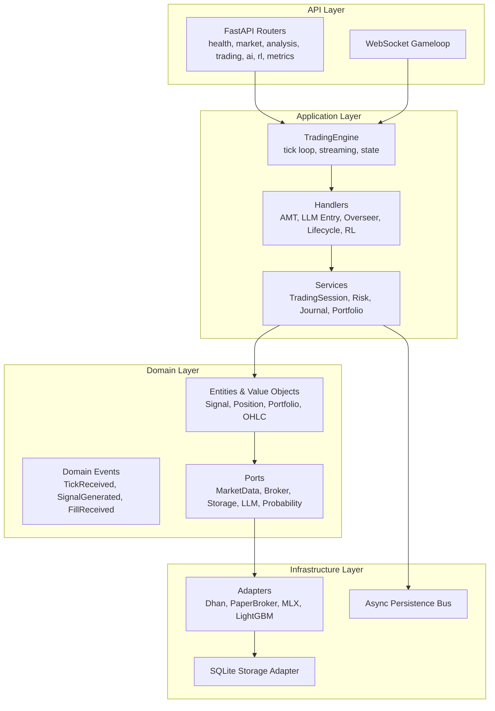

**Diagram sources**
- [architecture.md:12-52](file://backend/docs/architecture.md#L12-L52)
- [ARCHITECTURE_DEEP_DIVE.md:105-114](file://backend/ARCHITECTURE_DEEP_DIVE.md#L105-L114)

**Section sources**
- [architecture.md:10-52](file://backend/docs/architecture.md#L10-L52)
- [ARCHITECTURE_DEEP_DIVE.md:105-114](file://backend/ARCHITECTURE_DEEP_DIVE.md#L105-L114)

## Core Components
- TradingEngine: Standalone tick loop orchestrator that delegates to StreamManager, CandleAggregator, and WatchdogManager. It maintains per-symbol state and notifies WebSocket viewers.
- ServiceGraph: Singleton factory that wires all services and adapters at startup, enabling Dependency Injection and Strategy selection.
- Domain Events: Immutable event dataclasses representing domain activities, intended for decoupled side effects.
- Ports: Abstract interfaces defining contracts between domain and infrastructure layers.
- Adapters: Concrete implementations of ports for market data, broker, inference, and storage.

These components collectively implement DDD boundaries, DI, and event-driven side effects while maintaining separation of concerns.

**Section sources**
- [engine.py:59-126](file://backend/app/application/engine.py#L59-L126)
- [dependencies.py:43-86](file://backend/app/api/dependencies.py#L43-L86)
- [events.py:39-55](file://backend/app/domain/trading/events.py#L39-L55)
- [paper_broker.py:118-176](file://backend/app/infrastructure/adapters/paper_broker.py#L118-L176)

## Architecture Overview
The system adheres to DDD + Hexagonal Architecture + Event-Driven + Pipeline principles. The API layer exposes REST and WebSocket endpoints, while the Application layer coordinates domain logic. Domain models encapsulate business rules, and Infrastructure adapts external systems via Ports and Adapters. A pipeline architecture processes ticks through stages (ingest → candle → analysis → gate → LLM → overseer), with typed channels and bounded queues.

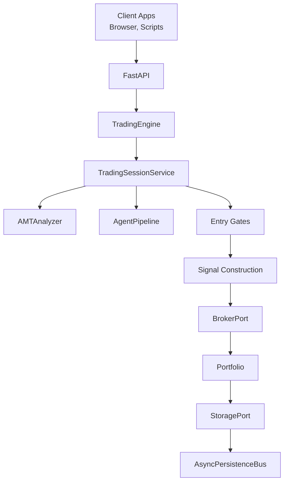

**Diagram sources**
- [architecture.md:54-69](file://backend/docs/architecture.md#L54-L69)
- [ARCHITECTURE_DEEP_DIVE.md:367-440](file://backend/ARCHITECTURE_DEEP_DIVE.md#L367-L440)

**Section sources**
- [architecture.md:62-69](file://backend/docs/architecture.md#L62-L69)
- [ARCHITECTURE_DEEP_DIVE.md:367-440](file://backend/ARCHITECTURE_DEEP_DIVE.md#L367-L440)

## Detailed Component Analysis

### Domain-Driven Design (DDD)
- Entities and Value Objects: Signal, Position, Portfolio, OHLC, OrderBook define the core domain vocabulary and invariants.
- Aggregates: Trade aggregate (source of truth for fills) and Portfolio (query/projection) maintain state consistency.
- Domain Events: Immutable events (TickReceived, SignalGenerated, FillReceived, etc.) capture significant changes for side effects.
- Ports: MarketDataPort, BrokerPort, StoragePort, LLMInferencePort, ProbabilityInferencePort isolate domain from infrastructure.

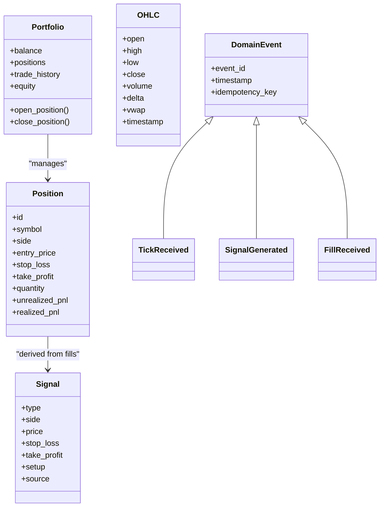

**Diagram sources**
- [ARCHITECTURE_DEEP_DIVE.md:126-214](file://backend/ARCHITECTURE_DEEP_DIVE.md#L126-L214)
- [events.py:39-499](file://backend/app/domain/trading/events.py#L39-L499)

**Section sources**
- [ARCHITECTURE_DEEP_DIVE.md:126-214](file://backend/ARCHITECTURE_DEEP_DIVE.md#L126-L214)
- [events.py:39-499](file://backend/app/domain/trading/events.py#L39-L499)

### Hexagonal Architecture (Ports and Adapters)
- Ports define contracts for market data, broker, storage, inference, and notifications.
- Adapters implement these ports for concrete systems (Dhan, PaperBroker, MLX, LightGBM, SQLite).
- ExchangeStrategy demonstrates Strategy pattern for exchange-specific behavior.

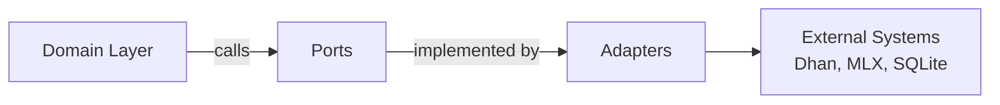

**Diagram sources**
- [ARCHITECTURE_DEEP_DIVE.md:216-232](file://backend/ARCHITECTURE_DEEP_DIVE.md#L216-L232)
- [dependencies.py:89-119](file://backend/app/api/dependencies.py#L89-L119)

**Section sources**
- [ARCHITECTURE_DEEP_DIVE.md:216-232](file://backend/ARCHITECTURE_DEEP_DIVE.md#L216-L232)
- [dependencies.py:89-119](file://backend/app/api/dependencies.py#L89-L119)

### Event-Driven Architecture (EDA)
- Domain events are immutable and include idempotency keys for safe handling.
- AsyncPersistenceBus decouples persistence from the main pipeline.
- Current implementation has minimal subscribers; the master plan proposes removing the facade and using direct calls.

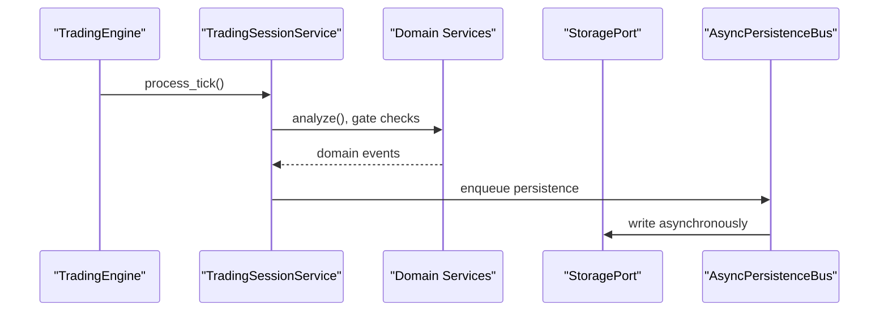

**Diagram sources**
- [events.py:39-499](file://backend/app/domain/trading/events.py#L39-L499)
- [dependencies.py:106-113](file://backend/app/api/dependencies.py#L106-L113)
- [MASTER_ARCHITECTURE_PLAN.md:169-223](file://backend/MASTER_ARCHITECTURE_PLAN.md#L169-L223)

**Section sources**
- [events.py:39-499](file://backend/app/domain/trading/events.py#L39-L499)
- [dependencies.py:106-113](file://backend/app/api/dependencies.py#L106-L113)
- [MASTER_ARCHITECTURE_PLAN.md:169-223](file://backend/MASTER_ARCHITECTURE_PLAN.md#L169-L223)

### Factory Pattern for Service Graph Creation
- ServiceGraph is a singleton factory that constructs and wires all services and adapters at startup.
- It selects exchange strategy and initializes core components, enabling DI and runtime configuration.

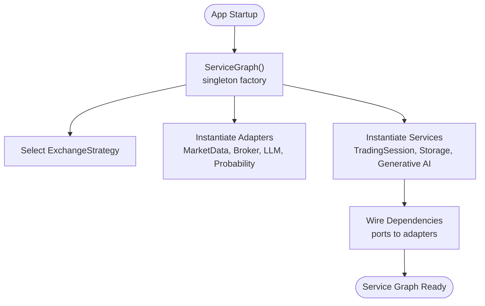

**Diagram sources**
- [dependencies.py:43-86](file://backend/app/api/dependencies.py#L43-L86)
- [dependencies.py:324-327](file://backend/app/api/dependencies.py#L324-L327)

**Section sources**
- [dependencies.py:43-86](file://backend/app/api/dependencies.py#L43-L86)
- [dependencies.py:324-327](file://backend/app/api/dependencies.py#L324-L327)

### Observer Pattern for State Updates
- TradingEngine maintains per-symbol state snapshots and notifies WebSocket viewers via a generation counter and asyncio.Condition.
- Viewers subscribe to state deltas without affecting trading execution.

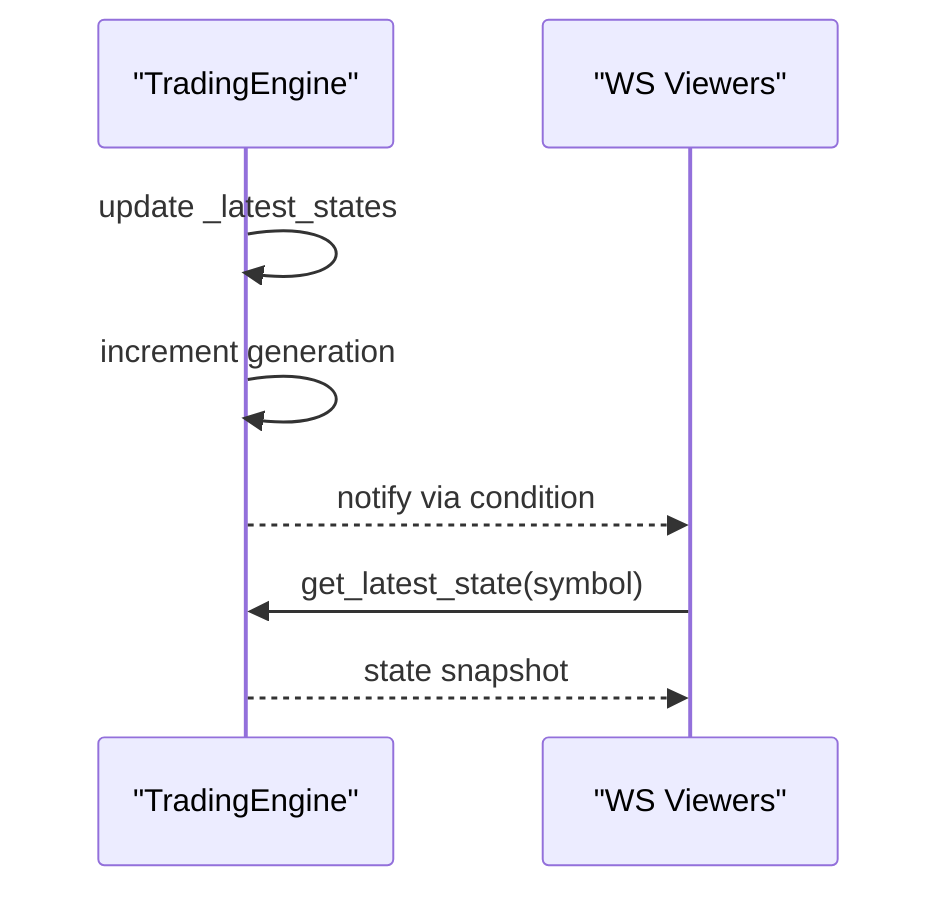

**Diagram sources**
- [engine.py:79-94](file://backend/app/application/engine.py#L79-L94)
- [engine.py:131-177](file://backend/app/application/engine.py#L131-L177)

**Section sources**
- [engine.py:79-94](file://backend/app/application/engine.py#L79-L94)
- [engine.py:131-177](file://backend/app/application/engine.py#L131-L177)

### Strategy Pattern for Interchangeable Components
- ExchangeStrategy encapsulates exchange-specific behavior (NSE vs MCX), selectable at startup.
- This enables pluggable strategies without modifying domain logic.

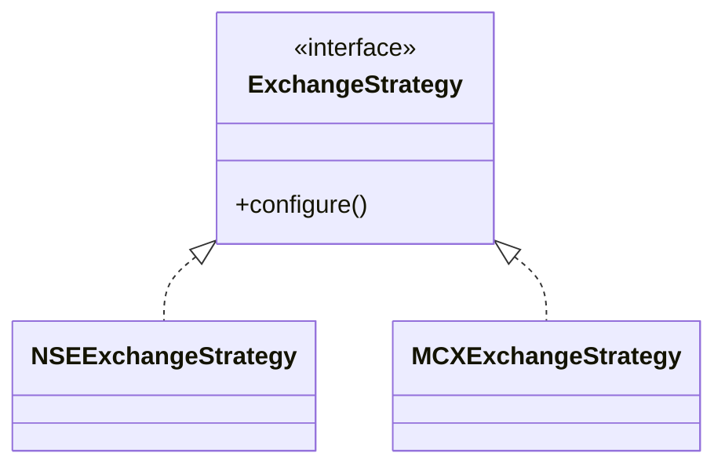

**Diagram sources**
- [dependencies.py:60-73](file://backend/app/api/dependencies.py#L60-L73)

**Section sources**
- [dependencies.py:60-73](file://backend/app/api/dependencies.py#L60-L73)

### Command Pattern for Trade Execution
- Trade execution flows through a structured pipeline: validate → deduplicate → risk → option selection → execute → register → publish → persist.
- The PaperBrokerAdapter executes orders and applies realistic cost modeling.

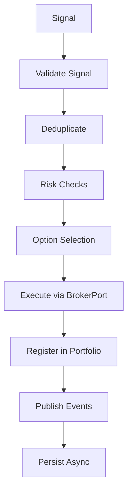

**Diagram sources**
- [MASTER_ARCHITECTURE_PLAN.md:397-407](file://backend/MASTER_ARCHITECTURE_PLAN.md#L397-L407)
- [paper_broker.py:118-176](file://backend/app/infrastructure/adapters/paper_broker.py#L118-L176)

**Section sources**
- [MASTER_ARCHITECTURE_PLAN.md:397-407](file://backend/MASTER_ARCHITECTURE_PLAN.md#L397-L407)
- [paper_broker.py:118-176](file://backend/app/infrastructure/adapters/paper_broker.py#L118-L176)

### Circuit Breaker Pattern
- Per-entity Circuit Breaker monitors failures and temporarily halts processing for a symbol to prevent cascading failures.
- Integrated into TradingEngine’s tick loop.

**Diagram sources**
- [engine.py:95-99](file://backend/app/application/engine.py#L95-L99)

**Section sources**
- [engine.py:95-99](file://backend/app/application/engine.py#L95-L99)

### Dependency Injection Patterns
- ServiceGraph acts as a singleton container for all dependencies.
- FastAPI routes resolve services from the ServiceGraph, ensuring consistent wiring and testability.

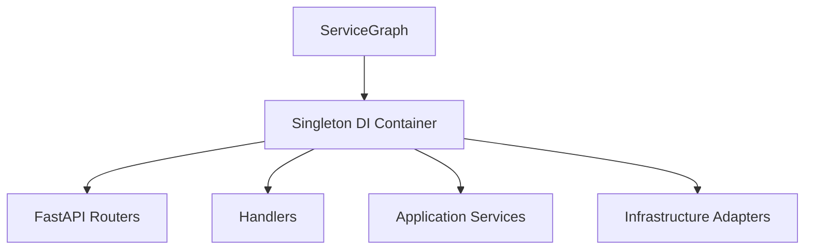

**Diagram sources**
- [dependencies.py:324-327](file://backend/app/api/dependencies.py#L324-L327)
- [main.py:83-127](file://backend/app/main.py#L83-L127)

**Section sources**
- [dependencies.py:324-327](file://backend/app/api/dependencies.py#L324-L327)
- [main.py:83-127](file://backend/app/main.py#L83-L127)

### Clean Architecture Principles
- Layered isolation: Domain has no imports from Application or API; Application orchestrates without domain rules.
- Dependency rule: External dependencies are on the outside; internal modules depend on ports.
- Single Responsibility: Each layer and module has a focused responsibility.

**Section sources**
- [MASTER_ARCHITECTURE_PLAN.md:226-281](file://backend/MASTER_ARCHITECTURE_PLAN.md#L226-L281)

## Dependency Analysis
The system enforces layer boundaries and dependency directionality. Domain depends only on domain abstractions; Application depends on Domain and Ports; Infrastructure depends on Ports. The ServiceGraph centralizes wiring, and configuration is injected rather than accessed directly from domain.

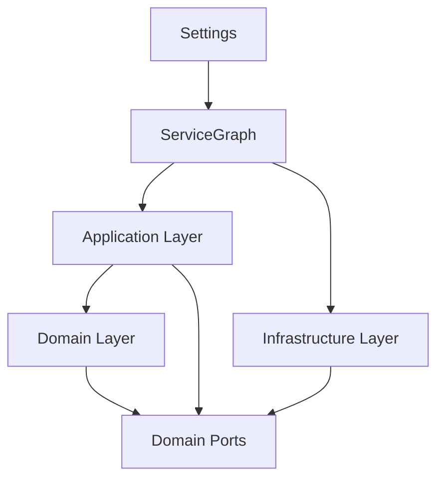

**Diagram sources**
- [MASTER_ARCHITECTURE_PLAN.md:226-281](file://backend/MASTER_ARCHITECTURE_PLAN.md#L226-L281)
- [config.py:26-157](file://backend/app/config.py#L26-L157)
- [dependencies.py:43-86](file://backend/app/api/dependencies.py#L43-L86)

**Section sources**
- [MASTER_ARCHITECTURE_PLAN.md:226-281](file://backend/MASTER_ARCHITECTURE_PLAN.md#L226-L281)
- [config.py:26-157](file://backend/app/config.py#L26-L157)
- [dependencies.py:43-86](file://backend/app/api/dependencies.py#L43-L86)

## Performance Considerations
- Asynchronous persistence decouples heavy writes from the main pipeline.
- Per-symbol throttling and circuit breakers reduce overhead and protect the system.
- Lightweight event bus and deterministic processing minimize latency.
- Recommendations:
  - Maintain strict layer boundaries to avoid accidental blocking.
  - Prefer bounded concurrency and controlled fan-out in adapters.
  - Continuously monitor latency and throughput; adjust throttling and batch sizes.

[No sources needed since this section provides general guidance]

## Troubleshooting Guide
- Dead Event Bus: The current implementation has zero subscribers; the master plan recommends removing facade calls and using direct method calls.
- Layer Inversions: Ensure domain code does not import from application or API; use constructor injection for configuration.
- Position State Divergence: Unify position state under a single source of truth to eliminate reconciliation logic.
- Silent Exceptions: Replace broad exception handlers with specific error types or propagate critical errors to orchestrators.

**Section sources**
- [MASTER_ARCHITECTURE_PLAN.md:169-223](file://backend/MASTER_ARCHITECTURE_PLAN.md#L169-L223)
- [MASTER_ARCHITECTURE_PLAN.md:226-281](file://backend/MASTER_ARCHITECTURE_PLAN.md#L226-L281)
- [MASTER_ARCHITECTURE_PLAN.md:284-354](file://backend/MASTER_ARCHITECTURE_PLAN.md#L284-L354)

## Conclusion
The system demonstrates robust architectural patterns that enhance modularity, testability, and maintainability. DDD and Hexagonal Architecture separate business logic from infrastructure, while Event-Driven patterns enable decoupled side effects. The Factory and DI patterns streamline service composition, and the Strategy pattern supports exchange flexibility. The master plan outlines targeted improvements to address layer inversions, unify position state, and remove dead code, further strengthening the architecture.

[No sources needed since this section summarizes without analyzing specific files]