# Design Patterns and Principles

<cite>
**Referenced Files in This Document**
- [architecture.md](file://backend/docs/architecture.md)
- [ARCHITECTURE_DEEP_DIVE.md](file://backend/ARCHITECTURE_DEEP_DIVE.md)
- [MASTER_ARCHITECTURE_PLAN.md](file://backend/MASTER_ARCHITECTURE_PLAN.md)
- [main.py](file://backend/app/main.py)
- [dependencies.py](file://backend/app/api/dependencies.py)
- [config.py](file://backend/app/config.py)
- [engine.py](file://backend/app/application/engine.py)
- [events.py](file://backend/app/domain/trading/events.py)
- [paper_broker.py](file://backend/app/infrastructure/adapters/paper_broker.py)
- [composition_root.py](file://backend/app/application/di/composition_root.py)
- [container.py](file://backend/app/application/di/container.py)
- [service_graph_v2.py](file://backend/app/application/service_graph_v2.py)
</cite>

## Update Summary
**Changes Made**
- Updated Dependency Injection Patterns section to reflect the new DIContainer and CompositionRoot framework
- Added comprehensive documentation for the new dependency injection architecture
- Updated Factory Pattern section to show the transition from ServiceGraph singleton to DIContainer
- Revised Dependency Injection Patterns section to cover the modern DI approach
- Added new section on DIContainer Implementation Details
- Updated architectural diagrams to reflect the new DI framework

## Table of Contents
1. [Introduction](#introduction)
2. [Project Structure](#project-structure)
3. [Core Components](#core-components)
4. [Architecture Overview](#architecture-overview)
5. [Detailed Component Analysis](#detailed-component-analysis)
6. [Dependency Analysis](#dependency-analysis)
7. [Performance Considerations](#performance-considerations)
8. [Troubleshooting Guide](#troubleshooting-guide)
9. [Conclusion](#conclusion)

## Introduction
This document explains the design patterns and architectural principles implemented across the system. The backend follows a hybrid architecture combining Domain-Driven Design (DDD), Hexagonal Architecture (Ports and Adapters), Event-Driven patterns, and a NiFi-style pipeline. It also demonstrates several creational, behavioral, and structural patterns that improve modularity, testability, and maintainability. The focus areas include:
- DDD with bounded contexts and domain models
- Hexagonal Architecture with clear ports and pluggable adapters
- Event-Driven Architecture (EDA) with domain events and asynchronous persistence
- Factory pattern for service graph creation
- Observer pattern for state updates and WebSocket viewers
- Strategy pattern for interchangeable components
- Command pattern for trade execution
- Circuit Breaker pattern for resilience
- **Updated** Comprehensive Dependency Injection via DIContainer and CompositionRoot patterns
- Clean Architecture layering

## Project Structure
The system is organized into layered modules aligned with Clean Architecture:
- API Layer: FastAPI routers and WebSocket endpoints
- Application Layer: Orchestration, handlers, services, and engines
- Domain Layer: Entities, value objects, aggregates, and domain services
- Infrastructure Layer: Adapters, storage, and external integrations
- Shared Layer: Common utilities and resilience primitives
- **Updated** DI Layer: DIContainer and CompositionRoot for dependency management

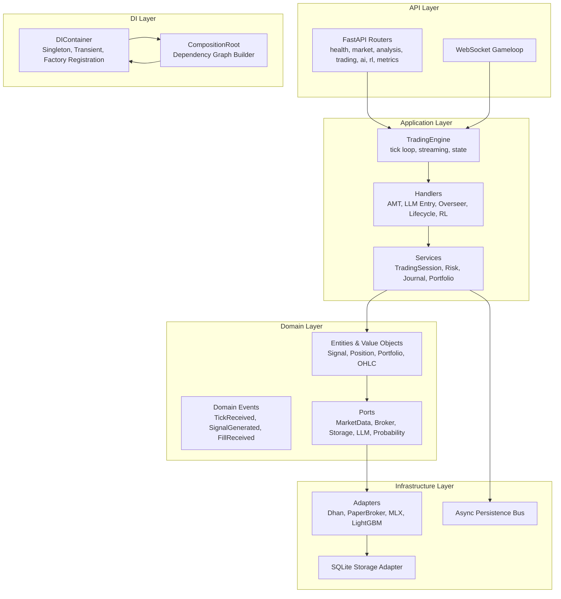

**Diagram sources**
- [architecture.md:12-52](file://backend/docs/architecture.md#L12-L52)
- [ARCHITECTURE_DEEP_DIVE.md:105-114](file://backend/ARCHITECTURE_DEEP_DIVE.md#L105-L114)
- [composition_root.py:1-245](file://backend/app/application/di/composition_root.py#L1-L245)
- [container.py:1-158](file://backend/app/application/di/container.py#L1-L158)

**Section sources**
- [architecture.md:10-52](file://backend/docs/architecture.md#L10-L52)
- [ARCHITECTURE_DEEP_DIVE.md:105-114](file://backend/ARCHITECTURE_DEEP_DIVE.md#L105-L114)

## Core Components
- TradingEngine: Standalone tick loop orchestrator that delegates to StreamManager, CandleAggregator, and WatchdogManager. It maintains per-symbol state and notifies WebSocket viewers.
- **Updated** ServiceGraph V2: Modern dependency injection system using DIContainer and CompositionRoot patterns, replacing the legacy singleton approach.
- **Updated** DIContainer: Lightweight dependency injection container with factory registration, circular dependency detection, and singleton/transient scopes.
- **Updated** CompositionRoot: Central dependency graph builder that registers all adapters and services with the DIContainer.
- Domain Events: Immutable event dataclasses representing domain activities, intended for decoupled side effects.
- Ports: Abstract interfaces defining contracts between domain and infrastructure layers.
- Adapters: Concrete implementations of ports for market data, broker, inference, and storage.

These components collectively implement DDD boundaries, modern DI patterns, and event-driven side effects while maintaining separation of concerns.

**Section sources**
- [engine.py:59-126](file://backend/app/application/engine.py#L59-L126)
- [dependencies.py:43-86](file://backend/app/api/dependencies.py#L43-L86)
- [events.py:39-55](file://backend/app/domain/trading/events.py#L39-L55)
- [paper_broker.py:118-176](file://backend/app/infrastructure/adapters/paper_broker.py#L118-L176)
- [service_graph_v2.py:35-97](file://backend/app/application/service_graph_v2.py#L35-L97)
- [container.py:33-158](file://backend/app/application/di/container.py#L33-L158)
- [composition_root.py:25-80](file://backend/app/application/di/composition_root.py#L25-L80)

## Architecture Overview
The system adheres to DDD + Hexagonal Architecture + Event-Driven + Pipeline principles. The API layer exposes REST and WebSocket endpoints, while the Application layer coordinates domain logic. Domain models encapsulate business rules, and Infrastructure adapts external systems via Ports and Adapters. A pipeline architecture processes ticks through stages (ingest → candle → analysis → gate → LLM → overseer), with typed channels and bounded queues.

**Updated** The modern dependency injection system uses CompositionRoot to build the complete dependency graph and DIContainer for lazy, thread-safe resolution of dependencies.

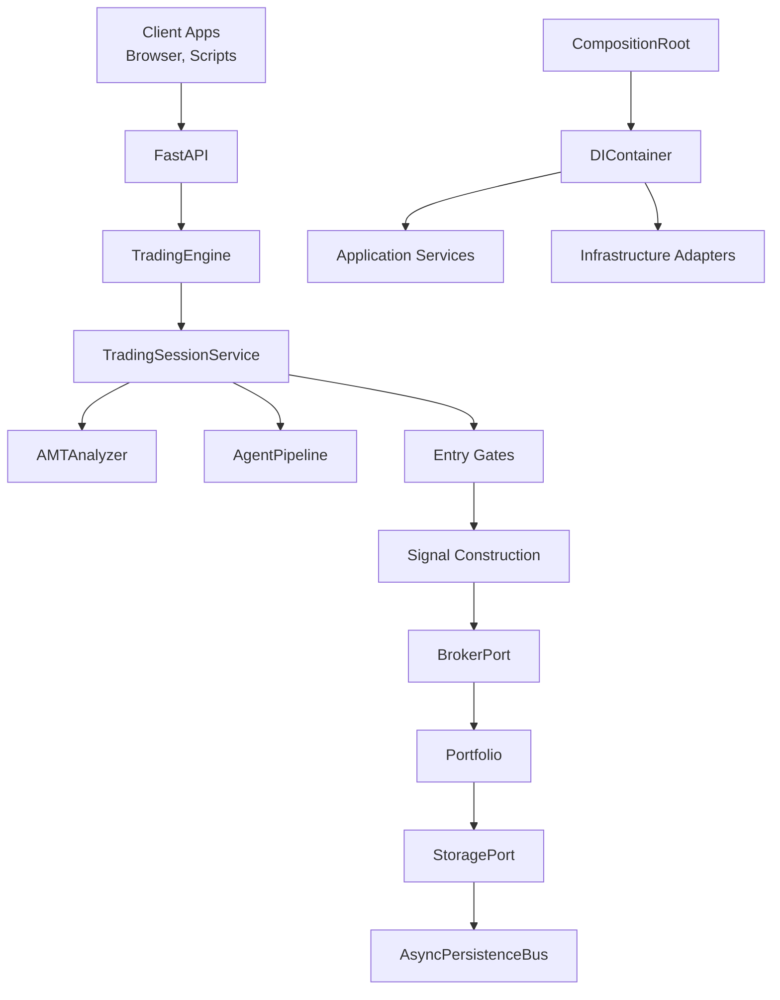

**Diagram sources**
- [architecture.md:54-69](file://backend/docs/architecture.md#L54-L69)
- [ARCHITECTURE_DEEP_DIVE.md:367-440](file://backend/ARCHITECTURE_DEEP_DIVE.md#L367-L440)
- [composition_root.py:25-80](file://backend/app/application/di/composition_root.py#L25-L80)
- [container.py:68-108](file://backend/app/application/di/container.py#L68-L108)

**Section sources**
- [architecture.md:62-69](file://backend/docs/architecture.md#L62-L69)
- [ARCHITECTURE_DEEP_DIVE.md:367-440](file://backend/ARCHITECTURE_DEEP_DIVE.md#L367-L440)

## Detailed Component Analysis

### Domain-Driven Design (DDD)
- Entities and Value Objects: Signal, Position, Portfolio, OHLC, OrderBook define the core domain vocabulary and invariants.
- Aggregates: Trade aggregate (source of truth for fills) and Portfolio (query/projection) maintain state consistency.
- Domain Events: Immutable events (TickReceived, SignalGenerated, FillReceived, etc.) capture significant changes for side effects.
- Ports: MarketDataPort, BrokerPort, StoragePort, LLMInferencePort, ProbabilityInferencePort isolate domain from infrastructure.

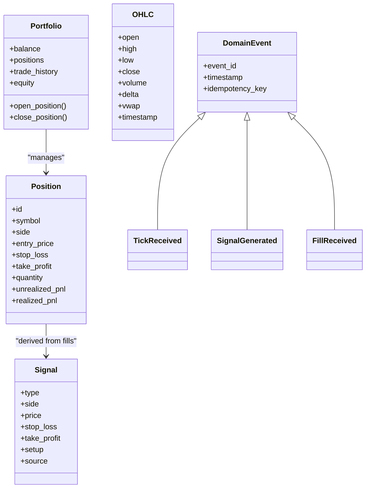

**Diagram sources**
- [ARCHITECTURE_DEEP_DIVE.md:126-214](file://backend/ARCHITECTURE_DEEP_DIVE.md#L126-L214)
- [events.py:39-499](file://backend/app/domain/trading/events.py#L39-L499)

**Section sources**
- [ARCHITECTURE_DEEP_DIVE.md:126-214](file://backend/ARCHITECTURE_DEEP_DIVE.md#L126-L214)
- [events.py:39-499](file://backend/app/domain/trading/events.py#L39-L499)

### Hexagonal Architecture (Ports and Adapters)
- Ports define contracts for market data, broker, storage, inference, and notifications.
- Adapters implement these ports for concrete systems (Dhan, PaperBroker, MLX, LightGBM, SQLite).
- ExchangeStrategy demonstrates Strategy pattern for exchange-specific behavior.

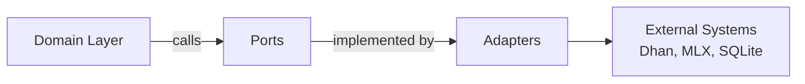

**Diagram sources**
- [ARCHITECTURE_DEEP_DIVE.md:216-232](file://backend/ARCHITECTURE_DEEP_DIVE.md#L216-L232)
- [dependencies.py:89-119](file://backend/app/api/dependencies.py#L89-L119)

**Section sources**
- [ARCHITECTURE_DEEP_DIVE.md:216-232](file://backend/ARCHITECTURE_DEEP_DIVE.md#L216-L232)
- [dependencies.py:89-119](file://backend/app/api/dependencies.py#L89-L119)

### Event-Driven Architecture (EDA)
- Domain events are immutable and include idempotency keys for safe handling.
- AsyncPersistenceBus decouples persistence from the main pipeline.
- Current implementation has minimal subscribers; the master plan proposes removing the facade and using direct calls.

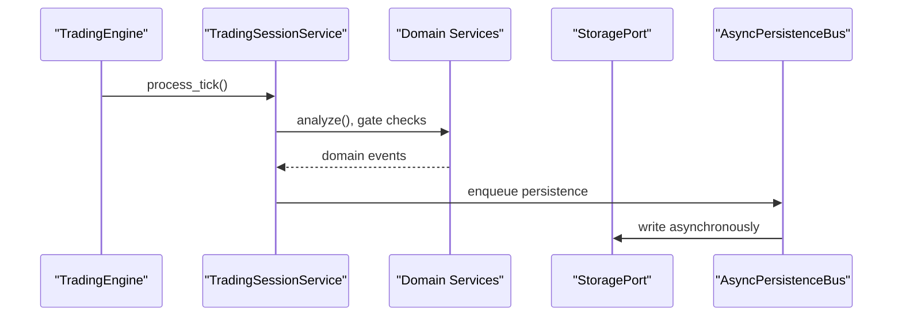

**Diagram sources**
- [events.py:39-499](file://backend/app/domain/trading/events.py#L39-L499)
- [dependencies.py:106-113](file://backend/app/api/dependencies.py#L106-L113)
- [MASTER_ARCHITECTURE_PLAN.md:169-223](file://backend/MASTER_ARCHITECTURE_PLAN.md#L169-L223)

**Section sources**
- [events.py:39-499](file://backend/app/domain/trading/events.py#L39-L499)
- [dependencies.py:106-113](file://backend/app/api/dependencies.py#L106-L113)
- [MASTER_ARCHITECTURE_PLAN.md:169-223](file://backend/MASTER_ARCHITECTURE_PLAN.md#L169-L223)

### Factory Pattern for Service Graph Creation
**Updated** The system now uses a modern DIContainer-based factory pattern through CompositionRoot and DIContainer:

- **CompositionRoot**: Central dependency graph builder that registers all adapters and services with the DIContainer.
- **DIContainer**: Lightweight container with factory registration, circular dependency detection, and singleton/transient scopes.
- **Factory Functions**: Typed factory functions create concrete implementations with dependency injection.
- **Lazy Resolution**: Instances are created on first access with thread-safe singleton caching.

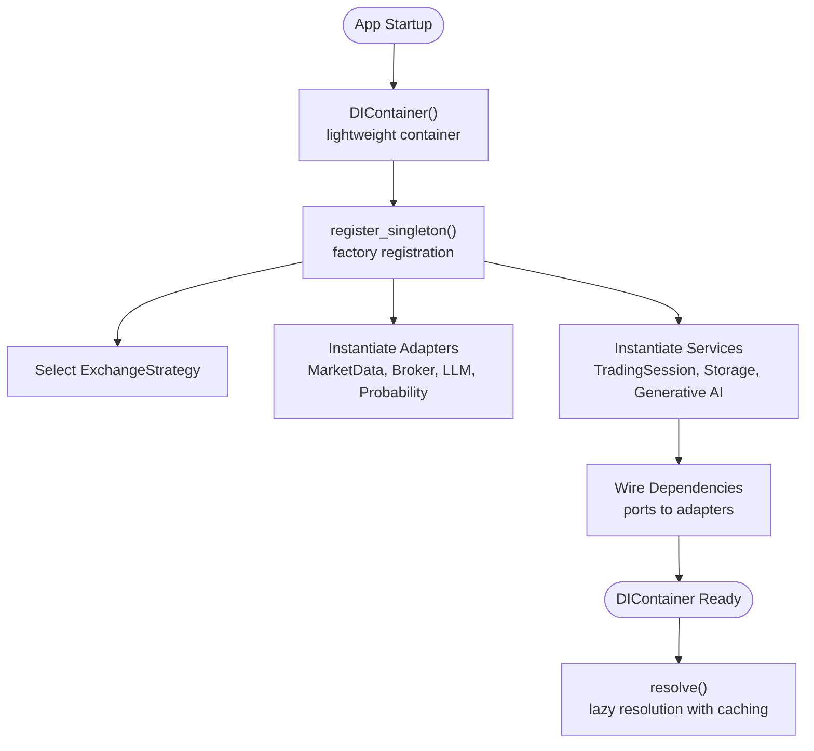

**Diagram sources**
- [composition_root.py:25-80](file://backend/app/application/di/composition_root.py#L25-L80)
- [container.py:56-108](file://backend/app/application/di/container.py#L56-L108)
- [service_graph_v2.py:48-76](file://backend/app/application/service_graph_v2.py#L48-L76)

**Section sources**
- [composition_root.py:25-80](file://backend/app/application/di/composition_root.py#L25-L80)
- [container.py:56-108](file://backend/app/application/di/container.py#L56-L108)
- [service_graph_v2.py:48-76](file://backend/app/application/service_graph_v2.py#L48-L76)

### Observer Pattern for State Updates
- TradingEngine maintains per-symbol state snapshots and notifies WebSocket viewers via a generation counter and asyncio.Condition.
- Viewers subscribe to state deltas without affecting trading execution.

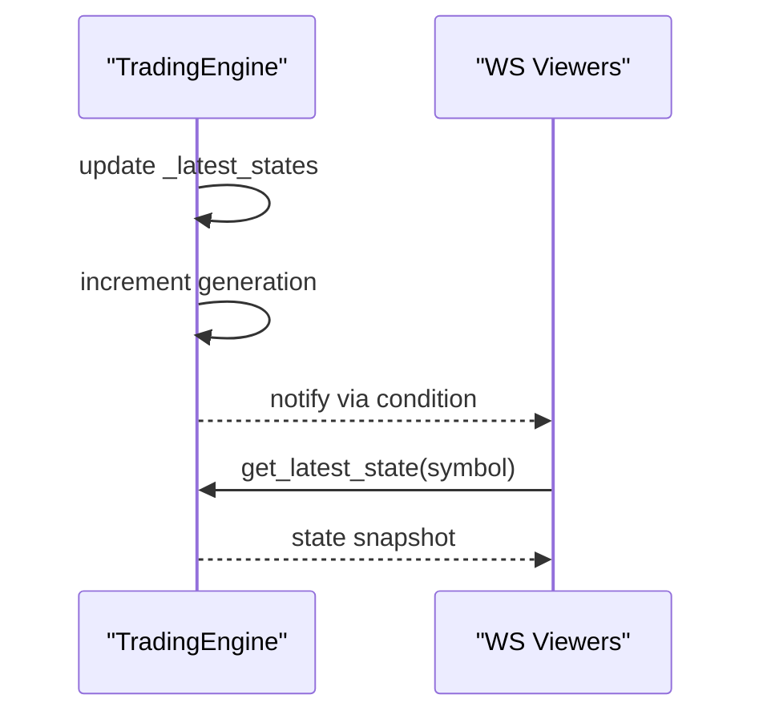

**Diagram sources**
- [engine.py:79-94](file://backend/app/application/engine.py#L79-L94)
- [engine.py:131-177](file://backend/app/application/engine.py#L131-L177)

**Section sources**
- [engine.py:79-94](file://backend/app/application/engine.py#L79-L94)
- [engine.py:131-177](file://backend/app/application/engine.py#L131-L177)

### Strategy Pattern for Interchangeable Components
- ExchangeStrategy encapsulates exchange-specific behavior (NSE vs MCX), selectable at startup.
- This enables pluggable strategies without modifying domain logic.

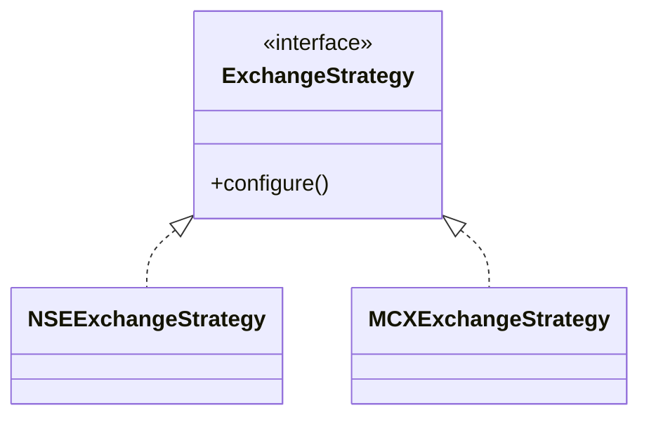

**Diagram sources**
- [dependencies.py:60-73](file://backend/app/api/dependencies.py#L60-L73)

**Section sources**
- [dependencies.py:60-73](file://backend/app/api/dependencies.py#L60-L73)

### Command Pattern for Trade Execution
- Trade execution flows through a structured pipeline: validate → deduplicate → risk → option selection → execute → register → publish → persist.
- The PaperBrokerAdapter executes orders and applies realistic cost modeling.

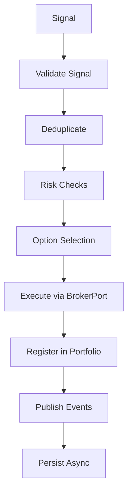

**Diagram sources**
- [MASTER_ARCHITECTURE_PLAN.md:397-407](file://backend/MASTER_ARCHITECTURE_PLAN.md#L397-L407)
- [paper_broker.py:118-176](file://backend/app/infrastructure/adapters/paper_broker.py#L118-L176)

**Section sources**
- [MASTER_ARCHITECTURE_PLAN.md:397-407](file://backend/MASTER_ARCHITECTURE_PLAN.md#L397-L407)
- [paper_broker.py:118-176](file://backend/app/infrastructure/adapters/paper_broker.py#L118-L176)

### Circuit Breaker Pattern
- Per-entity Circuit Breaker monitors failures and temporarily halts processing for a symbol to prevent cascading failures.
- Integrated into TradingEngine's tick loop.

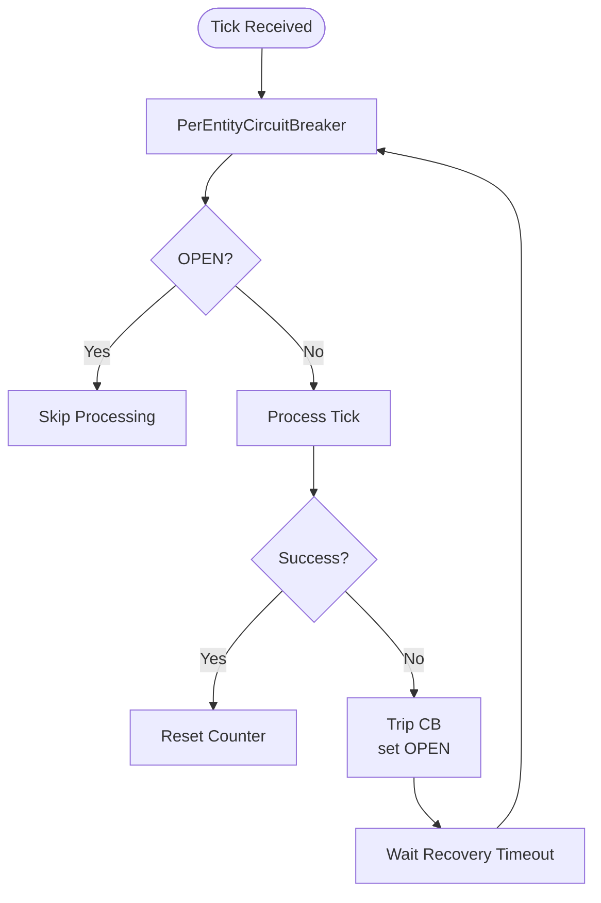

**Diagram sources**
- [engine.py:95-99](file://backend/app/application/engine.py#L95-L99)

**Section sources**
- [engine.py:95-99](file://backend/app/application/engine.py#L95-L99)

### Dependency Injection Patterns
**Updated** The system now uses a comprehensive dependency injection framework with DIContainer and CompositionRoot patterns:

- **DIContainer**: Thread-safe, lightweight container with factory registration, singleton caching, and circular dependency detection.
- **CompositionRoot**: Central dependency graph builder that registers all adapters and services with the DIContainer.
- **Factory Registration**: OCP-compliant factory registration instead of hardcoded type checks.
- **Lazy Resolution**: Instances created on first resolve() with thread-safe singleton caching.
- **Transient Scope Support**: Optional per-request or per-tick scope isolation.
- **Backward Compatibility**: ServiceGraph V2 provides drop-in replacement for legacy ServiceGraph.

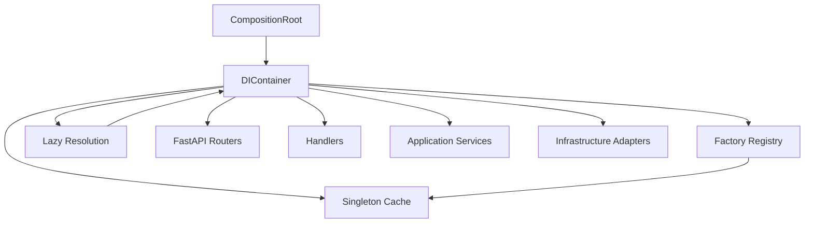

**Diagram sources**
- [composition_root.py:25-80](file://backend/app/application/di/composition_root.py#L25-L80)
- [container.py:33-158](file://backend/app/application/di/container.py#L33-L158)
- [service_graph_v2.py:48-76](file://backend/app/application/service_graph_v2.py#L48-L76)

**Section sources**
- [composition_root.py:25-80](file://backend/app/application/di/composition_root.py#L25-L80)
- [container.py:33-158](file://backend/app/application/di/container.py#L33-L158)
- [service_graph_v2.py:48-76](file://backend/app/application/service_graph_v2.py#L48-L76)

### DIContainer Implementation Details
**New** The DIContainer provides advanced dependency injection capabilities:

- **Thread Safety**: Uses RLock for concurrent resolution and thread-safe singleton caching.
- **Factory Registration**: Supports both singleton and transient registrations.
- **Circular Dependency Detection**: Detects and reports circular dependencies at resolution time.
- **Transient Scope Management**: Provides context managers for per-request or per-tick scopes.
- **Error Handling**: Clear exceptions for missing dependencies and circular dependencies.
- **Testing Support**: Reset method for clearing singleton caches during tests.

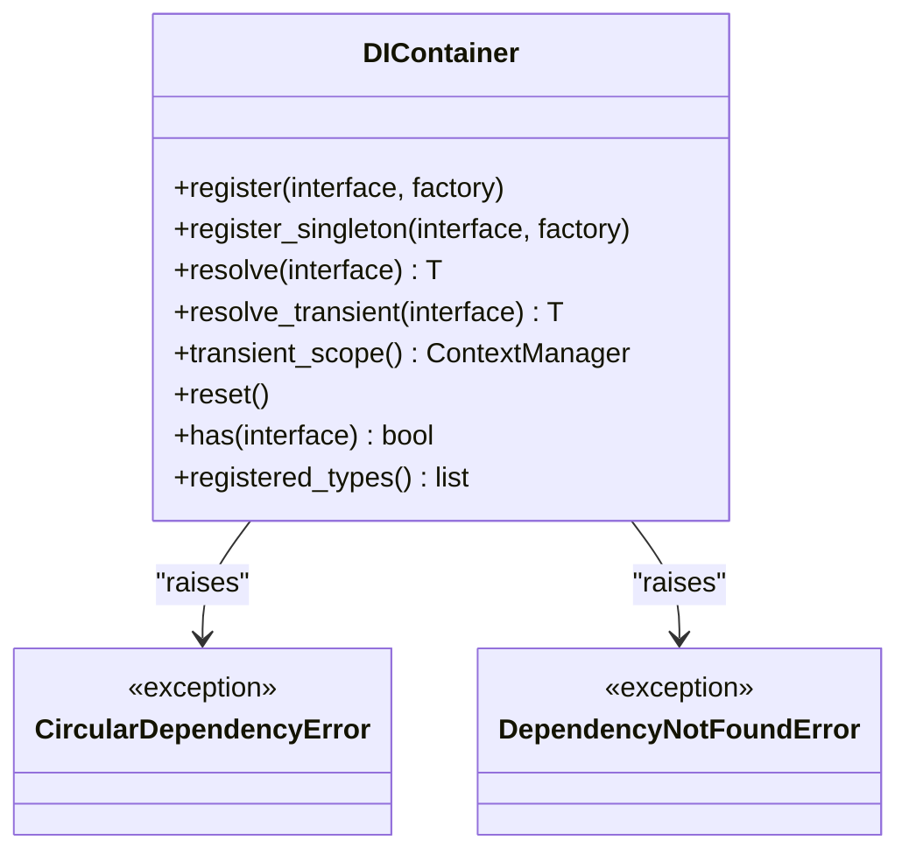

**Diagram sources**
- [container.py:33-158](file://backend/app/application/di/container.py#L33-L158)

**Section sources**
- [container.py:33-158](file://backend/app/application/di/container.py#L33-L158)

### Clean Architecture Principles
- Layered isolation: Domain has no imports from Application or API; Application orchestrates without domain rules.
- Dependency rule: External dependencies are on the outside; internal modules depend on ports.
- Single Responsibility: Each layer and module has a focused responsibility.
- **Updated** DI Layer: Dedicated dependency injection layer with CompositionRoot and DIContainer for managing cross-cutting concerns.

**Section sources**
- [MASTER_ARCHITECTURE_PLAN.md:226-281](file://backend/MASTER_ARCHITECTURE_PLAN.md#L226-L281)

## Dependency Analysis
**Updated** The system now enforces layer boundaries with a modern DI framework:

- Domain depends only on domain abstractions; Application depends on Domain and Ports; Infrastructure depends on Ports.
- **Updated** DIContainer centralizes wiring with CompositionRoot building the dependency graph.
- **Updated** Configuration is injected rather than accessed directly from domain.
- **Updated** ServiceGraph V2 provides backward compatibility while using the new DI framework internally.

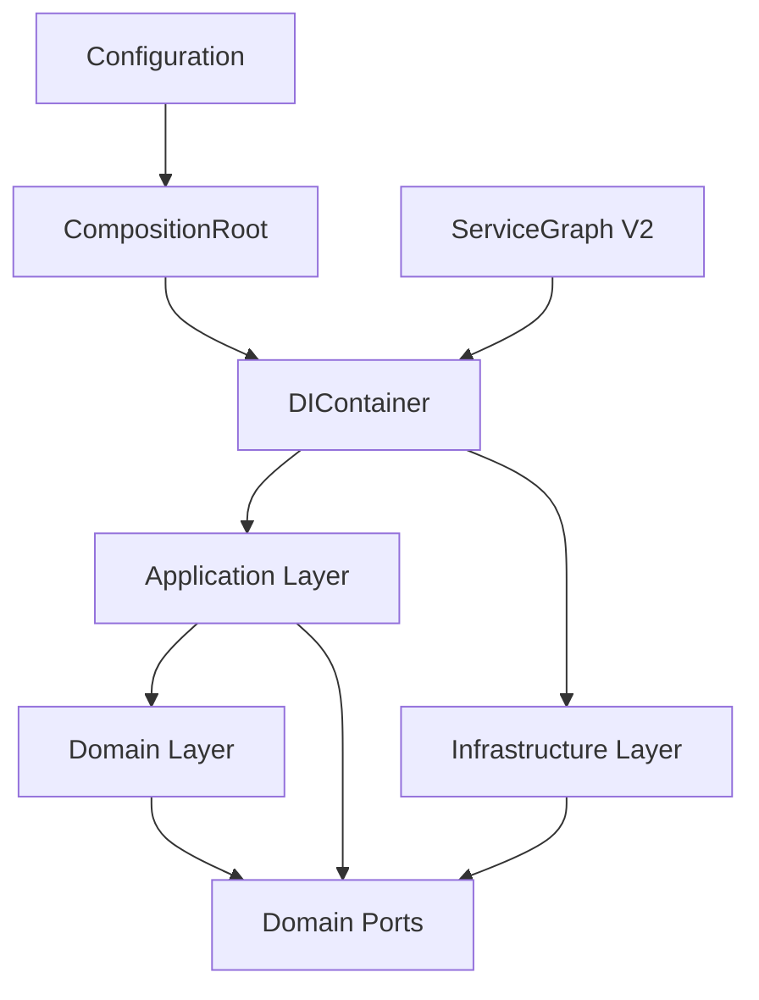

**Diagram sources**
- [MASTER_ARCHITECTURE_PLAN.md:226-281](file://backend/MASTER_ARCHITECTURE_PLAN.md#L226-L281)
- [config.py:26-157](file://backend/app/config.py#L26-L157)
- [composition_root.py:25-80](file://backend/app/application/di/composition_root.py#L25-L80)
- [service_graph_v2.py:48-76](file://backend/app/application/service_graph_v2.py#L48-L76)

**Section sources**
- [MASTER_ARCHITECTURE_PLAN.md:226-281](file://backend/MASTER_ARCHITECTURE_PLAN.md#L226-L281)
- [config.py:26-157](file://backend/app/config.py#L26-L157)
- [composition_root.py:25-80](file://backend/app/application/di/composition_root.py#L25-L80)
- [service_graph_v2.py:48-76](file://backend/app/application/service_graph_v2.py#L48-L76)

## Performance Considerations
- Asynchronous persistence decouples heavy writes from the main pipeline.
- Per-symbol throttling and circuit breakers reduce overhead and protect the system.
- Lightweight event bus and deterministic processing minimize latency.
- **Updated** DIContainer provides lazy resolution with thread-safe singleton caching for optimal performance.
- **Updated** CompositionRoot builds dependency graphs once at startup, avoiding repeated factory creation.
- Recommendations:
  - Maintain strict layer boundaries to avoid accidental blocking.
  - Prefer bounded concurrency and controlled fan-out in adapters.
  - Continuously monitor latency and throughput; adjust throttling and batch sizes.
  - **Updated** Use DIContainer's transient scope for request-scoped objects to minimize memory usage.

## Troubleshooting Guide
- Dead Event Bus: The current implementation has zero subscribers; the master plan recommends removing facade calls and using direct method calls.
- Layer Inversions: Ensure domain code does not import from application or API; use constructor injection for configuration.
- Position State Divergence: Unify position state under a single source of truth to eliminate reconciliation logic.
- Silent Exceptions: Replace broad exception handlers with specific error types or propagate critical errors to orchestrators.
- **Updated** DI Issues: Use DIContainer.has() to check if dependencies are registered, and DIContainer.registered_types() to debug the dependency graph.
- **Updated** Circular Dependencies: DIContainer automatically detects circular dependencies during resolution; check the dependency chain reported in the error message.
- **Updated** Missing Dependencies: Use DependencyNotFoundError to identify unregistered factories in the DIContainer.

**Section sources**
- [MASTER_ARCHITECTURE_PLAN.md:169-223](file://backend/MASTER_ARCHITECTURE_PLAN.md#L169-L223)
- [MASTER_ARCHITECTURE_PLAN.md:226-281](file://backend/MASTER_ARCHITECTURE_PLAN.md#L226-L281)
- [MASTER_ARCHITECTURE_PLAN.md:284-354](file://backend/MASTER_ARCHITECTURE_PLAN.md#L284-L354)
- [container.py:25-31](file://backend/app/application/di/container.py#L25-L31)
- [container.py:94-97](file://backend/app/application/di/container.py#L94-L97)

## Conclusion
The system demonstrates robust architectural patterns that enhance modularity, testability, and maintainability. DDD and Hexagonal Architecture separate business logic from infrastructure, while Event-Driven patterns enable decoupled side effects. The modern DI framework with DIContainer and CompositionRoot patterns provides superior dependency management compared to the previous singleton approach. The Strategy pattern supports exchange flexibility, and the master plan outlines targeted improvements to address layer inversions, unify position state, and remove dead code, further strengthening the architecture.

**Updated** The transition to the new DI framework represents a significant architectural improvement, providing better testability, maintainability, and extensibility while maintaining backward compatibility through ServiceGraph V2.