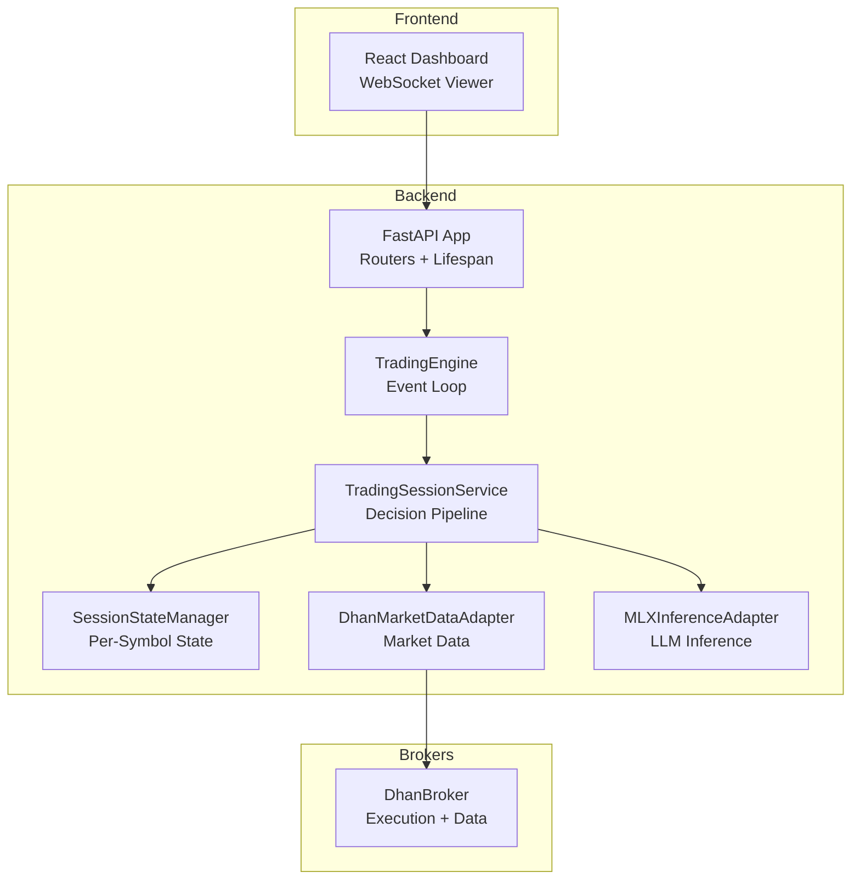
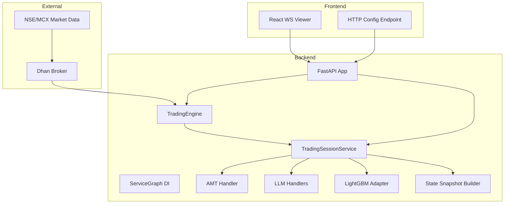
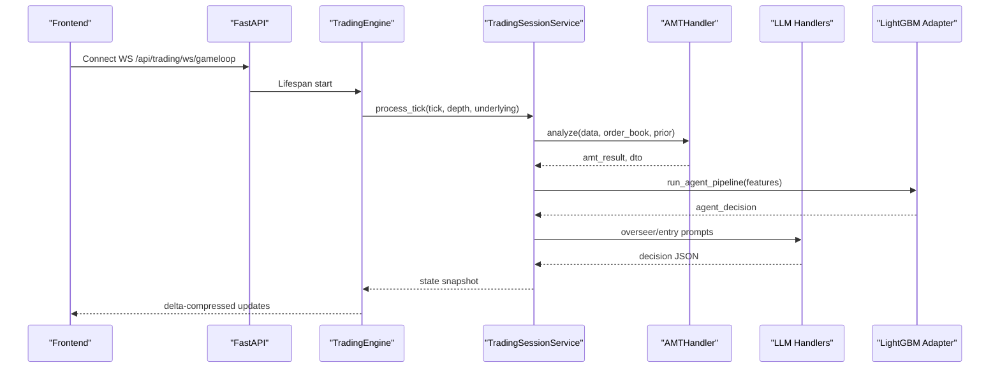
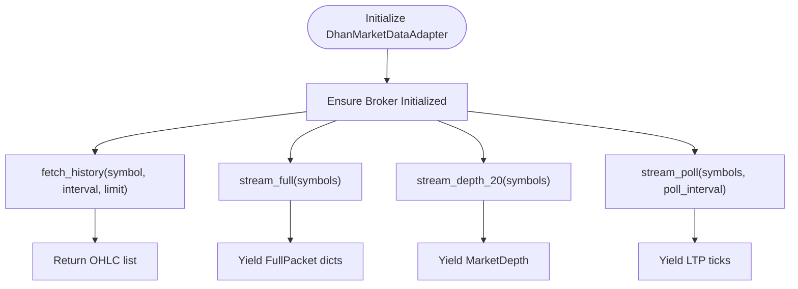
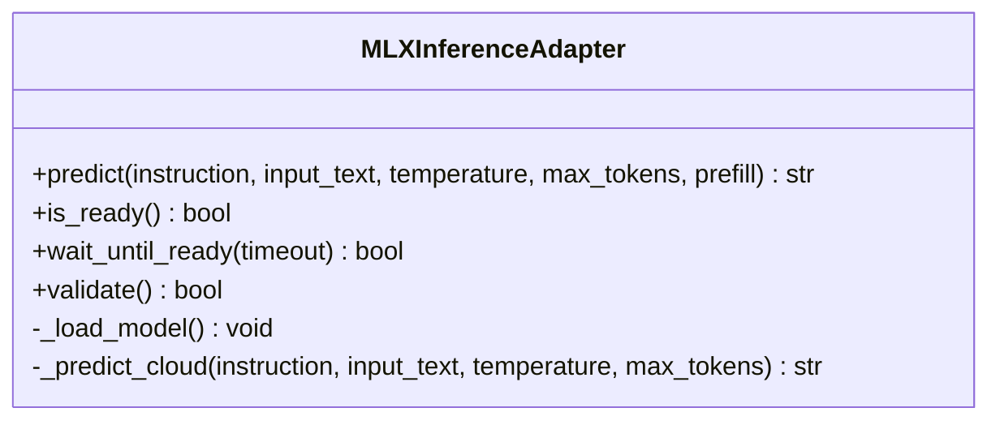
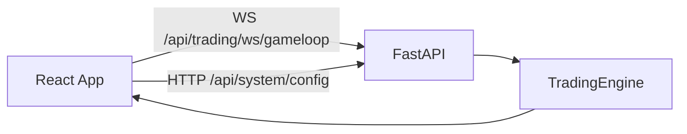
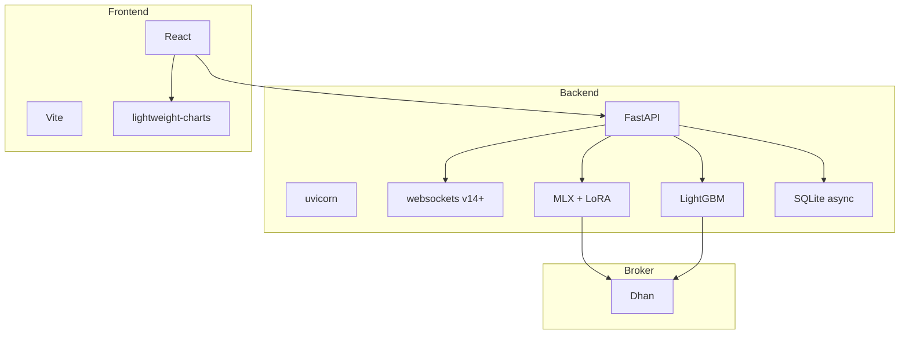

# System Overview

<cite>
**Referenced Files in This Document**
- [ARCHITECTURE.md](file://ARCHITECTURE.md)
- [backend/app/main.py](file://backend/app/main.py)
- [backend/app/config.py](file://backend/app/config.py)
- [backend/app/application/engine.py](file://backend/app/application/engine.py)
- [backend/app/application/services/trading_session.py](file://backend/app/application/services/trading_session.py)
- [backend/app/application/services/session_state_manager.py](file://backend/app/application/services/session_state_manager.py)
- [backend/app/infrastructure/adapters/dhan_adapter.py](file://backend/app/infrastructure/adapters/dhan_adapter.py)
- [backend/app/infrastructure/adapters/mlx_inference_adapter.py](file://backend/app/infrastructure/adapters/mlx_inference_adapter.py)
- [frontend/package.json](file://frontend/package.json)
- [backend/requirements.txt](file://backend/requirements.txt)
</cite>

## Table of Contents
1. [Introduction](#introduction)
2. [Project Structure](#project-structure)
3. [Core Components](#core-components)
4. [Architecture Overview](#architecture-overview)
5. [Detailed Component Analysis](#detailed-component-analysis)
6. [Dependency Analysis](#dependency-analysis)
7. [Performance Considerations](#performance-considerations)
8. [Troubleshooting Guide](#troubleshooting-guide)
9. [Conclusion](#conclusion)

## Introduction
GlassyTrade AI v5 is a production-grade, event-driven algorithmic options trading system designed for Indian derivatives markets. It operates live on NSE NIFTY/BANKNIFTY/FINNIFTY options and MCX commodity options, combining Fabio Valentini’s Auction Market Theory (AMT) methodology with LLM-powered trade decisions, first-passage probability models, and reinforcement learning. The system emphasizes low-latency, real-time execution, multi-timeframe analysis, and robust production readiness.

Key capabilities:
- Real-time market data ingestion and event-driven processing
- AMT-based orderflow analysis with dual-feed support (options and underlying futures)
- LLM inference for entry/exit oversight and pre-candle advisory
- First-passage probability modeling for directional bias and sizing
- Reinforcement learning integration for dynamic position sizing and gating
- Dhan broker integration for seamless order execution and market data
- Frontend dashboard for monitoring and observability

## Project Structure
The system is organized into layered components:
- Backend: FastAPI application with event-driven trading engine, handlers, services, and adapters
- Brokers Library: Pluggable adapters for Dhan and paper trading
- Frontend: React-based dashboard for live monitoring and lightweight controls
- Infrastructure: ML adapters (MLX, LightGBM), persistence, and WebSocket pipelines

**Diagram sources**
- [backend/app/main.py:83-127](file://backend/app/main.py#L83-L127)
- [backend/app/application/engine.py:127-177](file://backend/app/application/engine.py#L127-L177)
- [backend/app/application/services/trading_session.py:85-121](file://backend/app/application/services/trading_session.py#L85-L121)
- [backend/app/application/services/session_state_manager.py:100-120](file://backend/app/application/services/session_state_manager.py#L100-L120)
- [backend/app/infrastructure/adapters/dhan_adapter.py:66-100](file://backend/app/infrastructure/adapters/dhan_adapter.py#L66-L100)
- [backend/app/infrastructure/adapters/mlx_inference_adapter.py:12-36](file://backend/app/infrastructure/adapters/mlx_inference_adapter.py#L12-L36)

**Section sources**
- [ARCHITECTURE.md:18-38](file://ARCHITECTURE.md#L18-L38)
- [backend/app/main.py:171-176](file://backend/app/main.py#L171-L176)

## Core Components
- TradingEngine: Independent event loop that streams market data, aggregates candles, and triggers the decision pipeline. It maintains per-symbol state snapshots and notifies frontend viewers.
- TradingSessionService: Orchestrates the full pipeline: AMT analysis, agent decision (LightGBM), overseer (LLM), entry/exit coordination, and risk management.
- SessionStateManager: Manages per-symbol mutable state, persistence hooks, playbook guards, and explainability telemetry.
- DhanMarketDataAdapter: Provides historical data, live streaming, and fallback polling for supported instruments.
- MLXInferenceAdapter: On-device LLM inference for AMT-guided entry/exit decisions with cloud fallback support.

**Section sources**
- [backend/app/application/engine.py:59-126](file://backend/app/application/engine.py#L59-L126)
- [backend/app/application/services/trading_session.py:85-229](file://backend/app/application/services/trading_session.py#L85-L229)
- [backend/app/application/services/session_state_manager.py:100-166](file://backend/app/application/services/session_state_manager.py#L100-L166)
- [backend/app/infrastructure/adapters/dhan_adapter.py:66-148](file://backend/app/infrastructure/adapters/dhan_adapter.py#L66-L148)
- [backend/app/infrastructure/adapters/mlx_inference_adapter.py:12-81](file://backend/app/infrastructure/adapters/mlx_inference_adapter.py#L12-L81)

## Architecture Overview
GlassyTrade v5 follows a Ports & Adapters hexagonal architecture with an event-driven core. The backend starts the trading engine at application lifespan, independent of frontend connections. The frontend consumes a read-only WebSocket endpoint and HTTP endpoints for configuration.

**Diagram sources**
- [ARCHITECTURE.md:41-105](file://ARCHITECTURE.md#L41-L105)
- [backend/app/main.py:83-127](file://backend/app/main.py#L83-L127)
- [backend/app/application/engine.py:127-177](file://backend/app/application/engine.py#L127-L177)
- [backend/app/application/services/trading_session.py:418-518](file://backend/app/application/services/trading_session.py#L418-L518)

## Detailed Component Analysis

### AMT + LLM + Probability Pipeline
The system integrates AMT analysis with LLM oversight and first-passage probability modeling:
- AMTHandler computes volume profile, CVD slope/divergence, aggression, imbalance, and market state from dual feeds (options and underlying futures).
- Micro-agent (LightGBM) generates directional bias, probability, regime, timing, and Kelly fraction sizing.
- LLMEntryHandler and LLMOverseerHandler provide structured reasoning and dynamic position management.
- Gate pipeline validates entries against VWAP, CVD, displacement, profile shape, and confirmation bundle.

**Diagram sources**
- [backend/app/application/engine.py:628-800](file://backend/app/application/engine.py#L628-L800)
- [backend/app/application/services/trading_session.py:461-518](file://backend/app/application/services/trading_session.py#L461-L518)
- [ARCHITECTURE.md:411-474](file://ARCHITECTURE.md#L411-L474)

**Section sources**
- [backend/app/application/services/trading_session.py:461-800](file://backend/app/application/services/trading_session.py#L461-L800)
- [ARCHITECTURE.md:411-474](file://ARCHITECTURE.md#L411-L474)

### Dhan Broker Integration
The Dhan adapter provides:
- Historical OHLCV retrieval with intelligent interval mapping
- Live streaming of full packets and 20-level depth
- REST polling fallback for MCX options where WebSocket data is limited
- Instrument resolution and option chain discovery

**Diagram sources**
- [backend/app/infrastructure/adapters/dhan_adapter.py:131-148](file://backend/app/infrastructure/adapters/dhan_adapter.py#L131-L148)
- [backend/app/infrastructure/adapters/dhan_adapter.py:214-318](file://backend/app/infrastructure/adapters/dhan_adapter.py#L214-L318)
- [backend/app/infrastructure/adapters/dhan_adapter.py:364-434](file://backend/app/infrastructure/adapters/dhan_adapter.py#L364-L434)

**Section sources**
- [backend/app/infrastructure/adapters/dhan_adapter.py:66-148](file://backend/app/infrastructure/adapters/dhan_adapter.py#L66-L148)
- [backend/app/infrastructure/adapters/dhan_adapter.py:214-318](file://backend/app/infrastructure/adapters/dhan_adapter.py#L214-L318)
- [backend/app/infrastructure/adapters/dhan_adapter.py:364-434](file://backend/app/infrastructure/adapters/dhan_adapter.py#L364-L434)

### LLM Inference Adapter (MLX)
The MLX adapter enables fast on-device inference on Apple Silicon with:
- Background model loading and readiness gating
- Structured JSON output aligned with runtime contracts
- Cloud fallback via OpenRouter when no local model is configured
- Serialization lock to prevent GPU contention

**Diagram sources**
- [backend/app/infrastructure/adapters/mlx_inference_adapter.py:12-81](file://backend/app/infrastructure/adapters/mlx_inference_adapter.py#L12-L81)
- [backend/app/infrastructure/adapters/mlx_inference_adapter.py:184-266](file://backend/app/infrastructure/adapters/mlx_inference_adapter.py#L184-L266)

**Section sources**
- [backend/app/infrastructure/adapters/mlx_inference_adapter.py:12-81](file://backend/app/infrastructure/adapters/mlx_inference_adapter.py#L12-L81)
- [backend/app/infrastructure/adapters/mlx_inference_adapter.py:351-396](file://backend/app/infrastructure/adapters/mlx_inference_adapter.py#L351-L396)

### Frontend Integration
The React frontend connects to the backend via:
- WebSocket endpoint for live state updates
- HTTP endpoint for system configuration
- Lightweight UI components for AI insights, charts, and system status

**Diagram sources**
- [frontend/package.json:13-24](file://frontend/package.json#L13-L24)
- [backend/app/main.py:212-221](file://backend/app/main.py#L212-L221)

**Section sources**
- [frontend/package.json:13-24](file://frontend/package.json#L13-L24)
- [backend/app/main.py:212-221](file://backend/app/main.py#L212-L221)

## Dependency Analysis
Technology stack highlights:
- Backend framework: FastAPI + uvicorn
- Streaming: websockets v14+
- AI/ML inference: MLX (Apple Silicon GPU) + LoRA fine-tuned Qwen
- Probability engine: LightGBM (first-passage binary classifiers)
- Storage: SQLite async writes via background thread
- Frontend: React + Vite + custom WebSocket hooks
- Broker: Dhan (via brokers/ library)
- Notifications: Telegram (configurable)

**Diagram sources**
- [ARCHITECTURE.md:27-37](file://ARCHITECTURE.md#L27-L37)
- [backend/requirements.txt:1-22](file://backend/requirements.txt#L1-L22)
- [frontend/package.json:13-24](file://frontend/package.json#L13-L24)

**Section sources**
- [ARCHITECTURE.md:27-37](file://ARCHITECTURE.md#L27-L37)
- [backend/requirements.txt:1-22](file://backend/requirements.txt#L1-L22)
- [frontend/package.json:13-24](file://frontend/package.json#L13-L24)

## Performance Considerations
- Event-driven loop with throttling to bound processing cadence per symbol
- Dual-feed AMT analysis leveraging underlying futures for richer structure
- GPU serialization for MLX to avoid contention on Apple Silicon
- Persistent WebSocket connections with dynamic subscribe/unsubscribe to avoid rate limits
- In-memory state snapshots with delta compression for efficient frontend updates

[No sources needed since this section provides general guidance]

## Troubleshooting Guide
Common operational checks:
- Verify LLM model readiness and validation during backend startup
- Confirm Dhan broker initialization and instrument cache availability
- Monitor session phase transitions and forced exits near market close
- Inspect gate rejection tracking and playbook guard thresholds
- Validate WebSocket connectivity and fallback polling for MCX options

**Section sources**
- [backend/app/main.py:88-107](file://backend/app/main.py#L88-L107)
- [backend/app/infrastructure/adapters/dhan_adapter.py:102-147](file://backend/app/infrastructure/adapters/dhan_adapter.py#L102-L147)
- [backend/app/application/services/trading_session.py:519-625](file://backend/app/application/services/trading_session.py#L519-L625)
- [backend/app/application/services/session_state_manager.py:216-254](file://backend/app/application/services/session_state_manager.py#L216-L254)

## Conclusion
GlassyTrade AI v5 delivers a production-ready, low-latency trading system that merges AMT orderflow insights with LLM-guided decision-making and probabilistic sizing. Its event-driven architecture, robust broker integration, and real-time observability enable reliable automated execution across NSE and MCX instruments. The modular design supports continuous evolution with reinforcement learning and advanced explainability features.