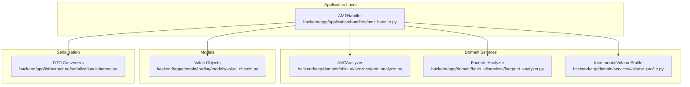
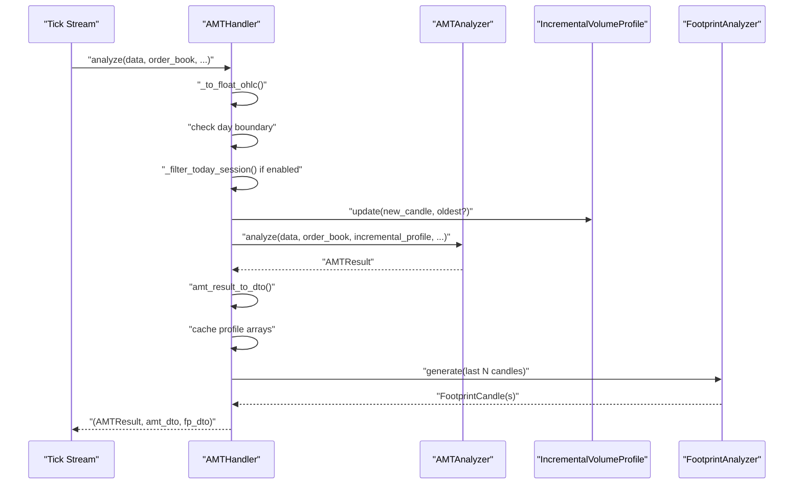
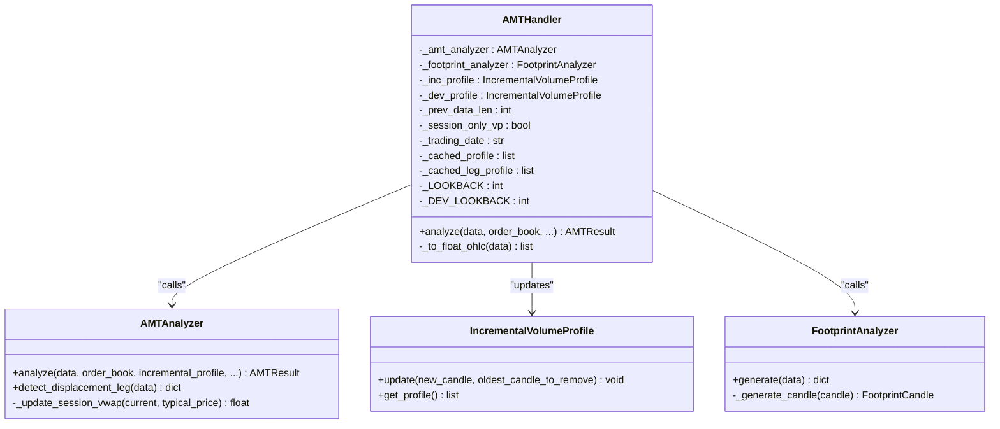
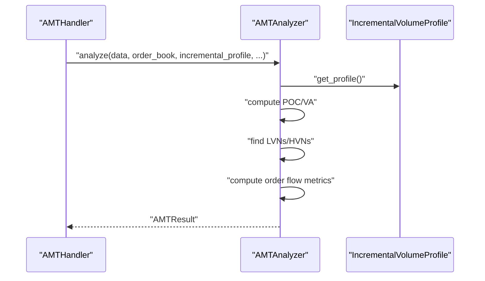
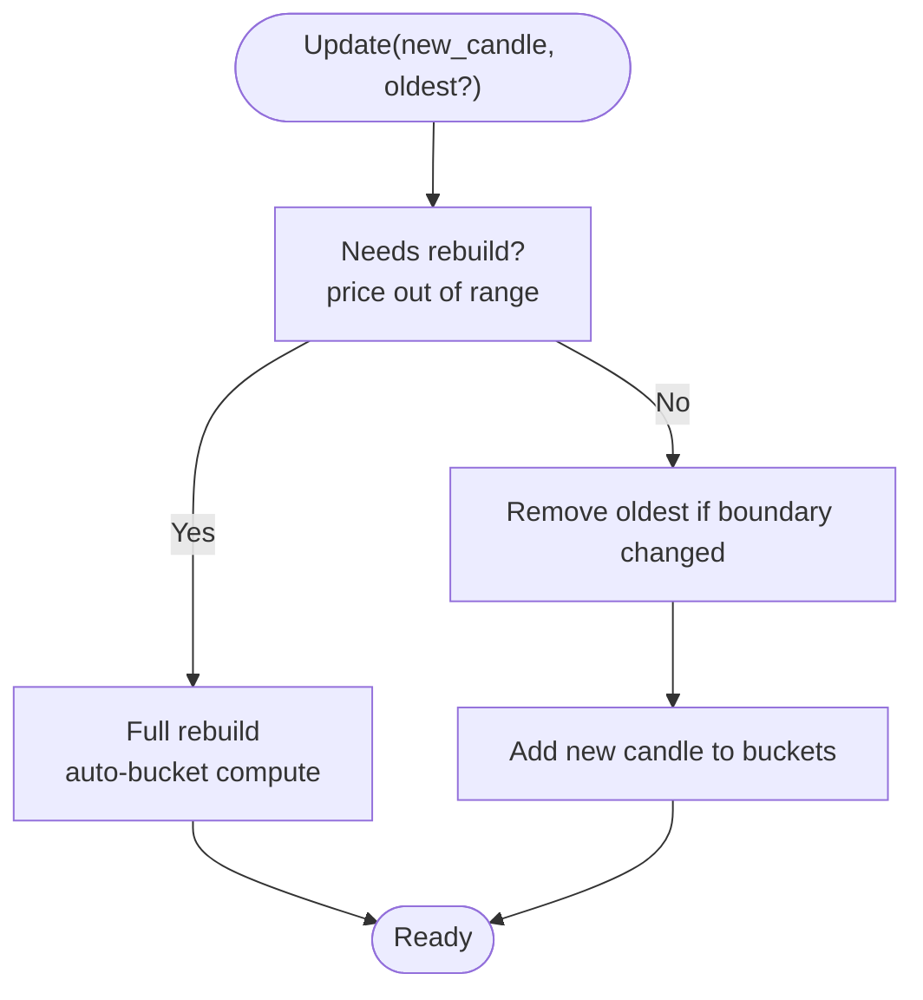
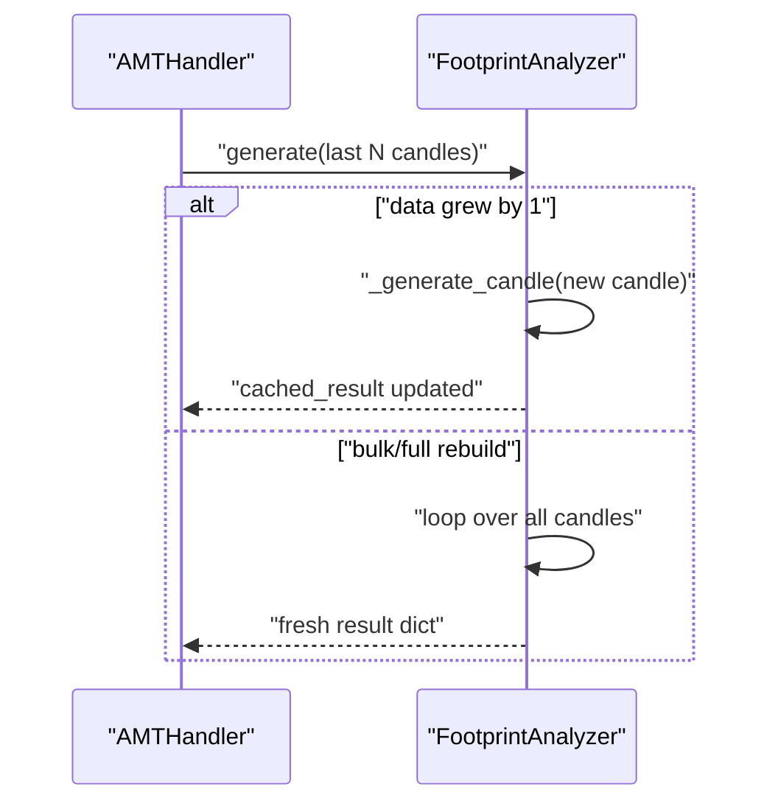
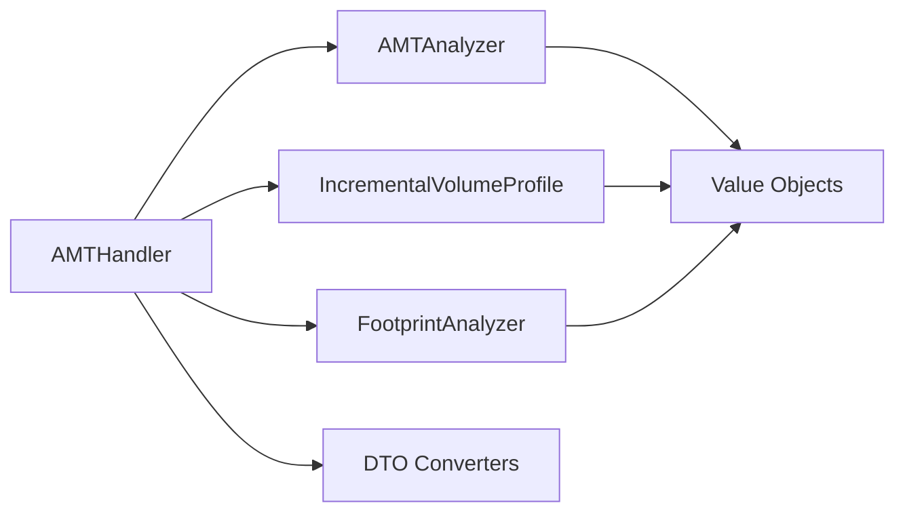

# AMT Handler

<cite>
**Referenced Files in This Document**
- [amt_handler.py](file://backend/app/application/handlers/amt_handler.py)
- [amt_analyzer.py](file://backend/app/domain/fabio_ai/services/amt_analyzer.py)
- [volume_profile.py](file://backend/app/domain/services/volume_profile.py)
- [footprint_analyzer.py](file://backend/app/domain/fabio_ai/services/footprint_analyzer.py)
- [value_objects.py](file://backend/app/domain/trading/models/value_objects.py)
- [schemas.py](file://backend/app/infrastructure/serialization/schemas.py)
- [test_amt_handler.py](file://backend/tests/unit/application/test_amt_handler.py)
- [market_config.yaml](file://backend/app/market_config.yaml)
</cite>

## Table of Contents
1. [Introduction](#introduction)
2. [Project Structure](#project-structure)
3. [Core Components](#core-components)
4. [Architecture Overview](#architecture-overview)
5. [Detailed Component Analysis](#detailed-component-analysis)
6. [Dependency Analysis](#dependency-analysis)
7. [Performance Considerations](#performance-considerations)
8. [Troubleshooting Guide](#troubleshooting-guide)
9. [Conclusion](#conclusion)

## Introduction
The AMT Handler orchestrates Auction Market Theory (AMT) analysis and footprint generation for every incoming tick. It maintains dual incremental volume profiles (standard and developing), applies candle filtering logic, manages caches for performance, and integrates with order book data to enrich order flow signals. This document explains how it constructs volume profiles incrementally, handles session-only profiling for options versus multi-day profiling for commodities, and coordinates AMT analysis with footprint generation.

## Project Structure
The AMT Handler lives in the application layer and delegates to domain services for analysis and footprint computation. It interacts with serialization helpers to produce DTOs consumed by the API layer.

**Diagram sources**
- [amt_handler.py:45-181](file://backend/app/application/handlers/amt_handler.py#L45-L181)
- [amt_analyzer.py:215-800](file://backend/app/domain/fabio_ai/services/amt_analyzer.py#L215-L800)
- [volume_profile.py:293-491](file://backend/app/domain/services/volume_profile.py#L293-L491)
- [footprint_analyzer.py:17-342](file://backend/app/domain/fabio_ai/services/footprint_analyzer.py#L17-L342)
- [value_objects.py:18-309](file://backend/app/domain/trading/models/value_objects.py#L18-L309)
- [schemas.py:512-667](file://backend/app/infrastructure/serialization/schemas.py#L512-L667)

**Section sources**
- [amt_handler.py:1-181](file://backend/app/application/handlers/amt_handler.py#L1-L181)
- [amt_analyzer.py:1-800](file://backend/app/domain/fabio_ai/services/amt_analyzer.py#L1-L800)
- [volume_profile.py:1-491](file://backend/app/domain/services/volume_profile.py#L1-L491)
- [footprint_analyzer.py:1-342](file://backend/app/domain/fabio_ai/services/footprint_analyzer.py#L1-L342)
- [value_objects.py:1-309](file://backend/app/domain/trading/models/value_objects.py#L1-L309)
- [schemas.py:1-667](file://backend/app/infrastructure/serialization/schemas.py#L1-L667)

## Core Components
- AMTHandler: The orchestrator that manages incremental volume profiles, applies candle filtering, detects day boundaries, and coordinates AMT analysis and footprint generation.
- AMTAnalyzer: Performs AMT analysis using either a provided incremental profile or rebuilds a profile from scratch, computes POC/VA, LVNs/HVNs, market state, and order flow metrics.
- IncrementalVolumeProfile: Maintains a histogram of volume-at-price and updates it incrementally with new candles and removal of expired candles.
- FootprintAnalyzer: Generates footprint candles from OHLC data using Gaussian distribution centered on VWAP and incremental caching for performance.

Key responsibilities:
- Incremental volume profile construction with dual windows (standard and developing).
- Candle filtering for session-only volume profiling for options and multi-day for commodities.
- Cache management to avoid unnecessary recomputation and frontend redraws.
- Integration with order book data for OBI and toxicity metrics.
- Day boundary handling to force VP rebuilds across trading sessions.

**Section sources**
- [amt_handler.py:45-181](file://backend/app/application/handlers/amt_handler.py#L45-L181)
- [amt_analyzer.py:215-800](file://backend/app/domain/fabio_ai/services/amt_analyzer.py#L215-L800)
- [volume_profile.py:293-491](file://backend/app/domain/services/volume_profile.py#L293-L491)
- [footprint_analyzer.py:17-342](file://backend/app/domain/fabio_ai/services/footprint_analyzer.py#L17-L342)

## Architecture Overview
The AMT Handler runs on every tick and performs the following workflow:
1. Normalize OHLC data to float-based structures for speed.
2. Detect trading day boundary and reset profiles if needed.
3. Filter candles for session-only volume profiling (options) or use multi-day data (commodities).
4. Update dual incremental volume profiles (standard and developing) based on data growth.
5. Run AMT analysis with the updated profiles and optional order book data.
6. Serialize AMT results to DTO and cache profile arrays for reuse.
7. Generate footprint data for the last N candles and serialize to DTO.

**Diagram sources**
- [amt_handler.py:89-181](file://backend/app/application/handlers/amt_handler.py#L89-L181)
- [amt_analyzer.py:623-800](file://backend/app/domain/fabio_ai/services/amt_analyzer.py#L623-L800)
- [volume_profile.py:447-491](file://backend/app/domain/services/volume_profile.py#L447-L491)
- [footprint_analyzer.py:101-124](file://backend/app/domain/fabio_ai/services/footprint_analyzer.py#L101-L124)

**Section sources**
- [amt_handler.py:89-181](file://backend/app/application/handlers/amt_handler.py#L89-L181)
- [test_amt_handler.py:108-211](file://backend/tests/unit/application/test_amt_handler.py#L108-L211)

## Detailed Component Analysis

### AMTHandler: Orchestrator and Dual Profile Management
Responsibilities:
- Maintain dual incremental volume profiles: standard (longer lookback) and developing (shorter lookback).
- Apply session-only filtering for options and multi-day filtering for commodities.
- Detect day boundaries and reset profiles accordingly.
- Cache profile arrays to avoid redundant computations on sub-candle updates.
- Integrate order book data for OBI and toxicity metrics.
- Generate footprint data for recent candles.

Dual profile approach:
- Standard profile: longer lookback window for stable value area estimation.
- Developing profile: shorter lookback window for fast adaptation to recent moves.

Candle filtering logic:
- Options: prefer today’s session only; fallback to recent candles if insufficient.
- Commodities: use multi-day data for richer volume profile.

Cache management:
- On new candle arrivals, cache profile arrays in the handler.
- On sub-candle updates (same length), reuse cached arrays to prevent unnecessary frontend redraws.

Day boundary handling:
- Tracks current trading date (IST) and forces full VP rebuild when the date changes.

Integration with order book:
- Passes order book to AMTAnalyzer for OBI and toxicity metrics.
- Uses top-of-book aggregates to detect extreme imbalances.

Practical examples:
- Workflow A: Options intraday with session-only VP and incremental updates.
- Workflow B: Commodities with multi-day VP and periodic full rebuilds.
- Workflow C: Sub-candle updates that reuse cached profiles.

**Section sources**
- [amt_handler.py:45-181](file://backend/app/application/handlers/amt_handler.py#L45-L181)
- [test_amt_handler.py:86-211](file://backend/tests/unit/application/test_amt_handler.py#L86-L211)

#### AMTHandler Class Diagram

**Diagram sources**
- [amt_handler.py:45-181](file://backend/app/application/handlers/amt_handler.py#L45-L181)
- [amt_analyzer.py:215-800](file://backend/app/domain/fabio_ai/services/amt_analyzer.py#L215-L800)
- [volume_profile.py:293-491](file://backend/app/domain/services/volume_profile.py#L293-L491)
- [footprint_analyzer.py:17-342](file://backend/app/domain/fabio_ai/services/footprint_analyzer.py#L17-L342)

### AMTAnalyzer: Volume Profile and Market State Engine
Key capabilities:
- Builds or consumes incremental volume profiles to compute POC, VAH, VAL.
- Detects LVNs/HVNs using smoothed histograms and persistence filters.
- Computes order flow metrics (OBI, toxicity, footprint confirmation, CVD, big trade, absorption, OFI, confluence, volume bubble).
- Integrates session VWAP and sigma bands.
- Supports developing value area computation from the developing profile.

Processing logic highlights:
- POC tie-break using session VWAP among tied bins.
- Value Area computed via CME two-row pairs method.
- Aggression scoring using persistent scorers and multiple confirmatory signals.
- Displacement leg detection for swing delta and leg profile.

**Section sources**
- [amt_analyzer.py:215-800](file://backend/app/domain/fabio_ai/services/amt_analyzer.py#L215-L800)

#### AMTAnalyzer Sequence (Partial)

**Diagram sources**
- [amt_analyzer.py:623-800](file://backend/app/domain/fabio_ai/services/amt_analyzer.py#L623-L800)

### IncrementalVolumeProfile: Efficient Histogram Maintenance
Features:
- Auto-computes optimal bucket count based on price range and tick size.
- Adds new candles and removes expired candles efficiently.
- Recomputes POC/VA in O(buckets) time after incremental updates.
- Supports concentrated (close-only) and uniform distribution modes.

Update strategy:
- Full rebuild when price range expands beyond bounds or when requested.
- Incremental add/remove otherwise.

**Section sources**
- [volume_profile.py:293-491](file://backend/app/domain/services/volume_profile.py#L293-L491)

#### IncrementalVolumeProfile Flowchart

**Diagram sources**
- [volume_profile.py:447-491](file://backend/app/domain/services/volume_profile.py#L447-L491)

### FootprintAnalyzer: Incremental Footprint Generation
Capabilities:
- Generates footprint candles using Gaussian distribution centered on VWAP.
- Normalizes volumes and deltas to match real totals.
- Incremental mode: caches previous results and recomputes only the newest candle when data grows by one.
- Provides absorption detection and contested zone detection.

Footprint generation logic:
- For flat candles, splits volume evenly between bid/ask.
- For ranged candles, estimates steps and weights, rounds allocations to avoid truncation.
- Computes POC as the price with maximum total volume.

**Section sources**
- [footprint_analyzer.py:17-342](file://backend/app/domain/fabio_ai/services/footprint_analyzer.py#L17-L342)

#### FootprintAnalyzer Sequence (Partial)

**Diagram sources**
- [footprint_analyzer.py:101-124](file://backend/app/domain/fabio_ai/services/footprint_analyzer.py#L101-L124)

### Candle Filtering Logic: Session-Only VP for Options vs Multi-Day for Commodities
Behavior:
- Options: prefer today’s session candles; if insufficient, fall back to recent candles.
- Commodities: use multi-day data for richer volume profile.
- Threshold: if today’s candles exceed a minimum, use only today; otherwise use recent data.

Implementation note:
- Filtering is applied only when session-only VP is enabled.

**Section sources**
- [amt_handler.py:21-43](file://backend/app/application/handlers/amt_handler.py#L21-L43)
- [test_amt_handler.py:468-507](file://backend/tests/unit/application/test_amt_handler.py#L468-L507)

### Cache Management: Reuse Profiles on Sub-Candle Updates
Mechanism:
- On new candle arrivals, cache profile arrays from the DTO.
- On sub-candle updates (same length), replace DTO profile references with cached arrays to avoid frontend redraws.

Benefits:
- Reduces unnecessary recomputation and network traffic.
- Preserves visual stability during intra-candle updates.

**Section sources**
- [amt_handler.py:166-178](file://backend/app/application/handlers/amt_handler.py#L166-L178)
- [test_amt_handler.py:387-462](file://backend/tests/unit/application/test_amt_handler.py#L387-L462)

### Integration Between AMT Analysis and Footprint Generation
- AMT analysis produces a rich DTO with profile snapshots and order flow signals.
- Footprint generation operates independently on recent candles to provide visual representation of order flow distribution.
- Both outputs are serialized to DTOs and returned together.

**Section sources**
- [amt_handler.py:176-180](file://backend/app/application/handlers/amt_handler.py#L176-L180)
- [schemas.py:512-667](file://backend/app/infrastructure/serialization/schemas.py#L512-L667)

### Practical Examples of AMT Analysis Workflows
- Example A: Options intraday
  - Enable session-only VP.
  - Use dual profiles with standard lookback for stable VA and developing lookback for fast adaptation.
  - On sub-candle updates, reuse cached profiles.
- Example B: Commodities session
  - Disable session-only VP to use multi-day data.
  - Periodic full rebuilds when data jumps or shrinks.
  - Combine AMT signals with footprint imbalances for confluence.
- Example C: Order book enrichment
  - Pass order book to AMTAnalyzer to compute OBI and toxicity.
  - Use extreme OBI to confirm imbalance setups.

**Section sources**
- [test_amt_handler.py:86-211](file://backend/tests/unit/application/test_amt_handler.py#L86-L211)
- [amt_analyzer.py:438-548](file://backend/app/domain/fabio_ai/services/amt_analyzer.py#L438-L548)

### Configuration Options for Session-Only VP
- Constructor parameter: session_only_vp (default True).
- Behavior controlled by _filter_today_session when enabled.
- Market-specific tuning via market_config.yaml (aggression thresholds, displacement multiplier, balance ratio).

**Section sources**
- [amt_handler.py:54-62](file://backend/app/application/handlers/amt_handler.py#L54-L62)
- [market_config.yaml:1-60](file://backend/app/market_config.yaml#L1-L60)

### Relationship with Order Book Data
- AMTAnalyzer computes OBI and toxicity from order book bids/asks.
- Top-of-book thresholds trigger toxicity alerts for extreme skew.
- Order book is optional; when absent, order flow metrics reflect broader context.

**Section sources**
- [amt_analyzer.py:438-478](file://backend/app/domain/fabio_ai/services/amt_analyzer.py#L438-L478)
- [value_objects.py:74-77](file://backend/app/domain/trading/models/value_objects.py#L74-L77)

## Dependency Analysis
The AMT Handler depends on:
- AMTAnalyzer for domain logic.
- IncrementalVolumeProfile for efficient histogram maintenance.
- FootprintAnalyzer for footprint generation.
- Serialization helpers for DTO conversion.

**Diagram sources**
- [amt_handler.py:9-11](file://backend/app/application/handlers/amt_handler.py#L9-L11)
- [amt_analyzer.py:22-31](file://backend/app/domain/fabio_ai/services/amt_analyzer.py#L22-L31)
- [volume_profile.py:16-18](file://backend/app/domain/services/volume_profile.py#L16-L18)
- [footprint_analyzer.py:13-14](file://backend/app/domain/fabio_ai/services/footprint_analyzer.py#L13-L14)
- [schemas.py:512-667](file://backend/app/infrastructure/serialization/schemas.py#L512-L667)

**Section sources**
- [amt_handler.py:9-11](file://backend/app/application/handlers/amt_handler.py#L9-L11)
- [amt_analyzer.py:22-31](file://backend/app/domain/fabio_ai/services/amt_analyzer.py#L22-L31)
- [volume_profile.py:16-18](file://backend/app/domain/services/volume_profile.py#L16-L18)
- [footprint_analyzer.py:13-14](file://backend/app/domain/fabio_ai/services/footprint_analyzer.py#L13-L14)
- [schemas.py:512-667](file://backend/app/infrastructure/serialization/schemas.py#L512-L667)

## Performance Considerations
- Incremental updates: Using IncrementalVolumeProfile reduces recomputation to O(buckets) per new candle.
- Dual lookbacks: Separate standard and developing profiles enable quick adaptation without full rebuilds.
- Caching: Profile array reuse on sub-candle updates minimizes DTO churn and frontend work.
- Lookback caps: Limits on data windows keep memory and CPU usage predictable.
- Floating-point conversion: Converting to float-based OHLC avoids Decimal/float mismatches and speeds up analysis.
- Day boundary resets: Prevent stale profiles across session changes.

[No sources needed since this section provides general guidance]

## Troubleshooting Guide
Common issues and resolutions:
- Empty or insufficient data: AMTAnalyzer returns a balanced baseline result when data is too sparse.
- Data jumps or shrinkage: Forces full rebuild of profiles to ensure correctness.
- Day boundary transitions: Resets profiles and prev_data_len to avoid mixing sessions.
- Order book anomalies: Omit order book or verify top-of-book liquidity to avoid misleading OBI/toxicity signals.
- DTO serialization errors: Ensure proper conversion via provided helpers.

**Section sources**
- [test_amt_handler.py:548-578](file://backend/tests/unit/application/test_amt_handler.py#L548-L578)
- [amt_analyzer.py:640-652](file://backend/app/domain/fabio_ai/services/amt_analyzer.py#L640-L652)

## Conclusion
The AMT Handler provides a robust, incremental pipeline for Auction Market Theory analysis and footprint generation. By maintaining dual volume profiles, applying session-aware filtering, and leveraging caches, it achieves high performance and responsiveness. Its integration with order book data enriches order flow signals, while careful day boundary handling ensures clean session transitions. These design choices support both options intraday strategies and commodity multi-day profiling with consistent performance and reliability.