# Application Handlers

<cite>
**Referenced Files in This Document**
- [amt_handler.py](file://backend/app/application/handlers/amt_handler.py)
- [llm_entry_handler.py](file://backend/app/application/handlers/llm_entry_handler.py)
- [trade_lifecycle_handler.py](file://backend/app/application/handlers/trade_lifecycle_handler.py)
- [entry_gate_coordinator.py](file://backend/app/application/handlers/entry_gate_coordinator.py)
- [institutional_detector.py](file://backend/app/application/handlers/institutional_detector.py)
- [llm_decision_processor.py](file://backend/app/application/handlers/llm_decision_processor.py)
- [llm_signal_processor.py](file://backend/app/application/handlers/llm_signal_processor.py)
- [llm_worker.py](file://backend/app/application/handlers/llm_worker.py)
- [llm_utils.py](file://backend/app/application/handlers/llm_utils.py)
- [post_trade_analyst.py](file://backend/app/application/handlers/post_trade_analyst.py)
- [pre_candle_advisor.py](file://backend/app/application/handlers/pre_candle_advisor.py)
- [llm_overseer_handler.py](file://backend/app/application/handlers/llm_overseer_handler.py)
- [rl_handler.py](file://backend/app/application/handlers/rl_handler.py)
- [engine.py](file://backend/app/application/engine.py)
- [trading_session.py](file://backend/app/application/services/trading_session.py)
</cite>

## Update Summary
**Changes Made**
- Added documentation for new institutional_detector handler for detecting large institutional prints and pressure
- Added documentation for new llm_decision_processor class for handling LLM decision processing with safety nets
- Added documentation for new llm_signal_processor class for signal building and validation
- Added documentation for new llm_worker manager for per-symbol LLM worker thread management
- Updated llm_entry_handler documentation to reflect Fabio AI integration and enhanced decision processing
- Removed references to deprecated signal_constructor.py (replaced with build_entry_signal)
- Enhanced handler architecture overview to show new modular design

## Table of Contents
1. [Introduction](#introduction)
2. [Project Structure](#project-structure)
3. [Core Components](#core-components)
4. [Architecture Overview](#architecture-overview)
5. [Detailed Component Analysis](#detailed-component-analysis)
6. [Dependency Analysis](#dependency-analysis)
7. [Performance Considerations](#performance-considerations)
8. [Troubleshooting Guide](#troubleshooting-guide)
9. [Conclusion](#conclusion)

## Introduction
This document explains the GlassyTrade AI application handlers layer responsible for orchestrating event-driven trading workflows. It covers:
- AMTHandler for volume profile analysis and market structure detection
- LLMEntryHandler for AI-powered entry decisions with Fabio AI integration and gate coordination
- TradeLifecycleHandler for deterministic trade execution and exits
- EntryGateCoordinator for comprehensive entry validation
- InstitutionalDetector for identifying large institutional prints and pressure
- LLMDecisionProcessor for handling LLM decision processing with safety nets
- LLMSignalProcessor for signal building and validation
- LLMWorkerManager for per-symbol LLM worker thread management
- PostTradeAnalyst for post-trade learning
- PreCandleAdvisor for predictive dashboards
- LLMOverseerHandler for active position management
- RLHandler for optional reinforcement learning status
- Integration with the broader engine and session services

The focus is on practical event-driven processing, handler chaining, error propagation, lifecycle/state management, and performance optimization.

## Project Structure
Handlers are organized under the application layer and coordinate with domain services and infrastructure ports. They integrate with the TradingEngine and TradingSessionService to form a cohesive event-driven pipeline with enhanced Fabio AI integration.

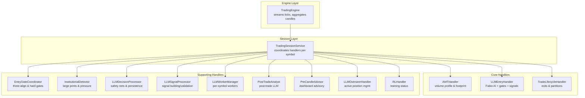

**Diagram sources**
- [engine.py:619-857](file://backend/app/application/engine.py#L619-L857)
- [trading_session.py:233-417](file://backend/app/application/services/trading_session.py#L233-L417)
- [amt_handler.py:45-181](file://backend/app/application/handlers/amt_handler.py#L45-L181)
- [llm_entry_handler.py:63-1228](file://backend/app/application/handlers/llm_entry_handler.py#L63-L1228)
- [trade_lifecycle_handler.py:22-377](file://backend/app/application/handlers/trade_lifecycle_handler.py#L22-L377)
- [entry_gate_coordinator.py:33-234](file://backend/app/application/handlers/entry_gate_coordinator.py#L33-L234)
- [institutional_detector.py:14-116](file://backend/app/application/handlers/institutional_detector.py#L14-L116)
- [llm_decision_processor.py:16-148](file://backend/app/application/handlers/llm_decision_processor.py#L16-L148)
- [llm_signal_processor.py:14-100](file://backend/app/application/handlers/llm_signal_processor.py#L14-L100)
- [llm_worker.py:17-55](file://backend/app/application/handlers/llm_worker.py#L17-L55)
- [post_trade_analyst.py:118-262](file://backend/app/application/handlers/post_trade_analyst.py#L118-L262)
- [pre_candle_advisor.py:61-191](file://backend/app/application/handlers/pre_candle_advisor.py#L61-L191)
- [llm_overseer_handler.py:53-516](file://backend/app/application/handlers/llm_overseer_handler.py#L53-L516)
- [rl_handler.py:17-55](file://backend/app/application/handlers/rl_handler.py#L17-L55)

**Section sources**
- [engine.py:619-857](file://backend/app/application/engine.py#L619-L857)
- [trading_session.py:233-417](file://backend/app/application/services/trading_session.py#L233-L417)

## Core Components
- AMTHandler: Computes incremental volume profiles, builds footprints, and caches profile arrays to reduce frontend churn.
- LLMEntryHandler: Enhanced with Fabio AI integration, coordinates LLM inference with per-symbol queues, delegates to EntryGateCoordinator, and uses new modular processors.
- TradeLifecycleHandler: Manages exits via TradeManager and PartitionExitManager, supports scale-ins, CVD kill signals, VWAP trails, and partition exits.
- EntryGateCoordinator: Comprehensive entry validation including three-align, momentum fade, CVD hard gates, and profile shape validations.
- InstitutionalDetector: Identifies large institutional prints (>3x median volume) and dominant pressure patterns.
- LLMDecisionProcessor: Handles LLM decision processing with safety nets, direction mismatch checking, and persistence.
- LLMSignalProcessor: Processes and validates LLM-generated signals with safety net checks and direction validation.
- LLMWorkerManager: Manages per-symbol LLM worker threads with bounded queues and thread pooling.
- PostTradeAnalyst: Fire-and-forget post-trade LLM analysis with timeouts and storage persistence.
- PreCandleAdvisor: Non-blocking advisory service for dashboards, firing at bar close windows.
- LLMOverseerHandler: Continuous position oversight with probabilistic overrides and risk controls.
- RLHandler: Optional RL training status reporting.

**Section sources**
- [amt_handler.py:45-181](file://backend/app/application/handlers/amt_handler.py#L45-L181)
- [llm_entry_handler.py:63-1228](file://backend/app/application/handlers/llm_entry_handler.py#L63-L1228)
- [trade_lifecycle_handler.py:22-377](file://backend/app/application/handlers/trade_lifecycle_handler.py#L22-L377)
- [entry_gate_coordinator.py:33-234](file://backend/app/application/handlers/entry_gate_coordinator.py#L33-L234)
- [institutional_detector.py:14-116](file://backend/app/application/handlers/institutional_detector.py#L14-L116)
- [llm_decision_processor.py:16-148](file://backend/app/application/handlers/llm_decision_processor.py#L16-L148)
- [llm_signal_processor.py:14-100](file://backend/app/application/handlers/llm_signal_processor.py#L14-L100)
- [llm_worker.py:17-55](file://backend/app/application/handlers/llm_worker.py#L17-L55)
- [post_trade_analyst.py:118-262](file://backend/app/application/handlers/post_trade_analyst.py#L118-L262)
- [pre_candle_advisor.py:61-191](file://backend/app/application/handlers/pre_candle_advisor.py#L61-L191)
- [llm_overseer_handler.py:53-516](file://backend/app/application/handlers/llm_overseer_handler.py#L53-L516)
- [rl_handler.py:17-55](file://backend/app/application/handlers/rl_handler.py#L17-L55)

## Architecture Overview
The handlers layer participates in a tick-driven pipeline with enhanced Fabio AI integration:
- TradingEngine streams live ticks, aggregates candles, and invokes TradingSessionService.process_tick.
- TradingSessionService orchestrates AMT analysis, agent inference, LLM entry gating, signal execution, lifecycle exits, and post-trade analysis.
- Handlers communicate via shared session state, queues, and callbacks, ensuring thread-safety and non-blocking operations where appropriate.
- New modular design separates concerns between decision processing, signal building, and worker management.

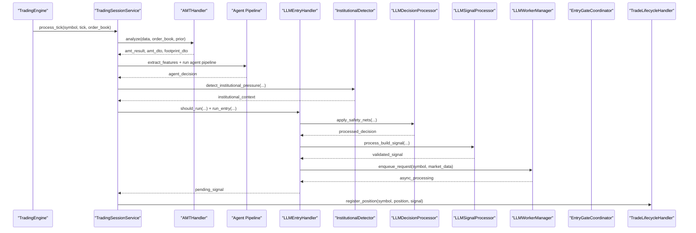

**Diagram sources**
- [engine.py:800-857](file://backend/app/application/engine.py#L800-L857)
- [trading_session.py:233-417](file://backend/app/application/services/trading_session.py#L233-L417)
- [amt_handler.py:89-181](file://backend/app/application/handlers/amt_handler.py#L89-L181)
- [llm_entry_handler.py:838-1228](file://backend/app/application/handlers/llm_entry_handler.py#L838-L1228)
- [institutional_detector.py:14-116](file://backend/app/application/handlers/institutional_detector.py#L14-L116)
- [llm_decision_processor.py:16-148](file://backend/app/application/handlers/llm_decision_processor.py#L16-L148)
- [llm_signal_processor.py:14-100](file://backend/app/application/handlers/llm_signal_processor.py#L14-L100)
- [llm_worker.py:17-55](file://backend/app/application/handlers/llm_worker.py#L17-L55)
- [entry_gate_coordinator.py:33-234](file://backend/app/application/handlers/entry_gate_coordinator.py#L33-L234)
- [trade_lifecycle_handler.py:47-268](file://backend/app/application/handlers/trade_lifecycle_handler.py#L47-L268)

## Detailed Component Analysis

### AMTHandler: Volume Profile and Footprint
Responsibilities:
- Incremental volume profile maintenance with configurable lookbacks
- Session-only filtering for options to avoid theta decay distortion
- Float-based OHLC conversion for speed and numerical stability
- Caching of profile arrays to minimize redraws on sub-candle updates
- Building footprint domain for recent candles

Key behaviors:
- Resets profiles on trading day boundary
- Full rebuild on bulk loads or first call; incremental updates otherwise
- Reuses cached profiles on sub-candle updates to avoid noise

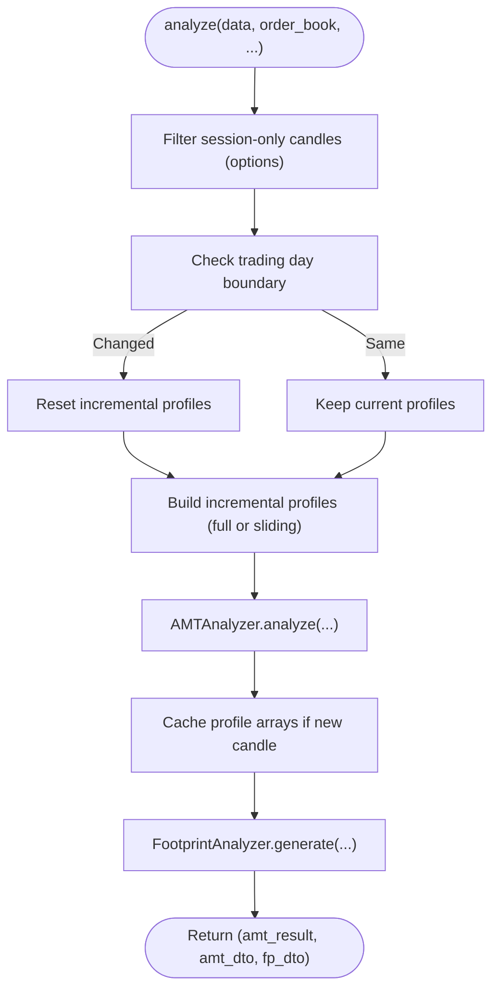

**Diagram sources**
- [amt_handler.py:89-181](file://backend/app/application/handlers/amt_handler.py#L89-L181)

**Section sources**
- [amt_handler.py:45-181](file://backend/app/application/handlers/amt_handler.py#L45-L181)

### InstitutionalDetector: Large Institutional Activity Detection
Responsibilities:
- Identifies large institutional prints (>3x median volume) as potential institutional activity
- Detects dominant buying or selling pressure that may override CVD slope
- Builds human-readable institutional context for LLM prompts
- Extracts stacked imbalances from footprint domain

Key behaviors:
- Calculates median volume from aggressive prints to establish threshold
- Flags institutional prints exceeding 3x median volume
- Determines dominant pressure side (BUYING/SELLING)
- Provides recent print details for context building

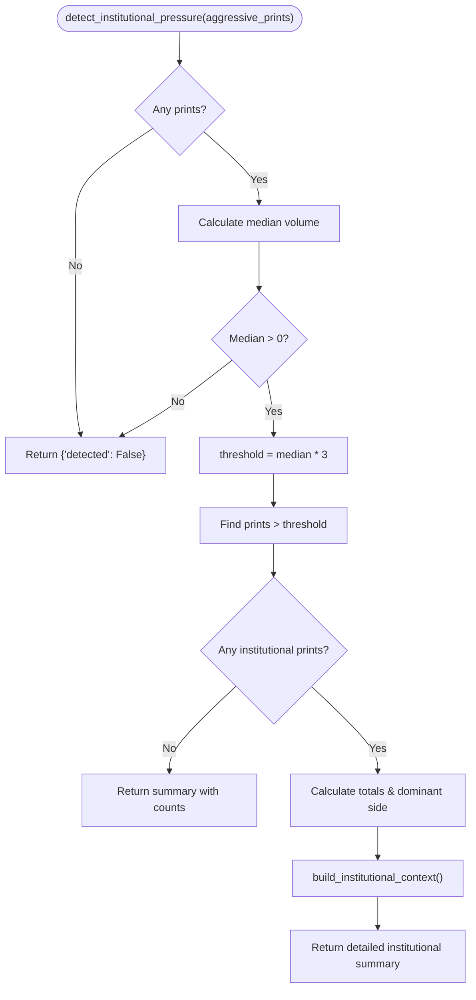

**Diagram sources**
- [institutional_detector.py:14-116](file://backend/app/application/handlers/institutional_detector.py#L14-L116)

**Section sources**
- [institutional_detector.py:14-116](file://backend/app/application/handlers/institutional_detector.py#L14-L116)

### LLMDecisionProcessor: Enhanced Decision Processing
Responsibilities:
- Applies safety nets including buy-only mode and VWAP extreme checks
- Checks direction mismatch between agent and LLM decisions
- Manages AI completion state and worker queue signaling
- Persists LLM decisions to storage with comprehensive metadata
- Updates LLM memory buffer for session continuity

Key behaviors:
- Enforces buy-only mode constraint when short trading disabled
- Validates VWAP extreme conditions for suspicious entries
- Logs direction mismatches and signals worker completion
- Persists decision metadata including market state, aggression, and strategy hints

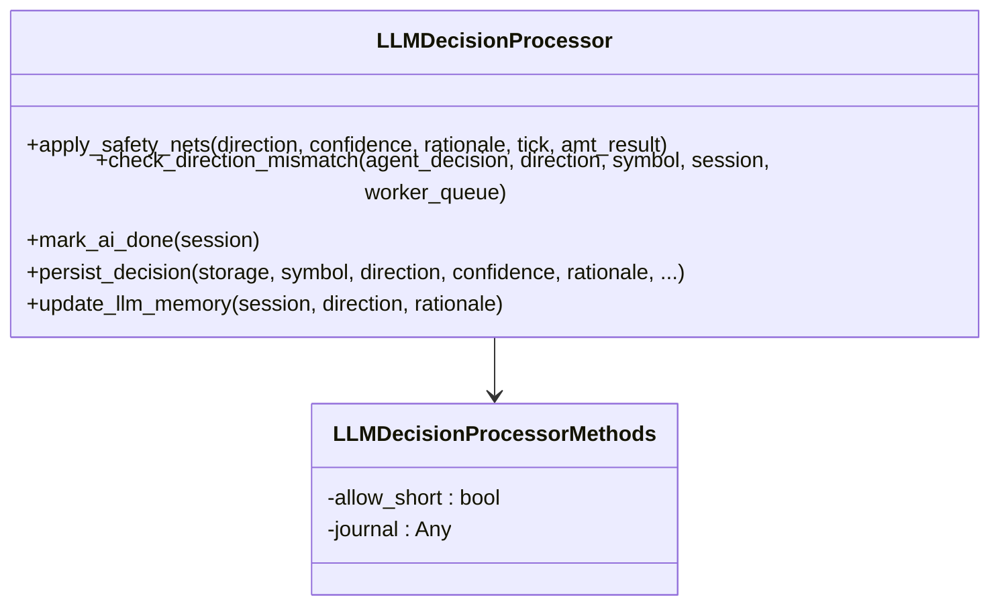

**Diagram sources**
- [llm_decision_processor.py:16-148](file://backend/app/application/handlers/llm_decision_processor.py#L16-L148)

**Section sources**
- [llm_decision_processor.py:16-148](file://backend/app/application/handlers/llm_decision_processor.py#L16-L148)

### LLMSignalProcessor: Signal Building and Validation
Responsibilities:
- Processes and builds signal dictionaries from LLM decisions
- Validates direction constraints based on trading permissions
- Applies safety net checks including confidence thresholds
- Checks direction alignment with market regime
- Manages AI completion state and worker queue signaling

Key behaviors:
- Converts SHORT to FLAT when short trading not allowed
- Enforces minimum confidence threshold (0.55)
- Validates LLM direction against market regime (BALANCED/IMBALANCED)
- Provides warning messages for regime-direction mismatches

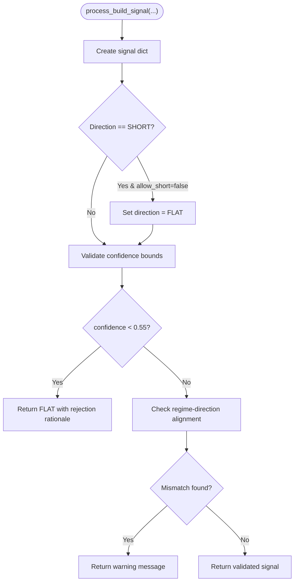

**Diagram sources**
- [llm_signal_processor.py:14-100](file://backend/app/application/handlers/llm_signal_processor.py#L14-L100)

**Section sources**
- [llm_signal_processor.py:14-100](file://backend/app/application/handlers/llm_signal_processor.py#L14-L100)

### LLMWorkerManager: Per-Symbol Worker Management
Responsibilities:
- Manages per-symbol LLM worker threads with bounded queues
- Creates and maintains worker threads for each trading symbol
- Provides thread-safe queue management with daemon threads
- Implements graceful shutdown and queue full checking
- Enforces staleness detection for queued requests

Key behaviors:
- Creates worker thread with maxsize=10 queue per symbol
- Starts daemon threads for non-blocking LLM processing
- Implements shutdown_all() to gracefully terminate workers
- Checks queue capacity and request staleness (20s threshold)

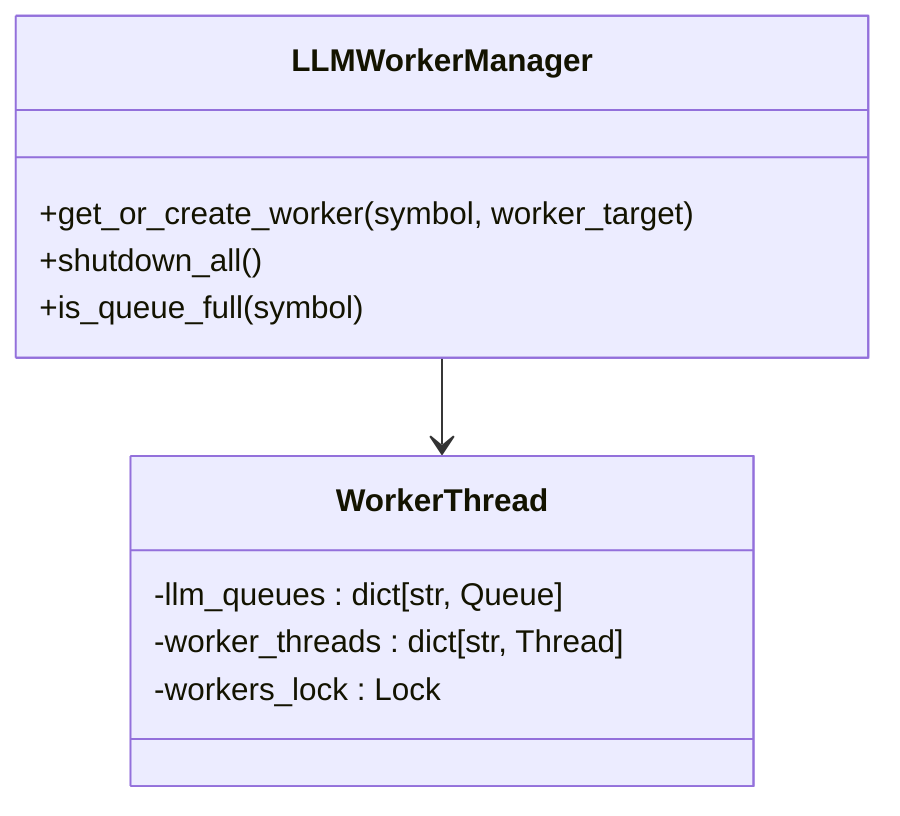

**Diagram sources**
- [llm_worker.py:17-55](file://backend/app/application/handlers/llm_worker.py#L17-L55)

**Section sources**
- [llm_worker.py:17-55](file://backend/app/application/handlers/llm_worker.py#L17-L55)

### LLMEntryHandler: Enhanced Fabio AI Integration
Responsibilities:
- Orchestrates LLM inference with per-symbol queues and worker threads
- Delegates gate checking to EntryGateCoordinator and signal construction via build_entry_signal
- Integrates InstitutionalDetector for large print context
- Uses modular processors (LLMDecisionProcessor, LLMSignalProcessor)
- Applies safety nets and manages concurrency to prevent rate limiting
- Enhanced with Fabio AI services and improved decision processing

Processing flow:
- Validates prerequisites (no open position, model readiness, cooldown)
- Builds market context with institutional detector integration
- Runs EntryGateCoordinator checks and constructs strategy hints
- Enqueues LLM worker loop with structured prompt and metadata
- Executes post-build signal validation and logs rejections
- Implements enhanced consistency guards and circuit breaker protection

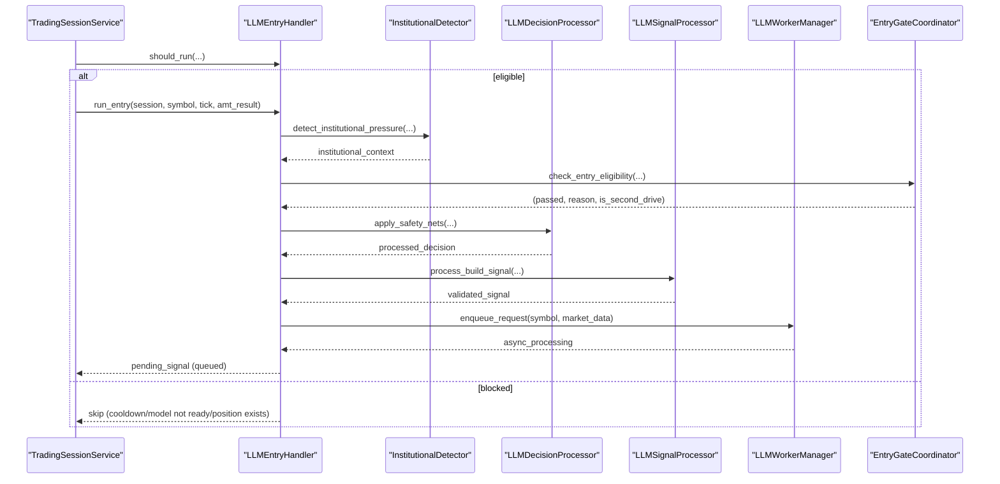

**Diagram sources**
- [llm_entry_handler.py:666-1228](file://backend/app/application/handlers/llm_entry_handler.py#L666-L1228)
- [institutional_detector.py:14-116](file://backend/app/application/handlers/institutional_detector.py#L14-L116)
- [llm_decision_processor.py:16-148](file://backend/app/application/handlers/llm_decision_processor.py#L16-L148)
- [llm_signal_processor.py:14-100](file://backend/app/application/handlers/llm_signal_processor.py#L14-L100)
- [llm_worker.py:17-55](file://backend/app/application/handlers/llm_worker.py#L17-L55)
- [entry_gate_coordinator.py:33-234](file://backend/app/application/handlers/entry_gate_coordinator.py#L33-L234)

**Section sources**
- [llm_entry_handler.py:63-1228](file://backend/app/application/handlers/llm_entry_handler.py#L63-L1228)
- [entry_gate_coordinator.py:33-234](file://backend/app/application/handlers/entry_gate_coordinator.py#L33-L234)

### TradeLifecycleHandler: Deterministic Trade Execution and Exits
Responsibilities:
- Manages exits via TradeManager (SL/TP/Trail/Time) and PartitionExitManager (P1/P2/P3)
- Supports scale-in checks, CVD kill signals, VWAP trails, and imbalance tightening
- Tracks partition states and trail SL adjustments
- Ensures position consistency and reconciles stale managed state
- Records stop-outs and partial exits

Processing logic:
- Iterates open positions and applies spread blowout, scale-in, CVD kill, and breakeven adjustments
- Applies VWAP trail and imbalance tighten rules
- Checks partition exits and trail SL updates
- Updates dynamic market state and resolves stop prices from tick extremes
- Triggers callbacks on stop-out and trade closure


**Diagram sources**
- [trade_lifecycle_handler.py:47-268](file://backend/app/application/handlers/trade_lifecycle_handler.py#L47-L268)

**Section sources**
- [trade_lifecycle_handler.py:22-377](file://backend/app/application/handlers/trade_lifecycle_handler.py#L22-L377)

### EntryGateCoordinator: Comprehensive Entry Validation
Responsibilities:
- Enforces three-align, momentum fade, CVD hard gates, and profile shape validations
- Provides confirmation bundle checks and VWAP bias warnings
- Enhanced with tick-size awareness for precise validation
- Integrates with Fabio AI services for advanced market structure detection

Key behaviors:
- Three-align gate with second drive detection
- Momentum fade detection for weak setups
- CVD hard gate for extreme institutional pressure
- Profile shape validation for distribution patterns
- Gate pipeline execution with soft gate tracking

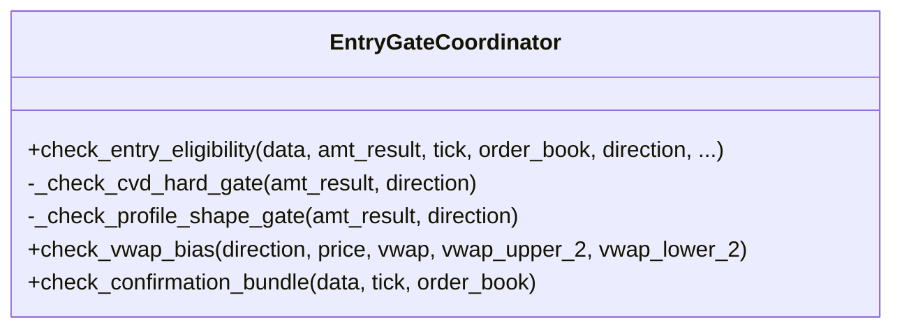

**Diagram sources**
- [entry_gate_coordinator.py:33-234](file://backend/app/application/handlers/entry_gate_coordinator.py#L33-L234)

**Section sources**
- [entry_gate_coordinator.py:33-234](file://backend/app/application/handlers/entry_gate_coordinator.py#L33-L234)

### PostTradeAnalyst: Post-Trade Learning
Responsibilities:
- Fire-and-forget post-trade LLM analysis on PositionClosed events
- Builds structured prompts with entry/exit context and market state
- Parses JSON responses and persists results for learning systems
- Enforces timeouts and graceful fallbacks

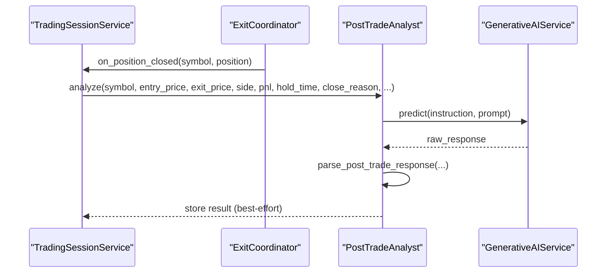

**Diagram sources**
- [post_trade_analyst.py:136-262](file://backend/app/application/handlers/post_trade_analyst.py#L136-L262)
- [trading_session.py:341-403](file://backend/app/application/services/trading_session.py#L341-L403)

**Section sources**
- [post_trade_analyst.py:118-262](file://backend/app/application/handlers/post_trade_analyst.py#L118-L262)

### PreCandleAdvisor: Predictive Dashboard Advisory
Responsibilities:
- Non-blocking advisory service firing at bar close windows
- Builds scenario narratives and key levels for dashboards
- Uses per-symbol debounce and timeouts

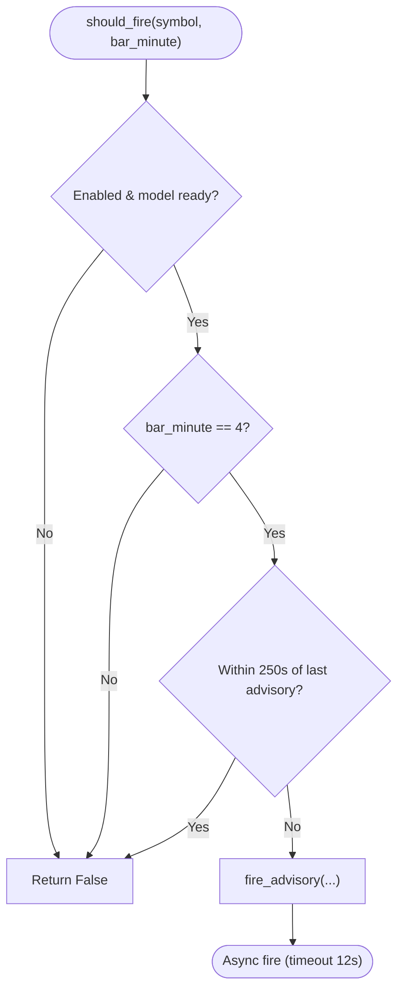

**Diagram sources**
- [pre_candle_advisor.py:85-107](file://backend/app/application/handlers/pre_candle_advisor.py#L85-L107)
- [pre_candle_advisor.py:109-191](file://backend/app/application/handlers/pre_candle_advisor.py#L109-L191)

**Section sources**
- [pre_candle_advisor.py:61-191](file://backend/app/application/handlers/pre_candle_advisor.py#L61-L191)

### LLMOverseerHandler: Active Position Management
Responsibilities:
- Periodic position oversight every ~3 seconds while positions are open
- Asks LLM to HOLD, TIGHTEN_SL, PARTIAL_EXIT, FULL_EXIT, or ADD
- Uses probabilistic overrides and risk controls (ADD cooldown, tier gating)
- Persists overseer actions and triggers immediate UI updates

```mermaid
sequenceDiagram
participant Sess as "TradingSessionService"
participant Over as "LLMOverseerHandler"
participant LLM as "GenerativeAIService"
participant TM as "TradeManager"
participant Eng as "TradingEngine"
Sess->>Over : should_run(has_position, overseer_running, ai_running, ...)
alt eligible
Sess->>Over : run_overseer(session, symbol, tick, amt_result, ...)
Over->>LLM : predict(OVERSEER_INSTRUCTION, prompt)
LLM-->>Over : raw
Over->>Over : parse_overseer_response(...)
Over->>TM : execute decision (tighten SL/partial/full/add)
Over->>Eng : trigger_immediate_update(symbol)
else blocked
Over-->>Sess : skip (cooldown/running)
end
```

**Diagram sources**
- [llm_overseer_handler.py:90-106](file://backend/app/application/handlers/llm_overseer_handler.py#L90-L106)
- [llm_overseer_handler.py:108-402](file://backend/app/application/handlers/llm_overseer_handler.py#L108-L402)
- [engine.py:281-358](file://backend/app/application/engine.py#L281-L358)

**Section sources**
- [llm_overseer_handler.py:53-516](file://backend/app/application/handlers/llm_overseer_handler.py#L53-L516)

### RLHandler: Optional Reinforcement Learning Status
Responsibilities:
- Reports RL training status for state snapshots and REST endpoints
- Gracefully handles missing dependencies

**Section sources**
- [rl_handler.py:17-55](file://backend/app/application/handlers/rl_handler.py#L17-L55)

## Dependency Analysis
Handlers depend on domain services and infrastructure ports with enhanced modular design:
- GenerativeAIService for LLM inference
- StoragePort for persistence and post-trade storage
- TradeManager for position registration and exit monitoring
- ProbabilityInferencePort for overseer probabilistic estimates
- InstitutionalDetector for large print context
- LLMDecisionProcessor for decision processing
- LLMSignalProcessor for signal validation
- LLMWorkerManager for worker thread management
- Shared error handling utilities for robustness

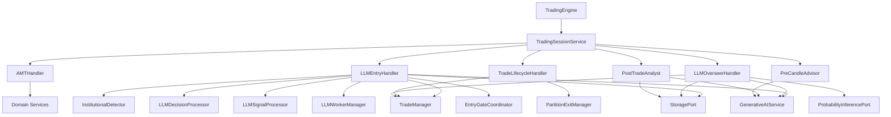

**Diagram sources**
- [llm_entry_handler.py:66-91](file://backend/app/application/handlers/llm_entry_handler.py#L66-L91)
- [trade_lifecycle_handler.py:22-45](file://backend/app/application/handlers/trade_lifecycle_handler.py#L22-L45)
- [llm_overseer_handler.py:53-84](file://backend/app/application/handlers/llm_overseer_handler.py#L53-L84)
- [post_trade_analyst.py:118-134](file://backend/app/application/handlers/post_trade_analyst.py#L118-L134)
- [pre_candle_advisor.py:61-80](file://backend/app/application/handlers/pre_candle_advisor.py#L61-L80)
- [engine.py:619-857](file://backend/app/application/engine.py#L619-L857)
- [trading_session.py:85-228](file://backend/app/application/services/trading_session.py#L85-L228)

**Section sources**
- [llm_entry_handler.py:63-1228](file://backend/app/application/handlers/llm_entry_handler.py#L63-L1228)
- [trade_lifecycle_handler.py:22-377](file://backend/app/application/handlers/trade_lifecycle_handler.py#L22-L377)
- [llm_overseer_handler.py:53-516](file://backend/app/application/handlers/llm_overseer_handler.py#L53-L516)
- [post_trade_analyst.py:118-262](file://backend/app/application/handlers/post_trade_analyst.py#L118-L262)
- [pre_candle_advisor.py:61-191](file://backend/app/application/handlers/pre_candle_advisor.py#L61-L191)
- [engine.py:619-857](file://backend/app/application/engine.py#L619-L857)
- [trading_session.py:85-228](file://backend/app/application/services/trading_session.py#L85-L228)

## Performance Considerations
- Incremental volume profile updates: AMTHandler minimizes rebuilds and caches profile arrays to reduce frontend churn.
- Per-symbol queues and worker threads: LLMEntryHandler and LLMOverseerHandler serialize LLM calls per symbol to avoid contention and enforce bounded queues.
- Enhanced worker management: LLMWorkerManager provides thread-safe queue management with daemon threads and graceful shutdown.
- Throttling and debounce: TradingEngine throttles process_tick to ~500 ms per symbol; PreCandleAdvisor debounces advisory fires.
- Async I/O and thread pools: LLM calls and post-trade analysis use thread pools to remain responsive.
- Circuit breakers: Per-entity circuit breakers protect handlers from failing upstream components.
- Lightweight DTO conversions: Handlers convert to lightweight DTOs to minimize serialization overhead.
- Institutional pressure detection: Efficient median calculation and threshold-based filtering for large prints.
- Modular design: Separate processors handle specific responsibilities, improving maintainability and performance.

## Troubleshooting Guide
Common issues and mitigations:
- Degenerate AMT data: LLMEntryHandler blocks entry when POC/VAH are invalid.
- Model readiness: LLMEntryHandler and LLMOverseerHandler check readiness and skip when models are loading.
- Cooldown violations: LLMEntryHandler enforces extended cooldowns (30s) to prevent rate limiting.
- Stale signals: TradingSessionService discards signals older than 10 minutes.
- Position state mismatches: TradeLifecycleHandler reconciles managed vs portfolio open positions and audits consistency.
- Post-trade analysis failures: PostTradeAnalyst logs and falls back to neutral scores with timeouts.
- Institutional pressure detection failures: InstitutionalDetector handles edge cases with median volume checks.
- Worker thread issues: LLMWorkerManager provides graceful shutdown and queue full detection.
- Decision processing errors: LLMDecisionProcessor includes comprehensive error handling and persistence fallbacks.

**Section sources**
- [llm_entry_handler.py:666-723](file://backend/app/application/handlers/llm_entry_handler.py#L666-L723)
- [llm_overseer_handler.py:90-106](file://backend/app/application/handlers/llm_overseer_handler.py#L90-L106)
- [trading_session.py:261-277](file://backend/app/application/services/trading_session.py#L261-L277)
- [trade_lifecycle_handler.py:324-348](file://backend/app/application/handlers/trade_lifecycle_handler.py#L324-L348)
- [post_trade_analyst.py:221-257](file://backend/app/application/handlers/post_trade_analyst.py#L221-L257)
- [institutional_detector.py:14-116](file://backend/app/application/handlers/institutional_detector.py#L14-L116)
- [llm_worker.py:17-55](file://backend/app/application/handlers/llm_worker.py#L17-L55)
- [llm_decision_processor.py:16-148](file://backend/app/application/handlers/llm_decision_processor.py#L16-L148)

## Conclusion
The handlers layer implements a robust, event-driven trading pipeline with enhanced Fabio AI integration:
- AMTHandler provides reliable volume profile and footprint insights
- InstitutionalDetector identifies large institutional prints and pressure patterns
- LLMDecisionProcessor handles decision processing with comprehensive safety nets
- LLMSignalProcessor validates and processes LLM-generated signals
- LLMWorkerManager manages per-symbol worker threads efficiently
- LLMEntryHandler coordinates AI decisions with strict gate enforcement and safety nets using Fabio AI services
- TradeLifecycleHandler ensures deterministic exits and position management
- Supporting handlers (EntryGateCoordinator, PostTradeAnalyst, PreCandleAdvisor, LLMOverseerHandler, RLHandler) round out the ecosystem
- Integration with TradingEngine and TradingSessionService enables scalable, resilient, and observable trading operations with enhanced AI capabilities