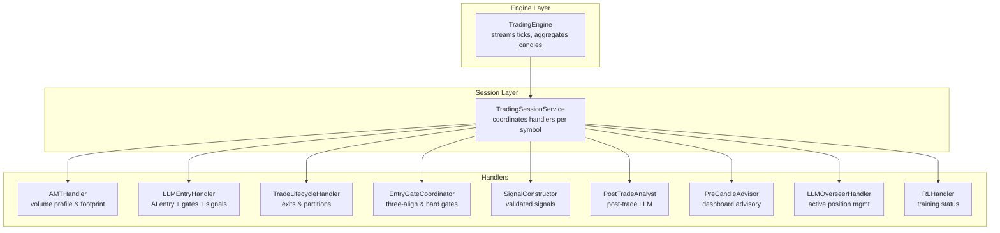
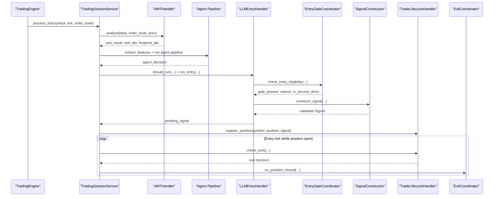
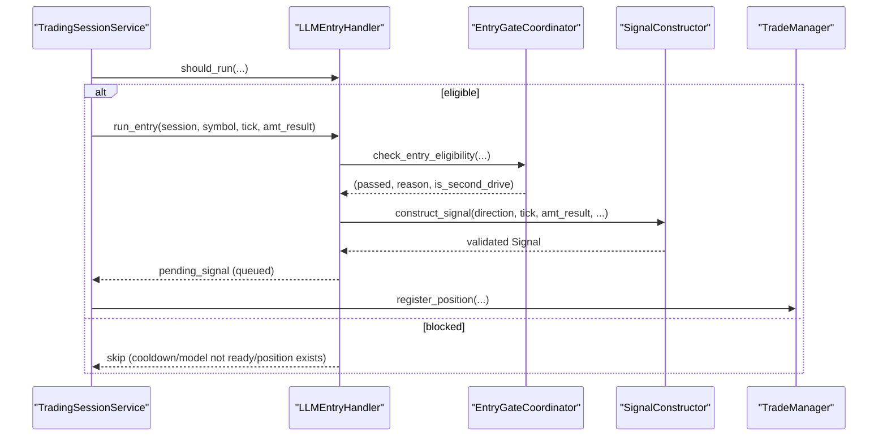
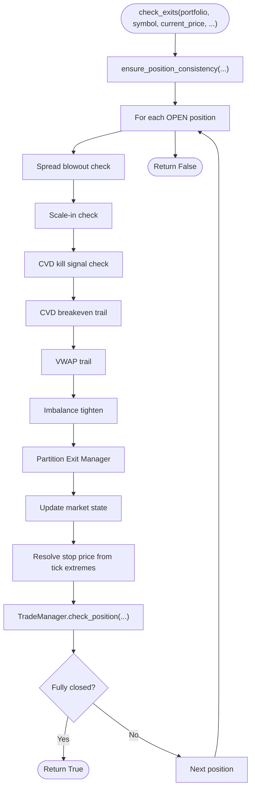
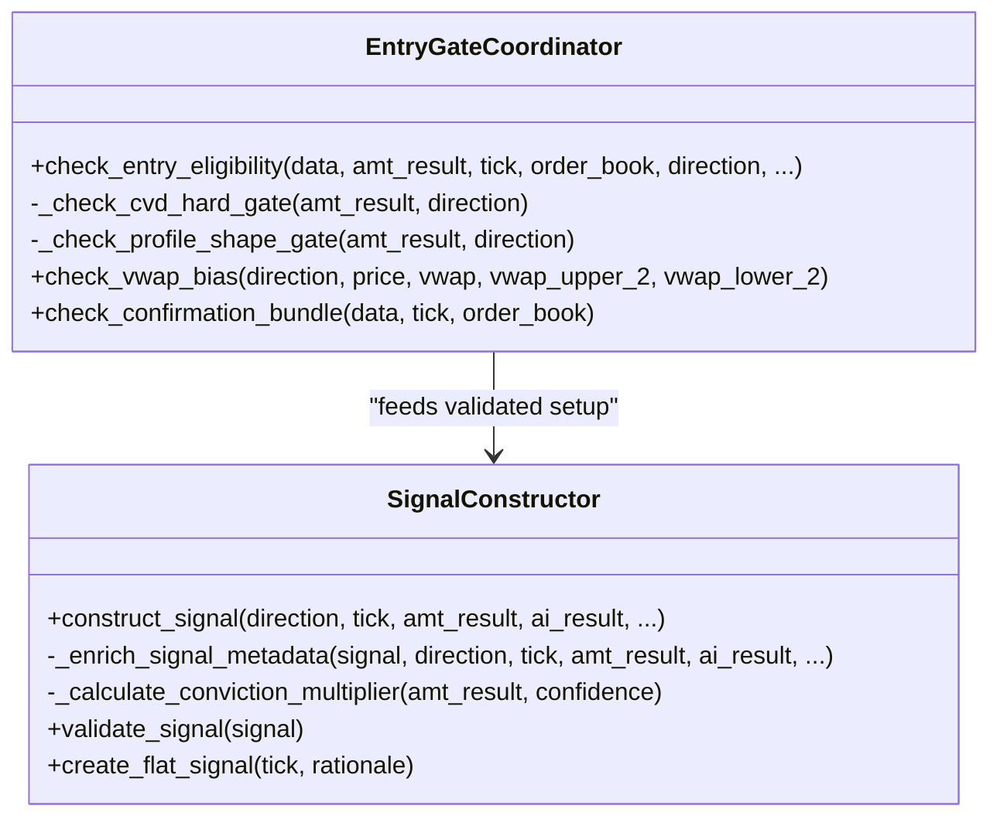
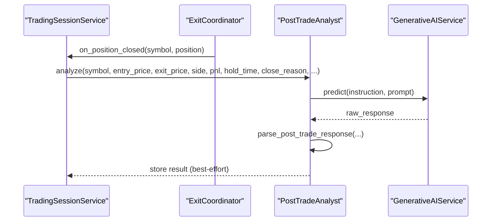
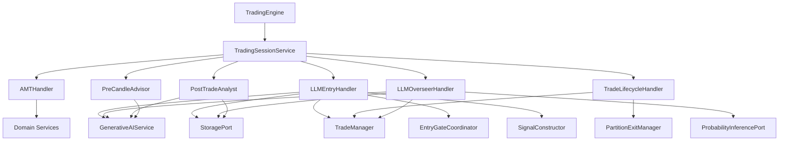

# Application Handlers

<cite>
**Referenced Files in This Document**
- [amt_handler.py](file://backend/app/application/handlers/amt_handler.py)
- [llm_entry_handler.py](file://backend/app/application/handlers/llm_entry_handler.py)
- [trade_lifecycle_handler.py](file://backend/app/application/handlers/trade_lifecycle_handler.py)
- [entry_gate_coordinator.py](file://backend/app/application/handlers/entry_gate_coordinator.py)
- [signal_constructor.py](file://backend/app/application/handlers/signal_constructor.py)
- [post_trade_analyst.py](file://backend/app/application/handlers/post_trade_analyst.py)
- [pre_candle_advisor.py](file://backend/app/application/handlers/pre_candle_advisor.py)
- [llm_overseer_handler.py](file://backend/app/application/handlers/llm_overseer_handler.py)
- [position_sizer.py](file://backend/app/application/handlers/position_sizer.py)
- [rl_handler.py](file://backend/app/application/handlers/rl_handler.py)
- [engine.py](file://backend/app/application/engine.py)
- [trading_session.py](file://backend/app/application/services/trading_session.py)
</cite>

## Table of Contents
1. [Introduction](#introduction)
2. [Project Structure](#project-structure)
3. [Core Components](#core-components)
4. [Architecture Overview](#architecture-overview)
5. [Detailed Component Analysis](#detailed-component-analysis)
6. [Dependency Analysis](#dependency-analysis)
7. [Performance Considerations](#performance-considerations)
8. [Troubleshooting Guide](#troubleshooting-guide)
9. [Conclusion](#conclusion)

## Introduction
This document explains the GlassyTrade AI application handlers layer responsible for orchestrating event-driven trading workflows. It covers:
- AMTHandler for volume profile analysis and market structure detection
- LLMEntryHandler for AI-powered entry decisions and gate coordination
- TradeLifecycleHandler for deterministic trade execution and exits
- EntryGateCoordinator and SignalConstructor for validated entry signals
- PostTradeAnalyst for post-trade learning
- PreCandleAdvisor for predictive dashboards
- LLMOverseerHandler for active position management
- RLHandler for optional reinforcement learning status
- Integration with the broader engine and session services

The focus is on practical event-driven processing, handler chaining, error propagation, lifecycle/state management, and performance optimization.

## Project Structure
Handlers are organized under the application layer and coordinate with domain services and infrastructure ports. They integrate with the TradingEngine and TradingSessionService to form a cohesive event-driven pipeline.



**Diagram sources**
- [engine.py:619-857](file://backend/app/application/engine.py#L619-L857)
- [trading_session.py:233-417](file://backend/app/application/services/trading_session.py#L233-L417)
- [amt_handler.py:45-181](file://backend/app/application/handlers/amt_handler.py#L45-L181)
- [llm_entry_handler.py:61-1082](file://backend/app/application/handlers/llm_entry_handler.py#L61-L1082)
- [trade_lifecycle_handler.py:22-377](file://backend/app/application/handlers/trade_lifecycle_handler.py#L22-L377)
- [entry_gate_coordinator.py:25-235](file://backend/app/application/handlers/entry_gate_coordinator.py#L25-L235)
- [signal_constructor.py:32-275](file://backend/app/application/handlers/signal_constructor.py#L32-L275)
- [post_trade_analyst.py:118-262](file://backend/app/application/handlers/post_trade_analyst.py#L118-L262)
- [pre_candle_advisor.py:61-191](file://backend/app/application/handlers/pre_candle_advisor.py#L61-L191)
- [llm_overseer_handler.py:53-516](file://backend/app/application/handlers/llm_overseer_handler.py#L53-L516)
- [rl_handler.py:17-55](file://backend/app/application/handlers/rl_handler.py#L17-L55)

**Section sources**
- [engine.py:619-857](file://backend/app/application/engine.py#L619-L857)
- [trading_session.py:233-417](file://backend/app/application/services/trading_session.py#L233-L417)

## Core Components
- AMTHandler: Computes incremental volume profiles, builds footprints, and caches profile arrays to reduce frontend churn.
- LLMEntryHandler: Coordinates LLM inference, delegates to EntryGateCoordinator and SignalConstructor, enforces safety nets, and manages per-symbol concurrency.
- TradeLifecycleHandler: Manages exits via TradeManager and PartitionExitManager, supports scale-ins, CVD kill signals, VWAP trails, and partition exits.
- EntryGateCoordinator: Enforces three-align, momentum fade, CVD hard gates, and profile shape validations.
- SignalConstructor: Builds validated signals enriched with metadata, trade thesis, and grade scores.
- PostTradeAnalyst: Fire-and-forget post-trade LLM analysis with timeouts and storage persistence.
- PreCandleAdvisor: Non-blocking advisory service for dashboards, firing at bar close windows.
- LLMOverseerHandler: Continuous position oversight with probabilistic overrides and risk controls.
- RLHandler: Optional RL training status reporting.

**Section sources**
- [amt_handler.py:45-181](file://backend/app/application/handlers/amt_handler.py#L45-L181)
- [llm_entry_handler.py:61-1082](file://backend/app/application/handlers/llm_entry_handler.py#L61-L1082)
- [trade_lifecycle_handler.py:22-377](file://backend/app/application/handlers/trade_lifecycle_handler.py#L22-L377)
- [entry_gate_coordinator.py:25-235](file://backend/app/application/handlers/entry_gate_coordinator.py#L25-L235)
- [signal_constructor.py:32-275](file://backend/app/application/handlers/signal_constructor.py#L32-L275)
- [post_trade_analyst.py:118-262](file://backend/app/application/handlers/post_trade_analyst.py#L118-L262)
- [pre_candle_advisor.py:61-191](file://backend/app/application/handlers/pre_candle_advisor.py#L61-L191)
- [llm_overseer_handler.py:53-516](file://backend/app/application/handlers/llm_overseer_handler.py#L53-L516)
- [rl_handler.py:17-55](file://backend/app/application/handlers/rl_handler.py#L17-L55)

## Architecture Overview
The handlers layer participates in a tick-driven pipeline:
- TradingEngine streams live ticks, aggregates candles, and invokes TradingSessionService.process_tick.
- TradingSessionService orchestrates AMT analysis, agent inference, LLM entry gating, signal execution, lifecycle exits, and post-trade analysis.
- Handlers communicate via shared session state, queues, and callbacks, ensuring thread-safety and non-blocking operations where appropriate.



**Diagram sources**
- [engine.py:800-857](file://backend/app/application/engine.py#L800-L857)
- [trading_session.py:233-417](file://backend/app/application/services/trading_session.py#L233-L417)
- [amt_handler.py:89-181](file://backend/app/application/handlers/amt_handler.py#L89-L181)
- [llm_entry_handler.py:379-781](file://backend/app/application/handlers/llm_entry_handler.py#L379-L781)
- [entry_gate_coordinator.py:32-125](file://backend/app/application/handlers/entry_gate_coordinator.py#L32-L125)
- [signal_constructor.py:39-107](file://backend/app/application/handlers/signal_constructor.py#L39-L107)
- [trade_lifecycle_handler.py:47-268](file://backend/app/application/handlers/trade_lifecycle_handler.py#L47-L268)

## Detailed Component Analysis

### AMTHandler: Volume Profile and Footprint
Responsibilities:
- Incremental volume profile maintenance with configurable lookbacks
- Session-only filtering for options to avoid theta decay distortion
- Float-based OHLC conversion for speed and numerical stability
- Caching of profile arrays to minimize redraws on sub-candle updates
- Building footprint domain for recent candles

Key behaviors:
- Resets profiles on trading day boundary
- Full rebuild on bulk loads or first call; incremental updates otherwise
- Reuses cached profiles on sub-candle updates to avoid noise


**Diagram sources**
- [amt_handler.py:89-181](file://backend/app/application/handlers/amt_handler.py#L89-L181)

**Section sources**
- [amt_handler.py:45-181](file://backend/app/application/handlers/amt_handler.py#L45-L181)

### LLMEntryHandler: AI Entry Decision and Gate Coordination
Responsibilities:
- Orchestrates LLM inference with per-symbol queues and worker threads
- Delegates gate checking to EntryGateCoordinator and signal construction to SignalConstructor
- Applies safety nets (buy-only mode, VWAP extremes)
- Integrates session context, strategy hints, and episodic memory
- Manages cooldowns and concurrency to prevent rate limiting

Processing flow:
- Validates prerequisites (no open position, model readiness, cooldown)
- Builds market context and session-aware setup bias
- Runs EntryGateCoordinator checks and constructs strategy hints
- Enqueues LLM worker loop with structured prompt and metadata
- Executes post-build signal validation and logs rejections



**Diagram sources**
- [llm_entry_handler.py:330-377](file://backend/app/application/handlers/llm_entry_handler.py#L330-L377)
- [llm_entry_handler.py:379-781](file://backend/app/application/handlers/llm_entry_handler.py#L379-L781)
- [entry_gate_coordinator.py:32-125](file://backend/app/application/handlers/entry_gate_coordinator.py#L32-L125)
- [signal_constructor.py:39-107](file://backend/app/application/handlers/signal_constructor.py#L39-L107)
- [trade_lifecycle_handler.py:270-317](file://backend/app/application/handlers/trade_lifecycle_handler.py#L270-L317)

**Section sources**
- [llm_entry_handler.py:61-1082](file://backend/app/application/handlers/llm_entry_handler.py#L61-L1082)
- [entry_gate_coordinator.py:25-235](file://backend/app/application/handlers/entry_gate_coordinator.py#L25-L235)
- [signal_constructor.py:32-275](file://backend/app/application/handlers/signal_constructor.py#L32-L275)

### TradeLifecycleHandler: Deterministic Trade Execution and Exits
Responsibilities:
- Manages exits via TradeManager (SL/TP/Trail/Time) and PartitionExitManager (P1/P2/P3)
- Supports scale-in checks, CVD kill signals, VWAP trails, and imbalance tightening
- Tracks partition states and trail SL adjustments
- Ensures position consistency and reconciles stale managed state
- Records stop-outs and partial exits

Processing logic:
- Iterates open positions and applies spread blowout, scale-in, CVD kill, and breakeven adjustments
- Applies VWAP trail and imbalance tighten rules
- Checks partition exits and trail SL updates
- Updates dynamic market state and resolves stop prices from tick extremes
- Triggers callbacks on stop-out and trade closure



**Diagram sources**
- [trade_lifecycle_handler.py:47-268](file://backend/app/application/handlers/trade_lifecycle_handler.py#L47-L268)

**Section sources**
- [trade_lifecycle_handler.py:22-377](file://backend/app/application/handlers/trade_lifecycle_handler.py#L22-L377)

### EntryGateCoordinator and SignalConstructor
EntryGateCoordinator:
- Enforces three-align, momentum fade, CVD hard gates, and profile shape validations
- Provides confirmation bundle checks and VWAP bias warnings

SignalConstructor:
- Builds validated signals from LLM decisions
- Enriches metadata with trade thesis, conviction multiplier, grade score, and setup type
- Validates R:R ratios and required fields



**Diagram sources**
- [entry_gate_coordinator.py:25-235](file://backend/app/application/handlers/entry_gate_coordinator.py#L25-L235)
- [signal_constructor.py:32-275](file://backend/app/application/handlers/signal_constructor.py#L32-L275)

**Section sources**
- [entry_gate_coordinator.py:25-235](file://backend/app/application/handlers/entry_gate_coordinator.py#L25-L235)
- [signal_constructor.py:32-275](file://backend/app/application/handlers/signal_constructor.py#L32-L275)

### PostTradeAnalyst: Post-Trade Learning
Responsibilities:
- Fire-and-forget post-trade LLM analysis on PositionClosed events
- Builds structured prompts with entry/exit context and market state
- Parses JSON responses and persists results for learning systems
- Enforces timeouts and graceful fallbacks



**Diagram sources**
- [post_trade_analyst.py:136-262](file://backend/app/application/handlers/post_trade_analyst.py#L136-L262)
- [trading_session.py:341-403](file://backend/app/application/services/trading_session.py#L341-L403)

**Section sources**
- [post_trade_analyst.py:118-262](file://backend/app/application/handlers/post_trade_analyst.py#L118-L262)

### PreCandleAdvisor: Predictive Dashboard Advisory
Responsibilities:
- Non-blocking advisory service firing at bar close windows
- Builds scenario narratives and key levels for dashboards
- Uses per-symbol debounce and timeouts


**Diagram sources**
- [pre_candle_advisor.py:85-107](file://backend/app/application/handlers/pre_candle_advisor.py#L85-L107)
- [pre_candle_advisor.py:109-191](file://backend/app/application/handlers/pre_candle_advisor.py#L109-L191)

**Section sources**
- [pre_candle_advisor.py:61-191](file://backend/app/application/handlers/pre_candle_advisor.py#L61-L191)

### LLMOverseerHandler: Active Position Management
Responsibilities:
- Periodic position oversight every ~3 seconds while positions are open
- Asks LLM to HOLD, TIGHTEN_SL, PARTIAL_EXIT, FULL_EXIT, or ADD
- Uses probabilistic overrides and risk controls (ADD cooldown, tier gating)
- Persists overseer actions and triggers immediate UI updates

```mermaid
sequenceDiagram
participant Sess as "TradingSessionService"
participant Over as "LLMOverseerHandler"
participant LLM as "GenerativeAIService"
participant TM as "TradeManager"
participant Eng as "TradingEngine"
Sess->>Over : should_run(has_position, overseer_running, ai_running, ...)
alt eligible
Sess->>Over : run_overseer(session, symbol, tick, amt_result, ...)
Over->>LLM : predict(OVERSEER_INSTRUCTION, prompt)
LLM-->>Over : raw
Over->>Over : parse_overseer_response(...)
Over->>TM : execute decision (tighten SL/partial/full/add)
Over->>Eng : trigger_immediate_update(symbol)
else blocked
Over-->>Sess : skip (cooldown/running)
end
```

**Diagram sources**
- [llm_overseer_handler.py:90-106](file://backend/app/application/handlers/llm_overseer_handler.py#L90-L106)
- [llm_overseer_handler.py:108-402](file://backend/app/application/handlers/llm_overseer_handler.py#L108-L402)
- [engine.py:281-358](file://backend/app/application/engine.py#L281-L358)

**Section sources**
- [llm_overseer_handler.py:53-516](file://backend/app/application/handlers/llm_overseer_handler.py#L53-L516)

### RLHandler: Optional Reinforcement Learning Status
Responsibilities:
- Reports RL training status for state snapshots and REST endpoints
- Gracefully handles missing dependencies

**Section sources**
- [rl_handler.py:17-55](file://backend/app/application/handlers/rl_handler.py#L17-L55)

## Dependency Analysis
Handlers depend on domain services and infrastructure ports:
- GenerativeAIService for LLM inference
- StoragePort for persistence and post-trade storage
- TradeManager for position registration and exit monitoring
- ProbabilityInferencePort for overseer probabilistic estimates
- Shared error handling utilities for robustness



**Diagram sources**
- [llm_entry_handler.py:61-95](file://backend/app/application/handlers/llm_entry_handler.py#L61-L95)
- [trade_lifecycle_handler.py:22-45](file://backend/app/application/handlers/trade_lifecycle_handler.py#L22-L45)
- [llm_overseer_handler.py:53-84](file://backend/app/application/handlers/llm_overseer_handler.py#L53-L84)
- [post_trade_analyst.py:118-134](file://backend/app/application/handlers/post_trade_analyst.py#L118-L134)
- [pre_candle_advisor.py:61-80](file://backend/app/application/handlers/pre_candle_advisor.py#L61-L80)
- [engine.py:619-857](file://backend/app/application/engine.py#L619-L857)
- [trading_session.py:85-228](file://backend/app/application/services/trading_session.py#L85-L228)

**Section sources**
- [llm_entry_handler.py:61-1082](file://backend/app/application/handlers/llm_entry_handler.py#L61-L1082)
- [trade_lifecycle_handler.py:22-377](file://backend/app/application/handlers/trade_lifecycle_handler.py#L22-L377)
- [llm_overseer_handler.py:53-516](file://backend/app/application/handlers/llm_overseer_handler.py#L53-L516)
- [post_trade_analyst.py:118-262](file://backend/app/application/handlers/post_trade_analyst.py#L118-L262)
- [pre_candle_advisor.py:61-191](file://backend/app/application/handlers/pre_candle_advisor.py#L61-L191)
- [engine.py:619-857](file://backend/app/application/engine.py#L619-L857)
- [trading_session.py:85-228](file://backend/app/application/services/trading_session.py#L85-L228)

## Performance Considerations
- Incremental volume profile updates: AMTHandler minimizes rebuilds and caches profile arrays to reduce frontend churn.
- Per-symbol queues and worker threads: LLMEntryHandler and LLMOverseerHandler serialize LLM calls per symbol to avoid contention and enforce bounded queues.
- Throttling and debounce: TradingEngine throttles process_tick to ~500 ms per symbol; PreCandleAdvisor debounces advisory fires.
- Async I/O and thread pools: LLM calls and post-trade analysis use thread pools to remain responsive.
- Circuit breakers: Per-entity circuit breakers protect handlers from failing upstream components.
- Lightweight DTO conversions: Handlers convert to lightweight DTOs to minimize serialization overhead.

[No sources needed since this section provides general guidance]

## Troubleshooting Guide
Common issues and mitigations:
- Degenerate AMT data: LLMEntryHandler blocks entry when POC/VAH are invalid.
- Model readiness: LLMEntryHandler and LLMOverseerHandler check readiness and skip when models are loading.
- Cooldown violations: LLMEntryHandler enforces extended cooldowns to prevent rate limiting.
- Stale signals: TradingSessionService discards signals older than 10 minutes.
- Position state mismatches: TradeLifecycleHandler reconciles managed vs portfolio open positions and audits consistency.
- Post-trade analysis failures: PostTradeAnalyst logs and falls back to neutral scores with timeouts.

**Section sources**
- [llm_entry_handler.py:330-377](file://backend/app/application/handlers/llm_entry_handler.py#L330-L377)
- [llm_overseer_handler.py:90-106](file://backend/app/application/handlers/llm_overseer_handler.py#L90-L106)
- [trading_session.py:261-277](file://backend/app/application/services/trading_session.py#L261-L277)
- [trade_lifecycle_handler.py:324-348](file://backend/app/application/handlers/trade_lifecycle_handler.py#L324-L348)
- [post_trade_analyst.py:221-257](file://backend/app/application/handlers/post_trade_analyst.py#L221-L257)

## Conclusion
The handlers layer implements a robust, event-driven trading pipeline:
- AMTHandler provides reliable volume profile and footprint insights
- LLMEntryHandler coordinates AI decisions with strict gate enforcement and safety nets
- TradeLifecycleHandler ensures deterministic exits and position management
- Supporting handlers (EntryGateCoordinator, SignalConstructor, PostTradeAnalyst, PreCandleAdvisor, LLMOverseerHandler, RLHandler) round out the ecosystem
- Integration with TradingEngine and TradingSessionService enables scalable, resilient, and observable trading operations