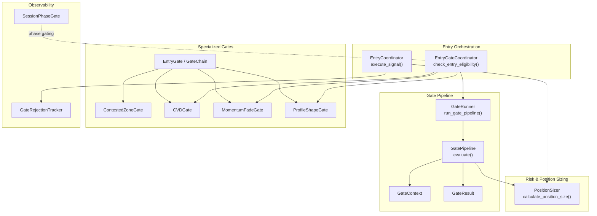
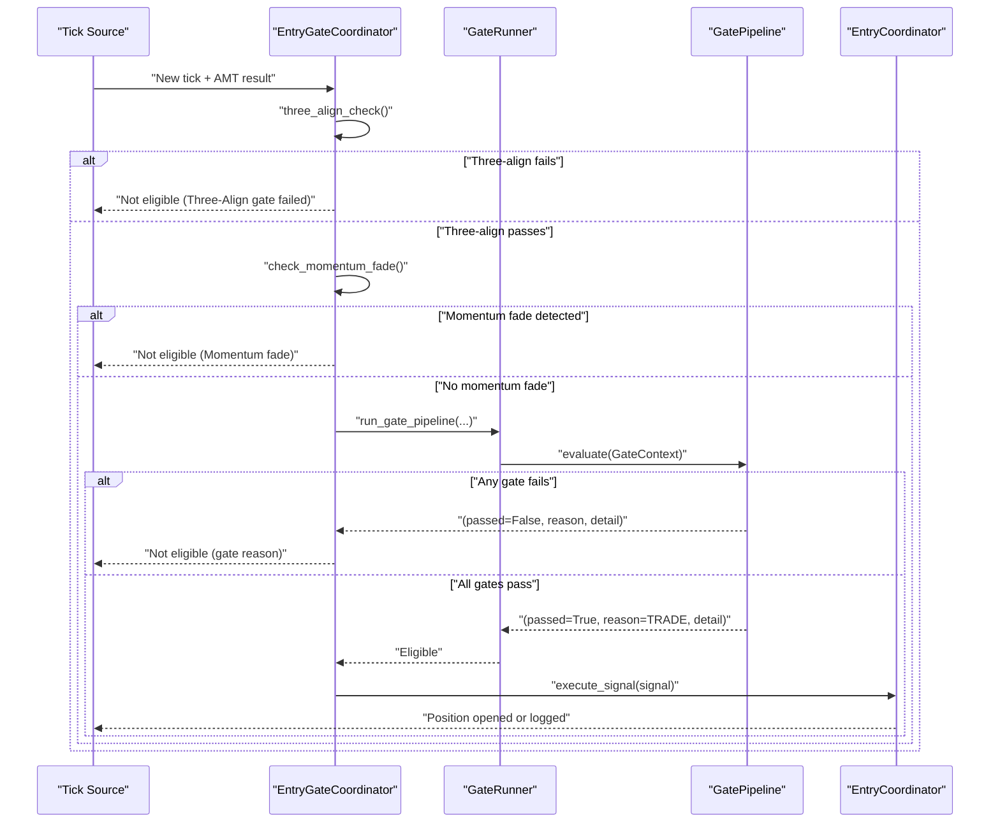
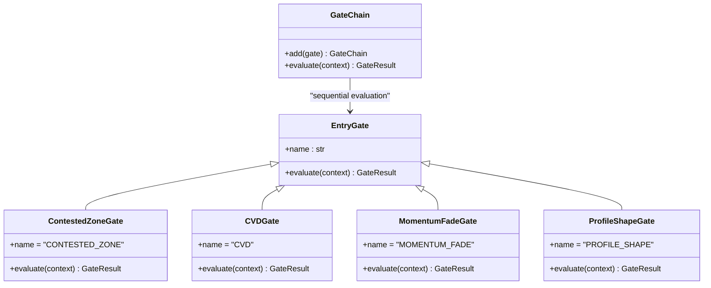
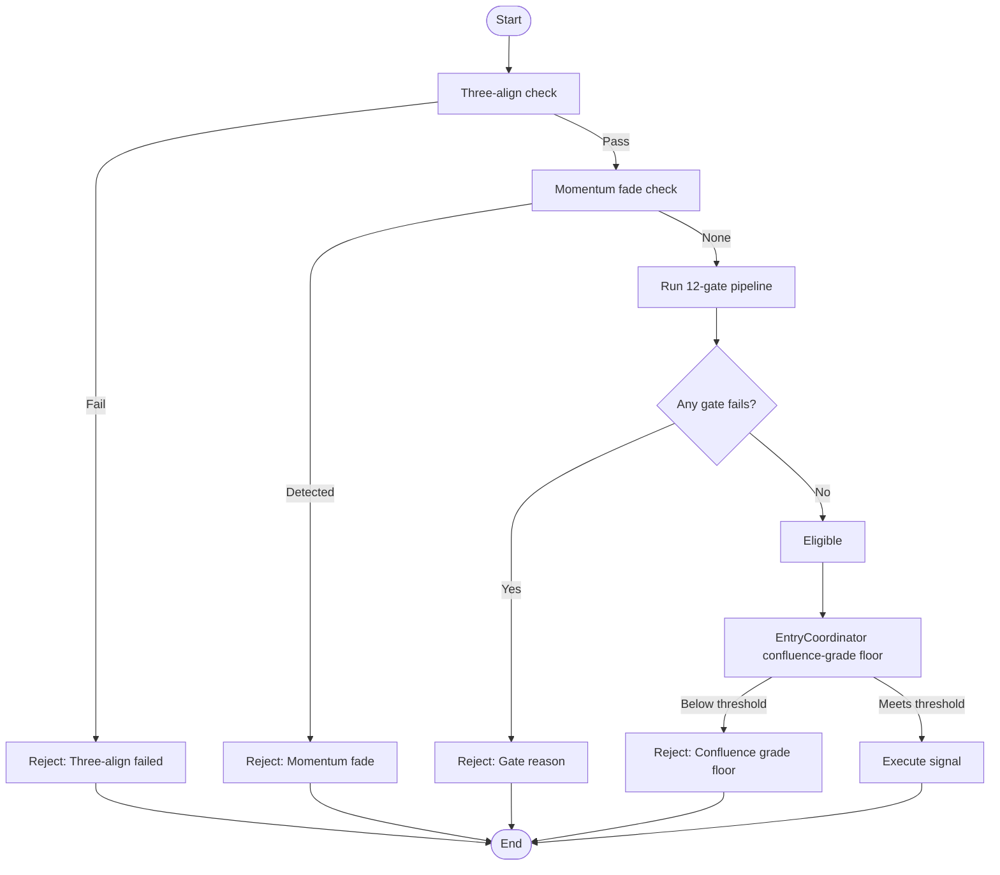
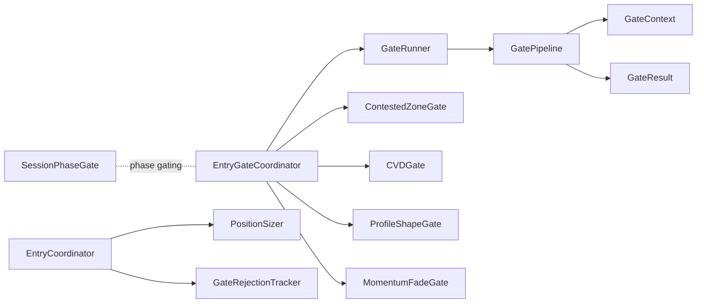

# Gate Pipeline

<cite>
**Referenced Files in This Document**
- [gate_pipeline.py](file://backend/app/domain/fabio_ai/services/gate_pipeline.py)
- [entry_gate_coordinator.py](file://backend/app/application/handlers/entry_gate_coordinator.py)
- [entry_gate.py](file://backend/app/domain/fabio_ai/services/entry_gate.py)
- [gate_runner.py](file://backend/app/domain/fabio_ai/services/entry_gates/gate_runner.py)
- [base.py](file://backend/app/domain/fabio_ai/services/gates/base.py)
- [contested_zone_gate.py](file://backend/app/domain/fabio_ai/services/gates/contested_zone_gate.py)
- [cvd_gate.py](file://backend/app/domain/fabio_ai/services/gates/cvd_gate.py)
- [momentum_fade_gate.py](file://backend/app/domain/fabio_ai/services/gates/momentum_fade_gate.py)
- [profile_shape_gate.py](file://backend/app/domain/fabio_ai/services/gates/profile_shape_gate.py)
- [gate_rejection_tracker.py](file://backend/app/domain/services/gate_rejection_tracker.py)
- [session_phase_gate.py](file://backend/app/domain/services/session_phase_gate.py)
- [entry_coordinator.py](file://backend/app/application/services/entry_coordinator.py)
</cite>

## Table of Contents
1. [Introduction](#introduction)
2. [Project Structure](#project-structure)
3. [Core Components](#core-components)
4. [Architecture Overview](#architecture-overview)
5. [Detailed Component Analysis](#detailed-component-analysis)
6. [Dependency Analysis](#dependency-analysis)
7. [Performance Considerations](#performance-considerations)
8. [Troubleshooting Guide](#troubleshooting-guide)
9. [Conclusion](#conclusion)

## Introduction
This document explains the Gate Pipeline component that validates trading opportunities through a structured sequence of entry gates. It covers the gate evaluation order, conditional logic, integration with specialized gates (contested zone, CVD, momentum fade, profile shape), scoring and pass/fail criteria, and the overall pipeline architecture. It also provides practical evaluation workflows, guidance for implementing custom gates, and the relationship with position sizing and risk management.

## Project Structure
The Gate Pipeline sits within the Fabio AI entry validation subsystem and integrates with broader trading orchestration:

- Entry orchestration and gating:
  - Application handler coordinates gating and three-align checks, momentum fade, and the 12-gate pipeline.
  - Entry coordinator executes validated signals and enforces a confluence-grade floor.
- Gate pipeline:
  - Centralized 12-gate evaluation returning immediate failure reasons.
  - Context and result dataclasses encapsulate inputs and outputs.
- Specialized gates:
  - Contested zone, CVD, momentum fade, and profile shape gates implement specific market conditions.
- Observability and session controls:
  - Gate rejection tracker provides per-gate, per-symbol statistics.
  - Session phase gate enforces IST trading phases and actions.

**Diagram sources**
- [entry_gate_coordinator.py:32-125](file://backend/app/application/handlers/entry_gate_coordinator.py#L32-L125)
- [gate_runner.py:6-95](file://backend/app/domain/fabio_ai/services/entry_gates/gate_runner.py#L6-L95)
- [gate_pipeline.py:139-245](file://backend/app/domain/fabio_ai/services/gate_pipeline.py#L139-L245)
- [base.py:76-162](file://backend/app/domain/fabio_ai/services/gates/base.py#L76-L162)
- [contested_zone_gate.py:16-73](file://backend/app/domain/fabio_ai/services/gates/contested_zone_gate.py#L16-L73)
- [cvd_gate.py:20-60](file://backend/app/domain/fabio_ai/services/gates/cvd_gate.py#L20-L60)
- [momentum_fade_gate.py:21-104](file://backend/app/domain/fabio_ai/services/gates/momentum_fade_gate.py#L21-L104)
- [profile_shape_gate.py:17-56](file://backend/app/domain/fabio_ai/services/gates/profile_shape_gate.py#L17-L56)
- [gate_rejection_tracker.py:39-120](file://backend/app/domain/services/gate_rejection_tracker.py#L39-L120)
- [session_phase_gate.py:66-205](file://backend/app/domain/services/session_phase_gate.py#L66-L205)
- [entry_coordinator.py:66-286](file://backend/app/application/services/entry_coordinator.py#L66-L286)

**Section sources**
- [entry_gate_coordinator.py:25-125](file://backend/app/application/handlers/entry_gate_coordinator.py#L25-L125)
- [gate_pipeline.py:1-256](file://backend/app/domain/fabio_ai/services/gate_pipeline.py#L1-L256)
- [entry_gate.py:1-83](file://backend/app/domain/fabio_ai/services/entry_gate.py#L1-L83)
- [gate_runner.py:1-112](file://backend/app/domain/fabio_ai/services/entry_gates/gate_runner.py#L1-L112)
- [base.py:1-162](file://backend/app/domain/fabio_ai/services/gates/base.py#L1-L162)
- [contested_zone_gate.py:1-73](file://backend/app/domain/fabio_ai/services/gates/contested_zone_gate.py#L1-L73)
- [cvd_gate.py:1-60](file://backend/app/domain/fabio_ai/services/gates/cvd_gate.py#L1-L60)
- [momentum_fade_gate.py:1-104](file://backend/app/domain/fabio_ai/services/gates/momentum_fade_gate.py#L1-L104)
- [profile_shape_gate.py:1-56](file://backend/app/domain/fabio_ai/services/gates/profile_shape_gate.py#L1-L56)
- [gate_rejection_tracker.py:1-120](file://backend/app/domain/services/gate_rejection_tracker.py#L1-L120)
- [session_phase_gate.py:1-317](file://backend/app/domain/services/session_phase_gate.py#L1-L317)
- [entry_coordinator.py:1-286](file://backend/app/application/services/entry_coordinator.py#L1-L286)

## Core Components
- GatePipeline: Sequential 12-gate evaluation that returns immediately upon the first failure. Outputs a reason category and human-readable detail, plus derived setup type and R:R when passed.
- GateContext: Immutable data container aggregating all inputs required by the pipeline (market state, profile levels, drive state, aggression, risk halt, position sizing validity, EIA window, thresholds).
- GateResult: Encapsulates pass/fail outcome, the failing gate index, reason category, and optional setup metadata.
- GateRunner: Builds GateContext from AMT and tick data, computes derived metrics (R:R, distance-to-level), and invokes GatePipeline.
- EntryGate and GateChain: Extensible base classes enabling modular, testable gates integrated into a chain that stops at the first failure.
- Specialized gates:
  - ContestedZoneGate: Detects stacked imbalances on both sides and blocks entries.
  - CVDGate: Blocks entries when CVD slope strongly opposes direction.
  - MomentumFadeGate: Prevents fading extreme momentum moves without rejection.
  - ProfileShapeGate: Blocks entries that oppose dominant distribution shape.
- EntryGateCoordinator: Orchestrates three-align, momentum fade, gate pipeline, CVD hard gate, and profile shape gate; returns eligibility and whether it is a second drive.
- EntryCoordinator: Executes validated signals, enforces a confluence-grade floor, and logs rejections.
- GateRejectionTracker: Tracks per-gate, per-symbol rejection statistics for observability.
- SessionPhaseGate: Enforces IST trading phases and allowed actions.

**Section sources**
- [gate_pipeline.py:41-137](file://backend/app/domain/fabio_ai/services/gate_pipeline.py#L41-L137)
- [gate_runner.py:6-95](file://backend/app/domain/fabio_ai/services/entry_gates/gate_runner.py#L6-L95)
- [base.py:76-162](file://backend/app/domain/fabio_ai/services/gates/base.py#L76-L162)
- [contested_zone_gate.py:16-73](file://backend/app/domain/fabio_ai/services/gates/contested_zone_gate.py#L16-L73)
- [cvd_gate.py:20-60](file://backend/app/domain/fabio_ai/services/gates/cvd_gate.py#L20-L60)
- [momentum_fade_gate.py:21-104](file://backend/app/domain/fabio_ai/services/gates/momentum_fade_gate.py#L21-L104)
- [profile_shape_gate.py:17-56](file://backend/app/domain/fabio_ai/services/gates/profile_shape_gate.py#L17-L56)
- [entry_gate_coordinator.py:25-125](file://backend/app/application/handlers/entry_gate_coordinator.py#L25-L125)
- [entry_coordinator.py:41-286](file://backend/app/application/services/entry_coordinator.py#L41-L286)
- [gate_rejection_tracker.py:39-120](file://backend/app/domain/services/gate_rejection_tracker.py#L39-L120)
- [session_phase_gate.py:66-205](file://backend/app/domain/services/session_phase_gate.py#L66-L205)

## Architecture Overview
The Gate Pipeline architecture separates concerns across orchestration, pipeline evaluation, specialized gates, and risk/position sizing:

- EntryGateCoordinator orchestrates gating and prepares context for GateRunner.
- GateRunner constructs GateContext and derives metrics (distance to level, R:R), then calls GatePipeline.
- GatePipeline evaluates 12 gates in order; first failure determines outcome.
- Specialized gates integrate via EntryGate base and GateChain for additional validations beyond the 12-gate pipeline.
- EntryCoordinator executes signals only after gating passes and after meeting a confluence-grade floor.

**Diagram sources**
- [entry_gate_coordinator.py:32-125](file://backend/app/application/handlers/entry_gate_coordinator.py#L32-L125)
- [gate_runner.py:6-95](file://backend/app/domain/fabio_ai/services/entry_gates/gate_runner.py#L6-L95)
- [gate_pipeline.py:139-245](file://backend/app/domain/fabio_ai/services/gate_pipeline.py#L139-L245)
- [entry_coordinator.py:66-286](file://backend/app/application/services/entry_coordinator.py#L66-L286)

## Detailed Component Analysis

### Gate Pipeline Evaluation Sequence and Conditional Logic
The 12-gate pipeline enforces a strict order. The first failure returns immediately with a reason category and detail. Categories include BLOCKED, STALE, SESSION_STOPPED, FLAT, WAIT, ALERT, INVALID, SKIP, SUPPRESSED, and TRADE.

Key gates and thresholds:
- Gate 0: Session time filter (warm-up and candle count).
- Gate 1: Data staleness (tick age).
- Gate 2: Session risk halt.
- Gate 3: NO_TRADE market state.
- Gate 4: PROBING state requires high aggression and proximity to a key level.
- Gate 5: Requires a nearby key level.
- Gate 6: Price must be within a configured distance to the nearest level.
- Gate 7: Drive state gating (suppress first drive, handle level exhaustion).
- Gate 8: Minimum aggression threshold.
- Gate 9: Cushion (distance to level) threshold.
- Gate 10: Minimum R:R ratio.
- Gate 11: Position sizing pass/fail.
- Gate 12: EIA release window suppression.

Pass/fail criteria:
- Each gate compares context values against configurable thresholds.
- On failure, the pipeline returns immediately with reason and detail.
- On success, the pipeline returns a success result with setup type and R:R.

**Section sources**
- [gate_pipeline.py:139-245](file://backend/app/domain/fabio_ai/services/gate_pipeline.py#L139-L245)

### Integration with Entry Gates: Contested Zone, CVD, Momentum Fade, Profile Shape
- ContestedZoneGate: Scans footprint levels for stacked imbalances on both sides and blocks entries when both are present.
- CVDGate: Blocks entries when CVD slope strongly opposes the intended direction, using exchange-specific thresholds.
- MomentumFadeGate: Prevents fading extreme momentum impulses without rejection wicks, using volume spikes and candle body/range analysis.
- ProfileShapeGate: Blocks entries that oppose the dominant distribution shape (P-shape for LONG, b-shape for SHORT).

These gates integrate via the EntryGate base class and can be chained with GateChain for additional validations beyond the 12-gate pipeline.

**Diagram sources**
- [base.py:76-162](file://backend/app/domain/fabio_ai/services/gates/base.py#L76-L162)
- [contested_zone_gate.py:16-73](file://backend/app/domain/fabio_ai/services/gates/contested_zone_gate.py#L16-L73)
- [cvd_gate.py:20-60](file://backend/app/domain/fabio_ai/services/gates/cvd_gate.py#L20-L60)
- [momentum_fade_gate.py:21-104](file://backend/app/domain/fabio_ai/services/gates/momentum_fade_gate.py#L21-L104)
- [profile_shape_gate.py:17-56](file://backend/app/domain/fabio_ai/services/gates/profile_shape_gate.py#L17-L56)

**Section sources**
- [contested_zone_gate.py:16-73](file://backend/app/domain/fabio_ai/services/gates/contested_zone_gate.py#L16-L73)
- [cvd_gate.py:20-60](file://backend/app/domain/fabio_ai/services/gates/cvd_gate.py#L20-L60)
- [momentum_fade_gate.py:21-104](file://backend/app/domain/fabio_ai/services/gates/momentum_fade_gate.py#L21-L104)
- [profile_shape_gate.py:17-56](file://backend/app/domain/fabio_ai/services/gates/profile_shape_gate.py#L17-L56)
- [base.py:76-162](file://backend/app/domain/fabio_ai/services/gates/base.py#L76-L162)

### Practical Gate Evaluation Workflows
- Workflow A: Basic eligibility check
  - EntryGateCoordinator performs three-align, momentum fade, and runs the 12-gate pipeline.
  - If any gate fails, it returns a reason and whether it is a second drive.
- Workflow B: Specialized gate chain
  - GateChain evaluates ContestedZoneGate, CVDGate, ProfileShapeGate, and MomentumFadeGate in sequence.
  - The first failure determines the outcome; otherwise, all gates pass.
- Workflow C: Position sizing and risk management
  - GateRunner computes derived metrics (R:R, distance to level) and sets position sizing validity.
  - EntryCoordinator enforces a confluence-grade floor before executing signals.

**Diagram sources**
- [entry_gate_coordinator.py:32-125](file://backend/app/application/handlers/entry_gate_coordinator.py#L32-L125)
- [gate_runner.py:6-95](file://backend/app/domain/fabio_ai/services/entry_gates/gate_runner.py#L6-L95)
- [gate_pipeline.py:139-245](file://backend/app/domain/fabio_ai/services/gate_pipeline.py#L139-L245)
- [entry_coordinator.py:66-111](file://backend/app/application/services/entry_coordinator.py#L66-L111)

**Section sources**
- [entry_gate_coordinator.py:32-125](file://backend/app/application/handlers/entry_gate_coordinator.py#L32-L125)
- [gate_runner.py:6-95](file://backend/app/domain/fabio_ai/services/entry_gates/gate_runner.py#L6-L95)
- [entry_coordinator.py:66-111](file://backend/app/application/services/entry_coordinator.py#L66-L111)

### Custom Gate Implementation
To add a new gate:
- Create a class inheriting from EntryGate and implement evaluate(context) -> GateResult.
- Optionally integrate into GateChain to run additional gates after the 12-gate pipeline.
- Use GateRejectionTracker to monitor rejection rates per symbol and gate.

Implementation steps:
- Define gate logic in evaluate(context) using fields from GateContext (tick, AMT result, session data, order book, footprint, direction, thresholds).
- Return a GateResult with passed flag, reason, and detail; optionally adjust confidence.
- Add the gate to GateChain in the appropriate place (e.g., after the 12-gate pipeline).

**Section sources**
- [base.py:76-162](file://backend/app/domain/fabio_ai/services/gates/base.py#L76-L162)
- [gate_rejection_tracker.py:39-120](file://backend/app/domain/services/gate_rejection_tracker.py#L39-L120)

### Relationship with Position Sizing and Risk Management
- GateRunner computes R:R and distance-to-level, populating GateContext for GatePipeline.
- GatePipeline’s GateContext includes position_size_ok; Gate 11 blocks entries if sizing fails.
- EntryCoordinator enforces a confluence-grade floor before executing signals and logs rejections.
- GateRunner also exposes calculate_position_size for external sizing calculations.

**Section sources**
- [gate_runner.py:6-95](file://backend/app/domain/fabio_ai/services/entry_gates/gate_runner.py#L6-L95)
- [gate_pipeline.py:229-231](file://backend/app/domain/fabio_ai/services/gate_pipeline.py#L229-L231)
- [entry_coordinator.py:66-111](file://backend/app/application/services/entry_coordinator.py#L66-L111)

## Dependency Analysis
- EntryGateCoordinator depends on:
  - Three-align and momentum fade checks.
  - GateRunner for the 12-gate pipeline.
  - Hard gates (CVD and profile shape) implemented in EntryGateCoordinator.
- GateRunner depends on:
  - GatePipeline for evaluation.
  - EIACalendar for EIA window checks.
  - MarketState mapping and derived metrics.
- GatePipeline depends on:
  - GateContext thresholds and inputs.
  - Constants for thresholds (aggression, R:R, cushion).
- Specialized gates depend on:
  - EntryGate base and GateContext fields.
- EntryCoordinator depends on:
  - Risk coordinator for entry validation.
  - Option selector for enrichment.
  - Event logger and storage for persistence.

**Diagram sources**
- [entry_gate_coordinator.py:32-125](file://backend/app/application/handlers/entry_gate_coordinator.py#L32-L125)
- [gate_runner.py:6-95](file://backend/app/domain/fabio_ai/services/entry_gates/gate_runner.py#L6-L95)
- [gate_pipeline.py:139-245](file://backend/app/domain/fabio_ai/services/gate_pipeline.py#L139-L245)
- [entry_coordinator.py:66-286](file://backend/app/application/services/entry_coordinator.py#L66-L286)
- [session_phase_gate.py:66-205](file://backend/app/domain/services/session_phase_gate.py#L66-L205)

**Section sources**
- [entry_gate_coordinator.py:32-125](file://backend/app/application/handlers/entry_gate_coordinator.py#L32-L125)
- [gate_runner.py:6-95](file://backend/app/domain/fabio_ai/services/entry_gates/gate_runner.py#L6-L95)
- [gate_pipeline.py:139-245](file://backend/app/domain/fabio_ai/services/gate_pipeline.py#L139-L245)
- [entry_coordinator.py:66-286](file://backend/app/application/services/entry_coordinator.py#L66-L286)
- [session_phase_gate.py:66-205](file://backend/app/domain/services/session_phase_gate.py#L66-L205)

## Performance Considerations
- Early exits: GatePipeline returns immediately on the first failure, minimizing unnecessary computations.
- Lightweight context building: GateRunner aggregates minimal required data (price, levels, R:R, distances) to construct GateContext.
- Threshold-driven logic: Gates rely on simple comparisons and thresholds, avoiding heavy ML inference during gating.
- Observability overhead: GateRejectionTracker is zero-cost when disabled (caller checks enable flag before recording).
- Session phase gating: SessionPhaseGate avoids model evaluation outside allowed windows, reducing downstream work.

[No sources needed since this section provides general guidance]

## Troubleshooting Guide
Common issues and diagnostics:
- Excessive rejections by a specific gate:
  - Use GateRejectionTracker to identify top killers per symbol and adjust thresholds accordingly.
- Frequent EIA window suppressions:
  - Review EIA calendar configuration and symbol-specific suppression windows.
- Session risk halts:
  - Investigate daily drawdown limits and halt reasons reported by GatePipeline.
- Confluence-grade floor blocking:
  - EntryCoordinator logs rejections when grade scores fall below the minimum threshold; review AMT-grade scoring and feature drivers.
- Phase gating:
  - SessionPhaseGate can block all model evaluation outside allowed windows; confirm IST timing and event dates.

Operational tips:
- Enable GateRejectionTracker during tuning sessions to quantify gate impact.
- Temporarily relax thresholds (e.g., probing aggression, distance-to-level) to isolate noisy symbols.
- Verify tick age and data freshness to avoid STALE outcomes.

**Section sources**
- [gate_rejection_tracker.py:39-120](file://backend/app/domain/services/gate_rejection_tracker.py#L39-L120)
- [gate_pipeline.py:155-235](file://backend/app/domain/fabio_ai/services/gate_pipeline.py#L155-L235)
- [entry_coordinator.py:81-111](file://backend/app/application/services/entry_coordinator.py#L81-L111)
- [session_phase_gate.py:103-205](file://backend/app/domain/services/session_phase_gate.py#L103-L205)

## Conclusion
The Gate Pipeline provides a robust, extensible framework for validating trading opportunities. Its 12-gate sequence enforces data quality, session risk, market state, drive conditions, aggression, reward-to-risk, and EIA windows. Specialized gates complement the pipeline with domain-specific safeguards. Integration with EntryGateCoordinator and EntryCoordinator ensures disciplined execution and risk management, while observability tools support continuous tuning and optimization.