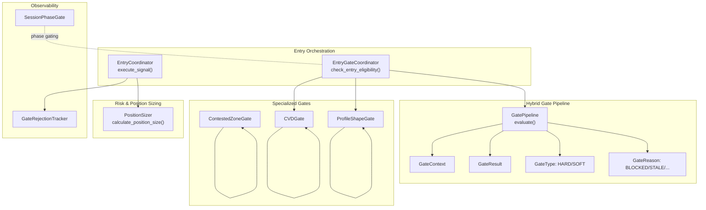
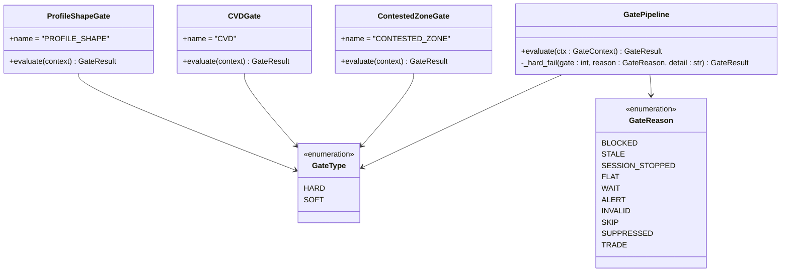
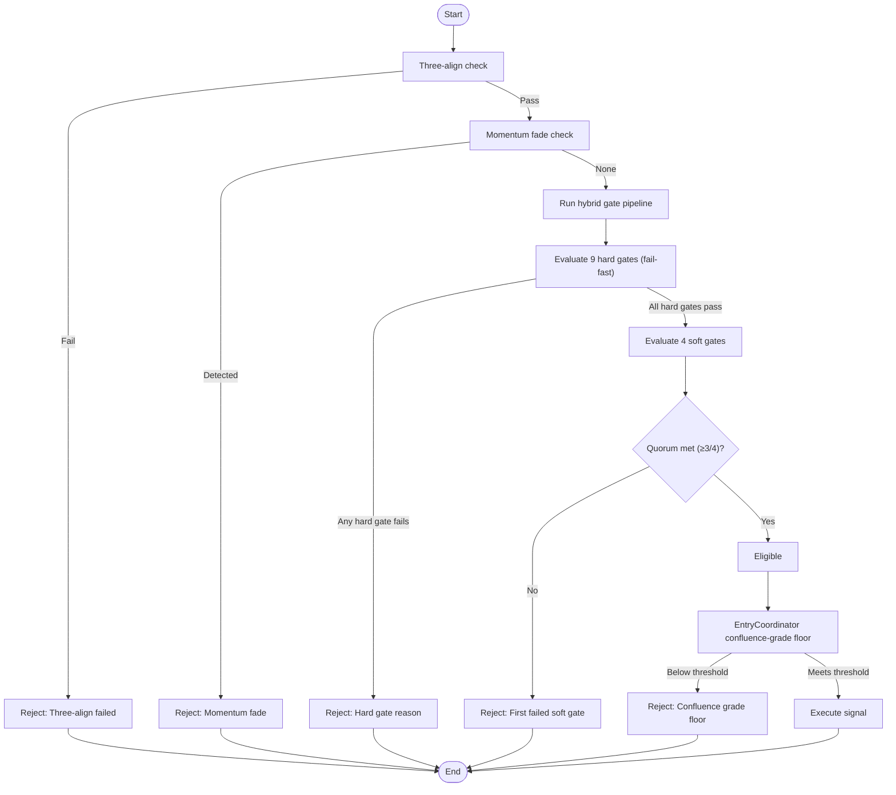
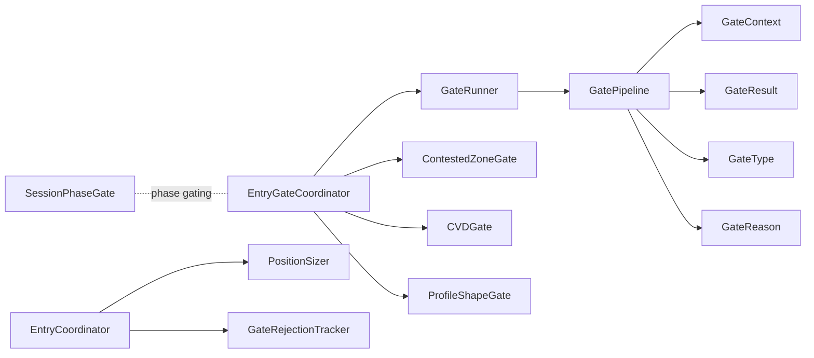

# Gate Pipeline

<cite>
**Referenced Files in This Document**
- [gate_pipeline.py](file://backend/app/domain/fabio_ai/services/gate_pipeline.py)
- [constants.py](file://backend/app/domain/constants.py)
- [entry_gate_coordinator.py](file://backend/app/application/handlers/entry_gate_coordinator.py)
- [gate_runner.py](file://backend/app/domain/fabio_ai/services/entry_gates/gate_runner.py)
- [contested_zone_gate.py](file://backend/app/domain/fabio_ai/services/gates/contested_zone_gate.py)
- [cvd_gate.py](file://backend/app/domain/fabio_ai/services/gates/cvd_gate.py)
- [profile_shape_gate.py](file://backend/app/domain/fabio_ai/services/gates/profile_shape_gate.py)
- [gate_rejection_tracker.py](file://backend/app/domain/services/gate_rejection_tracker.py)
- [session_phase_gate.py](file://backend/app/domain/services/session_phase_gate.py)
- [entry_coordinator.py](file://backend/app/application/services/entry_coordinator.py)
</cite>

## Update Summary
**Changes Made**
- Updated to reflect new hybrid hard/soft gate pipeline with 9 hard gates and 4 soft gates using quorum scoring (3/4 must pass)
- Revised gate evaluation sequence from sequential 12-gate to hybrid approach with fail-fast hard gates and quorum-based soft gates
- Added comprehensive documentation for new GateType enumeration (HARD/SOFT) and GateReason categories
- Updated architecture diagrams to show hybrid pipeline structure
- Enhanced troubleshooting guidance for quorum scoring behavior
- Revised performance considerations for hybrid evaluation logic

## Table of Contents
1. [Introduction](#introduction)
2. [Project Structure](#project-structure)
3. [Core Components](#core-components)
4. [Architecture Overview](#architecture-overview)
5. [Detailed Component Analysis](#detailed-component-analysis)
6. [Dependency Analysis](#dependency-analysis)
7. [Performance Considerations](#performance-considerations)
8. [Troubleshooting Guide](#troubleshooting-guide)
9. [Conclusion](#conclusion)

## Introduction
This document explains the Gate Pipeline component that validates trading opportunities through a hybrid hard/soft gate system. The pipeline implements Fabio's AMT specification with a 4-rule checklist where 3 out of 4 soft gates must pass using quorum scoring. It covers the hybrid evaluation approach, fail-fast hard gates for safety/risk, quorum-based soft gates for strategy quality, integration with specialized gates, scoring mechanisms, and the overall pipeline architecture.

## Project Structure
The Gate Pipeline sits within the Fabio AI entry validation subsystem and integrates with broader trading orchestration:

- Entry orchestration and gating:
  - EntryGateCoordinator coordinates gating and three-align checks, momentum fade, and the hybrid gate pipeline.
  - Entry coordinator executes validated signals and enforces a confluence-grade floor.
- Hybrid gate pipeline:
  - 9 fail-fast hard gates for safety/risk enforcement
  - 4 soft gates with quorum scoring (minimum 3/4 must pass)
  - Centralized evaluation returning immediate failure reasons for hard gates and quorum outcomes for soft gates
- Specialized gates:
  - Contested zone, CVD, and profile shape gates implement additional safety checks
- Observability and session controls:
  - Gate rejection tracker provides per-gate, per-symbol statistics
  - Session phase gate enforces IST trading phases and actions



**Diagram sources**
- [entry_gate_coordinator.py:32-125](file://backend/app/application/handlers/entry_gate_coordinator.py#L32-L125)
- [gate_pipeline.py:174-381](file://backend/app/domain/fabio_ai/services/gate_pipeline.py#L174-L381)
- [constants.py:204-205](file://backend/app/domain/constants.py#L204-L205)
- [contested_zone_gate.py:16-73](file://backend/app/domain/fabio_ai/services/gates/contested_zone_gate.py#L16-L73)
- [cvd_gate.py:20-60](file://backend/app/domain/fabio_ai/services/gates/cvd_gate.py#L20-L60)
- [profile_shape_gate.py:17-56](file://backend/app/domain/fabio_ai/services/gates/profile_shape_gate.py#L17-L56)
- [gate_rejection_tracker.py:39-120](file://backend/app/domain/services/gate_rejection_tracker.py#L39-L120)
- [session_phase_gate.py:66-205](file://backend/app/domain/services/session_phase_gate.py#L66-L205)
- [entry_coordinator.py:66-286](file://backend/app/application/services/entry_coordinator.py#L66-L286)

**Section sources**
- [gate_pipeline.py:1-25](file://backend/app/domain/fabio_ai/services/gate_pipeline.py#L1-L25)
- [entry_gate_coordinator.py:25-125](file://backend/app/application/handlers/entry_gate_coordinator.py#L25-L125)
- [constants.py:204-205](file://backend/app/domain/constants.py#L204-L205)

## Core Components
- GatePipeline: Hybrid 12-gate evaluation with fail-fast hard gates (9 gates) and quorum-based soft gates (4 gates). Returns immediately on hard gate failure, evaluates soft gates separately with quorum scoring.
- GateContext: Immutable data container aggregating all inputs required by the pipeline with 13 gate positions (0-12).
- GateResult: Encapsulates pass/fail outcome, detailed quorum diagnostics, and derived setup metadata.
- GateType: Enumeration distinguishing HARD gates (fail-fast) vs SOFT gates (quorum scoring).
- GateReason: Comprehensive reason categories including BLOCKED, STALE, SESSION_STOPPED, FLAT, WAIT, ALERT, INVALID, SKIP, SUPPRESSED, and TRADE.
- GateRunner: Builds GateContext from AMT and tick data, computes derived metrics, and invokes GatePipeline.
- Specialized gates:
  - ContestedZoneGate: Detects stacked imbalances on both sides and blocks entries.
  - CVDGate: Blocks entries when CVD slope strongly opposes direction.
  - ProfileShapeGate: Blocks entries that oppose dominant distribution shape.
- EntryGateCoordinator: Orchestrates three-align, momentum fade, hybrid gate pipeline, CVD hard gate, and profile shape gate.
- GateRejectionTracker: Tracks per-gate, per-symbol rejection statistics for observability.
- SessionPhaseGate: Enforces IST trading phases and allowed actions.

**Section sources**
- [gate_pipeline.py:49-161](file://backend/app/domain/fabio_ai/services/gate_pipeline.py#L49-L161)
- [gate_pipeline.py:174-381](file://backend/app/domain/fabio_ai/services/gate_pipeline.py#L174-L381)
- [constants.py:204-205](file://backend/app/domain/constants.py#L204-L205)
- [entry_gate_coordinator.py:25-125](file://backend/app/application/handlers/entry_gate_coordinator.py#L25-L125)

## Architecture Overview
The hybrid Gate Pipeline architecture separates safety/risk enforcement from strategy quality evaluation:

- EntryGateCoordinator orchestrates gating and prepares context for GateRunner.
- GateRunner constructs GateContext and derives metrics, then calls GatePipeline with hybrid evaluation.
- GatePipeline evaluates 9 hard gates using fail-fast logic; first failure returns immediately.
- Soft gates are evaluated separately with quorum scoring (minimum 3 of 4 must pass).
- Specialized gates integrate via EntryGate base class for additional safety checks.
- EntryCoordinator executes signals only after hybrid gating passes.

```mermaid
sequenceDiagram
participant Tick as "Tick Source"
participant EGC as "EntryGateCoordinator"
participant GR as "GateRunner"
participant GP as "GatePipeline"
participant EC as "EntryCoordinator"
Tick->>EGC : "New tick + AMT result"
EGC->>EGC : "three_align_check()"
alt "Three-align fails"
EGC-->>Tick : "Not eligible (Three-Align gate failed)"
else "Three-align passes"
EGC->>EGC : "check_momentum_fade()"
alt "Momentum fade detected"
EGC-->>Tick : "Not eligible (Momentum fade)"
else "No momentum fade"
EGC->>GR : "run_gate_pipeline(...)"
GR->>GP : "evaluate(GateContext)"
alt "Hard gate fails (fail-fast)"
GP-->>EGC : "(passed=False, reason, detail)"
EGC-->>Tick : "Not eligible (hard gate reason)"
else "All hard gates pass"
GP->>GP : "Evaluate 4 soft gates with quorum"
alt "Quorum not met (3/4 minimum)"
GP-->>EGC : "(passed=False, reason from first failed soft gate)"
EGC-->>Tick : "Not eligible (soft gate quorum)"
else "Quorum met (3/4 minimum)"
GP-->>GR : "(passed=True, reason=TRADE, detail)"
GR-->>EGC : "Eligible"
EGC->>EC : "execute_signal(signal)"
EC-->>Tick : "Position opened or logged"
end
end
end
```

**Diagram sources**
- [entry_gate_coordinator.py:32-125](file://backend/app/application/handlers/entry_gate_coordinator.py#L32-L125)
- [gate_runner.py:6-95](file://backend/app/domain/fabio_ai/services/entry_gates/gate_runner.py#L6-L95)
- [gate_pipeline.py:181-381](file://backend/app/domain/fabio_ai/services/gate_pipeline.py#L181-L381)
- [entry_coordinator.py:66-286](file://backend/app/application/services/entry_coordinator.py#L66-L286)

## Detailed Component Analysis

### Hybrid Gate Pipeline Evaluation Sequence and Conditional Logic
The hybrid pipeline implements Fabio's AMT specification with fail-fast hard gates and quorum-based soft gates:

**Hard Gates (Fail-Fast - 9 gates):**
- Gate 0: Session time filter (warm-up) → BLOCKED
- Gate 1: Data quality (STALE, gap > 30s) → STALE  
- Gate 2: Session risk (daily loss, drawdown) → SESSION_STOPPED
- Gate 3: NO_TRADE state (POC ± 2 ticks) → FLAT
- Gate 4: PROBING state (unconfirmed break) → FLAT
- Gate 5: Profile + key level identified → WAIT
- Gate 7: Drive validation (first drive rejected, level exhaustion) → FLAT/ALERT
- Gate 11: Position sizing validation → BLOCKED
- Gate 12: EIA release window → SUPPRESSED

**Soft Gates (Quorum Scoring - 4 gates, minimum 3/4 must pass):**
- Gate 6: Price at entry zone (within 3 ticks) → ALERT (strategy quality)
- Gate 8: Aggression ≥ 2.0 → WAIT (strategy quality)
- Gate 9: Cushion ≤ 10 ticks → INVALID (strategy quality)
- Gate 10: R:R ≥ 1.5 → SKIP (strategy quality)

**Quorum Configuration:**
- Default minimum: 3 of 4 soft gates must pass
- Configurable via SOFT_GATE_QUORUM constant (default: 3)
- First failed soft gate determines the reported reason when quorum fails

Pass/fail criteria:
- Hard gates: immediate failure on first gate failure
- Soft gates: pass/fail determined individually, then evaluated for quorum
- On hard gate failure: returns immediately with reason and detail
- On soft gate quorum failure: returns with reason from first failed soft gate
- On success: returns TRADE with setup type and R:R

**Section sources**
- [gate_pipeline.py:6-25](file://backend/app/domain/fabio_ai/services/gate_pipeline.py#L6-L25)
- [gate_pipeline.py:184-247](file://backend/app/domain/fabio_ai/services/gate_pipeline.py#L184-L247)
- [gate_pipeline.py:248-308](file://backend/app/domain/fabio_ai/services/gate_pipeline.py#L248-L308)
- [constants.py:204-205](file://backend/app/domain/constants.py#L204-L205)

### Integration with Entry Gates: Contested Zone, CVD, and Profile Shape
The hybrid pipeline integrates specialized safety gates alongside the core validation:

- ContestedZoneGate: Scans footprint levels for stacked imbalances on both sides and blocks entries when both are present.
- CVDGate: Blocks entries when CVD slope strongly opposes the intended direction, using exchange-specific thresholds.
- ProfileShapeGate: Blocks entries that oppose the dominant distribution shape (P-shape for LONG, b-shape for SHORT).

These gates complement the hybrid pipeline by providing additional safety checks beyond the core 12-gate structure.



**Diagram sources**
- [gate_pipeline.py:49-69](file://backend/app/domain/fabio_ai/services/gate_pipeline.py#L49-L69)
- [gate_pipeline.py:174-180](file://backend/app/domain/fabio_ai/services/gate_pipeline.py#L174-L180)
- [contested_zone_gate.py:16-73](file://backend/app/domain/fabio_ai/services/gates/contested_zone_gate.py#L16-L73)
- [cvd_gate.py:20-60](file://backend/app/domain/fabio_ai/services/gates/cvd_gate.py#L20-L60)
- [profile_shape_gate.py:17-56](file://backend/app/domain/fabio_ai/services/gates/profile_shape_gate.py#L17-L56)

**Section sources**
- [contested_zone_gate.py:16-73](file://backend/app/domain/fabio_ai/services/gates/contested_zone_gate.py#L16-L73)
- [cvd_gate.py:20-60](file://backend/app/domain/fabio_ai/services/gates/cvd_gate.py#L20-L60)
- [profile_shape_gate.py:17-56](file://backend/app/domain/fabio_ai/services/gates/profile_shape_gate.py#L17-L56)
- [gate_pipeline.py:49-69](file://backend/app/domain/fabio_ai/services/gate_pipeline.py#L49-L69)

### Practical Gate Evaluation Workflows
- Workflow A: Hybrid eligibility check
  - EntryGateCoordinator performs three-align, momentum fade, and runs the hybrid gate pipeline.
  - Hard gates fail-fast; soft gates evaluated with quorum scoring.
  - If any hard gate fails, returns immediately with reason.
  - If quorum not met, returns with reason from first failed soft gate.
- Workflow B: Specialized gate integration
  - ContestedZoneGate, CVDGate, and ProfileShapeGate provide additional safety checks.
  - These gates operate independently of the hybrid pipeline but complement it.
- Workflow C: Position sizing and risk management
  - GateRunner computes derived metrics (R:R, distance to level) and sets position sizing validation.
  - EntryCoordinator enforces a confluence-grade floor before executing signals.



**Diagram sources**
- [entry_gate_coordinator.py:32-125](file://backend/app/application/handlers/entry_gate_coordinator.py#L32-L125)
- [gate_runner.py:6-95](file://backend/app/domain/fabio_ai/services/entry_gates/gate_runner.py#L6-L95)
- [gate_pipeline.py:181-381](file://backend/app/domain/fabio_ai/services/gate_pipeline.py#L181-L381)
- [entry_coordinator.py:66-111](file://backend/app/application/services/entry_coordinator.py#L66-L111)

**Section sources**
- [entry_gate_coordinator.py:32-125](file://backend/app/application/handlers/entry_gate_coordinator.py#L32-L125)
- [gate_runner.py:6-95](file://backend/app/domain/fabio_ai/services/entry_gates/gate_runner.py#L6-L95)
- [entry_coordinator.py:66-111](file://backend/app/application/services/entry_coordinator.py#L66-L111)

### Custom Gate Implementation
To add a new gate to the hybrid pipeline:

**For Safety/Risk Gates (Hard Gates):**
- Create a class inheriting from EntryGate and implement evaluate(context) -> GateResult.
- Integrate into GatePipeline hard gate evaluation sequence.
- Use appropriate GateReason category (BLOCKED, STALE, SESSION_STOPPED, etc.).

**For Strategy Quality Gates (Soft Gates):**
- Implement evaluate(context) -> GateResult with GateReason categories (ALERT, WAIT, INVALID, SKIP).
- Soft gates automatically participate in quorum scoring.
- Configure quorum requirements via SOFT_GATE_QUORUM constant.

**Implementation steps:**
- Define gate logic in evaluate(context) using fields from GateContext.
- Return a GateResult with passed flag, reason, and detail.
- Add to appropriate evaluation sequence (hard vs soft gates).
- Use GateRejectionTracker to monitor rejection rates per symbol and gate.

**Section sources**
- [gate_pipeline.py:49-69](file://backend/app/domain/fabio_ai/services/gate_pipeline.py#L49-L69)
- [constants.py:204-205](file://backend/app/domain/constants.py#L204-L205)
- [gate_rejection_tracker.py:39-120](file://backend/app/domain/services/gate_rejection_tracker.py#L39-L120)

### Relationship with Position Sizing and Risk Management
- GateRunner computes R:R and distance-to-level, populating GateContext for GatePipeline.
- GatePipeline's GateContext includes position_size_ok; Gate 11 blocks entries if sizing fails.
- EntryCoordinator enforces a confluence-grade floor before executing signals and logs rejections.
- GateRunner also exposes calculate_position_size for external sizing calculations.

**Section sources**
- [gate_runner.py:6-95](file://backend/app/domain/fabio_ai/services/entry_gates/gate_runner.py#L6-L95)
- [gate_pipeline.py:240-243](file://backend/app/domain/fabio_ai/services/gate_pipeline.py#L240-L243)
- [entry_coordinator.py:66-111](file://backend/app/application/services/entry_coordinator.py#L66-L111)

## Dependency Analysis
- EntryGateCoordinator depends on:
  - Three-align and momentum fade checks.
  - GateRunner for the hybrid gate pipeline.
  - Hard gates (CVD and profile shape) implemented in EntryGateCoordinator.
- GateRunner depends on:
  - GatePipeline for hybrid evaluation.
  - EIACalendar for EIA window checks.
  - MarketState mapping and derived metrics.
- GatePipeline depends on:
  - GateContext thresholds and inputs.
  - Constants for thresholds (aggression, R:R, cushion, soft gate quorum).
- Specialized gates depend on:
  - EntryGate base and GateContext fields.
- EntryCoordinator depends on:
  - Risk coordinator for entry validation.
  - Option selector for enrichment.
  - Event logger and storage for persistence.



**Diagram sources**
- [entry_gate_coordinator.py:32-125](file://backend/app/application/handlers/entry_gate_coordinator.py#L32-L125)
- [gate_runner.py:6-95](file://backend/app/domain/fabio_ai/services/entry_gates/gate_runner.py#L6-L95)
- [gate_pipeline.py:174-381](file://backend/app/domain/fabio_ai/services/gate_pipeline.py#L174-L381)
- [entry_coordinator.py:66-286](file://backend/app/application/services/entry_coordinator.py#L66-L286)
- [session_phase_gate.py:66-205](file://backend/app/domain/services/session_phase_gate.py#L66-L205)

**Section sources**
- [entry_gate_coordinator.py:32-125](file://backend/app/application/handlers/entry_gate_coordinator.py#L32-L125)
- [gate_runner.py:6-95](file://backend/app/domain/fabio_ai/services/entry_gates/gate_runner.py#L6-L95)
- [gate_pipeline.py:174-381](file://backend/app/domain/fabio_ai/services/gate_pipeline.py#L174-L381)
- [entry_coordinator.py:66-286](file://backend/app/application/services/entry_coordinator.py#L66-L286)
- [session_phase_gate.py:66-205](file://backend/app/domain/services/session_phase_gate.py#L66-L205)

## Performance Considerations
- Fail-fast optimization: GatePipeline returns immediately on the first hard gate failure, minimizing unnecessary computations.
- Quorum early exit: Soft gate evaluation continues even after quorum is met to log all results for diagnostics.
- Lightweight context building: GateRunner aggregates minimal required data to construct GateContext efficiently.
- Threshold-driven logic: Gates rely on simple comparisons and thresholds, avoiding heavy ML inference during gating.
- Observability overhead: GateRejectionTracker is zero-cost when disabled (caller checks enable flag before recording).
- Session phase gating: SessionPhaseGate avoids model evaluation outside allowed windows, reducing downstream work.
- Memory efficiency: GateContext uses dataclasses with field defaults to minimize memory overhead.

## Troubleshooting Guide
Common issues and diagnostics:

**Excessive rejections by hard gates:**
- Use GateRejectionTracker to identify top killers per symbol and adjust thresholds accordingly.
- Review hard gate failure patterns (BLOCKED, STALE, SESSION_STOPPED, FLAT, ALERT, SUPPRESSED).

**Quorum scoring issues:**
- Monitor soft gate quorum diagnostics in GateResult (soft_gates_total, soft_gates_passed, quorum_met).
- Adjust SOFT_GATE_QUORUM constant based on market conditions.
- Review first failed soft gate reason when quorum fails.

**Frequent EIA window suppressions:**
- Review EIA calendar configuration and symbol-specific suppression windows.
- Check GateContext.eia_window_active flag.

**Session risk halts:**
- Investigate daily drawdown limits and halt reasons reported by GatePipeline.
- Review GateContext.is_risk_halted and halt_reason fields.

**Confluence-grade floor blocking:**
- EntryCoordinator logs rejections when grade scores fall below the minimum threshold.
- Review AMT-grade scoring and feature drivers.

**Phase gating:**
- SessionPhaseGate can block all model evaluation outside allowed windows.
- Confirm IST timing and event dates.

**Operational tips:**
- Enable GateRejectionTracker during tuning sessions to quantify gate impact.
- Temporarily relax thresholds to isolate noisy symbols.
- Verify tick age and data freshness to avoid STALE outcomes.
- Monitor quorum metrics to ensure proper soft gate balancing.

**Section sources**
- [gate_rejection_tracker.py:39-120](file://backend/app/domain/services/gate_rejection_tracker.py#L39-L120)
- [gate_pipeline.py:309-381](file://backend/app/domain/fabio_ai/services/gate_pipeline.py#L309-L381)
- [entry_coordinator.py:81-111](file://backend/app/application/services/entry_coordinator.py#L81-L111)
- [session_phase_gate.py:103-205](file://backend/app/domain/services/session_phase_gate.py#L103-L205)

## Conclusion
The hybrid Gate Pipeline provides a robust, extensible framework for validating trading opportunities using Fabio's AMT specification. Its fail-fast hard gate system (9 gates) enforces safety/risk requirements, while the quorum-based soft gate system (4 gates with minimum 3/4 passing) evaluates strategy quality. The pipeline's modular design allows for easy addition of new gates, configurable quorum requirements, and comprehensive observability. Integration with EntryGateCoordinator and EntryCoordinator ensures disciplined execution and risk management, while the hybrid approach optimizes both safety and flexibility in trading opportunity validation.