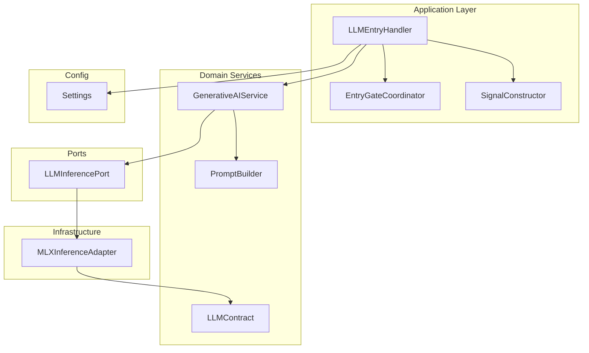
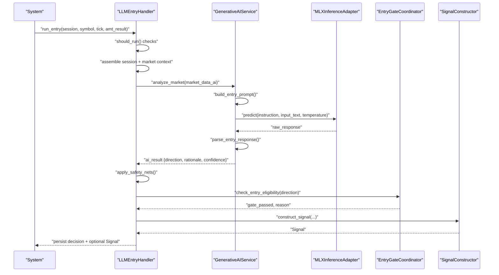
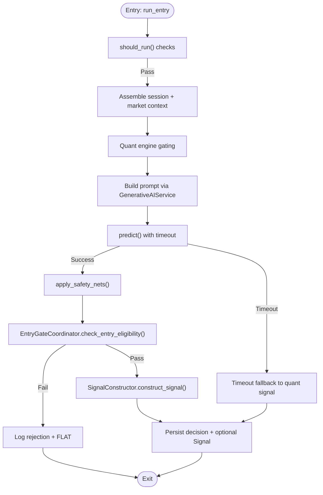
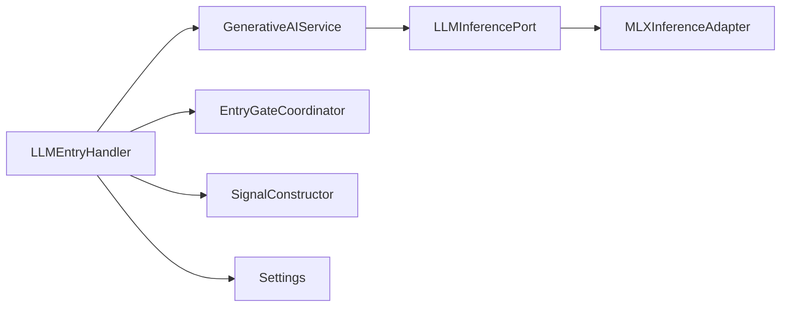

# LLM Entry Handler

<cite>
**Referenced Files in This Document**
- [llm_entry_handler.py](file://backend/app/application/handlers/llm_entry_handler.py)
- [generative_ai_service.py](file://backend/app/domain/fabio_ai/services/generative_ai_service.py)
- [prompt_builder.py](file://backend/app/domain/fabio_ai/services/prompt_builder.py)
- [mlx_inference_adapter.py](file://backend/app/infrastructure/adapters/mlx_inference_adapter.py)
- [llm_inference.py](file://backend/app/domain/ports/llm_inference.py)
- [config.py](file://backend/app/config.py)
- [entry_gate_coordinator.py](file://backend/app/application/handlers/entry_gate_coordinator.py)
- [signal_constructor.py](file://backend/app/application/handlers/signal_constructor.py)
- [llm_contract.py](file://backend/app/domain/fabio_ai/services/llm_contract.py)
</cite>

## Table of Contents
1. [Introduction](#introduction)
2. [Project Structure](#project-structure)
3. [Core Components](#core-components)
4. [Architecture Overview](#architecture-overview)
5. [Detailed Component Analysis](#detailed-component-analysis)
6. [Dependency Analysis](#dependency-analysis)
7. [Performance Considerations](#performance-considerations)
8. [Troubleshooting Guide](#troubleshooting-guide)
9. [Conclusion](#conclusion)

## Introduction
The LLM Entry Handler is responsible for orchestrating AI-driven trading decisions at the entry stage. It integrates with a generative AI service to interpret market structure and orderflow, applies safety nets and session gating, validates entry opportunities via a gate coordinator, constructs signals with rich metadata, and persists decisions for auditability. The handler ensures robust inference behavior under timeouts, model readiness constraints, and extreme volatility conditions, while delegating specialized logic to modular components.

## Project Structure
The LLM Entry Handler lives in the application layer and coordinates with domain services and infrastructure adapters:
- Application handlers: LLM Entry Handler, Entry Gate Coordinator, Signal Constructor
- Domain services: Generative AI Service, Prompt Builder, LLM Contract
- Infrastructure adapter: MLX Inference Adapter (Apple Silicon) with cloud fallback
- Ports: LLM Inference Port abstraction
- Configuration: Temperature, token limits, and backend selection

**Diagram sources**
- [llm_entry_handler.py:61-1082](file://backend/app/application/handlers/llm_entry_handler.py#L61-L1082)
- [generative_ai_service.py:26-99](file://backend/app/domain/fabio_ai/services/generative_ai_service.py#L26-L99)
- [prompt_builder.py:261-283](file://backend/app/domain/fabio_ai/services/prompt_builder.py#L261-L283)
- [mlx_inference_adapter.py:12-396](file://backend/app/infrastructure/adapters/mlx_inference_adapter.py#L12-L396)
- [llm_inference.py:10-42](file://backend/app/domain/ports/llm_inference.py#L10-L42)
- [config.py:92-125](file://backend/app/config.py#L92-L125)

**Section sources**
- [llm_entry_handler.py:61-1082](file://backend/app/application/handlers/llm_entry_handler.py#L61-L1082)
- [generative_ai_service.py:26-99](file://backend/app/domain/fabio_ai/services/generative_ai_service.py#L26-L99)
- [prompt_builder.py:261-283](file://backend/app/domain/fabio_ai/services/prompt_builder.py#L261-L283)
- [mlx_inference_adapter.py:12-396](file://backend/app/infrastructure/adapters/mlx_inference_adapter.py#L12-L396)
- [llm_inference.py:10-42](file://backend/app/domain/ports/llm_inference.py#L10-L42)
- [config.py:92-125](file://backend/app/config.py#L92-L125)

## Core Components
- LLMEntryHandler: Central coordinator that builds prompts, invokes inference, applies safety nets, checks gates, constructs signals, and persists decisions.
- GenerativeAIService: Wraps the LLM adapter, builds entry prompts, caches responses, and parses canonical JSON outputs.
- MLXInferenceAdapter: Local Apple Silicon inference adapter with cloud fallback, deterministic prefill, and runtime-contract enforcement.
- EntryGateCoordinator: Validates entries via three-align, momentum fade, gate pipeline, CVD hard gate, and profile shape gate.
- SignalConstructor: Builds validated signals with enriched metadata, trade thesis, and grade scores.
- LLMInferencePort: Abstraction for inference readiness and execution.
- LLMContract: Defines canonical JSON schema and runtime reminder for entry responses.
- Config: Provides temperature, token limits, and backend selection.

**Section sources**
- [llm_entry_handler.py:61-1082](file://backend/app/application/handlers/llm_entry_handler.py#L61-L1082)
- [generative_ai_service.py:26-99](file://backend/app/domain/fabio_ai/services/generative_ai_service.py#L26-L99)
- [mlx_inference_adapter.py:12-396](file://backend/app/infrastructure/adapters/mlx_inference_adapter.py#L12-L396)
- [entry_gate_coordinator.py:25-235](file://backend/app/application/handlers/entry_gate_coordinator.py#L25-L235)
- [signal_constructor.py:32-275](file://backend/app/application/handlers/signal_constructor.py#L32-L275)
- [llm_inference.py:10-42](file://backend/app/domain/ports/llm_inference.py#L10-L42)
- [llm_contract.py:24-47](file://backend/app/domain/fabio_ai/services/llm_contract.py#L24-L47)
- [config.py:92-125](file://backend/app/config.py#L92-L125)

## Architecture Overview
The LLM Entry Handler participates in a multi-stage decision pipeline:
1. Session gating and context assembly
2. Quant engine gating and session hints
3. Prompt construction and caching
4. Inference with timeout and fallback
5. Safety nets and direction overrides
6. Gate validation and rejection logging
7. Signal construction and persistence

**Diagram sources**
- [llm_entry_handler.py:379-1034](file://backend/app/application/handlers/llm_entry_handler.py#L379-L1034)
- [generative_ai_service.py:53-98](file://backend/app/domain/fabio_ai/services/generative_ai_service.py#L53-L98)
- [mlx_inference_adapter.py:184-265](file://backend/app/infrastructure/adapters/mlx_inference_adapter.py#L184-L265)
- [entry_gate_coordinator.py:32-125](file://backend/app/application/handlers/entry_gate_coordinator.py#L32-L125)
- [signal_constructor.py:39-111](file://backend/app/application/handlers/signal_constructor.py#L39-L111)

## Detailed Component Analysis

### LLMEntryHandler
Responsibilities:
- Gate coordination and session-awareness
- Market context enrichment and gating
- Parallel per-symbol LLM queues and worker threads
- Timeout handling and fallback logic
- Safety nets (buy-only mode, VWAP extremes)
- Gate validation and signal construction
- Persistence and journaling

Key behaviors:
- Per-symbol bounded queue prevents storming during regime changes.
- Dedicated worker thread processes LLM requests sequentially for a symbol.
- Extends cooldown to mitigate rate limiting and error loops.
- Applies volatility bypass and quant fallback when appropriate.
- Enforces safety nets post-inference.

**Diagram sources**
- [llm_entry_handler.py:379-1034](file://backend/app/application/handlers/llm_entry_handler.py#L379-L1034)
- [entry_gate_coordinator.py:32-125](file://backend/app/application/handlers/entry_gate_coordinator.py#L32-L125)
- [signal_constructor.py:39-111](file://backend/app/application/handlers/signal_constructor.py#L39-L111)

**Section sources**
- [llm_entry_handler.py:61-1082](file://backend/app/application/handlers/llm_entry_handler.py#L61-L1082)

### GenerativeAIService
Responsibilities:
- Prompt construction for entry decisions
- Canonical JSON parsing with fallbacks
- Caching of identical prompts to reduce inference cost
- Consistent runtime contract enforcement

Highlights:
- Uses a default instruction aligned with Fabio’s AMT methodology.
- Caches responses keyed by MD5 of the prompt input.
- Parses JSON with robust fixes for common LLM formatting issues.
- Normalizes outputs to a canonical set of keys.

**Section sources**
- [generative_ai_service.py:26-99](file://backend/app/domain/fabio_ai/services/generative_ai_service.py#L26-L99)
- [prompt_builder.py:261-283](file://backend/app/domain/fabio_ai/services/prompt_builder.py#L261-L283)
- [llm_contract.py:24-47](file://backend/app/domain/fabio_ai/services/llm_contract.py#L24-L47)

### MLXInferenceAdapter
Responsibilities:
- Local Apple Silicon inference with MLX
- Cloud fallback via OpenRouter when no local model is available
- Deterministic prefill to enforce JSON output
- Runtime-contract enforcement and overseer truncation
- GPU lock to serialize concurrent generations

Highlights:
- Background loading avoids startup delays.
- Exponential backoff for rate-limited cloud fallback.
- Validates readiness and supports wait-until-ready semantics.

**Section sources**
- [mlx_inference_adapter.py:12-396](file://backend/app/infrastructure/adapters/mlx_inference_adapter.py#L12-L396)
- [llm_inference.py:10-42](file://backend/app/domain/ports/llm_inference.py#L10-L42)

### EntryGateCoordinator
Responsibilities:
- Three-align gate and second-drive confirmation
- Momentum fade detection
- Gate pipeline validation
- CVD hard gate and profile shape gate
- VWAP bias checks

**Section sources**
- [entry_gate_coordinator.py:25-235](file://backend/app/application/handlers/entry_gate_coordinator.py#L25-L235)

### SignalConstructor
Responsibilities:
- Construct validated signals from LLM decisions
- Enrich metadata with trade thesis, grade scores, and conviction multipliers
- Validate R:R ratios and required fields

**Section sources**
- [signal_constructor.py:32-275](file://backend/app/application/handlers/signal_constructor.py#L32-L275)

### Configuration and Inference Parameters
- Backend selection: MLX or cloud fallback
- Temperature settings: entry-specific temperature tuned for deterministic interpretation
- Token limits and timeout controls
- Model paths for base and reasoning models

**Section sources**
- [config.py:92-125](file://backend/app/config.py#L92-L125)

## Dependency Analysis
The LLM Entry Handler depends on:
- GenerativeAIService for prompt building and inference
- EntryGateCoordinator for gate validation
- SignalConstructor for signal creation
- MLXInferenceAdapter via LLMInferencePort for execution
- Config for runtime parameters

**Diagram sources**
- [llm_entry_handler.py:61-1082](file://backend/app/application/handlers/llm_entry_handler.py#L61-L1082)
- [generative_ai_service.py:26-99](file://backend/app/domain/fabio_ai/services/generative_ai_service.py#L26-L99)
- [mlx_inference_adapter.py:12-396](file://backend/app/infrastructure/adapters/mlx_inference_adapter.py#L12-L396)
- [llm_inference.py:10-42](file://backend/app/domain/ports/llm_inference.py#L10-L42)
- [config.py:92-125](file://backend/app/config.py#L92-L125)

**Section sources**
- [llm_entry_handler.py:61-1082](file://backend/app/application/handlers/llm_entry_handler.py#L61-L1082)
- [generative_ai_service.py:26-99](file://backend/app/domain/fabio_ai/services/generative_ai_service.py#L26-L99)
- [mlx_inference_adapter.py:12-396](file://backend/app/infrastructure/adapters/mlx_inference_adapter.py#L12-L396)
- [llm_inference.py:10-42](file://backend/app/domain/ports/llm_inference.py#L10-L42)
- [config.py:92-125](file://backend/app/config.py#L92-L125)

## Performance Considerations
- Parallelism: One worker thread per symbol with bounded queues prevents overload and throttles concurrent inference storms.
- Caching: GenerativeAIService caches identical prompts to reduce repeated inference.
- Timeout and fallback: Predict executor with timeout and quant fallback avoid stalls and maintain responsiveness.
- GPU serialization: MLX adapter serializes generations to prevent Metal GPU crashes.
- Cooldown: Extended cooldown between LLM calls reduces rate limiting and error-loop amplification.
- Token limits: Controlled max tokens reduce latency and cost.

[No sources needed since this section provides general guidance]

## Troubleshooting Guide
Common issues and mitigations:
- Model not ready: Ensure model path is configured or rely on cloud fallback; use readiness checks and wait-until-ready.
- Timeout errors: Adjust timeout settings and consider quant fallback; monitor queue sizes.
- Empty or malformed responses: GenerativeAIService normalizes outputs; verify prompt schema and runtime reminders.
- Gate rejections: Review gate reasons logged by EntryGateCoordinator; adjust session hints and market filters.
- Safety net overrides: Buy-only mode and VWAP extremes can force FLAT; verify configuration and market conditions.
- Persistence failures: Storage exceptions are handled gracefully; inspect logs for silent failures.

**Section sources**
- [llm_entry_handler.py:821-1048](file://backend/app/application/handlers/llm_entry_handler.py#L821-L1048)
- [generative_ai_service.py:71-98](file://backend/app/domain/fabio_ai/services/generative_ai_service.py#L71-L98)
- [mlx_inference_adapter.py:351-396](file://backend/app/infrastructure/adapters/mlx_inference_adapter.py#L351-L396)
- [entry_gate_coordinator.py:127-187](file://backend/app/application/handlers/entry_gate_coordinator.py#L127-L187)

## Conclusion
The LLM Entry Handler provides a robust, modular pipeline for AI-driven entry decisions. By integrating a generative AI service with strict runtime contracts, applying session-aware gating, enforcing safety nets, and delegating validation and signal construction, it balances interpretability, performance, and reliability. Configuration enables tuning for determinism and cost-efficiency, while caching and bounded concurrency improve throughput and stability.