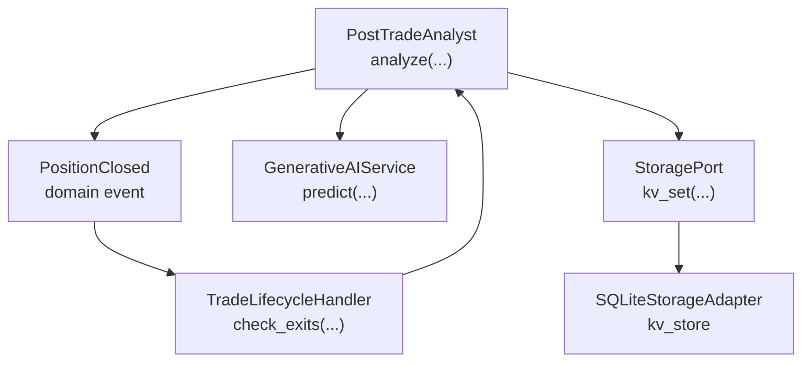
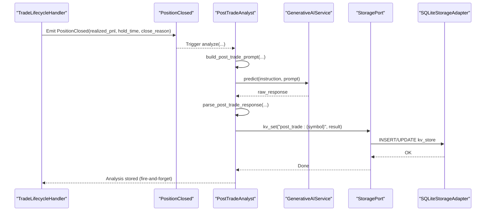
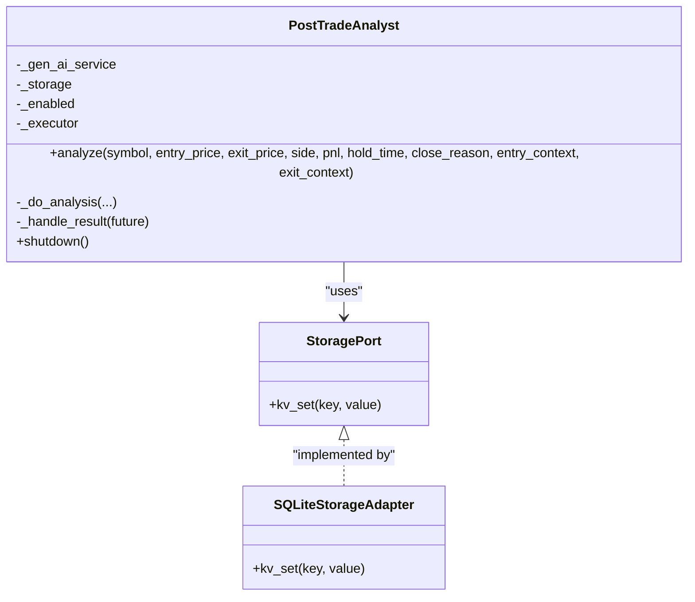
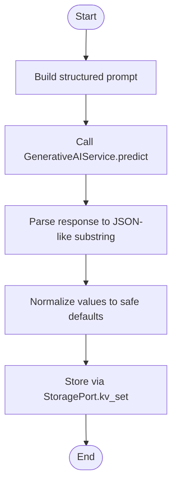
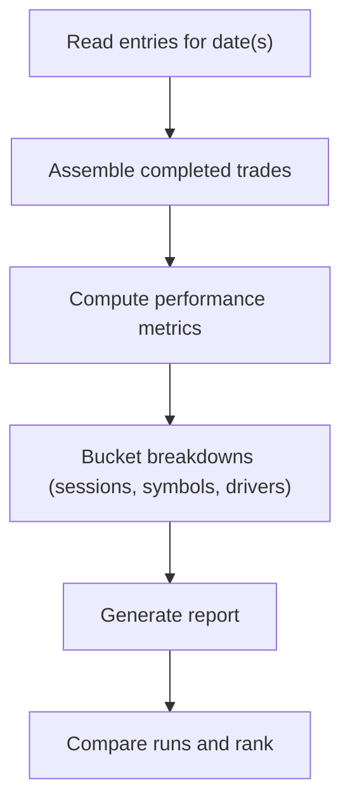
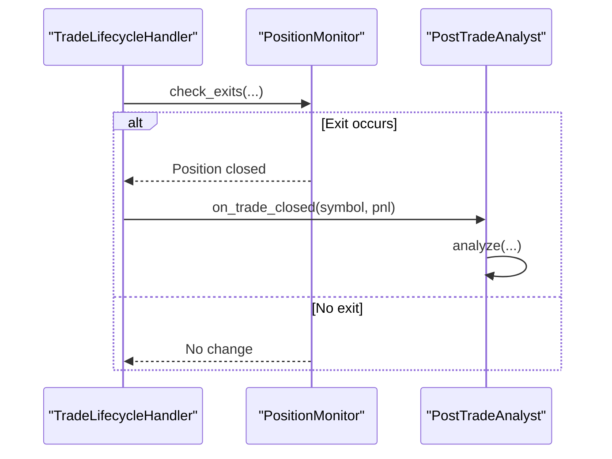
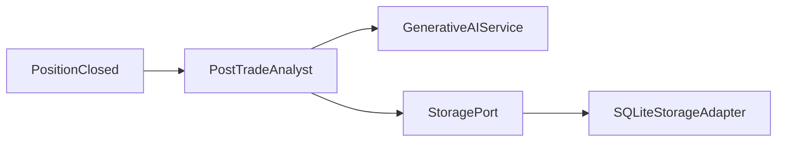

# Post-Trade Analyst

<cite>
**Referenced Files in This Document**
- [post_trade_analyst.py](file://backend/app/application/handlers/post_trade_analyst.py)
- [events.py](file://backend/app/domain/trading/events.py)
- [trade_journal.py](file://backend/app/application/services/trade_journal.py)
- [trade_lifecycle_handler.py](file://backend/app/application/handlers/trade_lifecycle_handler.py)
- [storage.py](file://backend/app/domain/ports/storage.py)
- [database.py](file://backend/app/infrastructure/storage/database.py)
</cite>

## Table of Contents
1. [Introduction](#introduction)
2. [Project Structure](#project-structure)
3. [Core Components](#core-components)
4. [Architecture Overview](#architecture-overview)
5. [Detailed Component Analysis](#detailed-component-analysis)
6. [Dependency Analysis](#dependency-analysis)
7. [Performance Considerations](#performance-considerations)
8. [Troubleshooting Guide](#troubleshooting-guide)
9. [Conclusion](#conclusion)
10. [Appendices](#appendices)

## Introduction
This document explains the Post-Trade Analyst component responsible for analyzing completed trades and generating performance insights. It covers how post-execution evaluations are triggered, how trade quality scores and improvement notes are produced, and how the system integrates with trade journaling and storage systems. It also documents performance metrics computation, analytical reporting, and the relationship with risk management and trade aggregation services.

## Project Structure
The Post-Trade Analyst lives in the application layer and interacts with domain events, storage ports, and the trade lifecycle handler. It is designed to be fire-and-forget and non-blocking, ensuring that post-trade analysis does not delay ongoing trading operations.

**Diagram sources**
- [post_trade_analyst.py:118-262](file://backend/app/application/handlers/post_trade_analyst.py#L118-L262)
- [events.py:374-410](file://backend/app/domain/trading/events.py#L374-L410)
- [trade_lifecycle_handler.py:47-268](file://backend/app/application/handlers/trade_lifecycle_handler.py#L47-L268)
- [storage.py:54-121](file://backend/app/domain/ports/storage.py#L54-L121)
- [database.py:183-800](file://backend/app/infrastructure/storage/database.py#L183-L800)

**Section sources**
- [post_trade_analyst.py:1-262](file://backend/app/application/handlers/post_trade_analyst.py#L1-L262)
- [events.py:1-499](file://backend/app/domain/trading/events.py#L1-L499)
- [trade_lifecycle_handler.py:1-377](file://backend/app/application/handlers/trade_lifecycle_handler.py#L1-L377)
- [storage.py:1-121](file://backend/app/domain/ports/storage.py#L1-L121)
- [database.py:1-861](file://backend/app/infrastructure/storage/database.py#L1-L861)

## Core Components
- PostTradeAnalyst: Non-blocking post-trade analyzer that subscribes to PositionClosed events and produces a quality score, mistake identification, and improvement note. It stores results in a key-value store for downstream consumption.
- Domain Events: PositionClosed encapsulates realized PnL, close reason, and hold duration, enabling post-trade analysis.
- Trade Journal: Comprehensive trade logging and reporting system that captures entry/exit events, computes performance metrics, and supports comparative analysis across runs.
- Storage Port and Adapter: Defines persistence contracts and provides an SQLite-backed implementation for storing post-trade results and other operational data.

Key responsibilities:
- Build a structured post-trade prompt from realized trade data and market context.
- Invoke the generative AI service to produce a JSON-formatted assessment.
- Parse and normalize the response into a standardized result.
- Persist the result via StoragePort for learning and reporting.

**Section sources**
- [post_trade_analyst.py:118-262](file://backend/app/application/handlers/post_trade_analyst.py#L118-L262)
- [events.py:374-410](file://backend/app/domain/trading/events.py#L374-L410)
- [trade_journal.py:84-908](file://backend/app/application/services/trade_journal.py#L84-L908)
- [storage.py:54-121](file://backend/app/domain/ports/storage.py#L54-L121)
- [database.py:183-800](file://backend/app/infrastructure/storage/database.py#L183-L800)

## Architecture Overview
The Post-Trade Analyst participates in a reactive, event-driven trading pipeline. When a position closes, a PositionClosed event is emitted. The TradeLifecycleHandler orchestrates exits and invokes callbacks upon closure. The Post-Trade Analyst receives the event, builds a prompt, queries the generative AI service, parses the response, and persists the result.

**Diagram sources**
- [trade_lifecycle_handler.py:47-268](file://backend/app/application/handlers/trade_lifecycle_handler.py#L47-L268)
- [events.py:374-410](file://backend/app/domain/trading/events.py#L374-L410)
- [post_trade_analyst.py:136-262](file://backend/app/application/handlers/post_trade_analyst.py#L136-L262)
- [storage.py:54-121](file://backend/app/domain/ports/storage.py#L54-L121)
- [database.py:770-783](file://backend/app/infrastructure/storage/database.py#L770-L783)

## Detailed Component Analysis

### PostTradeAnalyst
- Purpose: Fire-and-forget post-trade analysis that evaluates realized trades and produces a quality score, mistake identification, and improvement note.
- Inputs: Trade metadata (symbol, side, entry/exit prices, realized PnL, hold time, close reason) and optional entry/exit context.
- Processing:
  - Build a structured prompt with four sections: trade data, entry context, market state at close, and instruction.
  - Call the generative AI service with a fixed instruction and temperature.
  - Parse the response to extract quality_score, mistake, and improvement; fallback to safe defaults on failure.
  - Persist the result via StoragePort.kv_set under a key derived from the symbol.
- Outputs: Stored post-trade result keyed by symbol for later retrieval and reporting.

**Diagram sources**
- [post_trade_analyst.py:118-262](file://backend/app/application/handlers/post_trade_analyst.py#L118-L262)
- [storage.py:54-121](file://backend/app/domain/ports/storage.py#L54-L121)
- [database.py:770-783](file://backend/app/infrastructure/storage/database.py#L770-L783)

**Section sources**
- [post_trade_analyst.py:118-262](file://backend/app/application/handlers/post_trade_analyst.py#L118-L262)

### Prompt Construction and Parsing
- Prompt construction:
  - Sections: Trade Data, Entry Context, Market at Close, Instruction.
  - Computes derived fields such as absolute PnL and ratio reward.
- Response parsing:
  - Extracts JSON-like substring and normalizes values to safe defaults if parsing fails.

**Diagram sources**
- [post_trade_analyst.py:52-116](file://backend/app/application/handlers/post_trade_analyst.py#L52-L116)
- [post_trade_analyst.py:192-229](file://backend/app/application/handlers/post_trade_analyst.py#L192-L229)

**Section sources**
- [post_trade_analyst.py:52-116](file://backend/app/application/handlers/post_trade_analyst.py#L52-L116)
- [post_trade_analyst.py:192-229](file://backend/app/application/handlers/post_trade_analyst.py#L192-L229)

### Trade Journal Integration and Reporting
- Trade Journal logs all lifecycle events (signals, entries, exits, partial exits, overseer actions) to daily JSONL files.
- Provides methods to compute performance metrics (expectancy, profit factor, gross profit/loss, average win/loss, max drawdown), bucket breakdowns (by session, symbol, feature drivers), and comparative assessments across runs.
- Supports reading entries for a date range, assembling completed trades from entry/exit pairs, and generating detailed reports.

**Diagram sources**
- [trade_journal.py:542-908](file://backend/app/application/services/trade_journal.py#L542-L908)

**Section sources**
- [trade_journal.py:84-908](file://backend/app/application/services/trade_journal.py#L84-L908)

### Relationship with Trade Lifecycle and Risk Management
- The TradeLifecycleHandler manages exits (SL/TP/time-based), partition exits, and CVD-based controls. It invokes callbacks upon trade closure, which the Post-Trade Analyst consumes to trigger analysis.
- Risk management gates (e.g., daily loss limits) influence when positions are closed, affecting the data available to the Post-Trade Analyst.

**Diagram sources**
- [trade_lifecycle_handler.py:47-268](file://backend/app/application/handlers/trade_lifecycle_handler.py#L47-L268)
- [post_trade_analyst.py:136-179](file://backend/app/application/handlers/post_trade_analyst.py#L136-L179)

**Section sources**
- [trade_lifecycle_handler.py:22-377](file://backend/app/application/handlers/trade_lifecycle_handler.py#L22-L377)
- [events.py:374-410](file://backend/app/domain/trading/events.py#L374-L410)

## Dependency Analysis
- PostTradeAnalyst depends on:
  - GenerativeAIService for inference.
  - StoragePort for crash-safe persistence.
- StoragePort is implemented by SQLiteStorageAdapter, which provides a key-value store used to persist post-trade results.
- Domain events (PositionClosed) are the trigger mechanism for post-trade analysis.

**Diagram sources**
- [post_trade_analyst.py:118-262](file://backend/app/application/handlers/post_trade_analyst.py#L118-L262)
- [storage.py:54-121](file://backend/app/domain/ports/storage.py#L54-L121)
- [database.py:183-800](file://backend/app/infrastructure/storage/database.py#L183-L800)
- [events.py:374-410](file://backend/app/domain/trading/events.py#L374-L410)

**Section sources**
- [post_trade_analyst.py:118-262](file://backend/app/application/handlers/post_trade_analyst.py#L118-L262)
- [storage.py:54-121](file://backend/app/domain/ports/storage.py#L54-L121)
- [database.py:183-800](file://backend/app/infrastructure/storage/database.py#L183-L800)
- [events.py:374-410](file://backend/app/domain/trading/events.py#L374-L410)

## Performance Considerations
- Non-blocking execution: PostTradeAnalyst uses a thread pool and enforces a timeout to avoid blocking trading operations.
- Best-effort persistence: Storage writes are guarded to avoid crashing the main pipeline; failures are logged and ignored.
- Prompt efficiency: The prompt is concise and constrained to a fixed token budget to keep inference fast and cost-effective.

[No sources needed since this section provides general guidance]

## Troubleshooting Guide
Common issues and remedies:
- Analysis timeout: If the generative AI service is slow, the analysis may time out; verify service readiness and adjust timeouts if necessary.
- Parsing failures: If the LLM response is malformed, the parser falls back to safe defaults; review instruction adherence and model behavior.
- Storage failures: KV store writes are best-effort; ensure database connectivity and disk space.
- Missing context: If entry/exit context is not provided, the prompt still executes but may yield less actionable insights.

Operational checks:
- Confirm PositionClosed events are emitted and routed to PostTradeAnalyst.
- Verify StoragePort.kv_set is reachable and that the key-value table exists.
- Validate that the generative AI service is ready and responsive.

**Section sources**
- [post_trade_analyst.py:254-257](file://backend/app/application/handlers/post_trade_analyst.py#L254-L257)
- [post_trade_analyst.py:108-115](file://backend/app/application/handlers/post_trade_analyst.py#L108-L115)
- [database.py:770-783](file://backend/app/infrastructure/storage/database.py#L770-L783)

## Conclusion
The Post-Trade Analyst provides a lightweight, non-blocking mechanism to evaluate realized trades and capture improvement signals. By integrating with domain events, storage, and the trade lifecycle, it enables continuous learning and reporting. Combined with the Trade Journal’s rich analytics, it supports performance attribution, comparative run analysis, and future optimization aligned with risk management and trade aggregation services.

[No sources needed since this section summarizes without analyzing specific files]

## Appendices

### Practical Examples of Trade Analysis Workflows
- Completed trade evaluation:
  - A position closes with realized PnL, close reason, and hold time. The Post-Trade Analyst constructs a prompt and requests a quality assessment. The result is persisted and can be retrieved for reporting.
- Performance attribution:
  - Use Trade Journal to compute expectancy, profit factor, and drawdown metrics. Bucket trades by session, symbol, and feature drivers to identify patterns and misapplications of playbooks.
- Relationship with trade aggregation services:
  - Completed trades assembled from entry/exit pairs inform aggregated summaries and comparisons across runs, aiding selection and promotion decisions.

[No sources needed since this section provides general guidance]