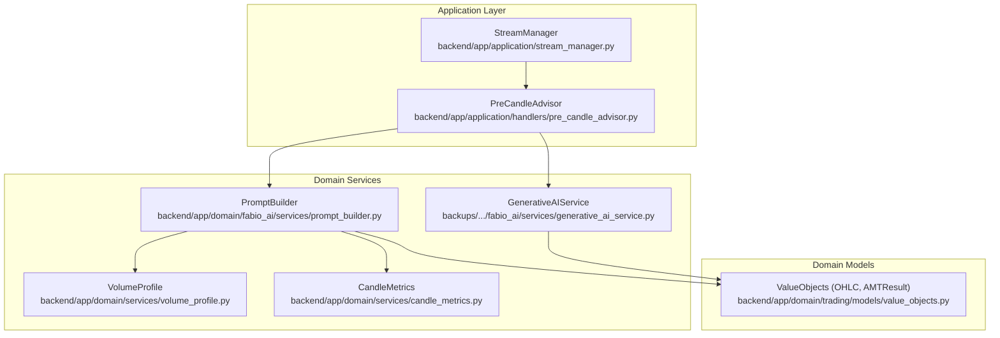
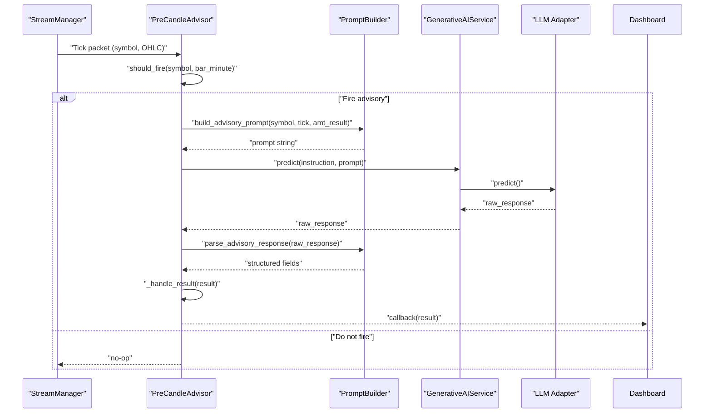
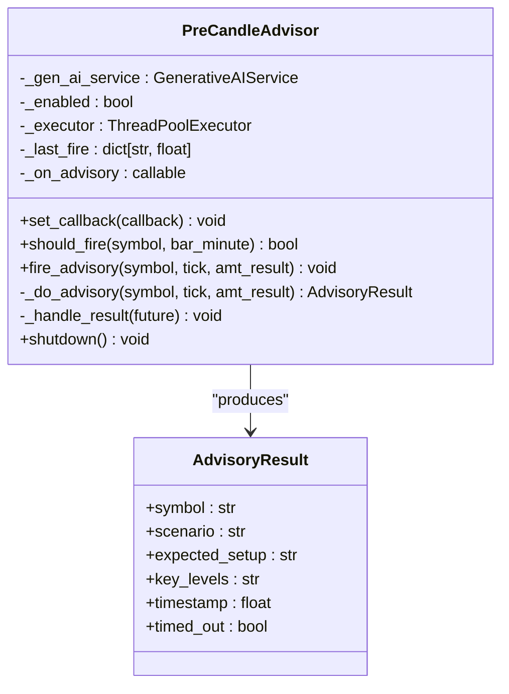
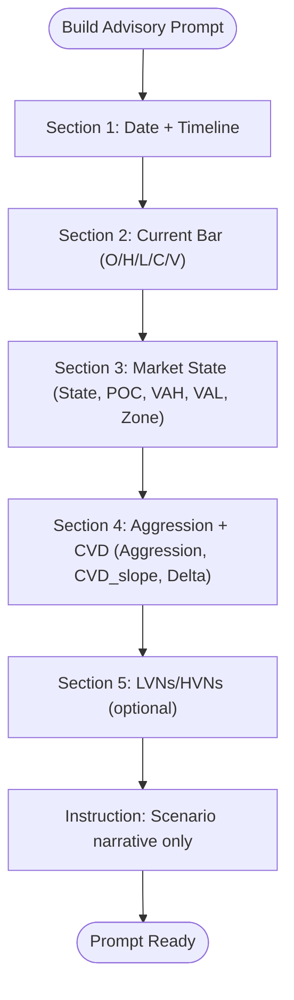
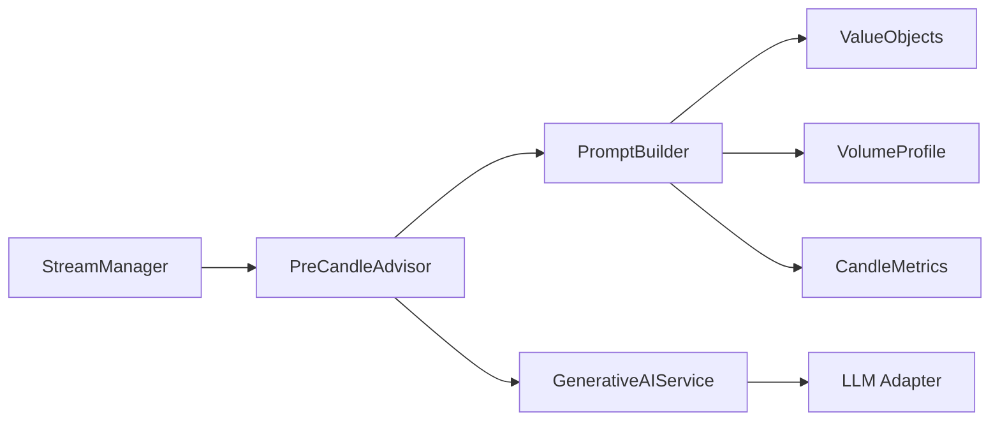

# Pre-Candle Advisor

<cite>
**Referenced Files in This Document**
- [pre_candle_advisor.py](file://backend/app/application/handlers/pre_candle_advisor.py)
- [prompt_builder.py](file://backend/app/domain/fabio_ai/services/prompt_builder.py)
- [value_objects.py](file://backend/app/domain/trading/models/value_objects.py)
- [volume_profile.py](file://backend/app/domain/services/volume_profile.py)
- [candle_metrics.py](file://backend/app/domain/services/candle_metrics.py)
- [generative_ai_service.py](file://backups/backend_backup_20260319_124426/app/domain/fabio_ai/services/generative_ai_service.py)
- [test_llm_advisory_services.py](file://backend/tests/unit/application/test_llm_advisory_services.py)
- [test_generative_ai_service.py](file://backend/tests/unit/domain/test_generative_ai_service.py)
- [stream_manager.py](file://backend/app/application/stream_manager.py)
</cite>

## Table of Contents
1. [Introduction](#introduction)
2. [Project Structure](#project-structure)
3. [Core Components](#core-components)
4. [Architecture Overview](#architecture-overview)
5. [Detailed Component Analysis](#detailed-component-analysis)
6. [Dependency Analysis](#dependency-analysis)
7. [Performance Considerations](#performance-considerations)
8. [Troubleshooting Guide](#troubleshooting-guide)
9. [Conclusion](#conclusion)

## Introduction
The Pre-Candle Advisor is a non-blocking advisory service that generates scenario narratives for the React dashboard approximately 60 seconds before a 5-minute bar closes. It does not influence gating or entry decisions but provides market context and predictive insights to support proactive decision-making. The advisor consumes the current OHLC tick and the latest Auction Market Theory (AMT) result, constructs a concise prompt, and queries a generative AI service to produce a structured advisory result. The result is delivered to the dashboard via a callback and is intentionally non-blocking to avoid impacting real-time trading performance.

## Project Structure
The Pre-Candle Advisor resides in the application layer and integrates with domain services for prompt construction and generative AI inference. It relies on value objects for typed market data and leverages volume profile and candle metric services for context enrichment.

**Diagram sources**
- [pre_candle_advisor.py:61-191](file://backend/app/application/handlers/pre_candle_advisor.py#L61-L191)
- [prompt_builder.py:608-664](file://backend/app/domain/fabio_ai/services/prompt_builder.py#L608-L664)
- [generative_ai_service.py:13-40](file://backups/backend_backup_20260319_124426/app/domain/fabio_ai/services/generative_ai_service.py#L13-L40)
- [value_objects.py:18-194](file://backend/app/domain/trading/models/value_objects.py#L18-L194)
- [volume_profile.py:196-290](file://backend/app/domain/services/volume_profile.py#L196-L290)
- [candle_metrics.py:17-85](file://backend/app/domain/services/candle_metrics.py#L17-L85)
- [stream_manager.py:32-134](file://backend/app/application/stream_manager.py#L32-L134)

**Section sources**
- [pre_candle_advisor.py:1-191](file://backend/app/application/handlers/pre_candle_advisor.py#L1-L191)
- [prompt_builder.py:608-664](file://backend/app/domain/fabio_ai/services/prompt_builder.py#L608-L664)
- [value_objects.py:18-194](file://backend/app/domain/trading/models/value_objects.py#L18-L194)
- [volume_profile.py:196-290](file://backend/app/domain/services/volume_profile.py#L196-L290)
- [candle_metrics.py:17-85](file://backend/app/domain/services/candle_metrics.py#L17-L85)
- [generative_ai_service.py:13-40](file://backups/backend_backup_20260319_124426/app/domain/fabio_ai/services/generative_ai_service.py#L13-L40)
- [stream_manager.py:32-134](file://backend/app/application/stream_manager.py#L32-L134)

## Core Components
- PreCandleAdvisor: Orchestrates advisory timing, asynchronous execution, and result delivery. It debounces advisories per symbol and per bar, ensuring non-blocking operation with a timeout.
- PromptBuilder: Constructs a five-section advisory prompt using the current tick and AMT result, and parses the LLM response into structured fields.
- GenerativeAIService: Provides the LLM inference interface and readiness checks.
- ValueObjects: Defines typed market data structures (OHLC, AMTResult) consumed by the advisor.
- VolumeProfile and CandleMetrics: Underpin AMT context (POC/VAH/VAL, profile shape, candle characteristics) used in advisory prompts.

**Section sources**
- [pre_candle_advisor.py:61-191](file://backend/app/application/handlers/pre_candle_advisor.py#L61-L191)
- [prompt_builder.py:608-664](file://backend/app/domain/fabio_ai/services/prompt_builder.py#L608-L664)
- [generative_ai_service.py:13-40](file://backups/backend_backup_20260319_124426/app/domain/fabio_ai/services/generative_ai_service.py#L13-L40)
- [value_objects.py:18-194](file://backend/app/domain/trading/models/value_objects.py#L18-L194)
- [volume_profile.py:196-290](file://backend/app/domain/services/volume_profile.py#L196-L290)
- [candle_metrics.py:17-85](file://backend/app/domain/services/candle_metrics.py#L17-L85)

## Architecture Overview
The Pre-Candle Advisor follows a non-blocking advisory pattern:
- StreamManager supplies OHLC ticks and symbol context.
- PreCandleAdvisor evaluates timing and triggers advisory generation.
- PromptBuilder composes a concise prompt from the tick and AMT result.
- GenerativeAIService executes the LLM call with a strict timeout.
- AdvisoryResult is parsed and pushed to the dashboard via a callback.

**Diagram sources**
- [stream_manager.py:135-289](file://backend/app/application/stream_manager.py#L135-L289)
- [pre_candle_advisor.py:85-187](file://backend/app/application/handlers/pre_candle_advisor.py#L85-L187)
- [prompt_builder.py:608-664](file://backend/app/domain/fabio_ai/services/prompt_builder.py#L608-L664)
- [generative_ai_service.py:38-40](file://backups/backend_backup_20260319_124426/app/domain/fabio_ai/services/generative_ai_service.py#L38-L40)

## Detailed Component Analysis

### PreCandleAdvisor
- Responsibilities:
  - Determine advisory timing (bar minute 4:00) and debounce per symbol.
  - Asynchronously execute advisory with a non-blocking thread pool and timeout.
  - Parse LLM response and deliver results to the dashboard via callback.
- Key behaviors:
  - Timing: fires only at minute 4 of a 5-minute bar and enforces a 250-second debounce.
  - Concurrency: uses ThreadPoolExecutor for fire-and-forget execution.
  - Robustness: logs timeouts and exceptions; returns timed-out results when applicable.
- Output: AdvisoryResult with scenario, expected setup, key levels, and a timestamp.

**Diagram sources**
- [pre_candle_advisor.py:61-191](file://backend/app/application/handlers/pre_candle_advisor.py#L61-L191)

**Section sources**
- [pre_candle_advisor.py:61-191](file://backend/app/application/handlers/pre_candle_advisor.py#L61-L191)

### PromptBuilder (Advisory)
- Purpose: Construct a five-section prompt for the advisor and parse the LLM response.
- Sections:
  1. Date and timeline context
  2. Current 5-minute bar data (O/H/L/C/V)
  3. AMT state (market_state, POC, VAH, VAL, zone)
  4. Aggression and CVD (aggression, cvd_slope, delta_normalized)
  5. LVNs/HVNs (if available) and instruction
- Response parsing:
  - Attempts JSON parsing with robust fallback to raw-text extraction.

**Diagram sources**
- [prompt_builder.py:608-664](file://backend/app/domain/fabio_ai/services/prompt_builder.py#L608-L664)

**Section sources**
- [prompt_builder.py:608-664](file://backend/app/domain/fabio_ai/services/prompt_builder.py#L608-L664)

### GenerativeAIService
- Role: Encapsulates LLM adapter and readiness checks; provides canonical predict interface for prompts.
- Contract: Ensures consistent behavior across adapters and caches responses.

**Section sources**
- [generative_ai_service.py:13-40](file://backups/backend_backup_20260319_124426/app/domain/fabio_ai/services/generative_ai_service.py#L13-L40)

### Value Objects Integration
- OHLC: Provides current tick data (open/high/low/close/volume) used in advisory prompts.
- AMTResult: Supplies market state, POC/VAH/VAL, LVNs/HVNs, aggression, CVD slope, and profile shape for context.

**Section sources**
- [value_objects.py:18-194](file://backend/app/domain/trading/models/value_objects.py#L18-L194)

### Volume Profile and Candle Metrics
- VolumeProfile: Computes POC/VAH/VAL and supports profile shape classification, which informs the advisory narrative.
- CandleMetrics: Offers candle pattern helpers (body, wicks, directional ratios) that can enrich context for pattern recognition.

**Section sources**
- [volume_profile.py:196-290](file://backend/app/domain/services/volume_profile.py#L196-L290)
- [candle_metrics.py:17-85](file://backend/app/domain/services/candle_metrics.py#L17-L85)

### Predictive Algorithms and Market Context
- Predictive narrative: The advisor synthesizes upcoming candle characteristics (OHLC) and AMT-derived market context (POC/VAH/VAL, LVNs/HVNs, aggression, CVD) into a concise scenario narrative.
- Candle pattern recognition: While the advisor itself does not compute patterns, candle metrics and profile shape inform the narrative’s pattern interpretation.
- Volume profile integration: The prompt includes LVNs/HVNs and profile shape to guide setup expectations and key levels to watch.
- Market momentum indicators: Aggression and CVD slope are included to reflect momentum and pressure conditions.

**Section sources**
- [prompt_builder.py:608-664](file://backend/app/domain/fabio_ai/services/prompt_builder.py#L608-L664)
- [value_objects.py:104-194](file://backend/app/domain/trading/models/value_objects.py#L104-L194)
- [volume_profile.py:196-290](file://backend/app/domain/services/volume_profile.py#L196-L290)
- [candle_metrics.py:17-85](file://backend/app/domain/services/candle_metrics.py#L17-L85)

### Pre-Candle Forecasting and Market State Prediction
- Forecasting capability: The advisor provides a scenario narrative and expected setup, enabling traders to anticipate next-bar behavior without blocking entry gates.
- Market state prediction: Market state (balanced/imbalanced) and profile shape influence the narrative’s bias and setup classification.
- Relationship with candle metrics and volatility: Aggression and CVD slope capture short-term momentum and pressure, while profile shape reflects distributional characteristics.

**Section sources**
- [prompt_builder.py:608-664](file://backend/app/domain/fabio_ai/services/prompt_builder.py#L608-L664)
- [value_objects.py:104-194](file://backend/app/domain/trading/models/value_objects.py#L104-L194)

### Practical Examples of Predictive Workflows
- Workflow 1: Advisory timing
  - StreamManager emits a tick at minute 4 of a 5-minute bar.
  - PreCandleAdvisor.should_fire returns true; advisory is fired asynchronously.
  - PromptBuilder composes the prompt using the tick and AMT result.
  - GenerativeAIService predicts and returns a structured advisory.
  - Dashboard receives the advisory via callback.
- Workflow 2: Early warning systems
  - If CVD slope indicates extreme selling/buying or profile shape signals imbalance, the narrative flags caution or opportunity zones.
- Workflow 3: Integration with broader trading pipeline
  - The advisor is non-blocking and non-decision-affecting; it complements gating and entry decisions by providing context.

**Section sources**
- [stream_manager.py:135-289](file://backend/app/application/stream_manager.py#L135-L289)
- [pre_candle_advisor.py:85-187](file://backend/app/application/handlers/pre_candle_advisor.py#L85-L187)
- [prompt_builder.py:608-664](file://backend/app/domain/fabio_ai/services/prompt_builder.py#L608-L664)

### Accuracy Metrics, Predictive Confidence Scoring, and False Positives
- Accuracy metrics: The system’s overall accuracy assessment includes components relevant to advisory context (e.g., Volume Profile, Order Flow, Market State), indicating strong foundational reliability.
- Predictive confidence scoring: The advisor’s response parsing focuses on scenario, expected setup, and key levels; confidence is not part of the advisory schema. For decision-making confidence, the system employs separate mechanisms (e.g., aggression scoring).
- Handling false positives: The advisor is advisory-only and non-blocking. If the LLM response is unparsable, the fallback extracts a scenario string. The system avoids blocking by enforcing timeouts and debouncing advisories.

**Section sources**
- [test_generative_ai_service.py:190-211](file://backend/tests/unit/domain/test_generative_ai_service.py#L190-L211)
- [test_llm_advisory_services.py:40-124](file://backend/tests/unit/application/test_llm_advisory_services.py#L40-L124)
- [pre_candle_advisor.py:131-187](file://backend/app/application/handlers/pre_candle_advisor.py#L131-L187)

## Dependency Analysis
The Pre-Candle Advisor has clear, focused dependencies:
- Application handler depends on domain prompt builder and generative AI service.
- Prompt builder depends on value objects and AMT result fields.
- Generative AI service depends on an LLM adapter abstraction.
- StreamManager supplies the tick packets that trigger advisory evaluation.

**Diagram sources**
- [stream_manager.py:135-289](file://backend/app/application/stream_manager.py#L135-L289)
- [pre_candle_advisor.py:61-191](file://backend/app/application/handlers/pre_candle_advisor.py#L61-L191)
- [prompt_builder.py:608-664](file://backend/app/domain/fabio_ai/services/prompt_builder.py#L608-L664)
- [generative_ai_service.py:13-40](file://backups/backend_backup_20260319_124426/app/domain/fabio_ai/services/generative_ai_service.py#L13-L40)
- [value_objects.py:18-194](file://backend/app/domain/trading/models/value_objects.py#L18-L194)
- [volume_profile.py:196-290](file://backend/app/domain/services/volume_profile.py#L196-L290)
- [candle_metrics.py:17-85](file://backend/app/domain/services/candle_metrics.py#L17-L85)

**Section sources**
- [pre_candle_advisor.py:61-191](file://backend/app/application/handlers/pre_candle_advisor.py#L61-L191)
- [prompt_builder.py:608-664](file://backend/app/domain/fabio_ai/services/prompt_builder.py#L608-L664)
- [generative_ai_service.py:13-40](file://backups/backend_backup_20260319_124426/app/domain/fabio_ai/services/generative_ai_service.py#L13-L40)
- [value_objects.py:18-194](file://backend/app/domain/trading/models/value_objects.py#L18-L194)
- [volume_profile.py:196-290](file://backend/app/domain/services/volume_profile.py#L196-L290)
- [candle_metrics.py:17-85](file://backend/app/domain/services/candle_metrics.py#L17-L85)
- [stream_manager.py:135-289](file://backend/app/application/stream_manager.py#L135-L289)

## Performance Considerations
- Non-blocking execution: Advisory runs in a thread pool with a strict timeout to prevent impacting real-time trading.
- Debouncing: Prevents redundant advisories within a bar cycle.
- Prompt length and temperature: The advisory prompt is concise and temperature is tuned for determinism, reducing token usage and latency.
- Streaming reliability: StreamManager ensures robust connectivity and falls back to polling when needed, indirectly supporting timely tick availability for advisory triggering.

[No sources needed since this section provides general guidance]

## Troubleshooting Guide
- Advisory not firing:
  - Verify bar minute is 4 and the symbol has not fired within the 250-second debounce window.
  - Confirm the generative AI service is ready.
- Timeout or missed advisory:
  - The advisor logs timeout errors and returns a timed-out result; this is expected behavior and not an error condition.
- Unparsable LLM response:
  - The parser falls back to extracting a scenario string; ensure the LLM response is readable and consider adjusting instruction or max tokens.
- Streaming issues:
  - If ticks are stale or polling fallback is triggered, advisories may be delayed until healthy streams resume.

**Section sources**
- [pre_candle_advisor.py:85-187](file://backend/app/application/handlers/pre_candle_advisor.py#L85-L187)
- [stream_manager.py:120-134](file://backend/app/application/stream_manager.py#L120-L134)
- [test_llm_advisory_services.py:40-124](file://backend/tests/unit/application/test_llm_advisory_services.py#L40-L124)

## Conclusion
The Pre-Candle Advisor delivers timely, non-blocking market context by combining current tick data and AMT-derived insights into a concise scenario narrative. Its integration with the broader trading pipeline emphasizes proactive awareness without influencing gating or entry decisions. With robust prompt construction, resilient concurrency, and clear error handling, the advisor supports informed trading while maintaining system stability.