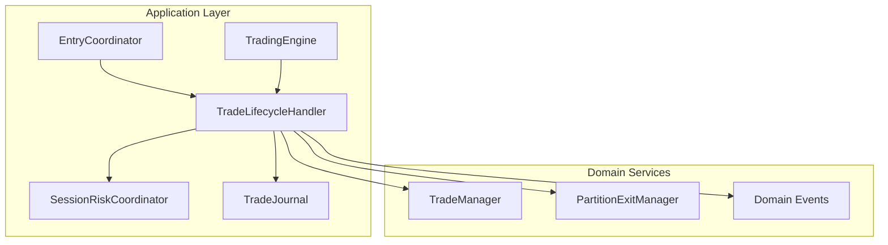
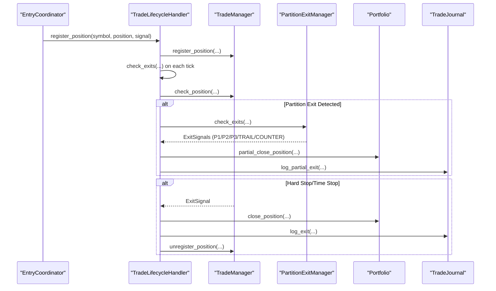
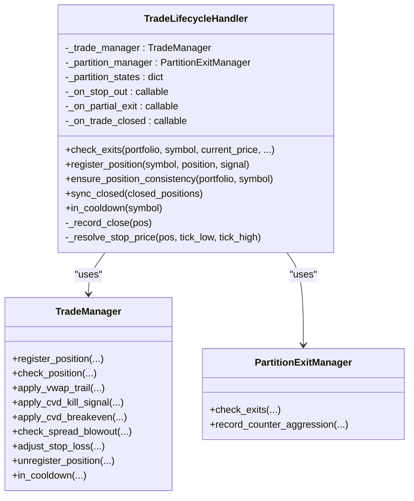
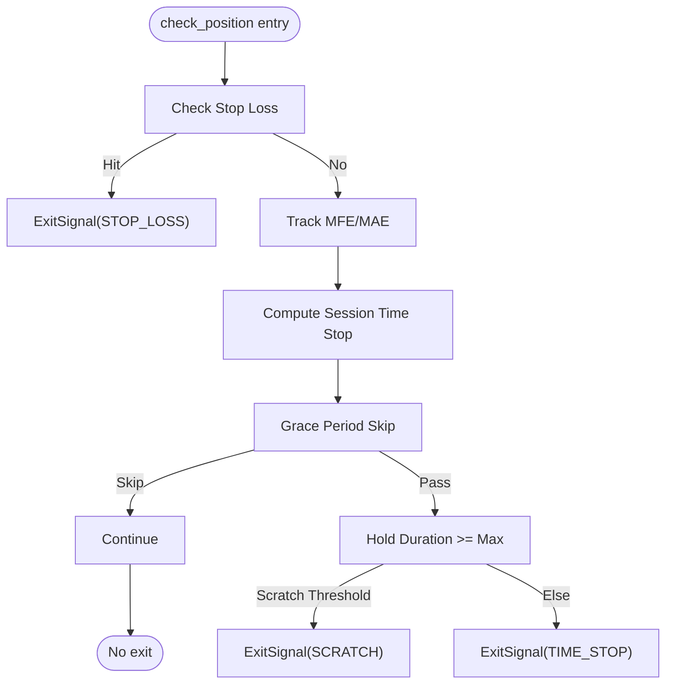
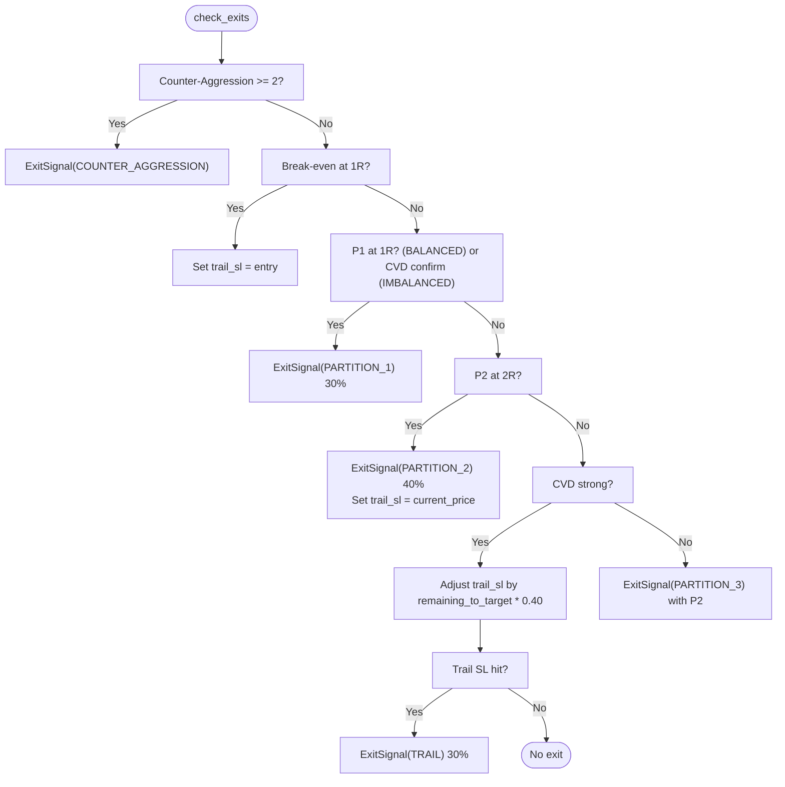
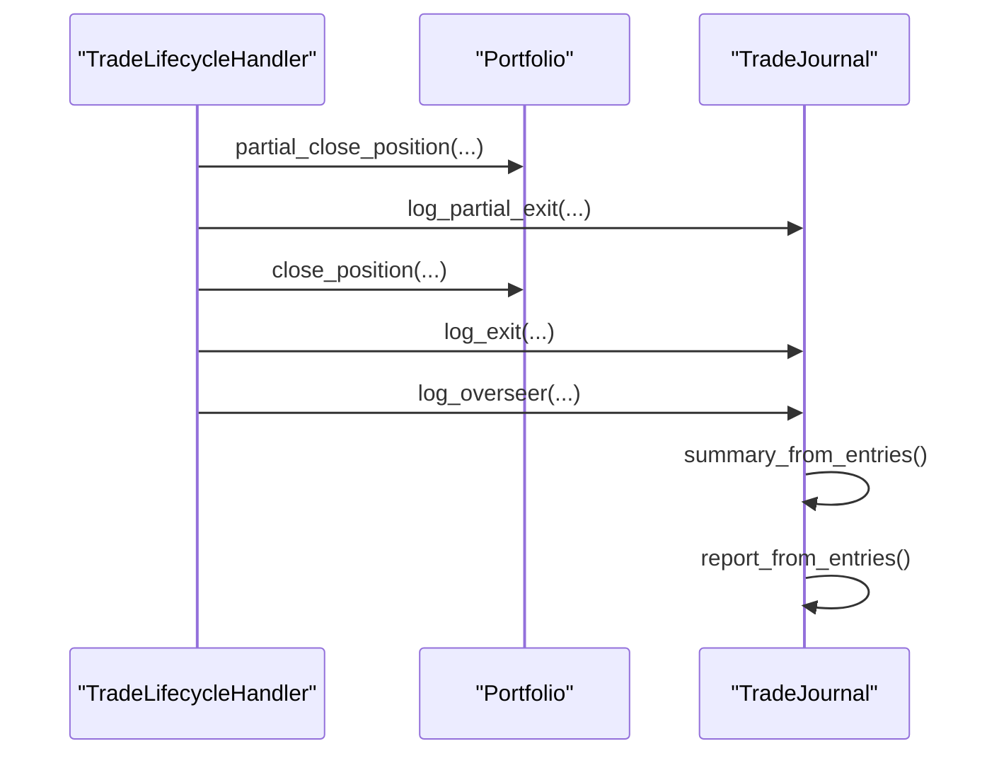
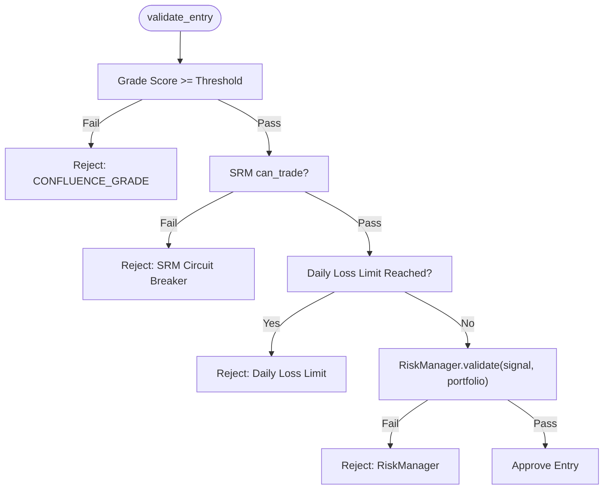
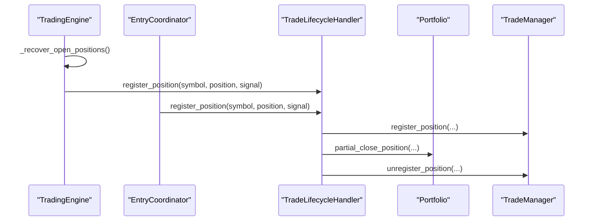
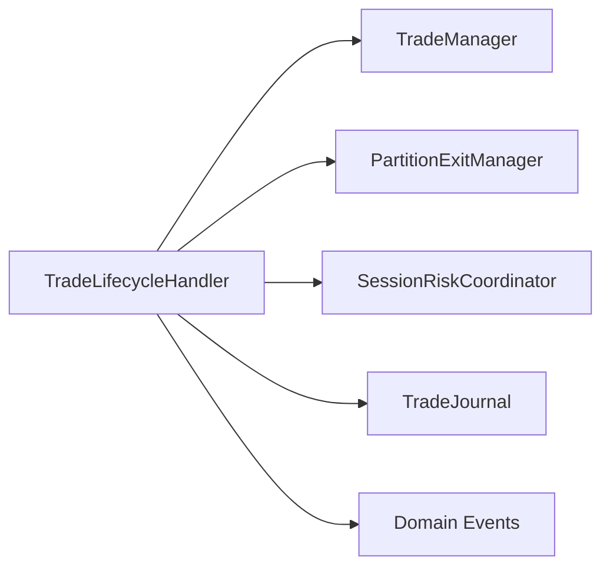

# Trade Lifecycle Handler

<cite>
**Referenced Files in This Document**
- [trade_lifecycle_handler.py](file://backend/app/application/handlers/trade_lifecycle_handler.py)
- [trade_manager.py](file://backend/app/domain/fabio_ai/services/trade_manager.py)
- [partition_exit_manager.py](file://backend/app/domain/fabio_ai/services/partition_exit_manager.py)
- [events.py](file://backend/app/domain/trading/events.py)
- [trade_journal.py](file://backend/app/application/services/trade_journal.py)
- [session_risk_coordinator.py](file://backend/app/application/services/session_risk_coordinator.py)
- [entry_coordinator.py](file://backend/app/application/services/entry_coordinator.py)
- [engine.py](file://backend/app/application/engine.py)
</cite>

## Table of Contents
1. [Introduction](#introduction)
2. [Project Structure](#project-structure)
3. [Core Components](#core-components)
4. [Architecture Overview](#architecture-overview)
5. [Detailed Component Analysis](#detailed-component-analysis)
6. [Dependency Analysis](#dependency-analysis)
7. [Performance Considerations](#performance-considerations)
8. [Troubleshooting Guide](#troubleshooting-guide)
9. [Conclusion](#conclusion)

## Introduction
The Trade Lifecycle Handler coordinates the complete trade execution journey from entry confirmation to exit, integrating position management, risk controls, and trade journaling. It orchestrates deterministic exit decisions via the TradeManager (stop-loss, take-profit, trailing, time-stop), partitions exits according to the PartitionExitManager (P1/P2/P3), and maintains consistency with the portfolio. It also triggers trade journaling entries and coordinates with risk systems to enforce session-level and symbol-level constraints.

## Project Structure
The Trade Lifecycle Handler resides in the application layer alongside domain services that define the deterministic trade management logic. It interacts with:
- Domain services: TradeManager and PartitionExitManager for position lifecycle and exit logic
- Application services: SessionRiskCoordinator for risk gating, TradeJournal for performance tracking
- Event system: Domain events for auditable state changes
- Engine integration: Mid-trade recovery and state synchronization

**Diagram sources**
- [trade_lifecycle_handler.py:22-41](file://backend/app/application/handlers/trade_lifecycle_handler.py#L22-L41)
- [trade_manager.py:172-187](file://backend/app/domain/fabio_ai/services/trade_manager.py#L172-L187)
- [partition_exit_manager.py:44-50](file://backend/app/domain/fabio_ai/services/partition_exit_manager.py#L44-L50)
- [entry_coordinator.py:41-65](file://backend/app/application/services/entry_coordinator.py#L41-L65)
- [session_risk_coordinator.py:43-71](file://backend/app/application/services/session_risk_coordinator.py#L43-L71)
- [trade_journal.py:84-92](file://backend/app/application/services/trade_journal.py#L84-L92)
- [engine.py:59-126](file://backend/app/application/engine.py#L59-L126)

**Section sources**
- [trade_lifecycle_handler.py:22-41](file://backend/app/application/handlers/trade_lifecycle_handler.py#L22-L41)
- [trade_manager.py:172-187](file://backend/app/domain/fabio_ai/services/trade_manager.py#L172-L187)
- [partition_exit_manager.py:44-50](file://backend/app/domain/fabio_ai/services/partition_exit_manager.py#L44-L50)
- [entry_coordinator.py:41-65](file://backend/app/application/services/entry_coordinator.py#L41-L65)
- [session_risk_coordinator.py:43-71](file://backend/app/application/services/session_risk_coordinator.py#L43-L71)
- [trade_journal.py:84-92](file://backend/app/application/services/trade_journal.py#L84-L92)
- [engine.py:59-126](file://backend/app/application/engine.py#L59-L126)

## Core Components
- TradeLifecycleHandler: Central coordinator that checks exits, manages partition exits, reconciles positions, and triggers callbacks for stop-out, partial exits, and full closures.
- TradeManager: Deterministic position lifecycle manager with hard stops, trailing, time stops, and session-aware time caps.
- PartitionExitManager: Implements P1/P2/P3 partition exits with break-even and counter-aggression logic.
- SessionRiskCoordinator: Enforces session-level risk gates and daily loss limits.
- TradeJournal: Comprehensive JSONL logging for all lifecycle events and performance metrics.
- Domain Events: Immutable records enabling auditability and downstream reactions.

Key responsibilities:
- Lifecycle orchestration: register positions, reconcile with portfolio, detect exits, and finalize closures.
- Deterministic exits: combine hard stops, trailing, time stops, and partition exits.
- Risk integration: daily loss limits, session halts, and circuit breakers.
- Journaling: log entry, partial exits, full exits, and overseer actions.

**Section sources**
- [trade_lifecycle_handler.py:22-41](file://backend/app/application/handlers/trade_lifecycle_handler.py#L22-L41)
- [trade_manager.py:172-187](file://backend/app/domain/fabio_ai/services/trade_manager.py#L172-L187)
- [partition_exit_manager.py:44-50](file://backend/app/domain/fabio_ai/services/partition_exit_manager.py#L44-L50)
- [session_risk_coordinator.py:169-212](file://backend/app/application/services/session_risk_coordinator.py#L169-L212)
- [trade_journal.py:282-440](file://backend/app/application/services/trade_journal.py#L282-L440)
- [events.py:311-410](file://backend/app/domain/trading/events.py#L311-L410)

## Architecture Overview
The Trade Lifecycle Handler sits at the intersection of entry execution and ongoing position management. It receives signals, registers positions with TradeManager, and continuously evaluates exit conditions on each tick. It collaborates with PartitionExitManager for structured profit-taking, applies risk controls via SessionRiskCoordinator, and logs outcomes to TradeJournal.

**Diagram sources**
- [entry_coordinator.py:237-252](file://backend/app/application/services/entry_coordinator.py#L237-L252)
- [trade_lifecycle_handler.py:47-268](file://backend/app/application/handlers/trade_lifecycle_handler.py#L47-L268)
- [trade_manager.py:572-662](file://backend/app/domain/fabio_ai/services/trade_manager.py#L572-L662)
- [partition_exit_manager.py:58-220](file://backend/app/domain/fabio_ai/services/partition_exit_manager.py#L58-L220)
- [trade_journal.py:416-478](file://backend/app/application/services/trade_journal.py#L416-L478)

**Section sources**
- [entry_coordinator.py:237-252](file://backend/app/application/services/entry_coordinator.py#L237-L252)
- [trade_lifecycle_handler.py:47-268](file://backend/app/application/handlers/trade_lifecycle_handler.py#L47-L268)
- [trade_manager.py:572-662](file://backend/app/domain/fabio_ai/services/trade_manager.py#L572-L662)
- [partition_exit_manager.py:58-220](file://backend/app/domain/fabio_ai/services/partition_exit_manager.py#L58-L220)
- [trade_journal.py:416-478](file://backend/app/application/services/trade_journal.py#L416-L478)

## Detailed Component Analysis

### TradeLifecycleHandler
The TradeLifecycleHandler is the central orchestrator for trade lifecycle management. It:
- Registers positions with TradeManager and initializes PartitionExitManager state
- On each tick, evaluates spread blowouts, scale-in triggers, CVD kill signals, breakeven adjustments, VWAP trails, and imbalance tightens
- Coordinates partition exits (P1/P2/P3) and applies partition trail SL updates
- Updates market state dynamically and delegates hard stop/time stop checks to TradeManager
- Logs full exits via callbacks and journaling

**Diagram sources**
- [trade_lifecycle_handler.py:22-41](file://backend/app/application/handlers/trade_lifecycle_handler.py#L22-L41)
- [trade_manager.py:172-187](file://backend/app/domain/fabio_ai/services/trade_manager.py#L172-L187)
- [partition_exit_manager.py:44-50](file://backend/app/domain/fabio_ai/services/partition_exit_manager.py#L44-L50)

**Section sources**
- [trade_lifecycle_handler.py:22-41](file://backend/app/application/handlers/trade_lifecycle_handler.py#L22-L41)
- [trade_manager.py:172-187](file://backend/app/domain/fabio_ai/services/trade_manager.py#L172-L187)
- [partition_exit_manager.py:44-50](file://backend/app/domain/fabio_ai/services/partition_exit_manager.py#L44-L50)

### TradeManager
TradeManager provides deterministic lifecycle management:
- Hard stops: SL/TP checks based on side and price
- Time stops: session-aware caps with grace periods and near-close capping
- Breakeven: CVD-based SL move to entry
- VWAP trailing: dynamic SL adjustment based on VWAP bands
- Spread blowout detection: immediate exit when bid-ask exceeds threshold
- Daily loss tracking and circuit breakers
- Scale-in triggers per Fabio Rule 4 (40/30/30)

**Diagram sources**
- [trade_manager.py:572-662](file://backend/app/domain/fabio_ai/services/trade_manager.py#L572-L662)

**Section sources**
- [trade_manager.py:572-662](file://backend/app/domain/fabio_ai/services/trade_manager.py#L572-L662)

### PartitionExitManager
Implements structured profit-taking:
- P1: 30% at 1R (or CVD confirmation in IMBALANCED)
- P2: 40% at 2R with trail SL set to current price
- P3: 30% trail or exit depending on CVD strength
- Break-even: move SL to entry at 1R
- Counter-aggression: 2+ opposite signals trigger full exit
- Trail SL enforcement when hit

**Diagram sources**
- [partition_exit_manager.py:58-220](file://backend/app/domain/fabio_ai/services/partition_exit_manager.py#L58-L220)

**Section sources**
- [partition_exit_manager.py:58-220](file://backend/app/domain/fabio_ai/services/partition_exit_manager.py#L58-L220)

### Trade Journaling and Performance Tracking
TradeJournal logs all lifecycle events and computes performance metrics:
- Entry, partial exits, full exits, and overseer actions
- Metrics: total PnL, win rate, expectancy, profit factor, drawdown
- Bucketed breakdowns by session, symbol, setup family, and feature drivers
- Daily and run comparisons for evaluation

**Diagram sources**
- [trade_lifecycle_handler.py:205-224](file://backend/app/application/handlers/trade_lifecycle_handler.py#L205-L224)
- [trade_journal.py:416-504](file://backend/app/application/services/trade_journal.py#L416-L504)
- [events.py:311-410](file://backend/app/domain/trading/events.py#L311-L410)

**Section sources**
- [trade_lifecycle_handler.py:205-224](file://backend/app/application/handlers/trade_lifecycle_handler.py#L205-L224)
- [trade_journal.py:416-504](file://backend/app/application/services/trade_journal.py#L416-L504)
- [events.py:311-410](file://backend/app/domain/trading/events.py#L311-L410)

### Risk Controls and Session-Level Coordination
SessionRiskCoordinator enforces:
- Confluence grade score threshold for signals
- Session circuit breaker (3 consecutive losses)
- Daily loss limits per symbol and globally
- Position sizing and exposure via RiskManager
- RiskTierEngine integration for tier-based risk scaling

**Diagram sources**
- [session_risk_coordinator.py:169-212](file://backend/app/application/services/session_risk_coordinator.py#L169-L212)

**Section sources**
- [session_risk_coordinator.py:169-212](file://backend/app/application/services/session_risk_coordinator.py#L169-L212)

### Integration with Entry Pipeline and Engine
- EntryCoordinator executes validated signals, registers positions with TradeLifecycleHandler, publishes PositionOpened events, and persists open positions.
- TradingEngine performs mid-trade recovery by loading open positions from storage and registering them with TradeManager to resume lifecycle management.
- Event system ensures auditable state changes and downstream reactions.

**Diagram sources**
- [engine.py:431-576](file://backend/app/application/engine.py#L431-L576)
- [entry_coordinator.py:237-252](file://backend/app/application/services/entry_coordinator.py#L237-L252)
- [trade_lifecycle_handler.py:306-319](file://backend/app/application/handlers/trade_lifecycle_handler.py#L306-L319)

**Section sources**
- [engine.py:431-576](file://backend/app/application/engine.py#L431-L576)
- [entry_coordinator.py:237-252](file://backend/app/application/services/entry_coordinator.py#L237-L252)
- [trade_lifecycle_handler.py:306-319](file://backend/app/application/handlers/trade_lifecycle_handler.py#L306-L319)

## Dependency Analysis
The TradeLifecycleHandler depends on:
- TradeManager for deterministic lifecycle and exit logic
- PartitionExitManager for structured profit-taking and trail management
- SessionRiskCoordinator for gating and risk enforcement
- TradeJournal for comprehensive logging and reporting
- Domain events for auditability and downstream reactions

**Diagram sources**
- [trade_lifecycle_handler.py:22-41](file://backend/app/application/handlers/trade_lifecycle_handler.py#L22-L41)
- [trade_manager.py:172-187](file://backend/app/domain/fabio_ai/services/trade_manager.py#L172-L187)
- [partition_exit_manager.py:44-50](file://backend/app/domain/fabio_ai/services/partition_exit_manager.py#L44-L50)
- [session_risk_coordinator.py:43-71](file://backend/app/application/services/session_risk_coordinator.py#L43-L71)
- [trade_journal.py:84-92](file://backend/app/application/services/trade_journal.py#L84-L92)
- [events.py:38-55](file://backend/app/domain/trading/events.py#L38-L55)

**Section sources**
- [trade_lifecycle_handler.py:22-41](file://backend/app/application/handlers/trade_lifecycle_handler.py#L22-L41)
- [trade_manager.py:172-187](file://backend/app/domain/fabio_ai/services/trade_manager.py#L172-L187)
- [partition_exit_manager.py:44-50](file://backend/app/domain/fabio_ai/services/partition_exit_manager.py#L44-L50)
- [session_risk_coordinator.py:43-71](file://backend/app/application/services/session_risk_coordinator.py#L43-L71)
- [trade_journal.py:84-92](file://backend/app/application/services/trade_journal.py#L84-L92)
- [events.py:38-55](file://backend/app/domain/trading/events.py#L38-L55)

## Performance Considerations
- Tick-level determinism: TradeManager evaluates exits every tick with minimal overhead; ensure order book and AMT data availability to avoid unnecessary checks.
- PartitionExitManager computations are lightweight and short-circuit when conditions are not met.
- TradeJournal writes are serialized with a lock and append-only JSONL format; batching or asynchronous writes could reduce I/O contention in high-frequency scenarios.
- Reconciliation and consistency checks protect against race conditions; avoid frequent rapid position creation/deletion to minimize reconciliation churn.

## Troubleshooting Guide
Common issues and remedies:
- Unmanaged open positions detected: The handler logs inconsistencies and reconciles managed vs portfolio open positions. Investigate missing registration or persistence failures.
- Spread blowout exits: If frequent, review liquidity conditions and consider widening spreads or reducing position size.
- CVD kill signals: Verify CVD divergence inputs and ensure tick count grace period is respected before exit.
- VWAP trail misfires: Confirm VWAP bands and tick size rounding are appropriate for the instrument.
- Daily loss limit reached: Review SessionRiskCoordinator gating and reduce exposure or pause entries until reset.
- Partial exit PnL not feeding risk: Ensure realized PnL is recorded via TradeManager to update session realized PnL and dynamic risk.

**Section sources**
- [trade_lifecycle_handler.py:66-77](file://backend/app/application/handlers/trade_lifecycle_handler.py#L66-L77)
- [trade_manager.py:1150-1188](file://backend/app/domain/fabio_ai/services/trade_manager.py#L1150-L1188)
- [session_risk_coordinator.py:202-212](file://backend/app/application/services/session_risk_coordinator.py#L202-L212)

## Conclusion
The Trade Lifecycle Handler provides a robust, deterministic framework for managing trades from entry to exit. By combining TradeManager’s hard-stop and time-stop logic, PartitionExitManager’s structured profit-taking, SessionRiskCoordinator’s risk gating, and TradeJournal’s comprehensive logging, it ensures disciplined execution, auditable outcomes, and scalable performance. Proper integration with the entry pipeline and engine enables mid-trade recovery and continuous lifecycle management.