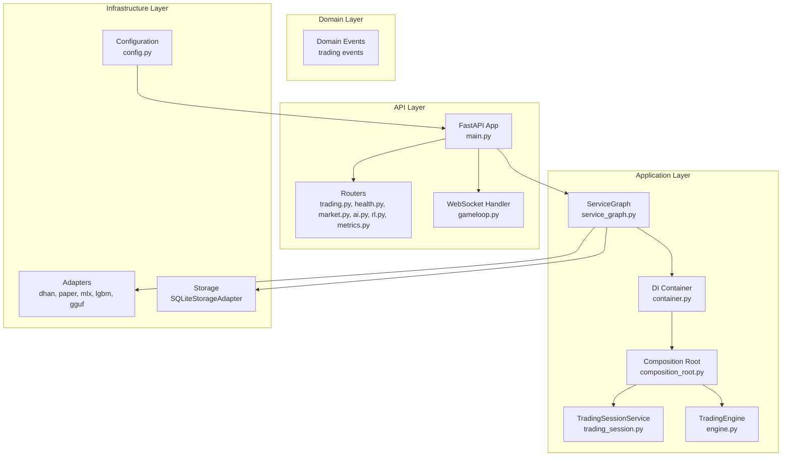
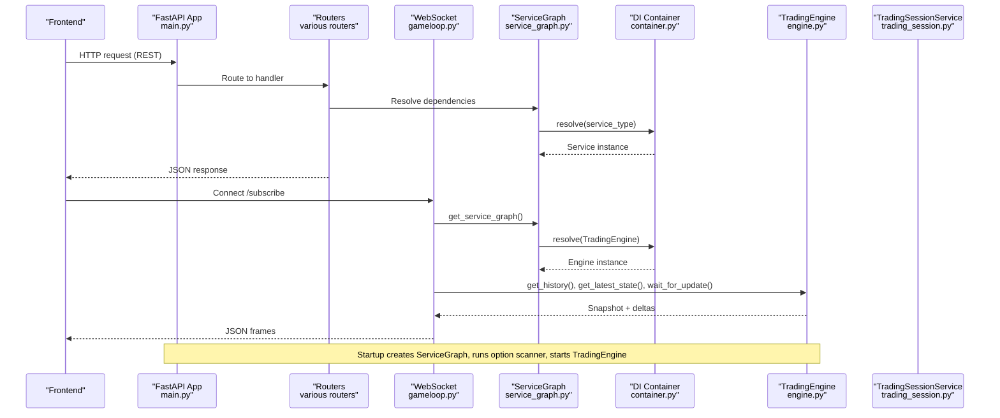
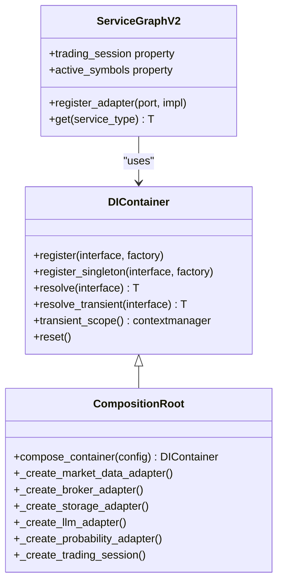
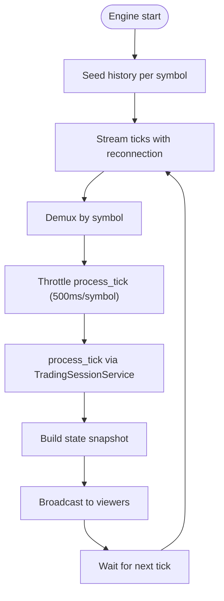
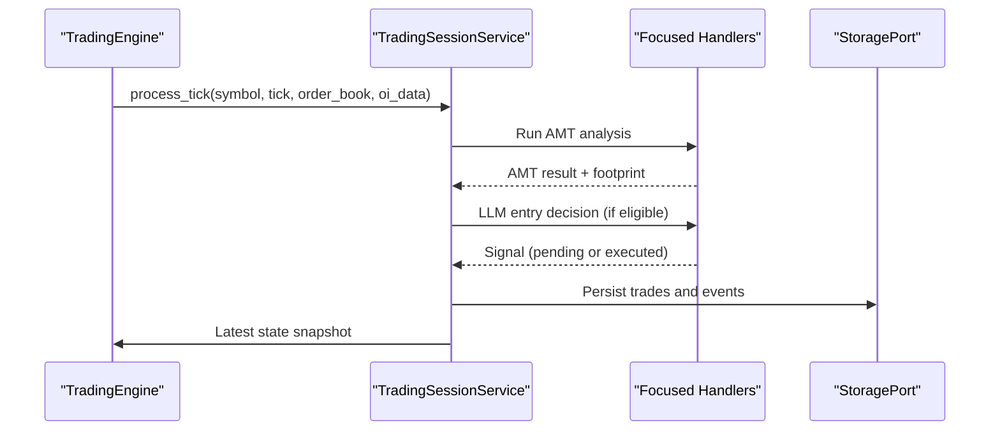
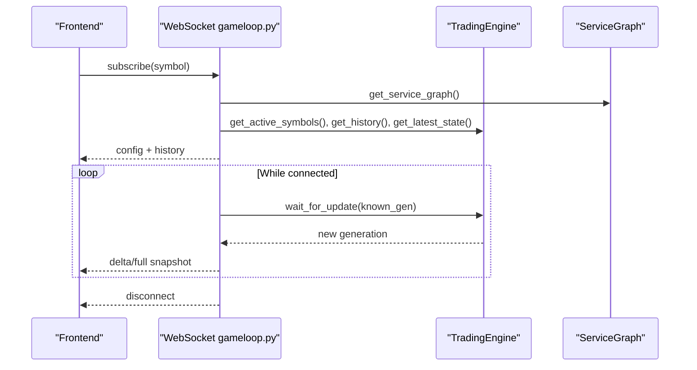
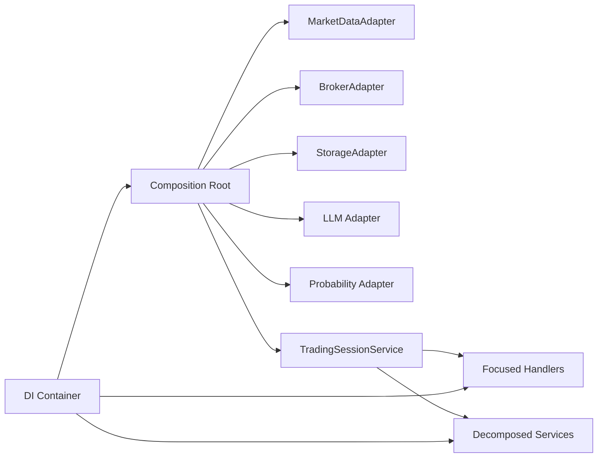

# Backend Application

<cite>
**Referenced Files in This Document**
- [backend/app/main.py](file://backend/app/main.py)
- [backend/app/api/dependencies.py](file://backend/app/api/dependencies.py)
- [backend/app/application/service_graph.py](file://backend/app/application/service_graph.py)
- [backend/app/application/service_graph_v2.py](file://backend/app/application/service_graph_v2.py)
- [backend/app/application/di/composition_root.py](file://backend/app/application/di/composition_root.py)
- [backend/app/application/di/container.py](file://backend/app/application/di/container.py)
- [backend/app/application/engine.py](file://backend/app/application/engine.py)
- [backend/app/application/services/trading_session.py](file://backend/app/application/services/trading_session.py)
- [backend/app/api/routers/trading.py](file://backend/app/api/routers/trading.py)
- [backend/app/api/routers/health.py](file://backend/app/api/routers/health.py)
- [backend/app/api/websocket/gameloop.py](file://backend/app/api/websocket/gameloop.py)
</cite>

## Update Summary
**Changes Made**
- Updated to reflect the unified DI-driven system replacing legacy backend_v2 components
- Removed extensive documentation for legacy trading engine architecture and pipeline processors
- Consolidated documentation to focus on the modern ServiceGraph and DI container architecture
- Updated API endpoint coverage to reflect current router structure
- Revised dependency injection patterns to emphasize OCP-compliant DI container

## Table of Contents
1. [Introduction](#introduction)
2. [Project Structure](#project-structure)
3. [Core Components](#core-components)
4. [Architecture Overview](#architecture-overview)
5. [Detailed Component Analysis](#detailed-component-analysis)
6. [Dependency Analysis](#dependency-analysis)
7. [Performance Considerations](#performance-considerations)
8. [Troubleshooting Guide](#troubleshooting-guide)
9. [Conclusion](#conclusion)
10. [Appendices](#appendices)

## Introduction
This document describes the GlassyTrade AI backend application, a production-grade, domain-driven, event-synchronous trading system built on FastAPI. The system has evolved to a unified DI-driven architecture featuring a modern ServiceGraph and DI container that replaces the legacy backend_v2 components. It explains the dependency injection patterns, the TradingEngine and event-driven processing pipeline, and the session management system. It also covers API endpoints, WebSocket connections, real-time data processing, service lifecycle, startup/shutdown procedures, and error handling strategies. Terminology aligns with the codebase, including TradingEngine, TradingSessionService, and StateBus.

## Project Structure
The backend is organized around a modernized layered architecture with unified dependency injection:
- Application layer: orchestration of engines, managers, and services with DI container
- Domain layer: trading models, events, and services
- Infrastructure layer: adapters, storage, and external integrations
- API layer: FastAPI routers and WebSocket handlers
- Config layer: environment-driven settings and consolidated configuration

**Diagram sources**
- [backend/app/main.py:64-188](file://backend/app/main.py#L64-L188)
- [backend/app/application/service_graph.py:44-137](file://backend/app/application/service_graph.py#L44-L137)
- [backend/app/application/di/container.py:33-109](file://backend/app/application/di/container.py#L33-L109)
- [backend/app/application/di/composition_root.py:25-80](file://backend/app/application/di/composition_root.py#L25-L80)
- [backend/app/application/engine.py:66-91](file://backend/app/application/engine.py#L66-L91)
- [backend/app/application/services/trading_session.py:107-123](file://backend/app/application/services/trading_session.py#L107-L123)

**Section sources**
- [backend/app/main.py:64-188](file://backend/app/main.py#L64-L188)
- [backend/app/application/service_graph.py:44-137](file://backend/app/application/service_graph.py#L44-L137)

## Core Components
- FastAPI application entry and lifecycle:
  - Structured JSON logging, CORS middleware, and router mounting
  - Startup: creates ServiceGraph, runs option scanner, starts TradingEngine
  - Shutdown: stops engine gracefully and cleans up resources
- Unified ServiceGraph and DI Container:
  - Modern DI container with factory registration replacing if/elif chains
  - Composition root builds complete dependency graph with OCP compliance
  - ServiceGraph provides backward compatibility while using DI container internally
- TradingEngine:
  - Independent trading loop that streams market data, processes ticks, and exposes state snapshots
  - Manages per-symbol state, notifies WebSocket viewers, and supports immediate update triggers
- TradingSessionService:
  - Orchestrates the event-driven pipeline with focused handlers for AMT analysis, LLM entry decisions, risk coordination, lifecycle management, and exits
  - Coordinates handlers and services, manages per-symbol session state, and enforces structural guards
- WebSocket Real-Time Viewer:
  - Server-driven mode with delta compression for efficient real-time updates
  - Graceful disconnect handling and error logging

**Section sources**
- [backend/app/main.py:68-146](file://backend/app/main.py#L68-L146)
- [backend/app/application/service_graph.py:44-137](file://backend/app/application/service_graph.py#L44-L137)
- [backend/app/application/di/composition_root.py:25-80](file://backend/app/application/di/composition_root.py#L25-L80)
- [backend/app/application/engine.py:66-91](file://backend/app/application/engine.py#L66-L91)
- [backend/app/application/services/trading_session.py:107-123](file://backend/app/application/services/trading_session.py#L107-L123)
- [backend/app/api/websocket/gameloop.py:112-142](file://backend/app/api/websocket/gameloop.py#L112-L142)

## Architecture Overview
GlassyTrade AI follows a modernized DDD/event-driven architecture with unified DI:
- Domain events define immutable facts (e.g., TickReceived, SignalGenerated, PositionOpened)
- TradingSessionService subscribes to and reacts to events, invoking specialized handlers
- ServiceGraph with DI container centralizes construction and wiring with OCP compliance
- TradingEngine orchestrates streaming, processing, and state publication
- FastAPI routes expose REST endpoints and WebSocket for real-time viewer updates

**Diagram sources**
- [backend/app/main.py:68-146](file://backend/app/main.py#L68-L146)
- [backend/app/application/service_graph.py:306-311](file://backend/app/application/service_graph.py#L306-L311)
- [backend/app/application/di/container.py:68-108](file://backend/app/application/di/container.py#L68-L108)
- [backend/app/api/websocket/gameloop.py:214-219](file://backend/app/api/websocket/gameloop.py#L214-L219)
- [backend/app/application/engine.py:203-218](file://backend/app/application/engine.py#L203-L218)

## Detailed Component Analysis

### Unified DI System and Dependency Injection
The system now uses a modern DI container that replaces the legacy ServiceGraph._create_service() if/elif chain:

- **DI Container**: Lightweight, OCP-compliant container with factory registration, lazy resolution, and singleton caching
- **Composition Root**: Single place where concrete implementations are imported, building complete dependency graph
- **ServiceGraph V2**: Drop-in replacement for legacy ServiceGraph using DI container internally while maintaining backward compatibility
- **API Dependencies**: Thin wrappers over ServiceGraph using FastAPI app.state for minimal import chains

**Diagram sources**
- [backend/app/application/di/container.py:33-109](file://backend/app/application/di/container.py#L33-L109)
- [backend/app/application/di/composition_root.py:25-80](file://backend/app/application/di/composition_root.py#L25-L80)
- [backend/app/application/service_graph_v2.py:35-97](file://backend/app/application/service_graph_v2.py#L35-L97)

**Section sources**
- [backend/app/application/di/container.py:33-109](file://backend/app/application/di/container.py#L33-L109)
- [backend/app/application/di/composition_root.py:25-80](file://backend/app/application/di/composition_root.py#L25-L80)
- [backend/app/application/service_graph_v2.py:35-97](file://backend/app/application/service_graph_v2.py#L35-L97)

### TradingEngine: Streaming, Processing, and State Publishing
- Starts/stops streaming and watchdog loops through decomposed services
- Seeds history from market data or DB, builds initial state snapshots
- Processes ticks with throttling, per-symbol state management, and WebSocket notifications
- Supports immediate update triggers for cross-thread notifications

**Diagram sources**
- [backend/app/application/engine.py:203-218](file://backend/app/application/engine.py#L203-L218)
- [backend/app/application/engine.py:289-524](file://backend/app/application/engine.py#L289-L524)

**Section sources**
- [backend/app/application/engine.py:203-218](file://backend/app/application/engine.py#L203-L218)
- [backend/app/application/engine.py:289-524](file://backend/app/application/engine.py#L289-L524)

### Event-Driven Pipeline and Session Management
- TradingSessionService coordinates the pipeline with focused handlers:
  - AMT analysis with dual feed (option premium or underlying futures)
  - LLM entry decisions and overseer supervision
  - Risk coordination and lifecycle management
  - Exit coordinator and post-trade analysis
- SessionStateManager maintains per-symbol state with thread-safety and playbook guard
- Decomposed services handle specific responsibilities: TickProcessor, StateBroadcaster, EngineLifecycle

**Diagram sources**
- [backend/app/application/services/trading_session.py:107-123](file://backend/app/application/services/trading_session.py#L107-L123)
- [backend/app/application/engine.py:448-496](file://backend/app/application/engine.py#L448-L496)

**Section sources**
- [backend/app/application/services/trading_session.py:107-123](file://backend/app/application/services/trading_session.py#L107-L123)
- [backend/app/application/engine.py:448-496](file://backend/app/application/engine.py#L448-L496)

### WebSocket Real-Time Viewer and Server-Driven Mode
- WebSocket handler operates in server-driven mode with delta compression
- Sends configuration, history, and full snapshots for all active symbols
- Streams deltas based on generation counters with keepalive pongs
- Graceful disconnect handling and error logging

**Diagram sources**
- [backend/app/api/websocket/gameloop.py:209-351](file://backend/app/api/websocket/gameloop.py#L209-L351)

**Section sources**
- [backend/app/api/websocket/gameloop.py:112-142](file://backend/app/api/websocket/gameloop.py#L112-L142)
- [backend/app/api/websocket/gameloop.py:209-351](file://backend/app/api/websocket/gameloop.py#L209-L351)

### API Endpoints and Practical Examples
Current router structure includes:
- Trading endpoints: portfolio creation, stats computation, position lifecycle
- Health endpoints: comprehensive system health, metrics, emergency controls
- Market endpoints: market data operations
- AI endpoints: generative AI services
- RL endpoints: reinforcement learning operations
- Metrics endpoints: system metrics collection

Practical usage examples:
- Create portfolio: POST /trading/portfolio/create
- Compute stats: POST /trading/stats with StatsRequestDTO payload
- View position lifecycle: GET /trading/positions/{position_id}/lifecycle
- Health check: GET /health
- System halt: POST /health/system/halt
- Scanner rescan: POST /health/scanner/rescan

**Section sources**
- [backend/app/api/routers/trading.py:42-100](file://backend/app/api/routers/trading.py#L42-L100)
- [backend/app/api/routers/health.py:57-108](file://backend/app/api/routers/health.py#L57-108)
- [backend/app/api/routers/health.py:207-257](file://backend/app/api/routers/health.py#L207-L257)

## Dependency Analysis
- **Modern DI Architecture**:
  - DI Container with factory registration replaces hardcoded if/elif chains
  - Composition Root as single source of truth for concrete implementations
  - ServiceGraph V2 provides backward compatibility while using DI internally
- **External Dependencies**:
  - Adapters for market data (Dhan), broker (Paper/Live), LLM (MLX/GGUF), and probability (LightGBM)
  - SQLite storage for persistence
- **Integration Points**:
  - API dependencies resolved through ServiceGraph with minimal import chains
  - TradingSessionService receives all dependencies via constructor injection
  - WebSocket handlers access engine through ServiceGraph

**Diagram sources**
- [backend/app/application/di/composition_root.py:126-238](file://backend/app/application/di/composition_root.py#L126-L238)
- [backend/app/application/di/container.py:56-67](file://backend/app/application/di/container.py#L56-L67)

**Section sources**
- [backend/app/application/di/composition_root.py:126-238](file://backend/app/application/di/composition_root.py#L126-L238)
- [backend/app/application/di/container.py:56-67](file://backend/app/application/di/container.py#L56-L67)

## Performance Considerations
- **Throttling and Batching**:
  - TradingEngine throttles process_tick to once per 500 ms per symbol
  - WebSocket delta compression reduces bandwidth and CPU usage
- **Memory Management**:
  - SessionStateManager evicts idle sessions and caps candle history per symbol
  - Decomposed services handle specific responsibilities efficiently
- **Streaming Resilience**:
  - StreamManager handles reconnection and fallback mechanisms
  - Circuit breaker prevents cascading failures
- **Asynchronous Operations**:
  - Async persistence and non-blocking WebSocket operations
  - Transient scope support for request-scoped objects

## Troubleshooting Guide
- **Startup Failures**:
  - Option scanner failures with fallback to default symbols
  - LLM model loading issues with graceful degradation
  - Engine start/stop exceptions with proper logging
- **Runtime Errors**:
  - WebSocket send failures, JSON decode errors, and OS errors handled gracefully
  - Circuit breaker prevents cascading failures
- **Health Checks**:
  - Comprehensive system health with database, LLM, and probability engine readiness
  - Emergency controls for system halt and resume
- **Session State**:
  - Playbook guard reset functionality for troubleshooting
  - SessionStateManager provides diagnostic capabilities

**Section sources**
- [backend/app/main.py:78-118](file://backend/app/main.py#L78-L118)
- [backend/app/api/websocket/gameloop.py:32-48](file://backend/app/api/websocket/gameloop.py#L32-L48)
- [backend/app/api/routers/health.py:57-108](file://backend/app/api/routers/health.py#L57-108)
- [backend/app/application/engine.py:92-96](file://backend/app/application/engine.py#L92-L96)

## Conclusion
GlassyTrade AI's backend has evolved to a modern, unified DI-driven system that replaces the legacy backend_v2 architecture. The ServiceGraph with DI container provides OCP-compliant dependency injection while maintaining backward compatibility. The TradingEngine operates independently of frontend connections, with the WebSocket viewer serving as a read-only observer. The decomposed service architecture improves modularity and maintainability, while comprehensive health checks and error handling ensure system reliability for live trading operations.

## Appendices

### Service Lifecycle and Startup/Shutdown
- **Startup Process**:
  - Create ServiceGraph and load configuration
  - Run option scanner to select active symbols
  - Instantiate TradingEngine and start streaming
  - Initialize decomposed services (TickProcessor, StateBroadcaster, EngineLifecycle)
- **Shutdown Process**:
  - Stop TradingEngine gracefully
  - Cancel pending notifications and cleanup resources
  - Log shutdown completion

**Section sources**
- [backend/app/main.py:68-146](file://backend/app/main.py#L68-L146)
- [backend/app/application/engine.py:215-218](file://backend/app/application/engine.py#L215-L218)

### Real-Time Data Processing Highlights
- **Decomposed Services**:
  - TickProcessor handles OI tracking and depth building
  - StateBroadcaster manages state snapshots and WebSocket notifications
  - EngineLifecycle coordinates startup, shutdown, and recovery
- **Streaming and Processing**:
  - StreamManager handles market data streaming with reconnection
  - Circuit breaker prevents cascading failures
  - Throttling ensures stable performance under load

**Section sources**
- [backend/app/application/engine.py:169-194](file://backend/app/application/engine.py#L169-L194)
- [backend/app/application/engine.py:289-524](file://backend/app/application/engine.py#L289-L524)